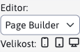

# Page Builder

Page Builder je speciální režim pro úpravu stránek. V tomto režimu se neupravuje celá stránka, ale pouze její vybrané části. Page Builder odděluje úpravu textu/obrázků a úpravu struktury stránky. Tím se zabrání tomu, abyste při úpravě textu omylem odstranili strukturální prvky webové stránky.

  <iframe width="560" height="315" src="https://www.youtube.com/embed/ieaNWY57Exc" title="Přehrávač videí YouTube" frameborder="0" allow="accelerometer; autoplay; clipboard-write; encrypted-media; gyroscope; picture-in-picture" allowfullscreen></iframe>

Režim je třeba aktivovat, připravit bloky a nastavit šablony, postup je uveden v části pro. [webdesignér](../../frontend/page-builder/README.md).

Pokud u šablony nastavíte možnost použít nástroj pro tvorbu stránek, režim nástroje pro tvorbu stránek se načte při otevření webové stránky v editoru.

V případě potřeby je v okně možnost přepnout editor do standardního režimu. Přepnutí z režimu PageBuilder do standardního režimu se pamatuje až do opětovného obnovení stránky. Také další stránka PageBuilder se následně zobrazí ve standardním režimu. Zpět do režimu PageBuilder se musíte přepnout přepnutím výběrového pole nebo obnovením celé stránky.

**Varování:** obsah editorů není během vašich úprav synchronizován. Oba načítají stejný obsah pouze při otevření okna. Nemůžete tedy začít provádět změny v nástroji Page Builder a poté se přepnout do standardního editoru, abyste tam provedli další změny.

## Nastavení šířky sloupců

Editor umožňuje upravit šířku sloupců podle vybraného zařízení. Na panelu nástrojů je vedle přepínače typu editoru možnost nastavit velikost (šířku) zařízení.

- Desktop - je pro šířku větší nebo rovnou 1200 pixelů (nastavuje třídu CSS). `col-xl`).
- Tablet - je navržen pro šířku 768-1199 pixelů (nastavuje třídu CSS `col-md`)
- Mobilní - je pro šířku menší než 768 pixelů (nastavuje třídu CSS). `col-`)

  <iframe width="560" height="315" src="https://www.youtube.com/embed/aru-B1vxReo" title="Přehrávač videí YouTube" frameborder="0" allow="accelerometer; autoplay; clipboard-write; encrypted-media; gyroscope; picture-in-picture" allowfullscreen></iframe>

