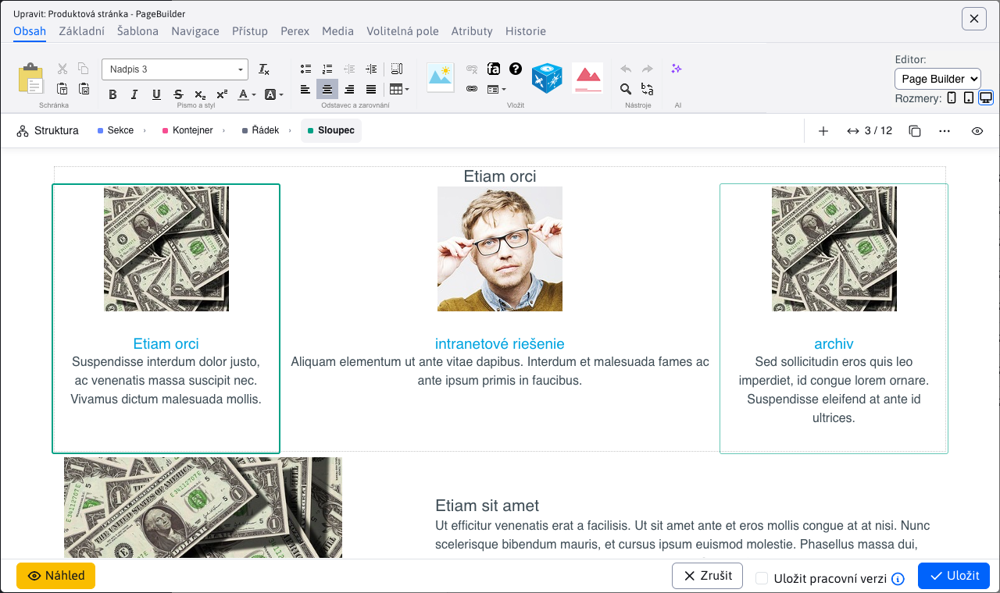
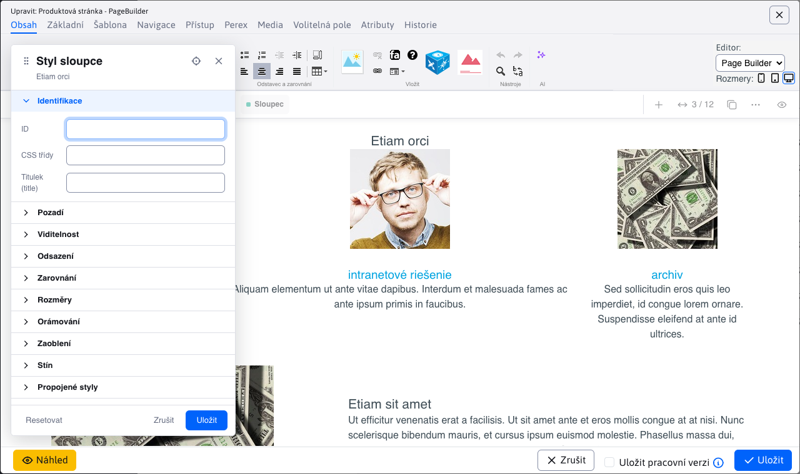
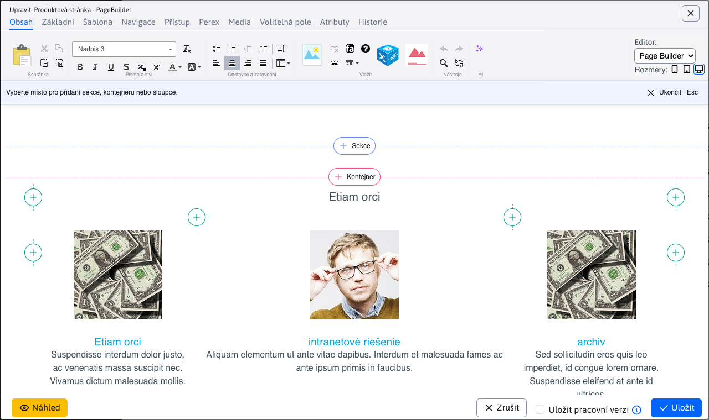
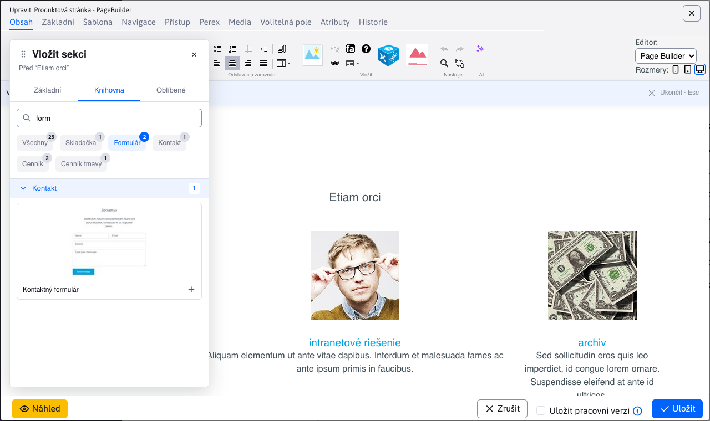
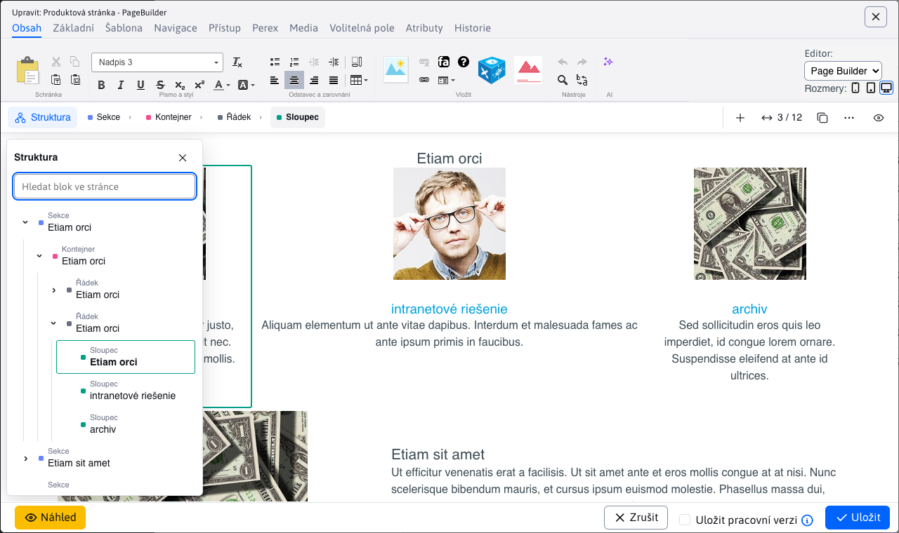
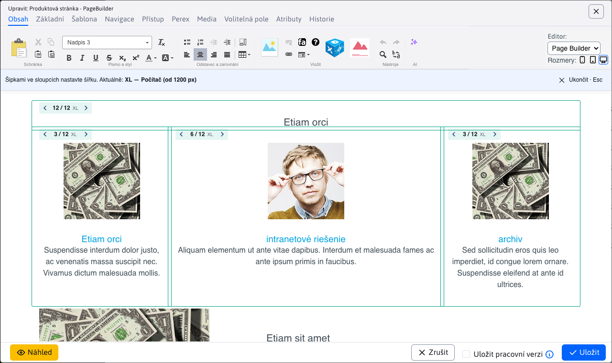

# Page Builder

Page Builder je speciální režim editace stránek. V tomto režimu není editována celá stránka ale jen její vybrané části. Page Builder odděluje editaci textů/obrázků a struktury stránek. Nestane se tak to, že omylem smažete strukturální elementy web stránky při editaci jejího textu.

    <iframe width="790" height="444" src="https://www.youtube.com/embed/B_m_vPPel80" title="YouTube video player" frameborder="0" allow="accelerometer; autoplay; clipboard-write; encrypted-media; gyroscope; picture-in-picture" allowfullscreen></iframe>

Režim je třeba aktivovat, připravit bloky a nastavit šablony, postup je v sekci pro [web designéra](../../frontend/page-builder/README.md).

Při nastavení možnosti použití Page Builder pro šablonu se při otevření webové stránky v editoru načte režim Page Builder.

Ve výběru **Editor** můžete přepnout mezi režimy **Page Builder**, **Standardní** a **HTML**. Zvolený režim se zapamatuje i pro další otevřené Page Builder stránky. Chcete-li opět skládat stránku z bloků, vyberte **Page Builder**.

Při přepnutí se aktuální obsah přenese do zvoleného editoru. Můžete tak například upravit HTML a pokračovat v Page Builderu. Změny stránky uložíte tlačítkem **Uložit**.

## Základní práce

Při použití Page Builder vytváříte web stránku z předem připravených bloků. Při přechodu myší přes obsah se zobrazí jemný poloprůhledný rámeček. Ukazuje hranice bloku, do kterého můžete kliknout; zelený rámeček pomáhá najít části určené k úpravě textu.

Klepnutím do textu vyberete blok a zároveň můžete ihned psát. Vybraný blok má výraznější rámeček a zobrazí se v cestě v horní liště. Přechod myší na jiný blok tento výběr nemění. Během psaní se rámeček výběru zjemní a pomocný rámeček pod myší se skryje.

Ve výchozím nastavení barva označuje typ bloku:

- Modrá barva reprezentuje sekci – hlavní stavební blok, obvykle na celou šířku obrazovky.
- Růžová barva reprezentuje kontejner - obsahuje řádky se sloupci a je obvykle užší než sekce pro lepší čitelnost textů na stránce.
- Šedá barva reprezentuje řádek - pořádá sloupce v kontejneru.
- Zelená barva reprezentuje sloupec nebo samostatný editovatelný text. Sloupec obsahuje typicky text, obrázky nebo aplikace.
- Oranžová barva reprezentuje duplikovatelnou položku, například položku seznamu.

Nástroje vybraného bloku jsou v pevné liště pod CKEditorem. Klikatelná cesta, například **Sekce › Kontejner › Řádek › Sloupec**, umožňuje vybrat nadřazenou část bez hledání rámečků v textu. Na úzké obrazovce otevřete seznam nadřazených bloků tlačítkem vedle aktuálního typu bloku. Lišta obsahuje možnosti:

- Struktura - otevře strom bloků stránky.
- Přidat blok (`+`) - zobrazí místa pro vložení sekce, kontejneru nebo sloupce přímo ve stránce, bez potřeby nejprve označit příslušný blok.
- Šířka sloupce - zobrazuje aktuální šířku, například `3 / 12`, a otevře její nastavení pro zvolenou velikost zařízení.
- Duplikovat vedle - vloží kopii hned za vybraný blok a označí ji.
- Další akce (`…`) - otevře nabídku dalších operací s vybraným blokem.
- Rámečky (ikona oka nebo vrstev) - přepíná rozsah zobrazených rámečků.

V nabídce **Další akce** naleznete podle typu vybraného bloku:

- Styl - nastavení obrázku pozadí, barev, zarovnání, odsazení a dalších vlastností.
- Vložit blok před / Vložit blok za - otevře knihovnu pro stejný typ bloku na zvolené straně výběru.
- Posunout výše / Posunout níže - posune blok o jednu pozici v pořadí.
- Přesunout / Duplikovat - zobrazí dostupná cílová místa ve stránce; kliknutím vyberete, kam blok přesunout nebo vložit jeho kopii. Výběr místa můžete zrušit klávesou **Escape**.
- Přidat do oblíbených - uloží blok mezi vaše oblíbené bloky v knihovně.
- Smazat - smaže označený blok.

Nabídka obsahuje pouze operace podporované vybraným typem. Běžný řádek slouží k orientaci; duplikovatelný řádek a položka podporují přesun, duplikování a smazání. Samostatný editovatelný text nemá nástroje pro úpravu struktury. Přesun duplikovatelných prvků zůstává omezen na kompatibilní sourozence téhož rodiče.

## Nastavení stylu

Přes **Další akce → Styl** otevřete kompaktní okno vlastností. Název, například **Styl sloupce**, a text pod ním označují upravovaný blok. Tlačítko **Najít na stránce** posune obsah k tomuto bloku a krátce jej zvýrazní. Okno můžete přesunout tažením za hlavičku.

Vlastnosti jsou uspořádány do rozbalovacích skupin: **Identifikace**, **Pozadí**, **Viditelnost**, **Odsazení**, **Zarovnání**, **Rozměry**, **Orámování**, **Zaoblení**, **Stín**, **Propojené styly** a **Z-index**. Po otevření je rozbalena **Identifikace** s ID, CSS třídami a titulkem. Web designér může seznam i pořadí skupin přizpůsobit šabloně.

Můžete rozbalit více skupin současně. Jejich sbalení nerozpracované hodnoty nezahodí. Při posouvání vlastností zůstává hlavička i spodní tlačítka dostupná. Obrázek pozadí vyberete tlačítkem při jeho adrese. Při odsazení, orámování a zaoblení můžete propojit všechny čtyři hodnoty nebo dvojice; propojené hodnoty se přebírají z prvního pole příslušné skupiny.

Změny průběžně vidíte ve stránce. Tlačítko **Uložit** v tomto okně potvrdí styl v rozpracované stránce; celou stránku následně uložíte hlavním tlačítkem **Uložit** v editoru. **Zrušit**, křížek v hlavičce nebo **Escape** zavřou okno a vrátí nepotvrzené úpravy stylu. **Resetovat** odstraní uživatelský styl daného bloku, aby se opět uplatnily styly šablony.

## Vkládání bloků

Nejrychlejší postup přidání bloku nevyžaduje označení stávající sekce ani sloupce:

1. Klepněte na **Přidat blok** (`+`) v horní liště. Nástroje a cestu k bloku dočasně nahradí modrý pomocník s pokynem pro výběr místa a tlačítkem **Ukončit · Esc**.
2. Ve stránce klikněte na plus na místě, kam chcete nový blok vložit. Modré pásy označují vložení sekce, růžové kontejneru a zelené plus sloupce. Místa jsou před prvním blokem, mezi sousedními bloky a za posledním blokem. Název u pasu a popis tlačítka pomáhají určit typ i pozici.
3. V otevřené knihovně klepněte na kartu požadovaného bloku. Knihovna nabízí příslušný typ a v horní části připomíná místo vložení. Klepnutí blok rovnou vloží; další potvrzení není nutné. Po vložení se režim ukončí, nový blok se označí a můžete upravovat jeho obsah.

Knihovnu můžete otevřít i pro označený blok přes **Další akce → Vložit blok před / Vložit blok za**. Obsahuje karty:

- Základní – jednoduché bloky různých velikostí.
- Knihovna - bloky vytvořené pro vaši web stránku.
- Oblíbené - bloky, které jste označili jako oblíbené.

Knihovna se otevírá jako úzké okno nad stránkou. Hlavička uvádí například **Vložit sekci** a pod ní místo vložení. Tažením za hlavičku můžete okno přesunout. Zavřete jej křížkem vpravo nahoře nebo klávesou **Escape**.

V kartě **Knihovna** jsou bloky seskupeny do kategorií s počtem bloků. Klepnutím kategorii rozbalíte; otevřená zůstává vždy pouze jedna. Karty zobrazují název a náhled v původním poměru stran. Klepnutím na náhled nebo název vložíte blok do stránky.

Pole **Hledat blok…** filtruje podle názvu a lze jej kombinovat s jedním štítkem. Při filtrování se ponechá otevřená vyhovující kategorie nebo se otevře první s výsledkem. Počty u kategorií zohledňují filtr, počty u štítků označují celkový počet bloků s daným štítkem. **Všechny** zruší jen štítek a ponechá hledaný text. Pokud se nic nenajde, tlačítko **Vyčistit filtry** zruší text i štítek. Při posouvání výsledků zůstávají vyhledávání a štítky dostupné.

Názvy a štítky bloků definuje web designér v souboru `pagebuilder.properties` při [vytváření bloků](../../frontend/page-builder/blocks.md#název-a-značky-bloku). Jsou součástí knihovny dané šablony a nemusí se měnit s jazykem administrace. V kartě **Oblíbené** můžete uložený blok odstranit tlačítkem při jeho názvu; odstranění vyžaduje potvrzení.

Na konci stránky se zobrazuje ikona `+` pro snazší přidání nové sekce.

Při zapnutí režimu vkládání se plynule rozbalí dočasné mezery bez odsunutí viditelných míst. Šířky sloupců se nemění: plus se zobrazují v mezerách mezi nimi, při zalomení mezi řádky a při nedostatku prostoru nad obsahem. Rámečky výběru i rámečky pod myší se během výběru místa skryjí.

Zavřením knihovny se vrátíte na vybrané plus. Režim vkládání ukončíte tlačítkem **Ukončit · Esc** v nápovědě nebo klávesou **Escape**. Mezery se plynule sbalí, obnoví se běžná lišta a fokus se vrátí na `+`. Klepnutí do obsahu ukončí režim a vybere daný blok. Pokud máte v systému nastaveno omezení animací, zobrazení i skrytí proběhne okamžitě. Pomocné pásy se neukládají ani nezobrazují v náhledu.

## Struktura stránky a klidné zobrazení

Tlačítko **Struktura** otevře strom bloků s názvy odvozenými z jejich obsahu. Bloky můžete vyhledat podle názvu nebo typu. Klepnutí na položku označí příslušný blok, posune stránku na jeho místo a rozbalí zavřenou větev. Opakované kliknutí na položku nechá větev otevřenou; šipkou vedle názvu ji můžete rozbalit nebo sbalit beze změny výběru.

Vybraná položka má tenký rámeček v barvě svého typu, který odpovídá rámečku ve stránce. Panel se otevírá nad obsahem a nemění šířku ani zalomení stránky. Na úzké obrazovce se po výběru zavře.

Skryté bloky mají označení **Skrytý**. Jejich výběr nemění viditelnost ani aktivní kartu stránky. Strom nepřidává do HTML nové názvy nebo identifikátory a neumožňuje přesun tažením myší. K přesunu použijte akce horní lišty.

Ve stromu se pohybujete šipkami nahoru a dolů. Větve otevíráte a zavíráte šipkami doprava a doleva. Klávesa **Enter** nebo mezerník vybere položku a rozbalí její zavřenou větev. **Escape** zavře otevřenou nabídku či panel, ukončí nastavování šířky nebo zruší výběr místa přesunu či vkládání.

Tlačítko s ikonou oka postupně přepíná tři režimy:

- **Rámeček vybraného bloku** (výchozí) - zvýrazní výběr a při přechodu myší jemně naznačí další blok.
- **Žádné rámečky** (přeškrtnuté oko) - skryje výběr i pomocné rámečky pod myší.
- **Rámečky celé hierarchie aktivního bloku** (ikona vrstev) - zobrazí i nadřazenou sekci, kontejner a řádek. Hierarchii ukáže i při přechodu myší, jemnějšími čarami. Společné nadřazené bloky nezvýrazňuje dvakrát.

Prohlížeč si volbu pamatuje i po opětovném otevření editoru. Lišta, panel Struktura a zalomení obsahu se přepínáním nemění. V **Náhledu** ani na uložené stránce se pomocné rámečky a ovládací prvky nezobrazují.

## Nastavení šířky sloupců

Editor umožňuje nastavit odlišnou šířku sloupce pro mobil, tablet a počítač:

1. Při výběru **Editor** zvolte ikonou velikost zařízení.
2. Klepněte do požadovaného sloupce a v liště vyberte **Šířka sloupce**, například `3 / 12`. Nástroje a cestu k bloku nahradí modrý pomocník podobně jako při vkládání bloků. Vysvětluje právě upravovaný rozměr, například **MD — Tablet (768–1199 px)**.
3. Šipkami uvnitř jednotlivých sloupců změňte jejich šířku. Hodnota označuje počet dílů mřížky; ve výchozí 12dílné mřížce je `3 / 12` čtvrtina a `12 / 12` celá šířka. Dostupná je i hodnota `auto` pro automatické přizpůsobení.
4. Režim ukončíte tlačítkem **Ukončit · Esc** v nápovědě nebo klávesou **Escape**. Obnoví se běžná lišta i původní nastavení rámečků.

Zelené rámečky během nastavování označují všechny sloupce v daném kontejneru, jejichž šířku můžete měnit, i když máte běžné rámečky skryté. Ovladače s jemným zeleným pozadím mají vyhrazené místo uvnitř svého sloupce nad jeho obsahem. V úzkých sloupcích se hodnota zobrazí nad šipkami. Po ukončení režimu se místo pro ovladače uvolní.

Zařízení můžete přepnout i během nastavování. Ovladače i nápověda se aktualizují a další změny šířky se použijí pro zvolené zařízení.

Zkratka vedle hodnoty šířky označuje právě upravovanou velikost zařízení. Výchozí nastavení jsou:

| Zařízení | Označení | Šířka náhledu | CSS třída |
| --- | --- | --- | --- |
| Počítač | `XL` | od 1200 px | `col-xl-` |
| Tablet | `MD` | 768–1199 px | `col-md-` |
| Mobil | bez zkratky | méně než 768 px | `col-` |

Šablona může používat vlastní označení a hranice rozlišení. V takovém případě nápověda zobrazí označení podle šablony, například `SM`, bez výchozích hranic uvedených v tabulce.

    <iframe width="560" height="315" src="https://www.youtube.com/embed/aru-B1vxReo" title="YouTube video player" frameborder="0" allow="accelerometer; autoplay; clipboard-write; encrypted-media; gyroscope; picture-in-picture" allowfullscreen></iframe>

## Rozdělení sloupce

Funkci Rozdělit sloupec vyvoláte pomocí kliknutí na `+` ve žluté liště a zvolením možnosti Blok. Následně v kartě Základní zvolíte možnost Rozdělit sloupec. Funkce umožňuje rychlé rozdělení sloupce bez nutnosti vkládat nový sloupec a přesouvat obsah. Umožní vám vkládat nové komplexní bloky. do dlouhého textového sloupce.
