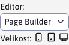

# Page Builder

Page Builder je speciální režim editace stránek. V tomto režimu není editována celá stránka ale jen její vybrané části. Page Builder odděluje editaci textů/obrázků a struktury stránek. Nestane se tak to, že omylem smažete strukturální elementy web stránky při editaci jejího textu.

  <iframe width="560" height="315" src="https://www.youtube.com/embed/ieaNWY57Exc" title="YouTube video player" frameborder="0" allow="accelerometer; autoplay; clipboard-write; encrypted-media; gyroscope; picture-in-picture" allowfullscreen></iframe>

Režim je třeba aktivovat, připravit bloky a nastavit šablony, postup je v sekci pro [web designéra](../../frontend/page-builder/README.md).

Při nastavení možnosti použití Page Builder pro šablonu se při otevření webové stránky v editoru načte režim Page Builder.

V případě potřeby je v okně možnost přepnout editor do standardního režimu. Přepnutí z PageBuilder režimu na režim Standardní se zapamatuje do znovu obnovení stránky. I jiná PageBuilder stránka se následně zobrazí ve standardním režimu. Přepnutí zpět na režim PageBuilder musíte provést přepnutím výběrového pole nebo obnovením celé stránky.

!>**Upozornění:** obsah editorů není během vašich úprav synchronizován. Oba načítají stejný obsah pouze při otevření okna. Nemůžete tedy začít provádět změny v Page Builder a pak se přepnout do standardního editoru a tam provést další změny.

## Nastavení šířky sloupců

Editor umožňuje nastavit šířky sloupce podle zvoleného zařízení. V nástrojové liště u přepínače typu editoru je možnost nastavit velikost (šířku) zařízení.

- Desktop - je určen pro šířku větší/rovnou než 1200 bodů (nastavuje CSS třídu `col-xl`).
- Tablet - je určen pro šířku 768-1199 bodů (nastavuje CSS třídu `col-md`)
- Mobil - je určen pro šířku menší než 768 bodů (nastavuje CSS třídu `col-`)

  <iframe width="560" height="315" src="https://www.youtube.com/embed/aru-B1vxReo" title="YouTube video player" frameborder="0" allow="accelerometer; autoplay; clipboard-write; encrypted-media; gyroscope; picture-in-picture" allowfullscreen></iframe>

