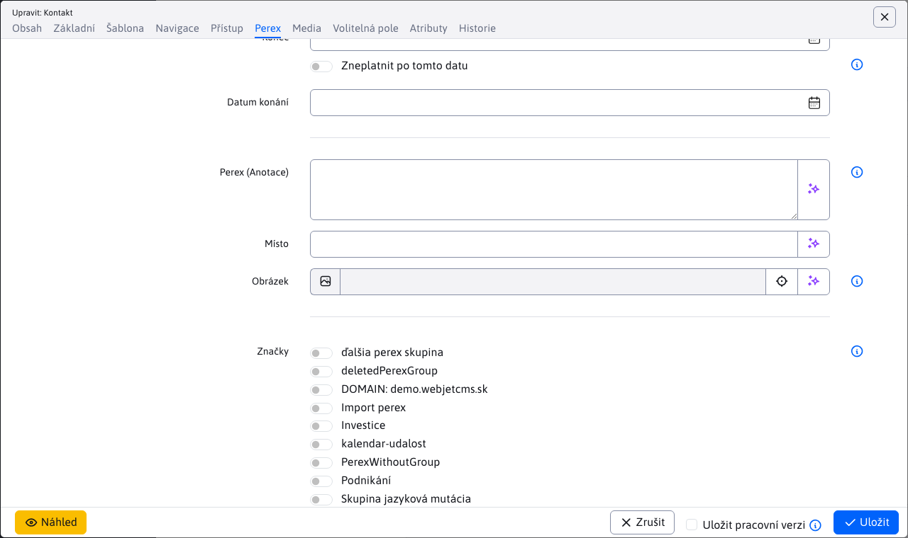

# Značky

Pomocí značek (původní název **perex skupiny**) nebo anglicky `hashtag` můžete označit klíčová slova ve web stránce. V aplikaci novinky lze použít filtrování novinek podle značek.

Pro přístup ke jménu položce Web stránky - značky potřebujete mít právo **Web stránky - Značky**, jinak se menu položka nezobrazí.


## Vytváření značek

Editor pro vytvoření značek je jednoduchý a obsahuje pouze 2 karty.

### Karta Základní

Karta obsahuje následující pole:
- **Název skupiny**, unikátní název značky, je povinen.
- **Zobrazit pro**, nastavení omezení zobrazení značek pouze pro určité adresáře web stránek.


### Karta Překlady

Karta překlady slouží k **volitelné** zadefinování názvu značky pro jednotlivé jazykové mutace. Pokud jsou definovány použijí se ve web stránce namísto hodnoty **Název skupiny**.


### Karta Volitelná pole

Karta **Volitelná pole** obsahuje volně použitelná pole. Více informací k jejich konfiguraci naleznete v dokumentaci [volitelná pole](../../frontend/webpages/customfields/README.md).


## Web stránky

Značky se zobrazují v editoru stránek v listu Perex, kde je lze jednoduše webové stránce přiřadit:



Značky se standardně zobrazují jako zaškrtávací pole, pokud je ale definováno více než 30 značek, zobrazí se z důvodu přehlednosti jako vícenásobné výběrové pole. Hodnota 30 lze změnit v konf. proměnné `perexGroupsRenderAsSelect`.

!> **Upozornění:** název značky (perex skupiny) se mění v závislosti na zvoleném jazyku. Pokud taková jazyková mutace existuje, zobrazí se. Pokud ne, zobrazí se hodnota z pole **Název skupiny**.

### Duplicita názvů značek

V případě, že vytvoříte více značek se stejnou jazykovou mutací názvu, v editoru web stránky se při výběru značky zobrazí je **ID** a **Název skupiny** pro rozlišení. Pokud značka má pouze **Název skupiny** nebo jazyková mutace je stejná jako **Název skupiny**, navíc se zobrazí pouze **ID**.


!> **Upozornění:** hodnoty se porovnávají bez vlivu diakritiky a velkých/malých písmen

### Použití

Značky můžete použít například v seznamu novinek. Ukázka šablony novinek, která zobrazí jméno perex skupiny dané novinky a podle ID skupiny nastaví CSS styl `color-ID` pro nastavení barvy perex skupiny. Automaticky podle jazyka stránky použije jazykovou variantu značky (je-li definována):

```velocity
<section class="md-news-subpage">
    <div class="container">
        #foreach($doc in $news)
            #if ($velocityCount % 3 == 1) <div class="row"> #end
            <div class="col-sm-4 portfolio-item">
                <a href="$context.link($doc)">
                    #foreach($perexGroup in $doc.perexGroupsList)
                        <span class="tag color$perexGroup.perexGroupId">$perexGroup.perexGroupName</span>
                    #end
                </a>
                <h3><a href="$context.link($doc)">$doc.title</a></h3>
                <p>$doc.perexPre</p>
            </div>
            #if ($velocityCount % 3 == 0) </div> #end
        #end
    </div>
</section>
```


