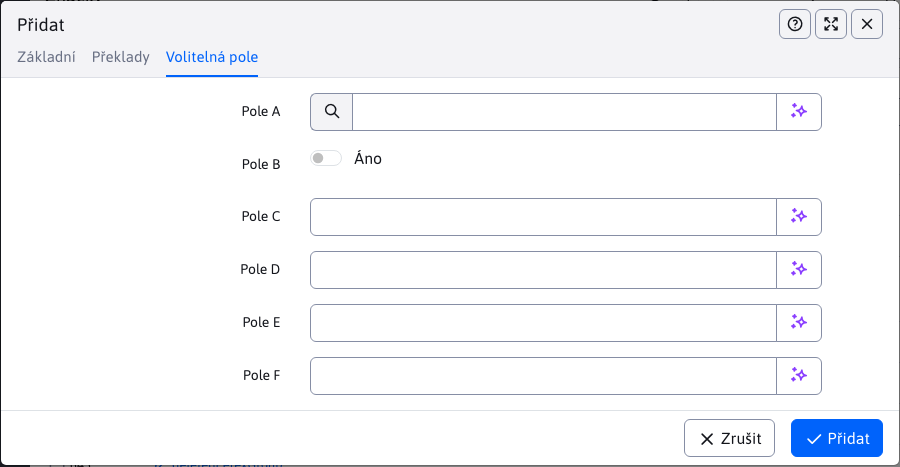

# Štítky

Pomocí značek (původní název **skupiny perex**) nebo anglicky `hashtag` můžete na webové stránce označit klíčová slova. V aplikaci Zprávy můžete filtrovat zprávy podle značek.

Pro přístup k položce nabídky Webové stránky - značky je třeba mít právo **Webové stránky - Značky**, jinak se položka nabídky nezobrazí.


## Vytváření značek

Editor pro vytváření značek je jednoduchý a obsahuje pouze 2 karty.

### Základní karta

Karta obsahuje následující pole:
- **Název skupiny**, je vyžadován jedinečný název značky.
- **Zobrazit pro**, nastavené na omezení zobrazení značek pouze na určité adresáře webových stránek.


### Karta Překlady

Karta Překlady se používá pro **Volitelně** definování názvu značky pro každou jazykovou mutaci. Pokud jsou definovány, použijí se na webové stránce místo hodnoty **Název skupiny**.


### Karta Volitelná pole

Karta **Volitelná pole** obsahuje volně použitelná pole. Další informace o jejich konfiguraci naleznete v dokumentaci. [volitelná pole](../../frontend/webpages/customfields/README.md).



## Webové stránky

Značky se zobrazují v editoru stránky v listu Perex, kde je lze snadno přiřadit webové stránce:


Značky se ve výchozím nastavení zobrazují jako zaškrtávací políčka, ale pokud je definováno více než 30 značek, zobrazí se pro přehlednost jako více výběrových polí. Hodnotu 30 lze změnit v proměnné conf. `perexGroupsRenderAsSelect`.

!> **Varování:** název značky (skupina perex) se liší v závislosti na zvoleném jazyce. Pokud taková jazyková mutace existuje, zobrazí se. Pokud ne, zobrazí se hodnota z pole **Název skupiny**.

### Použití

Značky můžete použít například v seznamu novinek. Příklad šablony zpravodaje, která zobrazuje název diskusní skupiny a nastavuje styl CSS podle ID skupiny. `color-ID` pro nastavení barvy skupiny perex. Automaticky použije jazykovou variantu značky (je-li definována) podle jazyka stránky:

```velocity
<section class="md-news-subpage">
    <div class="container">
        #foreach($doc in $news)
            #if ($velocityCount % 3 == 1) <div class="row"> #end
            <div class="col-sm-4 portfolio-item">
                <a href="$context.link($doc)">
                    #foreach($perexGroup in $doc.perexGroupsList)
                        <span class="tag color$perexGroup.perexGroupId">$perexGroup.perexGroupName</span>
                    #end
                </a>
                <h3><a href="$context.link($doc)">$doc.title</a></h3>
                <p>$doc.perexPre</p>
            </div>
            #if ($velocityCount % 3 == 0) </div> #end
        #end
    </div>
</section>
```


