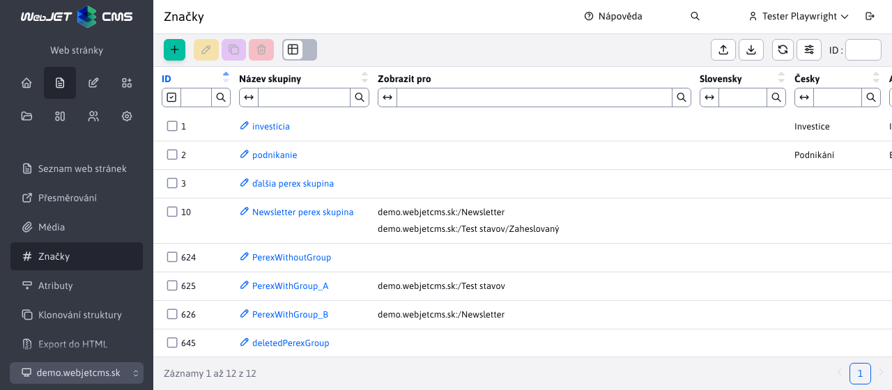

# Štítky

Pomocí značek (původní název **skupiny perex**) nebo anglicky `hashtag` můžete na webové stránce označit klíčová slova. V aplikaci Zprávy můžete filtrovat zprávy podle značek.

Můžete omezit zobrazení značek pouze pro určité adresáře webových stránek.

Pro přístup k položce nabídky Webové stránky - značky je třeba mít právo **Webové stránky - Značky**, jinak se položka nabídky nezobrazí.

Značky se zobrazují v editoru stránky v listu Perex, kde je lze snadno přiřadit webové stránce:

