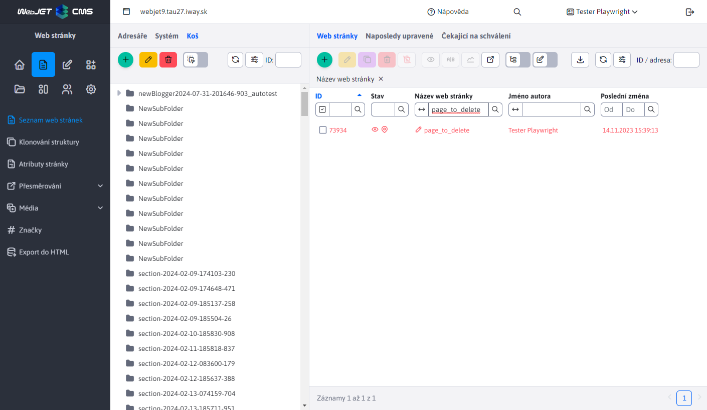
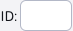
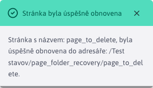
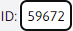
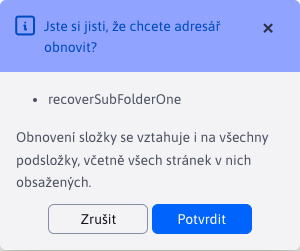
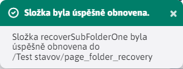

# Obnovení z koše

Obnovení webových stránek a složek je proces, který lze provést pouze pro ty stránky/složky, které se nacházejí ve složce. **Košík**. Pro tuto akci existuje speciální ikona .

Technicky se obnovení webové stránky provádí načtením její verze z historie.

## Obnovení webových stránek

Obnovená webová stránka se přesune ze složky Koš do poslední složky, ve které byla před odstraněním.

Pro úspěšné obnovení webových stránek musí platit následující podmínky:
- V koši není vybrána žádná složka. To si můžete ověřit zkontrolováním pole ID  kde je identifikátor aktuálně vybrané složky prázdný. Je to proto, že pokud byla stránka odstraněna s celou složkou, nemáme ji kam obnovit. Proto je obnova povolena pouze pro stránky, které nebyly odstraněny se složkou, a nespadají tedy do žádné podsložky složky Koš.
- Smazaná webová stránka má v seznamu historie předchozí verzi. Taková verze historie je potřebná k tomu, abyste věděli, odkud byla stránka odstraněna - v jaké složce byla naposledy. Pokud smazaná stránka takovou historickou verzi nemá (například byla smazána pomocí aplikace pro mazání dat), obnovení stránky nebude možné.
- Musíte mít oprávnění upravovat cílovou složku, do které má být webová stránka obnovena. Pokud toto právo nemáte, k obnovení nedojde a budete vyzváni, abyste kontaktovali správce, který může stránku obnovit.

Pokud byly splněny všechny požadavky, označte stránku zaškrtnutím možnosti v řádku vedle jejího ID a klikněte na tlačítko. . Po obnovení budete informováni o adrese cílové složky, do které byla stránka obnovena.

## Obnovení složky

Obnovená složka je přesunuta z koše do poslední složky nebo do složky. `Koreňového priečinka` pokud složka nemá zaznamenanou historii. Obnoví se také všechny podsložky a všechny stránky z těchto složek. Stránky budou nastaveny na zobrazení podle historie stránek nebo na hodnotu Ano, pokud stránka nemá žádnou historii.

Pro úspěšné obnovení složky musí platit následující podmínky:
- V koši musí být vybrána složka. Ověříte to zaškrtnutím pole ID  kde identifikátor aktuálně vybrané složky není prázdný.

Po výběru složky a stisknutí ikony  musíte nejprve potvrdit akci obnovení.

Potvrzením se spustí akce obnovení a na konci akce obnovení budete informováni o jejím úspěšném dokončení. U hluboké struktury může obnovení trvat několik minut.

### Vlastnost, která se zobrazí po obnovení

Protože chceme obnovit webové stránky, které byly v obnovených složkách, do původního stavu, musíme jim nastavit správnou hodnotu možnosti **Zobrazit**. Možnost webových stránek **Zobrazit** byl při odstranění složky automaticky zakázán, čímž se webové stránky na webu skryly (to platí pro všechny webové stránky, i pro ty z adresářů).

Při obnovení se hodnota možnosti **Zobrazit** nastavit podle následujících pravidel:
- je načten aktuální záznam historie pro každou obnovovanou webovou stránku a jeho hodnota. **Zobrazit** je nastaven podle vzoru z historie
- pokud pro tuto stránku neexistuje žádný aktuální záznam historie, použije se poslední neaktualizovaný záznam historie.
- pokud stránka nemá historii, její hodnota **Zobrazit** se automaticky zapne

**Dejte si pozor na tento rozdíl:**

- při obnovení webové stránky se stránka **NELZE obnovit** bez záznamu v historii, protože nevíme, kde se tato stránka nacházela.
- po obnovení složky se webová stránka **MŮŽE být obnoven** i bez záznamu v historii, protože víme, kde se nachází (jeho umístění v obnovované složce je jasné), a záznam v historii používáme pouze k nastavení hodnoty možnosti **Zobrazit**.
