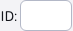
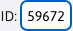
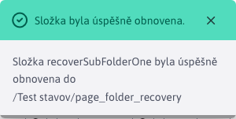

# Obnovení z koše

Obnovení web stránek a složek je proces, který lze provést pouze na těch stránkách/složkách, které jsou umístěny ve složce **Koš**. K této akci slouží speciální ikona .

Technicky obnovení web stránky je provedeno získáním její verze z historie.

## Obnovení web stránky

Obnovená web stránka se přesune ze složky Koš do poslední složky, kde se nacházela před vymazáním.

Pro úspěšné obnovení web stránky musí platit:
- Není zvolena žádná složka v Koši. Ověříte si to tak, že pole ID  kde je identifikátor právě zvolené složky je prázdný. Důvodem je fakt, že pokud stránka byla vymazána is celou složkou, tak nemáme kam tuto stránku obnovit. Obnovení je proto povoleno pouze u stránek, které nebyly vymazány se složkou a tudíž nespadají pod žádnou podsložku složky Koš.
- Vymazaná web stránka má předchozí verzi v seznamu historie. Taková historická verze je nutná, abychom věděli, odkud byla stránka vymazána - v jaké složce se naposledy nacházela. Pokud vymazaná stránka takovou historickou verzi nemá (například je vymazána přes aplikaci mazání dat), obnovení stránky nebude možné.
- Musíte mít právo na editaci cílové složky, do které se má web stránka obnovit. V případě, že toto právo nemáte, obnovení nenastane a budete vyzváni ke kontaktování administrátora, který stránku může obnovit.

Pokud byly splněny všechny požadavky označte stránku zaškrtnutím možnosti v řádku u jejího ID a klepněte na tlačítko . Po obnovení budete informováni o adrese cílové složky, do které byla stránka obnovena.

## Obnovení složky

Obnovená složka se přesune z Koše do poslední složky nebo do `Koreňového priečinka` pokud složka nemá zaznamenanou žádnou historii. Obnoví se také všechny podsložky a všechny stránky z těchto složek. Stránkám se nastaví možnost zobrazovat podle historie stránky, nebo na Ano pokud stránka nemá historii.

Pro úspěšné obnovení složky musí platit:
- Musí být zvolena složka v Koši. Ověříte si to tak, že pole ID  kde je identifikátor právě zvolené složky není prázdný.

Po označení složky a stisknutí ikony  musíte nejprve potvrdit akci obnovení.

Potvrzením se spustí akce obnovení a na jejímž konci budete seznámeni s jejím úspěšným ukončením. Při hluboké struktuře může obnovení trvat i několik minut.

### Vlastnost zobrazovat po obnovení

Jelikož webové stránky, které se nacházely v obnovených složkách, chceme uvést do původního stavu, musíme jim nastavit správnou hodnotu možnosti **Zobrazovat**. Možnost web stránek **Zobrazovat** se při vymazání složky automaticky vypnula, čímž se web stránky skryly na web sídle (platí to pro všechny web stránky i ty z adresářů).

Při obnovení, se hodnota možnosti **Zobrazovat** nastaví podle následujících pravidel:
- získá se aktuální záznam z historie pro každou obnovovanou web stránku, a její hodnota **Zobrazovat** se nastaví podle vzoru z historie
- pokud neexistuje aktuální záznam v historii pro tuto stránku, využije se nejnovější neaktuální záznam z historie
- pokud stránka nemá žádný záznam v historii, její hodnota **Zobrazovat** se automaticky zapne

**Dejte si pozor na tento rozdíl:**

- při Obnovení web stránky, se stránka **NEDÁ obnovit** bez záznamu v historii, jelikož nevíme, kde se tato stránka nacházela.
- při Obnovení složky, se web stránka **DÁ obnovit** i bez záznamu v historii, nakolik víme kde se nachází (její poloha v obnovované složce je jasná) a záznam z historie používáme výhradně k nastavení hodnoty možnosti **Zobrazovat**.
