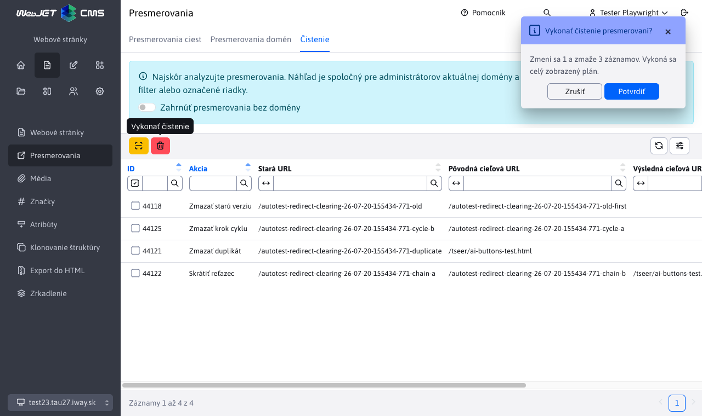
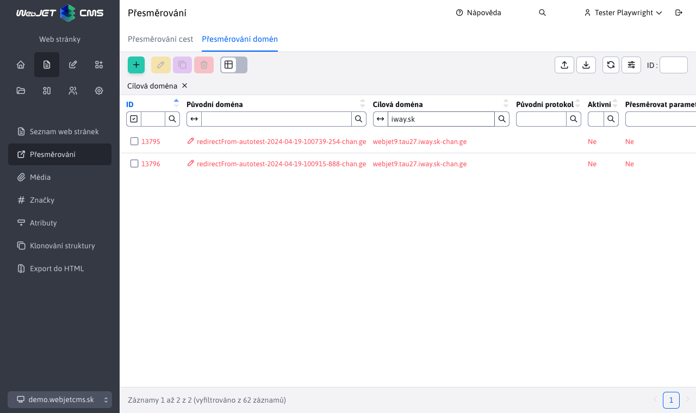
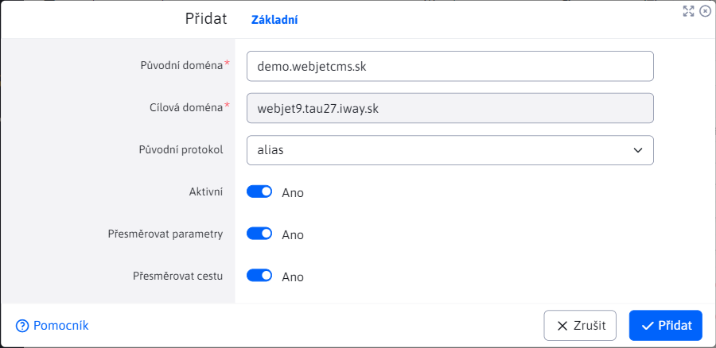

# Přesměrování

## Přesměrování cest

Zobrazuje seznam existujících přesměrování, které se provedou, pokud zadaná URL adresa neexistuje. Přesměrování mohou vznikat automaticky, více v části [Automatické a uživatelem vytvořené přesměrování](#automatické-a-uživatelem-vytvořené-přesměrování).

Klepnutím na ikonu **Přidat** lze definovat nové přesměrování. Podporováno je také přesměrování včetně parametrů v URL adrese. Nejprve se hledá shoda včetně parametrů, pokud se nenajde, systém se pokusí najít shodu bez zadaných parametrů.

Hodnota pole [přesměrovací kód](https://developer.mozilla.org/en-US/docs/Web/HTTP/Redirections) určuje typ přesměrování, nejčastěji se používají následující kódy:

- `301` trvalé přesměrování, vyhledávače by si měly upravit adresu stránky na tuto novou hodnotu.
- `302` dočasné přesměrování.

Můžete také nastavit platnost přesměrování pro určitá data, zadáním buď začátku, nebo konce, nebo obou dat. Přesměrování, která již nejsou časově platná, se zobrazí červeně v tabulce. Do pole poznámka můžete zadat informaci, k čemu přesměrování slouží.

### Automatické a uživatelem vytvořené přesměrování

Přesměrování vznikají automaticky při změně URL adresy existující stránky nebo při změně adresářové struktury. Automatické vytváření přesměrování řídí konfigurační proměnná `editorDisableAutomaticRedirect`:

- `false` - ​​výchozí hodnota, WebJET CMS automaticky vytvoří přesměrování ze staré URL adresy na novou.
- `true` - ​​automatické vytváření přesměrování je vypnuto.

Nastavení konfigurační proměnné nemá vliv na uživatelem vytvářené přesměrování. Automaticky vytvořená přesměrování jsou v tabulce odlišena šedou barvou písma. Pomocí přepínače **Vytvořené uživatelem** nad tabulkou můžete zobrazit pouze uživatelem vytvořené přesměrování.

!> **Upozornění:** Přesměrování existující před aktualizací databáze se považují za automaticky vytvořená. V editoru přesměrování můžete hodnotu pole **Vytvořené uživatelem** změnit a stávající přesměrování tak podle potřeby označit jako uživatelem vytvořené.

### Přesměrování přes regulární výrazy

Pomocí regulárních výrazů lze nastavit složitější přesměrování celých větví URL adres (např. po migraci starého webu). Přesměrování přes regulární výraz se zadávají s prefixem `regexp:`.

Původní URL je tedy možné zadat ve formátu `regexp:^\/thisiswhere\/oldfiles\/(.+)` které se bude korektně překládat na novou URL is provedením/přenesením skupin na nové URL ve tvaru `/thisiswhere/myfilesmovedto/$1`

Provede se přesměrování např. `/thisiswhere/oldfiles/page.html` na `/thisiswhere/myfilesmovedto/page.html`.

## Čištění přesměrování

Karta **Čištění** umožňuje zkontrolovat přesměrování vybrané domény, odstranit nepotřebné záznamy a zkrátit řetězce přesměrování.

Čištění se provádí ve dvou krocích, abyste si všechny navrhované změny mohli nejprve prohlédnout:

1. **Analýza přesměrování**
2. **Provedení čištění**

!> **Upozornění:** Pro jednu doménu může současně probíhat pouze jedna analýza nebo jedno čištění. Pokud již operaci spustil jiný administrátor, systém další spuštění nepovolí, dokud se nedokončí probíhající operace. V takovém případě se zobrazí upozornění, že je třeba počkat na dokončení probíhající operace.

### Analýza přesměrování

Analýza přesměrování se spustí klepnutím na tlačítko <button class="btn btn-sm btn-warning" type="button"><i class="ti ti-scan"></i></button> v sekci **Čištění**. Během analýzy se vyhodnotí všechna stávající přesměrování a navrhnou se změny, které lze provést.

V náhledu analýzy přesměrování se pro každý záznam zobrazí právě jedna z následujících akcí:

- **Smazat starou verzi** - odstraní starý cíl URL adresy, který byl nahrazen novějším cílem.
- **Smazat krok cyklu** - při cyklickém přesměrování, například `/a -> /b -> /a`, odstraní nově vytvořený krok, který cyklus uzavírá.
- **Smazat duplikát** - při stejných přesměrováních ponechá nejstarší záznam a novější duplikáty odstraní.
- **Zkrátit řetězec** - upraví pouze cílovou URL adresu tak, aby například řetězec `/a -> /b -> /c` zkrátil na `/a -> /c`.

**Ignorované přesměrování:**

- přesměrování zadané přes **regulární výraz** s prefixem `regexp:`
- přesměrování s nastaveným **datem zveřejnění**
- přesměrování s nastaveným **koncem platnosti**

Souhrnná zpráva po analýze uvádí i počet takových ignorovaných záznamů.

Přesměrování bez domény tvoří samostatnou skupinu a nikdy se nekombinují s přesměrováním pojmenované domény. Ve výchozím nastavení se analyzuje pouze aktuálně zvolená pojmenovaná doména. Chcete-li do analýzy přidat i samostatnou skupinu přesměrování bez domény, označte možnost **Zahrnout přesměrování bez domény**.

Výsledek analýzy se na 60 minut uloží jako společný plán pro aktuální doménu. Stejný náhled proto vidí všichni administrátoři s právem na správu přesměrování a čištění může provést kterýkoli z nich.

### Provedení čištění

Provedení čištění se spustí klepnutím na tlačítko <button class="btn btn-sm btn-danger" type="button"><i class="ti ti-trash"></i></button> v sekci **Čištění**. Akce je dostupná pouze pokud **existuje analýza** pro aktuální doménu. Během provádění se změny uloží a přesměrování se upraví podle navrženého plánu.

Při provedení se použije přesně uložený plán bez nové analýzy. Záznamy, které byly mezitím odstraněny nebo již nejsou dostupné, se přeskočí a jejich počet se zobrazí ve výsledné zprávě. Pokud provedení selže, změny se neuloží a plán zůstane dostupný pro opakování.

## Přesměrování domén

V sekci **Přesměrování domén** můžete definovat přesměrování požadavků celé domény (např. přesměrování `domena.sk` na `www.domena.sk`).

V dialogovém okně pro definici domény můžete zadat následující hodnoty:

- **Původní doména** - název domény, kterou chcete přesměrovat, například. `domena.sk`.
- **Cílová doména** - název domény, na kterou chcete požadavek přesměrovat. `www.domena.sk`, doporučujeme zadat i `http/s` prefix `https://www.domena.sk`.
- **Původní protokol** - určuje, pro jaký protokol se přesměrování použije:
  - **prázdná hodnota** - přesměrování se použije bez ohledu na protokol.
  - **http** - přesměrování se použije pouze, pokud je původní protokol `http` (nastavte, chcete-li přesměrovat http verzi na zabezpečenou `https` verzi, v tom případě i zadejte do pole Cílová doména doménu s protokolem `https://` na začátku).
  - **https** - přesměrování se použije pouze, pokud je původní protokol `https`.
  - **alias** - vytvoří doménový alias - hodnota zadaná v poli Původní doména bude interně pro WebJET viděna (a zpracována) jako hodnota domény v poli Cílová doména. Použijte když např. migrujete data z produkce na test, jako původní doménu zadejte hodnotu v test prostředí a jako cílovou zadejte doménu v produkci (bez http prefixu).
- **Aktivní** - přesměrování se použije, pouze pokud je toto pole zaškrtnuté.
- **Přesměrovat parametry** - pokud zaškrtnete, přidají se k přesměrování i parametry původní HTTP požadavku. `?docid=4`.
- **Přesměrovat cestu** - pokud zaškrtnete, přidá se k přesměrování i cesta původní HTTP požadavku. `/produkty/webjet/novinky.html`.

