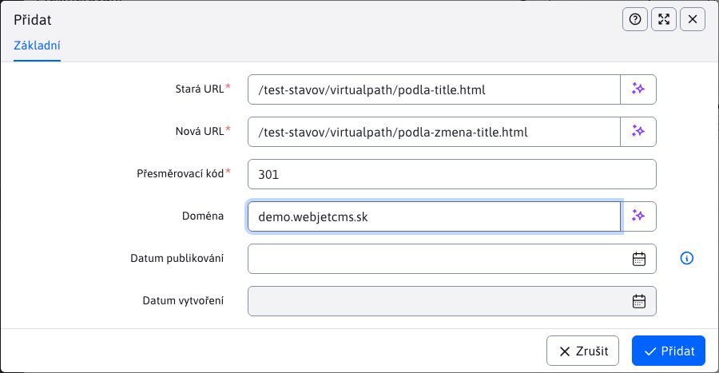
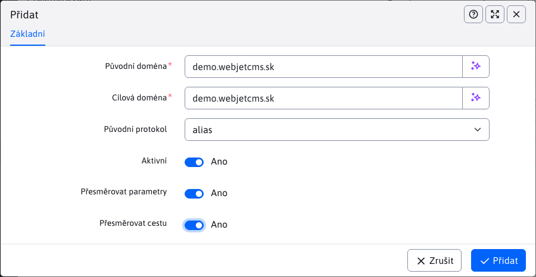

# Přesměrování

## Přesměrování cest

Zobrazuje seznam existujících přesměrování, které se provedou, pokud zadaná URL adresa neexistuje. Přesměrování vznikají automaticky při změně URL adresy existující stránky nebo při změně adresářové struktury.

Klepnutím na ikonu **Přidat** je možné zadefinovat nové přesměrování. Podporováno je také přesměrování včetně parametrů v URL adrese. Nejprve se hledá shoda včetně parametrů, pokud se nenajde, systém se pokusí najít shodu bez zadaných parametrů.

Hodnota pole [přesměrovací kód](https://developer.mozilla.org/en-US/docs/Web/HTTP/Redirections) určuje typ přesměrování, nejčastěji se používají následující kódy:
- `301` trvalé přesměrování, vyhledávače by si měly upravit adresu stránky na tuto novou hodnotu.
- `302` dočasné přesměrování.

### Přesměrování přes regulární výrazy

Pomocí regulárních výrazů lze nastavit složitější přesměrování celých větví URL adres (např. po migraci starého webu). Přesměrování přes regulární výraz se zadávají s prefixem `regexp:`.

Původní URL je tedy možné zadat ve formátu `regexp:^\/thisiswhere\/oldfiles\/(.+)` které se bude korektně překládat na novou URL is provedením/přenesením skupin na nové URL ve tvaru `/thisiswhere/myfilesmovedto/$1`

Provede se přesměrování např. `/thisiswhere/oldfiles/page.html` na `/thisiswhere/myfilesmovedto/page.html`.

## Přesměrování domén

V sekci **Přesměrování domén** můžete definovat přesměrování požadavků celé domény (např. přesměrování `domena.sk` na `www.domena.sk`).

V dialogovém okně pro definici domény můžete zadat následující hodnoty:
- **Původní doména** - název domény, kterou chcete přesměrovat, například. `domena.sk`.
- **Cílová doména** - název domény, na kterou chcete požadavek přesměrovat, například. `www.domena.sk`, doporučujeme zadat i `http/s` prefix `https://www.domena.sk`.
- **Původní protokol** - určuje, pro jaký protokol se přesměrování použije:
  - **prázdná hodnota** - přesměrování se použije bez ohledu na protokol.
  - **http** - přesměrování se použije pouze, pokud je původní protokol `http` (nastavte, pokud chcete přesměrovat http verzi na zabezpečenou `https` verzi, v tom případě i zadejte do pole Cílová doména doménu s protokolem `https://` na začátku).
  - **https** - přesměrování se použije pouze, pokud je původní protokol `https`.
  - **alias** - vytvoří doménový alias - hodnota zadaná v poli Původní doména bude interně pro WebJET viděna (a zpracována) jako hodnota domény v poli Cílová doména. Použijte když např. migrujete data z produkce na test, jako původní doménu zadejte hodnotu v test prostředí a jako cílovou zadejte doménu v produkci (bez http prefixu).
- **Aktivní** - přesměrování se použije, pouze pokud je toto pole zaškrtnuto.
- **Přesměrovat parametry** - pokud zaškrtnete, přidají se k přesměrování i parametry původní HTTP požadavku. `?docid=4`.
- **Přesměrovat cestu** - pokud zaškrtnete, přidá se k přesměrování i cesta původní HTTP požadavku. `/produkty/webjet/novinky.html`.

