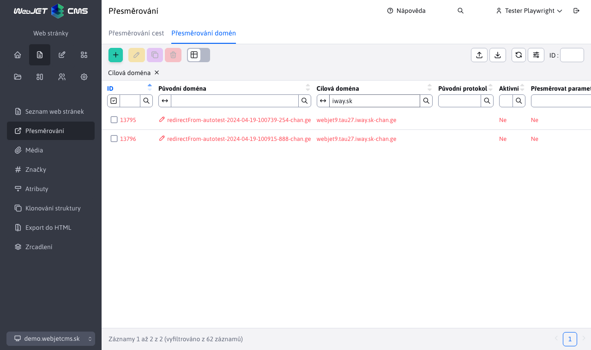

# Přesměrování

## Objízdné trasy

Zobrazí seznam existujících přesměrování, která se provedou, pokud zadaná adresa URL neexistuje. Přesměrování se vytvářejí automaticky při změně adresy URL existující stránky nebo při změně adresářové struktury.

Klikněte na ikonu **Přidat** lze definovat nové přesměrování. Podporováno je také přesměrování včetně parametrů v adrese URL. Nejprve se hledá shoda včetně parametrů, pokud není nalezena, systém se pokusí najít shodu bez zadaných parametrů.

Hodnota pole [kód přesměrování](https://developer.mozilla.org/en-US/docs/Web/HTTP/Redirections) určuje typ přesměrování, nejčastěji používané kódy jsou:
- `301` trvalé přesměrování, vyhledávače by měly upravit adresu stránky na tuto novou hodnotu.
- `302` dočasné přesměrování.

### Přesměrování pomocí regulárních výrazů

Pomocí regulárních výrazů lze nastavit složitější přesměrování celých větví adres URL (např. po migraci starého webu). Přesměrování pomocí regulárních výrazů se zadávají pomocí předpony `regexp:`.

Původní adresu URL lze tedy zadat ve formátu `regexp:^\/thisiswhere\/oldfiles\/(.+)` který bude správně přeložen na novou adresu URL i při provedení/přenesení skupin na novou adresu URL ve tvaru `/thisiswhere/myfilesmovedto/$1`

Přesměrování se provádí například. `/thisiswhere/oldfiles/page.html` na adrese `/thisiswhere/myfilesmovedto/page.html`.

## Přesměrování domény

V části **Přesměrování domény** můžete definovat přesměrování požadavků v rámci celé domény (např. přesměrování `domena.sk` na adrese `www.domena.sk`).

V dialogovém okně definice domény můžete zadat následující hodnoty:
- **Původní doména** - název domény, kterou chcete přesměrovat, např. `domena.sk`.
- **Cílová doména** - název domény, na kterou chcete požadavek přesměrovat, např. `www.domena.sk`, doporučujeme zadat také `http/s` předpona `https://www.domena.sk`.
- **Původní protokol** - Určuje protokol, pro který se přesměrování používá:
  - **prázdná hodnota** - přesměrování se používá bez ohledu na protokol.
  - **http** - přesměrování se používá pouze v případě, že je původní protokol `http` (nastavte, pokud chcete přesměrovat verzi http na zabezpečený server) `https` verze, v tomto případě zadejte také doménu s protokolem do pole Cílová doména. `https://` na začátku).
  - **https** - přesměrování se používá pouze v případě, že je původní protokol `https`.
  - **alias** - vytvoří doménový alias - hodnota zadaná do pole Původní doména bude viděna (a zpracována) interně WebJETem jako hodnota domény v poli Cílová doména. Použijte např. při migraci dat z produkčního do testovacího prostředí, zadejte hodnotu v testovacím prostředí jako původní doménu a zadejte doménu v produkčním prostředí (bez předpony http) jako cílovou doménu.
- **Aktivní** - přesměrování se použije pouze v případě, že je toto pole zaškrtnuto.
- **Parametry přesměrování** - pokud je zaškrtnuto, jsou do přesměrování přidány parametry původního požadavku HTTP, např. `?docid=4`.
- **Přesměrování cesty** - pokud je zaškrtnuto, je k přesměrování přidána cesta původního požadavku HTTP, např. `/produkty/webjet/novinky.html`.

