# Práce v editoru

WebJET obsahuje inteligentní editor web stránek, který vám co nejvěrněji zobrazuje, jak daná stránka bude vypadat.

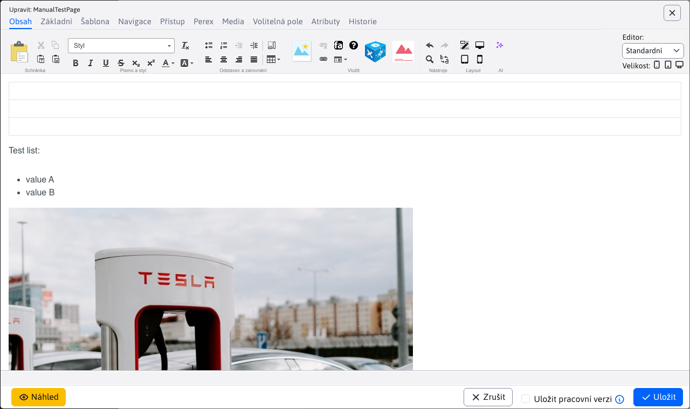

## Práce s textem (psaní/vkládání/kopírování)

Při práci s textem si musíte v první řadě uvědomit rozdíl mezi odstavcem a zalomeným textem, čili rozdělením věty do dalšího řádku. Jednotlivé odstavce vytvoříte běžným stisknutím `ENTER`, zatímco zalomení textu pomocí klávesové kombinace `SHIFT + ENTER`.

Rozdíl mezi nimi je zřetelný hlavně kvůli většímu odsazení mezi odstavci (oproti zalomení textu). Další důležitý rozdíl je v tom, že několik úprav textu (jako například vytvoření nadpisu) se aplikuje na celý odstavec. Pokud takový odstavec obsahuje zalomení řádku, tak se tato změna aplikuje i na zalomený řádek.

Pokud chcete, aby se text po napsání mezery nezalomil, můžete kromě normální mezery vložit **pevnou mezeru**. Takový případ se může vyskytnout například při psaní dat `10. 2. 2009` nebo různých jiných textů, které by neměly být rozděleny na dva řádky, jako například. velikost souborů `123 kB` nebo telefonní číslo `0905 123 456`. Pevná mezera se vkládá klávesovou kombinací CTRL+Mezera. Vzhledově se nijak neliší, rozdílné je jen její chování vůči okolnímu textu na konci řádku.

**Text ve WebJET editoru můžete upravovat následujícími způsoby**:
- psaním přímo do editoru
- vložením z jiného dokumentu (`DOC`, `PDF`, `XLS`, jiná web stránka...)

### Vložení z jiného dokumentu

**Klasické vložení textu** z panelu nástrojů pomocí ikony nebo kombinací kláves `CTRL + v`. Při vložení textu tímto způsobem se text vloží is původním formátováním zdrojového textu. Tento způsob je však nechtěný hlavně z důvodu ponechání jednotného stylování textů na celém webu podle předdefinovaných stylů.

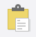

**Vložení neformátovaného textu** z panelu nástrojů pomocí ikony nebo kombinací kláves `CTRL + t` zda `CTRL + SHIFT + v`. Tento způsob vkládání textu vám text vloží bez jakéhokoli formátování, pro vkládání běžného textu je proto nejvhodnější.

**Vložení textu z `Word` / `Excel` souboru** z panelu nástrojů pomocí ikony  nebo kombinací kláves `CTRL + w`. Tato možnost vloží text se zachovanými odstavci a tabulkami, ale očištěný od všech stylů z původního dokumentu. Bohužel některé prohlížeče mají tuto klávesovou zkratku vyhrazenou pro zavření okna/záložky, takže v takovém případě je lepší vkládat text přes klepnutí na ikonku v panelu nástrojů a ne přes klávesovou zkratku.

### Kopírování textu

Kopírování textu je možné označením textu a kliknutím na ikonku  (nebo kombinací kláves `CTRL + c`).

### Vystřižení textu

Vystřižení textu je možné označením textu a kliknutím na ikonku  (nebo kombinací kláves `CTRL + x`).

## Práce se styly a formátování textu

Ve WebJETu máte k dispozici jistý počet předdefinovaných stylů pro nadpisy a pro písma, která se používají pro stylování stránky do přijatelné formy. Správné definování nadpisů má zároveň značný význam pro optimalizaci pro vyhledávače (`SEO`) a vnitřní strukturu dokumentu.

Předdefinované nadpisy se aplikují vždy na celý odstavec. Nadpis vytvoříte kliknutím do požadovaného odstavce, ze kterého chcete udělat nadpis a z rozbalovací nabídky vyberete požadovanou úroveň nadpisu.

Na každé webové stránce by měl být vždy pouze jeden hlavní Nadpis 1, kterým by se měl text začínat. Jelikož je tento nadpis na standardní stránce automaticky vygenerován z názvu stránky (pokud to tak šablona definuje), není třeba jej vkládat do těla stránky. Sekce v rámci stránky se oddělují Nadpisem 2, jejich pod-sekce Nadpisem 3, atp.

V této nabídce jsou i další předdefinované styly, jejich použití však vychází z jejich pojmenování, například styly obsahující text "tabulka" se používají pouze pro tabulky a podobně. Klepnutím do libovolného textu stránky v editoru se vám do pole Styl automaticky nastaví styl použitý na dané pozici kurzoru. Aktuálně použitý styl je označen šipkou v levé části rozbalovací nabídky.

Pokud chcete změnit styl takového textu v rámci odstavce, nesmíte text označovat. Stačí kliknout do daného textu ve stránce, styl barvy se automaticky přednastaví v rozbalovací nabídce **Styl** a následně jej můžete změnit na jiný styl.

Pomocí předdefinovaných stylů můžete text na stránce také zvýrazňovat. Ve výběru naleznete např. různé typy nadpisů, barevná zvýraznění. Používání stylů zajistí jednotný vzhled stránek.

Další způsob formátování textu je pomocí následujících standardních nástrojů (aplikují se označením textu, který chcete upravit):
- 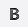, **hrubé písmo**
- , *kurzíva*
- , <ins>podtržení</ins>
- , ~~přeškrtnutí~~
- , horní index
- , dolní index

Formátování textu pomocí nástroje pro změnu barvy textu  a podbarvení textu  Doporučujeme nepoužívat, jelikož způsobuje grafickou nekonzistentnost web stránky a degraduje její hodnotu v rámci web sídla.

## Odstraňování formátování

Chcete-li zrušit styl nadpisu, klikněte do textu nadpisu a zvolte z rozbalovací nabídky první položku **Odstavec**. Následně by se měl styl nadpisu z textu odstranit (platí pro všechny styly z rozbalovací nabídky).

Pokud chcete odstranit z textu běžné formátování například tučný text nebo kurzívu, můžete to udělat dvěma způsoby. Buď po označení daného textu znovu kliknete na daný formátovací nástroj, dokud se formátování nezruší, nebo použijete univerzální nástroj pro odstraňování formátování 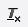

Tento nástroj funguje tak, že formátovaný text označíte a po kliknutí na  se odstraní formátování na označeném textu. Tento nástroj odstraňuje také kombinované formátování na textu (např. kurzíva a tučný text dohromady)

## Seznamy (odrážkové / číslované) a odsazení textu

K vytvoření očíslovaného seznamu slouží ikonka . K vytvoření odrážkového (nečíslovaného) seznamu slouží ikonka .

Z obyčejného odstavce vytvoříte seznam tak, že kliknete do daného odstavce a kliknete na ikonku požadovaného seznamu (číslovaný nebo odrážkový).

Pokud chcete změnit typ odrážek při číslovaném seznamu, klikněte do položky seznamu a přes kontextové menu (pravý klik myši) se dostanete do vlastností seznamu, kde si můžete zvolit jiný typ seznamu.

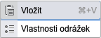

Pokud chcete vytvořit vnořený seznam, kliknete do dané položky seznamu a klepnutím na ikonku odsazení doprava 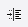 vytvoříte vnořený seznam. Zrušit vnořený seznam můžete ikonkou pro odsazení textu doleva .

Vytváření seznamu ukončíte dvojnásobným stisknutím klávesy `ENTER` na konci seznamu.

## Odkazy na soubory a nahrávání souborů

Chcete-li vytvořit odkaz na dokument/soubor označte si text, který má být odkazem, klikněte na ikonku Odkaz  nebo pomocí zkratky `CTRL + k`, zobrazí se vám dialogové okno pro vytvoření odkazu:

- v případě je-li dokument **určen pouze pro aktuální web stránku**, je třeba zvolit položku “Média této stránky” a v ní položku “Soubory”.
  - Vyhledáte dokument, kliknete na něj a odkaz na dokument se automaticky zkopíruje do pole URL.
  - V případě, že se v seznamu požadovaný dokument nenachází, funkcí `drag&drop` je možné nahrát dokument z vašeho počítače
  - Potvrdíte OK, čímž se vám na vyznačeném místě vytvoří odkaz na soubor.
- v případě pokud dokument **není určen pouze pro danou stránku** (dokument se může nacházet i na jiné stránce), je třeba zvolit položku **Média všech stránek** a v ní položku **Soubory**.
  - Zobrazí se vám adresářová struktura adresářů a souborů na serveru, na které máte povolen přístup.
  - Vyhledáte v adresářích požadovaný soubor, kliknete na něj a odkaz na dokument se automaticky zkopíruje do pole URL
  - Potvrdíte OK, čímž se vám na vyznačeném místě vytvoří odkaz na soubor.

Podle směrnice na přístupnost web sídla by všechny textové soubory ke stažení nacházející se na web stránkách měly být uveřejňovány hlavně ve formátu `PDF`. Formáty používané aplikací `Word` a `Excel` (`DOC` a `XLS`) nejsou vyhovující.

Pokud máte k tomu oprávnění, tak můžete v daném adresáři pro soubory vytvářet i nové podadresáře kliknutím na ikonku . Názvy souborů na serveru by neměly obsahovat mezery, speciální znaky a písmena s diakritikou.

## Vkládání a úprava odkazů na jiné web stránky

Linky / odkazy na další stránky vkládáte podobně jako odkaz na dokument/soubor:

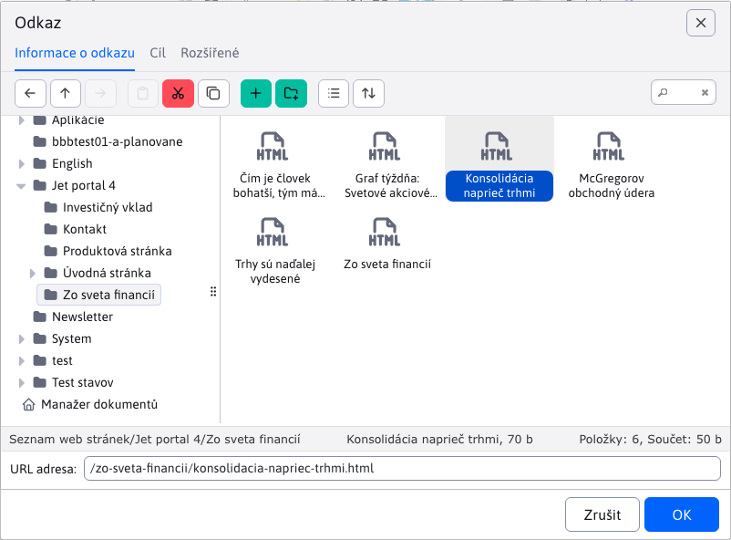

- Označte text (slovo), který má být klikatelný jako odkaz. Potom kliknete na ikonku Odkaz  nebo pomocí zkratky `CTRL+ k`. Otevře se vám dialogové okno, ve kterém je třeba zvolit položku **Web stránky** a ve stromové struktuře vyhledat stránku na kterou chcete vytvořit odkaz. Po kliknutí na jméno stránky se vám do pole URL adresa zkopíruje adresa označené stránky. Potvrzením `OK` se vám na stránce vytvoří odkaz na zvolenou web stránku.
- Chcete-li vložit odkaz na stránku nacházející se na jiném web sídle (linka na externí web stránku), zadejte její adresu přímo do pole URL adresa (is prefixem `https://`). Zároveň se automaticky změní pole **Cíl** (v kartě Cíl) na hodnotu **Nové okno (`_blank`)**, což zajistí, že po kliknutí na tento odkaz se stránka otevře v novém okně/kartě prohlížeče. Pole **Cíl** se na hodnotu **Nové okno (`_blank`)** nastavuje také v případě, že chcete vytvořit odkaz na dokument ke stažení. Pokud nechcete, aby se odkaz otevřel do nového okna, je třeba parametr **Cíl** nastavit na hodnotu **Totéž okno `_self`**. Při odkazech na externí webové stránky a na dokumenty je však otevření odkazu do nového okna doporučeno.

## Tlačítka

Pokud je ve web stránce vložen odkaz, nebo tlačítko, které má nastavený CSS styl obsahující výraz `btn-` nebo CSS styl má nastavenou hodnotu `display` obsahující `block`, tedy i například `inline-block` zobrazí se po kliknutí na takový odkaz v editoru okno nastavení tlačítka. V něm lze jednoduše změnit text tlačítka a nastavit odkaz po kliknutí. Můžete případně i změnit barvu pozadí, písma a zaoblení rohů, standardně ale tyto hodnoty nedoporučujeme měnit – měly by být nastaveny podle CSS stylů web stránky.

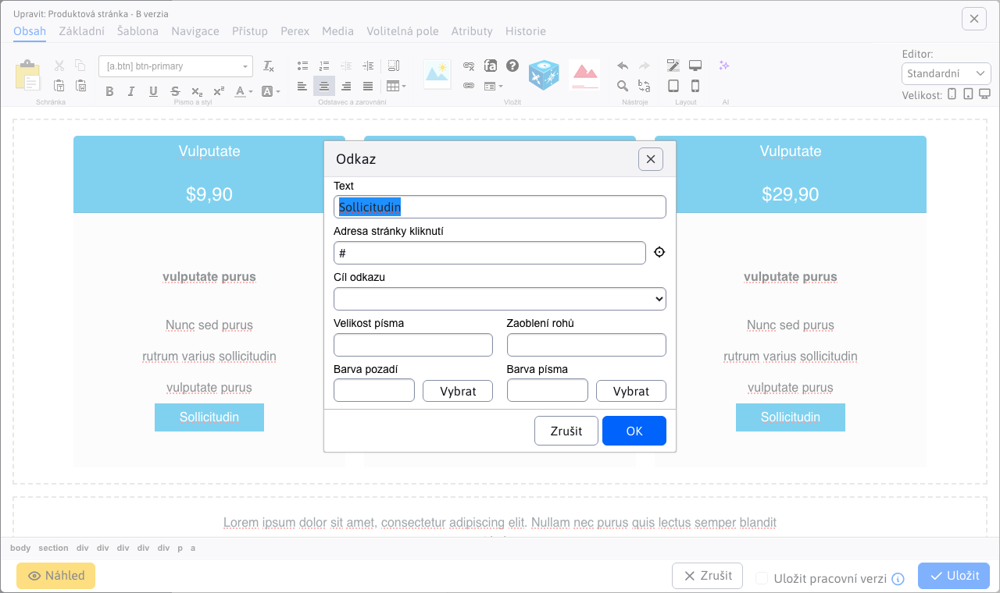

## Vkládání obrázků

Chcete-li vložit na stránku obrázek, umístěte kurzor na řádek nebo do buňky tabulky, kde se obrázek má nacházet, a klikněte na ikonku pro vložení obrázku .

Chcete-li změnit existující obrázek je třeba nejprve kliknout na obrázek, který si přejete změnit. Následně je třeba kliknout na stejnou ikonku vložit/změnit obrázek nebo přes kontextové menu na položku **Vlastnosti obrázku**. Další postup je v obou případech shodný.

Po kliknutí na ikonku se vám zobrazí dialogové okno pro vložení obrázku:

Při procházení přes stromovou strukturu jsou zobrazeny pouze soubory typu obrázek nebo video, ostatní soubory jsou filtrovány.

### Karta Obsah

Pokud se soubor obrázku již nachází na serveru, můžete jej vyhledat v adresářové struktuře a klepnutím na něj se umístění obrázku automaticky zapíše do políčka URL adresa.

Při obrázcích je třeba zadefinovat i Alternativní text pro obrázek, který se využívá hlavně pro komunikaci se slabozrakými a nevidomými návštěvníky web stránky, nebo když má uživatel vypnuté zobrazování obrázků na web stránkách. Alternativní text by měl vystihovat, čeho se obrázek týká nebo co je na něm zobrazeno.

Po zvolení obrázku se automaticky vyplní pole šířka a výška, která definují aktuální velikost zvoleného obrázku.

### Karta fotobanka

Karta **fotobanka** umožňuje získání (stažení) obrázků z bezplatné online platformy [Pixabay](https://pixabay.com). Tato platforma poskytuje rozsáhlou sbírku obrázků, které je [lze použít zdarma](https://pixabay.com/service/license-summary/).

Po zadání a vyhledání výrazu, Vám budou nabídnuty vyhovující obrázky. Nabídka obsahuje několik stran, mezi kterými umíte procházet.

Po kliknutí na některý z nabízených obrázků se zobrazí dialog, s náhledem a hodnotami **šířka** / **výška** daného obrázku.

Přejete-li si změnit rozměry obrázku, můžete upravit hodnotu **šířka** a jeho **výška** se automaticky vypočítá podle původního poměru obrázku.

Následně po kliknutí na tlačítko **Uložit do WebJET** se obrázek stáhne a uloží. Automaticky se přepne karta na **Obsah**, kde máte okamžitě tento obrázek dostupný.

**URL adresa zdroje obrázku**

Uložené obrázky z **Fotobanky** mají automaticky vyplněnou hodnotu **URL adresa zdroje obrázku**. Tuto hodnotu si umíte prohlédnout/upravit v části [Průzkumník](../../files/fbrowser/README.md) při akci [Úprava souborů](../../files/fbrowser/file-edit/README.md).

### Video soubory

Přes dialogové okno pro vložení obrázku můžete vkládat i video soubory. Buď přímo z vašeho serveru výběrem video souboru, nebo do pole URL adresa zadáte odkaz na web stránku `YouTube/Facebook/TikTok`.

WebJET automaticky pro video soubor vloží namísto obrázku video přehrávač.

### Editace obrázků

Pokud je obrázek příliš velký a nevejde se vám do stránky, nebo potřebujete provést v obrázku jinou změnu můžete použít editor obrázků. Klepněte na obrázek a následně na ikonu tužky pro otevření [editoru obrázků](../../image-editor/README.md).

## Vkládání a úprava tabulek

Tabulku lze vytvořit dvěma způsoby. Použít předdefinovanou stylovanou tabulku, nebo vložit tabulku kopírováním z `Word` / `Excel` souboru.

### Vytvoření barevné tabulky

Tabulku vytvoříte kliknutím na ikonku **Vložit tabulku**, 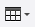:

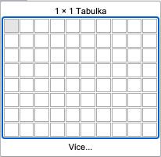

V případě, že potřebujete vytvořit komplexnější tabulku, je třeba kliknout na **Více** kde se vám zobrazí dialogové okno pro nastavení tabulky:

Zde můžete nastavit počet sloupců a řádků. Pokud chcete, aby se tabulka šířkou přizpůsobovala obsahu, tak šířku zadávat nemusíte (vymažte předvyplněnou hodnotu). Ostatní parametry by měly zůstat s nulovou hodnotou, aby se nebily s přednastaveným stylem tabulky. Potvrzením `OK` vložíte tabulka na původní pozici kurzoru.

### Vkládání tabulky z `Word` a `Excel` souboru

Při vkládání tabulky z jiných aplikací, resp. dokumentů přes klávesovou zkratku `CTRL + v` se vás systém automaticky zeptá, zda chcete tabulku vyčistit. Pokud kliknete `OK`, tak editor očistí tabulku od nechtěných formátovacích znaků původního dokumentu, ale ponechá strukturu tabulky v původní formě.

Tabulka zůstane v obsahu stránky zachována i tehdy, použijete-li pro vkládání textu nástroj pro vkládání textu z `Word` / `Excel` souboru (`CTRL + w`) .

### Úprava stávající tabulky

Pokud potřebujete nějakým způsobem upravit existující tabulku, která se na stránce nachází, nebo kterou jste tam právě vložili některým z již zmíněných způsobů, tak pro její úpravu máte k dispozici více nástrojů. Klepnutím do některé z buněk tabulky pravým tlačítkem myši se vám zobrazí kontextové menu.

Pro vymazání nebo přidání dalšího řádku slouží pod-menu položky **Řádek**.

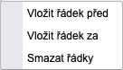

Pro vkládání nebo smazání sloupce slouží pod-menu položky **Sloupec**.

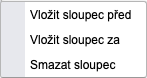

Pokud chcete sloučit dvě sousední buňky (v rámci řádku), tak musíte označit jejich obsah (neobsahují-li žádný text nejprve do buňky zadejte libovolný text aby se dala buňka lépe označit), kliknout pravým tlačítkem na tento označený obsah a zvolit pod-menu položky **Buňka** a v tomto pod-menu položku **Sloučit buňky**.

Obsah buněk se pak sloučí do jedné a vy jej můžete dále upravovat.

Pokud chcete odstranit původní orámování tabulky, změnit odsazení buněk, nebo provést tabulku barevnou klikněte na položku **Vlastnosti tabulky**. Zobrazí se vám dialogové okno, ve kterém můžete změnit různé parametry tabulky kromě počtu řádků a sloupců tabulky (ty se upravují již zmíněným způsobem na předchozí straně).

Pokud chcete, aby se tabulka svou šířkou přizpůsobovala obsahu, tak se šířka tabulky zadávat nemusí (vymažte hodnotu). Pokud chcete, aby byla tabulka na celou šířku stránky, tak můžete zadat hodnotu 100 procent. Výšku nezadávejte.

Pokud chcete změnit zarovnání textu v buňce tabulky na střed nebo doprava, tak klikněte do dané buňky pravým tlačítkem myši a zvolit podmenu položky **Buňka** a v tomto pod-menu položku **Vlastnosti buňky**.

Zobrazí se vám dialogové okno pro vlastnosti buňky, ve kterém si můžete nastavit vertikální nebo horizontální zarovnání textu v buňce. Ostatní parametry v okně neměňte.

## Vložení aplikace

Pro vložení aplikace klikněte na ikonu modré kostky aplikace . Zobrazí se nám dialogové okno se seznamem aplikací:

Do vyhledávání můžete zadat název aplikace:

Po kliknutí na jméno aplikace se zobrazí podrobnosti o aplikaci - její popis, fotky a možnost vložit aplikaci do stránky:

Při kliknutí na tlačítko "Vložit do stránky" se aplikace vloží do stránky a zobrazí se nastavení aplikace:

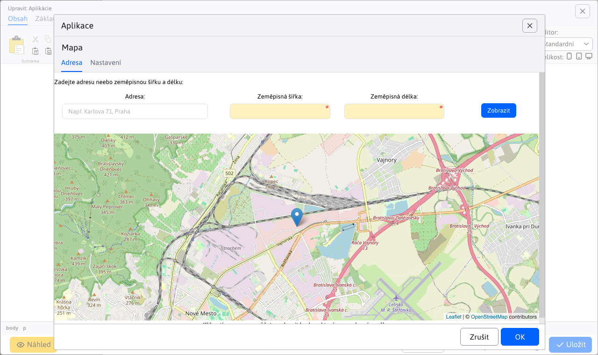

Pokud již je aplikace vložena ve stránce kliknutím dovnitř aplikace se vám zobrazí stejné okno nastavení aplikace. Můžete tak snadno upravit její stávající nastavení.

### Karta zobrazení

Většina aplikací obsahuje kartu Zobrazení pro společná nastavení (pokud tato možnost v aplikaci není z různých důvodů vypnuta).

Karta obsahuje parametry:
- Zobrazení na zařízeních, sloužící k nastavení [podmíněného zobrazení aplikace](../../../custom-apps/appstore/README.md#podmíněné-zobrazení-aplikace) na zařízeních typu tablet, telefon nebo standardní počítač. Pokud není zvolena žádná možnost, zobrazí se aplikace na všech zařízeních (stejně jako když jsou zvoleny všechny možnosti).
- Přihlášený uživatel - umožňuje nastavit zobrazení aplikace podle stavu přihlášení návštěvníka web sídla - zobrazení vždy, jen pokud je uživatel přihlášen, nebo není-li přihlášen. V editoru stránek se aplikace zobrazí vždy, ale v náhledu nebo zobrazení stránky se zobrazí podle nastavené hodnoty.
- Čas vyrovnávací paměti (minuty) - slouží k nastavení doby v minutách, po jakou má být inicializovaná aplikace uložena ve vyrovnávací paměti pro její rychlejší zobrazení. Například seznam novinek se nemění často a jejich načtení je náročné na databázový server, je tedy vhodné nastavit například hodnotu 30. Pokud je přihlášen administrátor, vyrovnávací paměť se nepoužije a vždy se zobrazí aktuální údaje.

## Před připravené bloky

Editor stránky nabízí možnost vkládání přednastavených bloků (`HTML` objektů) na stránku. Např. tabulka, text, kontaktní formulář atp. Umíte vložit i obsah jiné stránky do aktuální stránky (např. opakující se formulář).

Zobrazení bloků provedete kliknutím na ikonu  v editoru stránky, která zobrazí dialogové okno s kategoriemi bloků.

Více informací v popisu aplikace [před-připravené bloky](../../apps/htmlbox/README.md).

## Vkládání speciálních znaků

Mohou nastat případy, kdy budete potřebovat při psaní napsat i znaky, které česká klávesnice neobsahuje, například znak Dolaru (`$`), Euro (`€`) nebo zavináč (`@`). Pro usnadnění práce máte k dispozici vkládání speciálních znaků pomocí připraveného modulu. Klepnutím na ikonku  se vám zobrazí dialogové okno s nabídkou speciálních (ale i standardních) znaků.

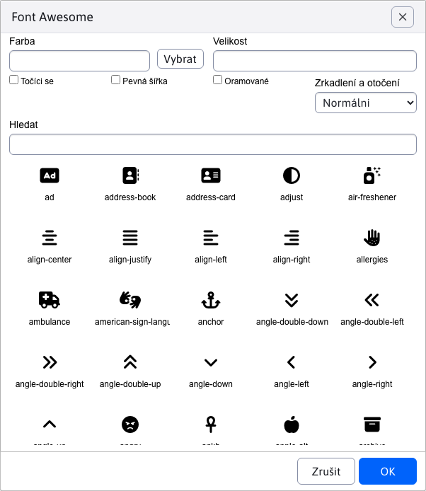

Po kliknutí na požadovaný znak se vám daný znak napíše na pozici kurzoru. Speciální znaky se vkládají jako text, takže nemají žádná další nastavení.

!> Upozornění: ikona pro vkládání speciálních znaků může být v některých případech změněna na ikonu  pro vkládání [FontAwesome](../../../frontend/webpages/fontawesome/README.md) obrázků.
