# Práce v editoru

WebJET obsahuje inteligentní editor webových stránek, který vám poskytne co nejpřesnější představu o tom, jak bude stránka vypadat.

## Práce s textem (psaní / vkládání / kopírování)

Při práci s textem si musíte především uvědomit rozdíl mezi odstavcem a sbaleným textem, tj. rozdělením věty na další řádek. Jednotlivé odstavce můžete vytvářet jednoduše stisknutím tlačítka `ENTER`, přičemž text zabalíte pomocí kombinace kláves `SHIFT + ENTER`.

Rozdíl mezi nimi je patrný především díky většímu odsazení mezi odstavci (na rozdíl od odsazení textu). Dalším důležitým rozdílem je, že několik úprav textu (například vytvoření nadpisu) se aplikuje na celý odstavec. Pokud takový odstavec obsahuje zalomení řádku, je tato změna aplikována i na zalomení řádku.

Pokud chcete, aby se text při psaní mezery nezlomil, můžete kromě normální mezery vložit i mezeru. **pevná mezera**. Může to být například při psaní dat. `10. 2. 2009` nebo různé jiné texty, které by neměly být rozděleny do dvou řádků, jako je velikost souboru. `123 kB` nebo telefonní číslo `0905 123 456`. Pevná mezera se vkládá pomocí kombinace kláves CTRL+mezerník. Její vzhled se neliší, liší se pouze chováním vůči okolnímu textu na konci řádku.

**Text v editoru WebJET můžete upravovat následujícími způsoby.**:
- zadáním přímo do editoru
- vložením z jiného dokumentu (`DOC`, `PDF`, `XLS`, další webové stránky...)

### Vložení z jiného dokumentu

**Klasické vkládání textu** z panelu nástrojů pomocí ikony nebo kombinace kláves `CTRL + v`. Při vkládání textu tímto způsobem se text vloží s původním formátováním zdrojového textu. Tento způsob je však nežádoucí především proto, že ponechává stylování textu na celém webu jednotné podle předem definovaných stylů.

**Vložení neformátovaného textu** z panelu nástrojů pomocí ikony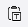 nebo kombinací kláves `CTRL + t` nebo `CTRL + SHIFT + v`. Tento způsob vkládání textu vloží text bez formátování, takže je nejvhodnější pro vkládání prostého textu.

**Vložení textu z `Word` / `Excel` soubor** z panelu nástrojů pomocí ikony 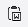 nebo kombinací kláves `CTRL + w`. Tato možnost vloží text se zachovanými odstavci a tabulkami, ale zbavený všech stylů z původního dokumentu. Bohužel některé prohlížeče mají tuto klávesovou zkratku vyhrazenou pro zavření okna/záložky, takže v takovém případě je lepší vložit text kliknutím na ikonu na panelu nástrojů než pomocí klávesové zkratky.

### Kopírování textu

Kopírování textu je možné výběrem textu a kliknutím na ikonu 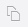 (nebo kombinace kláves `CTRL + c`).

### Vystřihování textu

Chcete-li text vyjmout, vyberte text a klikněte na ikonu . 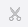 (nebo kombinace kláves `CTRL + x`).

## Práce se styly a formátování textu

Ve WebJETu máte k dispozici řadu předdefinovaných stylů pro nadpisy a písma, které slouží ke stylizaci stránky do přijatelné podoby. Správné definování nadpisů má také značný význam pro optimalizaci pro vyhledávače (`SEO`) a vnitřní strukturou dokumentu.

Předdefinované nadpisy se vždy použijí na celý odstavec. Chcete-li vytvořit nadpis, klikněte do požadovaného odstavce, který chcete vytvořit, a z rozevírací nabídky vyberte požadovanou úroveň nadpisu.

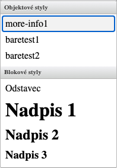

Na každé webové stránce by měl být vždy pouze jeden hlavní nadpis 1, kterým by měl začínat text. Vzhledem k tomu, že tento nadpis je na stránce automaticky generován z nadpisu stránky ve výchozím nastavení (pokud jej šablona takto definuje), není třeba jej vkládat do těla stránky. Oddíly v rámci stránky se oddělují nadpisem 2, jejich pododdíly nadpisem 3 atd.

V této nabídce jsou další předdefinované styly, ale jejich použití je založeno na jejich názvu, například styly obsahující text "table" se používají pouze pro tabulky atd. Kliknutím do libovolného textu stránky v editoru se v poli Styl automaticky nastaví styl použitý na dané pozici kurzoru. Aktuálně použitý styl je označen šipkou v levé rozbalovací nabídce.

Pokud chcete změnit styl takového textu v rámci odstavce, nesmíte text označit. Stačí kliknout do textu na stránce, barevný styl se automaticky přednastaví v rozevírací nabídce. **Styl** a poté jej můžete změnit na jiný styl.

Text na stránce můžete také zvýraznit pomocí předdefinovaných stylů. Ve výběru najdete např. různé typy nadpisů, barevné zvýraznění. Použití stylů zajišťuje jednotný vzhled stránek.

Dalším způsobem formátování textu je použití následujících standardních nástrojů (použijí se po označení textu, který chcete upravit):
- , **tučné písmo**
- , *Kurzíva*
- 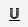, <ins>podtržítko</ins>
- 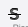, ~~přeškrtnutí~~
- , horní index
- 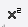, index

Formátování textu pomocí nástroje Barva textu 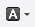 a podtržení textu  doporučujeme ji nepoužívat, protože způsobuje grafickou nekonzistenci webové stránky a snižuje její hodnotu v rámci webu.

## Odstranění formátování

Chcete-li styl nadpisu zrušit, klikněte do textu nadpisu a vyberte první položku z rozevírací nabídky. **Sekce**. Pak je třeba z textu odstranit styl nadpisu (platí pro všechny styly z rozbalovací nabídky).

Pokud chcete z textu odstranit běžné formátování, například tučné písmo nebo kurzívu, můžete to provést dvěma způsoby. Buď po výběru textu znovu klikněte na nástroj pro formátování, dokud se formátování neodstraní, nebo použijte univerzální nástroj pro odstranění formátování. 

Tento nástroj funguje tak, že vyberete formátovaný text a kliknete na tlačítko  se odstraní formátování zvýrazněného textu. Tento nástroj také odstraní kombinované formátování textu (např. kurzívu a tučné písmo dohromady).

## Seznamy (s odrážkami/číslované) a odsazený text

Chcete-li vytvořit číslovaný seznam, použijte ikonu . Chcete-li vytvořit seznam s odrážkami (bez číslování), použijte příkaz 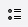.

Chcete-li vytvořit seznam z obyčejného odstavce, klikněte do odstavce a klikněte na ikonu požadovaného seznamu (číslovaného nebo s odrážkami).

Chcete-li změnit typ odrážky pro číslovaný seznam, klikněte na položku seznamu a pomocí kontextové nabídky (kliknutím pravým tlačítkem myši) přejděte do vlastností seznamu, kde můžete vybrat jiný typ seznamu.

Pokud chcete vytvořit vnořený seznam, klikněte na položku seznamu a klikněte na ikonu odsazení vpravo.  vytvořit vnořený seznam. Vnořený seznam můžete zrušit kliknutím na ikonu odsazeného textu vlevo. 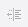.

Chcete-li seznam ukončit, stiskněte dvakrát tlačítko `ENTER` na konci seznamu.

## Odkazy na soubory a nahrávání souborů

Chcete-li vytvořit odkaz na dokument/soubor, vyberte text, který chcete propojit, kliknutím na ikonu Odkaz. 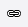 nebo pomocí zkratky `CTRL + k`, zobrazí se dialogové okno pro vytvoření odkazu:

- pokud je dokument **pouze pro aktuální webovou stránku**, musíte vybrat "Média této stránky" a v ní "Soubory".
  - Vyhledáte dokument, kliknete na něj a odkaz na dokument se automaticky zkopíruje do pole URL.
  - Pokud se požadovaný dokument v seznamu nenachází, funkce `drag&drop` je možné nahrát dokument z počítače.
  - Potvrzením OK vytvoříte odkaz na soubor ve vybraném umístění.
- pokud je dokument **není určena pouze pro tuto stránku** (dokument může být i na jiné stránce), je nutné vybrat možnost **Média všech stránek** a v něm záznam **Soubory**.
  - Zobrazí se adresářová struktura adresářů a souborů na serveru, ke kterým máte povolen přístup.
  - Vyhledáte požadovaný soubor v adresářích, kliknete na něj a odkaz na dokument se automaticky zkopíruje do pole URL.
  - Potvrzením OK vytvoříte odkaz na soubor ve vybraném umístění.

Podle Pokynů pro přístupnost webu by měly být všechny textové soubory ke stažení na webových stránkách zveřejňovány především ve formátu `PDF`. Formáty používané aplikací `Word` a `Excel` (`DOC` a `XLS`) nejsou uspokojivé.

Pokud k tomu máte oprávnění, můžete také v daném adresáři vytvořit nové podadresáře pro soubory kliknutím na ikonu . . Názvy souborů na serveru by neměly obsahovat mezery, speciální znaky a písmena s diakritikou.

## Vkládání a úprava odkazů na jiné webové stránky

Odkazy na jiné stránky se vkládají stejným způsobem jako odkazy na dokument/soubor:

- Vyberte text (slovo), na který chcete kliknout jako na odkaz. Poté klikněte na ikonu Odkaz  nebo pomocí zkratky `CTRL+ k`. Otevře se dialogové okno, ve kterém je třeba vybrat **Webové stránky** a vyhledejte ve stromové struktuře stránku, na kterou chcete odkazovat. Po kliknutí na název stránky se adresa vybrané stránky zkopíruje do pole adresy URL. Potvrzením `OK` bude na stránce vytvořen odkaz na vybranou webovou stránku.
- Pokud chcete vložit odkaz na stránku umístěnou na jiném webu (odkaz na externí web), zadejte její adresu přímo do pole pro adresu URL (včetně předpony `https://`). Současně se automaticky změní pole **Cíl** (na kartě Cíl) na hodnotu **Nové okno (`_blank`)** &#x6B;terý zajistí, že se stránka po kliknutí na tento odkaz otevře v novém okně/záložce prohlížeče. Pole **Cíl** na hodnotu **Nové okno (`_blank`)** je také nastaven, pokud chcete vytvořit odkaz na dokument ke stažení. Pokud nechcete, aby se odkaz otevřel v novém okně, parametr **Cíl** nastavit na **Stejné okno `_self`**. U odkazů na externí webové stránky a dokumenty se však doporučuje otevřít odkaz v novém okně.

## Vkládání obrázků

Chcete-li vložit obrázek na stránku, umístěte kurzor na řádek nebo buňku tabulky, kde má být obrázek umístěn, a klikněte na ikonu pro vložení obrázku. 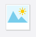.

Chcete-li změnit existující obrázek, musíte nejprve jednou kliknout na obrázek, který chcete změnit. Poté je třeba kliknout na stejnou ikonu vložení/změny obrázku nebo prostřednictvím kontextové nabídky na obrazovce. **Vlastnosti obrázku**. Další postup je v obou případech stejný.

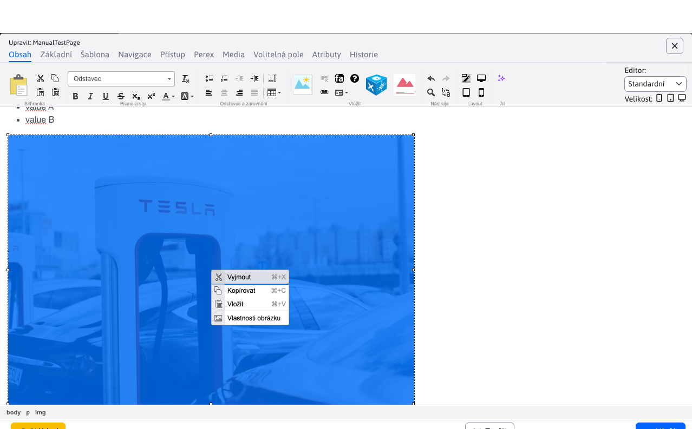

Po kliknutí na ikonu se zobrazí dialogové okno pro vložení obrázku:

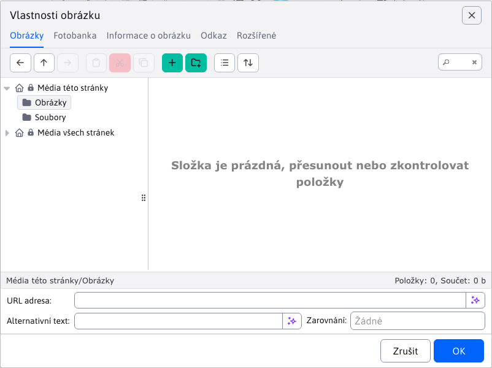

### Obsah karty

Pokud se již soubor s obrázkem na serveru nachází, můžete jej vyhledat v adresářové struktuře a kliknutím na něj se do pole adresy URL automaticky zadá umístění obrázku.

U obrázků je nutné definovat Alternativní text pro obrázek, který se používá především pro komunikaci se slabozrakými a nevidomými návštěvníky webových stránek nebo v případě, že uživatel zakázal zobrazování obrázků na webových stránkách. Alternativní text by měl popisovat, čeho se obrázek týká nebo co je na něm zobrazeno.

Při výběru obrázku se automaticky vyplní pole šířky a výšky, která určují aktuální velikost vybraného obrázku.

### Karta Photobank

Karta **Fotobanka** umožňuje získat (stáhnout) obrázky z bezplatné online platformy. [Pixabay](https://pixabay.com). Tato platforma poskytuje rozsáhlou sbírku obrázků, která je [lze používat zdarma](https://pixabay.com/service/license-summary/).

Po zadání a vyhledání termínu se vám nabídnou odpovídající obrázky. Nabídka obsahuje několik stránek, mezi kterými můžete přecházet.

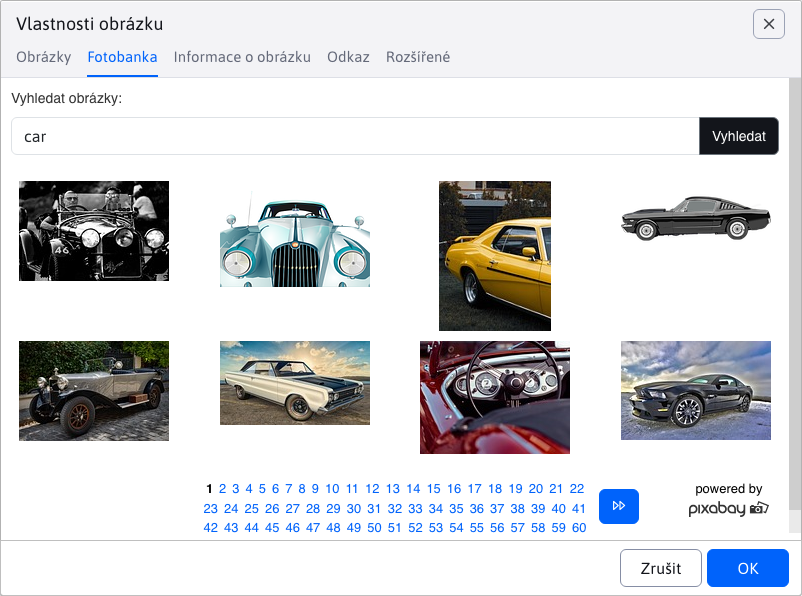

Po kliknutí na jeden z nabízených obrázků se zobrazí dialogové okno s náhledem a hodnotami. **šířka** / **Výška** obrázku.

Pokud chcete změnit rozměry obrázku, můžete upravit hodnotu. **šířka** a jeho **Výška** se automaticky vypočítá podle poměru původního obrazu.

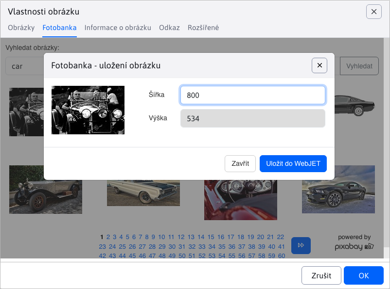

Pak klikněte na tlačítko **Uložit do WebJET** obrázek je stažen a uložen. Karta se automaticky přepne na **Obsah**, kde máte tento obrázek okamžitě k dispozici.

**Adresa URL zdroje obrázku**

Uložené obrázky z **Fotobanky** mají automaticky vyplněnou hodnotu **Adresa URL zdroje obrázku**. Tuto hodnotu můžete zobrazit/upravit v [Průzkumník](../../files/fbrowser/README.md) na akci [Úprava souborů](../../files/fbrowser/file-edit/README.md).

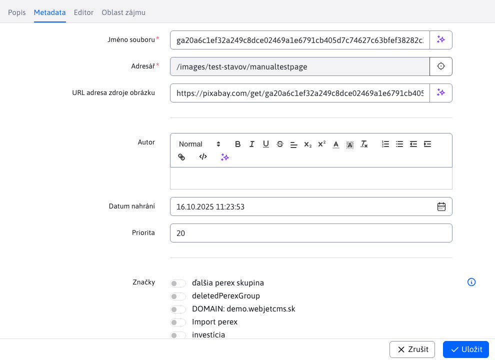

### Video soubory

Soubory videa můžete vkládat také prostřednictvím dialogového okna pro vkládání obrázků. Buď přímo ze serveru výběrem videosouboru, nebo zadáním odkazu na webovou stránku do pole URL. `YouTube/Facebook/TikTok`.

WebJET automaticky vloží video přehrávač místo obrázku pro video soubor.

### Úpravy obrázků

Pokud je obrázek příliš velký a nevejde se na stránku nebo potřebujete provést jiné úpravy obrázku, můžete použít editor obrázků. Klepněte na obrázek a poté na ikonu tužky, čímž se otevře [editor obrázků](../../image-editor/README.md).

## Vkládání a úpravy tabulek

Tabulku lze vytvořit dvěma způsoby. Použijte předdefinovanou stylizovanou tabulku nebo vložte tabulku zkopírováním ze stránky `Word` / `Excel` soubor.

### Vytvoření tabulky barev

Chcete-li vytvořit tabulku, klikněte na ikonu **Vložení tabulky**, :

Pokud potřebujete vytvořit složitější tabulku, musíte kliknout na možnost **Přečtěte si více** kde se zobrazí dialogové okno pro nastavení tabulky:

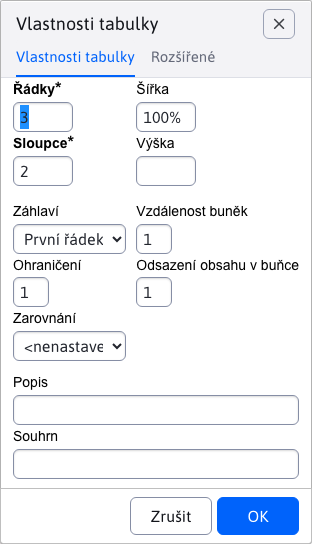

Zde můžete nastavit počet sloupců a řádků. Pokud chcete, aby šířka tabulky odpovídala obsahu, nemusíte ji zadávat (předvyplněnou hodnotu smažte). Ostatní parametry by měly být ponechány s nulovou hodnotou, aby nebojovaly s přednastaveným stylem tabulky. Potvrzením `OK` vložit tabulku na původní pozici kurzoru.

### Vložení tabulky z `Word` a `Excel` soubor

Při vkládání tabulky z jiných aplikací nebo dokumentů pomocí klávesové zkratky `CTRL + v` systém se automaticky zeptá, zda chcete stůl vyčistit. Pokud klepnete na tlačítko `OK`, editor vyčistí tabulku od nežádoucích formátovacích znaků z původního dokumentu, ale strukturu tabulky ponechá v původní podobě.

Tabulka zůstane v obsahu stránky zachována i v případě, že pomocí nástroje pro vkládání textu vložíte text z `Word` / `Excel` soubor (`CTRL + w`) .

### Úprava existující tabulky

Pokud potřebujete upravit existující tabulku, která je na stránce nebo kterou jste právě vložili jedním z výše uvedených způsobů, máte k dispozici několik nástrojů pro její úpravu. Klepnutím pravým tlačítkem myši do některé z buněk tabulky vyvoláte kontextovou nabídku.

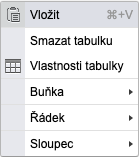

Chcete-li odstranit nebo přidat další řádek, použijte položku podnabídky **Řádek**.

Chcete-li vložit nebo odstranit sloupec, použijte položku podnabídky **Sloupec**.

Pokud chcete sloučit dvě sousední buňky (v rámci řádku), musíte vybrat jejich obsah (pokud neobsahují žádný text, zadejte nejprve do buňky libovolný text, aby byla buňka viditelnější), klikněte pravým tlačítkem myši na vybraný obsah a vyberte položku podnabídky. **Buňka** a v této podnabídce položka **Sloučení buněk**.

Obsah buněk se pak sloučí do jedné a můžete je dále upravovat.

Pokud chcete odstranit původní ohraničení tabulky, změnit odsazení buněk nebo tabulku obarvit, klikněte na tlačítko . **Vlastnosti tabulky**. Zobrazí se dialogové okno, ve kterém můžete měnit různé parametry tabulky, kromě počtu řádků a sloupců v tabulce (ty se mění, jak je uvedeno na předchozí stránce).

Pokud chcete, aby šířka tabulky odpovídala obsahu, není třeba šířku tabulky zadávat (hodnotu odstraňte). Pokud chcete, aby tabulka byla na celou šířku stránky, můžete zadat hodnotu 100 %. Výšku tabulky nezadávejte.

Chcete-li změnit zarovnání textu v buňce tabulky na střed nebo vpravo, klikněte do buňky pravým tlačítkem myši a vyberte podnabídku. **Buňka** a v této podnabídce položka **Vlastnosti buňky**.

Zobrazí se dialogové okno Vlastnosti buňky, kde můžete nastavit svislé nebo vodorovné zarovnání textu v buňce. Ostatní parametry v okně neměňte.

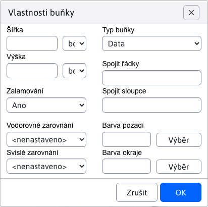

## Vložení aplikace

Chcete-li vložit aplikaci, klikněte na modrou ikonu kostky aplikace. . Zobrazí se dialogové okno se seznamem aplikací:

Do vyhledávacího pole můžete zadat název aplikace:

Kliknutím na název aplikace zobrazíte podrobnosti o aplikaci - její popis, fotografie a možnost vložit aplikaci na stránku:

Po kliknutí na tlačítko "Vložit do stránky" se aplikace vloží do stránky a zobrazí se nastavení aplikace:

Pokud je aplikace již vložena do stránky, kliknutím uvnitř aplikace se zobrazí stejné okno nastavení aplikace. Můžete snadno upravit její stávající nastavení.

## Předpřipravené bloky

Editor stránek nabízí možnost vkládat přednastavené bloky (`HTML` objektů) na stránku. Např. tabulka, text, kontaktní formulář atd. Do aktuální stránky můžete také vložit obsah jiné stránky (např. opakující se formulář).

Chcete-li zobrazit bloky, klikněte na ikonu  v editoru stránky, který zobrazí dialogové okno s kategoriemi bloků.

Více informací v popisu aplikace [předpřipravené bloky](../../apps/htmlbox/README.md).

## Vkládání speciálních znaků

Někdy se může stát, že budete potřebovat napsat znaky, které slovenská klávesnice neobsahuje, například dolar (`$`), Euro (`€`) nebo sprosté slovo (`@`). Pro usnadnění práce můžete vkládat speciální znaky pomocí modulu ready. Klikněte na ikonu 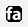 zobrazí se dialogové okno s nabídkou speciálních (ale i standardních) znaků.

Po kliknutí na požadovaný znak se znak napíše na pozici kurzoru. Speciální znaky se vkládají jako text, takže nemají žádná další nastavení.

!> Poznámka: ikona pro vkládání speciálních znaků může být v některých případech změněna na ikonu.  pro vložení [FontAwesome](../../../frontend/webpages/fontawesome/README.md) Obrázky.
