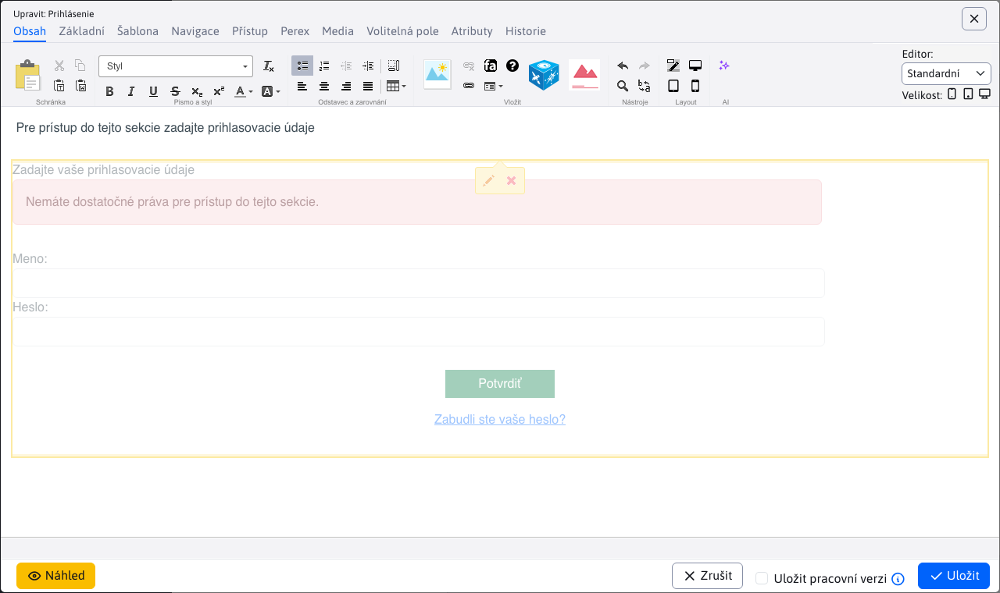
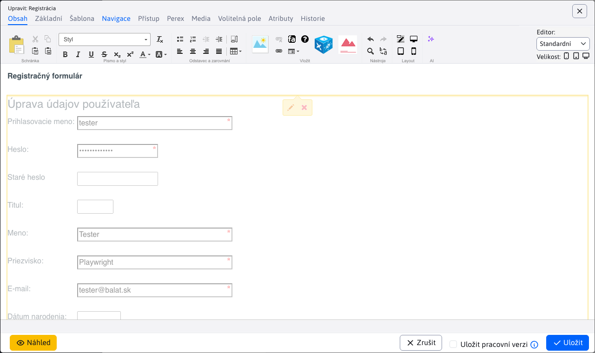

# Stránky chráněné heslem

Na stránkách chráněných heslem je možné definovat část webu, která je přístupná pouze po zadání uživatelského jména a hesla - někdy se označuje jako část pro členy nebo část s řízeným přístupem. Je možné definovat více skupin uživatelů a definovat tak několik různých částí webu přístupných uživatelům z různých skupin. Jedna část webu může být přístupná pouze pro klienty a jiná pro obchodní partnery.

## Definování skupin

Nejprve je třeba definovat skupiny uživatelů. Seznam uživatelských skupin je k dispozici v levém menu v části **Uživatelé** Stejně jako **Skupiny uživatelů**.

Systém rozlišuje dva typy skupin:
- Přístupy do části webu chráněné heslem - skupina pro stránky chráněné heslem
- Hromadný odběr e-mailů - skupina pro e-mailový distribuční seznam

Dále nás zajímá typ **Přístupy do sekce webových stránek chráněné heslem**. Vlastnosti můžete nastavit v editoru:
- Název - jedinečný název skupiny.
- Typ skupiny uživatelů - typ skupiny, který jsme uvedli výše.
- Poznámka - jakákoli poznámka.
- Vyžaduje schválení - pokud je zaškrtnuto, bude po registraci uživatele do této skupiny nejprve odeslán e-mail správci, aby registraci schválil. Uživatel bude vytvořen v databázi, ale nebude mít zaškrtnutou možnost Schváleno a nebude se moci přihlásit.
- Povolit přidání/odebrání ze skupiny uživatelem - pokud je tato možnost vybrána, uživatel bude moci sám přidat/odebrat skupinu při registraci nebo ve svém profilu/nastavení. Obvykle se používá u skupin hromadných e-mailů, aby si uživatel mohl sám nastavit, do jakých e-mailových skupin se bude přihlašovat. Tato možnost by měla být zaškrtnuta také u skupin do zaheslované sekce, do které se uživatel může registrovat. Například uživatel se zaregistruje do skupiny Zákazník, která má tuto volbu povolenou, ale skupina Velkoobchod tuto volbu nemá a přiřadit skupinu zákazníkovi může pouze správce.
- Vyžadovat ověření e-mailové adresy - pokud je nastaveno, bude uživateli po registraci zaslán e-mail s odkazem, na který je třeba kliknout pro ověření e-mailové adresy.
- ID stránky textu e-mailu - ID stránky textu e-mailu, který bude uživateli odeslán po schválení. Obvykle se jedná o uvítací e-mail.

Pomocí aplikace Přihlášený uživatel můžete do stránky s textem e-mailu vložit pole, která jsou nahrazena hodnotami zadanými uživatelem, podobně jako při definování. [hromadný e-mail](../apps/dmail/campaings/README.md#Základní). Kromě výše uvedených polí můžete zadat další pole:
- `!APPROVER_USER_NAME!` - celé jméno schvalovatele.
- `!APPROVER_USER_PHONE!` - telefonní kontaktní údaje schvalovatele.
- `!APPROVER_USER_EMAIL!` - e-mailová adresa schvalovatele.
- `!LOGGED_USER_PASSWORD!` - zadané heslo lze použít pouze pro okamžité schválení (pokud je heslo stále dostupné z registračního formuláře) nebo po kliknutí na tlačítko pro schválení s vygenerováním nového hesla.

## Přihlašovací dialogová stránka

Pokud přistupujete k webu chráněnému heslem, zobrazí WebJET standardní přihlašovací dialog. Pro přihlášení však můžete vytvořit a použít speciální stránku s vhodným textem a designem.

Vytvořte novou stránku (nezáleží na tom, kde bude, může být buď v hlavním adresáři, nebo v adresáři, který chcete chránit heslem) a vložte do ní aplikaci Přihlášený uživatel->Přihlašovací formulář. Název stránky je rovněž libovolný. Obsahem stránky tedy bude kód `!INCLUDE(/components/user/logon.jsp)!` který představuje registrační formulář.

Stránku uložte a poznamenejte si její ID. Na stránku můžete přidat další vysvětlující text nebo odkaz na registrační stránku.

## Registrační stránka

Pokud chcete, aby návštěvníci měli možnost se zaregistrovat, vytvořte stránku a vložte do ní aplikaci Přihlášený uživatel->Registrační formulář. Obsahem stránky pak bude kód `!INCLUDE(/components/user/newuser.jsp, ...)!` který představuje registrační formulář.

Při úpravách registračního formuláře můžete kromě vzhledu formuláře nastavit i jeho chování ve spánku. Nejdůležitějšími parametry jsou:
- **Zobrazená pole** a **Povinná pole** nastavit vzhled samotného formuláře a pole, která jsou povinná.
- **E-mailová adresa musí být jedinečná** pokud je vybrána, systém zkontroluje, zda je uživatel se zadanou e-mailovou adresou již registrován, a pokud ano, bude opětovná registrace zamítnuta.
- **DocID stránky, která se zobrazí po úspěšné registraci.**, zde zadejte ID stránky, která obsahuje text o úspěšné registraci.
- **Oznámení o registraci vám bude zasláno na váš e-mail.** &#x70;okud je vybrána, bude na tento e-mail zasláno oznámení při každé registraci nového uživatele (pokud je prázdná, nebudou zasílána žádná oznámení).
- **Vyžadovat potvrzení e-mailové adresy**, bude vyžadováno ověření e-mailové adresy uživatelem nebo schválení správcem. Další informace o této možnosti naleznete na adrese [Typy ověření](#typy-ověřování).

## Definování dostupných stránek/složek

Pro správnou funkci je nutné definovat stránky nebo složky, které mají být přístupné pouze po zadání hesla. Pokud zaheslujete složku, budou zaheslovány všechny stránky v této složce. To však neplatí pro podsložky a stránky v rámci podsložek.

Klikněte na možnost WEBové stránky->Seznam webových stránek a přejděte do složky, kterou chcete chránit heslem. Klikněte na Upravit složku a tam na kartě Přístup vyberte skupiny, pro které má být složka přístupná.

Seznam složek, pro které je skupina Users použita, se zobrazí při úpravě skupiny na kartě **Složky**.

ID stránky pro složku můžete nastavit pomocí speciálního přihlašovacího formuláře. Pokud není nastaveno, zobrazí se jednoduchý/standardní přihlašovací formulář. Stránku můžete nastavit buď na složku, která je zaheslovaná, nebo nejlépe na kořenovou složku, protože ID stránky přihlašovacího formuláře se hledá rekurzivně až do kořenové složky, dokud není nalezena. Do tohoto pole tedy zadejte ID stránky, na kterou jste aplikaci umístili. `/components/user/logon.jsp` nebo kliknutím na tlačítko Vybrat stránku vyberte stránku ze seznamu.

Chcete-li heslem chránit pouze určitou stránku, otevřete ji v editoru a kliknutím na kartu Přístup vyberte skupiny, pro které má být stránka dostupná.

Seznam webových stránek, pro které se skupina uživatelů používá, se zobrazuje při úpravách skupiny na kartě **Webové stránky**.

## Typy ověření

Na základě nastavení registračního formuláře a vybraných skupin uživatelů se můžete registrovat třemi způsoby.

Před vysvětlením různých metod registrace je třeba zmínit vztah mezi parametry. **Vyžaduje schválení** a **Povolit přidání/odebrání ze skupiny samotným uživatelem** při úpravě skupiny uživatelů. Pokud je tato možnost **Povolit přidání/odebrání ze skupiny samotným uživatelem** není vybrána, požadované schválení skupiny se ignoruje. V zásadě není třeba schvalovat skupinu uživatelů, kterou uživatel stejně nemůže přidat.

### Okamžité schválení

K okamžitému schválení nového registrovaného uživatele dojde pouze v případě, že:

1. v registračním formuláři NENÍ vybrána možnost **Vyžadovat potvrzení e-mailové adresy**

2. skupiny uživatelů ve formuláři NEMAJÍ vybranou možnost **Vyžaduje schválení**

3. skupiny uživatelů ve formuláři HAVE vybraná možnost **Povolit přidání/odebrání ze skupiny samotným uživatelem**

Pokud jsou tyto požadavky splněny, bude uživatel automaticky schválen a přihlášen ihned po registraci. Uživatel také obdrží e-mail o úspěšné registraci, který bude obsahovat přihlašovací jméno a heslo uživatele.

!>**Varování:** Pokud skupina uživatelů vyžaduje schválení, ale uživatel nemá povoleno přidávání/odebírání ze skupiny, parametr **Vyžaduje schválení** bude ignorován, i když bude zvolen a dojde k okamžitému schválení.

!>**Varování:** Pokud je parametr **Povolit přidání/odebrání ze skupiny samotným uživatelem** není pro skupinu uživatelů vybrána, nebude skupina k uživateli přidána, i když samotná registrace proběhne úspěšně. To může vést k situaci, kdy uživatel není přidán do žádné skupiny a nemůže se přihlásit do zaheslované sekce (registrace je úspěšná a není hlášena žádná chyba, ale přihlášení není možné).

### Potvrzení e-mailové adresy

Může nastat situace, kdy je uživatel požádán, aby nejprve ověřil svůj e-mail pomocí odkazu zaslaného na tento e-mail. Bez ověření se nebude moci přihlásit. Tato situace nastane, pokud:

1. registrační formulář MÁ vybranou možnost **Vyžadovat potvrzení e-mailové adresy**

2. skupiny uživatelů ve formuláři NEMAJÍ vybranou možnost **Vyžaduje schválení**

3. skupiny uživatelů ve formuláři HAVE vybraná možnost **Povolit přidání/odebrání ze skupiny samotným uživatelem**

Pokud jsou tyto požadavky splněny, bude uživateli na jeho e-mailovou adresu zaslán e-mail s odkazem, na který musí kliknout pro ověření. Po úspěšném ověření se uživatel bude moci přihlásit do zaheslované sekce a obdrží také e-mail o úspěšné registraci obsahující přihlašovací jméno uživatele, nikoli však heslo.

!>**Varování:** Pokud je parametr **Povolit přidání/odebrání ze skupiny samotným uživatelem** není pro skupinu uživatelů vybrána, nebude skupina k uživateli přidána, i když samotná registrace proběhne úspěšně. To může vést k situaci, kdy uživatel není přidán do žádné skupiny a nemůže se přihlásit do zaheslované sekce (registrace je úspěšná a není hlášena žádná chyba, ale přihlášení není možné).

### Schválení správcem

Mohou nastat situace, kdy musí být uživatel před přidáním do skupiny uživatelů schválen. V takovém případě se nebude moci přihlásit, dokud ho správce neschválí. Tato situace nastane, pokud:

1. parametr **Vyžadovat potvrzení e-mailové adresy** bude mít nějakou hodnotu. Schválení skupiny má vyšší prioritu, takže schválení e-mailem bude ignorováno.

2. skupiny uživatelů ve formuláři HAVE vybraná možnost **Vyžaduje schválení**

3. skupiny uživatelů ve formuláři HAVE vybraná možnost **Povolit přidání/odebrání ze skupiny samotným uživatelem**

Schválení registrace uživatele (schválení přidání do skupiny uživatelů) se provádí v aplikaci **Seznam uživatelů**.

Schválení lze provést:
- pomocí tlačítka  na panelu nástrojů, kde budou schváleni uživatelé ve zvýrazněných řádcích. Po tomto schválení se uživatel bude moci přihlásit do zaheslované sekce a obdrží také e-mail o úspěšné registraci obsahující přihlašovací jméno uživatele.
- pomocí tlačítka  na panelu nástrojů, kde se uživatelé ve zvýrazněných řádcích a jejich hesla změní na náhodně vygenerovaná. Po tomto ověření se uživatel bude moci přihlásit do zaheslované sekce a obdrží také e-mail o úspěšné registraci obsahující přihlašovací jméno uživatele a nově VYGENEROVANÉ heslo.

!>**Varování:** Pokud skupina uživatelů vyžaduje schválení, ale uživatel nemá povoleno přidávání/odebírání ze skupiny, parametr **Vyžaduje schválení** bude ignorován, i když je vybrán, a typ schválení bude proveden v závislosti na hodnotě parametru **Vyžadovat potvrzení e-mailové adresy**.
