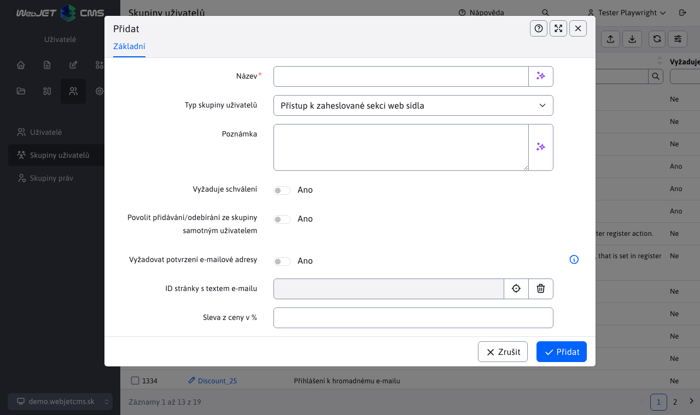
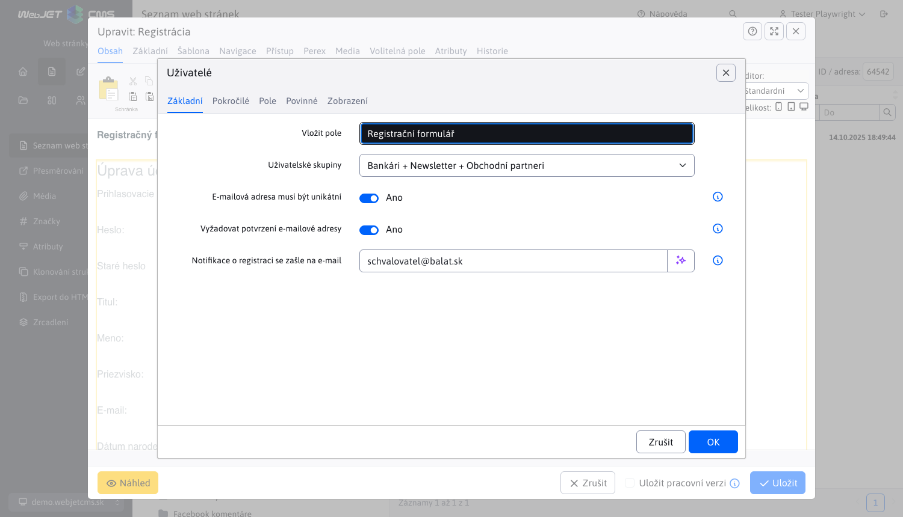
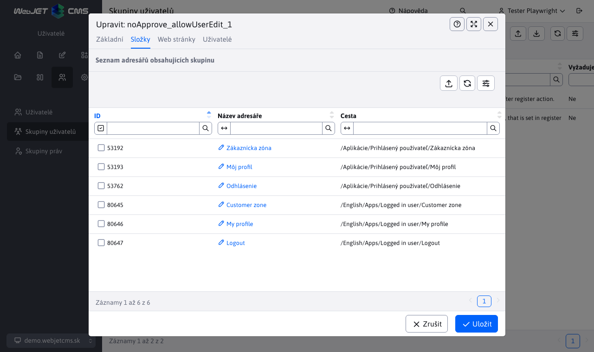
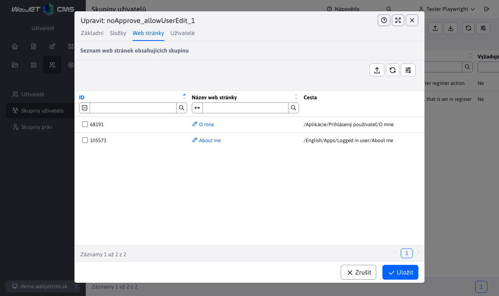
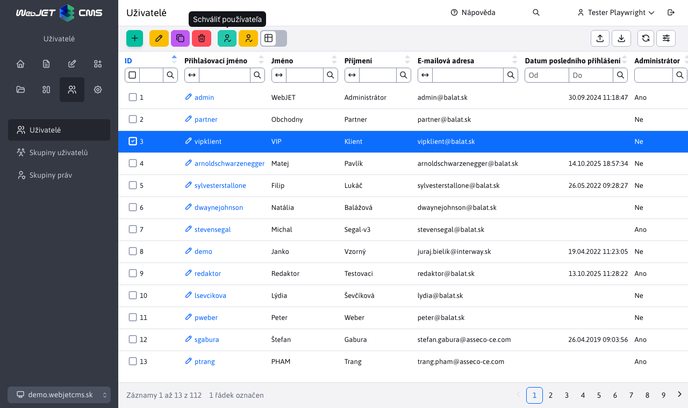

# Zaheslované stránky

Pomocí zaheslovaných stránek lze definovat část web sídla přístupnou pouze po zadání jména a hesla – někdy označované jako členská sekce, respektive sekce s kontrolovaným přístupem. Je možné definovat více skupin uživatelů a tím zadefinovat několik různých částí web sídla dostupných pro uživatele v různých skupinách. Jedna část webu může být dostupná pouze pro Klienty a jiná zase pro Obchodní partnery.

## Definování skupin

Nejprve je třeba definovat skupiny uživatelů. Seznam skupin uživatelů je dostupný v levém menu v sekci **Uživatelé** jak **Skupiny uživatelů**.

Systém rozlišuje dva typy skupin:
- Přístupů k zaheslované sekci web sídla - skupina pro zaheslované stránky
- Přihlášení k hromadnému e-mailu - skupina pro distribuční seznam pro posílání emailů

Nás dále zajímá právě typ **Přístupů k zaheslované sekci web sídla**. V editoru můžete nastavit vlastnosti:
- Název – unikátní název skupiny.
- Typ skupiny uživatelů - typ skupiny, který jsme zmiňovali výše.
- Poznámka - libovolná poznámka.
- Vyžaduje schválení - pokud je zaškrtnuto tak po zaregistrování uživatele do této skupiny se nejprve zašle email ke schválení registrace administrátorovi. Uživatel se vytvoří v databázi, nebude mít ale zvolenou možnost Schválen a nebude se moci přihlásit.
- Povolit přidávání/odebírání ze skupiny samotným uživatelům - pokud je zvoleno, tak skupinu si bude moci přidat/odebrat sám uživatel při registraci, nebo v jeho profilu/nastaveních. Obvykle se používá pro skupiny pro hromadný email, aby si sám uživatel mohl nastavit do jakých emailových skupin bude přihlášen. Možnost je třeba zvolit i pro skupiny k zaheslované sekci do kterých se může uživatel registrovat. Např. uživatel se registruje do skupiny Zákazník, která má povolenou možnost, ale skupina Velkoobchod tuto možnost nemá a skupinu může přiřadit zákazníkovi jen administrátor.
- Vyžadovat potvrzení e-mailové adresy - je-li nastaveno, tak uživateli bude po registraci odeslán email s odkazem, na který bude muset kliknout pro ověření platnosti email adresy.
- ID stránky s textem e-mailu - ID stránky s textem emailu který se uživateli zašle po jeho schválení. Typicky se jedná o uvítací email.

Do stránky s textem e-mailu lze pomocí aplikace Přihlášený uživatel vkládat pole, která se nahradí za hodnoty zadané uživatelem podobně jako při definování [hromadného emailu](../apps/dmail/campaings/README.md#základní). Kromě uvedených polí lze zadat dodatečná pole:
- `!APPROVER_USER_NAME!` - celé jméno schvalovatele.
- `!APPROVER_USER_PHONE!` - telefonní kontakt na schvalovatele.
- `!APPROVER_USER_EMAIL!` - emailová adresa schvalovatele.
- `!LOGGED_USER_PASSWORD!` - zadané heslo lze použít pouze při okamžitém schválení (kdy je heslo dostupné ještě z registračního formuláře) nebo při kliknutí na tlačítko pro schválení s generováním nového hesla.

## Stránka s přihlašovacím dialogem

WebJET zobrazí standardní přihlašovací dialog pokud přistupujete k zaheslované stránce. Můžete ale vytvořit a použít speciální stránku s vhodným textem a designem pro přihlášení.

Vytvořte novou stránku (je jedno kde se bude nacházet, může být buď v hlavním adresáři, nebo v adresáři, který chcete zaheslovat) a do stránky vložte aplikaci Přihlášený uživatel->Přihlašovací formulář. Název stránky je také libovolný. Tedy obsah stránky bude kód `!INCLUDE(/components/user/logon.jsp)!`, který reprezentuje přihlašovací formulář.

Stránku uložte a poznamenejte si její ID. Do stránky můžete vložit ještě nějaký vysvětlující text, případně odkaz na stránku s registrací.

## Stránka s registrací

Chcete-li, aby návštěvníci měli možnost registrace vytvořte stránku a vložte do ní aplikaci Přihlášený uživatel->Registrační formulář. Obsah stránky bude tedy kód `!INCLUDE(/components/user/newuser.jsp, ...)!` , který reprezentuje formulář registrace.

Při editaci registračního formuláře můžete kromě vzhledu formuláře nastavit také jeho spávání. Nejdůležitější parametry jsou:
- **Zobrazená pole** a **Povinná pole**, kterými nastavíte samotný vzhled formuláře a která pole jsou povinná.
- **E-mailová adresa musí být unikátní**, pokud je možnost zvolena, systém zkontroluje, zda uživatel se zadanou e-mailovou adresou již není zaregistrován, a pokud ano, opětovná registrace bude zamítnuta.
- **DocID stránky, která se zobrazí po úspěšné registraci**, zde zadejte ID stránky, která obsahuje text o úspěšné registraci.
- **Notifikace o registraci se zašle na e-mail**, pokud je možnost zvolena, na tento e-mail se odešle notifikace při každé registraci nového uživatele (je-li hodnota prázdná, notifikace se nebudou odesílat).
- **Vyžadovat potvrzení e-mailové adresy**, bude se vyžadovat ověření e-mailové adresy uživatelem nebo jeho schválení administrátorem. Bližší informace o tom naleznete v sekci [Typy ověření](#typy-ověření).

## Definování dostupných stránek / složek

Pro správné fungování je třeba zadefinovat stránky nebo složky, které mají být dostupné až po zadání hesla. Pokud zaheslujete složku, všechny stránky v této složce budou zaheslovány. Netýká se to však podsložek a stránek v podsložkách.

Klikněte na menu WEB Stránky->Seznam web stránek a přejděte do složky, kterou chcete zaheslovat. Klepněte na Upravit složku a tam v kartě Přístup zvolte skupiny, pro které má být složka dostupná.

Seznam složek pro které je Skupina Uživatelů použita se zobrazuje při editaci skupiny v kartě **Složky**.

Složce můžete nastavit ID stránky se speciálním formulářem pro přihlášení. Pokud není nastavena, zobrazí se jednoduchý/standardní formulář pro přihlášení. Stránku můžete nastavit buď složce, která je zaheslovaná, nebo nejlépe kořenové složce, protože ID stránky s přihlašovacím formulářem se vyhledává rekurzivně až ke kořenové složce, dokud se nenajde. Do tohoto pole tedy zadejte ID stránky do které jste vložili aplikaci `/components/user/logon.jsp`, případně klepnutím na tlačítko Vyber stránku vyberte ze seznamu.

Chcete-li zaheslovat pouze specifickou stránku, otevřete si ji v editoru a klikněte na kartu Přístup a tam zvolte skupiny, pro které má být stránka dostupná.

Seznam web stránek pro které je Skupina Uživatelů použita se zobrazuje při editaci skupiny v kartě **Web stránky**.

## Typy ověření

Na základě nastavení registračního formuláře a zvolených poživatelských skupin rozlišujeme 3 způsoby registrace.

Před samotným vysvětlením jednotlivých způsobů registrace musíme zmínit vztah mezi parametry **Vyžaduje schválení** a **Povolit přidávání/odebírání ze skupiny samotným uživatelům** při editaci skupiny uživatelů. V případě, že možnost **Povolit přidávání/odebírání ze skupiny samotným uživatelům** není zvolena, vyžadované schválení pro skupinu se ignoruje. V principu není třeba schvalovat skupinu uživatelů, kterou si uživatel stejně nemůže přidat.

### Okamžité schválení

Okamžité schválení nového registrovaného uživatele nastává pouze v případě:

1. registrační formulář NEMÁ zvolenou možnost **Vyžadovat potvrzení e-mailové adresy**

2. uživatelské skupiny ve formuláři NEMAJÍ zvolenou možnost **Vyžaduje schválení**

3. uživatelské skupiny ve formuláři MAJÍ zvolenou možnost **Povolit přidávání/odebírání ze skupiny samotným uživatelům**

Pokud jsou tyto požadavky splněny, uživatel bude po registraci automaticky schválen a okamžitě přihlášen. Také uživatel obdrží email o úspěšné registraci, který bude obsahovat uživatelovo přihlašovací jméno a heslo.

!>**Upozornění:** V případě, že uživatelská skupina vyžaduje schválení, ale nemá povoleno přidávání/odebírání ze skupiny samotným uživatelem, parametr **Vyžaduje schválení** se bude ignorovat i kdyby byl zvolen a okamžité schválení proběhne.

!>**Upozornění:** V případě, že parametr **Povolit přidávání/odebírání ze skupiny samotným uživatelům** není u skupiny uživatelů zvolen, skupina se uživateli nepřidá, i když samotná registrace proběhne úspěšně. Následkem může být stav, kdy se uživateli nepřidá žádná skupina a nebude schopen přihlásit se do zaheslované sekce (registrace proběhne úspěšně a neohlásí žádnou chybu, ale přihlášení nebude možné).

### Potvrzení email adresy

Může nastat situace, kdy uživatel bude vyzván k tomu, aby nejprve ověřil svůj email pomocí poslaného odkazu na tento email. Bez ověření nebude schopen přihlásit se. Tato situace nastává v případě, že:

1. registrační formulář MÁ zvolenou možnost **Vyžadovat potvrzení e-mailové adresy**

2. uživatelské skupiny ve formuláři NEMAJÍ zvolenou možnost **Vyžaduje schválení**

3. uživatelské skupiny ve formuláři MAJÍ zvolenou možnost **Povolit přidávání/odebírání ze skupiny samotným uživatelům**

Pokud jsou tyto požadavky splněny, na uvedenou email adresu uživatele bude zaslán email s odkazem, na kterou bude muset kliknout pro ověření. Po úspěšném ověření se uživatel bude umět přihlásit do zaheslované sekce a také obdrží email o úspěšné registraci, který bude obsahovat uživatelovo přihlašovací jméno, ale ne heslo.

!>**Upozornění:** V případě, že parametr **Povolit přidávání/odebírání ze skupiny samotným uživatelům** není u skupiny uživatelů zvolen, skupina se uživateli nepřidá, i když samotná registrace proběhne úspěšně. Následkem může být stav, kdy se uživateli nepřidá žádná skupina a nebude schopen přihlásit se do zaheslované sekce (registrace proběhne úspěšně a neohlásí žádnou chybu, ale přihlášení nebude možné).

### Schválení administrátorem

Může nastat situace, kdy uživatel musí být schválen předtím, než bude přidán do skupiny uživatelů. V takovém případě se nebude moci přihlásit do momentu, než jej administrátor schválí. Tato situace nastává v případě, že:

1. parametr **Vyžadovat potvrzení e-mailové adresy** bude mít jakoukoli hodnotu. Schválení skupiny má větší prioritu, takže schválení emailu bude ignorováno

2. uživatelské skupiny ve formuláři MAJÍ zvolenou možnost **Vyžaduje schválení**

3. uživatelské skupiny ve formuláři MAJÍ zvolenou možnost **Povolit přidávání/odebírání ze skupiny samotným uživatelům**

Schvalování registrace uživatele (schválení přidání do skupiny uživatelů) se děje v sekci **Seznam uživatelů**.

Schvalování lze provést:
- pomocí tlačítka  v nástrojové liště, kde uživatelé v označených řádcích budou schválen. Po tomto schválení se uživatel bude moci přihlásit do zaheslované sekce a také obdrží email o úspěšné registraci, který bude obsahovat uživatelovo přihlašovací jméno.
- pomocí tlačítka  v nástrojové liště, kde uživatelé v označených řádcích a bude jim změněno heslo na náhodně vygenerované. Po tomto ověření se uživatel bude umět přihlásit do zaheslované sekce a také obdrží email o úspěšné registraci, který bude obsahovat uživatelovo přihlašovací jméno a nově VYGENEROVANÉ heslo.

!>**Upozornění:** V případě, že uživatelská skupina vyžaduje schválení, ale nemá povoleno přidávání/odebírání ze skupiny samotným uživatelem, parametr **Vyžaduje schválení** se bude ignorovat i kdyby byl zvolen a proběhne typ schválení v závislosti na hodnotě parametru **Vyžadovat potvrzení e-mailové adresy**.
