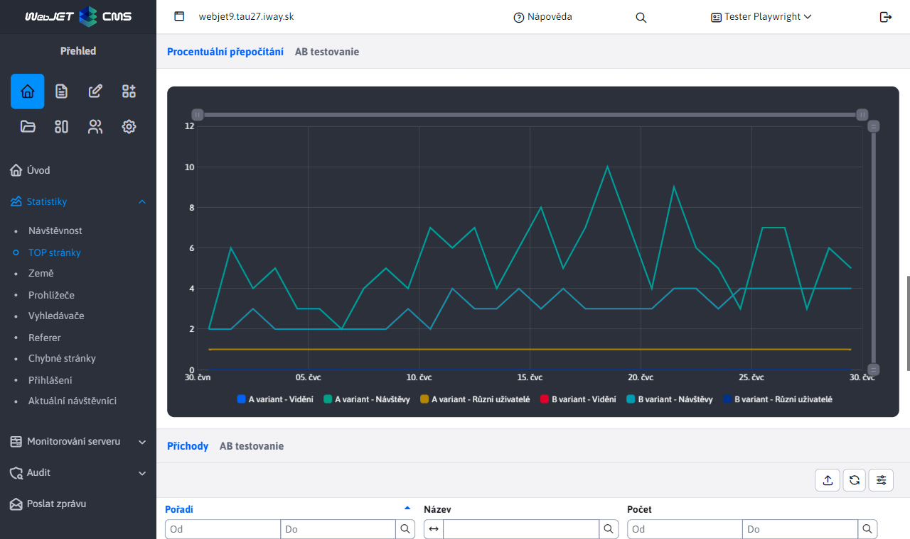
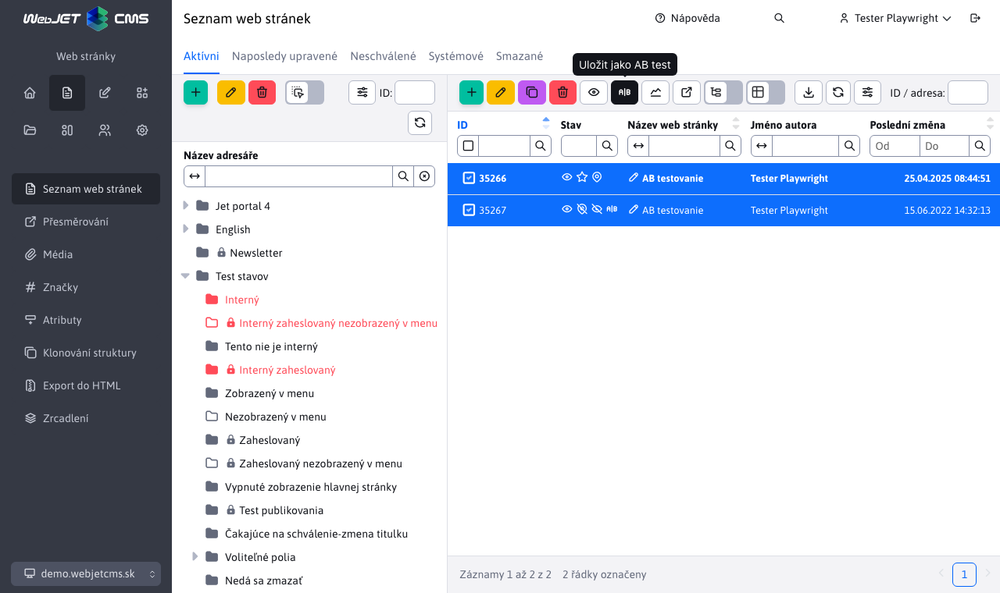

# Přehled nových vlastností - rok 2024

Tato sekce obsahuje popisy vlastností a **funkcionalit WebJET CMS srozumitelným jazykem**, bez zbytečně technických formulací v roce 2024. Nové záznamy se přidávají na vrch (pod tento úvod), takže nejnovější vlastnosti jsou vždy nahoře.

---

## MultiWeb — správa více webů v jedné instalaci

WebJET CMS přináší režim **MultiWeb**, který umožňuje provozovat **více zcela samostatných webových sídel v rámci jedné instalace**. Každá doména se navenek chová jako nezávislá instalace – má vlastní obsah, vlastní uživatele, vlastní šablony i vlastní e-mailové kampaně. Návštěvníci ani redaktoři jednotlivých domén nevědí, že „pod kapotou“ běží společný systém.

Toto řešení je ideální pro organizace, které potřebují provozovat **více menších webů s centrální správou**. Typickým příkladem je **webová agentura**, která vytváří a spravuje stránky pro své klienty – každý klient má vlastní web s vlastním obsahem a uživateli, ale agentura má vše v jednom systému. Stejně výhodné je to pro **státní organizace a instituce**, které potřebují provozovat weby pro podřízené organizace, regionální pobočky nebo projekty. Namísto desítky samostatných instalací stačí jediná, což dramaticky snižuje náklady na provoz a údržbu.

Klíčovou výhodou je, že **bezpečnostní aktualizace a vylepšení se aplikují najednou na všechny domény** jedním krokem. Není třeba aktualizovat každý web samostatně, což šetří čas a eliminuje riziko, že některý web zůstane neaktualizován. Správa jednotlivých webů přitom probíhá **plně odděleně** — redaktoři jedné domény nemají přístup k obsahu jiné domény, e-mailové kampaně jsou odděleny podle domén a uživatelské účty jsou nezávislé.

**Hlavní benefity:**

- **Nižší provozní náklady**: Jedna instalace namísto desítek samostatných systémů znamená výrazně nižší náklady na hosting, údržbu a administraci.
- **Centrální bezpečnostní aktualizace**: Aktualizace jednoho systému zajistí všechny domény najednou — žádný web nezůstane zranitelný.
- **Zcela oddělená správa obsahu**: Každá doména má vlastní uživatele, šablony, e-mailové kampaně i mediální soubory — redaktoři jedné domény nevidí obsah jiné.
- **Jednoduchá škálovatelnost**: Přidání nové domény nevyžaduje novou instalaci — stačí ji zřídit ve stávajícím systému.
- **Řídící doména s plnou kontrolou**: Správce má z jednoho místa přístup ke konfiguraci, překladovým klíčům, automatizovaným úlohám a dalším globálním nastavením.
- **Možnost přizpůsobení**: Každá doména může mít vlastní vizuální styl, šablony a nastavení, takže weby nemusí vypadat stejně.

Podrobná dokumentace: [MultiWeb — instalace a konfigurace](../../install/multiweb/README.md)

## AB testování web stránek — optimalizujte konverze na základě dat

WebJET CMS nabízí **vynovenou aplikaci pro AB testování**, která umožňuje snadno porovnat dvě verze web stránky a zjistit, která dosahuje lepších výsledků. Princip je jednoduchý - vytvoříte B verzi stránky jedním kliknutím, upravíte v ní například nadpis, obrázek nebo rozložení prvků, a systém automaticky zobrazuje obě verze návštěvníkům v nastaveném poměru. Návštěvník přitom stále vidí stejnou URL adresu – o testu neví. Na základě reálných dat od návštěvníků pak umíte rozhodnout, která verze stránky funguje lépe.

Aplikace podporuje také takzvané **split testy** — komplexnější testování, při kterém návštěvník po celou dobu návštěvy vidí konzistentní verzi webu. Pokud se mu při prvním přístupu vygeneruje B verze, všechny další stránky s B verzí se mu také zobrazí v B variantě. Toto je klíčové pro testování rozsáhlejších změn, například jiného rozložení celého webu nebo odlišného navigačního toku.

Správa AB testů je **plně integrována do administrace WebJET CMS**. Redaktor má k dispozici přehledný seznam všech probíhajících testů, statistiky s **automatickým poměrovým přepočtem** (pokud poměr A/B není 50:50, systém přepočítá hodnoty tak, aby byly srovnatelné), a konfiguraci testovacích parametrů – včetně poměru zobrazení verzí, platnosti cookies a dalších nastavení. Vše je dostupné přímo z rozhraní systému bez nutnosti externích nástrojů.

**Hlavní benefity:**

- **Rozhodnutí na základě dat**: Namísto odhadů umíte přesně změřit, která verze stránky přináší více konverzí — ať už jde o vyplnění formuláře, kliknutí na tlačítko nebo dokončení nákupu.
- **Jednoduché vytvoření testu**: B verze stránky se vytvoří jedním kliknutím přímo v editoru — není třeba kopírovat obsah ručně ani používat externí nástroje.
- **Automatické zobrazování verzí**: WebJET sám zajistí střídání A a B verze v nastaveném poměru, návštěvník vidí stejnou URL adresu ao testu neví.
- **Split testy pro komplexní změny**: Při testování větších změn (například celkový redesign) návštěvník vidí konzistentní verzi napříč celým webem.
- **Přehledné statistiky s přepočtem**: I při nerovnoměrném poměru A/B systém automaticky přepočítá hodnoty, aby bylo porovnání korektní a férové.
- **Flexibilní konfigurace**: Nastavení poměru verzí, platnosti testovací cookie, možnost aktivace pouze pro přihlášené uživatele a další parametry přímo v administraci.

Podrobná dokumentace: [AB testování web stránek](../../redactor/apps/abtesting/README.md)
