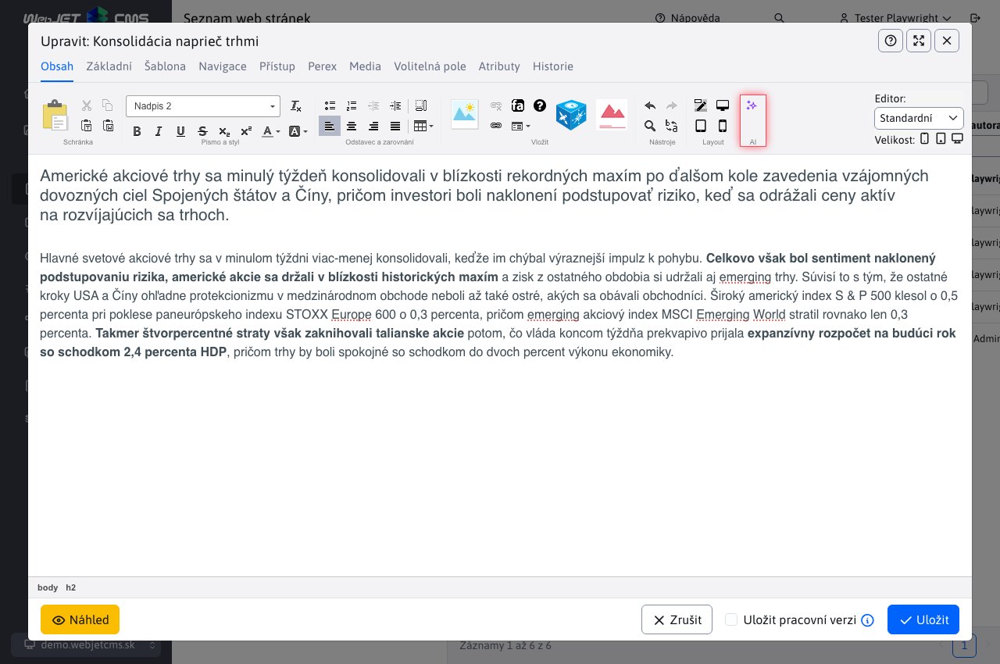
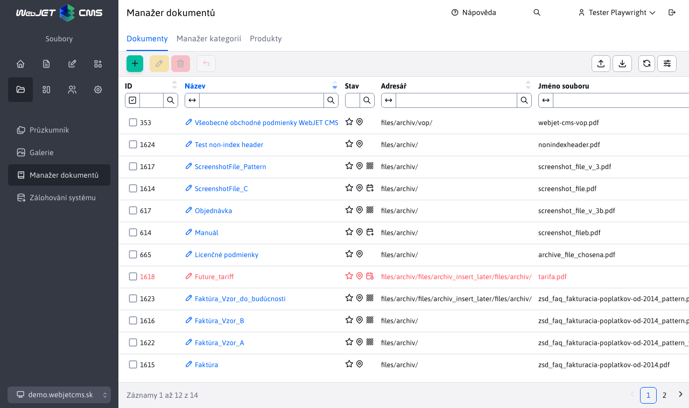
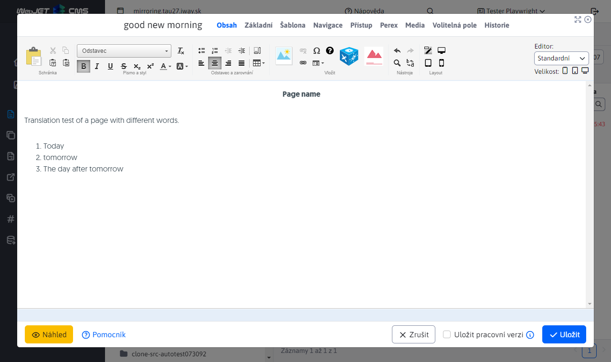
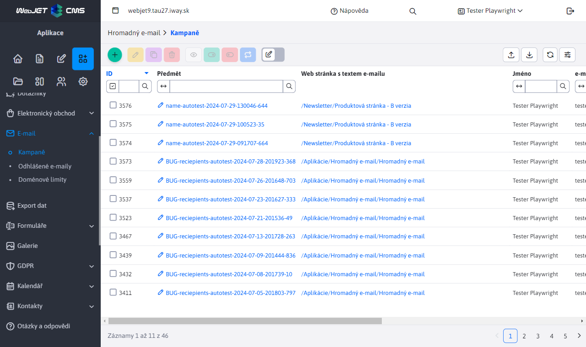
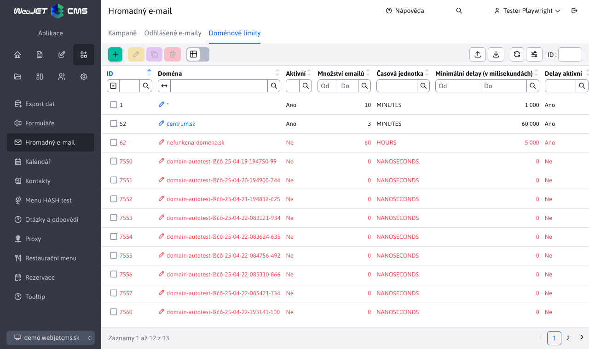
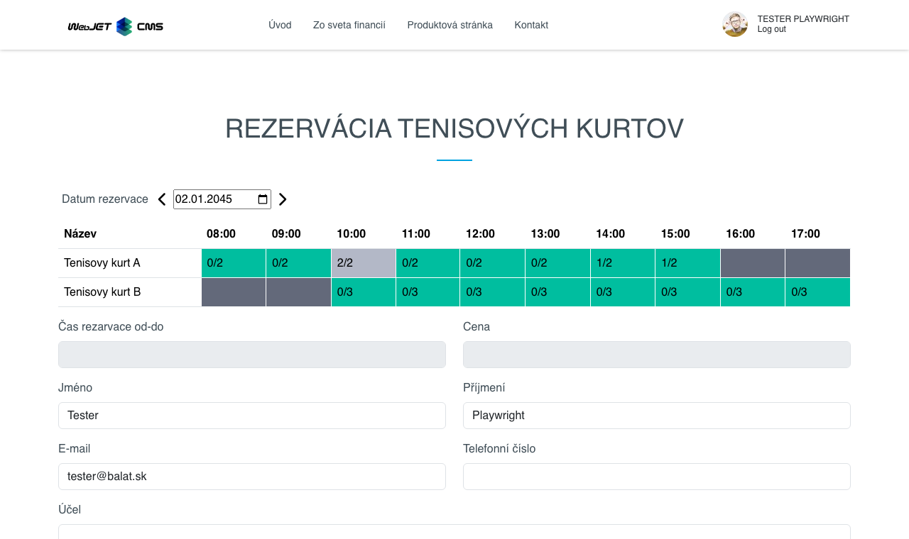
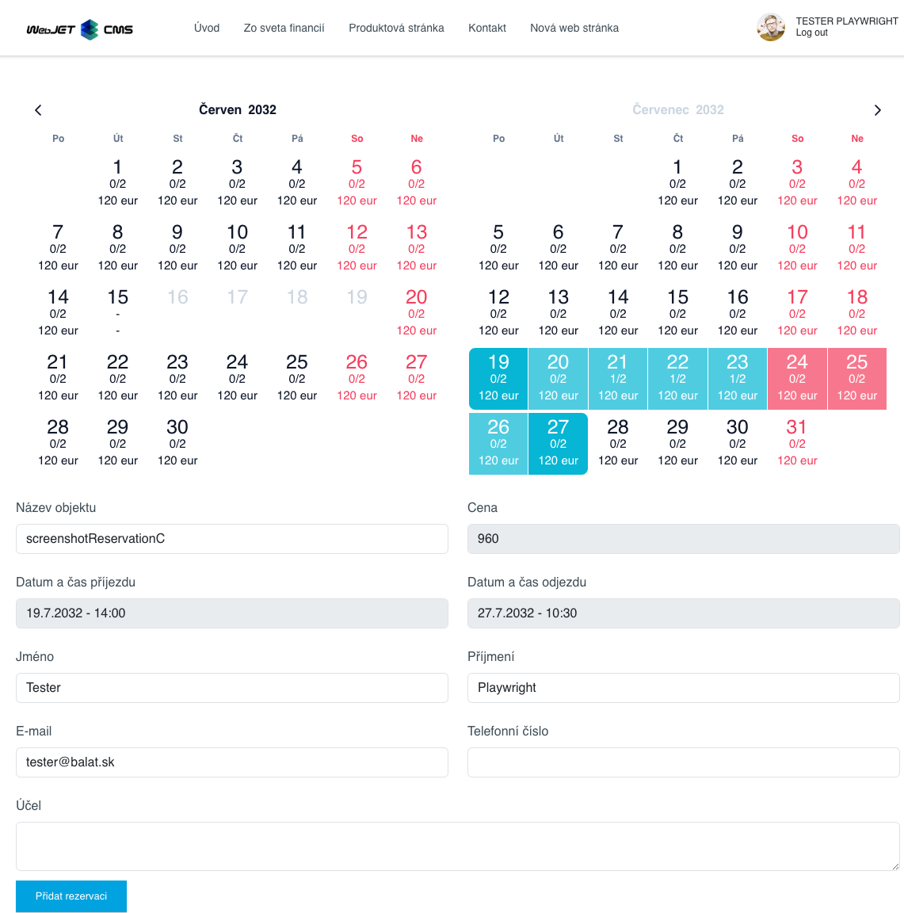
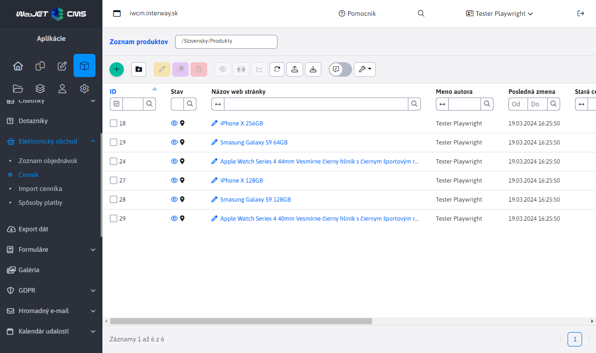

# Informace pro obchodníka - rok 2025

Tento soubor obsahuje popisy vlastností WebJET CMS dodaných v roce 2025 z pohledu prodeje. Nové záznamy se přidávají na vrch (pod tento úvod), takže nejnovější vlastnosti jsou vždy nahoře.

---

## AI asistenti

WebJET CMS přináší **kompletní integraci umělé inteligence** přímo do redakčního systému. Redaktoři a administrátoři tak získávají inteligentní pomocníky, kteří jim pomáhají s tvorbou a úpravou obsahu – od textu přes obrázky až po kompletní webové stránky. Na rozdíl od většiny CMS systémů, kde je AI jen doplňková funkce třetích stran, ve WebJET CMS je **AI nativně integrována do každého editačního okna** — textových polí, obrázků, editoru stránek i nástroje PageBuilder.

Systém podporuje **více poskytovatelů AI služeb** (OpenAI, Google Gemini, OpenRouter a dokonce AI přímo v prohlížeči), což zákazníkovi dává svobodu výběru podle ceny, kvality a dostupnosti. Administrátor může pro různé úkoly nastavit různé poskytovatele – například levnější model pro opravu gramatiky a výkonnější pro generování obsahu. Díky podpoře **OpenRouter** má zákazník přístup ke stovkám AI modelů přes jedno rozhraní, včetně mnoha bezplatných možností pro testování.

Unikátní vlastností je **AI v prohlížeči** — využití modelů přímo na zařízení uživatele bez potřeby externího API, což znamená **nulové náklady za volání** a **maximální ochranu dat**, protože data nikdy neopustí počítač. Tato technologie je ideální pro organizace s přísnými požadavky na ochranu osobních údajů.

**AI asistenti jsou plně konfigurovatelní** — administrátor může vytvářet vlastní asistenty s přesnými instrukcemi pro konkrétní pole a entity. Každý asistent lze přiřadit ke konkrétnímu poli v systému, takže redaktor vždy vidí jen relevantní asistenty. Systém umožňuje definovat instrukce, vybrat model, nastavit streamování odpovědi a požadovat vstup od uživatele – vše bez potřeby programování.

V nástroji **PageBuilder** funguje i **režim chat**, kde AI dokáže generovat kompletní bloky webové stránky, upravovat stávající sekce nebo navrhovat celou strukturu stránky na základě požadavku redaktora. Redaktor může postupně zadávat požadavky a doladit výsledek bez manuálního kódování.

Součástí řešení je i **podrobná statistika využívání** AI asistentů - grafy nejpoužívanějších asistentů, spotřeba tokenů v čase, identifikace uživatelů s nejvyšší spotřebou. To umožňuje organizaci **kontrolovat náklady**, optimalizovat instrukce a vyhodnotit návratnost investice do AI nástrojů.

**Hlavní benefity:**

- **Nativní integrace v celém systému**: AI asistenti jsou dostupní v každém textovém poli, obrázkovém poli, webovém editoru i PageBuilderu - redaktor nemusí přepínat mezi nástroji.
- **Flexibilita poskytovatelů**: Podpora OpenAI, Gemini, OpenRouter a AI v prohlížeči — zákazník si vybírá podle ceny, kvality a požadavků na ochranu údajů.
- **Nulové náklady s AI v prohlížeči**: Lokální zpracování bez API volání znamená žádné poplatky za běžné úkoly jako sumarizace, překlad nebo úprava textu.
- **Plná konfigurovatelnost bez programování**: Administrátor vytváří vlastní asistenty, definuje instrukce a přiřazuje je k polím — žádné zásahy do kódu.
- **Generování a úprava obrázků**: AI umí vytvořit ilustrační obrázky z textového popisu, odstranit pozadí nebo upravit stávající fotografie přímo v CMS.
- **Chat režim pro PageBuilder**: Kompletní generování a úprava struktury webových stránek včetně bloků, textů a rozložení přes konverzaci s AI.
- **Kontrola nákladů**: Podrobné statistiky spotřeby tokenů podle asistentů, uživatelů a dnů umožňují optimalizaci a předvídatelné rozpočtování.
- **Bezpečnost a soukromí**: Možnost šifrování API klíčů, lokální AI v prohlížeči a podrobná oprávnění zajišťují soulad s bezpečnostními politikami organizace.
- **Funkce vrácení změn**: Každý výsledek AI lze jedním kliknutím vrátit zpět, což odstraňuje obavy z nesprávných úprav.

Podrobná dokumentace: [AI asistenti](../../redactor/ai/README.md)

## Manažer dokumentů

WebJET CMS nabízí **Manažer dokumentů** — komplexní aplikaci pro **správu dokumentů a jejich verzí** na jednom místě. Organizace může centrálně spravovat všechny důležité dokumenty (smlouvy, formuláře, směrnice, technické listy), **automaticky sledovat jejich verze** a zajistit, že návštěvníci webu nebo interní uživatelé mají vždy přístup k aktuální verzi. Systém zároveň uchovává celou historii změn, takže je možné kdykoli se vrátit k předchozí verzi dokumentu.

Klíčovou vlastností je **plánování publikování dokumentů do budoucnosti**. Pokud organizace potřebuje zveřejnit nový ceník, směrnici nebo formulář k přesnému datu (například k 1. lednu nového roku), stačí dokument nahrát předem a nastavit datum automatického zveřejnění. Systém ve stanovený čas **sám vymění starou verzi za novou** a volitelně odešle notifikaci odpovědným osobám. To eliminuje riziko lidské chyby a zajišťuje **soulad s legislativními termíny**.

Dokumenty lze organizovat pomocí **produktů, kategorií a kódů produktů**, což umožňuje přehledné filtrování i při stovkách dokumentů. Systém automaticky **kontroluje duplicitu obsahu** — pokud se někdo pokusí nahrát dokument, který již v manažeru existuje, systém na to upozorní. Na webové stránce se dokumenty zobrazují pomocí **konfigurovatelné aplikace**, kde si redaktor nastaví, které dokumenty a v jakém pořadí se mají zobrazit, včetně možnosti **zobrazení historických verzí a vzorových dokumentů**.

**Hlavní benefity:**

- **Centrální správa dokumentů**: Všechny dokumenty organizace jsou na jednom místě s přehlednou historií verzí, kategorizací a fulltextovým vyhledáváním.
- **Automatické publikování k datu**: Nové verze dokumentů se zveřejní automaticky v nastavený čas – ideální pro ceníky, směrnice nebo regulované dokumenty s pevným termínem účinnosti.
- **Správa verzí a rollback**: Kompletní historie změn s možností okamžitého návratu k předchozí verzi jedním kliknutím, bez potřeby IT oddělení.
- **Ochrana před duplicitou**: Systém kontroluje obsah nahrávaných souborů a upozorní na stávající duplicity, čímž předchází chaosu a nekonzistenci.
- **Vzorové dokumenty**: Ke každému hlavnímu dokumentu (např. formuláři) lze přiřadit vzorově vyplněný dokument, což zlepšuje uživatelský zážitek návštěvníků.
- **Export a import**: Hromadný export dokumentů do ZIP souboru a zpětný import umožňují snadné zálohování, migraci mezi prostředími nebo sdílení mezi týmy.
- **Podrobná oprávnění**: Přístup k jednotlivým funkcím (správa, editace, export, import, rollback) je řízen samostatnými oprávněními, což umožňuje bezpečnou delegaci úkolů.

Podrobná dokumentace: [Manažer dokumentů](../../redactor/files/file-archive/README.md)

## Automatické zrcadlení a překlad web stránek

WebJET CMS nabízí **automatické zrcadlení struktury web stránek** mezi jazykovými mutacemi — funkci, která výrazně zjednodušuje **správu vícejazyčných webů**. Když redaktor vytvoří novou stránku nebo složku v jedné jazykové verzi, systém **automaticky vytvoří ekvivalent ve všech ostatních jazykových mutacích** a vzájemně je propojí. Rovněž se automaticky zrcadlí smazání, změna pořadí či přesun stránek. Odpadá tak manuální duplikování struktury, což u webů s desítkami nebo stovkami stránek šetří **hodiny práce redaktorů**.

Součástí řešení je **integrovaný automatický překlad obsahu** — při vytvoření nové stránky systém automaticky přeloží název, URL adresu i celý obsah do cílového jazyka. Systém inteligentně rozlišuje, zda byla přeložená stránka již manuálně upravena redaktorem - pokud ano, **automatický překlad ji nepřepíše**, čímž se zachová práce korektoru. Pokud stránka ještě nebyla korigována, při změně originálu se překlad automaticky aktualizuje.

Pro návštěvníky webu je k dispozici **přepínač jazykových verzí**, který se jednoduše vloží do hlavičky stránky. Návštěvník kliknutím na jazykovou verzi (SK, EN, DE...) přejde přímo na **ekvivalent aktuálně zobrazené stránky** ve zvoleném jazyce — ne na úvodní stránku, ale přesně na tutéž sekci v jiném jazyce. Přepínač podporuje textové odkazy i vlajky a automaticky generuje i `hreflang` atributy pro **optimalizaci ve vyhledávačích (SEO)**.

**Hlavní benefity:**

- **Úspora času redaktorů**: Vytvoření stránky v jednom jazyce automaticky vytvoří ekvivalent ve všech ostatních mutacích — není nutné manuální duplikování struktury.
- **Automatický překlad obsahu**: Nové stránky jsou okamžitě přeloženy včetně názvu, URL adresy a celého obsahu, což dramaticky zrychluje nasazení vícejazyčného webu.
- **Inteligentní detekce změn**: Systém rozpozná, zda byla stránka již korigována člověkem, a nepřepíše manuální úpravy – redaktor nikdy neztratí svou práci.
- **Konzistentní struktura napříč jazyky**: Struktura webu se nemůže časem rozejít — změny pořadí, přesun a mazání se automaticky synchronizují.
- **Přepínač jazyků pro návštěvníky**: Návštěvník se jedním kliknutím dostane na přesný ekvivalent stránky v jiném jazyce, což zlepšuje uživatelský zážitek.
- **SEO optimalizace**: Automatické generování hreflang atributů zlepšuje pozici ve vyhledávačích pro vícejazyčné weby.
- **Flexibilní konfigurace**: Možnost nastavit, které adresáře se zrcadlí, podporováno je více domén a libovolný počet jazykových mutací.
- **Snížení chybovosti**: Automatizace eliminuje lidské chyby při manuálním kopírování struktury a zajišťuje konzistenci.

Podrobná dokumentace: [Zrcadlení struktury](../../redactor/apps/docmirroring/README.md)

## Hromadný e-mail s respektováním doménových limitů

WebJET CMS obsahuje **vlastní vestavěný systém pro odesílání hromadných emailů** (newsletterů), díky kterému zákazník není závislý na externích službách třetích stran jako Mailchimp, SendGrid nebo jiné placené platformy. Celý proces – od správy příjemců přes tvorbu obsahu až po odesílání a sledování statistik – probíhá **přímo v administraci WebJET CMS**. To znamená nižší náklady, plnou kontrolu nad daty a žádná omezení ze strany externího poskytovatele na počet odeslaných emailů nebo příjemců.

Klíčovou vlastností je **inteligentní respektování doménových limitů**. Emailové servery velkých poskytovatelů (Gmail, Outlook, Seznam a další) při vysokém počtu emailů z jedné IP adresy tyto zprávy blokují nebo přesouvají do složky spam. WebJET CMS umožňuje administrátorovi **nastavit maximální počet emailů za časovou jednotku** pro každou doménu zvlášť a také **minimální mezeru mezi jednotlivými emaily**. Systém tak emaily odesílá postupně a kontrolovaně, čímž se výrazně zvyšuje **doručitelnost zpráv** do schránek příjemců.

Správa příjemců je flexibilní — emaily lze **přidávat ze skupin uživatelů** evidovaných ve WebJET CMS, **importovat z Excel (xlsx) souborů** nebo zadávat manuálně. Systém automaticky kontroluje duplicity, neplatné formáty emailů a odhlášených příjemců, takže administrátor má jistotu, že kampaň se odešle pouze na platné a oprávněné adresy. Každý email je **personalizovaný** — do zprávy lze vložit jméno, příjmení, firmu a další údaje příjemce. Součástí řešení je i automatická zpráva odhlášení v souladu s požadavky emailových klientů (`List-Unsubscribe` hlavička) a **statistiky otevření a kliknutí**.

**Hlavní benefity:**

- **Nezávislost na externích službách**: Žádné měsíční poplatky za třetí strany, žádná omezení na počet emailů – vše běží na vaší vlastní infrastruktuře.
- **Vyšší doručitelnost díky doménovým limitům**: Inteligentní postupné odesílání zabraňuje blokování emailů mail servery a snižuje riziko označení za spam.
- **Plná kontrola nad daty**: Seznamy příjemců, obsah emailů a statistiky zůstávají ve vašem systému — žádné sdílení údajů s externími platformami.
- **Flexibilní správa příjemců**: Import z Excelu, přidání ze skupin uživatelů nebo manuální zadání — včetně automatické ochrany proti duplicitám a neplatným adresám.
- **Personalizace obsahu**: Každý email může obsahovat jméno, firmu, město a další údaje konkrétního příjemce pro vyšší míru otevření.
- **Soulad s legislativou a dobrými praktikami**: Automatická správa odhlášení, podpora DKIM/SPF a `List-Unsubscribe` hlavičky zajišťují dodržování požadavků emailových klientů a GDPR.
- **Plánování a statistiky**: Možnost nastavit datum začátku odesílání a sledovat kdo email otevřel a na co klikl.

Podrobná dokumentace: [Hromadný e-mail - Kampaně](../../redactor/apps/dmail/campaings/README.md), [Doménové limity](../../redactor/apps/dmail/domain-limits/README.md)

## Rezervační systém

WebJET CMS obsahuje **kompletní rezervační systém**, který umožňuje organizacím nabízet online rezervaci různých objektů a služeb - od zasedacích místností a firemních vozidel, přes sportoviště a wellness, až po ubytovací kapacity a konzultační hodiny. Systém pokrývá **dva základní režimy rezervace**: hodinový (na konkrétní časové intervaly v rámci dne) a celodenní (na jeden nebo více kalendářních dnů). Oba režimy jsou plně konfigurovatelné a přizpůsobitelné potřebám organizace bez potřeby programování.

**Hodinová rezervace** je ideální pro služby s kratším trváním – například rezervace tenisového kurtu na hodinu, zasedací místnosti na schůzku nebo firemního vozidla na odpoledne. Administrátor nastavuje **dostupné časové intervaly pro každý den v týdnu samostatně**, maximální počet souběžných rezervací a cenu za hodinu. Návštěvník vidí přehlednou tabulku s dostupností, kde jedním klepnutím vybere požadovaný souvislý časový rozsah. **Celodenní rezervace** využívá interaktivní kalendář s vizuálním zobrazením dostupnosti a cen pro každý den, což je ideální pro ubytování, pronájem zařízení na celé dny nebo plánování dovolených ve sdílených objektech.

Systém nabízí **automatické schvalování nebo workflow se schvalovatelem** — organizace si pro každý objekt nastaví, zda se rezervace potvrzují okamžitě, nebo vyžadují manuální schválení odpovědnou osobou. Po vytvoření i schválení/zamítnutí rezervace systém **automaticky odesílá e-mailové notifikace**, čímž odpadá potřeba manuální komunikace. Pro přihlášené uživatele se formulář **automaticky předvyplňuje**, což zrychluje proces rezervace. Systém podporuje také **slevy podle skupin uživatelů** — například zaměstnanci mohou mít zvýhodněnou cenu nebo službu zcela zdarma, zatímco externí návštěvníci platí plnou částku.

**Hlavní benefity:**

- **Univerzální použití**: Jeden systém pro různé typy rezervací - zasedací místnosti, vozidla, sportoviště, wellness, ubytovací zařízení, konzultační hodiny a další služby.
- **Dva režimy v jednom řešení**: Hodinová i celodenní rezervace s plnou konfigurací dostupnosti, kapacity a cen pro každý den v týdnu.
- **Automatické notifikace a schvalování**: E-mailová potvrzení při vytvoření, schválení i zamítnutí rezervace eliminují manuální komunikaci a snižují administrativní zátěž.
- **Slevy a cenová politika**: Flexibilní nastavení cen s automatickým uplatňováním procentuálních slev podle skupin uživatelů – ideální pro rozlišení interních zaměstnanců a externích klientů.
- **Ochrana před kolizemi**: Systém v reálném čase kontroluje dostupnost a kapacitu, takže nemůže dojít k dvojité rezervaci nad nastavený limit.
- **Konfigurace bez programování**: Administrátor nastavuje objekty, časové intervaly, kapacity, ceny i schvalovací proces přes přehledné rozhraní bez zásahu do kódu.
- **Integrace do webové stránky**: Aplikace se vkládá přímo do libovolné stránky webu přes editor — návštěvníci rezervují bez opuštění firemního webu.

Podrobná dokumentace: [Rezervace času](../../redactor/apps/reservation/time-book-app/README.md) | [Rezervace dnů](../../redactor/apps/reservation/day-book-app/README.md)

## Elektronický obchod – obnovená administrace, platební brány a doručení

WebJET CMS přináší **kompletně vynovenou aplikaci Elektronický obchod**, která poskytuje vše potřebné k provozu internetového obchodu přímo v redakčním systému. Administrátoři získávají **přehlednou správu produktů, objednávek, způsobů platby a doručení** v moderním rozhraní bez potřeby externích nástrojů. Produkty se organizují do **stromové struktury kategorií**, kde lze snadno vytvářet nové kategorie, přiřazovat produktům obrázky, značky pro filtrování a atributy (výrobce, parametry, specifikace). Správa objednávek zahrnuje kompletní životní cyklus – od vytvoření přes sledování stavu platby až po notifikaci zákazníka o změnách.

Klíčovou novinkou je **integrace platební brány GoPay**, která umožňuje zákazníkům platit online kartou, bankovním převodem nebo jinými elektronickými způsoby platby. Platební brána se konfiguruje přímo v administraci - stačí zadat přístupové údaje a aktivovat požadované platební metody. Systém **automaticky zpracovává platby**, sleduje jejich stavy (úspěšná, neúspěšná, čekající) a podporuje i **refundace** — vrácení celé částky nebo její části přímo přes administraci. Pro každou objednávku je dostupná kompletní **historie všech platebních transakcí**, což zjednodušuje účetnictví a řešení reklamací.

**Konfigurace způsobů doručení** umožňuje nastavit různé možnosti doručení podle země, včetně ceny bez DPH, sazby DPH a pořadí zobrazení. Každý způsob doručení může mít **specifické parametry** podle typu dopravce. Systém podporuje více zemí současně, což je důležité pro zákazníky působící na více trzích. Celý modul je **rozšiřitelný** — programátor může přidávat nové platební metody i způsoby doručení dle požadavků zákazníka.

**Hlavní benefity:**

- **Kompletní správa e-shopu v CMS**: Produkty, objednávky, platby a doručení na jednom místě — není zapotřebí samostatný e-shopový systém ani externí nástroje.
- **Integrace platební brány GoPay**: Online platby kartou a bankovním převodem s automatickým zpracováním transakcí, sledováním stavů a ​​podporou refundací.
- **Flexibilní způsoby platby**: Konfigurace více platebních metod (GoPay, převod, dobírka) s individuálním nastavením pro každou metodu přímo v administraci.
- **Způsoby doručení podle země**: Nastavení různých způsobů doručení s cenami a DPH pro každou podporovanou zemi – ideální pro mezinárodní prodej.
- **Automatické sledování plateb a stavů objednávek**: Systém automaticky přepočítává zaplacené částky a mění stav objednávky (nová, částečně zaplacená, zaplacená), což eliminuje manuální práci.
- **Refundace jedním kliknutím**: Plná nebo částečná refundace platby přímo z administrace, včetně zpracování přes platební bránu.
- **Notifikace zákazníků**: Automatické emailové notifikace o změnách stavu objednávky s konfigurovatelným textem a přehledem objednávky.
- **Rozšiřitelnost**: Možnost programátorsky přidávat nové platební metody a způsoby doručení dle individuálních požadavků zákazníka.

Podrobná dokumentace: [Elektronický obchod](../../redactor/apps/eshop/product-list/README.md)
