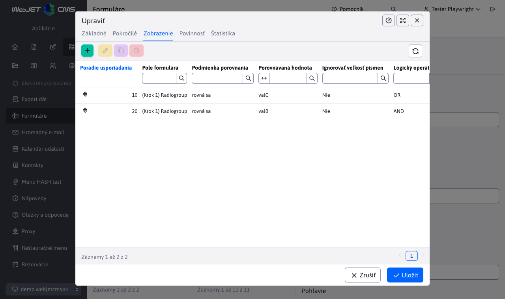

# Přehled nových vlastností - rok 2026

Tato sekce obsahuje popisy vlastností a **funkcionalit WebJET CMS srozumitelným jazykem**, bez zbytečně technických formulací v roce 2026. Nové záznamy se přidávají na vrch (pod tento úvod), takže nejnovější vlastnosti jsou vždy nahoře.

---

## Inteligentní vyhledávání podle významu otázky

WebJET CMS přináší **sémantické vyhledávání**, které nepracuje jen se shodou klíčových slov, ale rozumí i **významu uživatelské poptávky**. Návštěvník tak najde relevantní obsah i tehdy, když nepoužije přesnou formulaci z webu. Výsledkem je přirozenější vyhledávání, které se chová blíže tomu, než lidé reálně kladou otázky.

Pro zákazníka to znamená **vyšší úspěšnost nalezení odpovědi na první pokus**, méně odchodů ze stránky a lepší uživatelský zážitek zejména na obsahově rozsáhlých webech. Funkce je vhodná pro veřejný sektor, korporátní portály, produktové weby i zákaznická centra, kde běžné fulltextové hledání často vrací příliš mnoho nerelevantních výsledků.

Řešení je zároveň **flexibilní a rozšiřitelné**. Lze kombinovat klasické fulltextové a sémantické vyhledávání (hybridní režim), nastavovat citlivost výsledků a přizpůsobit jej infrastruktuře zákazníka včetně oddělené vektorové databáze. V praxi to přináší nižší provozní riziko, lepší škálovatelnost a možnost postupného nasazení bez nutnosti měnit celý web najednou.

**Hlavní benefity:**

- **Relevantnější výsledky pro návštěvníky**: Systém vyhledává podle významu, ne jen podle přesných slov, což zvyšuje šanci, že uživatel rychle najde to, co potřebuje.
- **Vyšší konverze a spokojenost uživatelů**: Méně slepých výsledků a kratší cesta k informací pomáhají snižovat odchody z webu.
- **Konkurenční výhoda moderního AI vyhledávání**: Organizace získává funkci, kterou běžná CMS řešení často nemají v produkční kvalitě.
- **Bezpečné a škálovatelné nasazení**: Podpora samostatné vektorové databáze umožňuje nasazení i v prostředích, kde hlavní databáze není PostgreSQL.
- **Možnost přesného doladění**: Konfigurovatelné parametry umožňují vyvážit přesnost, výkon a náklady podle typu projektu.

Podrobná dokumentace: [Sémantické vyhledávání](../../custom-apps/apps/rag/semantic-search/README.md) | [Správa indexovaných dat](../../redactor/apps/semantic-search/README.md)

## Inteligentní formuláře, které se přizpůsobují odpovědím uživatele

WebJET CMS přináší do vícekrokových formulářů **podmíněné zobrazení a podmíněnou povinnost polí**, díky čemuž se formulář umí **dynamicky měnit během vyplňování**. Uživatel vidí pouze ty otázky, které jsou pro jeho situaci relevantní, a systém automaticky určí, která pole musí být vyplněna. V praxi to znamená kratší, srozumitelnější formulář bez zbytečných kroků.

Pro zákazníka to přináší měřitelný obchodní efekt: **vyšší míru dokončení formulářů**, méně chyb při odeslání a kvalitnější data pro další zpracování v obchodě, marketingu či zákaznické podpoře. Když se formulář přizpůsobí uživateli, snižuje se frustrace, zkracuje se čas vyplňování a roste šance, že návštěvník formulář opravdu odešle.

Řešení je zároveň připraveno na dlouhodobý růst projektu. Administrátor umí **pravidla nastavovat přímo v editoru** bez zásahu do kódu a funkcionalita je **rozšiřitelná** i pro specifické procesy zákazníka (například rozdílné logiky pro různé typy poptávek, segmenty klientů nebo interní workflow). Součástí je i ochrana před neplatnými konfiguracemi, takže se snižuje provozní riziko při úpravách formuláře.

**Hlavní benefity:**

- **Přesnější sběr dat**: Podmíněná povinnost polí zajistí, že systém vyžádá pouze údaje, které jsou v konkrétní situaci opravdu potřebné.
- **Lepší uživatelský zážitek**: Dynamické zobrazení zkracuje formulář a činí jej přehlednějším i při složitějších procesech.
- **Rychlé úpravy bez vývoje**: Obchodní nebo marketingové týmy mohou měnit logiku formuláře přímo v administraci.
- **Nížší provozní riziko**: Kontroly závislostí mezi polemi pomáhají předcházet neplatným nastavením a regresím.

Podrobná dokumentace: [Podmíněné zobrazení/validování položky](../../redactor/apps/multistep-form/README.md#podmíněné-zobrazenívalidování-položky)

## Automatizované testování přístupnosti webových stránek

WebJET CMS zavádí **automatizované testování přístupnosti (accessibility)**, které ověřuje, zda jsou webové stránky a administrační rozhraní přístupné pro **všechny uživatele** — včetně těch se zrakovým, sluchovým, motorickým nebo kognitivním omezením. Systém automaticky kontroluje soulad s mezinárodním standardem **WCAG 2.2** (Web Content Accessibility Guidelines) na úrovních A a AA, což je požadavek legislativy EU i Slovenska pro weby veřejného sektoru a stále více i pro komerční subjekty.

Pro zákazníka to v praxi znamená, že **každá změna na webu může být automaticky zkontrolována** z hlediska přístupnosti ještě před nasazením do provozu. Vývojář tak nemusí manuálně kontrolovat desítky pravidel, protože systém to může dělat za něj automaticky a opakovaně při každé změně.

Testování přístupnosti může být **zabudováno přímo do vývojového procesu**, není to externí audit provedený jednou ročně. To znamená, že problémy se zachycují průběžně a opravují se v momentě vzniku, což je **výrazně levnější a rychlejší** než dodatečná oprava po externím auditu. Systém generuje **přehledné HTML reporty** s detailním popisem každého porušení, což usnadňuje komunikaci mezi vývojovým týmem a zodpovědnými osobami za přístupnost.

**Hlavní benefity:**

- **Soulad s legislativou**: Automatická kontrola zajišťuje, že web splňuje požadavky evropské směrnice o přístupnosti webových sídel (EAA) a slovenské legislativy, čímž zákazník předchází právním rizikům a pokutám.
- **Inkluzivní web pro všechny**: Web je přístupný i pro lidi se zdravotními omezeními, což rozšiřuje potenciální cílovou skupinu a zlepšuje reputaci organizace.
- **Průběžná kontrola namísto jednorázového auditu**: Každá změna je automaticky ověřena, čímž se problémy zachycují okamžitě — oprava v momentě vzniku je řádově levnější než dodatečný audit.
- **Nižší náklady na opravu**: Včasná detekce porušení snižuje náklady na opravu přístupnosti až o 80 % v porovnání s opravami po nasazení do produkce.
- **Přehledné reporty**: Automaticky generované HTML reporty s popisem porušení a jejich závažností zjednodušují prioritu oprav a komunikaci v týmu.
- **Podpora standardu WCAG 2.2**: Kontrola pokrývá nejnovější verzi standardu včetně úrovní A a AA, což zajišťuje aktuálnost i vůči budoucím legislativním požadavkům.

Podrobná dokumentace: [Testování přístupnosti](../../developer/testing/a11y.md)

## AI Skills — inteligentní dovednosti pro rychlejší vývoj a správu CMS

WebJET CMS integruje sadu **AI Skills** — specializovaných dovedností pro umělou inteligenci, které výrazně **zrychlují vývoj, údržbu a rozšiřování** webových projektů. AI Skills fungují přímo ve vývojovém prostředí (VS Code s GitHub Copilot) a dokáží na základě jednoduchého požadavku **automaticky generovat hotový kód, testy, dokumentaci i celé nové moduly** v souladu s konvencemi a strukturou WebJET CMS. Vývojář tak nemusí ručně vytvářet desítky souborů a pamatovat si všechny technické detaily – stačí popsat, co potřebuje, a AI Skills dodají funkční výsledek.

Pro zákazníka to znamená především **výrazně rychlejší dodávku nových funkcí a úprav**. Změny, které dříve trvaly hodiny nebo dny, lze dodat během minut. Stejně důležitá je možnost **rychlého prototypování** - zákazník si může nechat připravit prototyp nového modulu, formuláře nebo administrační stránky téměř okamžitě a rozhodnout se, zda je směr správný, ještě před investicí do plného vývoje. Pokud zákazník disponuje vlastním vývojovým týmem a upravuje si projekt samostatně, může AI Skills **využívat přímo** — systém jej provede celým procesem a zajistí, že výsledek je kompatibilní s architekturou WebJET CMS.

Nasazení AI Skills zároveň zvyšuje **kvalitu a konzistenci** dodávaného kódu. Každá dovednost vynucuje osvědčené postupy, automaticky přidává testy a dodržuje projektové konvence, čímž se snižuje riziko chyb a zjednodušuje budoucí údržba.

**Hlavní benefity:**

- **Rychlejší dodávka**: Nové funkce a úpravy jsou k dispozici ve zlomku původní doby, což zkracuje dobu uvedení na trh.
- **Rychlé prototypování**: Zákazník získá funkční prototyp nového modulu téměř okamžitě a může jej vyhodnotit před schválením plného vývoje.
- **Nižší náklady na vývoj**: Automatizace rutinních úkolů snižuje počet potřebných vývojářských hodin.
- **Vyšší kvalita kódu**: AI Skills dodržují osvědčené postupy, generují testy a kontrolují konzistenci, čímž se snižuje počet chyb.
- **Nezávislost zákazníka**: Zákazníci s vlastním vývojovým týmem mohou AI Skills využívat sami k rozšíření a přizpůsobení svého projektu.
- **Jednoduchost použití**: Stačí popsat požadavek běžným jazykem - AI Skills provedou záměr na hotový, funkční kód.

### Dostupné AI Skills

| Dovednost | Popis |
| ----------- | ------- |
| **Vytvoření aplikace (AppStore)** | Vygeneruje kompletní aplikaci pro editor stránek – Java třídu, šablonu, konfiguraci a registraci do seznamu aplikací. |
| **Vytvoření administrační stránky (DataTable)** | Připraví celý CRUD modul pro administraci - databázovou entitu, REST rozhraní, HTML stránku a automatizované testy. |
| **Automatizované E2E testy (CodeceptJS)** | Napíše end-to-end testy pro prohlížeč, které ověří funkčnost stránek, formulářů a oprávnění. |
| **Revize kódu (Code Review)** | Zkontroluje změny v kódu z hlediska správnosti, bezpečnosti, zpětné kompatibility a dodržování konvencí projektu. |
| **Audit přístupnosti (Accessibility)** | Provede audit webové přístupnosti podle standardu WCAG 2.2 a navrhne opravy pro klávesovou navigaci, kontrast a čtečky obrazovky. |
| **Aktualizace dokumentace** | Automaticky doplní technickou dokumentaci na základě změn v kódu, čímž udržuje dokumentaci vždy aktuální. |
| **Překlad komentářů** | Přeloží komentáře ve zdrojovém kódu z češtiny do angličtiny beze změny funkčnosti, čímž zlepšuje čitelnost pro mezinárodní týmy. |
| **Marketingový obsah** | Na základě dodaných změn vygeneruje podklady pro blog, sociální sítě nebo changelog – ušetří čas marketingovému týmu. |
| **Popis vlastností pro prodej** | Analyzuje technické změny a vytvoří srozumitelný popis z pohledu zákazníka a obchodních výhod. |

## Přihlašování přes OAuth2/Keycloak

WebJET CMS nyní podporuje **přihlašování uživatelů prostřednictvím externích poskytovatelů identity** jako jsou Google, Facebook, GitHub, Okta nebo podnikový Keycloak server. Technicky se jedná o standard **OAuth2/OpenID Connect** — v praxi to znamená, že uživatelé se mohou přihlásit **jedním kliknutím přes účet, který již mají** (například firemní Google účet nebo **podnikový SSO** systém), bez nutnosti pamatovat si další heslo. Administrátor webu si jednoduše nakonfiguruje, které poskytovatele chce povolit, a systém automaticky zobrazí příslušná přihlašovací tlačítka.

Klíčovou výhodou je **automatická synchronizace skupin a práv**. Pokud organizace používá podnikový identity server (např. Keycloak), WebJET CMS dokáže při každém přihlášení automaticky převzít skupiny a role, ve kterých je uživatel zařazen, a **přiřadit mu odpovídající práva** v CMS. To eliminuje potřebu manuální správy oprávnění - když se změní role zaměstnance v podnikovém systému, **změna se automaticky přenese i do WebJET CMS**. Administrátoři jsou nastavováni automaticky na základě členství v definované skupině, což zjednodušuje správu přístupů i ve velkých organizacích.

Řešení je **flexibilní a rozšiřitelné** — zákazník může nakonfigurovat libovolného OAuth2 poskytovatele, nejen předdefinovaných (Google, Facebook, GitHub, Okta). Podporováno je i **současné použití více poskytovatelů** (např. Keycloak pro administrátory a Google pro zákaznickou zónu) a konfiguraci lze zcela přizpůsobit potřebám organizace včetně vlastních atributů pro přihlašovací jméno. Pro zákaznickou zónu i pro administraci lze nastavit různé poskytovatele s různými úrovněmi synchronizace práv.

**Hlavní benefity:**

- **Jednotné přihlášení (SSO)**: Uživatelé se přihlašují účtem, který již znají — žádná další hesla k zapamatování, což zvyšuje bezpečnost i pohodlí.
- **Automatická synchronizace práv**: Skupiny a role jsou stahovány z podnikového identity serveru při každém přihlášení — odpadá manuální správa oprávnění v CMS.
- **Podpora libovolného OAuth2 poskytovatele**: Kromě předdefinovaných (Google, Facebook, GitHub, Okta) je možné nakonfigurovat jakýkoli vlastní OAuth2/OpenID Connect server.
- **Bezpečnost na podnikové úrovni**: Autentifikace probíhá na straně ověřeného poskytovatele — WebJET CMS nikdy neukládá hesla externích služeb, což snižuje bezpečnostní rizika.
- **Oddělená konfigurace pro admin a zákaznickou zónu**: Různí poskytovatelé pro různé části systému umožňují přesné řízení přístupů podle typu uživatele.
- **Nižší provozní náklady**: Centrální správa uživatelů v jednom systému (např. Keycloak) snižuje administrativní zátěž a eliminuje duplicitní správu účtů.
- **Jednoduchá instalace**: Pro populární poskytovatele (Google, Facebook) stačí nastavit dva konfigurační parametry; pro podnikový Keycloak je k dispozici připravená Docker konfigurace.

    <iframe width="560" height="315" src="https://www.youtube.com/embed/q8xs3qDq-G4" title="YouTube video player" frameborder="0" allow="accelerometer; autoplay; clipboard-write; encrypted-media; gyroscope; picture-in-picture" allowfullscreen></iframe>

Podrobná dokumentace: [OAuth2 Autentifikace](../../install/oauth2/oauth2.md) | [Keycloak - Instalace a konfigurace](../../install/oauth2/keycloak.md)

## Vícekrokové formuláře

WebJET CMS přináší vícekrokové formuláře, které **rozdělují dlouhé formuláře na menší a pro uživatele srozumitelnější části**. Namísto jednoho přeplněného formuláře dostane návštěvník **jasně vedený proces po jednotlivých krocích**, což snižuje pocit zahlcení a pomáhá zvýšit počet úspěšně dokončených odeslání. Tato funkcionalita je vhodná například pro registrace, poptávkové formuláře, náborové formuláře, přihlášky či interní sběrové procesy.

Pro zákazníka je důležité také to, že formulář nemusí zůstat pouze v základním nastavení. Jednotlivé kroky lze pojmenovat, doplnit o úvodní texty a přizpůsobit texty tlačítek podle konkrétní kampaně nebo procesu. Řešení tak spojuje **lepší uživatelský zážitek** s vysokou mírou přizpůsobení bez potřeby připravovat každý formulář nově od začátku.

**Hlavní benefity:**

- **Vyšší úspěšnost odeslání**: Rozdělení formuláře do kroků snižuje bariéru při vyplňování a pomáhá návštěvníky dovést až k odeslání.
- **Lepší uživatelský zážitek**: Formulář působí přehledně, méně stresující a lépe se používá i při větším množství údajů.
- **Vhodné pro různé scénáře**: Řešení lze využít pro obchod, marketing, HR i zákaznické služby beze změny základního principu.
- **Jednoduché přizpůsobení komunikace**: Texty kroků a tlačítek lze upravit podle konkrétního cíle kampaně nebo firemního stylu.

Podrobná dokumentace: [Vícekrokové formuláře](../../redactor/apps/multistep-form/README.md)

### Flexibilní editor formulářů bez závislosti na programátoru

Součástí řešení je editor, ve kterém může administrátor **formulář průběžně upravovat podle aktuálních potřeb**. Kroky i jednotlivé položky lze přidávat, duplikovat, přesouvat, měnit jejich pořadí a průběžně kontrolovat v náhledu. To výrazně zkracuje čas potřebný pro přípravu nových formulářů a umožňuje rychle reagovat na nové obchodní nebo provozní požadavky.

Velkou výhodou je také vysoká míra variability. U jednotlivých polí lze nastavit **povinnost vyplnění, validační pravidla, předvyplněné hodnoty**, pomocné texty či informační bubliny. Formuláře je navíc možné **personalizovat údaji** o přihlášeném **uživateli** a přizpůsobit i specifickým scénářům zobrazení. Pro zákazníka to znamená nižší závislost na dodavateli a větší schopnost upravovat procesy vlastními silami.

**Hlavní benefity:**

- **Rychlé nasazení změn**: Marketing nebo administrátor umí upravit formulář bez zdlouhavého vývoje a čekání na technický zásah.
- **Přesnější sběr dat**: Povinná pole, pravidla validace a pomocné texty snižují chybovost a zvyšují kvalitu získaných údajů.
- **Personalizace pro vyšší komfort**: Předvyplnění údajů o přihlášeném uživateli zrychluje vyplnění a snižuje počet opuštěných formulářů.
- **Rozšířitelnost do budoucna**: Typy polí a dostupná nastavení lze přizpůsobit podle potřeb konkrétního projektu nebo segmentu.

    <iframe width="560" height="315" src="https://www.youtube.com/embed/XRnwipQ-mH4" title="YouTube video player" frameborder="0" allow="accelerometer; autoplay; clipboard-write; encrypted-media; gyroscope; picture-in-picture" allowfullscreen></iframe>

Podrobná dokumentace: [Editor vícekrokových formulářů](../../redactor/apps/multistep-form/README.md)

### Statistiky formulářů pro rychlé rozhodování

WebJET CMS doplňuje vícekrokové formuláře o **přehlednou statistickou sekci**, která ukazuje nejen počet odeslaných odpovědí, ale také **průměrný čas vyplňování**, počet dní od vytvoření formuláře a čas poslední odpovědi. Zákazník tak získá **okamžitý obraz o tom, zda formulář funguje**, zda je pro uživatele srozumitelný a zda se na něm vyplatí dále pracovat.

Ještě větší hodnotu přinášejí **grafy odpovědí u jednotlivých otázek**. Organizace si může sama určit, která pole chce sledovat, jaký typ grafu se použije, kolik odpovědí se zobrazí a zda se mají spojit méně časté nebo nevyplněné odpovědi. V praxi to znamená, že marketing, obchod nebo HR tým obdrží vizuální a rychle čitelné podklady bez nutnosti exportovat data do externích nástrojů. Řešení zároveň zůstává flexibilní, protože nastavení statistik lze měnit přímo u položek formuláře.

**Hlavní benefity:**

- **Okamžitý přehled o výkonnosti formuláře**: Základní metriky pomáhají rychle vyhodnotit, zda formulář plní svůj cíl.
- **Lepší rozhodování bez dalších nástrojů**: Grafy odpovědí umožňují činit operativní rozhodnutí přímo v administraci systému.
- **Vyšší kvalita interpretace dat**: Možnost seskupovat odpovědi, zobrazit nezodpovězené položky nebo filtrovat top hodnoty upřesňuje pohled na chování uživatelů.
- **Přizpůsobení podle potřeb**: Typ grafu, barevné schéma i způsob zobrazování lze nastavit podle toho, co potřebuje konkrétní tým sledovat.

Podrobná dokumentace: [Statistiky vícekrokových formulářů](../../redactor/apps/multistep-form/stat.md)
