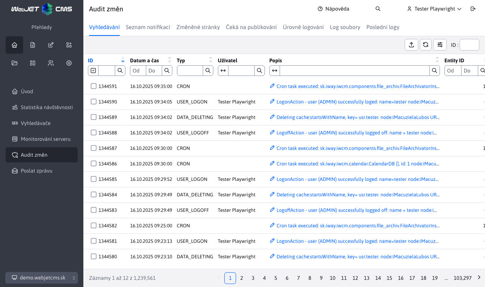

# Audit

Aplikace Audit je nástrojem pro sledování změn v systému. Sekce Audit -> Vyhledávání umožňuje prohlížet a filtrovat jednotlivé zaznamenané hodnoty. Filtrování je možné podle typu auditních záznamů, času, uživatele atd.

# Typy auditních záznamů

Každý auditní záznam automaticky zaznamenává datum a čas, ID přihlášeného uživatele, IP adresu, a pokud je povolen reverzní server DNS, i název počítače. Do textu auditního záznamu se automaticky vloží název uzlu clusteru, adresa URI, doména a hodnota http hlavičky User-Agent.
- `ADMINLOG_NOTIFY` - změna v seznamu oznámení v aplikaci Audit.
- `BANNER` - operace v aplikaci Banner System
- `BASKET` - operace v aplikaci E-Commerce
- `CALENDAR` - operace v aplikaci Kalendář událostí
- `CONF_DELETE` - při mazání konfigurační proměnné zaznamená její název.
- `CONF_UPDATE` - změna nebo přidání konfigurační proměnné (v sekci Nastavení), zaznamená název, aktuální hodnotu a novou hodnotu proměnné.
- `COOKIE_ACCEPTED` - přijímání souborů cookie na webových stránkách
- `COOKIE_REJECTED` - odmítnutí používání souborů cookie na webových stránkách
- `CRON` - zaznamenává úlohy spuštěné na pozadí, pokud je zaškrtnuta možnost Audit. Ukládá také chyby během provádění úlohy (pokud se vyskytnou), v takovém případě se protokoluje `Stack Trace`.
- `DATA_DELETING` - zaznamená provedení vymazání dat v části Nastavení-Vymazání dat. Zaznamená klíč, který byl odstraněn v mezipaměti, nebo `ALL` odstranit vše. Při mazání mezipaměti obrázků zaznamená cestu k adresáři. Při mazání trvalé mezipaměti zaznamená ID záznamu.
- `DMAIL` - Aplikace pro hromadné zasílání e-mailů
- `DMAIL_AUTOSENDER` - používá se ve zvláštní situaci automatického odesílání hromadných e-mailů.
- `DMAIL_BLACKLIST` - změna v sekci Hromadné e-maily->Odebrané e-maily
- `DMAIL_DOMAINLIMITS` - změna v sekci Hromadný e-mail->Omezení domény
- `EXPORT_WEBJET` - nepoužívá se
- `EXPORT` - operace exportu dat (přidání, změna, odstranění exportu dat).
- `FILE_CREATE` - vytvořit soubor nebo adresář, zaznamenat cestu
- `FILE_DELETE` - při mazání souboru nebo adresáře zaznamená cestu.
- `FILE_EDIT` - přejmenování nebo úpravě souboru zaznamená cestu.
- `FILE_SAVE` - uložení souboru, např. při kopírování/přesouvání atd. Zaznamenat cestu k souboru
- `FILE_UPLOAD` - Nahrání souboru do WebJETu, a to buď klasickým odesláním, nebo metodou Drag & Drop. Obvykle se zaznamená cesta k nahranému souboru.
- `FORMMAIL` - odeslání formuláře. Úspěšné odeslání zaznamená pomocí zprávy `FormMail formName:` název formuláře, seznam příjemců a `referer`. V případě neúspěchu zaznamená důvod neodeslání spolu s hlášením. `ERROR: formName:` název formuláře, `fail:` důvod neposílání. Zaznamenává také detekci spamu hlášením `detectSpam TRUE:` důvod pro detekci jako spamu.
- `FORM_ARCHIVE` - archivace formuláře, zaznamená název formuláře.
- `FORM_DELETE` - smazání formuláře, zaznamená název formuláře a případně ID, pokud se jedná o smazání jednoho záznamu.
- `FORM_EXPORT` - export formuláře přes záložku Export, v současné době není zaznamenán univerzální export přes tlačítka pod tabulkou. Datum posledního exportu je určeno tímto záznamem pro možnost exportu od posledního exportu.
- `FORM_REGEXP` - změna v sekci Formuláře->Pravidelné výrazy
- `FORM_VIEW` - nepoužívá se
- `FORUM_SAVE` - detekuje vulgarity v diskusním fóru.
- `FORUM` - operace v aplikaci Diskuze
- `GALLERY` - změny v aplikaci Galerie - vytvoření adresáře, přidání/odstranění fotografie.
- `GDPR_FORMS_DELETE` - Aplikace GDPR, vymazání starých formulářů
- `GDPR_USERS_DELETE` - Aplikace GDPR, mazání starých uživatelů
- `GDPR_BASKET_INVOICES_DELETE` - Aplikace GDPR, mazání starých objednávek z elektronického obchodu
- `GDPR_EMAILS_DELETE` - Aplikace GDPR, mazání starých e-mailů
- `GDPR_REGEXP` - Aplikace GDPR, správa regulárních výrazů
- `GDPR_DELETE` - Aplikace GDPR, nastavení mazání dat
- `GDPR_COOKIES` - Aplikace GDPR, správa souborů cookie
- `GROUP` - vytvořit/uložit/odstranit adresář v sekci Webové stránky.
- `HELPDESK` - nepoužívá se
- `HELP_LAST_SEEN` - se používá k zaznamenání data zobrazení sekce Co je nového v nápovědě. Při přihlášení tato sekce vyhledá nejnovější soubor a porovná jej se zaznamenaným datem v sekci Audit. Pokud existuje novější soubor, zobrazí se po přihlášení vyskakovací okno nápovědy s oddílem Co je nového.
- `IMPORTXLS` - Import souboru aplikace Excel, který se používá při implementacích u zákazníků. Zaznamenává cestu k importovanému souboru a jeho velikost.
- `IMPORT_WEBJET` - nepoužívá se
- `INIT` - Inicializace WebJET (start), zaznamená cestu k adresáři, ve kterém byl WebJET na aplikačním serveru spuštěn, a číslo verze WebJET.
- `INQUIRY` - operace v aplikaci Anketa
- `INQUIRY` - přidání otázky v aplikaci Anketa, zaznamená text otázky.
- `INSERT_SCRIPT` - změna v aplikaci Skripty
- `INVENTORY` - operace v aplikaci Property
- `JSPERROR` - chyba při spuštění souboru JSP při zobrazení webové stránky, zaznamenaná v protokolu `Stack Trace` chyby
- `MEDIA` - Operace s médii (karta Média na webové stránce).
- `MEDIA_GROUP` - Aplikace pro správu skupin médií.
- `PAGE_DELETE` - smazat, přesunout do koše nebo požádat o smazání stránky, zaznamená ID stránky.
- `PAGE_UPDATE` - záznamy změn na stránce mimo standardní ukládání v editoru - hromadné operace v seznamu stránek.
- `PAYMENT_GATEWAY` - volání platební brány v aplikaci E-Commerce.
- `PEREX_GROUP_CREATE` - vytvořit skupinu perex, zapsat její název
- `PEREX_GROUP_DELETE` - smazání perexu skupiny, zaznamená její název a ID.
- `PEREX_GROUP_UPDATE` - změnit perex skupiny, zapsat její název.
- `PERSISTENT_CACHE` - změna v sekci Odstranění dat->Persistentní objekty cache
- `PROP_DELETE` - vymazání textu překladu, zaznamená jazyk a klíč.
- `PROP_UPDATE` - editace textu překladu (v sekci Nastavení), záznam jazyka, klíče a hodnoty.
- `PROXY` - operace proxy aplikace
- `QA` - operace v aplikaci Otázky a odpovědi
- `REDIRECT_CREATE` - vytvořit nové přesměrování (url nebo doména).
- `REDIRECT_DELETE` - odstranění přesměrování (url nebo doména), zaznamená zdroj a v případě domény cíl přesměrování.
- `REDIRECT_UPDATE` - změna přesměrování (url nebo doména), záznam zdrojové a cílové adresy.
- `RUNTIME_ERROR` - zaznamená chybějící šablonu pro zobrazení stránky
- `SAVEDOC` - uložení webové stránky v Editoru, zaznamenává také žádosti o schválení. Zaznamenává název stránky, ID stránky a ID v historii
- `SENDMAIL` - odeslání e-mailu (mimo formuláře), zaznamená e-mail odesílatele, e-mail příjemce a předmět e-mailu.
- `SE_SITEMAP` - generování souborů `/sitemap.xml`, zaznamená ID adresáře, pro který je mapa stránek generována, a obsah hlavičky User-Agent.
- `SQLERROR` - databázi, zaznamená chybu SQL, zdroj chyby a. `Stack Trace`
- `TEMPLATE_DELETE` - při odstraňování šablony zaznamená název odstraněné šablony.
- `TEMPLATE_INSERT` - vytvořit novou šablonu, zapsat její název
- `TEMPLATE_UPDATE` - změna v šabloně, záznam seznamu změněných polí
- `TEMPLATE_GROUP` - změna ve skupině šablon
- `TIP` - operace v aplikaci Tip dne
- `TOOLTIP` - změna v aplikaci Tooltip
- `UPDATEDB` - provádění změn v databázi prostřednictvím konzoly správce.
- `USER_AUTHORIZE` - autorizace uživatele (schválení přístupu do sekce chráněné heslem). Zaznamená ID smazaného uživatele, pokud je ID uživatele také známo. `login` a jméno.
- `USER_CHANGE_PASSWORD` - kontroluje změnu hesla uživatele. Na základě data se vypočítá interval změny hesla (je-li nastaven).
- `USER_DELETE` - odstranění uživatele. Zaznamená ID smazaného uživatele, pokud je známo, a jméno uživatele. `login` a jméno.
- `USER_EDIT` - zaznamená událost otevření editace uživatele, nejedná se ještě o uložení. Zaznamená ID uživatele, `login` a jméno.
- `USER_GROUP_DELETE` - odstranit skupinu uživatelů, zaznamenat název skupiny a její ID.
- `USER_GROUP_INSERT` - vytvořit novou skupinu uživatelů, zapsat název nové skupiny a její typ.
- `USER_GROUP_UPDATE` - uložit skupinu uživatelů, zaznamenat název skupiny a seznam změn.
- `USER_INSERT` - vytvoření nového uživatele (nebo nové registrace v sekci chráněné heslem). Zaznamenejte ID uživatele, `login` a jméno.
- `USER_LOGOFF` - odhlášení uživatele kliknutím na ikonu odhlášení, zaznamená přihlašovací jméno a informaci o tom, zda je uživatel správce nebo registrovaný návštěvník.
- `USER_LOGON` - přihlášení uživatele, zaznamená přihlašovací jméno a informaci o tom, zda je uživatel správcem nebo registrovaným návštěvníkem. Zaznamená také událost neplatného hesla, pokud uživatel není autorizován nebo přihlašovací jméno není známo.
- `USER_PERM_GROUP` - operace se skupinami práv, zaznamenává název skupiny a při změně seznam změn.
- `USER_SAVE` - zaznamenává změny uživatele v sekci chráněné heslem (pokud obsahuje formulář pro změnu údajů).
- `USER_UPDATE` - uložení existujícího uživatele. Zaznamená aktuální nastavení práv a změny zadaných údajů.
- `WEB_SERVICES` - volání zákazníků `WebServices` (použití závisí na implementaci pro konkrétního zákazníka)
- `XSRF` - XSRF útok na server (neautorizovaná hlavička referer), zaznamená hodnotu názvu domény z `referer` Záhlaví
- `XSS` - Útok XSS na server nebo přímé (neautorizované) volání souboru JSP. Zaznamená adresu URL nebo výraz, který způsobil vyhodnocení útoku (např. neoprávněný token v adrese URL, neoprávněná metoda HTTP). Zaznamenává také krádež souborů cookie (změna IP adresy relace).

# Zvláštní formát auditu

V případě potřeby lze do systému WebJET přidat kód, který uloží auditní záznamy do zvláštního souboru nebo je odešle určené službě. Je nutné nastavit konfigurační proměnnou `adminlogCustomLogger` do třídy jazyka Java, která implementuje třídu `sk.iway.iwcm.AdminlogCustomLogger`. Pro každou položku se volá metoda `addLog(logType, requestBean, descriptionParam, timestamp)`
