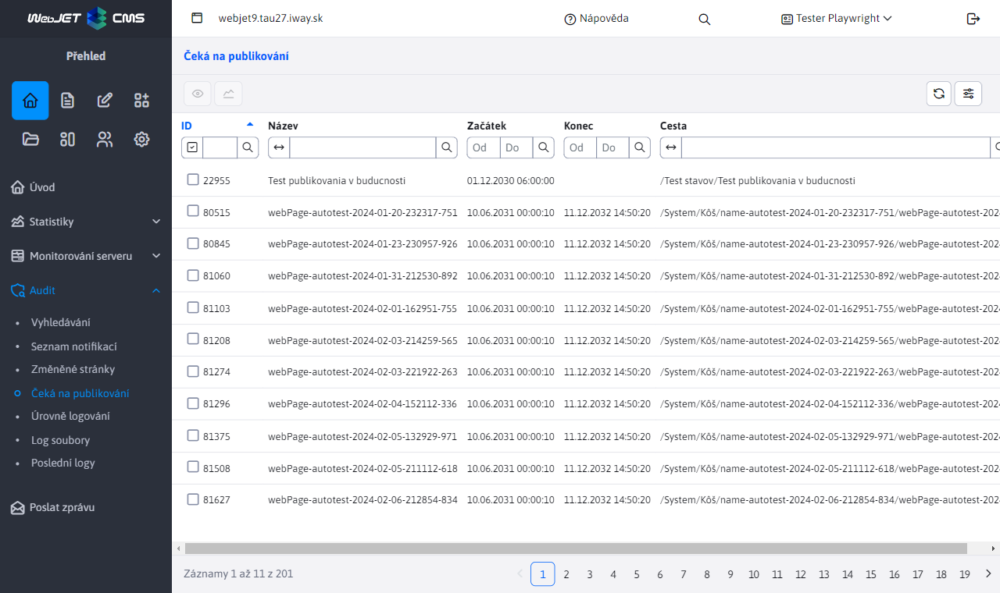

# Čeká na publikování

V menu položce Čeká na publikování je seznam stránek, které mají v budoucnu naplánované publikování. Obsahuje informace o tom o jakou web stránku (na jaké adrese/cestě) a kdy se bude publikovat. Bližší informace o web stránkách naleznete zde [Seznam web stránek](../../redactor/webpages/README.md).

Cílem je přehledně zobrazit seznam stránek, které v budoucnu budou automaticky změněny. Zobrazeny jsou všechny stránky bez ohledu na práva uživatele na stromovou strukturu stránek a zvolenou doménu.

Červenou barvou jsou zobrazeny web stránky, které čekají na vypnutí zobrazování – mají nastavenou možnost Odveřejnit stránku po tomto datu. Takové stránky po nastaveném datu nebudou veřejně zobrazitelné.

V seznamu se nezobrazují stránky v koši, pro ty se publikování neprovádí.

