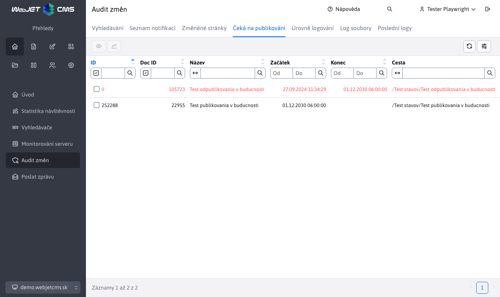

# Čeká se na zveřejnění

Položka nabídky Čekající obsahuje seznam stránek, jejichž zveřejnění je naplánováno v budoucnu. Obsahuje informace o tom, jaká webová stránka (na jaké adrese/cestě) a kdy bude zveřejněna. Další informace o webových stránkách naleznete zde [Seznam webových stránek](../../redactor/webpages/README.md).

Cílem je přehledně zobrazit seznam stránek, které budou v budoucnu automaticky změněny. Zobrazí se všechny stránky bez ohledu na práva uživatele ke stromové struktuře stránek a vybrané doméně.

Webové stránky, které čekají na vypnutí zobrazení, jsou zobrazeny červeně - po tomto datu jsou nastaveny na stránku Publikovat. Takové stránky nebudou po nastaveném datu veřejně zobrazitelné.

V seznamu se nezobrazují stránky v koši, ty se nezveřejňují.

