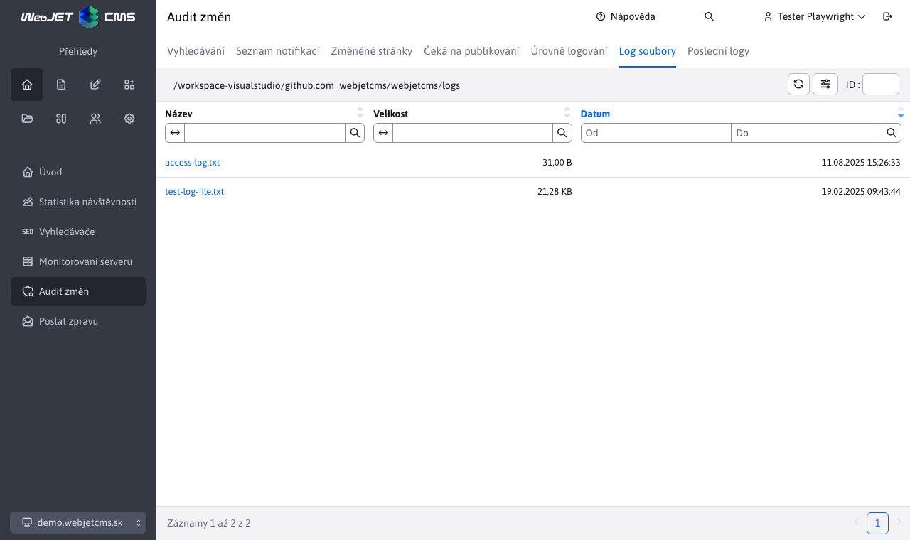
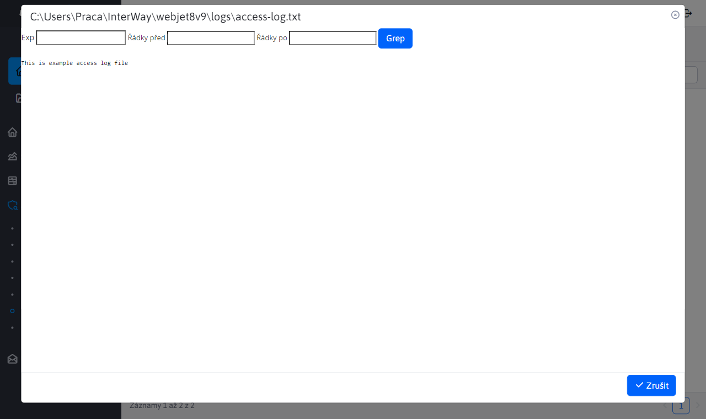

# Log soubory

Aplikace poskytuje přehled všech log souborů. Úpravy nad tabulkou nejsou povoleny. Tabulka slouží pouze k přehledu. V levé horní části stránky, můžete vidět cestu, kde jsou tyto soubory uloženy.

Při klepnutí na název souboru se zobrazí okno s obsahem souboru. Hlavička obsahuje pole pro možnost filtrování v souboru pomocí regulárních výrazů (nebo přímo pouze vyhledaným výrazem).

