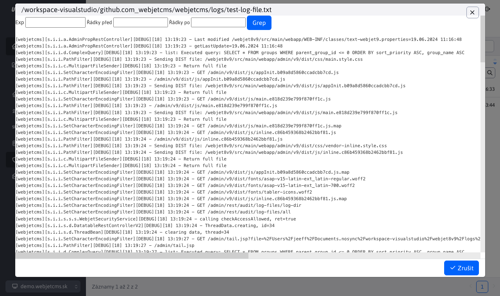

# Soubory protokolu

Aplikace poskytuje přehled všech souborů protokolu. Úpravy nad tabulkou nejsou povoleny. Tabulka slouží pouze pro přehled. V levé horní části stránky je zobrazena cesta, kde jsou tyto soubory uloženy.

Po kliknutí na název souboru se zobrazí okno s obsahem souboru. Záhlaví obsahuje pole pro možnost filtrování souboru pomocí regulárních výrazů (nebo přímo pouze podle hledaného výrazu).

