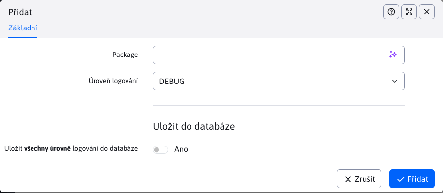

# Úrovně logovaní

Aplikace Úrovně protokolování umožňuje spravovat úrovně protokolování pro jednotlivé balíčky java.


První záznam v tabulce je vždy **Hlavní úroveň logovaní** (základní úroveň).

Používají se 2 konfigurační proměnné:
- **logLevel**, obsahuje hodnotu úrovně protokolování pro **Hlavní úroveň logovaní**
- **logLevels**, obsahuje seznam balíčků java s úrovněmi protokolování (každý na novém řádku). Např:

```
sk.iway=DEBUG
sk.iway.iwcm=WARN
org.springframework=WARN
```

Změny nad tabulkou se ukládají lokálně do konstanty. Pokud chcete změny (nastavení) uložit trvale, musíte v editoru vybrat možnost **Uložit do databáze**. Po uložení se aktualizují konfigurační proměnné v databázi.

# Přidat

Pro přidání akcí je vyžadována hodnota balíčku java a úroveň protokolování. Pokud zadáte již přidaný balíček, nevytvoří se duplicitní hodnota, ale stávající se aktualizuje.



# Upravit podle

Akce úprav se chová odlišně pro hlavní úroveň protokolování a pro ostatní úrovně protokolování.

## Hlavní úroveň logovaní

Při úpravách hlavní úrovně můžeme vybrat pouze protokolování NORMAL nebo DEBUG (pro podrobné protokolování). Pokud v editoru změníte hodnotu `Package`, nebude provedena žádná změna. Protože hlavní úroveň musí být stále přítomna, lze měnit pouze hodnotu úrovně protokolování.

## Ostatní těžba dřeva

Změna úrovně protokolování se uloží, pokud změníte balíček, původní protokolování zmizí a bude nahrazeno tímto novým. Povoleny jsou všechny úrovně protokolování kromě hodnoty NORMAL.

# Mazání

Všechny balíčky úrovně protokolování lze odstranit s výjimkou **Hlavní úroveň protokolování**. Když se jej pokusíte odstranit, nic se s ním nestane (nezmění se ani hodnota).
