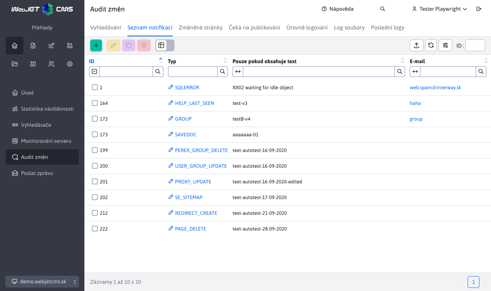

# Seznam oznámení

V položce nabídky Seznam oznámení můžete nastavit e-mailová oznámení pro určité systémové události/chyby. Doporučujeme nastavit upozornění na události typu `XSS` a `SQLERROR`.

V editoru můžete také nastavit další text, který musí chyba obsahovat, aby mohla být odeslána na zadaný e-mail.

