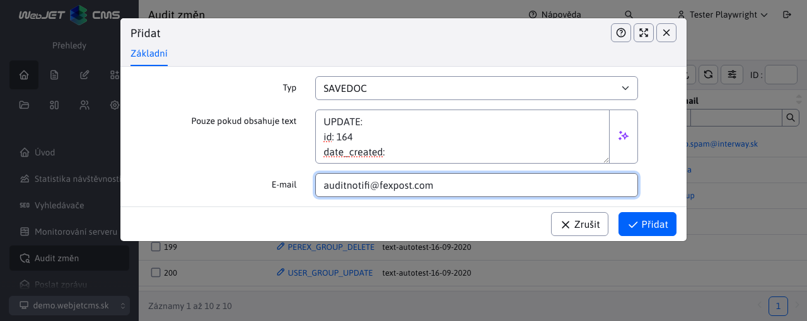

# Seznam notifikací

V menu položce Seznam notifikací lze nastavit email notifikace při určitých událostech / chybách systému. Doporučujeme nastavit notifikaci pro události typu `XSS` a `SQLERROR`.

V editoru lze nastavit i doplňkový text, který chyba musí obsahovat, aby byla odeslána na zadaný email.

Jako email odesílatele se použije email příjemce. V případě potřeby je možné nastavit jméno a email odesílatele všech emailů notifikací auditu pomocí konfiguračních proměnných `auditDefaultSenderName` a `auditDefaultSenderEmail`.
