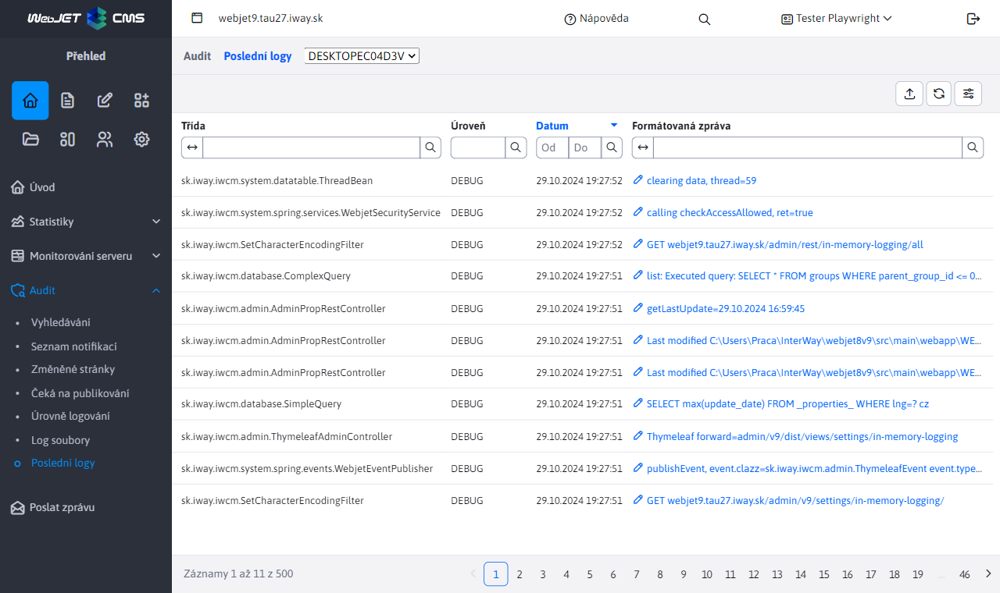

# Nejnovější protokoly

Aplikace je navržena tak, aby zobrazovala nejnovější protokoly pro případ, že nemáte přístup k protokolům v souborovém systému. Zobrazuje protokoly, které procházejí logovacím rámcem (tj. používají třídu `Logger`), nezobrazuje protokoly zapsané přímo prostřednictvím `System.out` nebo `System.err`.



Podporuje clustering, takže je možné vyžádat si poslední protokoly z jiného uzlu clusteru. Na kartě `Stack Trace` výpis zásobníku (obsah se však zobrazuje pouze u chybových protokolů, u standardních úrovní protokolů je prázdný).

## Možnosti/nastavení konfigurace:
- `loggingInMemoryEnabled` - nastavením na hodnotu `true/false` Povolení nebo zakázání ukládání protokolů.
- `loggingInMemoryQueueSize` - maximální počet protokolů zapsaných do paměti (výchozí 200). Vezměte prosím na vědomí, že všechna data jsou do tabulky načtena najednou a vzhledem k přenosu `stack trace` mohou být velké. Nedoporučujeme nastavovat tuto proměnnou na extrémně vysokou hodnotu.

Aby správně fungoval, musí být `logger` nastavené také v souboru `logback.xml`. Ve výchozím nastavení je to tak nastaveno, ale pokud jste soubor změnili, musíte přidat. `IN_MEMORY appender` a přidat jeho výzvu k `root` prvek.

```xml
    ...
    <appender name="IN_MEMORY" class="sk.iway.iwcm.system.logging.InMemoryLoggerAppender" />

    <root level="ERROR">
        <appender-ref ref="STDOUT" />
        <appender-ref ref="IN_MEMORY" />
    </root>
    ...
```

## Implementační detaily

- `sk.iway.iwcm.system.logging.InMemoryLoggerAppender` - `appender` Pro `logback`, který zajišťuje, že protokoly jsou odesílány na adresu `InMemoryLoggingDB`
- `sk.iway.iwcm.system.logging.InMemoryLoggingDB` - třída zajišťuje zápis a načítání protokolů z a na `queue`, načítání protokolů v clusteru
- `sk.iway.iwcm.system.logging.InMemoryLoggingEvent` - model pro událost protokolu
- `sk.iway.iwcm.system.logging.InMemoryLoggerRestController` - řadič pro výpis protokolu do DataTable
