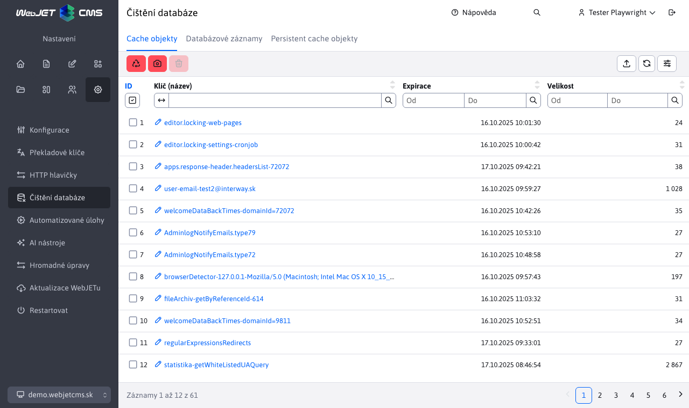

# Mazání dat

Aplikace **Mazání dat** vám umožňuje odstranit nepotřebná data z databáze, čímž můžete zvýšit výkon serveru a uvolnit místo na disku. Tento nástroj naleznete v sekci **Nastavení** pod položkou **Mazání dat**.

## Databázové záznamy

Mazání dat z vybraných databázových tabulek, mazání je možné z následujících skupin:
- **Statistika**: Odstraňuje statistická data. Smazání starších dat může významně zlepšit výkon serveru, ztratíte ale informace o návštěvnosti webu za zvolené období.
- **E-maily**: Umožňuje odstranit odeslané e-maily z aplikace Hromadný e-mail a emaily odeslané s časovým zpožděním (případně emaily odeslané v rámci více uzlového clusteru).
- **Historie stránek**: Maže zaznamenané historické verze webových stránek, ty se ukládají při každém publikování web stránky. Jsou zobrazeny v kartě Historie při editaci web stránky. Smazání neovlivní aktuálně zobrazené stránky, smažou se historické verze.
- **Monitorování serveru**: Odstraňuje zaznamenaná data z monitorování serveru, jako jsou výkonnostní metriky a logy.
- **Audit**: Maže záznamy auditu, které monitorují aktivity uživatelů a systémové události, smazat lze pouze vybrané typy záznamů.

Při každém smazání se provádí i optimalizace dané databázové tabulky, aby se fyzicky uvolnilo místo na disku a optimalizovalo se pořadí záznamů v databázové tabulce.

## Cache objekty

Zobrazuje seznam objektů uložených v aplikační cache paměti a umožňuje jejich jednotlivé vymazání, čímž můžete snížit spotřebu paměti, nebo vyvolat obnovení dat v cache paměti serveru. Klepnutím na název lze pro vybrané datové typy zobrazit obsah záznamu. Pro práci se používá objekt [Cache](../../../../../src/webjet8/java/sk/iway/iwcm/Cache.java)

## Persistent cache objekty

Správa a mazání objektů uložených v trvalé cache paměti, která uchovává data i po restartu serveru (údaje jsou uloženy v databázi). Pro práci se používá objekt [PersistentCacheDB](../../../../../src/webjet8/java/sk/iway/iwcm/system/cache/PersistentCacheDB.java). Do této cache lze ukládat pouze textová data, typicky se využívá metoda `downloadUrl(String url, int cacheInMinutes)` která na pozadí stahuje data ze zadané URL adresy a aktualizuje je v nastaveném čase. Aplikace používá tuto metodu a ihned získává data z cache.

