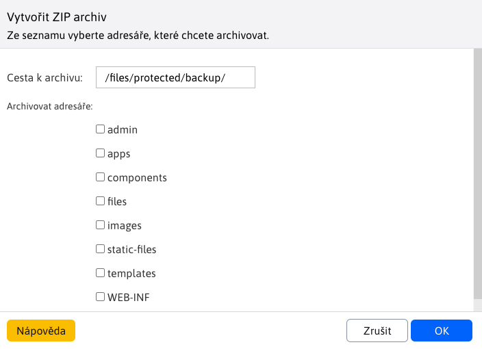

# Zálohování systému

Aplikace slouží k vytvoření ZIP archiv jednotlivých složek souborového systému WebJET. Můžete zvolit, které složky se do ZIP archivu mají zahrnout a do které složky se má vytvořit výsledný ZIP archiv. Nevytváří se záloha databáze, tu je třeba vytvořit nástroji pro zálohování databází.

!> **Upozornění:** Objem dat ve zvolených složkách může být velký a ZIP soubor se nemusí vygenerovat správně (omezení je na 2GB soubor). V případě potřeby můžete vytvářet zálohy po částech (jednotlivých složkách).

Tento proces může trvat několik desítek minut podle objemu dat ve zvolených složkách. Čekejte, až celý proces skončí. Během toho by se vám v okně měla zobrazovat informace o počtu již vygenerovaných stránek ao celkovém počtu stránek.

Výsledkem je zip archiv vytvořený v zadané složce.
