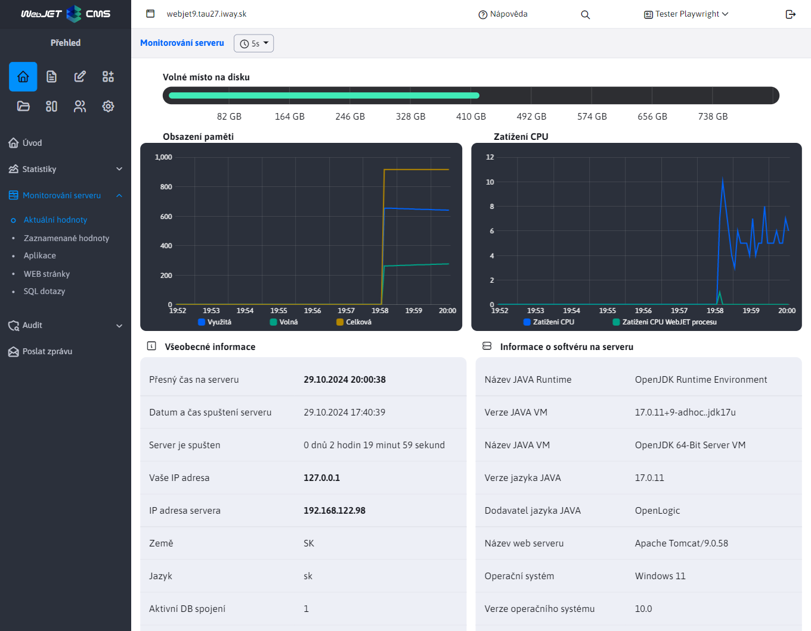
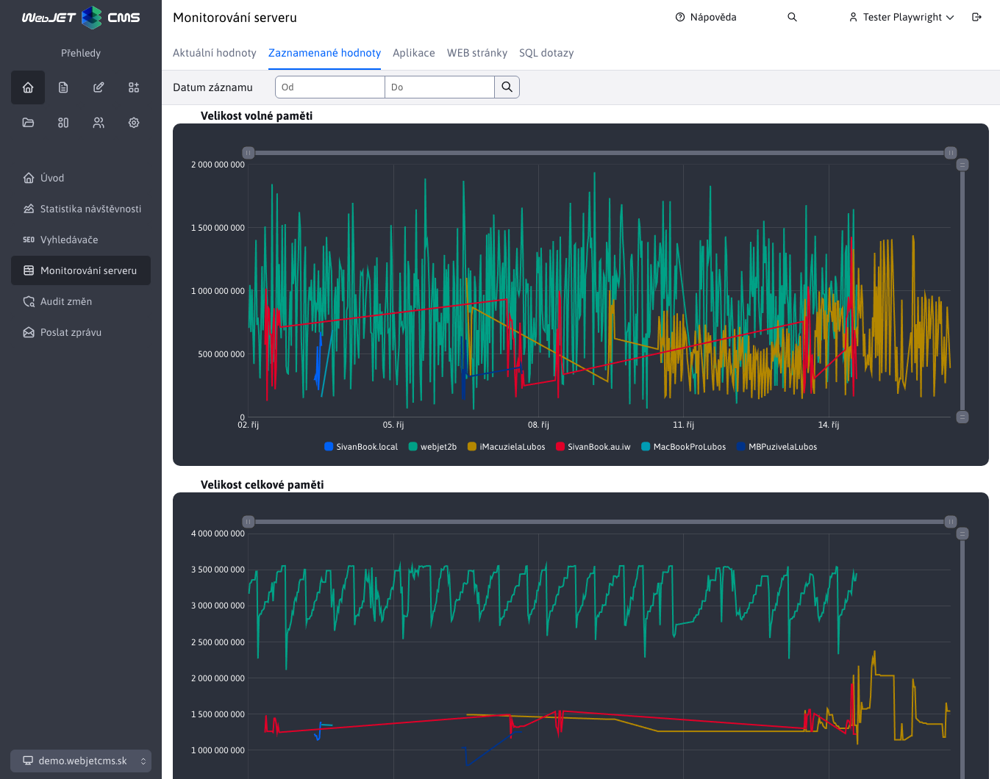

# Monitorování serveru

## Vnitřní monitorování

Analýza výkonu a zátěže serveru, jednotlivých aplikací, databázových dotazů a samotných stránek lze sledovat přímo v aplikaci Monitorování serveru (v administraci WebJETu v sekci Přehled).

Modul poskytuje následující možnosti:

- **Aktuální hodnoty** - aktuální informace o serveru a použitém softwaru, hodnoty zatížení serveru, paměti, počet databázových spojení a kódování znaků.



V horní části se zobrazuje volné místo na disku a průběžně aktualizované grafy využití paměti a zatížení procesoru. Interval aktualizace dat lze změnit pomocí výběrového pole v nástrojové liště.

### Všeobecné informace

Sekce obsahuje základní provozní informace o WebJET CMS a aplikačním serveru. Zobrazuje verzi WebJET CMS, platnost licence, aktuální čas, datum spuštění a dobu běhu serveru, síťové adresy, jazyk a zemi serveru, počet procesorů a název aktuálního uzlu clusteru.

### Informace o softwaru na serveru

Sekce sumarizuje verze a názvy softwarových komponent použitých na serveru. Obsahuje informace o Java Runtime a JVM, verzi a dodavatele Java, verze Spring Core, Spring Data a Spring Security, název aplikačního serveru a název a verzi operačního systému.

### Databázová spojení

Sekce zobrazuje aktuální stav zásobníku databázových spojení. Uvádí celkový počet spojení a počty aktivních, nečinných a čekajících spojení spolu s typem používaného databázového serveru.

### Paměť

Sekce poskytuje přehled o paměti přidělené JVM včetně celkové, volné, využité a maximální paměti. Zobrazuje také počet položek v cache paměti a počet otevřených uživatelských session; v režimu clusteru jsou session rozepsány i podle jednotlivých uzlů.

### Kódování znaků

V části **Aktuální hodnoty** se zobrazuje sekce **Kódování znaků** s nastavením HTTP odpovědí, JVM a locale prostředí běžícího procesu aplikačního serveru. Zobrazené hodnoty pocházejí přímo z procesu, ve kterém běží WebJET CMS, proto se mohou lišit od hodnot v interaktivním terminálu uživatele.

Pro korektní zpracování diakritiky v obsahu a názvech souborů se doporučují následující hodnoty:

| Hodnota | Význam | Doporučená hodnota |
| --- | --- | --- |
| `HTTP Response Encoding` | Kódování HTTP odpovědí nastaveno ve WebJET CMS. | `utf-8` |
| `file.encoding` | Výchozí kódování JVM pro operace, které nemají kódování určené explicitně. | `UTF-8` |
| `native.encoding` | Nativní kódování operačního systému zjištěno při spuštění JVM. | `UTF-8` |
| `sun.jnu.encoding` | Kódování používané JVM při komunikaci s operačním systémem, například pro názvy souborů. | `UTF-8` |
| `LANG` | Výchozí locale procesu aplikačního serveru. | UTF-8 locale, například `C.UTF-8` nebo `cs_SK.UTF-8` |
| `LC_ALL` | Volitelné přepsání locale pro všechny kategorie. | Prázdná hodnota nebo UTF-8 locale |
| `LC_CTYPE` | Volitelné přepsání locale pro zpracování znaků. | Prázdná hodnota nebo UTF-8 locale |

Velikost písmen v označení kódování není podstatná, hodnoty `utf-8` a `UTF-8` jsou rovnocenné. Prázdné hodnoty `LC_ALL` a `LC_CTYPE` jsou korektní, pokud `LANG` obsahuje UTF-8 locale. Pokud je některá z těchto proměnných nastavena, nesmí přepisovat `LANG` locale hodnotou bez podpory UTF-8. Při diagnostice názvů souborů je důležitá zejména hodnota `sun.jnu.encoding`.

- **Zaznamenané hodnoty** - výpis historických zaznamenaných hodnot využití paměti, ```sessions```, cache a spojení s databází. Pro ukládání historických hodnot je třeba nastavit konf. proměnnou ```serverMonitoringEnable``` na hodnotu ```true```.



Po nastavení konfigurační proměnné ```serverMonitoringEnablePerformance``` na ```true``` jsou dostupné také:

- **Aplikace** - statistika provedení jednotlivých aplikací. Zobrazuje počet provedení, průměrný čas provedení, počet provedení z cache paměti a nejpomalejší provedení.
- **WEB stránky** - statistika zobrazení jednotlivých web stránek. Zobrazuje počet zobrazení, průměrný čas zobrazení, nejpomalejší a nejrychlejší zobrazení.

Po nastavení konfigurační proměnné ```serverMonitoringEnableJPA``` na ```true``` je k dispozici také:

- **SQL dotazy** - statistika rychlosti provádění SQL dotazů. Zobrazuje počet provedení, průměrný čas provedení, nejpomalejší a nejrychlejší provedení a samotný SQL dotaz.

!>**Upozornění:** aktivace monitorování má vliv na výkon serveru a jeho paměťové zatížení. Kromě možnosti zaznamenané hodnoty má zapnutí monitoringu dopad na výkon serveru. Všechny údaje kromě části zaznamenané hodnoty jsou
drženo pouze v paměti serveru, takže po jeho restartu se začnou evidovat nově.

!>**Upozornění:** modulové možnosti **Aplikace**, **WEB stránky** a **SQL dotazy** využívají jedinečnou společnou logiku, která je blíže popsána v [Monitorování serveru podle vybraného uzlu](nodes-logic.md)

## Vzdálené monitorování běhu serveru

Pokud potřebujete monitorovat stav WebJETu přes [Nagios](http://www.nagios.org) /[Zabbix](https://www.zabbix.com) nebo jinou službu, WebJET poskytuje na URL adrese ```/components/server_monitoring/monitor.jsp``` svůj stav. Odpovídá HTTP **stavem 200 pokud je vše v pořádku**, nebo **stavem 500** (Internal Server Error) pokud **nejsou splněny všechny kontroly**.

Uvedenou URL adresu lze volat i v sekundových intervalech, doporučujeme ji používat i v rámci clusteru pro monitorování dostupnosti jednotlivých nodů.

**Povolené IP adresy**, pro které monitor.jsp korektně odpovídá se nastavují v konfigurační proměnné ```serverMonitoringEnableIPs```.

Součást monitoruje následující části:

- **Inicializace WebJETu**, včetně jeho ```preheating``` (čekání na inicializaci cache objektů, nebo úloh na pozadí). Čas preheating se nastavuje v konf. proměnné monitoringPreheatTime (výchozí 0). WebJET odpovídá textům ```NOT INITIALISED``` pokud není korektně inicializován (např. není vůbec konektivita do databáze při jeho startu, nebo má neplatnou licenci). Textem ```TOO SHORT AFTER START``` odpovídá během přeheating času (zařazení do clusteru by mělo čekat na dokončení načtení cache objektů/úkolů na pozadí).
- Monitorování **dostupnosti databázového spojení** - provádí se SQL select z tabulky `documents` (konkrétně ```SELECT title FROM documents WHERE doc_id=?```), přičemž v konfigurační proměnné ```monitorTestDocId``` je docid testované stránky. Pokud se SQL dotaz nepodaří odpovídá textem ```DEFAULT DOC NOT FOUND```.
- **Dostupnost šablon** - pokud je seznam inicializovaných šablon menší než 3 odpovídá textům ```NOT ENOUGHT TEMPLATES```.
- **Zápis údajů statistiky** - ověřuje, že v zásobníku zápisu statistik není podezřele mnoho záznamů (jejich počet se nastavuje v konfigurační proměnné ```statBufferSuspicionThreshold```, ve výchozím nastavení 1000). Pokud zásobník zápisu statistik obsahuje větší množství údajů k zápisu indikuje to buď problém s výkonem SQL serveru, nebo problém s úlohami na pozadí. V případě překročení počtu záznamů odpovídá textům ```STAT BUFFER SUSPICION```.
- Pokud nastane **jiná chyba** odpovídá textem ```EXCEPTION: xxxx```.

WebJET lze také manuálně **přepnout do servisního režimu** nastavením konfigurační proměnné ```monitorMaintenanceMode``` na true. Tehdy monitor.jsp odpovídá textům ```UNAVAILABLE```.

Pokud je vše v pořádku odpovídá textem ```OK```. Pro monitorování **postačuje sledovat HTTP stav** odpovědi, text je pouze informační pro přesnější určení problému.

## Konfigurační proměnné

- ```serverMonitoringEnable``` - ​​je-li nastaveno na ```true```, spouští monitorování serveru každých 30 sekund a zapisuje tyto hodnoty do tabulky `monitoring`
- ```appendQueryStringWhenMonitoringDocuments``` - ​​zachycovat při monitorování i SQL parametry `?`
- ```monitorTestDocId``` - ​​ID stránky, jejíž databázové spojení (získání názvu) se testuje v komponentě `/components/server_monitoring/monitor.jsp` kterou může testovat dohledový SW (výchozí hodnota: 1)
- ```serverMonitoringEnablePerformance``` - ​​je-li nastaveno na `true`, spouští monitorování rychlosti SQL dotazů, web stránek a aplikací (výchozí hodnota: false)
- ```serverMonitoringEnableJPA``` - ​​pokud je nastaveno na `true`, spouští monitorování rychlosti provádění SQL dotazů pro JPA, má ale za následek zvýšení zátěže na paměť serveru (výchozí hodnota: false)
- ```serverMonitoringEnableIPs``` - ​​Seznam IP adres ze kterých je dostupná komponenta `monitor.jsp` pro monitorování serveru (výchozí hodnota: 127.0.0.1,192.168.,10.,62.65.161.,85.248.107.,195.168.35)
- ```monitoringPreheatTime``` - ​​Počet sekund potřebných pro zahřátí web sídla (načtení cache) po restartu, během kterého bude `monitor.jsp` komponenta vracet nedostupnost uzlu clusteru (výchozí hodnota: 0)
- ```monitoringEnableCountUsersOnAllNodes``` - ​​Pokud veřejné uzly clusteru nemají možnost zapisovat do tabulky `_conf_/webjet_conf` nastavte na hodnotu `false`. Celkový počet `sessions` bude pak dostupný pouze součtem z jednotlivých záznamů v monitorování serveru.
