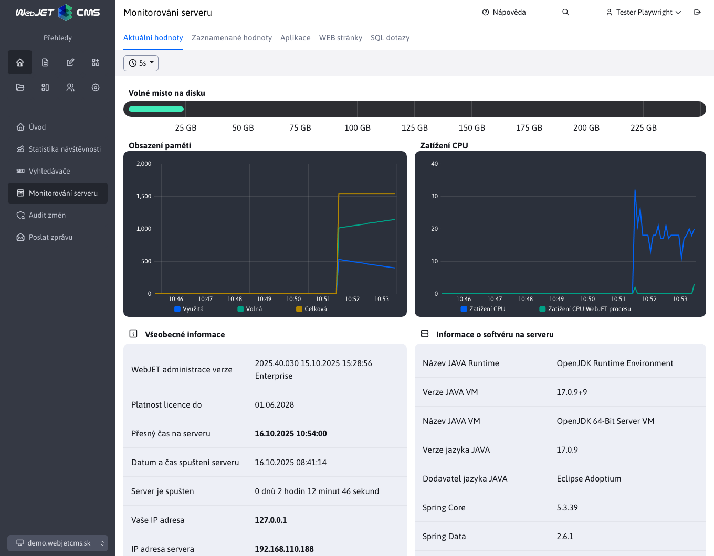

# Monitorování serveru

## Vnitřní monitorování

Analýza výkonu a zátěže serveru, jednotlivých aplikací, databázových dotazů a samotných stránek lze sledovat přímo v aplikaci Monitorování serveru (v administraci WebJETu v sekci Přehled).

Modul poskytuje následující možnosti:
- **Aktuální hodnoty** - aktuální hodnoty zatížení serveru, paměti a počet databázových spojení.

- **Zaznamenané hodnoty** - výpis historických zaznamenaných hodnot využití paměti, `sessions`, cache a spojení s databází. Pro ukládání historických hodnot je třeba nastavit konf. proměnnou `serverMonitoringEnable` na hodnotu `true`.

Po nastavení konfigurační proměnné `serverMonitoringEnablePerformance` na `true` jsou dostupné také:
- **Aplikace** - statistika provedení jednotlivých aplikací. Zobrazuje počet provedení, průměrný čas provedení, počet provedení z cache paměti a nejpomalejší provedení.
- **WEB stránky** - statistika zobrazení jednotlivých web stránek. Zobrazuje počet zobrazení, průměrný čas zobrazení, nejpomalejší a nejrychlejší zobrazení.

Po nastavení konfigurační proměnné `serverMonitoringEnableJPA` na `true` je dostupné také:
- **SQL dotazy** - statistika rychlosti provádění SQL dotazů. Zobrazuje počet provedení, průměrný čas provedení, nejpomalejší a nejrychlejší provedení a samotný SQL dotaz.

!>**Upozornění:** aktivace monitorování má vliv na výkon serveru a jeho paměťové zatížení. Kromě možnosti zaznamenané hodnoty má zapnutí monitoringu dopad na výkon serveru. Všechny údaje kromě části zaznamenané hodnoty jsou drženy pouze v paměti serveru, takže po jeho restartu se začnou evidovat nově.

!>**Upozornění:** modulové možnosti **Aplikace**, **WEB stránky** a **SQL dotazy** využívají jedinečnou společnou logiku, která je blíže popsána v [Monitorování serveru podle vybraného uzlu](nodes-logic.md)

## Vzdálené monitorování běhu serveru

Pokud potřebujete monitorovat stav WebJETu přes [Nagios](http://www.nagios.org) /[Zabbix](https://www.zabbix.com) nebo jinou službu, WebJET poskytuje na URL adrese `/components/server_monitoring/monitor.jsp` svůj stav. Odpovídá HTTP **stavem 200 je-li vše v pořádku**, nebo **stavem 500** (Internal Server Error) pokud **nejsou splněny všechny kontroly**.

Uvedenou URL adresu lze volat i v sekundových intervalech, doporučujeme ji používat i v rámci clusteru pro monitorování dostupnosti jednotlivých nodů.

**Povolené IP adresy**, pro které monitor.jsp korektně odpovídá se nastavují v konfigurační proměnné `serverMonitoringEnableIPs`.

Součást monitoruje následující části:
- **Inicializace WebJETu**, včetně jeho `preheating` (čekání na inicializaci cache objektů nebo úloh na pozadí). Čas preheating se nastavuje v konf. proměnné monitoringPreheatTime (výchozí 0). WebJET odpovídá textům `NOT INITIALISED` pokud není korektně inicializován (např. není vůbec konektivita do databáze při jeho startu, nebo má neplatnou licenci). Textem `TOO SHORT AFTER START` odpovídá během preheating času (zařazení do clusteru by mělo čekat na dokončení načtení cache objektů/úkolů na pozadí).
- Monitorování **dostupnosti databázového spojení** - provádí se SQL select z tabulky `documents` (konkrétně `SELECT title FROM documents WHERE doc_id=?`), přičemž v konfigurační proměnné `monitorTestDocId` je docid testované stránky. Pokud se SQL dotaz nepodaří odpovídá textům `DEFAULT DOC NOT FOUND`.
- **Dostupnost šablon** - je-li seznam inicializovaných šablon menší než 3 odpovídá textům `NOT ENOUGHT TEMPLATES`.
- **Zápis údajů statistiky** - ověřuje, že v zásobníku zápisu statistik není podezřele mnoho záznamů (jejich počet se nastavuje v konfigurační proměnné `statBufferSuspicionThreshold`, ve výchozím nastavení 1000). Pokud zásobník zápisu statistik obsahuje větší množství údajů k zápisu indikuje to buď problém s výkonem SQL serveru, nebo problém s úlohami na pozadí. V případě překročení počtu záznamů odpovídá textům `STAT BUFFER SUSPICION`.
- Pokud nastane **jiná chyba** odpovídá textům `EXCEPTION: xxxx`.

WebJET je možné i manuálně **přepnout do servisního režimu** nastavením konfigurační proměnné `monitorMaintenanceMode` na true. Tehdy monitor.jsp odpovídá textům `UNAVAILABLE`.

Je-li vše v pořádku odpovídá textem `OK`. Pro monitorování **postačuje sledovat HTTP stav** odpovědi, text je pouze informační pro přesnější určení problému.

## Konfigurační proměnné

- `serverMonitoringEnable` - pokud je nastaveno na `true`, spouští monitorování serveru každých 30 sekund a zapisuje tyto hodnoty do tabulky `monitoring`
- `appendQueryStringWhenMonitoringDocuments` - zachycovat při monitorování i SQL parametry `?`
- `monitorTestDocId` - ID stránky, jejíž databázové spojení (získání názvu) se testuje v komponentě `/components/server_monitoring/monitor.jsp` kterou může testovat dohledový SW (výchozí hodnota: 1)
- `serverMonitoringEnablePerformance` - pokud je nastaveno na `true`, spouští monitorování rychlosti SQL dotazů, web stránek a aplikací (výchozí hodnota: false)
- `serverMonitoringEnableJPA` - pokud je nastaveno na `true`, spouští monitorování rychlosti provádění SQL dotazů pro JPA, má ale za následek zvýšení zátěže na paměť serveru (výchozí hodnota: false)
- `serverMonitoringEnableIPs` - Seznam IP adres ze kterých je dostupná komponenta `monitor.jsp` pro monitorování serveru (výchozí hodnota: 127.0.0.1,192.168.,10.,62.65.161.,85.248.107.,195.168.35.)
- `monitoringPreheatTime` - Počet vteřin potřebných pro zahřátí web sídla (načtení cache) po restartu, během kterého bude `monitor.jsp` komponenta vracet nedostupnost uzlu clustra (výchozí hodnota: 0)
- `monitoringEnableCountUsersOnAllNodes` - Pokud veřejné uzly clusteru nemají možnost zapisovat do tabulky `_conf_/webjet_conf` nastavte na hodnotu `false`. Celkový počet `sessions` bude pak dostupný jen součtem z jednotlivých záznamů v monitorování serveru.
