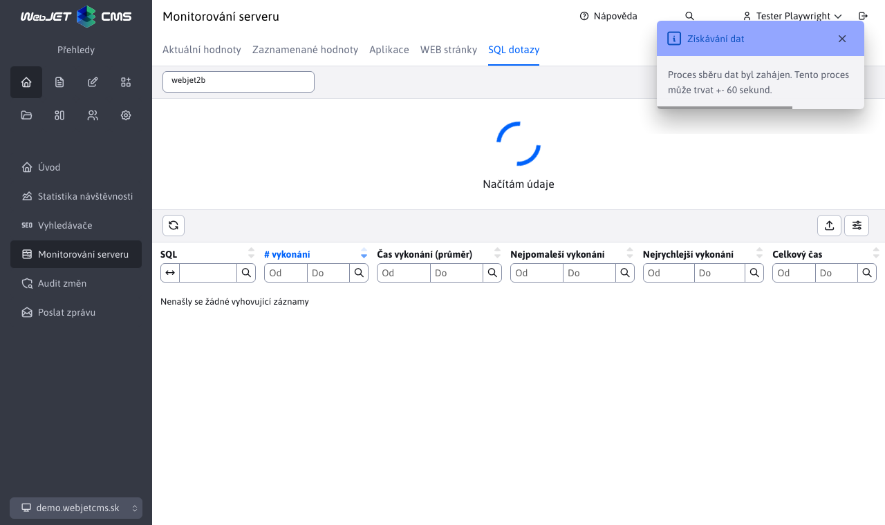

# Výměna dat uzlu clusteru

Webové stránky **Aplikace**, **WEBové stránky** a **Dotazy SQL** sdílejí stejnou logiku monitorování serveru podle aktuálně vybraného uzlu. Pro výběr uzlu použijte pole, které se zobrazuje v záhlaví stránky vedle jejího názvu.

Po otevření kliknutím se zobrazí všechny dostupné možnosti. Výchozí hodnotou je vždy aktuální uzel (uzel clusteru, ke kterému jste právě přihlášeni), který je označen textem `(Aktuálny uzol)`.

Pokud je vybraný uzel aktuální, zobrazí se lokálně uložená data. V tomto případě je k dispozici také tlačítko pro odstranění, které tato lokálně uložená data odstraní (tlačítko pro odstranění je k dispozici pouze pro aktuální uzel). V případě jiného než aktuálního uzlu se data načítají z databázové tabulky.

## Obnovení dat - aktuální uzel

Pokud je vybrán aktuální uzel, stisknutím tlačítka pro obnovení dat se načtou pouze aktuálně uložená data (s databázovými tabulkami se zde nepracuje). Pokud byla data dříve smazána, může chvíli trvat, než se objeví nové záznamy.

## Obnova dat - vzdálený uzel

U jiných uzlů než aktuálního je obnova dat obtížnější. Data ostatních uzlů jsou uložena v tabulce `cluster_monitoring`. Proces obnovy dat začíná odstraněním dat z tabulky, protože již nemusí být aktuální.

Jak vidíte na obrázku výše, data byla odstraněna a zobrazí se animace čekající na data. Zobrazí se také informační oznámení, které nás upozorňuje, že tento proces může trvat +- několik sekund. Tento interval se může lišit v závislosti na nastavené konfigurační proměnné `clusterRefreshTimeout`.

Proces získávání aktuálních dat spočívá ve vytvoření požadavku na aktuální data pro uzel vytvořením záznamu v databázové tabulce. `cluster_refresher`. Samotný shluk v intervalech zadaných proměnnou conf. `clusterRefreshTimeout` aktualizuje údaje v tabulce `cluster_monitoring` pro určitý uzel, pokud je v tabulce požadavek na tento uzel. `cluster_refresher`. Proces načítání dat proto může trvat několik minut a může se lišit v závislosti na nastaveném intervalu obnovy clusteru (může nastat situace, kdy byl interval clusteru těsně před obnovou a skutečná data jsou načtena za 10 sekund, i když byl interval nastaven na 5 minut).

Ačkoli se nezobrazuje, stránka se každých 10 sekund zeptá, zda je tabulka `cluster_monitoring` nebyla přidána žádná nová data, která by bylo možné zobrazit. Pokud požadovaný uzel neobsahoval žádná data (ale tabulka již byla aktualizována), bude vytvořen nový požadavek na data v clusteru a opět budeme každých 10 sekund kontrolovat, zda data již nebyla aktualizována. Celý proces se bude opakovat, dokud nebude aktualizovaná tabulka `cluster_monitoring` nebude obsahovat alespoň jeden záznam, který se má zobrazit. V tomto okamžiku se animace skryje a zobrazí se aktuálně načtená data druhého uzlu.
