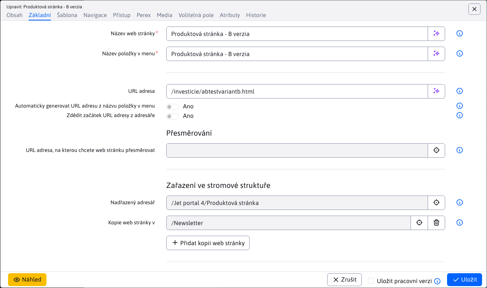
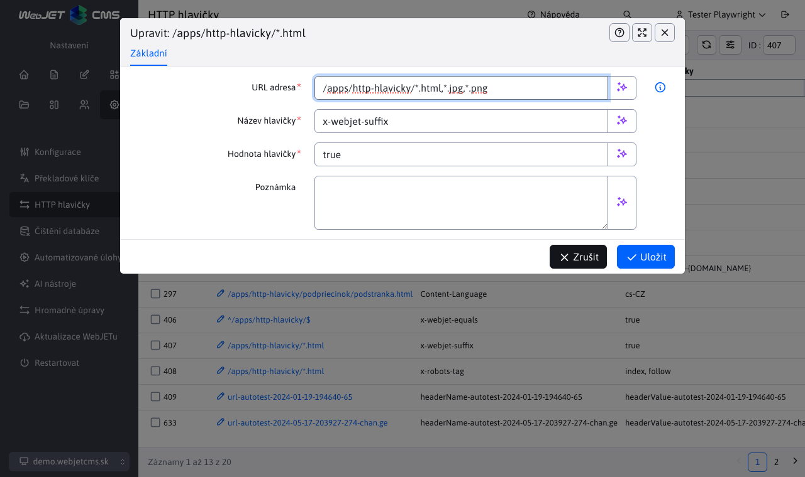

# Výkonnost serveru

Pro optimální výkon serveru je třeba splnit několik požadavků a nastavení. Každá aplikace (např. fotogalerie, anketa atd.) vložená do webové stránky způsobuje zpomalení. Aplikace obvykle provádějí další požadavky na databázi nebo potřebují číst data ze souborového systému.

Vyhledávače, které neustále procházejí a indexují webové stránky na vašem serveru, mohou mít také významný vliv na výkon. Jejich návštěvnost nemusí být viditelná např. v nástroji Google Analytics, ale je viditelná v nástroji [Statistiky](../../redactor/apps/stat/README.md) poskytované systémem WebJET CMS.

## Identifikace problémů

Nejprve je třeba zjistit, kde dochází ke zpomalení. Pokud dokážete na první pohled identifikovat webovou stránku, která se vám zdá pomalá, můžete použít parametr URL. `?_writePerfStat=true`. V opačném případě zapněte monitorování serveru, při kterém můžete identifikovat webové stránky, jejichž spuštění trvá nejdéle.

### Parametr URL

Použití parametru URL `?_writePerfStat=true` je možné získat seznam aplikací vložených do webové stránky s časem jejich spuštění. Například stránka `/sk/` zobrazit jako `/sk/?_writePerfStat=true`.

Při tomto způsobu zobrazení webové stránky se výraz typu `PerfStat: 3 ms (+3) !INCLUDE(...)`. Na standardní webové stránce nemusí být snadno vyhledatelný, proto doporučujeme zobrazit zdrojový kód stránky - v nabídce Chrome Zobrazit-Vývojář-Zobrazit zdrojový kód. Poté použijte vyhledávací výraz prohlížeče `PerfStat:`.

Tento výraz je ve formátu `PerfStat: 3 ms (+3)` kde první číslo je celková doba provedení jednoho úkonu. `iwcm:write` a číslo v závorce je doba provádění této aplikace. Následuje cesta k aplikaci a její parametry. Zajímá vás tedy primární číslo v závorce.

Použití parametru URL `_disableCache=true` můžete vypnout ukládání aplikací do mezipaměti.

### Monitorování serveru

Chcete-li získat komplexní zobrazení, můžete zapnout funkci [monitorování serveru](../monitoring/README.md) nastavením následujících konfiguračních proměnných:
- `serverMonitoringEnable` - umožňuje funkci monitorování a protokolování serveru
- `serverMonitoringEnablePerformance` - zapíná monitorování výkonu aplikací a webových stránek
- `serverMonitoringEnableJPA` - umožňuje funkci sledování dotazů SQL

!>**Varování:** monitorování výkonu aplikací a dotazů SQL zatěžuje server, nedoporučujeme mít tuto funkci trvale zapnutou.

Po nastavení konfiguračních proměnných je třeba provést následující úkony. **restartovat aplikační server** aktivovat sledování výkonu při inicializaci.

V části Sledování serveru - Aplikace/WEB stránky/Dotazy SQL pak můžete identifikovat části, jejichž spuštění trvá dlouho. Zaměřte se na nejčastěji spouštěné aplikace/dotazy SQL a optimalizujte je.

### Celková doba generování webové stránky

K dispozici je aplikace `/components/_common/generation_time.jsp` který po vložení do zápatí šablony webové stránky vygeneruje do kódu HTML celkový čas generování webové stránky.

Lze nastavit následující parametry aplikace:
- `hide` - výchozí nastavení `true` - čas generování se zobrazí jako komentář v kódu HTML.
- `onlyForAdmin` - výchozí nastavení `false` - čas generování se zobrazí pouze v případě, že je přihlášen správce.

Do zápatí (nebo do vhodného volného pole) šablony webové stránky vložte následující kód:

```html
!INCLUDE(/components/_common/generation_time.jsp, hide=true, onlyForAdmin=false)!
```

V místě vložené aplikace se zobrazí informace o době provádění celé webové stránky v ms:

```html
<!-- generation time: 4511 ms -->
```

## Měření výkonu databázového serveru a souborového systému

Pro porovnání výkonu prostředí - např. testovacího a produkčního prostředí - lze použít níže uvedené skripty. Jejich spuštění vyžaduje právo aktualizovat WebJET. Prostředí můžete měřit a porovnávat bez zátěže, ale také za provozu nebo při testech výkonu.
- `/admin/update/dbspeedtest.jsp` - měří výkon při čtení dat z databázového serveru.

Dobré hodnoty jsou například:

```html
Image read, count=445
...
Total time: 649 ms, per item: 1.4584269662921348 ms
Total bytes: 4.8050469E7, per second: 7.403770261941448E7 B/s

Random web page read, count=3716
...
Total time: 3608 ms, per item: 0.9709364908503767 ms
Total bytes: 1371566.0, per second: 380145.78713968955 B/s

Only documents.data web page read, count=3716
...
Total time: 2205 ms, per item: 0.5933799784714747 ms
Total bytes: 685783.0, per second: 311012.6984126984 B/s

Documents read using web page API, count=3716
...
Total time: 1869 ms, per item: 0.5029601722282023 ms
Total bytes: 685783.0, per second: 366925.09363295883 B/s
```

Vzhledem k rozdílnému počtu záznamů v databázi je nutné porovnat. `per item` Hodnoty.

- `/admin/update/fsspeedtest.jsp` - kontroluje rychlost čtení seznamu souborů ze souborového systému, měla by být kontrolována zejména v případě, že používáte síťový souborový systém.

Dobré hodnoty jsou například:

```html
Testing mime speed, start=0 ms
has base file object, fullPath=/Users/jeeff/Documents.nosync/workspace-visualstudio/webjet/webjet8v9-hotfix/src/main/webapp/components/_common/mime diff=1 ms
listFiles, size=678, diff=284 ms
listing done, diff=16 ms


Testing modinfo speed, start=0 ms
modinfo list, size=102, diff=1 ms
modinfo listing done, diff=220 ms
Total time=522ms
```

## Optimalizace databázových dotazů

Chcete-li optimalizovat počet požadavků na databázi, můžete povolit ukládání do mezipaměti - `cache`.

### Webové stránky

Každá webová stránka má na kartě Základní možnost **Povolení ukládání stránek do mezipaměti**. Zapnutím této možnosti se obsah webové stránky přenese z tabulky. `documents` je uložen v mezipaměti. Při zobrazení webové stránky není nutné volat databázi pro načtení obsahu webové stránky.

Tuto možnost doporučujeme povolit na nejnavštěvovanějších webových stránkách, jejichž seznam můžete získat v aplikaci. [Statistiky](../../redactor/apps/stat/README.md#horní-stránky).



### Aplikace

Podobně jako u webových stránek můžete mezipaměť povolit také u aplikací. Některé aplikace mají tuto možnost k dispozici přímo v [nastavení aplikace](../../custom-apps/appstore/README.md#zobrazení-karty) vložené na webové stránce na kartě Zobrazit jako pole. **Doba vyrovnávací paměti**.


Pokud aplikace nemá toto nastavení k dispozici, můžete parametr nastavit v kódu HTML textu webové stránky přidáním parametru `, cacheMinutes=xxx` například na parametry vestavěné aplikace:

```html
!INCLUDE(sk.iway.iwcm.components.reservation.TimeBookApp, reservationObjectIds=2560+2561, device=, cacheMinutes=10)!
```

!>**Varování:** je důležité si uvědomit, že mezipaměť je globální pro celý aplikační server. Jako klíč se používá cesta k souboru aplikace, jednotlivé parametry uvedené v kódu HTML webové stránky a jazyk aktuálně zobrazené webové stránky. Parametry URL webové stránky nejsou brány v úvahu.

Mezipaměť tedy nelze použít, pokud se například zobrazuje stránkovací seznam, kde se číslo stránky předává pomocí parametru URL. Existuje však výjimka pro aplikace, které obsahují seznam novinek v názvu souboru `/news/news` vyrovnávací paměť se použije pouze v případě, že v adrese URL není zadán žádný parametr. `page` nebo je hodnota tohoto parametru jiná než `1`. Tímto způsobem se vyrovnávací paměť používá i pro seznam novinek, ale ukládá se pouze první stránka výsledků. Další stránky se neukládají.

## Optimalizace souborového systému

Webové stránky obvykle obsahují mnoho dalších souborů - obrázky, soubory stylů CSS, soubory JavaScriptu atd. - které je třeba načíst společně s webovou stránkou. Rychlost zobrazení proto závisí také na počtu a velikosti těchto souborů.

### Nastavení vyrovnávací paměti

Je možné nastavit prohlížeč tak, aby používal mezipaměť pro soubory webových stránek - soubor se tak nebude načítat opakovaně při každém zobrazení webové stránky, ale pokud jej prohlížeč již má uložený v mezipaměti, použije jej. Tím se zrychlí zobrazení webové stránky a sníží se zatížení serveru. Příkladem může být obrázek loga, který je obvykle na každé stránce, ale je velmi nepravděpodobné, že by se měnil - nebo se mění řádově jednou za několik měsíců.

Je možné nastavit následující konfigurační proměnné, které ovlivňují hlavičku HTTP. `Cache-Control`:
- `cacheStaticContentSeconds` - nastavit počet sekund, výchozí `300`.
- `cacheStaticContentSuffixes` - seznam rozšíření, pro která je hlavička HTTP `Cache-Control` ve výchozím nastavení vygenerovány `.gif,.jpg,.png,.swf,.css,.js,.woff,.svg,.woff2`.

Pro přesnější nastavení můžete použít aplikaci [Hlavičky HTTP](../../admin/settings/response-header/README.md) kde můžete nastavit různé hodnoty pro různé adresy URL.



## Chování správce

Pokud je přihlášen správce, vyrovnávací paměť aplikace se nepoužívá (předpokládá se, že správce chce vždy vidět aktuální stav).

Toto chování lze změnit nastavením konfigurační proměnné `cacheStaticContentForAdmin` na hodnotu `true`. Tuto hodnotu je vhodné nastavit zejména u intranetových instalací, kde se uživatelé ověřují proti `SSO/ActiveDirectory` serveru a i při práci v intranetovém prostředí mají práva správce.

## Vyhledávače

Vyhledávače a různí další roboti mohou server značně zatížit. Zejména s nástupem učení umělé inteligence dochází k významnému procházení internetu a naplňování databází pro učení umělé inteligence. Boti často zkoušejí různé parametry URL, aby získali další data.

### Nastavení souboru robots.txt

Chování robotů lze ovlivnit nastavením v souboru `/robots.txt`. Pokud neexistuje, je vygenerován jako výchozí. Umístěte svou upravenou verzi do `/files/robots.txt`, z tohoto umístění jej WebJET zobrazí při volání `/robots.txt`.

Použití souboru [robots.txt](https://en.wikipedia.org/wiki/Robots.txt) můžete ovlivnit chování robotů a vyhledávačů - omezit adresy URL, které mohou používat, nastavit rozestupy mezi požadavky atd.

## Další nastavení

### Reverzní server DNS

Statistiky, audit a další aplikace mohou z IP adresy načíst reverzní záznam DNS. Používají se volání API `InetAddress.getByName(ip).getHostName()`. Server DNS však nemusí být na serverech/DMZ k dispozici a toto volání může trvat několik sekund, než dojde k chybě. Obecně takové volání zpomaluje provádění požadavku HTTP.

Nastavením konfigurační proměnné `disableReverseDns` na hodnotu `true` je možné zakázat načítání názvu DNS z IP adresy návštěvníka a urychlit provádění dotazů. V poli pro hodnotu `hostname` pak se zapíše hodnota IP adresy.

### Vypnutí statistik

Zápis statistických dat je asynchronní, provádí se dávkově, takže zobrazení webové stránky nečeká na zápis statistických dat do databáze.

Pokud je provoz vysoký nebo hledáte problémy s výkonem, můžete dočasně zakázat zaznamenávání statistik provozu nastavením konfigurační proměnné. `statMode` na hodnotu `none`. Standardní hodnota je `new`.
