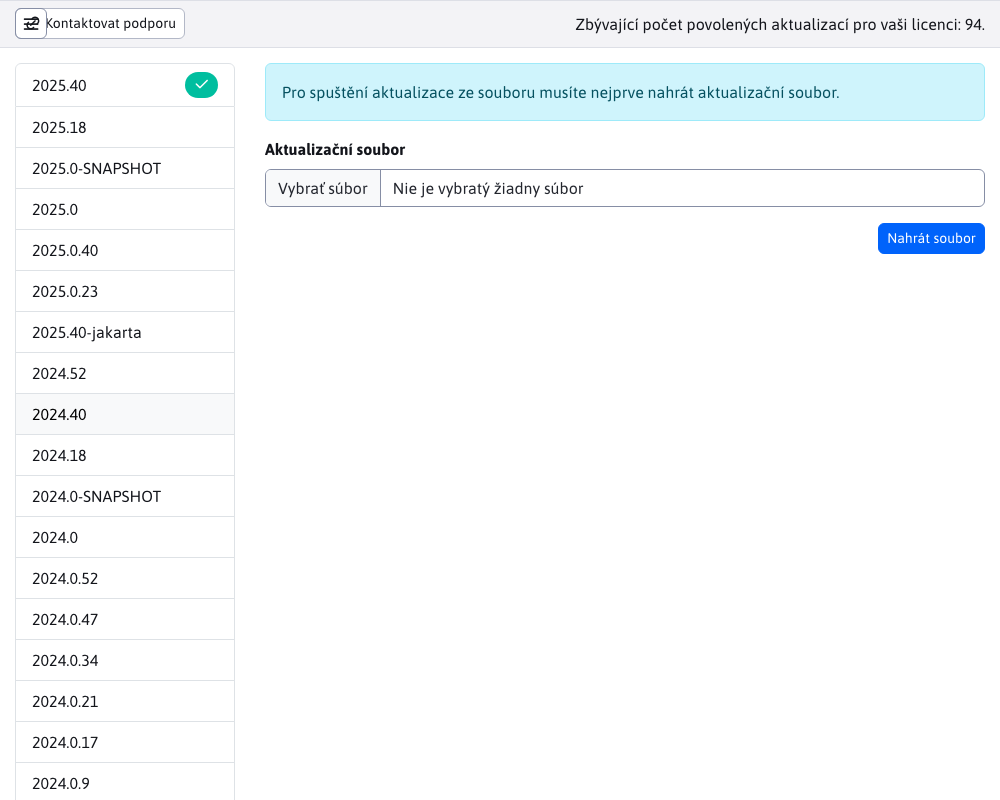

# Aktualizace WebJET

Sekce Aktualizace WebJET slouží k aktualizaci verzí WebJET. V levé části obrazovky je zobrazen seznam dostupných verzí WebJET, na které lze váš WebJET aktualizovat. Aktuální verze vašeho WebJETu je v seznamu označena ikonou .

Po kliknutí na jednotlivé verze se v pravé části obrazovky zobrazí seznam všech změn, které vybraná verze přináší.

**Varování:** aktualizujte WebJET pouze v případě, že víte, co děláte. Před aktualizací se obraťte na poskytovatele hostingu a požádejte ho o podporu. Může se stát, že WebJET po aktualizaci nenaběhne správně a bude nutné restartovat server.

Pokud váš projekt obsahuje další knihovny JAR, musíte je umístit do složky `/WEB-INF/lib-custom/`. Složka je během aktualizace plně nahrazena `/WEB-INF/lib/` a vaše knihovny by tak byly odstraněny. To může mít za následek nemožnost spuštění systému po restartu. Pokud taková situace nastane, zkopírujte chybějící knihovny do adresáře `/WEB-INF/lib/` od zálohy.

## Aktualizace na konkrétní verzi

Chcete-li aktualizovat WebJET na určitou verzi, musíte vybrat požadovanou verzi a poté tlačítkem spustit aktualizaci. 

## Aktualizace ze souboru

Podporována je také možnost použít aktualizaci ze souboru. Tuto možnost lze také vybrat v levém menu jako .

Poté budete vyzváni k výběru a následnému nahrání souboru pomocí tlačítka . Pokud je soubor úspěšně nahrán, budete vyzváni ke spuštění samotné aktualizace pomocí příkazu .

