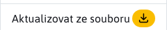

# Aktualizace WebJETu

Sekce Aktualizace WebJETu slouží k aktualizaci verzí WebJETu. Levá část obrazovky zobrazuje seznam dostupných verzí WebJETu na které lze Váš WebJET aktualizovat. Právě aktuální verze Vašeho WebJETu je v seznamu označena ikonou .

Při kliknutí na jednotlivé verze se v pravé části obrazovky zobrazí seznam všech změn, které vybraná verze přináší.

!>**Upozornění:** aktualizaci WebJETu provádějte pouze v případě, že víte co děláte. Před aktualizací kontaktujte vašeho poskytovatele hostingu pro případnou podporu. Může se stát, že po aktualizaci WebJET nenastartuje správně a bude nutný restart serveru.

Pokud váš projekt obsahuje doplňkové JAR knihovny je třeba je umístit i do složky `/WEB-INF/lib-custom/`. Během aktualizace je plně nahrazená složka `/WEB-INF/lib/` a tedy vaše knihovny by byly smazány. To může mít za následek neschopnost spuštění po restartu. Pokud taková situace nastane zkopírujte chybějící knihovny do `/WEB-INF/lib/` ze zálohy.

## Aktualizace na konkrétní verzi

Pro aktualizování WebJETu na konkrétní verzi je třeba zvolit požadovanou verzi a následně použít tlačítko pro spuštění aktualizace 

## Aktualizování ze souboru

Podporována je také možnost využít aktualizování ze souboru. Tuto možnost lze vybrat také v levém menu jako .

Následně budete vyzváni k výběru a následnému nahrání souboru pomocí tlačítka . Pokud bude soubor úspěšně nahrán, budete vyzváni ke spuštění samotné aktualizace pomocí tlačítka .

