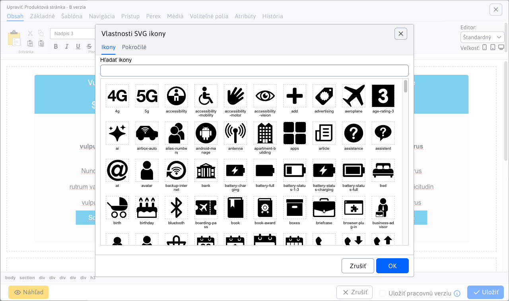

# Test překladů

Cílem tohoto souboru je testovat překladač a zachování formátování. Tento soubor by měl obsahovat různé typy formátování, jako jsou **tučný text**, *kurziva*, `kód`, a odkazy [Google](https://www.google.com).

Pro testování nastavte v souboru `deepmark.config.mjs` hodnotu `javascript` následovně:

```javascript
    directories: [
        ['sk/translation-test', '$langcode$/translation-test'],
    ]
```

Také by měl obsahovat seznamy, zde je důležité, že za tímto nadpisem **zůstane prázdný řádek**.

- První bod
- Druhý bod
- Třetí bod

Důležité je, aby zachoval strukturu, prázdné řádky a podobně.

## `Sidebar` problém

Zde smaže prázdný řádek za `point_left`, což způsobí, že se tento odkaz spojí s dalším textem. POZOR: otestujte chování i v `_sidebar.md` souboru, protože zde to někdy funguje správně.

POZOR: také na to, že udělá z `point_left` `point\_left`.

<div class="sidebar-section">Manuál pro provoz</div>

- [:point_left: Zpět na Úvod](/?back)

- Bezpečnost
  - [Bezpečnostní testy](../sysadmin/pentests/README.md)
  - [Kontrola zranitelností knihoven](../sysadmin/dependency-check/README.md)
  - [Aktualizace WebJETu](../sysadmin/update/README.md)

## Tabulky

Ukázka tabulky. Zde POZOR na to, aby neudělal z `perex_group_id` `perex\_group\_id` a podobně.

| perex_group_id | perex_group_name      | `domain_id` | `available_groups` |
|----------------|-----------------------|-------------|--------------------|
| 3              | další perex skupina  | 1           | test               |
| 645            | `deletedPerexGroup`   | 1           | `NULL`             |
| 794            | kalendář-událostí     | 1           |                    |
| 1438           | další perex skupina  | 83          | pěkný den          |
| 1439           | `deletedPerexGroup`   | 83          | `NULL`             |
| 1440           | kalendář-událostí     | 83          | `NULL`             |

Tabulka s mezerami v hlavičce:

| Kód modulu | Popis | Důvod deaktivace |
| --- | --- | --- |
| `cmp_forum` | Fórum a diskusní fórum | Snižuje riziko XSS a spam útoků |
| `cmp_blog` | Blog | Snižuje riziko XSS a spam útoků |
| `cmp_dmail` | Distribuční seznam (newsletter) | Snižuje riziko spam útoků přes hromadné rozesílání |

## HTML kód

V MD souboru může být i HTML kód, například YouTube video. Zde nesmí zapomenout na uvozovky za `allow` atributem.

<div class="video-container">
    <iframe width="560" height="315" src="https://www.youtube.com/embed/XRnwipQ-mH4" title="YouTube video player" frameborder="0" allow="accelerometer; autoplay; clipboard-write; encrypted-media; gyroscope; picture-in-picture" allowfullscreen></iframe>
</div>

## Changelog

V changelogu máme různé podivné konstrukce.

- Upraveno zpracování **nahrávání souborů** `multipart/form-data`, více v [sekci pro programátora](#test-překladů) (#57793-3).
- Doporučujeme **zkontrolovat funkčnost všech formulářů** z důvodu úprav jejich zpracování, více informací v sekci [pro programátora](#test-překladů) (#58161).

### Webové stránky

- Přidána možnost vkládat `PICTURE` element, který zobrazuje [obrázek podle rozlišení obrazovky](../frontend/setup/ckeditor.md#picture-element) návštěvníka. Můžete tedy zobrazit rozdílné obrázky na mobilním telefonu, tabletu nebo počítači (#58141).


- Přidána možnost vkládat [vlastní ikony](../frontend/setup/ckeditor.md#svg-ikony) definované ve společném SVG souboru (#58181).



### Různé formátování

Zde je tučný text **tučný**, kurzíva *kurzíva*, ale i jejich kombinace ***tučná kurzíva***. Dále je zde ~~přeškrtnutý text~~ a text s `inline kódom`.

Odkaz s názvem (title): [Google](https://www.google.com "Vyhledávač Google").

Referenční odkaz: [WebJET CMS][webjet] a další [odkaz][webjet].

[webjet]: https://www.webjetcms.sk "WebJET CMS"

## Nadpisy všech úrovní

### H3 nadpis sekce

#### H4 nadpis pod-sekce

##### H5 nadpis

###### H6 nadpis

## Citace

Jednoduchá citace:

> Toto je citace. Může obsahovat **tučný text**, *kurzivu* nebo `kód`.

Vnořená citace:

> Vnější citace s nějakým textem.
>
> > Vnořená citace dovnitř.
> >
> > > Ještě hlubší citace.

Citace s více odstavci:

> První odstavec citace obsahuje text, který může být delší.
>
> Druhý odstavec téže citace.

## Upozornění (Alerts/Admonitions)

!> Toto je varování (warning). Obsahuje důležitou informaci na kterou je třeba si dát pozor.

?> Toto je tip (info). Obsahuje užitečnou informaci pro uživatele.

## Uspořádané seznamy

1. První bod
2. Druhý bod
3. Třetí bod
   1. Vnořený první bod
   2. Vnořený druhý bod
4. Čtvrtý bod

Seznam s delším textem:

1. **První bod** – obsahuje tlustý text a popis co se stane při této volbě.
2. *Druhý bod* – obsahuje kurzívu a další popis.
3. Třetí bod s odkazem na [dokumentaci](https://www.google.com).

## Neuspořádané seznamy – vnořené

- Hlavní bod A
  - Vnořený bod A1
  - Vnořený bod A2
    - Hluboce vnořený bod A2a
    - Hluboce vnořený bod A2b
  - Vnořený bod A3
- Hlavní bod B
- Hlavní bod C

## Seznam úloh (Task list)

- [x] Dokončený úkol
- [x] Další dokončený úkol
- [ ] Nedokončený úkol
- [ ] Další nedokončená úloha s **tučným** textem

## Horizontální čára

Text před horizontální čarou.

---

Text za horizontální čarou.

## Kódové bloky

Blok s jazykem SQL:

```sql
SELECT wp.doc_id, wp.title, wp.perex_group_id
FROM web_pages wp
WHERE wp.domain_id = 1
  AND wp.deleted = 0
ORDER BY wp.doc_id;
```

Blok s jazykem Java:

```java
@RestController
@RequestMapping("/api/v1/pages")
public class PageRestController {
    @GetMapping("/{id}")
    public ResponseEntity<PageBean> getPage(@PathVariable Long id) {
        return ResponseEntity.ok(pageService.getPage(id));
    }
}
```

Blok s jazykem `Bash`:

```bash
./gradlew appStart -Pprofile=local
```

Blok s jazykem YAML:

```yaml
spring:
  datasource:
    url: jdbc:mariadb://localhost:3306/webjet
    username: webjet
    password: webjet
```

## Pevný řádkový zlom (Hard line break)

Toto je první řádek.\
Toto je druhý řádek po pevném zlomu.

Toto je první řádek se dvěma mezerami na konci (hard break před ním).
Toto je druhý řádek po soft-break.

## Únikové znaky (Escaped characters)

Tyto znaky musí zůstat neporušené po překladu: \*hvězdička\*, \_podtržítko\_, \`spätný apostrof\`, [hranatá závorka\], \#mřížka, zpětný apostrof \`, \&ampersand\.

## Obrázky

Obrázek s alt textem:


Obrázek s alt textem a `title`:


Referenční obrázek:

![Logo][logo]

[logo]: ../frontend/setup/picture-element.png "Logo WebJET"

## Smíšené formátování v textu

Toto je odstavec s **tučným**, *kurzivním* a ***tučně-kurzivním*** textem. Obsahuje také `inline kód`, ~~přeškrtnutý text~~ a [odkaz na Google](https://www.google.com). Také může obsahovat URL adresu: https://www.webjetcms.sk.

Další odstavec s kombinací formátování ve větě: Při nastavování hodnoty `domain_id` v tabulce `web_pages` je třeba použít správnou hodnotu **před uložením záznamu**, jinak může dojít k chybě.

## Tabulka s různým formátováním v buňkách

| Sloupec | Tlustý text | Kód | Odkaz |
| -------- | ----------- | ----- | ------- |
| Řádek 1 | **tlustý** | `kód_hodnota` | [odkaz](https://www.google.com) |
| Řádek 2 | *kurziva* | `NULL` | [Dokumentace](../frontend/setup/ckeditor.md) |
| Řádek 3 | ~~přeškrtnuto~~ | `perex_group_id` | – |

Tabulka se zarovnáním sloupců:

| Levý sloupec | Střední sloupec | Pravý sloupec |
|:------------|:--------------:|-------------:|
| vlevo       | střed          | vpravo       |
| hodnota A   | hodnota B      | hodnota C    |

## Inline HTML

Text s inline HTML: toto je <strong>tlustý HTML text</strong> a toto je <em>HTML kurzíva</em>.

Inline <code>HTML kód</code> a <a href="https://www.google.com">HTML odkaz</a>.

<p>Odstavec v HTML značce s <strong>tučným</strong> textem a <a href="https://www.google.com" title="Google">odkazem</a>.</p>

## Víceřádkové seznamy s odstavci

- První bod seznamu.

    Tento odstavec patří k prvnímu bodu seznamu a je odsazen.

- Druhý bod seznamu.

    Tento odstavec patří k druhému bodu seznamu.

    > Citace vnořená do bodu seznamu.

- Třetí bod seznamu s kódem:

    ```javascript
    const value = config.get('domain_id');
    ```
