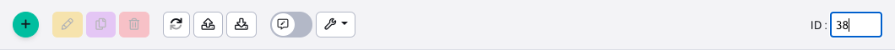

# DatatableOpener

Trieda ```DatatableOpener``` zabezpečuje zobrazenie ID aktuálne otvoreného záznamu v URL adrese prehliadača (parameter ```id```), zobrazenie ID v hlavičke datatabuľky a vyhľadanie zadaného ID v hlavičke datatabuľky. Trieda je implementovaná podľa triedy [AbstractJsTreeOpener](js-tree-document-opener.md).



Trieda je inicializovaná priamo v ```index.js``` datatabuľky. Opener je možné vypnúť nastavením parametra konfigurácie ```idAutoOpener: false```.

```javascript
...
import {DatatableOpener} from "../../src/js/libs/data-tables-extends/";
...
DATA.idAutoOpener = (typeof options.idAutoOpener !== "undefined") ? options.idAutoOpener : true;
...

//inicializacia openera
if (DATA.idAutoOpener===true) {
    //inicializuj DT opener
    TABLE.datatableOpener = new DatatableOpener();
    TABLE.datatableOpener.dataTable = TABLE;
    TABLE.datatableOpener.init();
}

//ukazka vypnutia openera nastavenim idAutoOpener: false
webpagesDatatable = WJ.DataTable({
    url: webpagesUrl,
    columns: webpageColumns,
    tabs: tabs,
    editorId: "docId",
    idAutoOpener: false
});
```

Hodnota ID sa do URL parametra nastaví len počas otvoreného editora, po jeho zatvorení sa z URL adresy parameter ```id``` zmaže. Takého správanie sa nám zdá prirodzenejšie a vystihujúce aktuálny stav.

Trieda po inicializácii v hlavičke datatabuľky vytvorí volaním funkcie ```bindInput``` vstupné pole pre zadanie ID, v ktorom čaká na stlačenie klávesy ```Enter```. Následne zadanú hodnotu nastaví do atribútu ```this.id``` a vyvolá ```this.dataTable.draw();```, aby sa spustil proces zobrazenia editora podobne ako pri inicializácii z URL parametra.

## Nastavenie ID do URL adresy

Trieda po otvorení editora (pomocou udalosti ```this.dataTable.EDITOR.on( 'open', ( e, type ) => {```) získa aktuálny JSON objekt ```this.dataTable.EDITOR.currentJson``` z ktorého získa ID hodnotu podľa stĺpca v ```this.dataTable.DATA.editorId``` (nie vždy je ID hodnota v stĺpci id, môže to byť napr. ```insertScriptId```). Získanú hodnotu nastaví volaním ```setInputValue``` do vstupného poľa a do URL parametra id.

## Otvorenie editora na základe URL parametra

Po inicializovaní v ```index.js``` sa nastaví hodnota z URL parametra do interných objektov. Počúva sa udalosť ```this.dataTable.on('draw.dt', (evt, settings) => {```, čiže vykreslenie tabuľky. Z nej sa získa na základe ID príslušný riadok a vyvolá sa funkcia otvorenia editora ```this.dataTable.wjEditFetch($('.datatableInit tr[id=' + id + ']'));```.

## Vyhľadávanie zadaného ID

Problémom otvorenia editora je stav, kedy zadané ID nie je na aktuálne zobrazenej strane datatabuľky. Tu tiež musíme rozlišovať stav serverového a klientskeho stránkovania. Volaním ```const idIndex = Object.keys(settings.aIds).indexOf(id.toString());``` sa získa poradový index v aktuálnych dátach pre zadané id. Zároveň sa vypočíta strana, na ktorej by sa mal záznam nachádzať výpočtom ```const pageNumber = info.length < 0 ? 0 : Math.floor(idIndex / info.length);```.

Ak sa jedná o aktuálnu stranu (alebo bol záznam nájdený v dátach pri serverovom stránkovaní) vyvolá sa zobrazenie editora volaním ```this.dataTable.wjEditFetch($('.datatableInit tr[id=' + id + ']'));```.

Ak záznam je na inej strane vyvolá sa zobrazenie tejto strany volaním ```setTimeout(() => this.dataTable.page(pageNumber).draw('page'), 500);```.

Pri serverovom stránkovaní ale nevieme jednoducho na klientskej strane určiť stranu, na ktorej sa záznam nachádza. Je preto spustené postupné stránkovanie údajov volaním REST služby servera. Aby nedošlo k zahlteniu je stránkovanie volané cez funkciu ```setTimeout``` v 500ms intervale. Aby nedošlo k zacykleniu je počítané volanie servera v atriúte ```failsafeCounter```, kde je nastavený limit 30 volaní. **Vyhľadávanie teda nájde zadané ID v maximálne prvých 30 stranách**.

Do budúcna zvažujeme implementovať získanie strany v serverovej REST službe, čo by eliminovalo problém postupného stránkovania údajov na klientskej strane.

## Filtrovanie podľa hash parametrov

Knižnica poskytuje aj možnosť filtrovania tabuľky podľa zadaných parametrov v hash výraze, teda napr. `/admin/v9/users/user-list/#dt-filter-id=3`. Parametre zadané vo `window.location.hash` začínajúce na `dt-filter-` sú po inicializácii tabuľky nastavené do príslušných filtrovacích polí v hlavičke. Následne je vykonané kliknutie na ikonu vyhľadávania pri prvom poli.

Po načítaní záznamov sú riadky označené, je teda ľahko možné vykonať akciu typu schválenie používateľa a podobne.

Ak je v hash výraze aj hodnota `dt-open-editor=true` otvorí sa po označení riadkov aj editor.

Implementácia je vo funkcii `filterTableByHashParameters`, ktorá je vyvolaná pri udalosti `this.dataTable.one('draw.dt', (evt, settings) => {`.