# Changelog version 2021

## 2021.52

> Version 2021.52 has a new design even for old versions of applications, improves the responsive version, adds new fields to web pages, and improves the behavior of page URLs when moving them to another directory.

**Redesign of version 8**

We have adjusted the design of the old version 8 applications so that the color scheme and layout correspond to the design of the new version of WebJET CMS. The menu behaves the same as in the new version for a more comfortable transition between the old and new applications (#54233).

By clicking the "Switch to version 8" icon in the header, you can still switch the interface to the version 8 design.

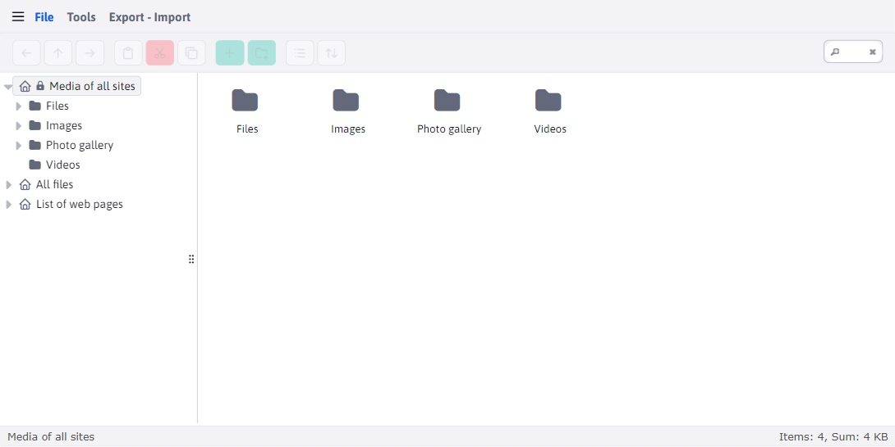

**Website**

- Added the option to save [working version of the website](redactor/webpages/README.md). It will be saved in history and will not be available to website visitors for now (#54161).


- Completely redesigned [Webpage Editing API](developer/apps/webpages/api.md) from the original ```EditorDB``` to ```EditorFacade```. Web pages are loaded and saved via Spring DATA, which will allow for easy addition of new database attributes (even specifically on client projects) in the future. It's just one line in the changelog, but in reality it's 95 new/changed files (#54161).
- Added the ability to open another editor from the editor. For now, the function is implemented in the Website Template field in the page editor. You can click on the pencil to edit the set template, or click on the + icon to add a new template without leaving the page editor. Gradually, this function will be added to other fields such as Header, Footer, free fields, etc.


- Modified field for entering domain in directory properties - now only displayed for the root directory.
- Added descriptive/info texts for fields in the page and folder editor.
- Status icons moved to a separate column with the ability to filter by status, eye icon added for direct display of a web page from the page list.


- Added rights control for the ability to create/edit/delete web pages and directories and rights control for individual directories (#54257).
- Added status icons to a separate column with the ability to filter and directly view the web page by clicking on the eye icon (#54257).
- Added independent options for setting the display of the directory and website in the site map and in the navigation bar. Version 8 had these options linked to the display in the menu. However, sometimes it was necessary to display items differently in the menu and, for example, in the site map (#54205).


- Added the option to set a Free AD object in the template tab on the website. This makes it possible to change not only headers/footers/menus, but also free template objects for each website separately. It is also possible to set an empty value.

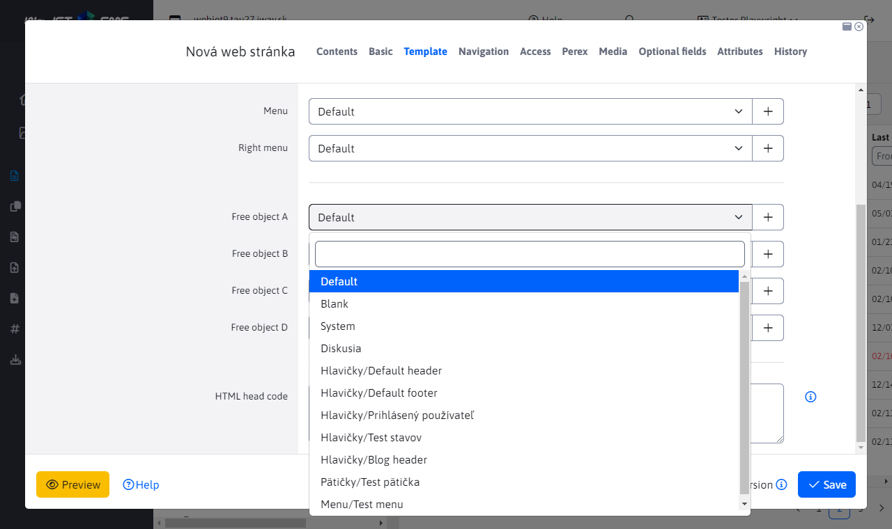

- Added new options for [automatically generating a page URL](redactor/webpages/editor/README.md#url-address) based on the Name of the menu item (when moving to another folder, the URL address will automatically change), or the option to automatically inherit the beginning of the URL address from the folder (when moving to another folder, the beginning of the URL address will automatically change) (#54237).


**Responsive version**

Completed generic version of the administration for [mobile devices](redactor/admin/README.md). At a width below 1200 points, the left menu and header will be hidden, accessible by clicking on the hamburger menu.


At a width of less than 992 points, the editor window is displayed at the full size of the window, at a width of less than 576 points, the field names are moved above the field.


**Optional fields**

Added [multiple-choice-select-field](frontend/webpages/customfields/README.md#multiple-choice-select-field) option by prefixing the ```multiple:``` list of possible values. The values ​​are then stored in the field separated by the ```|``` character.


**Introduction**

- For ease of use, changing the domain on the Home page does not require confirmation (the domain will change immediately).

**Configuration**

- Added import and export of configuration according to version 8, in which it is exported to XML format and imported with a comparison of existing values.
- Fixed cell editing, added the ability to edit the value.
- Fixed display of original value and description after changing value.

**Table data**

- Added a new data field type for numeric fields of type ```select``` with the option to [edit or add a record](developer/datatables-editor/field-select-editable.md) to the selection field. They allow you to easily edit the object that is selected in the field, such as a page template, a link to the header page, and the like.


- Added conflict notification - if another user has an editor window with the same record open, a notification will appear with a list of other users. It will appear when the window is opened and will be checked every minute thereafter.


- Added the ability to insert ```tooltip``` to fields in the editor with formatting using [Markdown format](developer/frameworks/webjetjs.md#markdown-parser). For security reasons, it is not possible to insert links and other than basic Markdown tags.
- The translation key for the tooltip is automatically searched for by the translation key ```title``` with the suffix ```.tooltip```. So if you have an annotation ```@DataTableColumn(title = "group.superior_directory"```, the translation text with the key ```group.superior_directory.tooltip``` is automatically searched for. If it exists, it is used.
- Fixed searching by dates in tables with client paging and some columns not being displayed (incorrectly specified column index).
- Added option to set [status icons](developer/datatables/README.md#status-icons), removed original option to add icons to the link to open the editor using the ```addTextIcon``` function (this was inappropriate from a UX point of view).

**Deployment**

Modified deployment to artifactory server. Added task ```ant/build.xml``` to ```createUpdateZip```, which creates and uploads to the license server an update in the format used for the transition to the ```gradle``` version. This makes it easy to update older WebJET installations in the classic way via the Control Panel->WebJET Update menu (#54225).

Edited and compared archives to old version 8 so that they contain all necessary files. Added missing fonts for the ```pd4ml``` library for generating PDF files.

To allow the update to version 2021, please contact [InterWay sales department](https://www.interway.sk/kontakt/).

Warning: Due to the large number of changes in the jar libraries, it will be necessary to restart the application server during the upgrade. Please make sure that you have technical support available for the restart before upgrading.

**Documentation**

- Added documentation for saving the [working version of the website] (redactor/webpages/README.md).
- Pre-generated screenshots of website documentation.
- Prepared basis for generating [JavaDoc documentation](../javadoc/index.html). Modified ```docsify``` for opening JavaDoc documentation in a new window.
- Web pages - supplemented documentation for [API programmer](developer/apps/webpages/api.md).
- Documentation of [main controls](redactor/admin/README.md) administration and [login and logout](redactor/admin/logon.md) created.
- Documentation created for [editable select field](developer/datatables-editor/field-select-editable.md).
- Added documentation for the [WJ.openIframeModal](developer/frameworks/webjetjs.md?id=iframe-dialog) function for the option to set the button text, the position of the close button, and the ```onload``` event executed after loading the modal window content.
- Added documentation for the [WJ.hasPermission(permission)](developer/frameworks/webjetjs.md?id=kontrola-práv) function for checking user rights.
- Added documentation for the [WJ.parseMarkdown(markdownText, options)](developer/frameworks/webjetjs.md#markdown-parser) function for converting Markdown format to HTML code.
- Reworked icon settings documentation to use [status icons](developer/datatables/README.md#status-icons).
- Updated the editor's manual with the applications [Menu](redactor/apps/menu/README.md), [Navigation bar](redactor/apps/navbar/README.md) and [Sitemap](redactor/apps/sitemap/README.md).
- Documentation has been created on the options for generating page URL addresses [automatic page URL generation] (redactor/webpages/editor/README.md#url-address).

**Tests**

- Websites - new tests added for saving a working version, notifications when setting an existing URL address, notifications when changing a link on a page (when renaming a page address), notifications when publishing with a specified start date, verification of the time of publication of a website.
- Created function ```DTE.fillCkeditor(htmlCode)``` to insert HTML code into the currently displayed CKEditor.
- Added test for a selection field with the option to edit, as well as a test for an error in restoring selection field data after saving (the value of the fields could not be changed).
- Websites - added search test by status icons.
- Website - added test of rights to individual functions (add, edit, delete) and rights to individual directories (#54257).
- Websites - added URL address setting test (#54237).

**Bug Fix**

- Fixed display of data table settings.
- Templates - added Empty option for header/footer/menu fields.
- Fixed displaying help texts for buttons in the gallery, data deletion and user groups.
- Datatables - loading data when duplicating a record during server data loading (reloading all data before duplication).
- Websites - fixed loading of records from history and from the Last modified tab.
- Web pages - fixed setting of empty value in field ```password_protected``` (character ```,``` was being stored incorrectly).
- Datatables - fixed updating of a record from the REST service when selecting multiple rows or when duplicating records.
- Corrected display of help texts (tooltips) for buttons in the website directory properties and in the gallery, data deletion, user groups applications.
- Fixed the display of the filter in the page title in server monitoring and in the GDPR application.
- Fixed highlighting of all rows during client paging - only the current page is highlighted (#54281).


## 2021.47

> Version 2021.47 adds revised Tooltip, Data Export, Bulk-email/Domain Limits, and Banner System applications to the new design. We've added approval notifications when saving a page and improved the mobile version.

**Applications**

- Tooltip - administration adjusted to new design, added [editor documentation](redactor/apps/tooltip/README.md).


- Data export - administration adjusted to new design, supplemented [editor documentation](redactor/apps/export/README.md).


- Mass email - Domain limits - administration adjusted to new design, supplemented [editor documentation](redactor/apps/dmail/domain-limits/README.md).


- Banner system - administration adjusted to new design, supplemented [editor documentation](redactor/apps/banner/README.md).


**Website**

- Added notification when publishing a page that is subject to approval and notification if the page has pending/unapproved changes.


- In the editor, in the History tab, the currently published version of the page is highlighted in bold.

**Table data**

- Modified copying of attributes of an existing entity when editing it. By default, not all attributes of an entity may come from the editor, therefore, before saving, the values ​​of the existing entity and the data sent from the editor are combined. By default, all non-```null``` attributes are overwritten. However, this does not allow entering an empty date (if it has already been set once). Therefore, attributes annotated with DataTableColumn type ```Date``` are transferred even if they have a ```null``` value.

**Responsive version**

- Improved login screen display on mobile devices.
- Adjusted the display of the dialog box in the mobile version - the window is full height, the tabs are the entire width of the window, the footer is lower to maximize space.
- On web pages in the editor, you can swipe the editor buttons to access all editor buttons.
- Canceled wrapping of buttons in the data table to the second line, now they simply do not appear.
- Adjusted display of search tags in the table - moved from the location behind the buttons to a new line below the buttons.

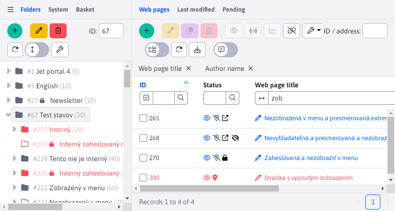

**Security**

- Documentation created for [setting permissions and resolving security findings](sysadmin/pentests/README.md) from security/penetration tests. The documentation is located in the Operations Manual section and it is advisable to check the settings when launching the website/application into production and subsequently with each major change, at least once a quarter.
- JavaScript libraries updated to the latest versions, fixing all vulnerabilities in these libraries. Bootstrap library updated from version 4 to version 5 (#54169).

**Documentation**

- Documentation created for [sending notifications from REST service](developer/datatables-editor/notify.md) datatable.
- Created documentation for the [Tooltip application](redactor/apps/tooltip/README.md) for the editor.
- Created documentation for the [Data Export application](redactor/apps/export/README.md) for the editor.
- Created documentation for [Bulk Email - Domain Limits application](redactor/apps/dmail/domain-limits/README.md) for the editor.

**Bug Fix**

- Fixed cache update ```TemplatesDB``` when saving a page in the local (domain) System directory.


## 2021.45

> Version 2021.45 brings the display of the website list also from subdirectories, improves the display of the administration on mobile devices and adds the Q&A application. In addition, it contains many changes under the hood when working with the website list (switch to server-side paging and search, use of Spring DATA for database access).

**Website**

Added the ability to display web pages from subdirectories by switching the **Display pages from subdirectories** switch in the data table header. After switching to the display mode for pages from subdirectories, pages from the currently selected directory will be displayed in the tree structure, including its subdirectories. You can click on another directory in the tree structure, which will cause pages from the selected directory and its subdirectories to be displayed again.


- REST service for getting a list of pages redesigned to use Spring DATA repositories.
- Enables server paging and searching, which is useful when there are a large number of pages in the directory.
- The ```DocBasic``` class was created, which contains common data between the ```documents``` and ```documents_history``` tables and the subsequent classes ```DocDetails``` and ```DocHistory```. The ```DocDetails``` class is backward compatible with WebJET version 8, even though we converted primitive types to objects (this mainly concerns date objects that use ```publishStartDate, publishEndDate, startDateDate``` names due to name collisions). [Inheritance in JPA entities](developer/backend/jpa.md#inheritance-in-jpa-entities) is used.
- Access tab divided into user group section - access for registered users and groups for mass email, similar to what is done in users.
- Editor - added setting for the Formatting styles selection field according to the currently displayed page/template.
- Editor - added floating toolbar for object properties in the editor (e.g. images, tables, forms).

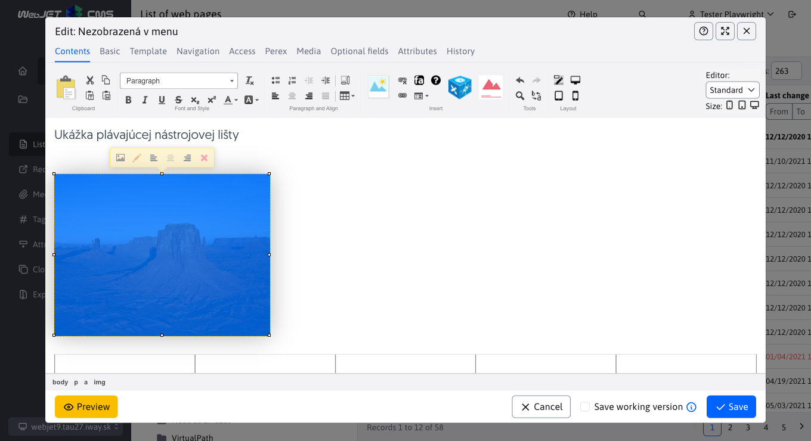

**Responsive version**

We have started work on optimizing the administration for mobile devices. The standard elements work thanks to the use of the ```bootstrap``` framework, but several details needed to be debugged/fixed.

- The editor dialog is expanded to the full screen size on mobile phones. In portrait mode, field names are above the field (not on the left as in standard view), the gray background of field names is hidden. The window header and footer are lower (#54133).
- Fixed clicking on hamburger menu in mobile version (#47428).
- Fixed indentations on the home page (#47428).
- Fixed domain selection field (#54133).

**Applications**

- [Questions and Answers](redactor/apps/qa/README.md) adapted to the new administration design and added the option to set [optional fields](frontend/webpages/customfields/README.md).

**Multiple Domain Data Management**

We have added a system to the REST interface of data tables to support data management across multiple domains (for example, when the Questions and Answers application in a multi-domain installation always only displays questions and answers from the currently selected domain).

Usage is simple by extending the Spring DATA repository from the ```DomainIdRepository<T, ID>``` class, the rest is taken care of directly by ```DatatableRestControllerV2```. More information is directly in the [Domain Data Unit] documentation (developer/datatables/domainid.md).

**Table data**

- Following the example of web pages, an ID field with [ID of the currently edited record] has been added to the header of each datatable (developer/libraries/datatable-opener.md). The ID is also set to the URL address in the browser as a parameter, after refreshing the page with the parameter ```?id=xxx``` the specified record will automatically open in the editor dialog box. The value can also be entered into the ID field in the header and after pressing the enter key the record will be searched and displayed. The current version searches for the specified ID by successively paging through the datatable, this is not suitable for datatables that have a large number of records (the search limit is 30 pages).

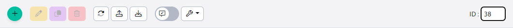

- Redesigned search when using Spring DATA repository of type ```JpaSpecificationExecutor```. In this case, the search is created based on ```HTTP request``` parameters starting with the expression ```search```. ```ExampleMatcher``` is no longer used, but the search expression is built based on the parameters. This has the advantage that primitive or non-primitive attributes can also be used in the object (which would be automatically included in the search in the case of ```ExampleMatcher```).

**General**

- Added JS function ```WJ.htmlToText``` for converting [HTML code to text](developer/frameworks/webjetjs.md#other-functions).

**Security**

- Added new JPA converter ```AllowSafeHtmlAttributeConverter``` to remove [unsafe HTML code](developer/backend/security.md) from input fields.

**Bug Fix**

- Web pages - fixed loading and saving of a page that is in multiple directories.
- Web pages - fixed duplicate call to load list of web pages during initialization (unnecessary REST service call).
- Datatables - fixed display of the Edit cell switch in a nested table in the editor.
- Datatables - fixed icon duplication even in a cell and reopening a table that does not contain multiple tabs.
- Datatables - fixed setting and obtaining HTML code when using the ```QUILL``` field (implemented in ```app-init.js```).
- Datatables - fixed display of filters after adding columns to a table via its settings.

**Deployment**

We have modified the process of compiling artifacts for the new version. In this version, all Java classes are recompiled from the [source code of the original WebJET](developer/install/deployment.md) 8 and the source code of version 2021. In the new version, we sometimes modify Java classes from the original version 8, which can lead to incompatibility with the old API. Therefore, a complete compilation of Java classes occurs, which prevents or detects API incompatibility.

**Tests**

- Updated CodeceptJS to version 3.1.3 and Playwright to version 1.16.3. There was a change in the behavior of the window (```BrowserContext```) that opens anew for each scenario (it has a new ```BrowserContext```) and it was necessary to modify several tests (mainly the gallery where the / character is used in the ID selector, which needs to be correctly escaped with a backslash).
- Modified automated testing of data tables - the ```createSteps``` and ```editSteps``` functions are called before setting required fields.
- Created function ```DTE.fillField(name, value)``` to fill a standard field according to its name in the backend/json definition.
- Created function ```DTE.fillQuill(name, value)``` to fill in a value in a field of type ```QUILL```.
- Created a test for the question and answer application.
- Added test for filtering web pages by ``boolean`` and ```password_protected``` columns.
- Web pages - created test ```webpage-spring.js``` for the version with server paging.
- Web pages - added tests to ```webpages.js``` to display web pages from subdirectories.

**Documentation**

- Created a new section [Backend/Security](developer/backend/security.md) in the developer documentation.
- Created documentation for [editor opener](developer/libraries/datatable-opener.md) according to the ```id``` parameter in the URL.
- Created a base of security documentation. It currently contains information about [unsafe HTML code](developer/backend/security.md).
- Documentation created for [domain data table](developer/datatables/domainid.md).
- Improved example of using [optional fields](developer/datatables-editor/customfields.md) in the editor using the ```BaseEditorFields``` class.
- Documentation created for the possibility of using [inheritance in entities](developer/backend/jpa.md#inheritance-in-jpa-entities).


## 2021.40

> Version 2021.40 brings redesigned user, group and rights group management and a redesigned GDPR application to the WebJET 2021 visual. In addition, it adds a number of minor improvements and fixes.

**Users**

- [User list](admin/users/README.md), [user groups](admin/users/user-groups.md) and [perm groups](admin/users/perm-groups.md) converted to data table and REST interface.
- Added [highlighting of rights groups](admin/users/README.md) in individual rights. It highlights rights in a rights group using colored circles, so you can identify the rights that the group contains at a glance.


- Added icons for individual rights up to level 3.
- Optional fields in users [can be configured](developer/datatables-editor/customfields.md) similarly to web pages using ```user.field_x.type``` translation keys.
- If the user does not have a registration date set (for historical reasons), this date will be set to the current one when saving (#53985).

**GDPR**

- Redesigned the [Regular Expression Management] section (redactor/apps/gdpr/regexps.md) to the 2021 version design (#53905).
- Redesigned the [Cookie Manager] section (redactor/apps/gdpr/cookiesmanger.md) to the 2021 version design (#53881).
- Redesigned the [Data Deletion] section (redactor/apps/gdpr/data-deleting.md) to the 2021 version design (#53985).
- Redesigned the [Search] section (redactor/apps/gdpr/search.md) to the 2021 version design (#53989).


**Translation keys**

- The translation value field is no longer mandatory due to the option to enter an empty value.

**Custom applications**

- Created a basis for [creating custom applications](custom-apps/admin-menu-item/README.md). They are created in the ```/apps/``` directory, unlike the old version from the ```/components/``` directory (#54045).
- Applications are inserted into the design [directly from the html code](custom-apps/admin-menu-item/README.md#frontend), there is no need to create and compile pug files.
- Created function [WJ.breadcrumb](developer/frameworks/webjetjs.md#navigation-bar) for generating navigation bar.
- It is possible to insert a language selection field into the navigation bar using the macro ```{LANGUAGE-SELECT}```.

**Export and import**

- Modified data export and import from/to datatable to use columns from the editor (compared to the original version which used columns in the table). The editor usually contains more columns than the table and these are needed for correct data import (#54097).
- Lists of directories/pages/directories on the filesystem that use the field type ```json``` are also exported. They are both exported and imported in full path view (e.g. ```/Slovensky/Novinky```).
- Documentation created for both [programmer](developer/datatables/export-import.md) and [editor](redactor/datatables/export-import.md).


**Translator**

WebJET integrates the [text translation](admin/setup/translation.md) option, currently the [DeepL](https://www.deepl.com/) translator is supported. Automatic translation is supported in the [structure mirroring](redactor/apps/docmirroring/README.md) application.

**Website**

- Added the ability to force [restore the tree structure](developer/apps/docmirroring.md) by setting the ```RequestBean.setAttribute("forceReloadTree", Boolean.TRUE);``` attribute.
- Added display of the text "Processing" when using drag&drop in the tree structure (which may take several seconds when using structure mirroring).
- Objects ```DocDetails``` and ```GroupDetails``` have been supplemented with an annotation of the attribute ```fullPath``` with the full path to the web page/directory. It is not displayed by default, but it can be enabled in the data table settings.

**Forms**

- For forms containing more than 5000 records (adjustable in the conf. variable formsDatatableServerSizeLimit), server processing is used.
- Search - in server processing, only the "Starts with" search is supported, other options are removed from the table header, searching in a maximum of 6 columns at a time is supported.
- Search - added option to combine search by date and by value in a column.
- Both the list and the form detail are sorted by date of last form completion by default.
- Modified link to form detail according to design manual.
- Search in a maximum of 6 columns at a time is supported.
- Fixed column order according to form definition (previously columns were displayed in random order).

**Table data**

- Added JPA converter ```DocDetailsConverter``` and ```DocDetailsNotNullConverter``` between ```doc_id``` in the database and the ```DocDetailsDto``` object for easier use of JSON type field for page ID selection. Converter ```NotNull``` returns the value ```-1``` for the ```NULL``` object.
- Added JPA converter ```GroupDetailsConverter``` between ```group_id``` in the database and the ```GroupDetails``` object for easier use of JSON type field for directory ID selection.
- For the JSON type field [for selecting a single page or directory](developer/datatables-editor/field-json.md#options-classname) added the option to delete the set value by setting the field type to the value ```dt-tree-group-null``` for a directory or ```alebo dt-tree-page-null``` for a web page.
- Added option ```null``` for JSON type field ```Group/DocDetails``` object. The original version for ```null``` object did not even display the field for selecting a directory/page, the new version displays an empty field.
- Added [title settings](developer/datatables-editor/datatable-columns.md#datatablecolumneditor-properties) option before a nested datatable on a separate tab by setting the ```data-dt-field-full-headline``` attribute.
- Added option to [force column display](developer/datatables/README.md#configuration-options) (e.g. for a nested datatable) by setting configuration option ```forceVisibleColumns```.
- Added the ability to call a JavaScript function for [editing the column list](developer/datatables/README.md#configuration-options) (e.g. for a nested datatable) by setting the ```updateColumnsFunction``` configuration option.
- Added option [add CSS style to tab switcher](developer/datatables-editor/README.md#tabs-in-editor) in the editor with the ```className``` attribute, using the ```hide-on-create``` CSS style it is possible to hide the tab when creating a new record.
- Added option [hide tab based on rights](developer/datatables-editor/README.md#tabs-in-editor) in the editor with attribute ```perms```.
- Added method ```public void afterSave(T entity, T saved)``` to class ```DatatableRestControllerV2``` called after saving the entity (object ```entity``` is the original sent object, ```saved``` is the saved version - for a new record, ```ID``` is only found in the ```saved``` entity).
- Added method ```public void afterDelete(T entity, long id)``` to class ```DatatableRestControllerV2```, called after entity deletion.
- Added a field of type ```jstree``` for displaying [tree structure](developer/datatables-editor/field-jstree.md) with tree node selection fields.
- Field type ```json``` extended with the option [to select a list of file system directories](developer/datatables-editor/field-json.md).
- Added fields ```HIDDEN, RADIO, PASSWORD``` for ```DatatableColumnType```.
- Simplified process of working with [additional/nested attributes](developer/datatables-editor/datatable-columns.md#nested-attributes), ```editorFields``` in REST controller. By implementing methods ```processFromEntity``` and ```processToEntity``` you will ensure correct data mapping between entity and ```editorFields``` object.
- Import - added conditions for ```domainId``` so that only the records of the current domain are updated during import.
- Import - modified import with matching records according to the selected column to use APIs ```insertItem``` and ```editItem``` so that import also works for REST interfaces not using Spring DATA repositories.
- Import - modified dialog box to display an error message from the server when an import error occurs.
- API - added method ```getOneItem(long id)``` for getting one item. Use it instead of the original ```getOne``` which is a REST method (overriding REST methods is not recommended).
- Fixed design errors in select fields when hovering over and showing a hidden column.
- Added the option to [show HTML code](developer/datatables/README.md#show-html-code) in a cell by setting the CSS style ```allow-html``` (#53989).
- When calling ```getAllItems```, the ```serverSide``` option is automatically detected (based on the URL parameter ```size```). If it is not detected, the ```repo.findAll()``` call without the ```Pageable``` parameter is used to return all records.
- The display of the filter for entering a date is adjusted to the size - if the field is empty, it is narrow so as not to unnecessarily take up the width of the column, after entering a value, the field will automatically increase in size. The size of the fields is also different for date and date+time fields (#54097).
- Added loading of all row data from the server before editing a cell, because the data table itself may not always contain all the data needed for the editor (#54109).

**Security**

Integrated password quality check. It uses the [zxcvbn-ts](https://zxcvbn-ts.github.io/zxcvbn/) library, which evaluates password quality based on multiple parameters. In addition to standard rules such as **password length**, **capital** letters, **special** characters, it also checks the password for:

- sequence of characters on the keyboard, e.g. ```asdf```
- dates and years
- repeating sequences of type ```abcabc```
- common names and surnames
- known passwords like ```password```

The library has a **built-in dictionary of the most commonly used passwords** and names against which it checks the password.

The check is implemented in the administration when creating/editing a user, but also on the login page in the administration, where it informs the user about the quality of the entered password.


REST datatable interfaces modified to use the ```ThreadLocal``` object, which holds local information (e.g., that this is a data export) to avoid overwriting information between multiple requests.

**Usability Improvement**

- Adjusted the position of the dialog box for setting columns and the number of records per page in the data table (position 5% from the top, similar to the editor). Adjusted the double display of background darkening.
- Increased the size of the column settings dialog box for 4-column display, added options to display 1000 and 2000 records per page.
- Redesigned the Edit Cell icon to a scrollable field for better status display.
- Adjusted ```hover``` states in selection fields and date and time selection.
- Renamed some names to better reflect reality (configuration, redirects, template groups).

**Tests**

- Created tests for the structure mirroring application.
- Adjusted timing of several tests (correct execution waits instead of fixed waits).
- Added function ```I.getRandomTextShort()``` to get a shorter random string (in the form of mmddrnd).
- In the automated data table test, column display validation has been modified (only columns with the ```visibleOriginal=true``` attribute set are validated, i.e. only those displayed in the standard view).
- Added [automated import testing](developer/testing/datatable-import.md) option from Excel to datatable.

**Documentation**

- Documentation for [translator](admin/setup/translation.md) created.
- Documentation on user rights created - [for administrator](admin/users/README.md), [for developer](developer/apps/users/README.md).
- Documentation for [jstree field type](developer/datatables-editor/field-jstree.md) created.
- Added documentation on the possibility of extending the ```json``` type field with a [custom version](developer/datatables-editor/field-json.md#custom-configuration-of-displayed-tree-structure) jsTree structure.
- Supplemented documentation [Definition of done](developer/guidelines/definition-of-done.md) with conditions for testing export and import of data tables.
- Created documentation for [user list](admin/users/README.md), [user groups](admin/users/user-groups.md) and [permission groups](admin/users/perm-groups.md).

**Bug Fix**

- Datatables - corrected setting of optional fields when creating a new record.


## 2021.26

**Table data**

- Added option ```onRowCallback``` for [row styling](developer/datatables/README.md#row-styling) option on the client side (e.g. marking a row as inactive).
- Added the ability to set the [default value](developer/datatables-editor/datatable-columns.md#datatablecolumn-properties) when creating a new record using the ```defaultValue``` attribute of the ```@DatatableColumn``` annotation. Macros are also supported for setting the currently selected domain or date and time.

**Tests**

- Added the option to generate [allure](developer/testing/README.md#generate-html-report) reports.

## 2021.24

> Version 2021.24 adds the ability to duplicate records in data tables, automatic opening of root directories if the domain contains, for example, only the Slovak and English directories (max. 2 directories), allows for bulk editing on websites, and improves work comfort in several places.

**Website**

- Domain name renaming added with the option to automatically rename the domain prefix in translation keys and configuration variables with the old domain prefix.
- If the tree structure contains a maximum of 2 directories (adjustable in the webpagesTreeAutoOpenLimit configuration variable), they will automatically be displayed open for more convenient work (#53805).
- In the parent directory selection window, the root directory is automatically opened for a more beautiful and convenient display.
- If a local ```System``` directory exists for the current domain, the global ```System``` directory will not be displayed in the tree structure (e.g. when selecting the parent directory of a page).
- Modified initial page list loading - page list for the first directory in the tree structure is displayed.
- When the domain ```System``` directory is automatically created (configuring the ```templatesUseDomainLocalSystemFolder=true``` variable and saving the root directory), the Headers, Footers, and Menu subdirectories are also automatically created.
- Use of ckeditor modified to standard [datatables data field](developer/datatables-editor/field-wysiwyg.md).
- When editing multiple rows, ckeditor now behaves like a standard datatable field and allows you to keep separate HTML code/text for individual rows, or set the same HTML code/text for all selected rows.

**Gallery**

- Tree structure modification converted from VUE component to data table following the web page model (#53561).
- Added options to pre-generate images and Apply to all subfolders to directory properties (#53561).
- When deleting a tree structure directory, the files on the disk are also deleted.
- Fixed re-sending of edited photo data from image editor.
- Fixed saving an image from the image editor (badly initialized save directory).

**Table data**

- Added functionality for duplicating records in a table. Added purple Duplicate button to the toolbar. It is possible to select multiple rows at once.

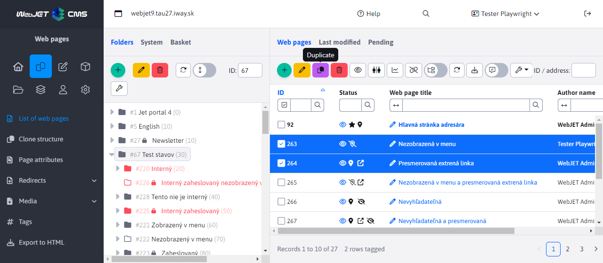

- Added option to restore displayed columns to original settings from server. User settings will be deleted and original column visibility will be restored.
- Added the ability to open the help in the editor by clicking on the question mark icon in the footer of the dialog window.
- Added highlighting of mandatory fields using the * character.
- When checking required fields, a message is also displayed next to the save buttons. It may happen that a required field is in a different tab than the one currently displayed and the user did not know why nothing happened after clicking save. This way, a visible error message is always displayed.
- Reworked field validation using annotations to [translation keys from WebJET](developer/datatables/restcontroller.md#validation--mandatory-fields). Modified displayed error messages to the format "What caused the error. What should the user do".

**Tests**

- Added test for expanding the first level of the directory structure.

**Documentation**

- Added description of data types and required fields for [datatable annotations](developer/datatables-editor/datatable-columns.md).
- Documentation for the data field [wysiwyg](developer/datatables-editor/field-wysiwyg.md) has been created.
- Added documentation for marking [required fields](developer/datatables-editor/datatable-columns.md#required-fields) in annotations.
- Extended documentation on [validations using annotations](developer/datatables/restcontroller.md#validation--required-fields).

**Bug Fix**

- Datatable - For selection fields that have options defined directly in the JSON definitions, the options are transferred directly to the filter selection field.
- Redirects and Domain Redirects - removed unnecessary items for adding a record in the menu, adjusted the display so that the editing option is only in the second column, as is standard everywhere.
- Server monitoring - fixed default chart range to last 14 days.
- Datatable - fixed highlighting of marked rows after saving if the received data contains a row CSS style setting - both ```selected``` and ```highlight``` CSS style will be preserved.


## 2021.20

> Version 2021.20 adds display and configuration of [optional fields](frontend/webpages/customfields/README.md) for the website and site directory and adds (finally) a button to display the website in the datasheet toolbar.

**Optional fields**

We have implemented universal optional fields functionality (originally called Custom Fields in WebJET 8) into web pages and web directories (directories were not able to assign field types in WebJET 8). This makes it easy to set up different field types in web pages and directories.


We have prepared documentation with information about [custom field settings](frontend/webpages/customfields/README.md) for the frontend programmer and documentation with [technical information](developer/datatables-editor/customfields.md) for the backend programmer.

**Website**

- Added a button to the datasheet toolbar to display a web page. It is also possible to select multiple rows and display the selected web pages in new sheets at once.

**Documentation**

- Optional fields - information about [setting optional fields](frontend/webpages/customfields/README.md) for the frontend programmer.
- Optional fields - [technical information](developer/datatables-editor/customfields.md) for backend programmer.
- Testing - screenshots - added information and example with [the option to set CSS styles](developer/testing/screenshots.md?id=Edit-css-styles) before taking a screenshot.
- Added documentation for WebJET JS functions - [File/Link Selection Dialog](developer/frameworks/webjetjs.md?id=dialog-for-file-selection-link).

**Tests**

- Optional fields - added basic test of displaying optional fields on the web page and in the web page directory.
- Translation texts - added test for checking module rights and rights to Edit texts - display of all texts.

**Bug Fix**

- Web pages - corrected use of API function ```wjEdit```, added function ```wjEditFetch```, which also refreshes data from the server. Modified automatic opening of the page according to the specified ```docid``` URL parameter for use of function ```wjEditFetch``` to obtain a list of free fields.
- Translation keys - added control of rights to change the translation key, fixed duplication of the key after change.
- Translation keys - added invocation of key changes in the internal cache and in the cluster cache.
- Translation keys - added check and test for legality. Text editing - display of all texts.


## 2021.18

> Version 2021.18 automatically creates a [domain](frontend/setup/README.md), ```System``` folder, adds editing of [tags](redactor/webpages/perexgroups.md) (perex groups), improves cell editing behavior, and fixes a bug with displaying numeric values ​​in the data table. The administration uses a new font ```Asap```.

**Website**

- Added automatic creation of ```System``` folder when saving domain root directory in mode with ```templatesUseDomainLocalSystemFolder=true``` configuration variable enabled (#53685).
- In the list of headers, footers, menus and free objects in the website and template, in ```templatesUseDomainLocalSystemFolder=true``` mode, web pages from [first level subfolders](frontend/setup/README.md) are also displayed for the possibility of their organization (#53685).
- Editor - added automatic deletion of the text New website in the page title after clicking in the field. Automatic transfer of the value to the Menu item name field and deletion of the URL address if it contains the phrase New website.
- Template groups - modified folder list - the complete contents of the ```/templates``` folder are displayed, while in folders starting with the (log)installation name, the installation name is automatically removed from the value (it is then added by ```combine.jsp```, but the value is stored in the database without the installation name).

**Brands (perex groups)**

- Added ability to add/edit/delete [tags (perex groups)](redactor/webpages/perexgroups.md), available as a new menu item in the Web pages section (#53701).

**Data table**

- Cell editing - added the ability to edit [individual cells](developer/datatables-editor/bubble.md) directly in the datatable, even for the editor containing separate sheets (previously it only worked in the editor without sheets). Added the ability to set non-editable cells.

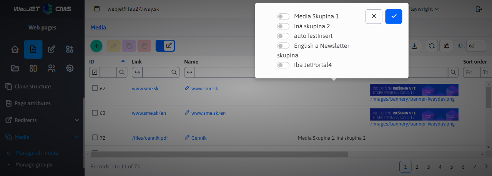

- Fixed the option to override the ```searchItem``` method in ```DatatableRestControllerV2``` for search. It is not recommended to directly override the REST method ```findByColumns```, as this causes an internal problem in Spring for customer projects (#53677).

**Administration**

- Changed font to ```Asap``` (#53689).

**Documentation**

- Added the first documentation for [frontend programmer](frontend/setup/README.md) with a description of WebJET setup when managing multiple domains and using a local ```System``` folder.
- Added basic documentation for [tags](redactor/webpages/perexgroups.md).

**Tests**

- Added test for automatic change and transfer of the New website value in the page editor title.
- Added test for editing tags (perex groups) and displaying them on the web page according to directories.

**Bug Fix**

- Web pages - fixed a possible JavaScript error if the initial data when displaying the list of pages contains a closing script tag.
- Web pages - fixed pre-generation of page URLs
- Datatables - fixed CSS cell class setting for date columns if they also have ```cell-not-editable``` set. Datatable apparently ignores ```className``` attribute in ```columnDefs``` if ```className``` is not empty. So the required value is already sent from the server.
- Datatables - refactored use of type ```TEXT_NUMBER``` to ```NUMBER``` for accurate display of numbers greater than 999. In ```TEXT_NUMBER``` mode, such values ​​are displayed rounded as ```2 tis.```.
- Text editing - fixed search in customer projects.
- Datatables - fixed display of numeric data in custom column list view (#53653).


## 2021.13

> Version 2021.13 improves the user experience by increasing the speed of displaying the list of web pages, the ability to enter a page ID or directory for its display (including remembering it in the browser URL), the ability to set the displayed columns in the data table, translations in JavaScript files, and many other improvements throughout WebJET.

**Optimizing display speed**

We have optimized [web page list display speed](developer/apps/webpages/README.md). We have minimized initial REST calls, which are replaced by inserting raw data directly into the HTML code of the page. When displaying the tree structure, there is no need to wait for the next server request to complete. We have also adjusted the order of loading JavaScript files to reduce CPU load (some files are loaded asynchronously only after the page list is displayed) (#53513).

- By default, only the basic columns are displayed in the data table of the website list, but you can enable the display of other columns through the table settings. However, the basic display significantly reduces the processor/browser load when rendering the table.
- Optimized page list loading - the media list and note field are not loaded unnecessarily (they are loaded only when the page editor is opened).
- In the hidden data table for editing the directory, just like for the web page, only the basic columns are displayed. Since this data table is hidden, there is no point in displaying all the columns and unnecessarily burdening the processor with its rendering.
- Data for the root directories of the tree structure is sent directly in the HTML code of the page without the need to call a REST service.
- Reworked directory loading when editing. The original version used the object returned for the tree structure ```jstree``` and called object refresh when editing a record. Technically, however, the data table did not retrieve the current items for the selection lists (```options```) according to the current directory - e.g. the same list of all templates was displayed everywhere. The modified version calls data table list refresh before editing a record, which also loads the current values ​​for the selection lists from the REST service.
- The first call to ```refresher-a``` is made up to 10 seconds after the web page loads.
- The library for importing data from ```XLSX``` is initialized only after the import dialog box is opened.
- We have optimized data loading in the nested data table - the data table (e.g. the Media or History sheet in the page list) is initialized and loads data from the REST service only after clicking on the given sheet. If the user does not need to display media or history, the REST service does not need to be called unnecessarily and from the processor's point of view the nested data table does not need to be initialized.

**Website**

- Added the ability to edit a page by specifying the page ID (```docid```) in the URL parameter or by entering it in the text field in the data table. The directory structure for the specified ID will automatically open and then the page editor will open. When entered via the URL parameter, the domain will also be set correctly in the domain selection field (#53429).
- Added the ability to enter the directory ID for editing by entering it in the text field or as a URL parameter.
- On the home page, the links in the My Recent Pages and Changed Pages lists have been modified to point to the page editor.
- Address book - added display of planned versions and address book history with the option to edit the record according to the historical/planned version.
- Added display of the Last Modified list (list of pages last edited by any user in the current domain) and Pending Approval list (only displayed if there are pages to be approved by the currently logged in user) (#53493).


**Administration**

- Added [publishing event](developer/frameworks/thymeleaf.md#insert-custom-objects-into-model), ```ThymeleafEvent``` when viewing the administration page. Allows you to dynamically insert objects into the page model.

**Translations**

Implemented framework for [translation of texts in JavaScript files](developer/frameworks/jstranslate.md). It consists of ```REST``` service providing translation key-text map and JavaScript library providing key-based translation. The library also ensures saving translation keys in browser memory and updating them when the translation text changes (#53128).

Fixed texts have been replaced with translation keys in JavaScript files ```index.js``` for the datatable and ```webjet.js``` for global functions.

During the implementation, several libraries were created for displaying logs in the browser console, accessing the ```storage``` browser object, and triggering events. By default, it is no longer possible to use the ```$(document).ready``` event, because the translation key store must first be initialized. We implemented our own function ```window.domReady.add```, which is executed only after the translation key store is initialized.

The entire translation system for JavaScript files is implemented as a library and can be easily used in other projects in the future (including, for example, in Angular/VueJS applications).

**Configuration**

- Added display of changes in the configuration variable in the History sheet, so changes do not need to be searched only in the audit, but are saved separately in the database for easy viewing.
- Added the ability to encrypt the value and plan to change the value in the future.
- Added Planning sheet to display planned changes, values ​​can be deleted in the future.

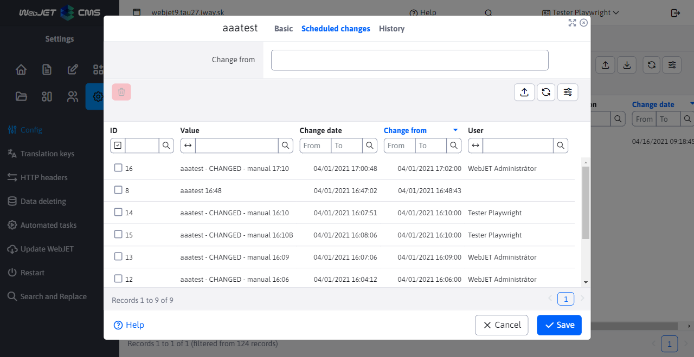

**Data tables**

- Added support for searching annotations also in the parent class ```Java beanu``` (e.g. if you are extending an existing class).
- Method ```DatatableRestControllerV2.throwError(String errorKey)``` modified to use translation keys (automatically translates the specified key into text), modified usage of the method in the current code (fixed texts changed to translation keys).
- Added support for inserting a nested data table in a sheet that already contains other fields. Adjusted the calculation of the data table height taking into account other fields. Reworked CSS indentations so that the nested data table can be from edge to edge and displayed a gray block under the field names.
- Added support for ```DATE``` fields, the original version only supported ```DATETIME```.
- Added option to automatically [hide some buttons](developer/datatables/README.md#configuration-options) in the datatable toolbar by setting the ```hideButtons``` option.
- Added the ability to use raw data directly from a variable instead of calling a REST service by setting the object to the ```initialData``` property in the datatable configuration.
- Generalized [username search]((developer/datatables/restcontroller.md#username-display-and-search)) when storing only IDs in the database.
- Added the ability to set a custom function managing the opening of the editor via the ```onEdit``` datatable configuration option.
- Added remembering of set columns in datatable view. The setting is saved in the browser and remembered there for the currently logged in user. (#53545)

**General**

- Added the option to use ```autocomplete``` also [outside datatables](developer/datatables-editor/autocomplete.md#use-outside-datatables).
- Added a new login screen to the administration (for clear distinction of WebJET 2021) (#53617).

**Tests**

- Tests modified for asynchronous initialization of data tables.
- Added test checking available templates for directory editing.

**Documentation**

- Documentation created for [translations in JavaScript files](developer/frameworks/jstranslate.md)
- Documentation created for new libraries [Translator](developer/libraries/translator.md), [StorageHandler](developer/libraries/storage-handler.md), [Store](developer/libraries/store.md), [Tools](developer/libraries/tools.md), [ReadyExtender](developer/libraries/ready-extender.md).
- Created documentation for [optimizing display speed](developer/apps/webpages/README.md) of the website list.
- Datatable documentation supplemented - [list of configuration options] (developer/datatables/README.md#configuration-options) supplemented.
- Documentation created for the option of [inserting custom objects](developer/frameworks/thymeleaf.md#inserting-custom-objects-into-model) into the model in ```Thymeleaf``` on the backend.
- Added documentation for the jstree library with information about inserting [initialization data](developer/jstree/README.md#configuration).
- Added documentation for raising a general error in a datatable if [preventing editing or deletion](developer/datatables/restcontroller.md#preventing-deletion--editing-a-record) a record.
- Added documentation for [displaying and searching by username](developer/datatables/restcontroller.md#displaying-username-and-searching) when storing only the ID in the database.
- Added documentation on the functioning of [list of web pages] (developer/apps/webpages/README.md) - display of sheets last modified and awaiting approval

**Bug Fix**

- Fixed display of template list when adding/editing website directory. Templates are now displayed conditionally according to the set directories (the original version displayed all templates everywhere).
- Fixed distribution version for other projects (Spring DATA repositories, missing files, updated dependency libraries).


## 2021.12

**Website**

- Added icon for importing and exporting pages in XML format according to the original functionality of WebJET 8 (#53497).

**Tests**

- Added test for displaying the icon for importing and exporting pages in XML format, including verification of opening the import window.

## 2021.11

> Version 2021.11 adds a view of the website history with the ability to edit, view and compare.

**Website**

- The History tab in the page editor has been enabled. It allows you to load a web page from history into the editor, view a page from history, and compare the current version to a historical version (#53385).


**Data tables**

- Added function ```$.fn.dataTable.Buttons.showIfOneRowSelected(this, dt);``` to display a button when exactly [one row] is selected (developer/datatables/README.md#add-remove-buttons).
- Extended configuration of [nested datatable](developer/datatables-editor/field-datatable.md) in the editor using Java annotations. Allows you to set the layout method or disable server paging.

**General**

- [mapstruct](developer/backend/mapstruct.md) version 1.4.2 set to the project.

**Documentation**

- Added new section WebJET CMS Programmer/Applications and Modules for developer documentation specific to WebJET CMS applications/modules/parts.
- Editor's manual supplemented with basic information on [page history](redactor/webpages/history.md).
- Added documentation for viewing [webpage history](developer/apps/webpages/README.md).
- Added documentation and example for mapping [DTO objects](developer/backend/mapstruct.md) via the ```mapstruct``` framework.
- Extended documentation for adding [datatable buttons](developer/datatables/README.md#addingremoving-buttons).

**Bug Fix**

- Audit - prevented deletion of audit rows on the REST service.
- Nested data table - added call ```deselect``` before loading new data of the nested data table to set the buttons correctly (disabled if they require a selected row).
- Fixed call ```TABLE.hideButton``` - ​​hides buttons only in a given table, not in all (added restriction on table ID when searching for buttons in the DOM tree).


## 2021.10

> Version 2021.10 fixes a dialog size bug in the page editor and fixes several grammatical errors in app descriptions.

**Website**

- Based on tests of working with the website, texts in the application list have been modified.
- Fixed setting the size of the dialog box when inserting application or form elements in the page editor.
- Fixed warning display when inserting a form into a page.
- Fixed setting of the Allowed value option when inserting a text field/area form element according to the set regular expressions in forms.

**Tests**

- Added tests for web content of a website (adding a table, find and replace, inserting an image, step back, inserting a special character).


## 2021.8

> Version 2021.8 adds **media management (files attached to a website)** and their groups. Compared to WebJET 8, it adds the ability to manage media separately with the ability to search for pages using a specific media, etc.

**Media**

- Added media and media group management (#52462).
- Integrated into the web page in the media tab as a nested data table (#52462).
- Added Media menu item with the ability to edit all media and manage media groups to the Web page menu.
- Added Media - manage all media right to display a list of all media with the ability to globally edit media (e.g. find all media referring to a specific link or image).


**Data tables**

- For a data field of type ```elfinder```, the ```change``` event is triggered after the value is set (for the possibility of listening to the change event).
- Modified obtaining the editor REST service address from a static call to a dynamic calculation by calling ```WJ.urlAddPath(DATA.url, '/editor')``` to allow changing the REST service URL address on the fly.
- Data table data field - added setting of the size and position of the header columns after displaying the data table card.
- Data table data field - enabled attributes ```fetchOnEdit, fetchOnCreate``` for data refresh when editing and adding a new record.
- Data table data field - added correct setting of the REST service URL when changing the parent object (e.g. when the page ID changes).
- elfinder data field - added calling of the ```change``` event after selecting a file in the dialog box.

**Security**

- Datatables - added display of error message when an error is returned from a REST service.

**General**

- ```PathFilter, WebjetSecurityService``` classes moved to WebJET 8.
- Audit - added audit record type ```ADMINLOG_NOTIFY``` for the list of notifications in the audit

**Tests**

- Added the option to programmatically [revoke rights](developer/testing/README.md#revoke-rights) for the currently logged-in user (applies only to the user with the login name ```tester```).
- Added [rights checks] option to automated datatable test (developer/testing/datatable.md#rights-testing).
- Added the option to test a nested datatable (data field datatable) using the ```options.container``` option to the automated datatable test.
- Modified tests for new database setup - multi domains, added audit record types, improved timing.
- Added test for using [CSRF token](../../src/test/webapp/tests/admin/security.js).
- Added function ```DT.checkPerms(perms, url)``` for [rights check](developer/testing/README.md#revocation-rights) of REST service calls.
- Added function ```I.jstreeNavigate(pathArray)``` for [gradual click](developer/testing/README.md#webjet-additional-functions) on specified names.
- Added tests for [media](../../src/test/webapp/tests/webpages/media-groups.js) and [media groups](../../src/test/webapp/tests/webpages/media-groups.js).

**Documentation**

- Added documentation for the [WJ.dispatchEvent] function (developer/frameworks/webjetjs.md#other-functions).
- Added documentation for the data field [datatable](developer/datatables-editor/field-datatable.md).
- Added documentation for [setting options](developer/testing/datatable.md#setting-options) of the datatable.
- Added documentation for the [revocation](developer/testing/README.md#revocation) option when testing.
- Added documentation basic documentation for [using Media](redactor/webpages/media.md) for the editor

**Bug Fix**

- Modal window - fixed setting of click events for modal window called via ```WJ.openIframeModal```. Since modal window is used for different addresses of embedded iframe it is necessary to dynamically set the function after click. The original version did not change it after setting and after closing the dialog and opening a new one the original ```click``` action was also called. This e.g. caused setting of a link from ```elfinder``` data field to multiple fields in the editor.
- Menu - fixed display of menu and active item when calling ```/admin/v9/``` address without trailing slash. URLs of menu items normalized with trailing slash.


## 2021.7

> Version 2021.7 adds server connection checking and error message display in case of connection error or security (CSRF) token error. We have enabled the System and Trash tabs on the website and added the first text of the editor's manual. We have checked the entire changelog for spelling.

**Configuration**

- Added value hint for Configuration Variable Name (#52999).
- Added addition of old value and description for newly added configuration variable (#52999).
- Modified the display of the warning about displaying only changed configuration variables to a standard toast notification that hides after 10 seconds.

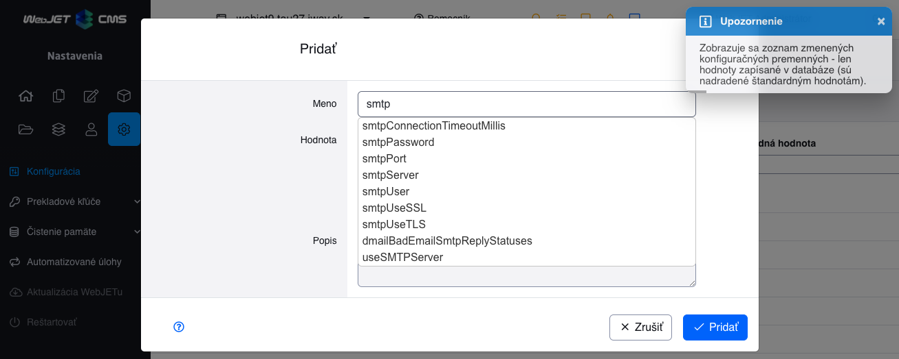

**Website**

- We have improved the visibility of the Editor's Note field - when loading a page that does not have an empty editor's note, a standard notification with the note text will be displayed. It is displayed for 15 seconds.

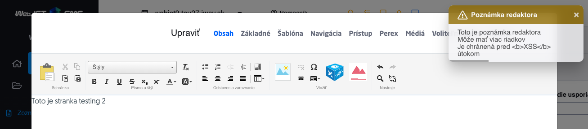

- We have enabled the System and Recycle Bin tabs and prepared the first text of the [editor's manual](redactor/webpages/README.md) describing the behavior of these tabs.
- The list of websites is filtered by the selected domain (only folders and websites from the currently selected domain are displayed)
- When creating a new folder, the domain is automatically set

**Datatables**

- Added option to add a hint/autocomplete to text fields
- We have adjusted the styling of the fields - they have indentation from the top and not the bottom, it is not necessary to have the indentation turned off on the last field (this can be hidden when editing, which caused the bottom indentation to be set incorrectly)
- Added scrolling of the first tab content when closing and reopening the window (#53119)

**General**

- We have added WJ functions for [date and time formatting](developer/frameworks/webjetjs.md#date-and-time-formatting) in JavaScript (#52999).
- We have added a system for maintaining a connection to the server and displaying an error message when the connection is interrupted and when the security token fails (#53119).
- Notifications - when hovering over a notification with a progress bar, the progress bar will restart after the mouse is released. (#53131)

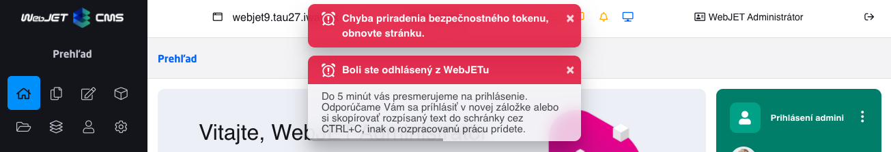

**Tests**

- Websites - added backdrop display error test (#53131).
- Website - added test for displaying editor's notes (#53131).
- Websites - added domain change test
- Website - added card test system and basket
- Configuration - modified test to use waitFor instead of fixed wait, modified expression generation to standard I.getRandomText
- Configuration - added test for editing a variable after adding it and editing it immediately after editing (without refreshing the window), the backend did not set the record ID correctly and an error occurred
- Scripts, Web pages - modified to use the Test status directory instead of test23

**Documentation**

- Added documentation for [whisperer/autocomplete](developer/datatables-editor/autocomplete) text fields
- Added documentation for CSS classes [disable-on/hide-on](developer/datatables-editor/README#columns-object-configuration-options) for the editor
- Added documentation for maintaining [connection to the server](developer/frameworks/webjetjs.md#maintaining-connection-to-the-server-refresher) (#53119)
- Added formatting of command line examples (shell formatting used)
- Added documentation for [screenshot generation](developer/testing/screenshots.md) for documentation
- We have created a base of [definitions of terms/expressions used](developer/guidelines/terms.md) so that the same terminology is used everywhere
- We added a spell check extension to VS Code and checked the spelling in the changelog.md file

**Bug Fix**

- Datatable-editor - fixed inserting a line (```data-dt-field-hr```) for an editor without tabs (sheets) - when opening the editor for the second time, the dividing line was not displayed (#52999).
- Datatable-editor - fixed hiding of backdrop (darkened background) when opening and closing windows of different editors (e.g. in web pages editing directory and then web page) - with a certain combination the backdrop did not hide and the window could not be used anymore. The original version used hiding via removing CSS styles, the fixed version uses modal API. (#53131)
- Notifications - fixed displaying the notification progress bar (CSS transition was causing anomalies). (#53131)
- Configuration - fixed error when adding and subsequently editing a configuration variable (#53137)
- Websites - fixed domain switching functionality in the administration header


## 2021.5

> Version 2021.5 continues to fix bugs. We focused on automated tests in the website section, and summarized our experiences in a new Best practices section in the testing documentation.

**Website**

- Transferred changes in form editing from WebJET 8 - use of Bootstrap CSS classes for forms and tables.
- After deleting a directory, the content of the root directory is loaded into the list of web pages (the list of pages of the deleted directory will not remain there).
- Not yet functional tabs System, Trash, Last modified marked in yellow (as TODO).
- Added jquery-ui-autocomplete.

**Tests**

- Speeding up test execution - tests remember cookies between scenarios, user login does not have to occur before each scenario.
- We have modified the name generation for tests, they use the unified I.getRandomText() function to obtain a unique string.
- Updated CodeceptJS version to version 3.0.5, deleted and regenerated package-lock.json to load new versions of all dependencies

**Documentation**

- Added [Best practices](developer/testing/README.md#best-practices) section for testing.

**Bug Fix**

- Website - corrected errors in texts (diacritics, typos) (#52639).
- Web pages - fixed creating a blank page (#52639).
- Web pages - fixed incorrect display of web pages when selecting a directory (#52639).
- Web pages - directory - fixed setting Apply to all subfolders Folder availability to the public (#52639).
- Web pages - fixed JS error when deleting a page immediately after loading (without editing) - empty JSON object of the editor.
- Datatables - error messages from the previous save are no longer displayed when opening the dialog (#52639).
- Datatables - fixed display of the message "Are you sure you want to delete this item?" in editing (after undoing deletion) (#52639).


## 2021.4

> Version 2021.4 is focused on bug fixes. We added visual comparison to automated tests and added tests for the scripting application.

**Scripts**

- added translations of cookie classification

**Datatables**

- modified datatable filter generation - for fields of the select type, a select field is automatically generated in the filter (instead of a text area)
- empty value of select field changed from Nothing selected to empty value (to make the behavior similar to standard text fields)
- added text translations when selecting multiple lines
- added the ability to search locally in HTML code (by default, the datatable automatically removes HTML code during search). The function is automatically activated for fields of type ```DataTableColumnType.TEXTAREA```, if necessary, it can be activated by setting ```className``` to the value ```html-input```.

**Website**

- updated PageBuilder blocks

**Tests**

- added window size setting to login sequence
- added [visual testing support](developer/testing/README.md#visual-testing) (image comparisons), resulting in visual highlighting of the faulty area in pink:

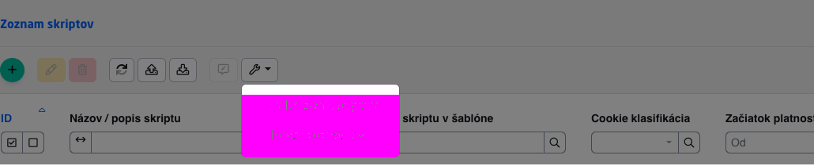

- added function for easy setting of datatable filter selection field [DT.filterSelect(name, value)](developer/testing/README.md#webjet-additional-functions)

**Documentation**

- Tests - added documentation for the option [to run a specific scenario](developer/testing/README.md#test-launching)
- Tests - supplemented documentation for [visual testing support](developer/testing/README.md#visual-testing)
- Deployment - we have added a description of the activities that need to be performed before deploying [the new version] (developer/install/deployment.md).

**Bug Fix**

- Web pages - setting configuration variables ```pixabayEnabled``` and ```editorImageAutoTitle```
- Web pages - inserting an image via Drag&Drop in the page editor
- Web pages - deleting directories containing the character : in the name
- Datatables - fixed display of datatable settings (display of selection menu without cropping and position)


## 2021.2

> Version 2021.2 brings a data field for nested data tables (e.g. a list of media in a web page) and a link selection to a file/image/other web page (e.g. a redirect or perex image field). We have created the first version of the Definition of Done documentation.

**elfinder data field**

We have added a data field for [Datatables Editor - Elfinder](developer/datatables-editor/field-elfinder.md) - file selection. It integrates file link selection using elfinder/files into the datatable editor. The field is displayed as a text field, with a pencil icon at the end. Clicking on the icon opens the elfinder/file selection dialog (#52609).

**Datatable**

We have added a new data field for the Datatable Editor - [nested datatable](developer/datatables-editor/field-datatable.md). It allows you to display another datatable within the datatable editor. For example, in the page editor, display a datatable of attached media (#52351).

We refactored the code in index.js and moved the definition of json and datatable data fields to separate files [field-type-json.js](../../src/main/webapp/admin/v9/npm_packages/webjetdatatables/field-type-json.js) and [field-type-datatable.js](../../src/main/webapp/admin/v9/npm_packages/webjetdatatables/field-type-datatable.js)

**Website**

- added Navigation sheet similar to folder containing sorting order and display settings in menu (#52609)
- added selection of perex image and redirect link via new elfinder type field (#52609)
- added Show checkbox to disable web page display (#52609)

**Data table**

- #52351 - added option ```nestedModal``` (boolean): if set to true, this is a datatable inserted as a field in the editor - [nested datatable](developer/datatables-editor/field-datatable.md), the nested table has the added CSS class ```DTE_nested_modal```.
- #52351 - modified import to allow inserting nested properties (e.g. ```editorField.groupDetails```)
- #52351 - The JSON generated from the object annotation contains the attribute ```array```, which defines that it is an array object. It is used when importing data to set the correct value.
- modified the CSS row style setting from ```createdRow``` to ```rowCallback```, which is also called after data changes (so that CSS row classes are applied after a state change, e.g. after turning off the web page display, the color changed to red) (#52609)
- due to the high number of sheets in the web pages, the ratio between label and value was adjusted from ```col-sm-5/col-sm-6``` to ```col-sm-4/col-sm-7``` (#52609)

**Documentation**

- added new section Development Requirements, created basis [Definition of Done](developer/guidelines/definition-of-done.md)
- documentation on [using Gitlab](developer/guidelines/gitlab.md) moved to new Development Requirements section
- created documentation for [Datatable field - nested datatable in the editor](developer/datatables-editor/field-datatable.md)
- created documentation for [Datatable field - elfinder/file selection](developer/datatables-editor/field-elfinder.md)
- added documentation for opening [iframe dialog](developer/frameworks/webjetjs.md#iframe-dialog)

**Bug Fix**

- datatables editor - fixed setting CSS styles to ```multi checkboxoch``` (wrapping ```custom-switch```). Originally, CSS was only set when the window was first opened, but when the ```options``` values ​​changed (e.g. when switching to a different directory) they were regenerated and displayed instead of sliders as standard checkboxes. The setting is now done every time the editor window is opened. (#52609)
- datatables editor - fixed bug where the dialog backdrop remained displayed after closing the window (occurred in the situation of opening the editor window, canceling, opening a folder window, canceling, reopening the editor window, canceling - the backdrop remained open). Added call ```$("div.modal-backdrop").hide();``` when closing the editor window. (#52609)


## 2021.1

> 2021.1 brings website directory editing and an updated testing framework

**Editing the directory**

Added TODO items to the directory edit dialog (except for history and planning, which are awaiting datatable integration into the editor, and new menu settings, which are awaiting data changes in the ```documents``` table and subsequent implementation in the sitemap and navigation bar components). This is a big change: 42 commits, 27 changed files.

- modified data loading for Datatable Editor only after clicking on the edit icon - this saves one REST service call every time you click on the directory. The ```GroupDetails``` object from jstree is used, which is artificially set in the datatable via API. An example is in [web-pages-list.pug](../../src/main/webapp/admin/v9/views/pages/webpages/web-pages-list.pug) in the ```loadTablesForGroup``` function.
- when clicking on the edit icon, the data from the server is updated and only then the editor is displayed, the animation of the progress indicator in the edit icon has also been added
- fixed a bug where nothing happened when clicking on the directory edit icon and it was necessary to click again (the old code changed the state of the checkbox instead of setting it, so it was checked on the first click and unchecked on the second, so it was necessary to click again).
- added ```multiDomain``` control to display domain field in editor
- adjusted spacing, dividing lines, button for setting the directory in the JSON field according to the graphic design
- added a new Navigation sheet with settings for displaying menu items, navigation bar, and sorting order (originally it was in the Access sheet, which is illogical)

**Datatables**

- added highlighting of the error field during validation + display of a general message on the buttons (since the error may be in a tab that is not visible). Modified for configuration (checking rights to add a variable), gallery (checking rights to the directory), website-directory (checking the parent of itself/child settings).
- The JSON field for directory selection now includes the root directory (for the ability to set the parent directory to the root). It is set using the CSS class ```dt-tree-group-root```
- fixed retrieving ```true/false``` values ​​obtained from ```options``` fields where the value is passed as a string (for select fields). In index.js, in the ```fixOptionsValueType``` function, the value is correctly converted to the ```boolean``` type
- added a new event ```WJ.DTE.xhrfetch``` called after loading data into the editor (with fetchOnEdit). By default, it is still open in the DOM tree and the standard events ```opened``` do not work.

**General**

- added ```DocDetails``` to ```doc.getFullPath()``` for use in VueJS selection and display of path in datatable, modified in [InsertScriptDocBean](../../src/main/java/sk/iway/iwcm/components/insertScript/InsertScriptDocBean.java)
- deleted old code in [TemplateDetailService](../../src/main/java/sk/iway/iwcm/components/templates/TemplateDetailsService.java) generating the directory path (standard JSON field is now used)
- added attribute setting (```data-dt-field-hr```, ```data-dt-field-headline```) to JSON field (allows to correctly display the line before/after and the title before the field)
- added display of a message when calling Ajax requests and getting an error of 401 (logout) or 403 (invalid CSRF token)

**Testing**

- #52444 Updated CodeceptJS framework to version 3.0.4. Old version 2.x did not work correctly on macOS Big Sur (due to old version ```playwright```). The modification also required editing the writing of all test scenarios. Fixed tests for jstree drag & drop.

**Documentation**

- added documentation for [using editorField](developer/datatables-editor/datatable-columns.md#nested-attributes)
- added documentation for [row and icon styling](developer/datatables/README.md#row-styling)
- added documentation for the option to [raise an error message](developer/datatables/restcontroller.md#validation--required-fields) when editing an item (method ```throwError```)
- supplemented documentation for


## 2021.0

> 2021.0 has a new login splash screen, added tree structure and website list icons, and an added section for deprecated/unsupported features in the documentation

**Home Screen**

Completed the first draft of the home screen. So far it contains a list of logged in administrators, ToDo, a list of applications modified for WebJET 2021, a summary of the change list, and server monitoring graphs. Implemented using Vue components.

**Website**

- #52396 - added "Reload data from server" icon for tree structure (restore directory tree structure)
- #52396 - tree structure modified so that when you click on a directory it automatically opens (for better usability)
- #52396 - the tree structure only shows directories, web pages are displayed in the data table
- #52396 - modified display of directory icons, added display of icons for web pages
- #52396 - drag&drop is only allowed when the "Allow moving" option is active, the moved object is styled

**Datatables**

- #52396 - Added the ability to style rows and add additional icons, [documentation](developer/datatables/README.md#row-styling).
- #52396 - Columns with empty ```title``` (or containing a hard space) will not be displayed in the table (usually this is some additional checkbox)

**Documentation**

- #52384 - documentation also launched on the domain http://docs.webjetcms.sk/ and divided into documentation for WebJET 8 and WebJET 2021, edited links, set ```docsify```
- #52396 - added documentation on using icons in [jstree](developer/jstree/README.md#how-to-use-icons) and [datatable](developer/datatables/README.md#row-styling)
- #52444 - supplemented documentation on using [npm](developer/frameworks/README.md#npm)


