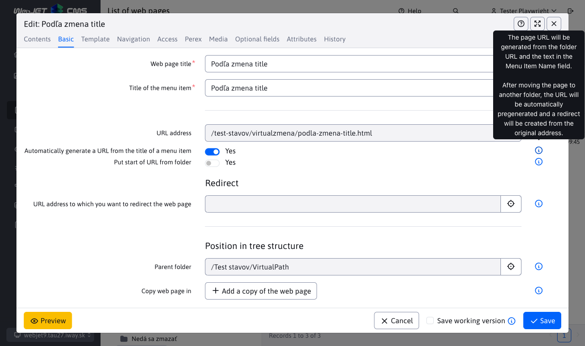
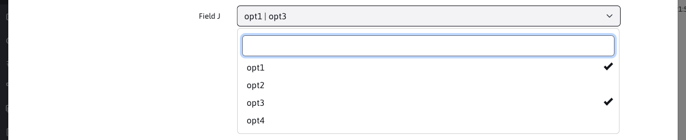
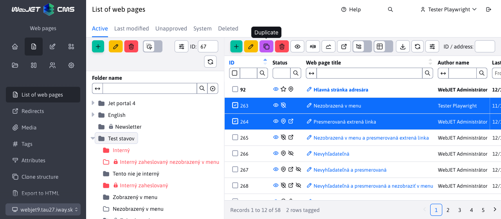
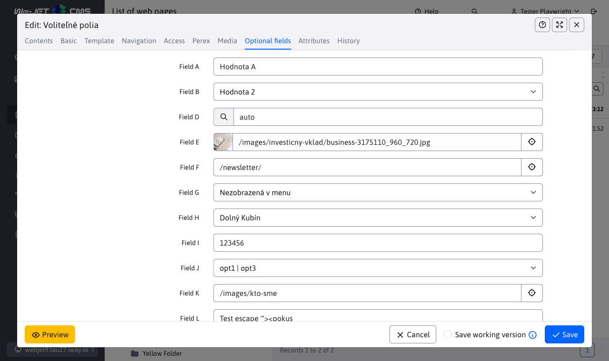
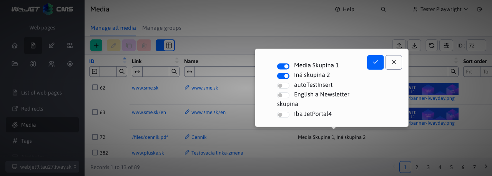
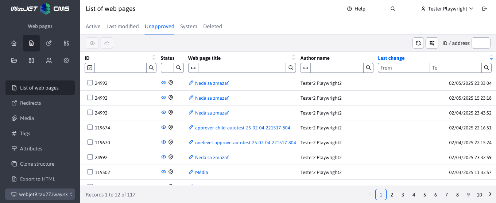
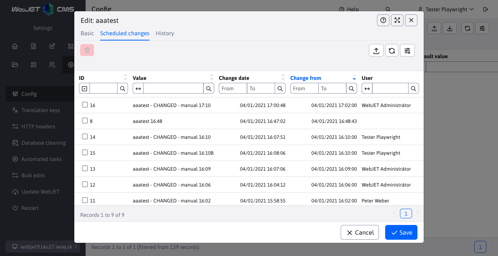
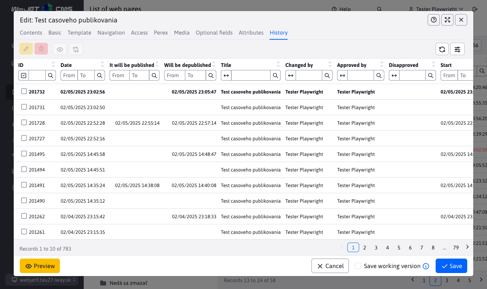

# Changelog version 2021

## 2021.52

> Version 2021.52 has a new design even for old versions of applications, improves responsiveness, adds new fields to web pages, and improves the behavior of page URLs when they are moved to a different directory.

**Redesign of version 8**

We have modified the design of the old version 8 applications so that the colour scheme and layout corresponds with the design of the new version of WebJET CMS. The menu behaves the same as in the new version for a more comfortable transition between the old and new applications (#54233).

By clicking on the "Switch to version 8" icon in the header, you can still switch the interface to the version 8 design.

**Web pages**

- Added option to save [a working version of the website](redactor/webpages/README.md). It will be saved to history and will not be available to visitors of the web site (#54161) for the time being.

- Completely remodeled [Web page editing API](developer/apps/webpages/api.md) from the original `EditorDB` at `EditorFacade`. Web pages are loaded and stored via Spring DATA, which will make it easy to add new database attributes in the future (also specifically on client projects). It's just one line in the changelog, but realistically it's 95 new/changed files (#54161).
- Added option to open another editor from the editor. For now, the feature is implemented on the Web Page Template field in the page editor. You have the option to click the pencil to edit the set template, or click the + icon to add a new template without leaving the page editor. Gradually this feature will be added to other fields like Header, Footer, free fields etc.

- Modified the domain entry field in the directory properties - it is now only displayed for the root directory.
- Added descriptive/info text to fields in page and folder editor.
- Status icons moved to a separate column with the ability to filter by status, added an eye icon to directly display a web page with a list of pages.

- Added rights checking on the ability to create/edit/delete web pages and directories and rights checking on individual directories (#54257).
- Added status icons to a separate column with the ability to filter and view the web page directly by clicking on the eye icon (#54257).
- Added independent options to set directory and web page display in sitemap and navigation bar. Version 8 had these options tied to the menu view. However, sometimes it was necessary to display items differently in the menu and e.g. in the sitemap (#54205).

- Added the ability to set the Free Object A-D in the template tab in the web page. Thus it is possible to change not only the headers/footers/menu, but also the free template objects for each web page separately. It is also possible to set a blank value.

- New options added [automatic generation of the page URL](redactor/webpages/editor.md#url-address) by Menu Item Name (when moving to another folder, the URL will automatically change), or the option to automatically inherit the beginning of the URL from the folder (when moving to another folder, the beginning part of the URL will automatically change) (#54237).

**Responsive version**

Completed generic version of administration for [mobile devices](redactor/admin/README.md). When the width is below 1200 pixels, the left menu and header are hidden, available by clicking on the hamburger menu.

For widths less than 992 pixels, the editor window displays the full size of the window; for widths less than 576 pixels, the field names are moved above the field.

**Optional fields**

Added option [multiple choice selection box](frontend/webpages/customfields/README.md#selection-box-multiple-options) by entering the prefix `multiple:` before the list of possible values. The values are then stored in the field separated by a character `|`.

**Home**

- For ease of use, changing the domain on the Home page does not require confirmation (the domain is changed immediately).

**Configuration**

- Added import and export of configuration according to version 8 in which it is exported to XML format and imported with comparison of existing values.
- Fixed cell editing, added the ability to edit the value as well.
- Fixed display of original value and description after value change.

**Data tables**

- Added new data field type for dial field type `select` with the possibility [editing or adding a record](developer/datatables-editor/field-select-editable.md) in the selection box. They allow you to easily modify the object that is selected in the field, such as a page template, a link to a header page, and so on.

- Added conflict notification - if another user has an editor window with the same record open, a notification will appear with a list of other users. It is displayed when the window is opened and then checked every minute.

- Added the ability to insert `tooltip` to fields in the editor with formatting using [Markdown format](developer/frameworks/webjetjs.md#markdown-parser). For security reasons, you cannot insert links and non-basic Markdown tags.
- Translation key for tooltip is automatically searched by translation key `title` with suffix `.tooltip`. So if you have an annotation `@DataTableColumn(title = "group.superior_directory"` automatically searches for the translation text with the key `group.superior_directory.tooltip`. If it exists, it shall be used.
- Fixed search by date in tables with client pagination and some columns not displayed (wrong column index).
- Added setting option [status icons](developer/datatables/README.md#status-icons), removed the original option to add icons to the link to open the editor using the function `addTextIcon` (this was inappropriate from a UX perspective).

**Deployment**

Modified deployment to artifactory server. Do `ant/build.xml` added task `createUpdateZip` which creates and uploads to the license server an update in the format used for the transition to `gradle` version. It is thus easy to update older WebJET installations in the classic way via the Control Panel->WebJET Update menu (#54225).

Modified and compared archives against the old version 8 to include all necessary files. Added missing fonts for the library `pd4ml` for generating PDF files.

To enable the upgrade to version 2021, please contact [InterWay Sales Department](https://www.interway.sk/kontakt/).

Please note: due to the large number of changes in the spring libraries, it will be necessary to restart the application server during the update. Make sure you have technical support available for the restart before updating.

**Documentation**

- Supplemented documentation on storage [working version of the website](redactor/webpages/README.md).
- Pre-generated screenshots of documentation for web pages.
- Ready basis for generation [JavaDoc documentation](../javadoc/index.html). Modified `docsify` for opening JavaDoc documentation in a new window.
- Web pages - supplemented documentation for [programmer to API](developer/apps/webpages/api.md).
- Documentation created [main controls](redactor/admin/README.md) administration and [check-in and check-out](redactor/admin/logon.md).
- Documentation created for [selection field with editing](developer/datatables-editor/field-select-editable.md).
- Completed documentation for the function [WJ.openIframeModal](developer/frameworks/webjetjs.md?id=iframe-dialóg) for the possibility to set the button text, the position of the close button and the event `onload` executed after loading the modal window content.
- Completed documentation for the function [WJ.hasPermission(permission)](developer/frameworks/webjetjs.md?id=kontrola-práv) to control user rights.
- Completed documentation for the function [WJ.parseMarkdown(markdownText, options)](developer/frameworks/webjetjs.md#markdown-parser) to convert Markdown format to HTML code.
- Redesigned icon setup documentation for use [status icons](developer/datatables/README.md#status-icons).
- Supplemented manal for the editor about applications [Menu](redactor/apps/menu/README.md), [Navigation bar](redactor/apps/navbar/README.md) a [Site Map](redactor/apps/sitemap/README.md).
- Created documentation on the possibilities of generating URLs [automatic generation of the page URL](redactor/webpages/editor.md#url-address).

**Tests**

- Web pages - added new tests for saving working version, notifications when setting an existing URL, notifications when changing a link in the page (when renaming the page address), notifications when publishing with a specified start date, verification of the time of publishing a web page.
- Created function `DTE.fillCkeditor(htmlCode)` to insert HTML code into the currently displayed CKEditor.
- Added test for selection fields with editing option and test for error of restoring selection fields data after saving (fields could not be changed value).
- Web pages - added search test by status icons.
- Web pages - added test of rights to individual functions (add, edit, delete) and rights to individual directories (#54257).
- Web pages - added URL setting test (#54237).

**Error correction**

- Fixed display of datatable settings.
- Templates - added Blank option for header/footer/menu fields.
- Fixed display of help button texts in gallery, delete data and user groups.
- Datatables - retrieve data when duplicating a record during server data retrieval (reload all data before duplication).
- Web pages - corrected loading of records from history and last modified tab.
- Web pages - corrected setting of blank value in field `password_protected` (the character was stored incorrectly `,`).
- Datatables - Fixed updating a record from REST service when marking multiple rows or duplicating records.
- Fixed display of tooltips on web page directory properties buttons and in gallery, delete data, user groups applications.
- Fixed filter display on page title in server monitoring and GDPR application.
- Fixed marking all rows in client pagination - only the current page (#54281) is marked.

## 2021.47

> Version 2021.47 adds modified Tooltip, Data Export, Bulk-email/Domain Limits, and Banner applications to the new design. We've added approval notifications on page save and improved the mobile version.

**Applications**

- Tooltip - administration modified to new design, completed [documentation for the editor](redactor/apps/tooltip/README.md).

- Data export - administration modified to new design, supplemented [documentation for the editor](redactor/apps/export/README.md).

- Bulk e-mail - Domain limits - administration modified to new design, supplemented [documentation for the editor](redactor/apps/dmail/domain-limits/README.md).

- Banner system - administration modified to new design, supplemented [documentation for the editor](redactor/apps/banner/README.md).

**Web pages**

- Added notification when publishing a page that is subject to approval and notification if the page has pending/unapproved changes.

- In the History tab of the editor, the currently published version of the page is highlighted in bold.

**Data tables**

- Modified copying attributes of an existing entity when editing it. By default, not all attributes of an entity need to come from the editor, so the values of the existing entity and the data sent from the editor are merged before saving. By default, all non `null` Attributes. This does not allow you to enter a blank date (once it has been set). Therefore, attributes of the annotated DataTableColumn type `Date` are transferred even if they have `null` Value.

**Responsive version**

- Improved login screen display on mobile devices.
- Modified the dialog display in the mobile version - the window is full height, the tabs are full width of the window, the footer is lower to maximize space.
- In web pages in the editor, you can scroll the editor buttons with your finger to access all the editor buttons.
- Cancelled wrapping buttons in datatable to second row, now they just don't show up.
- Modified display of search markers in table - moved from behind buttons to new row below buttons.

**Security**

- Documentation created for [setting permissions and resolving security findings](sysadmin/pentests/README.md) from safety/penetration tests. The documentation is located in the Operations Manual section and it is advisable to check the settings when the website/application goes into production and then with each major change, at least quarterly.
- JavaScript libraries updated to the latest versions, fixing all vulnerabilities in these libraries. Bootstrap library updated from version 4 to version 5 (#54169).

**Documentation**

- Documentation created for [sending notifications from the REST service](developer/datatables-editor/notify.md) DATATables.
- Documentation created for [Tooltip app](redactor/apps/tooltip/README.md) to the editor.
- Documentation created for [Data Export application](redactor/apps/export/README.md) to the editor.
- Documentation created for [Bulk Email - Domain Limits](redactor/apps/dmail/domain-limits/README.md) to the editor.

**Error correction**

- Fixed cache updating `TemplatesDB` when saving the page in the local (domain) System directory.

## 2021.45

> Version 2021.45 adds a list view of web pages from subdirectories, improves the view of administration on mobile devices and adds a Q&A application. In addition, it includes many changes under the hood when working with the list of websites (switching to server paging and search, using Spring DATA for database access).

**Web pages**

Added the ability to view web pages from subdirectories by toggling the switch **View pages also from subdirectories** in the datatable header. When you switch to the mode of displaying pages from subdirectories, the pages from the currently selected directory are displayed in the tree structure, including its subdirectories. You can click on another directory in the tree structure, which again causes the pages from the selected directory and its subdirectories to be displayed.

- REST service for getting a list of sites rebuilt to use Spring DATA repositories.
- It allows server paging and search, which is convenient when there are a large number of pages in the directory.
- A class was formed `DocBasic` which contains common data between tables `documents` a `documents_history` and subsequent classes `DocDetails` a `DocHistory`. Class backward compatibility is maintained `DocDetails` with WebJET version 8, although we have converted primitive types to objects (it concerns mainly date objects that use names due to name collision `publishStartDate, publishEndDate, startDateDate`). It is used [inheritance in JPA entities](developer/backend/jpa.md#inheritance-in-jpa-entities).
- Access tab divided into user group section - access for registered users and bulk email groups similar to the users.
- Editor - added setting of the Format styles selection box according to the currently displayed page/template.
- Editor - added a floating toolbar for properties of objects in the editor (e.g. images, tables, forms).

**Responsive version**

We have started work on optimizing the administration for mobile devices. Standard elements thanks to the use of `bootstrap` The framework works, but it was necessary to debug/fix several details.

- On mobile phones, the editor dialog is stretched to the full size of the display. In portrait mode, field names are above the field (not to the left as in the standard view), and the gray highlighting of field names is hidden. The header and footer of the window is lower (#54133).
- Fixed clicking on the hamburger menu in the mobile version (#47428).
- Fixed indentation on the home page (#47428).
- Fixed domain selection field (#54133).

**Applications**

- [Questions and answers](redactor/apps/qa/README.md) adapted to the new design of the administration and added the possibility of setting [optional fields](frontend/webpages/customfields/README.md).

**Managing multiple domain data**

We have added a system to the REST interface of data tables to support multi-domain data management (e.g. the Questions and Answers application always displays only questions and answers of the currently selected domain in a multi-domain installation).

Usage is easy by extending the Spring DATA repository from the class `DomainIdRepository<T, ID>`, the rest is taken care of directly `DatatableRestControllerV2`. More information is directly in the documentation [Domain Data Department](developer/datatables/domainid.md).

**Data tables**

- Following the pattern of web pages added to the header of each datatable an ID field with [ID of the currently edited record](developer/libraries/datatable-opener.md). The ID is also set as a parameter in the URL in the browser, after refreshing the page with the parameter `?id=xxx` will automatically open the specified record in the editor dialog. The value can also be entered in the ID field in the header and the record will be searched and displayed when the enter key is pressed. The current version searches the entered ID by paging through the datatable sequentially, this is not suitable for datatables that have a large number of records (the scan limit is 30 pages).

- Redesigned search when using Spring DATA repository type `JpaSpecificationExecutor`. In this case, a search is created based on `HTTP request` parameters starting with the expression `search`. No longer applicable `ExampleMatcher` but the search term is matched based on the parameters. This has the advantage that primitive or non-primitive parameters can be used in the object. `NULL` attributes (which in the case of `ExampleMatcher` automatically included in the search).

**General**

- JS function added `WJ.htmlToText` for conversion [HTML code to text](developer/frameworks/webjetjs.md#other-functions).

**Security**

- New JPA converter added `AllowSafeHtmlAttributeConverter` for the removal of [malicious HTML code](developer/backend/security.md) from the input fields.

**Error correction**

- Web pages - fixed loading and saving a page that is in multiple directories.
- Web pages - fixed duplicate call to retrieve list of web pages on initialization (unnecessary call to REST service).
- Datatables - Fixed display of the Edit Cell switch in the nested table in the editor.
- Datatables - fixed duplication of icon i for a cell and re-opening a table that does not contain multiple tabs.
- Datatables - fixed setting and getting HTML code when using an array `QUILL` (implemented in `app-init.js`).
- Datatables - fixed display of filters after adding columns in a table via its settings.

**Deployment**

We have modified the build process for the new version artifacts. In this version, all Java classes are recompiled from [source code of the original WebJET](developer/install/deployment.md) 8 and the source code of version 2021. In the new version, we sometimes modify Java classes from the original version 8, which can lead to incompatibility with the old API. Hence, a complete recompilation of Java classes occurs to prevent or detect API incompatibility.

**Tests**

- Updated CodeceptJS to version 3.1.3 and Playwright to version 1.16.3.`BrowserContext`) which is newly opened for each scenario (has a new `BrowserContext`) and it was necessary to modify a few tests (especially the gallery where the / character is used in the ID selector, which needs to be escaped correctly via backslash).
- Modified automated testing of datatables - function `createSteps` a `editSteps` is called before the mandatory fields are set.
- Created function `DTE.fillField(name, value)` to fill the standard field by its name on the backend/json definition.
- Created function `DTE.fillQuill(name, value)` to fill the value in the type field `QUILL`.
- Created a test to apply the questions and answers.
- Added test for filtering web pages by `boolean` a `password_protected` Columns.
- Web site - created test `webpage-spring.js` for the version with server pagination.
- Web pages - added tests to `webpages.js` to view web pages also from subdirectories.

**Documentation**

- New section created [Backend/Security](developer/backend/security.md) in the documentation for the programmer.
- Documentation created for [editor's opening](developer/libraries/datatable-opener.md) By `id` parameter in the URL.
- Established the basis for safety documentation. Contains information on [unsafe HTML code](developer/backend/security.md).
- Documentation created for [Domain Data Department](developer/datatables/domainid.md).
- Enhanced example of use [optional fields](developer/datatables-editor/customfields.md) in the editor using the class `BaseEditorFields`.
- Documentation created on the possibility of use [inheritance in entities](developer/datatables/restcontroller.md#inheritance-in-jpa-entities).
- Documentation created for use [inheritance in JPA entities](developer/datatables/restcontroller.md#inheritance-in-jpa-entities).

## 2021.40

> Version 2021.40 brings a redesigned user, group and group rights management and a redesigned GDPR application to the WebJET 2021 visual. In addition, it adds a number of minor enhancements and fixes.

**Users**

- [List of users](admin/users/README.md), [user groups](admin/users/user-groups.md) a [groups of rights](admin/users/perm-groups.md) converted to a datatable and REST interface.
- Supplemented by [highlighting groups of rights](admin/users/README.md) in individual rights. Using colored circles to highlight the rights in a group of rights, you can identify at a glance the rights that the group contains.

- Added icons for individual rights up to level 3.
- Optional fields in users [can be configured](developer/datatables-editor/customfields.md) similar to web pages using translation keys `user.field_x.type`.
- If the user does not have a registration date set (for historical reasons) this date will be set to the current date when the user saves (#53985).

**GDPR**

- Remodelled part [Managing regular expressions](redactor/apps/gdpr/regexps.md) to the 2021 version design (#53905).
- Remodelled part [Cookie Manager](redactor/apps/gdpr/cookiesmanger.md) to the 2021 design (#53881).
- Remodelled part [Data deletion](redactor/apps/gdpr/data-deleting.md) to the 2021 version design (#53985).
- Remodelled part [Search](redactor/apps/gdpr/search.md) to the 2021 version design (#53989).

**Translation keys**

- The translation value field is no longer required for the option to enter a blank value.

**Custom applications**

- Established basis for [creation of customer applications](custom-apps/admin-menu-item.md). These are created in the directory `/apps/` unlike the old version from the directory `/components/` (#54045).
- Applications are embedded in the design [directly from html code](custom-apps/admin-menu-item.md#frontend), there is no need to create and compile pug files.
- Created function [WJ.breadcrumb](developer/frameworks/webjetjs.md#navigation-bar) to generate the navigation bar.
- The navigation bar can be accessed using the macro `{LANGUAGE-SELECT}` insert a selection field for the language.

**Export and import**

- Modified export and import of data from/to datatable to use columns from the editor (versus the original version which used columns in the table). The editor usually contains more columns than the table and these are needed to import the data correctly (#54097).
- Also exported are lists of directories/pages/directories on the file system that use the array type `json`. Both exported and imported are in full path view (e.g. `/Slovensky/Novinky`).
- Documentation created for [programmer](developer/datatables/export-import.md) Also [of the editor](redactor/datatables/export-import.md).

**Translator**

WebJET integrates the possibility [translation of texts](admin/setup/translation.md), the currently supported compiler [DeepL](https://www.deepl.com/). Automatic translation is supported in the application [mirroring of the structure](redactor/apps/docmirroring/README.md).

**Web pages**

- Added option of forced [restoration of tree structure](developer/apps/docmirroring.md) by setting the attribute `RequestBean.setAttribute("forceReloadTree", Boolean.TRUE);`.
- Added display of "Processing" text when using drag&drop in a tree structure (which can take a few seconds when using structure mirroring).
- By `DocDetails` a `GroupDetails` attribute annotation added `fullPath` with the full path to the website/address. It is not displayed by default, in the datatable settings it is possible to enable the display.

**Forms**

- For forms containing more than 5000 records (configurable in the formsDatatableServerSizeLimit config variable), server processing is used.
- Search - in server processing only "Starts at" search is supported, other options are removed from the table header, search in maximum 6 columns at a time is supported.
- Search - added the ability to combine search by date and by column value.
- By default, the list and form detail is arranged by the date the last form was completed.
- Modified the form detail link according to the design manual.
- Searching in up to 6 columns at a time is supported.
- Fixed the order of columns according to the form definition (before, columns were displayed in random order).

**Data tables**

- Added JPA converter `DocDetailsConverter` a `DocDetailsNotNullConverter` between `doc_id` in the database and the object `DocDetailsDto` for easier use of the JSON type field for selecting the page ID. Converter `NotNull` returns at `NULL` object value `-1`.
- Added JPA converter `GroupDetailsConverter` between `group_id` in the database and the object `GroupDetails` for easier use of the JSON type field for selecting the directory ID.
- For an array of type JSON [to select one page or directory](developer/datatables-editor/field-json.md#classname-options) added the possibility to delete the set value by setting the field type to the value `dt-tree-group-null` for a directory or `alebo dt-tree-page-null` for the web page.
- Added option for JSON type field `null` object `Group/DocDetails`. Original version for `null` object didn't even display the directory/page selection field, the new version will display an empty field.
- Added option [heading settings](developer/datatables-editor/datatable-columns.md#datatablecolumneditor-properties) in front of the nested datatable on a separate tab by setting the attribute `data-dt-field-full-headline`.
- Added option [forced display of columns](developer/datatables/README.md#configuration-options) (e.g. for a nested datatable) by setting the configuration option `forceVisibleColumns`.
- Added ability to call JavaScript function for [edit the list of columns](developer/datatables/README.md#configuration-options) (e.g. for a nested datatable) by setting the configuration option `updateColumnsFunction`.
- Added option [add CSS style with tab switcher](developer/datatables-editor/README.md#tabs-in-the-editor) in the editor by attribute `className`, using CSS style `hide-on-create` it is possible to hide the card when creating a new record.
- Added option [hide card based on rights](developer/datatables-editor/README.md#tabs-in-the-editor) in the editor by attribute `perms`.
- To class `DatatableRestControllerV2` added method `public void afterSave(T entity, T saved)` called after saving the entity (object `entity` is the original sent object, `saved` is the saved version - when a new record is `ID` found only in `saved` entity).
- To class `DatatableRestControllerV2` added method `public void afterDelete(T entity, long id)` called after deleting an entity.
- Added field type `jstree` to view [tree structures](developer/datatables-editor/field-jstree.md) with selection fields of tree nodes.
- Field type `json` extended with the option [selecting a list of file system directories](developer/datatables-editor/field-json.md).
- Added fields `HIDDEN, RADIO, PASSWORD` For `DatatableColumnType`.
- Simplified process of working with [additional/nested attributes](developer/datatables-editor/datatable-columns.md#nested-attributes), `editorFields` in the REST controller. By implementing the methods `processFromEntity` a `processToEntity` ensure correct data mapping between the entity and `editorFields` object.
- Import - added conditions for `domainId` to update only the records of the current domain when importing.
- Import - modified import with matching records by selected column to use API `insertItem` a `editItem` to make the import work also for REST interfaces not using Spring DATA repositories.
- Import - modified the dialog to display an error message from the server when an import error occurs.
- API - added method `getOneItem(long id)` to get one item. The use is instead of the original `getOne` which is a REST method (overriding REST methods is not recommended).
- Fixed design bugs with selection fields when mouseover and hidden column display.
- Added option [view HTML code](developer/datatables/README.md#display-html-code) in the cell by setting the CSS style `allow-html` (#53989).
- When calling `getAllItems` the option is automatically detected `serverSide` (based on URL parameter `size`). If it is not detected the call is used `repo.findAll()` without `Pageable` parameter to return all records.
- The filter display for date entry adjusts to the size - if the blank field is narrow so it doesn't take up column width unnecessarily, the field will automatically enlarge when a value is entered. The field size is also different for date and date+time fields (#54097).
- Added retrieving all row data from the server before editing a cell, since the datatable itself may not always contain all the data needed for the editor (#54109).

**Security**

Integrated password quality control. Uses the library [zxcvbn-ts](https://zxcvbn-ts.github.io/zxcvbn/), which evaluates the quality of a password based on several parameters. In addition to standard rules such as **Length** passwords, **large** letters, **Special to** characters checked in the password as well:
- a sequence of characters on the keyboard, e.g. `asdf`
- dates and years
- repeating sequences of the type `abcabc`
- common names and surnames
- well-known slogans such as `password`

The library has **built-in dictionary of the most commonly used entries** and the names against which it checks the password.

The check is implemented in the administration when creating/modifying a user but also in the login page in the administration, where it informs the user about the quality of the entered password.

REST datatable interfaces adapted for use `ThreadLocal` object that holds local information (e.g., that it is a data export) to avoid overwriting information between multiple requests.

**Improving usability**

- Adjusted the position of the dialog for setting the columns and number of records per page in the datatable (position 5% from the top similar to the editor). Modified double background darkening display.
- Increased the size of the column setup dialog to display in 4 columns, added options to display 1000 and 2000 records per page.
- Redesigned the Edit Cell icon into a scrolling box to better display the status.
- Modified `hover` states in the selection fields and date and time selections.
- Renamed some names to better match reality (configuration, redirects, template groups).

**Tests**

- Created tests to apply mirroring structures.
- Modified timing of multiple tests (correct wait for execution instead of fixed waits).
- Added function `I.getRandomTextShort()` to get a shorter random string (in the form mmddrnd).
- In the automated test of datatables, modified column view validation (only columns with set attribute are validated) `visibleOriginal=true`, i.e. only those that appear in the standard view).
- Added option [automated import testing](developer/testing/datatable-import.md) from Excel to the datatable.

**Documentation**

- Documentation created for [translator](admin/setup/translation.md).
- User rights documentation created - [for the administrator](admin/users/README.md), [for the developer](developer/apps/users/README.md).
- Documentation created for [of the jstree field type](developer/datatables-editor/field-jstree.md).
- Added documentation about the possibility of extending the type field `json` o [custom version](developer/datatables-editor/field-json.md#custom-configuration-of-the-displayed-tree-structure) jsTree structures.
- Supplemented documentation [Definition of finished](developer/guidelines/definition-of-done.md) about the conditions for testing the export and import of datatables.
- Documentation created [list of users](admin/users/README.md), [user groups](admin/users/user-groups.md) a [groups of rights](admin/users/perm-groups.md).

**Error correction**

- Datatables - fixed setting of optional fields in newly created record.

## 2021.26

**Data tables**

- Added option `onRowCallback` for the possibility [line styling](developer/datatables/README.md#line-and-icon-styling) on the client side (e.g. marking a row as inactive).
- Added option to set [default value](developer/datatables-editor/datatable-columns.md#datatablecolumn-properties) when creating a new record using the attribute `defaultValue` Annotations `@DatatableColumn`. Macros for setting the currently selected domain or date and time are also supported.

**Tests**

- Added option to generate [allure](developer/testing/README.md#html-report-generation) Reports.

## 2021.24

> Version 2021.24 adds the ability to duplicate records in data tables, automatic opening of root directories if the domain contains e.g. only Slovak and English directories (max. 2 directories), allows to perform bulk editing in web pages and improves in several places the comfort of work.

**Web pages**

- Domain name renaming with the option to automatically rename the domain prefix in translation keys and configuration variables with the prefix of the old domain.
- If the tree structure contains a maximum of 2 directories (configurable in the webpagesTreeAutoOpenLimit configuration variable) they will automatically appear open for more convenient work (#53805).
- In the parent directory selection window, the root directory is automatically opened for a nicer and more convenient view.
- If a local domain exists for the current domain `System` directory will not be made global `System` display the directory in a tree structure (e.g., when selecting the parent directory of a page).
- Modified initial page list loading - display page list for the first directory in the tree structure.
- When you automatically create a domain `System` directory (conf. variable `templatesUseDomainLocalSystemFolder=true` and saving the root directory) will also be automatically created under the Headers, Footers, and Menus directories.
- Using ckeditor modified to standard [datatable data field](developer/datatables-editor/field-wysiwyg.md).
- When editing multiple rows, the ckeditor already behaves like a standard datatable field and allows you to leave separate HTML code/text for each row, or set all selected rows to the same HTML code/text.

**Gallery**

- Modification of the tree structure converted from a VUE component to a datatable, following the web page pattern (#53561).
- Added pre-generate images and Apply to all subfolders options to directory properties (#53561).
- When the tree structure directory is deleted, the files on the disk are also deleted.
- Fixed resending edited photo data from image editor.
- Fixed saving an image from the image editor (wrongly initialized save directory).

**Data tables**

- Added functionality to duplicate records in the table. Added purple Duplicate button to the toolbar. It is also possible to select multiple rows at once.

- Added option to restore the displayed columns to the original settings from the server. The user settings are deleted and the original visibility of the columns is restored.
- Added to the editor by opening the help by clicking on the question mark icon in the footer of the dialog box.
- Added highlighting of the required field using the \* character.
- When checking the required fields, the message next to the save buttons is also displayed. It can happen that the required field is in a different tab than the currently displayed tab, and the user does not know why nothing happened after clicking save. Thus, a visible error message is always displayed.
- Redesigned field validation using annotations on [translation keys from WebJET](developer/datatables/restcontroller.md#validation---required-fields). Modified the displayed error messages to the format "What caused the error. What the user should do".

**Tests**

- Added test for unpacking the first level of the directory structure.

**Documentation**

- Added description of data types and mandatory fields for [datatable annotations](developer/datatables-editor/datatable-columns.md).
- Created documentation for the data field [wysiwyg](developer/datatables-editor/field-wysiwyg.md).
- Supplemented labelling documentation [mandatory fields](developer/datatables-editor/datatable-columns.md#required-fields) in the annotations.
- Extended documentation on [validations using annotations](developer/datatables/restcontroller.md#validation---required-fields).

**Error correction**

- Datatable - For selection fields that have options defined directly in the JSON definitions, the options are passed directly to the filter selection field.
- Redirects and Domain Redirects - removed unnecessary items to add a menu entry, modified the display so that the edit option is only on the second column as it is by default everywhere.
- Server monitoring - corrected default chart range to the value of the last 14 days.
- Datatable - corrected highlighting of selected rows after saving, if received data contains CSS row style setting - CSS style will be preserved `selected` Also `highlight`.

## 2021.20

> Version 2021.20 adds display and configuration [optional fields](frontend/webpages/customfields/README.md) for the web page and site directory and adds (finally) a button to display the web page to the datatable toolbar.

**Optional fields**

We have implemented universal functionality of optional fields (original name Custom Fields in WebJET 8) into web pages and web page directories (directories were not possible to set field types in WebJET 8). This makes it easy to set different field types in web pages and directories.

We have prepared documentation with information on [settings of optional fields](frontend/webpages/customfields/README.md) for the frontend programmer and documentation with [technical information](developer/datatables-editor/customfields.md) for the backend programmer.

**Web pages**

- Added a button to the datatable toolbar to display the web page. Multiple rows can be selected and selected web pages can be displayed in new sheets at once.

**Documentation**

- Optional fields - information about [settings of optional fields](frontend/webpages/customfields/README.md) for frontend programmer.
- Optional fields - [technical information](developer/datatables-editor/customfields.md) for the backend programmer.
- Testing - screenshots - information and example with [CSS styles can be set](developer/testing/screenshots.md?id=Úprava-css-štýlov) before taking a screenshot.
- Added documentation for WebJET JS functions - [Dialogue for selecting a file/link](developer/frameworks/webjetjs.md?id=dialóg-pre-výber-súboruodkazu).

**Tests**

- Optional fields - added basic test for displaying optional fields in web page and web page directory.
- Translation texts - added test for checking rights to module and rights to Edit texts - display all texts.

**Error correction**

- Web pages - corrected use of API function `wjEdit`, added function `wjEditFetch` which also restores data from the server. Modified automatic opening of the page according to the specified `docid` URL of the parameter to use the function `wjEditFetch` to get a list of available fields.
- Translation keys - added check for rights to change translation key, fixed duplication of key after change.
- Translation keys - added key change invocation in the internal cache and in the cluster cache.
- Translation keys - added check and test for the right Text editing - view all texts.

## 2021.18

> Version 2021.18 will automatically create [Domain](frontend/setup/README.md), `System` folder, adds editing [brands](redactor/webpages/perexgroups.md) (perex groups), improves cell editing behavior, and fixes a bug in the display of dial values in the datatable. Administration uses a new font `Asap`.

**Web pages**

- Added automatic creation `System` folder when saving the domain root directory in configuration variable enabled mode `templatesUseDomainLocalSystemFolder=true` (#53685).
- In the list of headers, footers, menus, and free objects in a web page and template, the `templatesUseDomainLocalSystemFolder=true` also show web pages from [of the first level under the folders](frontend/setup/README.md) for the possibility of their organization (#53685).
- Editor - added automatic deletion of the text New web page in the page title after clicking in the box. Automatic transfer of the value also to the field Name of the menu item and deletion of the URL if it contains the expression New web page.
- Template Groups - modified folder list - complete folder contents are displayed `/templates`, and in folders starting with the (log)installation name, the installation name is automatically removed from the value (it is then added `combine.jsp`, but in the database the value is stored without the installation name).

**Tags (perex groups)**

- Added ability to add/edit/delete [tags (perex groups)](redactor/webpages/perexgroups.md), available as a new menu item under Web pages (#53701).

**Datatable**

- Edit cell - added edit option [single cells](developer/datatables-editor/bubble.md) directly in the datatable also for the editor containing separate sheets (so far it worked only in the editor without sheets). Added option to set non-editable cells.

- Modified override method option `searchItem` v `DatatableRestControllerV2` for searching. It is not recommended to override the REST method directly `findByColumns`, because it makes this an internal problem in Spring for customer projects (#53677).

**Administration**

- Changed font on the cut `Asap` (#53689).

**Documentation**

- Added first documentation for [frontend programmer](frontend/setup/README.md) describing how to set up WebJET when managing multiple domains and using local `System` folder.
- Added basic documentation for [brands](redactor/webpages/perexgroups.md).

**Tests**

- Added test for automatic change and transfer of the New Web Page value in the page editor header.
- Added test for editing tags (perex groups) and their display in web page by directories.

**Error correction**

- Web pages - fixed possible JavaScript bug if the initial data when displaying the list of pages contains a terminating script tag.
- Web pages - fixed pre-generation of page URLs
- DateTables - fixed CSS cell class setting for date columns if they have also set `cell-not-editable`. Datatable apparently ignores the attribute `className` v `columnDefs` If `className` is not empty. The required value is therefore already sent from the server.
- Datatables - refactored use type `TEXT_NUMBER` at `NUMBER` for accurate display of numbers greater than 999. In mode `TEXT_NUMBER` such rounded values are displayed as e.g. `2 tis.`.
- Text editing - corrected search in customer projects.
- Datatables - fixed display of dial data in custom column list view (#53653).

## 2021.13

> Version 2021.13 improves the user experience by increasing the speed of displaying the list of web pages, the ability to specify a page or directory ID for displaying it (including remembering it in the browser URL), the ability to set the columns displayed in the datatable, translations in JavaScript files, and a number of other improvements throughout WebJET.

**Optimising display speed**

We have optimised [speed of displaying the list of web pages](developer/apps/webpages/README.md). We have minimized the initial REST calls, which are replaced by embedding the initial data directly into the HTML code of the page. There is no need to wait for the next request to the server to complete when displaying the tree structure. We also modified the loading order of JavaScript files to reduce CPU load (some files are loaded asynchronously only after the page list is displayed) (#53513).

- Only the basic columns are displayed by default in the website list datatable, other columns can be enabled via the table settings. However, the basic display significantly reduces the CPU/browser load when rendering the table.
- Optimized page list loading - no unnecessary loading of the media list and note field (it is loaded only when you open the page editor).
- In the hidden datatable for directory editing, only the basic columns are displayed, just like for a web page. Since this datatable is hidden, it does not make sense to display all columns and unnecessarily load the processor when rendering it.
- The data for the root directories of the tree structure are sent directly in the HTML code of the page without the need to call the REST service.
- Remastered directory loading when editing. The original version used the object returned for the tree structure `jstree` and when editing the record, she called restore object. Technically, however, the datatable did not retrieve the actual entries for the selection lists (`options`) according to the current directory - e.g. the same list of all templates is displayed everywhere. The modified version calls refresh datatable list before editing the record, which also retrieves the current values for the selection lists from the REST service.
- First call `refresher-a` is executed up to 10 seconds after the web page is loaded.
- Library for importing data from `XLSX` is initialized after the import dialog is opened.
- In the nested datatable, we have optimized data retrieval - the datatable (e.g. Media or History sheet in the page list) is initialized and retrieves data from the REST service only after clicking on the sheet. If the user doesn't need to view the media or history then the REST service doesn't need to be called unnecessarily and the nested datatable doesn't need to be initialized from the processor's point of view.

**Web pages**

- Added the ability to edit a page according to the specified page ID (`docid`) in the URL parameter or by typing it into the text field in the datatable. A directory structure is automatically opened for the specified ID, and then the page editor is opened. When entered via the URL parameter, the domain is also set correctly in the domain selection field (#53429).
- Added the ability to specify a directory ID for editing by typing it into a text field or as a URL parameter.
- On the home page, edited the links in both the My Recent Pages and Changed Pages lists to point to the page editor.
- Directory - added display of scheduled versions and directory history with the ability to edit the record by historical/scheduled version.
- Added display of the Last Modified list (a list of pages last modified by any user in the current domain) and Pending Approval list (displayed only if there are pages to be approved by the currently logged in user) (#53493).

**Administration**

- Added [publishing the event](developer/frameworks/thymeleaf.md#inserting-custom-objects-into-the-model), `ThymeleafEvent` when you view the administration page. Allows you to dynamically insert objects into the page model.

**Translations**

Implemented framework for [translation of texts in JavaScript files](developer/frameworks/jstranslate.md). It consists of `REST` a service providing a key-text translation map and from a JavaScript library providing key-based translation. The library also ensures that the translation keys are stored in browser memory and updated when the translation text changes (#53128).

Fixed texts have been replaced by translation keys in JavaScript files `index.js` for datatable and `webjet.js` for global functions.

During the implementation, several libraries were created for displaying logs in the browser console, accessing `storage` browser object and event triggering. By default, it is no longer possible to use the event `$(document).ready`, because the translation key store must be initialized first. We have implemented a custom function `window.domReady.add`, which is executed only after the translation key store has been initialized.

The whole translation system for JavaScript files is implemented as a library and can be easily used in other projects in the future (e.g. also in Angular/VueJS applications).

**Configuration**

- Added display of configuration variable changes to the History sheet, so changes do not need to be searched only in the audit, but are stored separately in the database for easy viewing.
- Added the ability to encrypt the value and plan to change the value in the future.
- Added Planning sheet to show planned changes, values can be deleted in the future.

**Datatables**

- Added support for searching annotations also in the parent class `Java beanu` (for example, if you are expanding an existing class).
- Method `DatatableRestControllerV2.throwError(String errorKey)` modified to use translation keys (automatically translates the specified key to text), modified to use the method in the current code (fixed texts changed to translation keys).
- Added support for inserting a nested datatable in a sheet that already contains other fields. Modified datatable height calculation to take into account other fields. Reworked indentation in CSS to allow nested datatable to be edge to edge and display gray block under field names.
- Added support `DATE` fields, the original version supported only `DATETIME`.
- Added option to automatically [hide some buttons](developer/datatables/README.md#configuration-options) in the datatable toolbar by setting the option `hideButtons`.
- Added ability to use primary data directly from a variable instead of calling a REST service by setting the object to a property `initialData` in the datatable configuration.
- Generalized [search by user name](\(developer/datatables/restcontroller.md#display-user-name-and-search\)) when storing only the ID in the database.
- Added option to set custom function to manage editor opening via option `onEdit` datatable configurations.
- Added remembering set columns in datatable view. Settings are saved in the browser and remembered for the currently logged in user. (#53545)

**General**

- Added option to use `autocomplete` Also [outside datatables](developer/datatables-editor/autocomplete.md#use-outside-the-datatable).
- Added new login screen to administration (for unambiguous resolution of WebJET 2021) (#53617).

**Tests**

- Tests adapted for asynchronous initialization of datatables.
- Added a test checking the available templates for directory editing.

**Documentation**

- Documentation created for [translation in JavaScript files](developer/frameworks/jstranslate.md)
- Documentation created for new libraries [Translator](developer/libraries/translator.md), [StorageHandler](developer/libraries/storage-handler.md), [Store](developer/libraries/store.md), [Tools](developer/libraries/tools.md), [ReadyExtender](developer/libraries/ready-extender.md).
- Documentation created for [optimising display speed](developer/apps/webpages/README.md) list of websites.
- Supplemented documentation to the datatable - supplemented [list of configuration options](developer/datatables/README.md#configuration-options).
- Created documentation on the possibility [inserting custom objects](developer/frameworks/thymeleaf.md#inserting-custom-objects-into-the-model) to the model in `Thymeleaf` on the backend.
- Documentation for the jstree library added to include information about embedding [initialization data](developer/jstree/README.md#Configuration).
- Added documentation on raising a general error in the datatable and on [to prevent editing or deletion](developer/datatables/restcontroller.md#preventing-the-deletion--editing-of-a-record) of record.
- Supplemented documentation for [view and search by user name](developer/datatables/restcontroller.md#display-user-name-and-search) when storing only the ID in the database.
- Supplemented documentation on operation [list of websites](developer/apps/webpages/README.md) - view the sheets last edited and awaiting approval

**Error correction**

- Fixed display of template list when adding/editing web page directory. Templates are now displayed conditionally according to the set directories (the original version displayed all templates everywhere).
- Fixed distribution version for other projects (Spring DATA repositories, missing files, updated dependency libraries).

## 2021.12

**Web pages**

- Added icon for importing and exporting pages in XML format according to the original WebJET 8 functionality (#53497).

**Tests**

- Added icon display test for importing and exporting pages in XML format, including verification of import window opening.

## 2021.11

> Version 2021.11 adds a web page history view with edit, view and compare options.

**Web pages**

- History function sheet in the page editor. Allows you to load a web page from history into the editor, view the page from history, and compare the current version against the historical version (#53385).

**Datatables**

- Added function `$.fn.dataTable.Buttons.showIfOneRowSelected(this, dt);` to display the button when it is marked exactly [one line](developer/datatables/README.md#adding-or-removing-buttons).
- Extended configuration option [nested datatables](developer/datatables-editor/field-datatable.md) in the editor using Java annotations. Allows you to set the layout or disable server pagination.

**General**

- Into the project set [mapstruct](developer/backend/mapstruct.md) version 1.4.2.

**Documentation**

- Added new WebJET CMS Programmer/Applications and Modules section for developer documentation specific to WebJET CMS applications/modules/parts.
- Editor's manual supplemented with basic information on [page history](redactor/webpages/history.md).
- Added documentation to view [website history](developer/apps/webpages/README.md).
- Added documentation and sample mapping [DTO objects](developer/backend/mapstruct.md) through the framework `mapstruct`.
- Extended documentation on adding [datatable buttons](developer/datatables/README.md#adding-or-removing-buttons).

**Error correction**

- Audit - prevented deleting audit lines on the REST service.
- Nested datatable - added call `deselect` before loading new data of the nested datatable, to set the buttons correctly (deactivate them if they require the selected row).
- Corrected call `TABLE.hideButton` - hide buttons only in the given table, not in all tables (added restriction on table ID when searching for buttons in DOM tree).

## 2021.10

> Version 2021.10 fixes a dialog size error in the page editor and fixes several grammatical errors in application descriptions.

**Web pages**

- Based on the tests of working with the web page, the texts in the list of applications have been modified.
- Fixed dialog box size setting when inserting application or form elements in the page editor.
- Fixed display of warning when inserting a form into a page.
- Fixed setting the Allowed value option when inserting a form element text field/region according to the set regular expressions in forms.

**Tests**

- Added tests for web page content (add table, find and replace, insert image, step back, insert special character).

## 2021.8

> Version 2021.8 adds **media management (files attached to the website)** and their groups. Compared to WebJET 8, it adds the ability to manage media separately with the ability to search for sites using a particular media and so on.

**Media**

- Added media management and media groups (#52462).
- Integrated into the web page in the media tab as a nested datatable (#52462).
- Added Media menu item with the ability to edit all media and manage media groups to the Web page menu.
- Added the Media - All Media Management right to display a list of all media with the ability to edit media globally (e.g. find all media linking to a specific link or image).

**Datatables**

- For a data field of type `elfinder` an event is triggered `change` after setting the value (for the possibility of listening to the change event).
- Modified getting the address of the REST editor service from a static call to a dynamic calculation call `WJ.urlAddPath(DATA.url, '/editor')` for the ability to change the URL of the REST service on the fly.
- Datatable data field - added settings for the size and position of the header columns after displaying the datatable tab.
- Datatable data field - attributes enabled `fetchOnEdit, fetchOnCreate` to refresh the data when editing and adding a new record.
- Datatable data field - added the correct setting of the REST service URL when the parent object changes (e.g. when the page ID changes).
- Data field elfinder - added event invocation `change` after selecting the file in the dialog box.

**Security**

- Datatables - added display of error message when an error is returned from the REST service.

**General**

- Classes `PathFilter, WebjetSecurityService` moved to WebJET 8.
- Audit - added audit record type `ADMINLOG_NOTIFY` for the list of notifications in the audit

**Tests**

- Added option to programmatically [take away rights](developer/testing/README.md#revocation-of-the-right) to the currently logged in user (only applies to users with a login name `tester`).
- Added option to automated datatable test [law controls](developer/testing/datatable.md#rights-testing).
- Added the ability to test a nested datatable (datatable field) to automated datatable tests using the `options.container`.
- Modified tests for new database setup - multi domain, added audit record types, improved timing.
- Added usage test [CSRF token](../src/test/webapp/tests/admin/security.js).
- Added function `DT.checkPerms(perms, url)` For [control of rights](developer/testing/README.md#revocation-of-the-right) REST service calls.
- Added function `I.jstreeNavigate(pathArray)` For [successive clicks](developer/testing/README.md#webjet-additional-features) to the specified names.
- Added tests for [Media](../src/test/webapp/tests/webpages/media-groups.js) a [media groups](../src/test/webapp/tests/webpages/media-groups.js).

**Documentation**

- Added documentation to the feature [WJ.dispatchEvent](developer/frameworks/webjetjs.md#other-functions).
- Added documentation to the data field [datatable](developer/datatables-editor/field-datatable.md).
- Supplemented documentation for [setting options](developer/testing/datatable.md#setting-options) DATATables.
- Added documentation for the option [withdrawal of rights](developer/testing/README.md#revocation-of-the-right) during testing.
- Added documentation basic documentation for [use of Media](redactor/webpages/media.md) for the editor

**Error correction**

- Modal window - fixed click event settings for modal window called via `WJ.openIframeModal`. Since the modal window is used for different addresses of the embedded iframe it is necessary to dynamically set the function after the click. The original version did not change it after setting it and after closing the dialog and opening a new one, the original `click` Action. This e.g. caused the setting of the line from `elfinder` data field into multiple fields in the editor.
- Menu - corrected display of menu and active item when calling `/admin/v9/` addresses without a slash at the end. URLs of menu items normalized with a slash at the end.

## 2021.7

> Version 2021.7 adds checking the connection to the server and displaying an error message when there is a connection error or a security (CSRF) token error. We've made the System and Trash tabs in the web pages functional and added the first editor's manual text. We spellchecked the entire changelog.

**Configuration**

- Added value whisperer Configuration variable name (#52999).
- Added addition of the old value and description also for the newly added configuration variable (#52999).
- Modified the display of the warning about displaying only changed configuration variables to a standard toast notification that hides after 10 seconds.

**Web pages**

- We've improved the visibility of the Editor's Note field - when you load a page that doesn't have a blank editor's note, you'll get a standard notification with the text of the note. It is displayed for 15 seconds.

- We have functionalized the System and Basket cards and prepared the first text [manual for the editor](redactor/webpages/README.md) with a description of the behaviour of these cards.
- The list of web pages is filtered by the selected domain (only folders and web pages from the currently selected domain will be displayed)
- When you create a new folder, the domain is automatically set

**Datatables**

- Added option to add whisperer/autocomplete to text fields
- Modified the styling of the fields - they are indented from the top and not the bottom, there is no need to have the indentation on the last field turned off (this can be hidden when editing, which caused the bottom indentation to be set incorrectly)
- Added scrolling of the first tab when closing and reopening the window (#53119)

**General**

- We have added WJ functions to [date and time formatting](developer/frameworks/webjetjs.md#date-and-time-formatting) in JavaScript (#52999).
- We have added a system for maintaining the connection to the server and displaying an error message when the connection is broken and when a security token error occurs (#53119).
- Notifications - when hovering over a notification with a progress bar, the progress bar will restart when the mouse leaves. (#53131)

**Tests**

- Web pages - added test for backdrop display error (#53131).
- Web pages - added test to display editor's note (#53131).
- Website - added domain change test
- Web site - added test card system and basket
- Configuration - modified test to use waitFor instead of fixed wait, modified expression generation to standard I.getRandomText
- Configuration - added test for editing a variable after adding it and editing it right after editing (without refreshing the window), the backend did not set the record ID correctly and an error occurred
- Scripts, Web pages - modified to use the Test states directory instead of test23

**Documentation**

- Added documentation for [whisperer/autocomplete](developer/datatables-editor/autocomplete) text fields
- Added documentation for CSS classes [disable-on/hide-on](developer/datatables-editor/README#columns-object-configuration-options) for the editor
- Maintenance documentation completed [connections to the server](developer/frameworks/webjetjs.md#maintaining-the-connection-to-the-refresher-server) (#53119)
- Added formatting of command line samples (shell formatting used)
- Supplemented documentation to [generation of screenshots](developer/testing/screenshots.md) for documentation
- We have created a foundation [definitions of terms/terms used](developer/guidelines/terms.md) so that the same terminology is used everywhere
- We have added a spell checker extension to VS Code and checked the spelling in the changelog.md file

**Error correction**

- Datatable-editor - fixed line insertion (`data-dt-field-hr`) for editor without bookmarks (sheets) - the dividing line was not displayed when the editor was opened for the second time(#52999).
- Datatable-editor - fixed hiding of backdrop (darkened background) when opening and closing windows of different editors (e.g. in web pages editing directory and then web page) - in some combination backdrop was not hidden and window could not be used further. The original version used hiding via CSS stylesheet removal, the fixed version uses the modal API. (#53131)
- Notifications - fixed display of progress bar notifications (CSS transition was causing anomalies) (#53131)
- Configuration - fixed error when adding and then editing a configuration variable (#53137)
- Web pages - fixed functionality of switching domains in the administration header

## 2021.5

> Version 2021.5 continues to fix bugs. We have focused on automated tests in the website section, and have summarized the experience in a new Best Practices section in the testing documentation.

**Web pages**

- Carried over form editing changes from WebJET 8 - use Bootstrap CSS classes for forms and tables.
- After deleting a directory, the contents of the root directory are loaded into the list of web pages (the list of pages of the deleted directory is not left there).
- Not yet functional tabs System, Trash, Last modified marked in yellow (as TODO).
- Added jquery-ui-autocomplete.

**Tests**

- Speed up test execution - tests remember a cookie between scenarios, no need to log the user in before each scenario.
- We modified the name generation for tests, using the unified function I.getRandomText() to get a unique string.
- Updated CodeceptJS to version 3.0.5, deleted and re-generated package-lock.json to load new versions of all dependencies

**Documentation**

- Added section [Best practices](developer/testing/README.md#best-practices) for testing.

**Error correction**

- Website - corrected errors in texts (diacritics, typos) (#52639).
- Web site - fixed creation of blank page (#52639).
- Web pages - fixed incorrect display of web pages when selecting a directory (#52639).
- Web site - directory - corrected the Apply to all subfolders Public folder availability setting (#52639).
- Web pages - fixed JS error when deleting page immediately after loading (without editing) - empty JSON editor object.
- Datatables - error messages from previous save (#52639) are no longer displayed when opening the dialog.
- Datatables - corrected display of the message Do you really want to delete this entry? in editing (after undelete) (#52639).

## 2021.4

> Version 2021.4 focuses on bug fixes. We have added visual comparison capability to automated tests and added tests for application scripts.

**Scripts**

- translations of the cookie classification added

**Datatables**

- modified datatable filter generation - for fields of select field type, the filter automatically generates a select field (instead of a text field)
- empty value of selection field changed from Nothing selected to empty value (to make the behavior similar to standard text fields)
- added translations of text when marking multiple lines
- added the ability to search locally in HTML code (by default the datatable automatically removes HTML code when searching). The function is activated automatically on fields of type `DataTableColumnType.TEXTAREA`, if necessary, can be activated by setting `className` to the value of `html-input`.

**Web pages**

- updated PageBuilder blocks

**Tests**

- window size setting added to login sequence
- Added [support for visual testing](developer/testing/README.md#visual-testing) (image comparisons), the result is a visual highlighting of the faulty area in pink: 
- added function for easy setting of datatable filter selection field [DT.filterSelect(name, value)](developer/testing/README.md#webjet-additional-features)

**Documentation**

- Tests - added documentation for the option [running a specific scenario](developer/testing/README.md#start-of-testing)
- Tests - supplemented documentation for [support for visual testing](developer/testing/README.md#visual-testing)
- Deployment - we have added a description of the activities that need to be performed before deployment [new versions](developer/install/deployment.md).

**Error correction**

- Web pages - setting configuration variables `pixabayEnabled` a `editorImageAutoTitle`
- Web pages - inserting an image via Drag&Drop in the page editor
- Web pages - delete directories containing the : character in the name
- Datatables - corrected display of datatable settings (display of selection menu without cropping and position)

## 2021.2

> Version 2021.2 introduces a data field for nested datatables (e.g., a list of media in a web page) and a link selection to a file/image/other web page (e.g., a redirect field or a perex image). We have created the first version of the Definition of Done documentation.

**Data field elfinder**

#52609 - We have added a data field for [Datatables Editor - Elfinder](developer/datatables-editor/field-elfinder.md) - file selection. Integrates file link selection into the datatable editor using elfinder/files. The field appears as a text field, with a pencil icon at the end. Clicking on the icon opens the elfinder/file select dialog.

**Data field datatable**

#52351 - We have added a new data field for Datatable Editor - [nested datatable](developer/datatables-editor/field-datatable.md). Allows you to view another datatable within the datatable editor. For example, in the page editor, display a datatable of attached media.

We refactored the code in index.js and moved the definition of the json and datatable data fields to separate files [field-type-json.js](../src/main/webapp/admin/v9/npm_packages/webjetdatatables/field-type-json.js) a [field-type-datatable.js](../src/main/webapp/admin/v9/npm_packages/webjetdatatables/field-type-datatable.js)

**Web pages**

- added a Navigation sheet similar to the one for the folder containing the order of arrangement and menu display settings (#52609)
- added perex image selection and link redirection via new elfinder type field (#52609)
- added Show checkbox to disable web page display (#52609)

**Datatable**

- #52351 - option added `nestedModal` (boolean): if set to true, it is a datatable inserted as a field in the editor - [nested datatable](../datatables-editor/field-datatable.md), the nested table has an added CSS class `DTE_nested_modal`.
- #52351 - modified import for the possibility of inserting nested properties (e.g. `editorField.groupDetails`)
- #52351 - the generated JSON from the object annotation contains the attribute `array`, which defines that it is an object of type array. It is used when importing data to set the correct value.
- modified CSS line styles setting from option `createdRow` at `rowCallback` that is also called after a data change (so that the CSS classes of the row are applied after a state change, e.g. after the web page display has been turned off the color has changed to red) (#52609)
- due to the high number of letters in the web pages, the ratio between the label and the value of the `col-sm-5/col-sm-6` at `col-sm-4/col-sm-7` (#52609)

**Documentation**

- added new section Development Requirements, created a basis [Definition of Done](developer/guidelines/definition-of-done.md)
- documentation for [the use of Gitlab](developer/guidelines/gitlab.md) moved to a new section Development Requirements
- documentation created for [Datatable array - nested datatable in the editor](developer/datatables-editor/field-datatable.md)
- documentation created for [Datatable field - elfinder/file selection](developer/datatables-editor/field-elfinder.md)
- documentation for the opening completed [iframe dialog box](developer/frameworks/webjetjs.md#iframe-dialog)

**Error correction**

- datatables editor - fixed CSS styles setting to `multi checkboxoch` (overthrow `custom-switch`). Originally the CSS was only set when the window was first opened, but when changing `options` values (e.g. when moving to another directory) are regenerated and displayed as standard checkboxes instead of sliders. The setting is now made each time the editor window is opened. (#52609)
- datatables editor - fixed a bug where the backdrop of the dialog remained displayed after closing the window (occurred in the situation open editor window, cancel, open folder window, cancel, reopen editor window, cancel - backdrop remained open). Added call `$("div.modal-backdrop").hide();` when you close the editor window. (#52609)

## 2021.1

> 2021.1 brings web site directory editing and an updated testing framework

**Editing a directory**

Added TODO entries to the directory edit dialog (in addition to history and scheduling, which are pending datatable integration into the editor, and new menu settings, which are pending datatable changes in `documents` table and subsequent implementation in the sitemap and navigation bar components). This is a big change: 42 commits, 27 changed files.

- modified loading data for Datatable Editor only after clicking the edit icon - this saves one REST service call each time a directory is clicked. It is used `GroupDetails` object from jstree, which is artificially set to datatable via API. An example is in [web-pages-list.pug](../src/main/webapp/admin/v9/views/pages/webpages/web-pages-list.pug) in the function of `loadTablesForGroup`.
- when clicking on the edit icon, the data from the server is updated and then the editor is displayed, animation of the progress bar in the edit icon has been added
- fixed a bug where when clicking on the edit directory icon nothing happened and you had to click again (the old code changed the state of the checkbox instead of setting it, so it was checked on the first click and unchecked on the second click, so you had to click again).
- added control `multiDomain` to display the domain field in the editor
- modified spacing, dividing lines, button for setting directory in JSON field according to graphic design
- added a new Navigation sheet with settings for displaying menu items, navigation bar and order of layout (originally it was in the Access sheet, which is illogical)

**Datatables**

- added highlighting of the error field in validation + displaying a general message for buttons (as the error may be in a tab that is not visible). Modified for configuration (checking rights to add variable), gallery (checking rights to directory), website-directory (checking parent/self/follower settings).
- The JSON field for selecting a directory already includes the root directory (for the ability to set the parent directory to the root). It is set using the CSS class `dt-tree-group-root`
- corrected acquisition `true/false` values obtained from `options` fields where the value is passed as a string (for selection fields). In index.js, the function `fixOptionsValueType` value correctly converted to `boolean` type
- new event added `WJ.DTE.xhrfetch` invoked after the data is loaded into the editor (at fetchOnEdit). By default, it is still open in the DOM tree and the standard events do not work `opened`.

**General**

- to `DocDetails` Supplemented by `doc.getFullPath()` for use in VueJS path selection and display in datatable, modified in [InsertScriptDocBean](../src/main/java/sk/iway/iwcm/components/insertScript/InsertScriptDocBean.java)
- deleted old code in [TemplateDetailService](../src/main/java/sk/iway/iwcm/components/templates/TemplateDetailsService.java) generating the path to the directory (the standard JSON field is already used)
- added attribute settings (`data-dt-field-hr`, `data-dt-field-headline`) to JSON field (allows to correctly display the line before/after and the title before the field)
- Added message display when calling Ajax requests and error 401 (logout) or 403 (incorrect CSRF token)

**Testing**

- #52444 Updated CodeceptJS framework to version 3.0.4. The old version 2.x did not work correctly on macOS Big Sur (because of the old version `playwright`). The modification also required modification of the notation of all test scenarios. Fixed tests for jstree drag & drop.

**Documentation**

- supplemented documentation for [using editorField](developer/datatables-editor/datatable-columns.md#nested-attributes)
- supplemented documentation for [line and icon styling](developer/datatables/README.md#line-and-icon-styling)
- documentation on the possibility of [triggering an error message](developer/datatables/restcontroller.md#validation---required-fields) when editing an item (method `throwError`)
- supplemented documentation for

## 2021.0

> 2021.0 has a new splash screen upon login, added tree structure and web page list icons, and added a deprecated/unsupported properties section in the documentation

**Home screen**

First draft of the splash screen added. So far it includes a list of logged in administrators, ToDo, list of applications modified for WebJET 2021, summary of the changelog and server monitoring graphs. Implemented using Vue components.

**Web pages**

- #52396 - added "Reload data from server" icon for tree structure (restore directory tree structure)
- #52396 - tree structure modified so that when you click on a directory it automatically opens (for better usability)
- #52396 - tree structure shows only directories, web pages are displayed in datatable
- #52396 - modified display of directory icons, added display of icons for web pages
- #52396 - drag&drop is enabled only when "Enable dragging" option is active, the dragged object is styled

**Datatables**

- #52396 - Added ability to style rows and add additional icons, [Documentation](developer/datatables/README.md#line-and-icon-styling).
- #52396 - Columns with empty `title` (or containing a hard space) will not be displayed in the table (usually this is some additional checkbox)

**Documentation**

- #52384 - documentation also launched on http://docs.webjetcms.sk/ domain and split into documentation for WebJET 8 and WebJET 2021, modified links, set `docsify`
- #52396 - added documentation on the use of icons in [jstree](developer/jstree/README.md#how-to-use-icons) a [datatable](developer/datatables/README.md#line-and-icon-styling)
- #52444 - supplemented application documentation [npm](developer/frameworks/README.md#npm)

