# List of changes version 2022

## 2022.52

> Version 2022.52 is focused on **improving usability**, it includes improvements based on user feedback. The Survey, Attribute Definition, **Link and Blank Page Checker, Statistics**, Reservations applications have been redesigned. The Banner application adds the ability to use **optional fields**, and there are many minor improvements in the gallery.

Significant changes in this version:

- Data tables
  - Remembering the set number of records per page - if you set a value other than automatic, the table will remember the set number of records per page.
  - Import - improved display of line number in case of import error, added removal of spaces at the beginning and end of text, displayed information when importing many records.
- Website
  - When creating a new page, the editor window switches to the Basic tab so that you can immediately enter the page name.
  - Added function to [check links and empty pages](redactor/webpages/linkcheck.md).
- Applications
  - Redesigned: Page Attributes, Survey, Statistics, Reservations and List of Reservation Objects
  - Banner system - added option [set optional AF fields](frontend/webpages/customfields/README.md), which will allow you to record/display additional information if necessary (e.g. additional title/link/button text in the banner).
  - Gallery - automatic calculation of the number of images per page and remembering the set image size ```SML```.
  - Gallery - added option to rotate photo left/right (originally there was only the option to rotate right).
- Security and API
  - Updated libraries ```Spring Security``` and others.
  - Added option to use Google reCaptcha v3.
  - [Login using API key](custom-apps/spring/api-auth.md) sent in the HTTP request header.

### Groundbreaking changes

- During parallel testing, we identified a bug in retrieving ```domainId``` in multi-domain installations. Therefore, the retrieval of this value was changed according to the lowest ```groupId``` folder in the given domain (originally it was according to the sorting priority). This change can lead to broken relationships in the database, therefore it is possible to define a conf. variable ```domainId-www.domena.sk``` and an ID value that refers to the originally set value.
- ```FtpDownloader``` - ​​class cancelled.
- Banner - if you are using your own Java code to read banners, the primary key name has been changed from ```bannerId``` to the standard ```id```.

### Website

- When creating root folders named ```Slovensky, Česky, English, Deutsch```, if the URL field is empty, the two-letter language code and sort order are automatically set to ```10, 20, 30, 40``` (#market-245).
- Fixed the arrangement of the website list on first load if it is set to something other than the default arrangement by page ID.
- Fixed preview display of newly created page.
- If more than 30 tags (perex groups) are defined, they will be displayed in the Perex tab as a multi-select field with search instead of the standard list of checkboxes (#54857).
- When creating a new page, the editor window switches to the Basic tab so that you can immediately enter the page name (#54857).
- When switching domains on the home page, it will automatically switch to the Websites section (if the user has rights) (#54857-4).
- FontAwesome - improved support for using FontAwesome in websites (correct font loading in administration) (#39751-51).
- Application properties - modified insertion of a list of objects (banner list, gallery...) to a new design in editing application properties. Technically, a redirection will be performed from the original URL address to the new one if it is defined in ```MenuService```. (#54705).
- Fixed filtering of the System and Trash folders if they are subfolders of the main domain folder (when updating an old website). The System folder is now the root folder. Fixed page display when switching between the Folders, System, and Trash tabs (sometimes the list of pages in the System folder did not reload) (#54953-4).
- Added button to [view website statistics](redactor/apps/stat/README.md) (#54953-3).
- Page attributes - [define attributes](redactor/webpages/doc-attributes/README.md) converted to datatables (#54709).
- Added function to [check links and empty pages](redactor/webpages/linkcheck.md) (#54697).


### Poll

- Application redesigned to a new design (#54705).
- Created [editor documentation](redactor/apps/inquiry/README.md) (#54705).

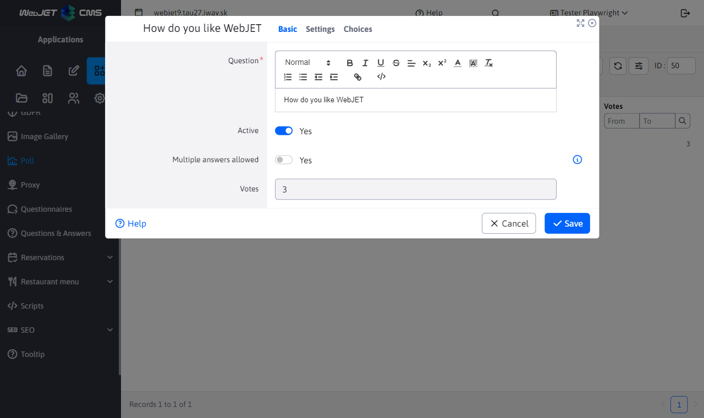

### Banner system

- Added option to set to client banner, fixed display of statistics (possibility to change dates and error if banner does not contain any statistics) (#39751-52).
- Added check for the "Show all banners" right - if the user does not have this right, only banners where he is set as a client will be displayed (#39751-52).
- Added option [set optional AF fields](frontend/webpages/customfields/README.md), which will allow you to record/display additional information if necessary (e.g. additional title/link/button text in the banner) (#39751-52).

### Gallery

- **Automatic calculation of the number of images per page** - similar to the number of rows in a data table, the number of images that can fit into the window at once is calculated based on the window size for optimal pagination (#54857).
- Text editor - improved compatibility with the old editor, text styling enabled (#39751-50).
- Author - added option to format text with author's name (bold font, link...) (#54857-4).
- **Remembering the set size** - the gallery remembers the set size of the thumbnails (```S,M,L```), or the display in the form of a table (#54857-4).
- Creating a new folder sets the View to Fit mode instead of the faulty Exact Size which distorts the aspect ratio (#54857-4).
- Image set attribute ```loading="lazy"``` to load the image only when the page is scrolled (increasing speed and reducing data volume for large galleries).
- Modified pagination (Bootstrap compatibility).
- After adding a photo, the ```EXIF``` information is removed for security reasons and also to **remove orientation (rotation)**, if ```ImageMagick``` is configured. The original photo in the editor was displayed with the rotation according to the ```EXIF``` information, but the thumbnail was not, which created a display mismatch (#54909).
- When using ```ImageMagick```, when rotating an image, the rotation information is first removed from the original ```EXIF``` to avoid differences between the original and the preview photo (#54909).
- Added option **rotate photo left/right** (originally there was only the right option), fixed option to rotate image with extension ```.jpeg``` (#39751-52).
- Added the ability to change the file name in the editor (after changing, the photo files on disk will also be renamed) (#39751-52).
- To prevent the old version of an image from being displayed in the editor, we added a random URL parameter to its path. This will cause it to be reloaded from the server every time the editor is opened (#39751-52).
- Added **Magnifier tool to zoom in/out on an image** in the editor in the Area of ​​Interest tab (#54953-3).

### Statistics

The [Statistics] application (redactor/apps/stat/README.md) has been completely redesigned to a new look. The [editor's manual] (redactor/apps/stat/README.md) has been supplemented with a description of individual statistics (#54497, #54585).


- Added the option to set a specific folder for displaying statistics (#54953-3).

### Reservations

Reservations app and reservation object list redesigned to new visuals. [Editor's manual](redactor/apps/reservation/reservations/README.md) added (#54701).


### Search

- ```Lucene``` - ​​added support for Czech, English and German languages. For these languages, the standard parser is used and ```stemmer``` available directly in ```Lucene``` (```org.apache.lucene.analysis.JAZYK```).
- ```Lucene``` - ​​when indexing web pages, the language of the web page is taken into account (according to the language of the folder or template). Only pages in the same language as the created index are added to the index.

### Data tables

- **Remembering the set number of records per page** - if you set a value other than automatic, the table will remember the set number of records per page (#39751-50).
- Pagination - **increased number of pagination numbers** in the table footer. For main tables and screen widths greater than 800 points, the number of pagination items is calculated based on the table width (originally 7 items) (#39751-50,54857-4).
- ```Quill``` - ​​simple HTML editor - extended options of the simple HTML editor (used e.g. in the gallery, questions and answers...) - added superscript/subscript settings, colors, alignment, ability to edit HTML code (#54857-4).
- Added configuration option [onPreXhr](developer/datatables/README.md) for the ability to add URL parameters for REST service calls. Used if there is a special filter on the page, such as in statistics (#54585).
- Added configuration option [defaultSearch](developer/datatables/README.md#configuration-options) to initialize the search before the first REST service call (used in the Statistics application to remember the entered from-to dates between individual statistics pages) (#54585).
- Added option to set the value ```null``` (specified as a string) in the select field (for the setting/filtering option ```null/true/false```) (#54701).
- Added field type ```TIME_HM/TIME_HMS``` for [selection of hours and minutes](developer/datatables-editor/standard-fields.md#time_hm-a-time_hms) (and optionally seconds) (#54701).
- Import - added **display of line number on error** even if the imported entity does not inherit from ```ActiveRecordBase``` (#39751-53).
- Import - added removal of spaces at the beginning and end of the value in the cell (to avoid, for example, an import error due to an incorrect email address) (#39751-53).
- Import - added display of import progress in %, added indicator icon for the import button (#39751-53).

### Safety

- Updated library ```Spring Security``` to version ```5.6.+``` (#39751-50).
- Updated JavaScript libraries (#54857-4).
- Fixed a possible XSS vulnerability in auditing (#54857-4).
- User registration - added JavaScript check for the Repeat password field so that the form cannot be submitted if it does not match the Password field.
- Added option to use **Google reCaptcha v3**.

### API access

- Added the ability to call REST administration services programmatically from an external system (#54941).
- [Login using API key](custom-apps/spring/api-auth.md) sent in the HTTP request header.
- The API key is generated in the profile of the respective user, by entering the character ```*``` a random API key is generated.

### Other minor changes

- Administration - left menu - when clicking on an item that is low in the menu, the menu will be moved up when the page loads so that the item is visible and any second-level menu items are displayed (#54701).
- Loading animation - added option to display [loading animation](developer/frameworks/webjetjs.md#loading-animation), e.g. during graph generation (#54585).
- Banner - added option to set [campaign URL parameter](redactor/apps/banner/README.md#banner-type-content-banner) and display the banner only during the campaign.
- Dialogs - modified the visual of dialogs of older parts (e.g. application settings, dialogs in the page editor) to the new header and tab style (#39751-52).
- Domain redirection - fixed obtaining domain alias when detecting ```xsrf``` (it is no longer necessary to add the domain to the config variable ```xsrfReferers``` when creating a domain alias).
- Easy form - added detection of ```check_form``` insertion to check filled fields. If it is already present on the page (there is an object ```checkFormLoaded```), the script for its insertion will not be inserted unnecessarily (#54393).
- Easy form - modified tooltip text display - support for Bootstrap 5, replacing the incorrect ```.popover``` with ```.tooltip``` (#54393).
- Easy form - modified field ID generation for select and checkbox fields so that you can correctly click on the text and select the appropriate option (#market-245).
- Easy form - **set minimum field width in row view** so that on mobile phones, fields are displayed full width and not side by side (where they are too small) (#54857).
- Bulk email - added email address check (validation) when logging in/out of bulk email.
- Bulk email - added option **enter multiple email addresses in unsubscribe email dialog** (#39751-53).
- Bulk email - added duplicate check when entering unsubscribed email addresses (#39751-53).
- Bulk email - fixed an error when adding an email to a campaign if the email is on the unsubscribed email list. Instead of an error, the addition is considered correct and continues to the next record (#39751-53).
- Files - added option to use [external directory for files](frontend/setup/README.md) as part of web application. It is set as config variable ```cloudStaticFilesDir={FILE_ROOT}static-files``` which sets files to be stored for each domain separately in folder ```static_files``` in the root folder of web application (#39751-47).
- Templates - added Folders and Web Pages tab in the editor with **list of folders and pages using the displayed template** (#54693).
- Structure mirroring - the order of the root folders will no longer be synchronized so that their order can be set in the administration (e.g. first Slovak and second English).
- Added API function [WJ.prompt](developer/frameworks/webjetjs.md#get-value) for getting a value from the user (e.g. password for confirming deletion, etc.) (#54701).

### Documentation

- Created documentation and optimized project ```basecms``` for setting [debug mode](custom-apps/vscode/debugging/README.md) in VS Code for both Java and JavaScript files (#54393).
- Added documentation for setting the [campaign URL parameter](redactor/apps/banner/README.md#banner-type-content-banner) and displaying the banner only during a campaign.
- Added documentation for [Thymeleaf](frontend/thymeleaf/webjet-objects.md) template objects (```${ninja.temp.baseCssLink},${ninja.temp.cssLink})```.
- Documentation created for the [statistics] application (redactor/apps/stat/README.md) (#54497).
- Added documentation in the Programming of customer applications section to the option of attaching a JavaScript module to the application as [item in the admin section](custom-apps/admin-menu-item/README.md#attaching-javascript-file) (#54585).
- Created documentation for the editor for the [reservations](redactor/apps/reservation/reservations/README.md) and [reservation objects](redactor/apps/reservation/reservation-objects/README.md) applications (#54701).
- Documentation created for Programming Customer Applications - [Token Authorization](custom-apps/spring/api-auth.md), [Securing REST Services](custom-apps/spring/rest-url.md), documentation added about setting up [SpringSecurity](custom-apps/spring-config/README.md#springsecurity-settings) (#54941).
- Statistics - added information about storing statistics [without GDPR consent](redactor/apps/stat/README.md) (#54709).
- Page attributes - documentation created for [defining attributes](redactor/webpages/doc-attributes/README.md) (#54709).
- Created documentation for the editor for the [gallery] application (redactor/apps/gallery/README.md) (#54953-4).

### Testing

- Websites - added tests for filling in website fields, time publishing, duplication, history display, editor notes, template selection, etc. (#52996).
- Automated tests - converted call ```I.isFirefox/I.isChromium``` into a separate ```Page``` object ```Browser```. So the calls are ```Browser.isFirefox()/Browser.isChromium()/Browser.getBrowserType()``` (#MR302).
- Automated tests - converted call ```I.wjDocsScreenshot``` into a separate ```Page``` object ```Document```.
- Gallery - added test for remembering the set image size and displaying HTML text in the description and photo author (#54857-4).
- Translation keys - added search test by begins/ends with and equals (#54857-4).
- Added ```DT.checkTableCell, DT.checkTableRow``` functions to test a value in [a table cell and an entire row](developer/testing/README.md#webjet-additional-functions).
- Added generation of [code coverage] report (developer/testing/codecoverage.md) during testing (#54909).
- Changed the method of visual comparison of images from [Resemble](https://codecept.io/visual/#visual-testing) to [pixelMatchHelper](https://github.com/stracker-phil/codeceptjs-pixelmatchhelper), which can also be used when running tests in parallel (#54909).
- Added the ability to run [tests in parallel](developer/testing/parallel.md) for faster execution (#54909).
- Added option [test REST services](developer/testing/README.md#testing-rest-services) (#54941).
- Added ```Document.screenshotAppEditor(docId, path, callback, width, height)``` function to create a snapshot of the application settings (#54953-4).

### Bug fixes

- Banner system - fixed display of the Visible attribute when opening the editor window in the data table (#54857).
- Banner system - fixed display of the banner list, only the first 20 banners were displayed incorrectly (#54697).
- Datatables - fixed (unnecessary) saving of table state if it has a configuration option to sort by a certain column. The table state is possible up to 800ms after its initialization, when it is assumed that the user will perform an action.
- Datatables - fixed display of the name of the object to be deleted if it is a ```GroupDetails``` object (#39751-53).
- Forms - fixed display of the list of completed forms if the field (column) name contains a parenthesis character (#39751-52).
- Bulk email - added email address validity check when importing recipients, if it is invalid an error message is displayed. Spaces are removed from the email before import (#39751-51).
- Media - fixed rights check when editing existing media on a page (#39751-52).
- Server monitoring - fixed display of translation texts (#39751-52).
- Translation keys - fixed key search by starts with, ends with and equals (#54857-4).
- Templates - fixed loading of header/footer/menu selection list, filtering by template group (name match vs contains), filtering by spam protection and number of uses (#54857-4).
- Statistics - fixed loading of data from the beginning of the year - problem with week number on year transition (#39751-53).
- Web pages - fixed saving of the field ```Odverejniť stránku po tomto dátume``` (#52996).
- Websites - fixed domain setting after login if the current domain does not match the domain selection field (#39751-47).
- Websites - fixed the possibility to enter a URL containing the @ character without it being considered an email address (e.g. a link to a TikTok profile).
- Web pages - fixed pagination in the editor in the Media tab (#39751-54).
- Websites - fixed the ability to duplicate a folder (54953-3).

### For the programmer

- Added function ```WJ.confirm``` for [getting value](developer/frameworks/webjetjs.md#getting-value) (#54701).

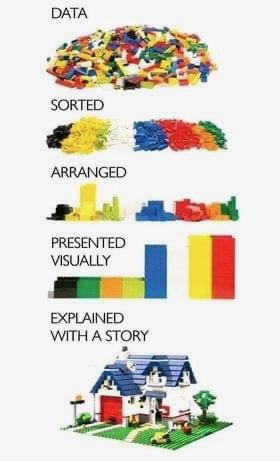

## 2022.40

> Version 2022.40 is focused on **improving security**. It contains updated Java and JavaScript libraries and checked vulnerabilities. It also brings a number of other changes to **improve work based on feedback** - remembering the last folder in web pages, remembering column order and arrangement in data tables, the ability to scroll the window, etc. It subtly **adjusts the user interface design** (newer icon set, softer menu colors).

Significant changes in this version:

- Security
  - Updated Java and JavaScript libraries, updated VueJS from version 2 to version 3.
  - Changed the ```hashovania``` password algorithm to the [bcrypt] standard (sysadmin/pentests/README.md#password-hashing-algorithm).
  - All error logs ```Stack Trace``` are routed through ```Logger```, so they will also appear in the [Latest logs] list (sysadmin/audit/memory-logging.md) in the Audit section.
  - Added the ability to generate an HTTP header ```Access-Control-Allow-Origin``` to secure access to REST services.
- Data tables
  - Added dynamic counting of the number of lines per page based on the size of the browser window.
  - Added ability to move the editor window.
  - Added remembering [column order and arrangement method](redactor/datatables/README.md#remembering-arrangements) of the table.
  - Added [keyboard shortcut](redactor/datatables/README.md#keyboard-shortcuts), ```CTRL+S/CMD+S``` to save a record to the database without closing the editor window to continue working.
- Website
  - Page Builder - added [screen size toggle](redactor/webpages/pagebuilder.md#column-width-setting) to set column width for desktop, tablet and mobile.
  - Added the option to view [preview of the complete web page](redactor/webpages/editor/README.md#preview-page) without saving it.
  - The website list remembers the last viewed folder (tree structure) within a single login; when you return, the folder will be expanded again.
- Applications
  - Redesigned to new design: Mass Email, Event Calendar/List and Types.
  - Easy form - added option to generate forms with multiple fields in one line and field type Picklist - select.
  - Search - added weights for page title (weight 20) and headings (weight 10) to allow results to be sorted with priority for pages where the search term is in the title or heading.

Below you will find a complete list of changes in this version.

<div class="video-container">
    <iframe width="560" height="315" src="https://www.youtube.com/embed/ZJGYsQo-_Q4" title="YouTube video player" frameborder="0" allow="accelerometer; autoplay; clipboard-write; encrypted-media; gyroscope; picture-in-picture" allowfullscreen></iframe>
</div>

### PageBuilder

- Adjusted the display of frames around elements - they are not displayed and especially hidden immediately, but are animated. This improves the usability of clicking on the gear button, which does not disappear immediately when you move the mouse slightly outside the frame (#54345).
- After closing the window, the page preview is deleted so that the previous version/web page does not flash when the window is reopened.
- When deleting all cards or ```accordion```, a + button will appear to add a new item. This allows you to correctly delete all elements and then add them again.
- When deleting all sections (blocks) from a page, a blue + button will appear to add a new item.
- Added CSS style ```pb-col``` and ```pb-col-auto``` for the option to set columns that [cannot be set in width](frontend/page-builder/settings.md#column-green-color).
- Added [screen size switching](redactor/webpages/pagebuilder.md#column-width-setting) for desktop, tablet and mobile. Allows you to set column widths according to the selected device (#39751).
- Editor window size increased to 1210 points wide to allow setting CSS classes ```col-xl-``` for 1200 points wide ```desktop``` (#39751).
- Added support for executing ```data-th-src``` and ```data-th-href``` attributes including ```${ninja.temp.basePathXXX}``` when inserting a block into a page (#39751-38).

### Website

- When creating a new domain, Basic Header/Footer/Menu pages are automatically created in the System folder for setting up the header/footer and menu.
- When creating a folder, the empty URL address field is automatically set to the two-letter language code (e.g. ```sk```) for names ```Slovensky, English, Deutsch a Česky```.
- If there is both a local (for the domain) and a global (with no domain set) System folder, only the local one will be displayed in the list of websites (so that two folders with the same name that cannot be distinguished at first glance are not displayed).
- In the folder properties, groups are divided for access restriction and mass e-mail, just like in the web pages (#54493).
- Added the ability to view [preview of the complete web page](redactor/webpages/editor/README.md#preview-page) without saving it (#54513).

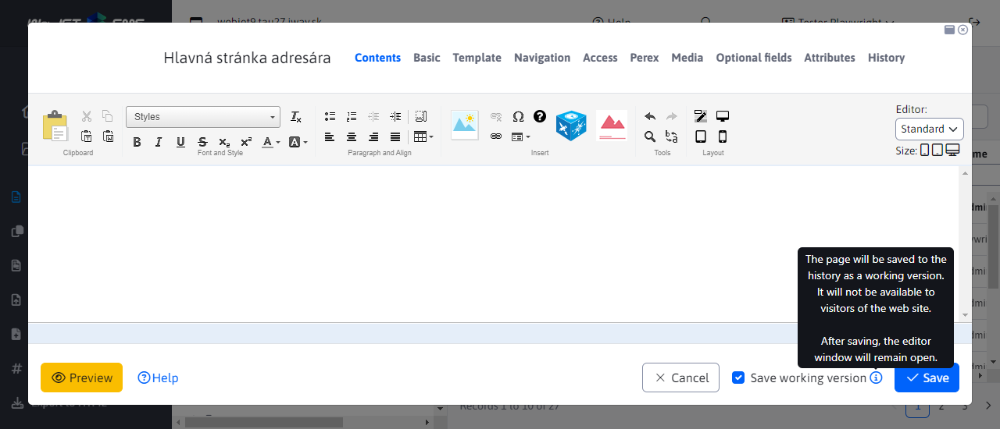

- Added option in the tree structure [show directory ID, sorting order and also list of web pages](redactor/webpages/README.md#settings-display-tree-structure) (for drag&drop purposes) (#54513).
- Added search for header/footer/menu language mutation (searching for page ```LNG-meno```) when setting the directory language even if the local ```System``` folder is not used (#39751).
- Adjusted the size and position of the application properties window - the window is centered and the maximum size is calculated based on the available area (#39751).


- Modified retrieval of [list of CSS styles for the selection field in the editor](frontend/examples/template-bare/README.md#zoznam-štílov-pre-editor) - if a minified CSS file is set in the template, its non-minified version is searched. At the same time, when reading the CSS file, the search ends after finding the ```@media``` expression, which typically means that no styles are found when inserting ```bootstrap``` at the beginning. The new code searches the CSS file again and looks for the ```/* editor */``` comment. If it is found, the definition from the previous line is used (#39751-35).

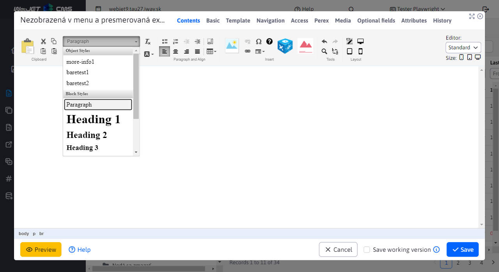

- In the page editor, in the Template tab, menu pages have been added to the list for free objects (originally, only the list for headers and footers was displayed) (#39751-36).
- If the page has the option "Automatically generate URL from menu item name" set and a page with the same URL/name already exists (e.g. in the trash), the message "The specified virtual path is already used on the page" will be displayed only when the page is created, and then the address with the serial number at the end will be used.
- The System and Recycle Bin tabs will not be displayed if the user does not have permission to any folder or page in these tabs (#39751-39).
- Added display of folders in the tree structure according to rights to specific pages. In the list of pages, only pages to which the user has rights will be displayed in the folder (#39751-39).
- The [History] tab (redactor/webpages/history.md) now displays the scheduled publication date of the page, and the records have been reorganized so that scheduled events are at the top of the list (#54513-15).
- History - added the ability to delete a scheduled change in a website (#54513-15).
- Added [Folders tab](redactor/webpages/README.md#karty-web-stránok) to the datasheet. Allows you to use datasheet functions such as bulk operations, cell editing, and duplicating to a folder tree structure (#54797).

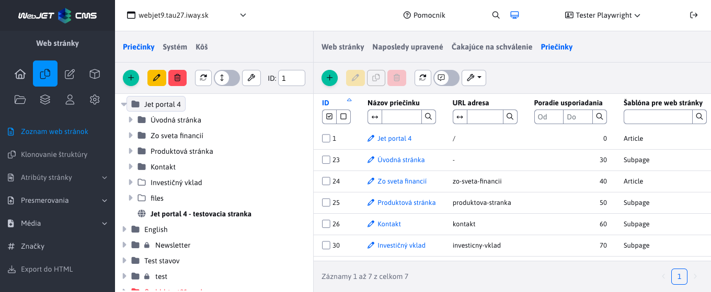

- Remembering the last opened folder - the website list remembers the last opened folder within a single login, when returning to the website list, the folder will be opened again (#39751-45).

### AB testing

- Added option to create a B version of the page for AB testing application
- Created [editor documentation](redactor/apps/abtesting/README.md).


### Templates

- [Thymeleaf templates](frontend/thymeleaf/tags.md#implementation-include-tags) added the option to preserve the wrapper element by setting the ```data-iwcm-remove``` attribute to maintain a structure consistent with prototyping and the ability to use elements as ```header, article, footer```.
- Modified template and template group editor - better division of fields into tabs.
- Template groups - added Metadata language switcher, fixed Czech translation settings, fixed ```Generator``` field settings (#39751).

### Form easily

- Added option to display individual fields in a row (i.e. fields are displayed next to each other, not below each other). Added New Row field for creating a new row and Empty Cell for inserting empty space in a row. Fields in a row will automatically have the same amount of space in the row.
- If the Placeholder Text field is specified but the Value field is empty, the field name will not be displayed above the field, only the placeholder text will be displayed. This allows you to create a form that takes up less space.

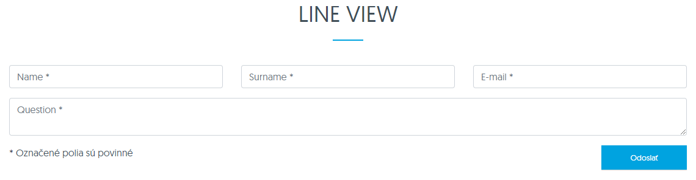

- Added option [create groups of fields](redactor/apps/formsimple/README.md#Items), e.g. selection fields and checkbox fields. The ```|``` character is used as a separator, or the ```,``` character or a space. The ```|``` character must be used if one of the options should contain a comma.

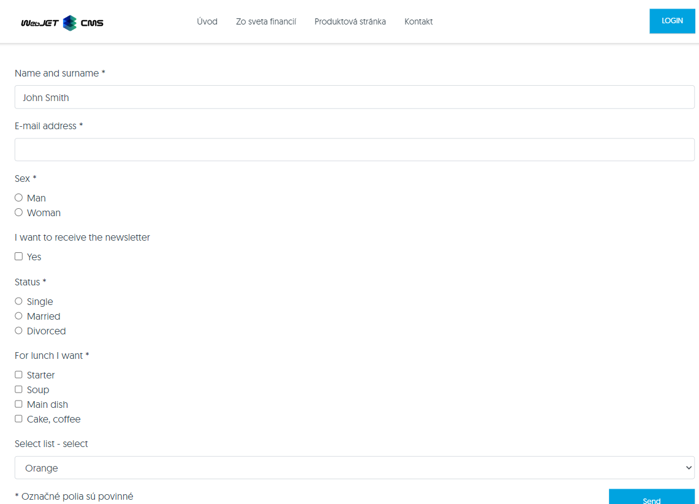

- Added the Select list field type - select, individual values ​​are separated by the ```,``` character, it is possible to enter different text and a value in the form ```Pomaranč:orange,Jablko:apple```.

### Forms

- Modified data filtering to allow searching in all columns (the original version did not allow searching in any column).
- Extended [export options](redactor/apps/form/README.md) - added option to export filtered data, not yet exported and also marked rows (#54513).

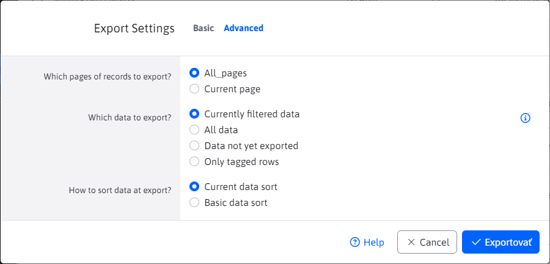

- A preview of the completed form will be displayed in the dialog box for a single selected row. If multiple rows are selected, each form will be displayed in a new tab for easier comparison (#39751-40).

### GDPR

- Cookie Manager - adjusted styles for Bootstrap standard, buttons changed from link to standard button to avoid clashing link and button colors in footer (#54345).
- Search - added links to view details of the found record (#54513).
- GDPR Cookies - added option to display the cookies bar in the specified language, set with the parameter ```lng``` (#39751).

### Bulk email

The application has been redesigned to a new visual. Added the option to set the start of the campaign sending. Importing recipients is possible from the ```xlsx``` format, by selecting a user group, or by entering email addresses.


- Added a simpler form for mass email registration (only displays the field for entering the email address). It registers to all email groups that have the ```Povoliť pridávanie/odoberanie zo skupiny samotným používateľom``` and ```Vyžadovať potvrdenie e-mailovej adresy``` options enabled. It does not contain the ```captcha``` element either, therefore the email address confirmation is required. The form uses ```Bootstrap v5``` to display the form and dialog box.
- Documentation has been created describing how [sending mass emails] works (redactor/apps/dmail/campaings/how-sender-works.md).
- Added Preview tab to the editor showing the selected email page. If the page uses inline editing/PageBuilder, it can also be edited (#39751-44).

### Event calendar

- Event list redesigned with new visuals and data tables. [Editor's manual](redactor/apps/calendar/README.md) (#54473).
- Event type configuration reworked into new visual and data tables. [Editor's manual](redactor/apps/calendar/calendar-types/README.md) prepared (#54473).

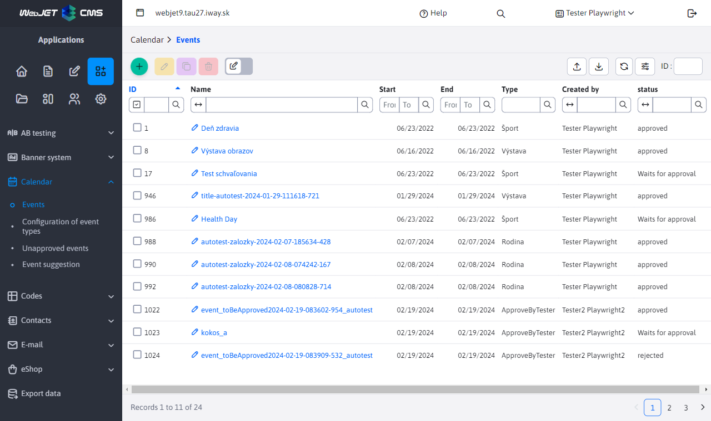

### Users

- In the list of user groups in the editor, the Users tab has been added with a list of users in the edited group (#54493).
- In the user group list, loading of the list of web pages for server paging has been modified (#54493).
- Filtering by user groups is now possible in the user list (#54493).

### Search

- ```Lucene``` - ​​modified indexing - the page title is indexed with a weight of 20 (whereas the title is indexed in both its original form and its basic form via ```Lemmas```), all headings are retrieved from the page and used with a weight of 10. To display the results, it is necessary to set ```orderType="score"```, which will then sort the results according to the number of points achieved.
- ```Lucene``` - ​​modified search - the entered text is first converted to the basic form (so-called ```Lemmas```) and only then is it searched.

### Data tables

- Selection field with editing option - increased the size of the editing window to the same size as the web page editing for better responsive display (e.g. when editing the header from template editing) (#54345).
- Added the ability to import and export from nested tables (it will be displayed correctly above the open editor window with the correct blackout) (#54377).
- Added method to apply specific search parameters even on [first (complete) table load](developer/datatables/restcontroller.md#filtering-when-displaying-all-records) (calls ```addSpecSearch``` when calling ```getAll```). Just call method ```getAllItemsIncludeSpecSearch``` in your ```getAll``` implementation (#54493).
- Added the ability to export data in ```CSV``` format (#54513).
- Added [MULTISELECT] field type (developer/datatables-editor/standard-fields.md) (#54273).
- Adjusted the size of the Status column so that it does not unnecessarily take up the width of the table (#54273-26).
- Added captions for the icon to maximize the editor window, added a button to close the window in the header (#54273-26).
- Added dynamic counting of the number of lines per page based on the size of the browser window (#54273-26).


- Added [keyboard shortcut](redactor/datatables/README.md#keyboard-shortcuts), ```CTRL+S/CMD+S```, which saves the record to the database, but also leaves the editor window open (#54273-26).
- Import - in case of an import error, the error message displays the line number and a detailed list of errors (#39751-39).
- Added option ```tab.hideOnCreate``` and ```tab.hideOnEdit``` to hide [tabs in the editor](developer/datatables-editor/README.md#tabs-in-the-editor) for new record and editing of existing record (#54749).
- Added [name of edited item](redactor/datatables/README.md#display-name-in-window-header) in the editor header and list of items in the delete confirmation dialog (#54753).


- Improved visual consistency of old tables generated via ```displaytag``` and via older version ```DataTables```. Pagination is shifted to the right, line spacing and mouse over lines are (#39751-42).
- Added option to set tab to [full editor window height](developer/datatables-editor/README.md#tabs-in-editor) (#39751-42).
- Added [move window](redactor/datatables/README.md#move-window-option) editor (#54513-21).
- Added remembering [column order and arrangement method](redactor/datatables/README.md#remembering-arrangements) of the table (#54513-22).

### Language mutations

- Fixed loading of administration in a language other than Slovak.
- Searched pages for the occurrence of static texts without translations, texts replaced with translation keys.
- Added translations for Czech and English.
- Added the ability to use parameters for using translation [keys in JavaScript files](developer/frameworks/jstranslate.md#frontend-library).

### Safety

- Updated spring libraries to 5.6.5 and thymeleaf to 3.0.15.
- Changed algorithm ```hashovania```, [passwords to bcrypt](sysadmin/pentests/README.md#password-hashing-algorithm).
- Added [rights check when viewing a page](developer/frameworks/thymeleaf.md#rights-check) in the administration (originally only REST service calls were checked). It is based on finding a URL address in the menu and then obtaining rights for that URL address. This is then verified with the rights of the logged in user (#54649).
- When [testing datatables](developer/testing/datatable.md#testing-rights) it is mandatory to enter the option ```perms``` for rights testing.
- Calling the script ```/admin/mem.jsp``` is only allowed for IP addresses set in the config variable ```serverMonitoringEnableIPs```. Originally, the script was always available (used for basic monitoring), but it displays potentially sensitive data.
- Supplemented documentation [Security tests for operation](sysadmin/pentests/README.md) with additional solutions to security findings and settings for not displaying detailed error and version ```Apache Tomcat``` (#43144).
- Removed the ability to directly display the JSP component ```/components/user/logon.jsp```. When accessing a password-protected file, the redirection to ```logon.jsp``` is no longer performed, but the internal ```forward``` is performed, so the URL address remains the original. If necessary, we recommend using the conf. variable ```fileAccessDeniedDocId``` to set the page ID for displaying the login when accessing the file and setting the correct page ID for logging in to the website folder (#43144).
- Modified redirection when using ```//``` characters in the URL address - domain and port are preserved (absolute address with domain is not used) (#43144).
- Discussion/Forum - AJAX call ```/components/forum/new.jsp``` is only possible after displaying the discussion forum, this page cannot be called if the website does not contain a discussion (#43144).
- Modified the call ```/topdf``` to display a 404 error instead of an empty PDF in case of a page not found, also handled page redirection (#43144).
- Removed old version ```jquery.cookie.js``` in GDPR application - replaced with version in ```_common``` directory (#43144).
- Updated Spring libraries to version ```5.3.+```, ```Amazon AWS``` to 1.12.+ and ```Jquery UI``` to 1.13.2 (#546734).
- Updated ```Vue.js``` from version 2.6 to version 3.2.37, ```vue-router``` to version 4.1 and ```vue-advanced-cropper``` to 2.8.
- Updated all JavaScript libraries for ```/admin/v9/``` (#54721-3).
- Updated FontAwesome (icons) to version 6 (#54721-3).

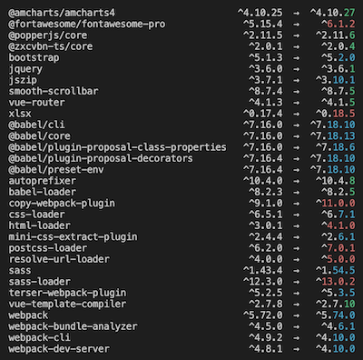

- All ```Stack Trace``` error logs redirected from standard output via ```Logger```. They will therefore also appear in the [Recent Logs] list (sysadmin/audit/memory-logging.md) in the Audit section (#54269).
- Added option to generate HTTP header ```Access-Control-Allow-Origin```, set in config variables ```accessControlAllowOriginValue a accessControlAllowOriginUrls```. By default, the header is generated for URLs starting with ```/rest/,/private/rest/,/admin/rest/```.
- Updated library ```org.json``` on 20220924.

### Other minor changes

- Banner system - added option to filter banners by viewable - checks not only the active option, but also restrictions on the number of views/clicks and date restrictions (#39751-44).
- Banner system - added button to display banner statistics, added tab with statistics to the editor (#39751-44).
- Mass email - when obtaining the HTML code for a mass email, jQuery will not be inserted into the page, which is unnecessary for the email version.
- Performance optimization - optimized loading of the template list - modified retrieval of a template group, data of individual objects (pages) is loaded dynamically only when needed (#53273).
- Questions and Answers - added SPAM control and the ability to display a Captcha image (by adding the value ```,qa``` to the conf. variable ```captchaComponents```). It is not checked if the administrator is logged in.
- Search in administration - searching after clicking on the page name will open the editor in a new window (originally it opened the old version of the editor in a popup window) (#39751-44).
- Introduction - added translations of the Applications section adapted for WebJET and News in WebJET. The list of news is read from an external server and is therefore updated without updating WebJET itself. This allows users to see the list of changes even in a version they have not yet deployed (#39751-45).

### Documentation

- Created documentation for the [sample Bare template](frontend/examples/template-bare/README.md) for the frontend programmer.
- Created documentation for the editor - [Bulk email campaigns](redactor/apps/dmail/campaings/README.MD) and [Login form](redactor/apps/dmail/form/README.md).
- Documentation has been created describing how [sending mass emails] works (redactor/apps/dmail/campaings/how-sender-works.md).
- Created documentation for the editor for the [form list] application (redactor/apps/form/README.md).
- Created documentation for [preview of the complete web page](redactor/webpages/editor/README.md#preview-page) without saving it for the editor and also for the [programmer](developer/apps/webpages/README.md#preview-page).
- Created documentation on using [specific JavaScript](developer/frameworks/README.md#webpack) file for embedding into pug file.
- Added documentation for the option to add a button to the [datatables editor](developer/datatables-editor/README.md#Special-buttons).
- Created documentation for the editor for the [AB testing] application (redactor/apps/abtesting/README.md).
- Created developer documentation for using [persistent user settings](developer/frameworks/webjetjs.md#persistent-user-settings)
- Created documentation for the editor for the Event Calendar application - [Event List](redactor/apps/calendar/README.md) and [Event Type Configuration](redactor/apps/calendar/calendar-types/README.md) (#54473).
- Created developer documentation with a list of [field types for DataTables editor](developer/datatables-editor/standard-fields.md) (#54273).
- Added documentation for web designers describing how to [add styles to a selection field in the editor](frontend/examples/template-bare/README.md#style-list-for-editor) (#39751-35).
- Created a demo and documentation of [file upload](custom-apps/spring-mvc/admin-with-upload.md) and [import from Excel](custom-apps/spring-mvc/admin-excel-import.md) for the customer application programmer (#54449).
- Supplemented documentation [Security tests for operation](sysadmin/pentests/README.md) with additional solutions to security findings and settings for not displaying detailed error and version ```Apache Tomcat``` (#43144).
- Administration Help link directed to the main documentation page, or to a specific page (if it already exists) instead of directing to the old documentation for version 8 (#39751-40).
- Created Audit documentation with [description of audit record types](sysadmin/audit/README.md) for operation (#54269).
- Added documentation for programmers about [using field validation](developer/datatables-editor/datatable-columns.md#validations) (#54597).
- Added documentation for the editor - [Web pages - web page tabs](redactor/webpages/README.md#web-page-tabs) (#54797).
- Added documentation for setting [security HTTP headers](sysadmin/pentests/README.md#http-headers).

### Testing

- Modified automated data table testing - after deleting a record, the table is restored and checked again whether the record was deleted (if, for example, a cache deletion error occurred) (#54513).
- Created a test for setting up the tree structure display ```jstreesettings.js``` (#54513).
- Scripts - added test for checking script insertion into a page according to structure and date conditions (#39751).
- Template groups - added test for storing and displaying metadata on the page, verification of storage according to language mutation (#39751).
- Page Builder - created a test for switching between Page Builder and Standard modes (#39751).
- Datatable - added test for maximizing the window, closing it by clicking the icon in the header, and dynamically calculating the number of rows on the page (#54273-16).
- Web pages - added test of saving the page using the CTRL+s/CMS+s keyboard shortcut (#54273-16).
- When [testing datatables](developer/testing/datatable.md#testing-rights) it is mandatory to enter the option ```perms``` for rights testing.
- File rights check - added test ```links.js``` to verify entering login details when accessing a file in the basic version even with a nice login page displayed.
- Added tests for displaying media (```media.js```) on the website, including tests for website change dates (#54689).
- Updated ```CodeceptJS``` to version ```3.3.5```, Chromium to version 105, Firefox to version 103 (#54721-4).
- Added test for checking rights to edit config variables (limited rights) (#54749).

### Bug fixes

- Selection field with editing option - fixed closing of window when editing header from template where a third window is open, e.g. for media editing (#54345).
- Improved ckeditor size setting when displayed from a select box with edit option (#54345).
- Fixed loading of translation files in a language other than SK.
- Fixed the function of restarting WebJET by clicking on the menu in the Control Panel.
- Fixed search in a nested data table - after entering an expression and pressing Enter, the search was not started but all rows were selected (#54493).
- Fixed alphabetical ordering in the main menu in the Applications section (correctly handles diacritics) (#53273).
- Templates - fixed getting the currently set HTML template when editing. Even if it does not exist on disk, it will be kept in the list of available HTML templates (#53273).
- Templates - fixed setting of the ID of the blank page in the template (it was incorrectly set to -2, which is used in web pages instead of the value -1) (#53273).
- Server Monitoring - fixed disk space size tooltip (#54513).
- Scripts - adjusted display of Script tab to make it clear that it contains a text area (#54513).
- Templates - fixed restoring ```cache``` memory after deleting a template.
- PageBuilder - added removal of CSS classes and HTML code in PageBuilder if the code is incorrect (e.g. nested ```div.section``` into ```div.section```), or some tool is left open (e.g. setting column width) (#39751).
- Scripts - fixed inserting scripts into a page that do not have restrictions set (#39751).
- Firefox - added holding of window position when clicking on an application in the editor in Page Builder mode (Firefox incorrectly moved the window to the very bottom, or to the place where the cursor is) (#39751).
- Web pages - fixed looping when opening a web page if the value is ```domainName```, ```NULL``` (#39751).
- Gallery - fixed the option to close the file upload dialog, fixed an error when saving an image, where the change in the editor was saved even after clicking cancel (#39751).
- Gallery - fixed duplicate entry - file/photo is also copied correctly. The name is set according to the name in the Description tab, or the existence of the file is tested by adding the number 1-100 to the end of the file name.
- Web pages - added tree structure refresh if web pages are also displayed when changing name, order, display status, folder and external link (#39751).
- Web pages / data tables - fixed editing multiple records at once - ```fetch``` from the server was originally only executed on the first record, fixed to be executed on all marked records. A bug caused the text ```data not loaded``` to be saved in the body of the web page when editing multiple web pages (#39751-36).
- Sitemap - fixed display of ```/sitemap.xml``` (#54637).
- Web pages - added API functions ```openLinkDialogWindow``` and ```openImageDialogWindow``` from version 8 to open a link/image selection dialog, e.g. in a button dialog (#39751).
- Banners - fixed error setting ```domainId``` in single domain installations according to compatibility with version 8 (#54645).
- Banners - fixed search error based on banner activity (#39751-44).
- Media - fixed permission settings for displaying the Media application in the page editor (#39751).
- Media - when editing via Manage all media, the date of the last change of the media will be preserved so that it continues to be displayed on the website (typically, media older than the last save date of the assigned website will only be displayed). For new media, the date and time will be set to the date and time of the last save of the specified website (#54689).
- Video player - added support for ```Bootstrap 5``` - ​​setting CSS style ```ratio ratio-16x9``` for correct aspect ratio of displayed video (#39751-39).
- Datatables - when maximizing the window, the delete confirmation was also displayed maximized, which did not look good. Modified so that when displaying the record deletion confirmation, the maximizing is canceled (#39751-39).
- Page Builder - fixed template setting when creating a new page - it will be set according to the folder template, not the main page template (#39751-39).
- Web pages - fixed opening of a page after entering its ID in the System folder when the ```templatesUseRecursiveSystemFolder=true``` setting is enabled (#54513-16).
- Datasheets - fixed cell editing after moving a column (#54513-16).
- Web pages - fixed display of author's name in data table after editing page (#54753).
- Website - fixed search by perex group (#39751-42).
- Gallery - fixed alphabetical arrangement of items in the tree structure (#39751-43).
- Gallery - fixed image editor size and area of ​​interest settings when maximizing the window, improved support for editing large photos (scrolling photos in the window) (#39751-43).
- Gallery - fixed editing of multi-line text in perex/annotation (#39751-44).
- Cluster - fixed deleting cache objects by calling ```Cache.getInstance().removeObjectStartsWithName``` - ​​a delete request starting with is written directly to the cluster instead of an exact list (which may be different on individual nodes) (#54273-32).
- Mass email - fixed initial recipient settings, number of recipients and sent emails when saving the campaign, non-deletion of emails if the user is in both the selected and deleted group (#39751-44).
- Datatable - fixed searching after changing column order (#43144).


## 2022.18

> Version 2022.18 adds PageBuilder integration into websites, the ability to use design templates written in the Thymeleaf framework, displaying recent messages in logs, many usability improvements based on user feedback, redesigned Forms - regular expressions, Bulk Email - unsubscribed emails applications. Bookmarks and Feedback mini-applications added to the home page.

<div class="video-container">
    <iframe width="560" height="315" src="https://www.youtube.com/embed/6IPrdHvhYrc" title="YouTube video player" frameborder="0" allow="accelerometer; autoplay; clipboard-write; encrypted-media; gyroscope; picture-in-picture" allowfullscreen></iframe>
</div>

**PageBuilder**

The Page Builder is integrated into the website editor. In this mode, the entire page is not edited, but only selected parts of it. The Page Builder separates the editing of texts/images and the page structure. This prevents you from accidentally deleting structural elements of the website when editing its text (#54349).

For newly created templates, we recommend preparing and using Page Builder blocks instead of the original HTML blocks. This will ensure better and easier editing of complex pages. Page Builder mode must be set up and enabled in the template group.

Documentation has been created for [editor](redactor/webpages/pagebuilder.md), [web designer](frontend/page-builder/README.md) and [programmer](developer/apps/webpages/pagebuilder.md).


- Added the ability to generate a random ID when inserting a block into a page by entering the value ```__ID__``` into the block code (#54345).
- Added option to not mark a section by setting CSS class ```pb-not-section```, a container by setting ```pb-not-container``` and a column by setting ```pb-not-column``` (#54345).

**Website**

Added the ability to display [action buttons](developer/datatables-editor/notify.md) in the notification. For example, if a working version of a page exists, a button to open the last working version of the page will be displayed. This way, the editor does not have to go to the History tab and click the button to edit the working version (#54375).


Added the ability to create a new header/footer/menu/free object directly when editing a web page or template, which will be used instead of the version from the template, or to edit an existing page (e.g. if you need to edit the logo or text in the footer).


- Improved creation of new domain folder. Fixed automatic creation of folder ```system``` with subfolders header, footer and menu. After creation, the page in the browser is refreshed so that the new domain is correctly reflected in the domain selection menu in the header. Added API method ```EditorFacade.createEmptyWebPage``` for easy [creation of a new page](developer/apps/webpages/api.md).
- Changed the icon for selecting Parent Folder and Redirect to a cross icon. The original pencil icon suggests that you are going to edit the given directory or redirect address, but the reality is that you are selecting an existing directory (not editing/modifying).
- The list of tags (perex groups) is sorted alphabetically regardless of font size and diacritics (#53805).
- Added home page status icon (star) and the ability to filter web pages by home page (suitable for displaying web pages from subfolders) (#54381).
- After clicking in the ID/address field, the field will enlarge for more convenient typing of the page name (#54381).

**Forms**

The regular expressions section, through which rules for checking field completion are defined, has been redesigned into a new design and data table.


Added to the form details:

- Button to preview the completed form and an "eye" icon directly in the form line for easy viewing (#54273).
- Display a link to download form files.
- Ability to enter a note on the form.
- Display of logged-in user data (off by default, set the display of columns in the table to display).
- Records the date of the last form export.
- Date the form was last filled out in the form list, sorted by this column.
- Separate display of forms by domain (```domainId```).
- Added deletion of a form record and all records (the entire form).
- Added rights check according to ```docId``` (only web page forms for which the user has permission are displayed in the list - the value of ```docId``` of the last submitted form is checked).

**Form easy**

- Added field type for uploading files (any file type), documents (files of type .doc, .docx, .xls, .xlsx, .ppt, .pptx, .pdf) and images (files of type .gif, .png, .jpg, .jpeg, .svg) (#54273).
- Added the option to set placeholder text (```placeholder```) for standard text fields. Allows you to display help text in an empty field (e.g. expected phone number format 0903xxxyyy) (#54381).

**Templates**

- Added the ability to use [Thymeleaf templates](frontend/thymeleaf/README.md) pages instead of old JSPs. This brings the advantage of better design prototyping directly in HTML code.

```html
<span data-th-text="${docDetails.title}">Titulok stránky</span>
<body data-th-class="${docDetails.fieldA}">
<meta name="author" data-th-content="${ninja.temp.group.author}" />
<link rel="canonical" data-th-href="${ninja.page.url}" />

<div data-iwcm-write="doc_data"/>
<div data-iwcm-write="!INCLUDE(/components/gdpr/gtm_init.jsp)!" />
```

- The Templates menu item has been modified so that it directly contains the Template List and Template Group List subitems (the items are moved to the first menu level).
- For the local System directory, added search for the language version of the header/footer/menu according to the directory language. If the template has the header set to ```SK-Default hlavička``` and the directory language set to English, ```EN-Default hlavička``` is searched for (the third position must contain the - character). If it exists, it is used.

**Automated tasks**

- Added the ability to manually start an automated task by clicking a button in the data table (#54273).

**Audit**

Added the ability to store the latest log messages in the server memory with an easy way to view them. The ability to retrieve log messages from another cluster node is also supported (e.g. from a CMS node you can request the latest log messages from public nodes).

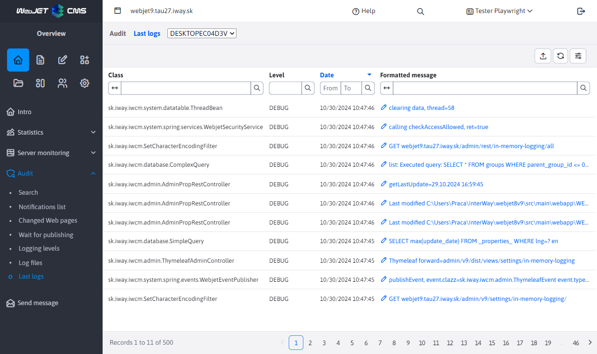

**Bulk email**

Reworked the unsubscribed emails section into the data table, created [editor documentation](redactor/apps/dmail/unsubscribed/README.md).

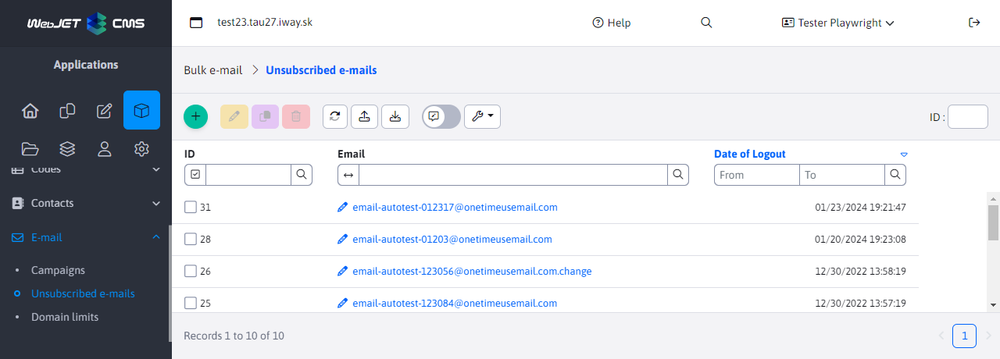

**Translation keys**

- Added a button to clear the translation key cache and reload it from the file and database. Useful if you change the translation file during operation and need to reload it (#54401).
- Added information message when attempting to delete a key located in a translation file (only modified keys located in the database can be deleted).
- Fixed arrangement of keys by ID.
- Fixed display of duplicate keys that are found in both the file and the database (the modified key from the database will be displayed).

**Applications**

Added the option [insert application into application list](custom-apps/appstore/README.md) using Java annotation ```@WebjetAppStore``` and the option to set application parameters using annotations ```@DataTableColumn```. This makes it easy to display an application in the application list, insert it into a page, and edit its parameters without additional programming (#54333).

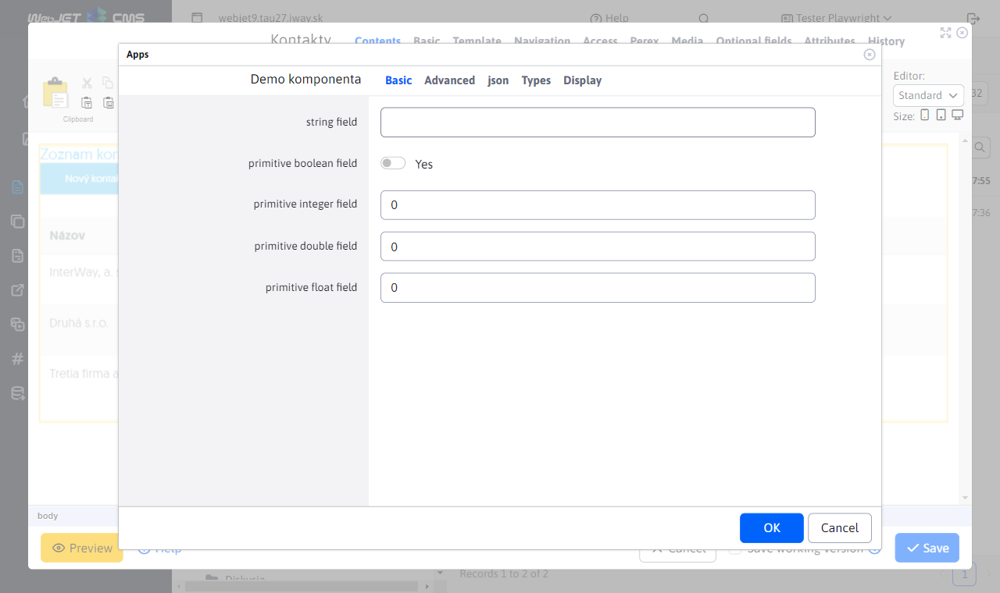

- The list of applications is arranged alphabetically in the menu. First are customer applications (in the ```modinfo.properties``` file they have the ```custom=true``` attribute), followed by standard WebJET CMS applications (#54381).

**Data tables**

- Added simplified option [settings of dials for select boxes](developer/datatables/restcontroller.md#dials-for-select-boxes) by overriding the ```getOptions(DatatablePageImpl<T> page)``` method
- Added option [do not export selected column](developer/datatables/README.md#exportimport) by setting the ```className``` attribute to the value ```not-export``` (#54273).
- Added the ability to set [select field values](developer/datatables-editor/datatable-columns.md#select-field-options) by calling a Java API method or values ​​from the dialer application.
- Fixed cell editing if the record should not be loaded from the server (condition ```fetchOnEdit``` is ```false```).
- Added checking for duplicate notification messages when calling ```DatatableRestControllerV2.addNotify```. The same repeated message is displayed only once, and the title, text, and notification type are checked for consistency.
- Added checking for open editor window when leaving a page. If it is open, a confirmation of leaving the page will be displayed when moving to another page. It does not apply to users with login names starting with ```tester``` (#54413).
- Editable Select Field allows editing and adding web pages [also from System and Trash tabs](developer/datatables-editor/field-select-editable.md). Added icon descriptions (```tooltip```) and hiding the edit icon when a web page with an ID less than 1 is selected.
- Added field type for selecting a directory on the file system using [json field type](developer/datatables-editor/field-json.md#options-classname) and value ```className='dt-tree-dir-simple'``` (#54433).
- Added option [enter empty value](frontend/webpages/customfields/README.md#select-field) for optional fields of type select field (#53805).
- Adjusted the [displayed columns in the datatable] setting (redactor/datatables/README.md#column-display-settings). The display is columnar, in addition to the column name, it also contains the name of the card in the editor, a possible title and help text. This makes it easier to identify the necessary columns (#54381).


- Added option to maximize editor dialog (#54381).
- After clicking the save button in the editor, the animation will also be displayed directly on the button (not just at the top of the window) for a clearer indication (#54381).

**Introduction**

Added [mini application Bookmarks](redactor/admin/welcome.md?id=záložky), where you can add links to frequently used sections from WebJET CMS. After logging in, you don't have to look for a section in the menu, but you can go directly to your favorite section in the bookmarks.


Added [mini application Feedback](redactor/admin/welcome.md?id=spětná-vázba) through which you can send your feedback, comment or praise about WebJET CMS to us programmers. We will assess your comments and add them to the [development map](ROADMAP.md). You can also use your opinions to improve the functioning of WebJET CMS.


Added a drop-down menu in the header when clicking on the name of the logged-in user. Contains options:
- Profile - edit your own profile (name, email... - after changing your profile, you need to log out and log in again).
- Two-step verification - the ability to activate two-step verification using the ```Google Authenticate``` application when logging into the administration. This increases the security of your account, because in addition to your password, you also need to enter a code from your mobile device to log in. We recommend setting it up for all accounts through which user accounts and rights can be managed.
- Manage encryption keys - allows you to create a new encryption key for encrypting forms and enter an existing key for decrypting them. Requires the Forms right.
- Logout - log out of the administration.

The todo application, which has not yet been implemented, is not yet displayed on the home page (#54381).

**Other changes**

- Added the ability to use [Thymeleaf templates](custom-apps/spring-mvc/README.md#frontend) for Spring MVC applications.
- Menu - the menu application also generates classes ```nav-item,nav-link,dropdown,dropdown-toggle``` when setting the parameter ```classes="bootstrap"```.
- Optional fields - added a field for [directory selection](frontend/webpages/customfields/README.md#filesystem-directory-selection) on the filesystem (#54433).


- Server monitoring - added a list of the number of open sessions on individual nodes to the Current Values ​​list in the case of a cluster installation (#54453).
- Server monitoring - added deletion of config. variables ```statDistinctUsers-``` and ```statSessions-``` from the database in ```cluster auto``` mode. They are deleted if they are older than 30 minutes, which we consider to be an unavailable cluster node. These variables are no longer displayed in the list of configuration variables, because there is no point in changing them by the user.

**Security**

- Added replacement of special HTML characters in error messages with entities to prevent HTML code from being executed in case of an error.
- Updated Spring version from 3.5.15 to 3.5.18 due to vulnerability [CVE-2022-22965: Spring Framework RCE via Data Binding on JDK 9+](https://spring.io/blog/2022/03/31/spring-framework-rce-early-announcement).
- Updated libraries ```dom4j``` to 2.1.3, ```jackson-annotations, jackson-core, jackson-databind``` to 2.13.2, ```medatata-extractor``` to 2.17, ```poi``` to 5.2.2, ```mariadb-java-client``` to 2.7.5.
- Updated libraries ```spring``` to 5.3.19, ```zxcvbn``` to 2.0.1, ```moment``` to 2.29.3.

**Documentation**

- Supplemented documentation for programming customer applications with [Spring] settings (custom-apps/spring-config/README.md) and modified [datatable example] (custom-apps/admin-menu-item/README.md) for the Contacts application.
- Added example for programming [Spring MVC applications](custom-apps/spring-mvc/README.md) (#54273).
- External maven repository of WebJET CMS artifacts made available (requires access data) and a sample [github repository](https://github.com/webjetcms/basecms).
- Added documentation on using vulnerability checking in libraries for both [programmer](developer/backend/security.md#vulnerability-checking-in-libraries) and [operations](sysadmin/dependency-check/README.md).
- Documentation created for using [Thymeleaf website templates](frontend/thymeleaf/README.md).
- Created documentation for Page Builder for [editor](redactor/webpages/pagebuilder.md), [web designer](frontend/page-builder/README.md) and [programmer](developer/apps/webpages/pagebuilder.md).
- Documentation created for the [do not export selected column](developer/datatables/README.md#exportimport) datatable option (#54273).
- Created documentation for the [welcome screen](redactor/admin/welcome.md) for using bookmarks and sending feedback.
- Created documentation for [unsubscribed emails](redactor/apps/dmail/unsubscribed/README.md) from the bulk email application.
- Fixed display of graphs in documentation.
- Documentation created for the option to set [selection field values](developer/datatables-editor/datatable-columns.md#selection-field-options) of the datatable editor by calling the API function or by inserting data from the codebook application.
- Created documentation for [inserting an application into the application list](custom-apps/appstore/README.md) for the custom application programmer.
- Created Template section in the editor documentation - [Website Editing](redactor/webpages/editor/README.md).
- Added documentation for setting the optional field [filesystem directory selection type] (frontend/webpages/customfields/README.md#filesystem-directory-selection).
- Created documentation [Server Monitoring](sysadmin/monitoring/README.md) for operation (#54453).
- Created documentation for the [Form Simple] application (redactor/apps/formsimple/README.md) (#54831).
- Created documentation for the editor on [column display settings](redactor/datatables/README.md#column-display-settings) in the datatable (#54381).

**Testing**

- Added the ability to set the field value for [automated datatable test](developer/testing/datatable.md#options-settings) via the ```testingData``` option. This is necessary if the field has a specific format (e.g. email address, number, limited number of characters).
- Added autodetection of [required field type email](developer/testing/datatable.md#method-of-generating-required-fields) (based on the field name containing the term email), the field will then be correctly filled in with the domain name.
- Added test for displaying a list of applications, searching by name, inserting JSP and Spring applications into a page, and editing their parameters - ```tests/webpages/appstore.js``` (#54333).
- Modified tests to run in Firefox (#54437).
- Added ```Browser.isChromium() a Browser.isFirefox()``` functions for [browser detection](developer/testing/README.md#browser-detection) in tests (#54437).
- Added test for setting tags (perex groups) for the website (#53805).
- Added report generation via the [Allure](developer/testing/allure.md) library. They are published for [chromium](http://docs.webjetcms.sk/allure/chromium/) and [firefox](http://docs.webjetcms.sk/allure/firefox/) (#54437).

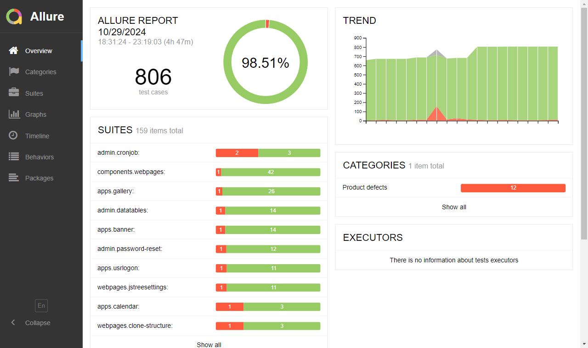

**Bug Fix**

- Fixed form list display (#54274).
- Fixed Questionnaire application - missing CSRF token (#54274).
- Fixed saving new user in MS SQL and Oracle database (#54273).
- Fixed loading of changed texts in Ninja template after saving template group (#54345).
- Ninja - modified default RT fields in the page in accordance with usage in the Ninja template (#54345).
- Media - fixed rights check if user does not have permission to manage all media (#54273).
- Templates - fixed page template duplication (#54345).
- In the old v8 version, the menu display for adding redirects was fixed, a link to switch to the new version was added (#53805).
- Introduction - added links to applications in icons in the first block (visits, forms...) (#53805).
- Forms - regular expressions - fixed adding regular expression to MS SQL (#54273).
- Fixed a bug where a nested dialog box (e.g. for directory selection) would not close after clicking on the darkened part (#54433).
- Web pages - corrected domain settings when specifying the ```groupid``` parameter in the URL address.
- Deleting data - cache objects - fixed display of confirmation button when deleting.
- Fixed SQL errors when creating a clean installation over an Oracle database (version 19c) (#54457).
- Websites - fixed bug with saving tags (perex groups) (#53805).
- Media - fixed displaying the Media application in the application list in the page editor (#54381).


## 2022.0

> Version 2022.0 brings a security update to Java and JavaScript library dependencies.

**Security**

- Updated Java library versions to newer versions, updated basic WebJET CMS to version 8.9.
- Added [OWASP Dependency-Check](https://jeremylong.github.io/DependencyCheck/index.html) tool triggered by the ```gradlew dependencyCheckAnalyze``` command to check for vulnerabilities in used Java and JavaScript libraries.
- **Warning:** changed logging from ```log4j``` to ```logback```. After the update, verify that the files ```commons-logging-1.1.jar, log4j.jar, slf4j-api-1.5.3.jar``` (updated to version 1.7.33), ```slf4j-jcl-1.5.3.jar``` from the ```/WEB-INF/lib``` directory have been successfully deleted.
- Email / SMTP - added option to set version ```TLS``` for sending emails (connecting to SMTP server). Set via conf. variable ```smtpTLSVersion```, default set to ```TLSv1.2```.
- Files - the function to convert from Word format to PDF has been canceled (the online service we used no longer works).
- **Warning:** old library ```commons-httpclient-3.1``` removed, API ```Tools.downloadUrl(String basePath, HttpServletRequest req)``` modified to use v4 library, methods ```Tools.proxyUrl``` removed. Option to use ```ProxyByHttpClient``` in Proxy applications removed (existing versions will use ```ProxyByHttpClient4```). We recommend using library ```Apache HttpClient Fluent API``` for specific HTTP connections (examples https://hc.apache.org/httpcomponents-client-4.5.x/current/tutorial/html/fluent.html).
- Updated library set ```jQuery UI``` from 1.8.23 to 1.13.1.
- Photo gallery - updated library ```jquery.prettyPhoto```, fixed functionality with jQuery v3.
- Deleted unused/old versions of jQuery library, updated ```moment.js, jquery-ui.min.js, jquery-ui.css, handlebars.min.js```.
- Updated library ```hibernate-validator``` from 6.0.13 to 6.0.22, ```jboss-logging``` to 3.4.3, ```joda-time``` to 2.10.13, ```junit``` to 4.13.2, ```guava``` to 30.1.
- Updated library ```velocity``` from 1.7 to 2.3, ```velocity-tools``` from 2.0 to 3.1 and ```commons-lang3``` from 3.3.2 to 3.12
- Updated library ```jsoup``` from 1.7.2 to 1.14.3, ```socialauth``` from 4.12 to 4.15 + ```openid4java``` from 0.9.5 to 0.9.6, ```snakeyaml``` from 1.12 to 1.30 ```http-client, http-core``` from 4.5.6 to 4.5.13, ```http-mime``` deleted (not needed), ```commons-codec``` from 1.6 to 1.11
- Updated library ```standard.jar``` and ```jstl.jar``` from version 1.1.2 to 1.2.5 (replacing with ```taglibs-standard-spec``` and ```taglibs-standard-impl```)
- **Notice:** updated ```Apache POI``` from 3.14-beta1 to 5.2.0, has changed API, list of typical changes at http://docs.webjetcms.sk/v8/#/back-end/apache-poi/, added ```commons-math```, ```log4j-api```, ```log4j-to-slf4j-2.17.1```, ```SparseBitSet-1.2```.
- Updated ```commons-collection4``` from 4.1 to 4.4, ```commons-compress``` from 1.10 to 1.21, ```commons-io``` from 2.6 to 2.11, ```pdfbox``` and ```fontbox``` from 2.0.2 to 2.0.25, ```xmlbeans``` from 2.6.0 to 5.0.3
- Updated ```springfox/swagger``` from 2.6.1 to 3.0.0, ```commons-upload``` from 1.3.3 to 1.4
- Updated ```Spring``` from 5.1.1.RELEASE to 5.3.15, updated ```spring-data``` from 2.1.1 to 2.6.1
- Cancelled ```webdav/milton servlet``` (no longer used for a long time), libraries ```milton-api, milton-servlet```.
- Updated library ```jackson-annotations, jackson-core, jackson-databind``` from 2.0.7 to 2.13.1
- ```Apache Struts``` - ​​patched vulnerabilities ```CVE-2014-0114, CVE-2016-1181, CVE-2016-1182, CVE-2015-0899``` according to https://github.com/bingcai/struts-mini/commit/df4da55bc2b0c3c1f4687a61c49458dfbde0e3c3 and https://github.com/tkhanateconsysdotcom/struts1-forever/commit/eda3a79907ed8fcb0387a0496d0cb14332f250e8
- Deleted library ```itext```, which has unpatched vulnerabilities and the new version is commercial. Removed the option to export PDF in ```DisplayTag``` and export form to PDF (```/formtopdf.do```), if you need it in your project, you need to manually add the library ```itext``` with the risk of possible vulnerability
- **Warning:** updated libraries ```bcprov-jdk5on-154.jar``` to 1.70, ```common-beanutils-1.9.2.jar``` to 1.9.4, ```tink-1.2.2.jar``` to 1.6.1, check the directory ```WEB-INF/lib``` after the update to make sure the old versions were correctly deleted.
- REST - documentation for REST services ```swagger``` updated to version 4.2.1 and moved to URL address ```/admin/swagger-ui/index.html``` (authorization with admin account required and config variable ```swaggerEnabled``` set to true). ```implementation("sk.iway:webjet:${webjetVersion}:swagger-ui")``` needs to be deleted from gradle projects.
- Administration updated to ```Bootstrap``` version 4.6.1

**Other changes**

- E-commerce - added detection of a variant in the cart if it is not set or not displayed.
- E-commerce - added Issued/Sent option to order details.

**Bug Fix**

- Gallery - corrected display in the Area of ​​Interest tab.
- Datatables - file upload - fixed setting of upload status after completion (the spinning wheel was incorrectly displayed).

