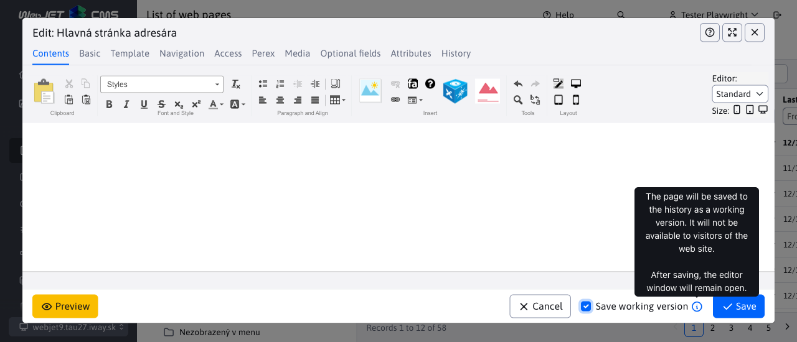
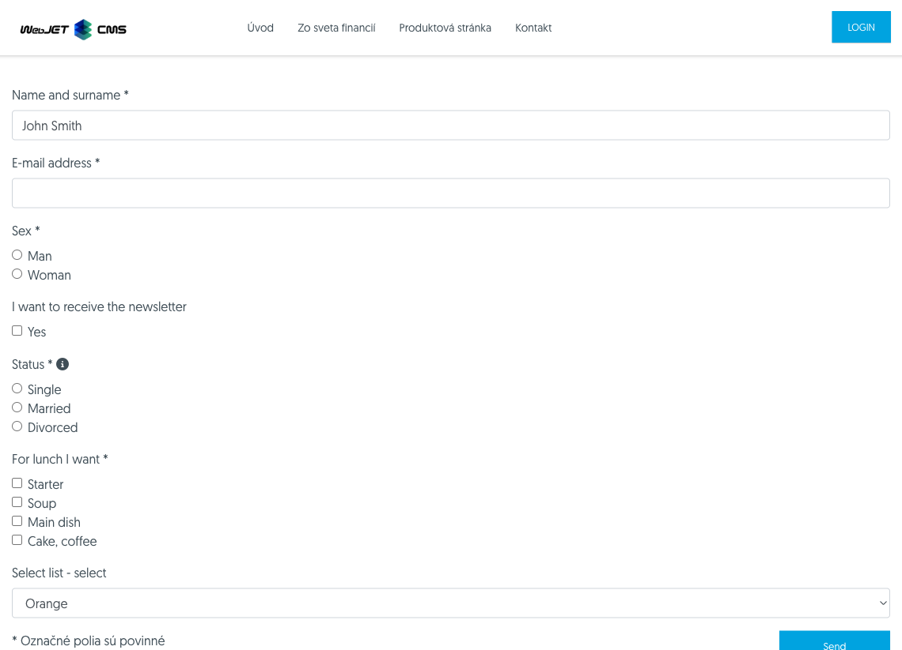
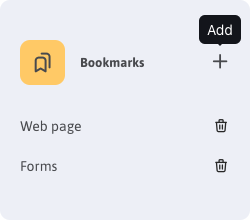
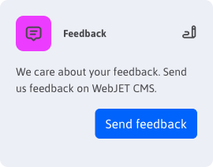

# Changelog version 2022

## 2022.52

> Version 2022.52 focuses on **improved usability**, includes improvements based on user comments. The Poll, attribute definition applications have been redesigned, **Check links and empty pages, Statistics**, Reservations. Banner application adds the possibility to use **optional fields**, there are many small improvements in the gallery.

Significant changes in this version:
- Datatables
	- Remembering the set number of records per page - if you set a value other than the automatic value, the table will remember the set number of records per page.
	- Import - improved display of line number on import error, added removal of spaces at the beginning and end of text, displayed information when importing many records.
- Website
	- When you create a new page, the editor window switches to the Basic tab so that you can immediately enter a page name.
	- Added function to [checking links and empty pages](redactor/webpages/linkcheck.md).
- Applications
	- Redesigned: Page Attributes, Poll, Statistics, Reservations and Reservation Objects List
	- Banner system - added option [set optional fields A-F](frontend/webpages/customfields/README.md)to record/display additional information if necessary (e.g. additional title/reference/button text in the banner).
	- Gallery - automatic calculation of the number of images per page and remembering the set image size `SML`.
	- Gallery - added the option to rotate the photo left/right (originally there was only the right option).
- Security and API
	- Updated libraries `Spring Security` and others.
	- Added option to use Google reCaptcha v3.
	- [API key login](custom-apps/spring/api-auth.md) sent in the HTTP header of the request.
### Groundbreaking changes

- During parallel testing, we identified a flaw in the acquisition `domainId` in multi-domain installations. Therefore, the retrieval of this value has been changed according to the lowest `groupId` of the folder in the domain (originally, it was according to the ordering priority). This change can lead to broken relationships in the database, so it is possible to define a conf. variable `domainId-www.domena.sk` and an ID value that refers to the originally set value.
- `FtpDownloader` - class cancelled.
- Banner - if you are using custom Java code to read banners the primary key name has been changed from `bannerId` to standard `id`.

### Website

- When creating root folders named `Slovensky, Česky, English, Deutsch` automatically sets the two-letter language code and the order of arrangement to `10, 20, 30, 40` (#market-245).
- Fixed the ordering of the list of web pages when first loaded, if it is set to something other than the default ordering by page ID.
- Fixed preview of newly created page.
- If more than 30 tags (Perex groups) are defined, they will appear in the Perex tab as a multi-select search field instead of the standard checkbox list (#54857).
- When creating a new page, the editor window switches to the Basic tab so that the page name (#54857) can be entered right away.
- When the domain is switched on the home page, it automatically switches to the Web pages section (if the user has rights) (#54857-4).
- FontAwesome - improved support for using FontAwesome in web pages (correct font loading in administration) (#39751-51).
- Application properties - modified inserting list of objects (banner list, gallery...) to new design in application properties edit. Technically, redirection from the original URL to the new one will be done if it is defined in `MenuService`. (#54705).
- Fixed filtering of the System and Trash folder if it is a subfolder of the main domain folder (when updating the old site). Now the System folder is no longer the root folder. Fixed display of pages when switching the Folders, System and Trash tabs (sometimes the list of pages in the System folder would not reload) (#54953-4).
- Added button on [display web page statistics](redactor/apps/stat/README.md) (#54953-3).
- Page attributes - [defining attributes](redactor/webpages/doc-attributes/README.md) converted to datatables (#54709).
- Added function to [checking links and empty pages](redactor/webpages/linkcheck.md) (#54697).


### Survey

- Application redesigned to the new design (#54705).
- Created by [documentation for the editor](redactor/apps/inquiry/README.md) (#54705).


### Banner system

- Added option to set to client banner, fixed statistics display (ability to change dates and error if banner contains no statistics) (#39751-52).
- Added "Show all banners" permission check - if the user does not have this permission, only banners where he is set as a client will be displayed (#39751-52).
- Added option [set optional fields A-F](frontend/webpages/customfields/README.md)to allow additional information to be recorded/displayed if necessary (e.g., additional heading/reference/button text in banner) (#39751-52).

### Gallery

- **Automatic calculation of the number of images per page** - similarly to how the number of rows in a datatable is calculated, the number of images that can fit in the window at the same time is calculated according to the size of the window for optimal pagination (#54857).
- Text editor - improved compatibility with old editor, enabled text styling (#39751-50).
- Author - added option to format text with author's name (bold, link...) (#54857-4).
- **Set size memory** - the gallery remembers the set thumbnail size (`S,M,L`), or a table view (#54857-4).
- Creating a new folder sets the Custom View mode instead of the erroneous Exact Dimension which distorts the aspect ratio (#54857-4).
- Attribute set by image `loading="lazy"` to load the image only when the page is scrolled (increase speed and reduce data volume for large galleries).
- Modified pagination (Bootstrap compatibility).
- After the photo is added, the deletion is performed `EXIF` information for the sake of security and also for the sake of **elimination of orientation (rotation)**, if configured `ImageMagick`. The original photo in the editor was displayed with rotation according to `EXIF` information, but not the scaled-down information, which created a display inconsistency (#54909).
- When using `ImageMagick` is first removed from the original when the image is rotated `EXIF` information about its rotation, so that there are no differences between the original and the preview photo (#54909).
- Added option **rotate photo left/right** (originally there was only the right option), fixed the option to rotate the image with the extension `.jpeg` (#39751-52).
- Added ability to change the file name in the editor (after the change, the photo files on disk will be renamed as well) (#39751-52).
- To avoid displaying the old version of the image in the editor, we added a random URL parameter to its path. This causes it to be reloaded from the server every time the editor is opened (#39751-52).
- Added **Magnifier tool to enlarge/reduce the image** in the editor in the Area of Interest tab (#54953-3).

### Statistics

Application [Statistics](redactor/apps/stat/README.md) completely redesigned into a new visual. Updated [manual for the editor](redactor/apps/stat/README.md) with descriptions of individual statistics (#54497, #54585).


- Added the ability to set a specific folder to display statistics (#54953-3).

### Reservations

Reservation app and list of reservation objects redesigned in a new visual. Added [manual for the editor](redactor/apps/reservation/reservations/README.md) (#54701).


### Search

- `Lucene` - Czech, English and German language support added. A standard parser is used for these languages and `stemmer` available directly in `Lucene` (`org.apache.lucene.analysis.JAZYK`).
- `Lucene` - when indexing web pages, the language of the web page is taken into account (according to the language of the folder or template). Only pages in the same language as the created index are added to the index.

### Datatables

- **Remembering the set number of records on a page** - if you set a value other than the automatic value the table will remember the set number of records on the page (#39751-50).
- Pagination - **increased number of pagination numbers** in the footer of the table. For main tables and screen widths greater than 800 pixels, the number of pagination items (originally 7 items) is calculated according to the table width (#39751-50,54857-4).
- `Quill` - simple HTML editor - extended capabilities of simple HTML editor (used e.g. in gallery, questions and answers...) - added settings for superscript/subscript, colors, alignment, ability to edit HTML code (#54857-4).
- Added configuration option [onPreXhr](developer/datatables/README.md) for the possibility to add URL parameters for calling the REST service. This is used if there is a special filter on the page, such as in statistics (#54585).
- Added configuration option [defaultSearch](developer/datatables/README.md#možnosti-konfigurácie) for initializing the lookup before the first REST service call (used in the Statistics application to remember the from-to dates entered between each statistics page) (#54585).
- Added option to set the value `null` (entered as a string) in the selection field (for the possibility of setting/filtering `null/true/false`) (#54701).
- Added field type `TIME_HM/TIME_HMS` For [selection of hours and minutes](developer/datatables-editor/standard-fields.md#time_hm-a-time_hms) (and possibly seconds) (#54701).
- Import - supplemented **display of line number on error** even if the imported entity does not inherit from `ActiveRecordBase` (#39751-53).
- Import - added removal of spaces at the beginning and end of the value in the cell (so that e.g. no import error occurs due to incorrect email address) (#39751-53).
- Import - added display of import progress in %, added indicator icon to import button (#39751-53).

### Security

- Updated library `Spring Security` to version `5.6.+` (#39751-50).
- Updated JavaScript libraries (#54857-4).
- Fixed possible XSS vulnerability in audit (#54857-4).
- User Registration - added JavaScript check for the Repeat Password field to prevent the form from being submitted if it does not match the Password field.
- Added option to use **Google reCaptcha v3**.

### API access

- Added ability to call REST administration services programmatically from an external system (#54941).
- [API key login](custom-apps/spring/api-auth.md) sent in the HTTP header of the request.
- The API key is generated in the profile of the respective user, by entering the character `*` a random API key is generated.

### Other minor changes

- Administration - left menu - when you click on an item that is low in the menu, the menu will move higher when the page loads to make the item visible and display any second level menu items (#54701).
- Loading animation - added option to show [loading animation](developer/frameworks/webjetjs.md#animácia-načítania), e.g. during graph generation (#54585).
- Banner - added setting option [campaign URL parameter](redactor/apps/banner/README.md#banner-typu-obsahový-banner) and displaying the banner only during the campaign.
- Dialogs - Modified the visuals of legacy dialogs (e.g. application settings, page editor dialogs) to the new header and tab style (#39751-52).
- Domain redirection - fixed getting domain alias on detection `xsrf` (it is no longer necessary to add the domain to the conf. variable when creating a domain alias `xsrfReferers`).
- Form easily - added insertion detection `check_form` for checking the filled fields. If there is already an object in the page (exists `checkFormLoaded`) it will not be unnecessary to insert the script to insert it (#54393).
- Form easily - modified tooltip text display - support for Bootstrap 5, replacing the wrong one `.popover` z `.tooltip` (#54393).
- Form easily - modified field ID generation for selection and checkbox fields to correctly click on the text and select the appropriate option (#market-245).
- Form easily - **set minimum field width for line display** so that on a mobile phone the fields are displayed full width and not side by side (where they are too small) (#54857).
- Bulk email - added email address checking (validation) when logging in/out of bulk email.
- Bulk email - added option **enter multiple email addresses in the unsubscribed email dialog** (#39751-53).
- Bulk email - added duplicate checking when entering unsubscribed email addresses (#39751-53).
- Bulk email - fixed error adding email to campaign if email is on unsubscribe list. Instead of an error, the add is considered correct and continues to the next record (#39751-53).
- Files - added option to use [external directory for files](frontend/setup/README.md) as part of a web application. It is set as a conf. variable `cloudStaticFilesDir={FILE_ROOT}static-files` which sets up file storage for each domain separately in a folder `static_files` in the root folder of the web application (#39751-47).
- Templates - added Folders and Web pages tab in the editor with **a list of folders and pages using the displayed template** (#54693).
- Structure mirroring - root folders will no longer be synchronized in order to set their order in the administration (e.g. first Slovak and second English).
- Added API function [WJ.prompt](developer/frameworks/webjetjs.md#získanie-hodnoty) to get a value from the user (e.g. password to confirm deletion, etc.) (#54701).

### Documentation

- Documentation created and project optimised `basecms` for setting [debug mode](custom-apps/vscode/debugging/README.md) in VS Code for both Java and JavaScript files (#54393).
- Added documentation for setup [campaign URL parameter](redactor/apps/banner/README.md#banner-typu-obsahový-banner) and displaying the banner only during the campaign.
- Completed documentation for [Thymeleaf](frontend/thymeleaf/webjet-objects.md) template objects (`${ninja.temp.baseCssLink},${ninja.temp.cssLink})`.
- Created documentation for the application [Statistics](redactor/apps/stat/README.md) (#54497).
- Documentation in the section Programming of customer applications has been supplemented with the possibility to attach a JavaScript module to the application as [entry in the admin area](custom-apps/admin-menu-item/README.md#priloženie-javascript-súboru) (#54585).
- Created documentation for the editor for the application [booking](redactor/apps/reservation/reservations/README.md) a [reservation objects](redactor/apps/reservation/reservation-objects/README.md) (#54701).
- Created documentation for Customer Application Programming - [Token authorisation](custom-apps/spring/api-auth.md), [provision of REST services](custom-apps/spring/rest-url.md), supplemented by documentation on the setup [SpringSecurity](custom-apps/spring-config/README.md#nastavenie-springsecurity) (#54941).
- Statistics - added information about storing statistics [without GDPR consent](redactor/apps/stat/README.md) (#54709).
- Page attributes - documentation created for [defining attributes](redactor/webpages/doc-attributes/README.md) (#54709).
- Created documentation for the editor for the application [Gallery](redactor/apps/gallery/README.md) (#54953-4).

### Testing

- Web pages - added tests for filling in web page fields, publishing time, duplication, history display, editor's notes, template selection, etc. (#52996).
- Automated tests - redesigned call `I.isFirefox/I.isChromium` into a separate `Page` object `Browser`. So the calls are `Browser.isFirefox()/Browser.isChromium()/Browser.getBrowserType()` (#MR302).
- Automated tests - redesigned call `I.wjDocsScreenshot` into a separate `Page` object `Document`.
- Gallery - added test for remembering set image size and displaying HTML text in the description and author of the photo (#54857-4).
- Translation keys - supplemented search test by starts/ends with and equals to (#54857-4).
- Added features `DT.checkTableCell, DT.checkTableRow` to test the value in [cell of the table and in the whole row](developer/testing/README.md#webjet-doplnkové-funkcie).
- Added report generation [code coverage](developer/testing/codecoverage.md) during testing (#54909).
- Changed the way images are visually compared from [Resemble](https://codecept.io/visual/#visual-testing) at [pixelMatchHelper](https://github.com/stracker-phil/codeceptjs-pixelmatchhelper)which can also be used when running tests in parallel (#54909).
- Added the ability to trigger [tests in parallel](developer/testing/parallel.md) for their faster execution (#54909).
- Added option [test REST services](developer/testing/README.md#testovanie-rest-služieb) (#54941).
- Added function `Document.screenshotAppEditor(docId, path, callback, width, height)` to create a snapshot of the application setup (#54953-4).

### Error correction

- Banner system - corrected display of the Displayable attribute when opening the editor window in the datatable (#54857).
- Banner system - corrected display of banner list, only the first 20 banners were displayed incorrectly (#54697).
- Datatables - fixed (unnecessary) saving of table state if it has a configuration option set to sort by a certain column. The table state is possible up to 800ms after its initialization, when the user is expected to perform an action.
- Datatables - corrected display of object name to delete if it is `GroupDetails` object (#39751-53).
- Forms - corrected display of the list of completed forms if the field (column) name contains a bracket character (#39751-52).
- Bulk email - added validity check of email address when importing recipients, if it is invalid an error message will be displayed. Spaces are removed from the email before importing (#39751-51).
- Media - fixed rights check when editing existing media in a page (#39751-52).
- Server monitoring - fixed display of translation texts (#39751-52).
- Translation keys - fixed key search by starts with, ends with and equals to (#54857-4).
- Templates - fixed loading of header/footer/menu selection list, filtering by template group (name vs contains match), filtering by spam protection and number of uses (#54857-4).
- Statistics - corrected year-to-date data loading - problem with week number on year transitions) (#39751-53).
- Web pages - corrected field saving `Odverejniť stránku po tomto dátume` (#52996).
- Website - fixed domain settings after login if current domain does not match the domain selection field (#39751-47).
- Web pages - fixed the ability to enter a URL containing an @ sign without it being treated as an email address (e.g. a link to a TikTok profile).
- Web pages - corrected pagination in the editor in the Media tab (#39751-54).
- Web pages - fixed ability to duplicate a folder (54953-3).

### For the programmer

- Added function `WJ.confirm` For [obtaining value](developer/frameworks/webjetjs.md#získanie-hodnoty) (#54701).


## 2022.40

> Version 2022.40 focuses on **improving security**. It contains updated Java and JavaScript libraries and checked vulnerabilities. But it also brings a number of other changes for **improving work based on feedback** - remembering the last folder in web pages, remembering the order of columns and layout in data tables, ability to scroll the window, etc. Gently **modifies the design of the user interface** (newer set of icons, more subtle menu colours).

Significant changes in this version:
- Security
	- Updated Java and JavaScript libraries, updated VueJS from version 2 to version 3.
	- Changed algorithm `hashovania` passwords to standard [bcrypt](sysadmin/pentests/README.md#algoritmus-hashovania-hesiel).
	- All error statements `Stack Trace` are routed through `Logger`, so they will also appear in the list [Last logs](sysadmin/audit/memory-logging.md) in the Audit section.
	- Added option to generate HTTP header `Access-Control-Allow-Origin` to provide access to REST services.
- Datatables
	- Added dynamic counting of the number of lines per page according to the size of the browser window.
	- Added the ability to move the editor window.
	- Added memorization [the order of the columns and the method of arrangement](redactor/datatables/README.md#pamätanie-usporiadania) tables.
	- Added [keyboard shortcut](redactor/datatables/README.md#klávesové-skratky), `CTRL+S/CMD+S` to save the record to the database without closing the editor window to continue working.
- Website
	- Page Builder - supplemented [screen size switching](redactor/webpages/pagebuilder.md#nastavenie-šírky-stĺpcov) to set the column width for desktop, tablet and mobile.
	- Added option to view [preview of the complete website](redactor/webpages/editor.md#náhľad-stránky) without saving it.
	- The list of web pages within one login remembers the last viewed folder (tree structure), when returning the folder is expanded again.
- Applications
	- Redesigned: Bulk Email, Event Calendar/List and Types.
	- Form easily - added the ability to generate forms with multiple fields in one row and the field type Select List - select.
	- Search - added weights for page title (weight 20) and headings (weight 10) for the ability to prioritize results to pages where the search term is in the title or heading.
Below you will find the complete list of changes in this version.

<div class="video-container">
  <iframe width="560" height="315" src="https://www.youtube.com/embed/ZJGYsQo-_Q4" title="YouTube video player" frameborder="0" allow="accelerometer; autoplay; clipboard-write; encrypted-media; gyroscope; picture-in-picture" allowfullscreen></iframe>
</div>

### PageBuilder

- Modified display of frames around elements - they are not shown and especially hidden immediately, but are animated. This improves the usability of clicking on the gear button, which doesn't disappear immediately when you move the mouse slightly outside the frame (#54345).
- When the window is closed, the preview of the page is deleted so that the previous version/web page is not flashed when the window is reopened.
- When you delete all tabs or `accordion` the + button will appear to add a new entry. It is thus possible to correctly delete all elements and then add them again.
- When you delete all sections (blocks) from the page, a blue + button will appear to add a new item.
- Added CSS style `pb-col` a `pb-col-auto` for the possibility of setting the columns that [width cannot be adjusted](frontend/page-builder/settings.md#column-zelená-farba).
- Supplemented by [screen size switching](redactor/webpages/pagebuilder.md#nastavenie-šírky-stĺpcov) for desktop, tablet and mobile. Allows you to adjust column widths according to the device selected (#39751).
- Editor window size increased to 1210 pixels wide to allow setting CSS classes `col-xl-` for 1200 points width `desktop` (#39751).
- Added execution support `data-th-src` a `data-th-href` attributes including `${ninja.temp.basePathXXX}` when inserting a block into the page (#39751-38).

### Website

- When you create a new domain, the Basic header/footer/menu pages are automatically created in the System folder for the header/footer and menu settings.
- When you create a folder, the empty URL field is automatically set to a two-letter language code (e.g. `sk`) for names `Slovensky, English, Deutsch a Česky`.
- If there is both a local (for the domain) and a global (with an unconfigured domain) folder The system displays only the local folder in the list of web pages (to avoid displaying two folders with the same name that cannot be distinguished at a glance).
- In the folder properties, groups are split to restrict access and bulk email just like in the website (#54493).
- Added option to view [preview of the complete website](redactor/webpages/editor.md#náhľad-stránky) without saving it (#54513).



- Added option in tree structure [show directory ID, order of arrangement and also list of web pages](redactor/webpages/README.md#nastavenie-zobrazenia-stromovej-štruktúry) (for drag \&amp; drop purposes) (#54513).
- Header/footer/menu language search added (looking for a page `LNG-meno`) when setting the directory language even when local is not used `System` Folder (#39751).
- Adjusted size and position of the application properties window - the window is centered and the maximum size is calculated according to the available area (#39751).


- Modified acquisition [list of CSS styles for the selection box in the editor](frontend/examples/template-bare/README.md#zoznam-štýlov-pre-editor) - if a minified CSS file is set in the template, its non-minified version is searched for. At the same time, when reading the CSS file, the search will stop after finding `@media` expression, which typically when inserted `bootstrap` to start with means that no styles will be found. The new code scans the CSS file one more time and looks for the comment `/* editor */`. If found the definition from the previous line (#39751-35) is used.


- In the Page Editor, Template tab, added menu pages to the list for free objects (originally only the list for headers and footers was displayed) (#39751-36).
- If a page has the "Automatically generate URL from menu item name" option set and there is already a page with the same URL/name (e.g. in the trash), the message "The specified virtual path is already used on the page" will only be displayed when the page is created, then the address with the sequential number at the end will be used.
- The System and Trash tabs will not appear if the user does not have permission to a folder or page in those tabs (#39751-39).
- Added display of folders in a tree structure according to rights to specific pages. Only pages that the user has rights to (#39751-39) will be displayed in the folder list afterwards.
- In the charts [History](redactor/webpages/history.md) shows the date of the scheduled publication of the page, rearranged the records so that the scheduled events are at the top of the list (#54513-15).
- History - added the ability to delete a scheduled change in a web page (#54513-15).
- Added [Folders tab](redactor/webpages/README.md#karty-web-stránok) to the date table. Allows you to use datatable features such as bulk operations, cell editing, duplicate and on tree structure folders (#54797).


- Remembering the last opened folder - the list of web pages remembers the last opened folder within one login, when returning to the list of web pages the folder is reopened (#39751-45).

### AB testing

- Added option to create a B version of the page for the AB testing application
- Created by [documentation for the editor](redactor/apps/abtesting/README.md).


### Templates

- [Thymeleaf templates](frontend/thymeleaf/tags.md#vykonanie-include-značky) added option to preserve wrapper element by setting attribute `data-iwcm-remove` to keep the structure identical to prototyping and the possibility of using elements as `header, article, footer`.
- Modified template and template group editor - better division of fields into tabs.
- Template groups - added Metadata language switcher, corrected Czech translation settings, corrected field settings `Generator` (#39751).

### Form easily

- Added the ability to display individual fields in a row (so fields are displayed next to each other, not underneath each other). Added New row field to create a new row and Empty cell to insert an empty space in the row. Fields in a row are automatically equally divided by the space in the row.
- If the placeholder text field is entered but the Value field is blank, the field name is not displayed above the field, only the placeholder text is displayed. This allows you to create a form that takes up less space.


- Added option [create groups of fields](redactor/apps/formsimple/README.md#Položky), e.g. selection fields and checkboxes. The character is used as a delimiter `|`, or the character `,` or gap. Character `|` must be used if one of the options is to contain a comma.



- Added those of the Select list field - select, individual values are separated by a character `,`, it is possible to enter different text and value in the form `Pomaranč:orange,Jablko:apple`.

### Forms

- Modified data filtering to allow searching in all columns (the original version did not allow searching in any column).
- Expanded [export options](redactor/apps/form/README.md) - added option to export filtered data, not yet exported and also tagged rows (#54513).


- A preview of the completed form is displayed in a dialog box for the selected single line. If multiple rows are marked, each form will be displayed in a new tab for easier comparison (#39751-40).

### GDPR

- Cookie Manager - modified styles for Bootstrap standard, buttons changed from link to standard button so that link and footer button colors don't clash (#54345).
- Search - added links to view details of the found record (#54513).
- GDPR Cookies - added the option to display the cookies bar in the specified language, you can set it with the parameter `lng` (#39751).

### Bulk e-mail

The app redesigned in a new visual. Added the ability to set the start of sending a campaign. Import of recipients is possible from `xlsx` format, by selecting a group of users, or by entering email addresses.


- Added a simpler form for signing up for bulk email (shows only the field for entering the email address). Registers to all email groups that have the option enabled `Povoliť pridávanie/odoberanie zo skupiny samotným používateľom` a `Vyžadovať potvrdenie e-mailovej adresy`. Nor does it contain `captcha` element, so email address confirmation is required. The form uses `Bootstrap v5` to display the form and dialog box.
- Created documentation with description of operation [sending mass emails](redactor/apps/dmail/campaings/how-sender-works.md).
- Added a Preview tab to the editor to display the selected page of the email. If the page uses inline editing/PageBuilder, it can also be edited (#39751-44).

### Calendar of events

- Event list redesigned with new visuals and date tables. Prepared by [manual for the editor](redactor/apps/calendar/README.md) (#54473).
- Configuration of event types redesigned into new visuals and datatables. Prepared by [manual for the editor](redactor/apps/calendar/calendar-types/README.md) (#54473).


### Users of

- In the list of user groups in the editor, added a Users tab with a list of users in the group being edited (#54493).
- In the user group list, modified the loading of the list of web pages for server paging (#54493).
- The user list can be filtered by user group (#54493).

### Search

- `Lucene` - modified indexing - the page title is indexed with a weight of 20 (while the title is indexed both in its original form and in the basic form via `Lemmas`), all headings are extracted from the page and used with a weight of 10. To view the results, you need to set `orderType="score"`, which then ranks the results according to the number of points achieved.
- `Lucene` - modified search - the entered text is first converted into the basic form (called. `Lemmas`) and only then is it searched.

### Datatables

- Editable selection box - increased the size of the edit window to the same size as the web page edit for better responsive display (e.g. when editing the header from a template edit) (#54345).
- Added the ability to import and export from nested tables as well (correctly displayed over an open editor window with proper dimming) (#54377).
- Added method for applying specific search parameters also for [the first (complete) loading of the table](developer/datatables/restcontroller.md#filtrovanie-pri-zobrazení-všetkých-záznamov) (calling `addSpecSearch` when calling `getAll`). Just in your implementation `getAll` calling method `getAllItemsIncludeSpecSearch` (#54493).
- Added option to export data in format `CSV` (#54513).
- Added field type [MULTISELECT](developer/datatables-editor/standard-fields.md) (#54273).
- Adjusted the size of the Status column so that it does not unnecessarily take up the width of the table (#54273-26).
- Added icon labels to maximize editor window, added button to close window in header (#54273-26).
- Added dynamic counting of number of lines per page according to browser window size (#54273-26).


- Added [keyboard shortcut](redactor/datatables/README.md#klávesové-skratky), `CTRL+S/CMD+S`, which saves the record to the database but leaves the editor window open (#54273-26).
- Import - when an import error occurs, the error message will display the line number and also a detailed list of errors (#39751-39).
- Added option `tab.hideOnCreate` a `tab.hideOnEdit` for hiding [tabs in the editor](developer/datatables-editor/README.md#karty-v-editore) for a new record and editing an existing record (#54749).
- Supplemented by [the name of the edited item](redactor/datatables/README.md#zobrazenie-názvu-v-hlavičke-okna) in the editor header and the list of items in the delete confirmation dialog (#54753).


- Improved visual consistency of old tables generated via `displaytag` and through an older version `DataTables`. Pagination is shifted to the right, line spacing and mouseover is (#39751-42).
- Added option to set the tab to [the full height of the editor window](developer/datatables-editor/README.md#karty-v-editore) (#39751-42).
- Added option [move window](redactor/datatables/README.md#možnosť-presúvať-okno) editor (#54513-21).
- Added memorization [the order of the columns and the method of arrangement](redactor/datatables/README.md#pamätanie-usporiadania) Tables (#54513-22).

### Language mutations

- Fixed loading of administration in languages other than Slovak.
- Pages scanned for static texts without translations, texts replaced by translation keys.
- Added translations for Czech and English.
- Added option to use parameters for using translation [keys in JavaScript files](developer/frameworks/jstranslate.md#frontend-knižnica).

### Security

- Updated spring libraries to 5.6.5 and thymeleaf to 3.0.15.
- Changed algorithm `hashovania`, [passwords to bcrypt](sysadmin/pentests/README.md#algoritmus-hashovania-hesiel).
- Supplemented by [checking page view rights](developer/frameworks/thymeleaf.md#kontrola-práv) in the administration (originally only the REST service call was checked). It is based on finding a URL in the menu and then getting the right for that URL. This is then verified with the rights of the logged in user (#54649).
- At [datatable tests](developer/testing/datatable.md#testovanie-práv) it is mandatory to specify the option `perms` for rights testing.
- Calling a script `/admin/mem.jsp` is enabled only for IP addresses set in the conf. variable `serverMonitoringEnableIPs`. Originally, the script was always available (used for basic monitoring), but it displays potentially sensitive data.
- Supplemented documentation [Safety tests for operation](sysadmin/pentests/README.md) additional solutions for security findings and settings for not displaying detailed error and version `Apache Tomcat` (#43144).
- Removed the option to directly view the JSP component `/components/user/logon.jsp`. When accessing a password-protected file, the redirection to the `logon.jsp`, but the internal `forward`, so the URL will remain the original one. If necessary, we recommend using the conf. variable `fileAccessDeniedDocId` to set the page ID to display the login when accessing the file and set the correct page ID for the login of the web site folder (#43144).
- Modified redirection when using characters `//` in the URL address - both the domain and the port are preserved (the absolute address with the domain is not used) (#43144).
- Discussion/Forum - AJAX calling `/components/forum/new.jsp` can only be called after the discussion forum is displayed, this page cannot be called if the site does not contain a discussion (#43144).
- Modified call `/topdf` to show a 404 error instead of a blank PDF in case of a page not found, also page redirection (#43144) treated.
- Removed old version `jquery.cookie.js` in the GDPR application - replaced by the version in `_common` directory (#43144).
- Updated Spring library to version `5.3.+`, `Amazon AWS` on 1.12.+ and `Jquery UI` on 1.13.2 (#546734).
- Updated `Vue.js` from version 2.6 to version 3.2.37, `vue-router` to version 4.1 and `vue-advanced-cropper` at 2.8.
- Updated all JavaScript libraries for `/admin/v9/` (#54721-3).
- Updated FontAwesome (icons) to version 6 (#54721-3).


- All error statements `Stack Trace` redirected from the standard output via `Logger`. So they will also appear in the list [Last logs](sysadmin/audit/memory-logging.md) in the Audit section (#54269).
- Added option to generate HTTP header `Access-Control-Allow-Origin`, is set in conf. variables `accessControlAllowOriginValue a accessControlAllowOriginUrls`. By default, the header is generated for URLs starting with `/rest/,/private/rest/,/admin/rest/`.
- Updated library `org.json` at 20220924.

### Other minor changes

- Banner system - added ability to filter banner by viewable - checks not only the active option, but also limits on number of views/clicks and date restrictions (#39751-44).
- Banner system - added button to display banner stats, added stats tab to editor (#39751-44).
- Bulk email - when you get the HTML code of the bulk email, jQuery will not be inserted into the page, which is unnecessary for the email version.
- Performance optimization - optimized template list retrieval - modified template group retrieval, individual object (page) data is only dynamically retrieved when needed (#53273).
- Questions and Answers - added SPAM check and the ability to display a Captcha image (by adding a value `,qa` to conf. variable `captchaComponents`). It is not checked as long as an administrator is logged in.
- Search in administration - search after clicking on the page name opens the editor in a new window (originally it opened in a popup window in the old version of the editor) (#39751-44).
- Introduction - added translations of the section Applications adapted for WebJET and News in WebJET. The list of news is read from an external server and is therefore updated without updating WebJET itself. Users can thus see the list of changes even in a version they have not yet deployed (#39751-45).

### Documentation

- Documentation created [Sample Bare Template](frontend/examples/template-bare/README.md) for frontend programmer.
- Created documentation for the editor - [Bulk email campaigns](redactor/apps/dmail/campaings/README.MD) a [Login form](redactor/apps/dmail/form/README.md).
- Created documentation with description of operation [sending mass emails](redactor/apps/dmail/campaings/how-sender-works.md).
- Created documentation for the editor for the application [list of forms](redactor/apps/form/README.md).
- Documentation created for [preview of the complete web page](redactor/webpages/editor.md#náhľad-stránky) without saving it for the editor and also for [programmer](developer/apps/webpages/README.md#náhľad-stránky).
- Documentation created for use [specific JavaScript](developer/frameworks/README.md#webpack) file for pasting into the pug file.
- Added documentation for the ability to add a button to [datatable editor](developer/datatables-editor/README.md#Špeciálne-tlačidlá).
- Created documentation for the editor for the application [AB testing](redactor/apps/abtesting/README.md).
- Created documentation for the programmer to use [persistent user settings](developer/frameworks/webjetjs.md#perzistentné-nastavenia-používateľa)
- Created documentation for the editor of the Calendar of Events application - [List of events](redactor/apps/calendar/README.md) a [Configure event types](redactor/apps/calendar/calendar-types/README.md) (#54473).
- Created documentation for the programmer with a list of [field types for DataTables editor](developer/datatables-editor/standard-fields.md) (#54273).
- Added documentation for web designer describing the method [adding styles to the selection box in the editor](frontend/examples/template-bare/README.md#zoznam-štýlov-pre-editor) (#39751-35).
- Created demonstration and documentation [file upload](custom-apps/spring-mvc/admin-with-upload.md) a [import from Excel](custom-apps/spring-mvc/admin-excel-import.md) for Customer Application Programmer (#54449).
- Supplemented documentation [Safety tests for operation](sysadmin/pentests/README.md) additional solutions for security findings and settings for not displaying detailed error and version `Apache Tomcat` (#43144).
- The Help link in the administration directed to the main documentation page, or to a specific page (if it already exists) instead of directing to the old documentation for version 8 (#39751-40).
- Created Audit documentation with [a description of the types of audit records](sysadmin/audit/README.md) for traffic (#54269).
- Added documentation for the programmer about [use of field validation](developer/datatables-editor/datatable-columns.md#validácie) (#54597).
- Added documentation for the editor - [Web pages - web page tabs](redactor/webpages/README.md#karty-web-stránok) (#54797).
- Added documentation for setup [HTTP security headers](sysadmin/pentests/README.md#http-hlavičky).

### Testing

- Modified automated testing of datatable - after deleting a record, the table is restored and checked again to see if the record was deleted (if e.g. a cache deletion error occurred) (#54513).
- Created test of tree structure display settings `jstreesettings.js` (#54513).
- Scripts - added test for checking the insertion of scripts into the page according to both structure and date conditions (#39751).
- Template groups - added test for saving and displaying metadata in the page, verification of saving by language (#39751).
- Page Builder - created a test of Page Builder and Standard switching and mode (#39751).
- Datatable - added test for maximizing the window, closing it by clicking on the icon in the header, and dynamically calculating the number of rows on the page (#54273-16).
- Web pages - added test for saving a page with the CTRL+s/CMS+s keyboard shortcut (#54273-16).
- At [datatable tests](developer/testing/datatable.md#testovanie-práv) it is mandatory to specify the option `perms` for rights testing.
- File rights check - added test `links.js` to verify login credentials when accessing the file in the basic version, even with a nice login page.
- Added media display tests (`media.js`) on the web page, including tests of web page change dates (#54689).
- Updated `CodeceptJS` to version `3.3.5`, Chromium to version 105, Firefox to version 103 (#54721-4).
- Added test to check edit rights of conf. variables (limited rights) (#54749).

### Error correction

- Selection box with editing option - fixed window closing when editing header from template where third window is open e.g. for media editing (#54345).
- Improved ckeditor size setting when displaying from an editable selection box (#54345).
- Fixed loading translation files in language other than SK.
- Fixed the function of restarting WebJET by clicking on the menu in the Control Panel.
- Fixed search in nested datatable - after typing a term and pressing Enter, the search did not start but all rows were selected (#54493).
- Fixed alphabetical ordering in the main menu in the Applications section (also handles diacritics correctly) (#53273).
- Templates - fixed getting the currently set HTML template when editing. Even if it doesn't exist on disk it will be preserved in the list of available HTML templates (#53273).
- Templates - fixed setting of blank page ID in template (it was incorrectly set to -2, which is used in web pages instead of -1) (#53273).
- Server monitoring - fixed disk space size tooltip (#54513).
- Scripts - modified the display of the Script tab to make it clear that it contains a text area (#54513).
- Templates - corrected renewal `cache` memory after deleting the template.
- PageBuilder - added removal of CSS classes and PageBuilder HTML code if the code is incorrect (e.g. nested `div.section` to `div.section`), or a tool has been left open (e.g. column width adjustment) (#39751).
- Scripts - fixed inserting scripts into the page that don't have restrictions set (#39751).
- Firefox - added holding the window position when clicking on the application in the editor in Page Builder mode (Firefox incorrectly moved the window to the very bottom, or to the place where the cursor is) (#39751).
- Web pages - fixed looping of web page opening if the value is `domainName`, `NULL` (#39751).
- Gallery - fixed ability to close the file upload dialog, fixed a bug saving an image where even clicking cancel saved the change in the editor (#39751).
- Gallery - corrected duplication of entry - also file/photo is copied correctly. The name is set to the name in the Description tab, or the existence of the file is tested by adding the number 1-100 to the end of the file name.
- Web pages - added tree structure refresh if web pages are also displayed when changing name, order, display state, folder and external link (#39751).
- Web pages / datatables - fixed editing multiple records at once - `fetch` from the server was originally executed only on the first record, corrected to be executed on all tagged records. Bug caused text to be saved when editing multiple web pages `data not loaded` to the body of the web page (#39751-36).
- Sitemap - corrected display `/sitemap.xml` (#54637).
- Web pages - added API functions `openLinkDialogWindow` a `openImageDialogWindow` from version 8 to open the link/image selection dialog, e.g. in the button dialog (#39751).
- Banners - fixed setting error `domainId` for single domain installation according to compatibility with version 8 (#54645).
- Banners - fixed bug in search by banner activity (#39751-44).
- Media - corrected permissions setting for displaying the Media application in the page editor (#39751).
- Media - when editing via Manage All Media, the date of the last media change will be preserved so that it continues to be displayed on the web page (typically, media will only be displayed older than the last save date of the associated web page). For new media, the date and time will be set to the date and time the assigned web page was last saved (#54689).
- Video player - added support `Bootstrap 5` - CSS style setting `ratio ratio-16x9` for the correct aspect ratio of the displayed video (#39751-39).
- Datatables - when the window was maximized, the delete confirmation was subsequently shown maximized as well, which didn't look good. Modified so that when the delete record confirmation is displayed, the maximization is cancelled (#39751-39).
- Page Builder - fixed template setting when creating a new page - it is set according to the folder template not the main page template (#39751-39).
- Web pages - corrected opening of a page after entering its ID in the System folder when the settings are enabled `templatesUseRecursiveSystemFolder=true` (#54513-16).
- Datatables - corrected cell editing after moving a column (#54513-16).
- Web page - corrected display of author name in datatable after editing page (#54753).
- Web site - corrected search by perex group (#39751-42).
- Gallery - corrected alphabetical ordering of items in the tree structure (#39751-43).
- Gallery - fixed image editor size and area of interest settings when maximizing the window, improved support for editing large photos (shifting the photo in the window) (#39751-43).
- Gallery - corrected editing of multiple lines of perex/annotation text (#39751-44).
- Cluster - fixed deleting cache objects by calling `Cache.getInstance().removeObjectStartsWithName` - a delete request starting with instead of the exact list (which may be different on each node) is written directly to the cluster (#54273-32).
- Bulk email - fixed initial setting of recipients, number of recipients and emails sent when saving a campaign, non-removal of emails if user is in both selected and removed group (#39751-44).
- Datatable - corrected search after changing the order of columns (#43144).


## 2022.18

> Version 2022.18 adds PageBuilder integration into web pages, the ability to use design templates written in the Thymeleaf framework, display of recent messages in logs, many usability improvements based on user comments, redesigned Forms - regular expressions, Bulk email - unsubscribed emails. Added Bookmarks and Feedback mini-apps to the homepage.

<div class="video-container">
  <iframe width="560" height="315" src="https://www.youtube.com/embed/6IPrdHvhYrc" title="YouTube video player" frameborder="0" allow="accelerometer; autoplay; clipboard-write; encrypted-media; gyroscope; picture-in-picture" allowfullscreen></iframe>
</div>

**PageBuilder**

Page Builder is integrated into the web page editor. In this mode the whole page is not edited but only selected parts of it. Page Builder separates text/image editing and page structure editing. This prevents you from accidentally deleting structural elements of a web page while editing its text (#54349).

For newly created templates, we recommend preparing and using Page Builder blocks instead of the original HTML blocks. This will ensure better and easier editing of complex pages. Page Builder mode needs to be set and enabled in the template group.

Documentation for [of the editor](redactor/webpages/pagebuilder.md), [web designer](frontend/page-builder/README.md) Also [programmer](developer/apps/webpages/pagebuilder.md).


- Added option to generate a random ID when inserting a block into a page by entering a value `__ID__` to the block code (#54345).
- Added option not to mark section by setting CSS class `pb-not-section`, container setting `pb-not-container` and column setting `pb-not-column` (#54345).

**Website**

Added option to display [action buttons](developer/datatables-editor/notify.md) in the notification. For example, if there is a working version of the page, a button to open the last working version of the page will be displayed. This way the editor does not have to navigate to the History tab and click the button to edit the working version (#54375).


Added the ability to create a new header/footer/menu/free object directly when editing a web page or template, to be used instead of the template version, or to edit an existing page (e.g. if you need to edit the logo or text in the footer).


- Improved new domain folder creation. Fixed automatic folder creation `system` with header, footer and menu subfolders. Once created, the page is refreshed in the browser to correctly reflect the new domain in the header domain picker. Added API method `EditorFacade.createEmptyWebPage` for simple [creating a new page](developer/apps/webpages/api.md).
- Modified the icon for selecting the Parent Folder and Redirect to Cross icon. The original pencil icon evokes that you are going to edit the given directory or redirect address, but the reality is that you are selecting an existing directory (not editing/modifying).
- The list of tags (perex groups) is sorted alphabetically regardless of font size and diacritics (#53805).
- Added main page status icon (star) option to filter web pages by main page (useful to use when displaying web pages from subfolders as well) (#54381).
- When you click in the ID/address field, the field will be enlarged to make it easier to type the page name (#54381).

**Forms**

Regular Expressions section, through which rules are defined for checking the completion of fields, redesigned with a new design and datatable.


In the form details added:
- A button to preview the completed form and an "eye" icon directly in the form row for easy viewing (#54273).
- Display a link to download the form files.
- Option to enter a comment on the form.
- Display logged in user data (disabled by default, set to display columns in table).
- Records the date of the last export of the form.
- The date the form was last filled out in the list of forms, set to sort by this column.
- Separate view of forms by domain (`domainId`).
- Added deletion of form record and all records (whole form).
- Added control of rights under `docId` (only forms of web pages to which the user has permission are displayed in the list - the value is checked `docId` of the last submitted form).

**Form easily**

- Added field type for uploading files (any file type), documents (files of type .doc,.docx,.xls,.xlsx,.ppt,.pptx,.pdf) and images (files of type .gif,.png,.jpg,.jpeg,.svg) (#54273).
- Added option to set placeholder text (`placeholder`) for standard text fields. Allows you to display auxiliary text in an empty field (e.g., the format of the expected phone number 0903xxxyyy) (#54381).

**Templates**

- Added option to use [Thymeleaf templates](frontend/thymeleaf/README.md) sites instead of the old JSP. This brings the advantage of a better possibility of prototyping the design directly in the HTML code.
```html
<span data-th-text="${docDetails.title}">Titulok stránky</span>
<body data-th-class="${docDetails.fieldA}">
	<meta name="author" data-th-content="${ninja.temp.group.author}" />
	<link rel="canonical" data-th-href="${ninja.page.url}" />

	<div data-iwcm-write="doc_data" />
	<div data-iwcm-write="!INCLUDE(/components/gdpr/gtm_init.jsp)!" />
</body>
```

- Menu item templates modified to directly include the sub-items List of Templates and List of Template Groups (items are moved to the first menu level).
- For the local System directory, added search for the language version of the header/footer/menu according to the language of the directory. If the template has a set header `SK-Default hlavička` and directory set language English looking for `EN-Default hlavička` (there must be a - in the third place). If it exists, it shall be used.

**Automated tasks**

- Added the ability to manually run an automated task by clicking a button in the datatable (#54273).

**Audit**

Added the ability to store the last log messages in the server memory with an easy option to view them. Also supported is the ability to retrieve log messages from another cluster node (e.g. from a CMS node you can request the last log messages from public nodes).


**Bulk email**

Remade unsubscribed emails section into a datatable, created [documentation for the editor](redactor/apps/dmail/unsubscribed/README.md).


**Translation keys**

- Added button to clear the cache of translation keys and reload them from the file and database. Useful if you change the translation file during operation and need to reload it (#54401).
- Added information message when trying to delete a key that is in the translation file (only modified keys in the database can be deleted).
- Fixed key arrangement by ID.
- Fixed display of duplicate keys that are present in both the file and the database (the modified key from the database will be displayed).

**Applications**

Added option [add an app to the app list](custom-apps/appstore/README.md) using Java annotation `@WebjetAppStore` and the ability to set application parameters using annotations `@DataTableColumn`. This makes it easy to display the application in the list of applications, insert it into the page and edit its parameters without additional programming (#54333).


- The list of applications is arranged alphabetically in the menu. The first are the customer applications (in the file `modinfo.properties` have the attribute `custom=true`), followed by standard WebJET CMS applications (#54381).

**Datatables**

- Added simplified option [dial settings for select boxes](developer/datatables/restcontroller.md#číselníky-pre-select-boxy) by overwriting the method `getOptions(DatatablePageImpl<T> page)`
- Added option [do not export the selected column](developer/datatables/README.md#exportimport) using the setting `className` attribute to the value `not-export` (#54273).
- Added the ability to set [the values of the selection field](developer/datatables-editor/datatable-columns.md#možnosti-výberového-poľa) by calling Java API methods or values from the application dialer.
- Fixed cell editing if not to perform record retrieval from server (condition `fetchOnEdit` Is `false`).
- Added check for duplicate notification messages when calling `DatatableRestControllerV2.addNotify`. The same message is repeated only once, checking that the caption, text and notification type match.
- Added checking the open editor window when leaving the page. If it is open a confirmation of leaving the page will be displayed when navigating to another page. Not applicable for users with a login name starting with `tester` (#54413).
- Field type Selection field with editing option allows to edit and add web pages [also from the card system and the basket](developer/datatables-editor/field-select-editable.md). Added icon descriptions (`tooltip`) and hiding the edit icon if the selected web page has an ID less than 1.
- Added a field type for selecting a directory on the file system using [json field type](developer/datatables-editor/field-json.md#možnosti-classname) and values `className='dt-tree-dir-simple'` (#54433).
- Added option for optional fields of selection field type [enter a blank value](frontend/webpages/customfields/README.md#výberové-pole) (#53805).
- Adjusted settings [columns displayed in the datatable](redactor/datatables/README.md#nastavenie-zobrazenia-stĺpcov). The view is columnar, and in addition to the column name, it also contains the name of the tab in the editor, a possible title and auxiliary text. This makes it easier to identify the necessary columns (#54381).


- Added option to maximize editor dialog (#54381).
- When you click the save button in the editor, the animation will also appear directly on the button (not just at the top of the window) for a clearer indication (#54381).

**Home**

Added [Bookmarks mini app](redactor/admin/welcome.md?id=záložky)where you can add links to frequently used sections from WebJET CMS. After logging in, you don't have to search for a section in the menu, but you can go directly to your favorite section in the bookmarks.



Added [Feedback mini app](redactor/admin/welcome.md?id=spätná-väzba) through which you can send your comment or praise to WebJET CMS programmers. We will consider your comments and add them to [development maps](ROADMAP.md). You can also improve the functioning of WebJET CMS with your opinion.



Added pull-down menu in the header after clicking on the name of the logged-in user. Includes options:
- Profile - edit your own profile (name, email... - after changing the profile you need to log out and log back in).
- Two-Step Authentication - the ability to activate two-step authentication using the app `Google Authenticate` when logging into the administration. This increases the security of your account, because in addition to the password, you also need to enter a code from your mobile device to log in. We recommend setting this on all accounts through which user accounts and rights can be managed.
- Encryption Key Management - allows you to create a new encryption key for encrypting forms and specify an existing key for decrypting them. Requires the Forms right.
- Logout - logout from the administration.
The todo application, which has not yet been implemented, does not yet appear on the home page (#54381).

**Other changes**

- Added option to use [Thymeleaf templates](custom-apps/spring-mvc/README.md#frontend) for Spring MVC applications.
- Menu - application of the menu when setting the parameter `classes="bootstrap"` also generates classes `nav-item,nav-link,dropdown,dropdown-toggle`.
- Optional fields - added those fields for [directory selection](frontend/webpages/customfields/README.md#výber-adresára-súborového-systému) on the file system (#54433).


- Server Monitoring - added a list of the number of open sessions on each node (#54453) to the Current Values list in the case of a cluster installation.
- Server monitoring - added deletion of conf. variables `statDistinctUsers-` a `statSessions-` from the database in the mode `cluster auto`. They are erased older than 30 minutes, which we consider to be an unavailable cluster node anymore. These variables no longer appear in the list of configuration variables because there is no point in changing them for the user.

**Security**

- Added replacing special HTML characters in error messages with entities to avoid executing HTML code in case of an error.
- Updated Spring version from 3.5.15 to 3.5.18 due to vulnerability [CVE-2022-22965: Spring Framework RCE via Data Binding on JDK 9+](https://spring.io/blog/2022/03/31/spring-framework-rce-early-announcement).
- Updated libraries `dom4j` at 2.1.3, `jackson-annotations, jackson-core, jackson-databind` at 2.13.2, `medatata-extractor` at 2.17, `poi` at 5.2.2, `mariadb-java-client` at 2.7.5.
- Updated libraries `spring` at 5.3.19, `zxcvbn` to 2.0.1, `moment` at 2.29.3.

**Documentation**

- Documentation for customer application programming has been supplemented with settings [Spring](custom-apps/spring-config/README.md) and modified [example datatable](custom-apps/admin-menu-item/README.md) to the Contacts app.
- Added example for programming [Spring MVC applications](custom-apps/spring-mvc/README.md) (#54273).
- External repository of WebJET CMS maven artifacts available (requires access credentials) and sample [github repository](https://github.com/webjetcms/basecms).
- Added documentation on the use of vulnerability scanning in libraries for [programmer](developer/backend/security.md#kontrola-zraniteľností-v-knižniciach) Also [traffic](sysadmin/dependency-check/README.md).
- Documentation created for use [Thymeleaf website templates](frontend/thymeleaf/README.md).
- Created Page Builder documentation for [of the editor](redactor/webpages/pagebuilder.md), [web designer](frontend/page-builder/README.md) Also [programmer](developer/apps/webpages/pagebuilder.md).
- Created documentation on the possibility [do not export the selected column](developer/datatables/README.md#exportimport) datatables (#54273).
- Documentation created for [Start screen](redactor/admin/welcome.md) to use bookmarks and send feedback.
- Documentation created for [by unsubscribed email](redactor/apps/dmail/unsubscribed/README.md) from the bulk email app.
- Fixed display of graphs in documentation.
- Documentation created for the setup option [values of the selection field](developer/datatables-editor/datatable-columns.md#možnosti-výberového-poľa) datatable editor by calling the API function or by inserting data from the dialer application.
- Documentation created for [to add an app to the app list](custom-apps/appstore/README.md) for custom application programmer.
- Created Template section in the documentation for the editor - [Editing a web page](redactor/webpages/editor.md).
- Added documentation for setting the optional field [of the filesystem directory selection type](frontend/webpages/customfields/README.md#výber-adresára-súborového-systému).
- Documentation created [Server monitoring](sysadmin/monitoring/README.md) for traffic (#54453).
- Created documentation for the application [Form easily](redactor/apps/formsimple/README.md) (#54831).
- Created documentation for the editor to [setting the display of columns](redactor/datatables/README.md#nastavenie-zobrazenia-stĺpcov) in datatable (#54381).

**Testing**

- Added option to set field value for [automated datatable test](developer/testing/datatable.md#možnosti-nastavenia) via the option `testingData`. This is necessary if the field has a specific format (e.g. email address, number, limited number of characters).
- Added autodetection [mandatory field of type email](developer/testing/datatable.md#spôsob-generovania-povinných-polí) (based on the name of the field containing the term email), the field is then filled in correctly with the domain name.
- Added test for displaying list of applications, search by name, inserting JSP and Spring application into page and editing their parameters - `tests/webpages/appstore.js` (#54333).
- Modified tests to run in firefox (#54437).
- Added features `Browser.isChromium() a Browser.isFirefox()` For [browser detection](developer/testing/README.md#detekcia-prehliadača) in tests (#54437).
- Added test for setting tags (perex groups) for web page (#53805).
- Added report generation via library [Allure](developer/testing/allure.md). They are published for [chromium](http://docs.webjetcms.sk/allure/chromium/) also for [firefox](http://docs.webjetcms.sk/allure/firefox/) (#54437).


**Error correction**

- Fixed display of form list (#54274).
- Fixed Questionnaire application - missing CSRF token (#54274).
- Fixed new user storage in MS SQL and Oracle database (#54273).
- Fixed loading changed text in Ninja template after saving a template group (#54345).
- Ninja - modified R-T preset fields in the page in line with the usage in the Ninja template (#54345).
- Media - Fixed checking permissions if user does not have permission to manage all media (#54273).
- Templates - fixed duplication of page templates (#54345).
- In old v8 version fixed menu display for adding redirects, added link to switch to new version (#53805).
- Introduction - added links to applications in icons in the first block (visits, forms...) (#53805).
- Forms - regular expressions - corrected addition of regular expression to MS SQL (#54273).
- Fixed error closing nested dialog (e.g. for directory selection) after clicking on the dimmed part (#54433).
- Web pages - corrected domain settings for the specified `groupid` parameters in the URL.
- Deleting data - cache objects - fixed display of confirmation button when deleting.
- Fixed SQL errors when creating a clean install over Oracle database (version 19c) (#54457).
- Web site - fixed error saving tags (perex groups) (#53805).
- Media - Fixed display of the Media app in the list of apps in the page editor (#54381).


## 2022.0

> Version 2022.0 brings a security update to the Java and JavaScript library dependencies.

**Security**

- Updated Java libraries to newer versions, updated basic WebJET CMS to version 8.9.
- Added tool [OWASP Dependency-Check](https://jeremylong.github.io/DependencyCheck/index.html) triggered by the command `gradlew dependencyCheckAnalyze` to check for vulnerabilities in the Java and JavaScript libraries used.
- ATTENTION: change logging from `log4j` at `logback`. After the update, verify that the files have been successfully deleted `commons-logging-1.1.jar, log4j.jar, slf4j-api-1.5.3.jar` (updated to version 1.7.33), `slf4j-jcl-1.5.3.jar` from the directory `/WEB-INF/lib`.
- Email / SMTP - added option to set version `TLS` for sending emails (connection to SMTP server). It is set via conf. variable `smtpTLSVersion`, set by default to `TLSv1.2`.
- Files - the function to convert from Word to PDF format has been removed (the online service we used to use no longer works).
- ATTENTION: old library removed `commons-httpclient-3.1`, API `Tools.downloadUrl(String basePath, HttpServletRequest req)` modified for v4 library use, methods deleted `Tools.proxyUrl`. In the Proxy application, the option to use the `ProxyByHttpClient` (existing versions use `ProxyByHttpClient4`). We recommend using the library `Apache HttpClient Fluent API` for specific HTTP connections (examples https://hc.apache.org/httpcomponents-client-4.5.x/current/tutorial/html/fluent.html).
- Updated set of libraries `jQuery UI` from 1.8.23 to 1.13.1.
- Photo gallery - updated library `jquery.prettyPhoto`, fixed functionality with jQuery v3.
- Deleted unused/old versions of jQuery library, updated `moment.js, jquery-ui.min.js, jquery-ui.css, handlebars.min.js`.
- Updated library `hibernate-validator` from 6.0.13 to 6.0.22, `jboss-logging` at 3.4.3, `joda-time` on 2.10.13, `junit` at 4.13.2, `guava` on 30.1.
- Updated library `velocity` from 1.7 to 2.3, `velocity-tools` from 2.0 to 3.1 and `commons-lang3` from 3.3.2 to 3.12
- Updated library `jsoup` from 1.7.2 to 1.14.3, `socialauth` from 4.12 to 4.15 + `openid4java` from 0.9.5 to 0.9.6, `snakeyaml` from 1.12 to 1.30 `http-client, http-core` from 4.5.6 to 4.5.13, `http-mime` deleted (not necessary), `commons-codec` from 1.6 to 1.11
- Updated library `standard.jar` a `jstl.jar` from version 1.1.2 to 1.2.5 (by replacing `taglibs-standard-spec` a `taglibs-standard-impl`)
- ATTENTION: updated `Apache POI` from 3.14-beta1 to 5.2.0, has changed API, list of typical changes at http://docs.webjetcms.sk/v8/#/back-end/apache-poi/, added `commons-math`, `log4j-api`, `log4j-to-slf4j-2.17.1`, `SparseBitSet-1.2`.
- Updated `commons-collection4` from 4.1 to 4.4, `commons-compress` from 1.10 to 1.21, `commons-io` from 2.6 to 2.11, `pdfbox` a `fontbox` from 2.0.2 to 2.0.25, `xmlbeans` from 2.6.0 to 5.0.3
- Updated `springfox/swagger` from 2.6.1 to 3.0.0, `commons-upload` from 1.3.3 to 1.4
- Updated `Spring` from 5.1.1.RELEASE to 5.3.15, updated `spring-data` from 2.1.1 to 2.6.1
- Cancelled `webdav/milton servlet` (no longer in use for a long time), libraries `milton-api, milton-servlet`.
- Updated library `jackson-annotations, jackson-core, jackson-databind` from 2.0.7 to 2.13.1
- `Apache Struts` - patched vulnerabilities `CVE-2014-0114, CVE-2016-1181, CVE-2016-1182, CVE-2015-0899` By https://github.com/bingcai/struts-mini/commit/df4da55bc2b0c3c1f4687a61c49458dfbde0e3c3 and https://github.com/tkhanateconsysdotcom/struts1-forever/commit/eda3a79907ed8fcb0387a0496d0cb14332f250e8
- Deleted library `itext`which has unpatched vulnerabilities and the new version is commercial. Removed PDF export option in `DisplayTag` and export the form to PDF (`/formtopdf.do`), if you need in the project you need to get a library `itext` manually add with risk of possible vulnerability
- ATTENTION: updated libraries `bcprov-jdk5on-154.jar` at 1.70, `common-beanutils-1.9.2.jar` at 1.9.4, `tink-1.2.2.jar` on 1.6.1, check the directory `WEB-INF/lib` after the update if the old versions were correctly deleted.
- REST - documentation for REST services `swagger` updated to version 4.2.1 and moved to URL `/admin/swagger-ui/index.html` (admin account authorization required and conf. variable enabled at the same time `swaggerEnabled` to true). You need to delete from the gradle projects `implementation("sk.iway:webjet:${webjetVersion}:swagger-ui")`.
- Administration updated on `Bootstrap` version 4.6.1

**Other changes**

- Ecommerce - added variant detection in cart if it is not set or not displayed.
- Ecommerce - added Issued/Sent option to the order detail.

**Error correction**

- Gallery - corrected display in the Area of Interest tab.
- Datatables - file upload - corrected the upload status setting when finished (the spinning wheel was incorrectly left displayed).


