# List of changes version 2023

## 2023.52/2024.0

> Version 2023.52/2024.0 includes a new version of **updates with a description of changes**, **structure cloning** integrated with the mirroring function (including the possibility of translations), adds the option to **restore** a web page, or **an entire folder from the trash**, adds an **HTML editor** and the option to set the editor type directly for the template, **applications** can **enable display only for selected device types** mobile, tablet, PC and of course improves security and work comfort.

<div class="video-container">
    <iframe width="560" height="315" src="https://www.youtube.com/embed/YGvWne70czo" title="YouTube video player" frameborder="0" allow="accelerometer; autoplay; clipboard-write; encrypted-media; gyroscope; picture-in-picture" allowfullscreen></iframe>
</div>

### Groundbreaking changes

This version introduces several changes that may not be backward compatible:

- Discussion/Forum - adding a new post and approving changed from Struts framework to Spring, use `/admin/update/update-2023-18.jsp` call for [basic editing](install/README.md#changes-when-updating-to-202318). User profile editing removed, we recommend using the standard component for editing [registered user](redactor/privacy-zone/README.md) (#55649).
- Import from Excel - if you have a special version of Excel import in your project that calls URL `/admin/importxls.do`, edit the form and URL according to `/admin/spec/import_xls.jsp`. The update script `/admin/update/update-2023-18.jsp` (#55905) should solve the problem for you.
- Restaurant menu - converted from Struts to Spring, use update script and verify menu display on web page (#55945).

### User interface improvements

- Web pages - Blocks - increased size of window for inserting blocks, added ability to directly edit web page when inserting it with Dynamic Link (#56017).
- Websites - Editor - increased height of text/title style selection menu for better overview/option selection (#56017).
- Applications - once again improved window size for applications - both height and width including windows when using PageBuilder. Optimized size of nested data tables. Adjustment in `top.jsp,datatables-wjfunctions.js` (#56013).
- Apps - updated app photos and descriptions in the app list in the page editor. Fixed various minor visual bugs in app settings (#55293).
- Datatables - during a long-running operation, the connection to the server may be interrupted, in which case the message "An error occurred while communicating with the server. It is possible that the operation is taking too long and will be performed later. Wait and check after a while whether the operation is performed." is displayed to distinguish it from the standard error of saving the record.
- Datatables - added option [import only new records] (redactor/datatables/export-import.md#import-data), if a record according to the selected column already exists, it is left unchanged (#56061).

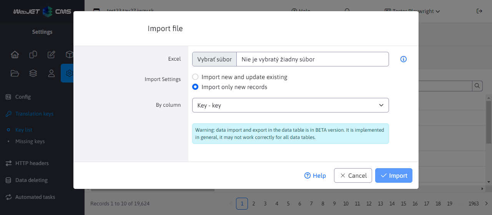

### Website

- Import/Export - added setting of local folder IDs when creating a template. Resolves an issue when editing a page after import, where the template is created but does not have the correct folder access settings. Non-existent folders are filtered out. After import, we recommend checking the template settings (#55993).
- When creating a new web page and inserting an image/file/media, a folder for the Media of this page is already created before saving. It is created according to the value entered in the Menu Item Name field (#54953-29).
- When editing a single web page, the window for inserting an image/creating a link remembers the last folder even after closing it and does not switch back to the Media section of that page when reopened. This is more practical if you are inserting multiple images from a different folder. You can still switch to the Media section of that page by clicking in the tree structure (#54953-29).
- Added support for , [Recover web pages and folders from the trash](redactor/webpages/recover.md) (#55937).
- The folder `/files` with the full-text file index is moved to the System tab (#54953-30).
- Templates - added option to set Page Editor Type (originally Inline Structure Editor) for a template, default value is By Template Group, when Page Editor Type is set according to the assigned template group (#56129).

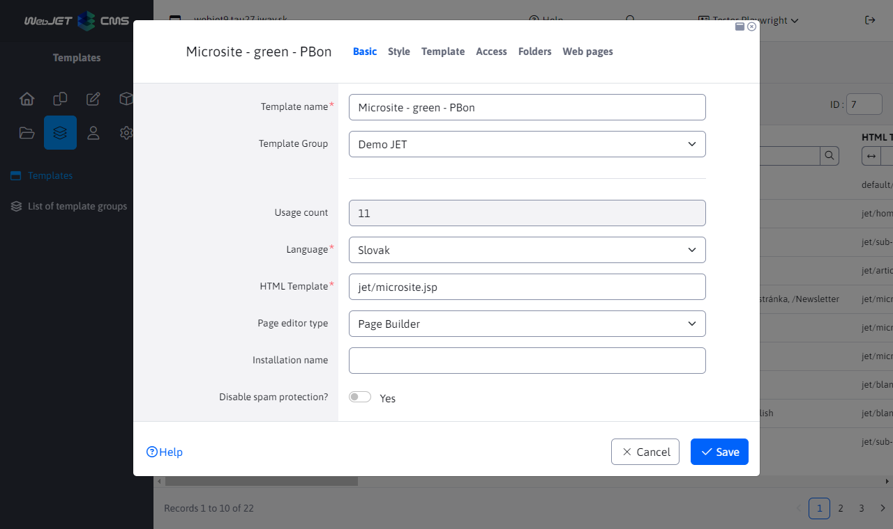

- Editor - added HTML page editor type, where the page editor is displayed directly in HTML mode (HTML code). Allows editing of special types of pages that cannot be switched to visual mode due to e.g. special code (#56129).

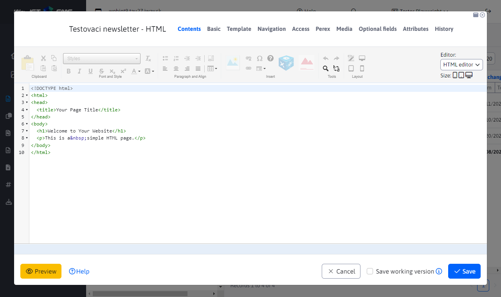

- Editor - added the ability to set the editor size/width even in Standard mode. This allows you to view the page in landscape mode for mobile, tablet, and computer (#56129).
- Editor - unified Standard/Page Builder mode switching (#56129).
- Ninja - added support for additional browsers to define the minimum supported version in `config.properties` type `minBrowserVersion.crazy\u0020browser=10` (#56129).
- For pages with disabled display, the page title color has also been changed to red (#55997).
- Editor - modified Paste as plain text and Paste from Word functions to open a dialog box into which text from the clipboard is pasted (#56189).

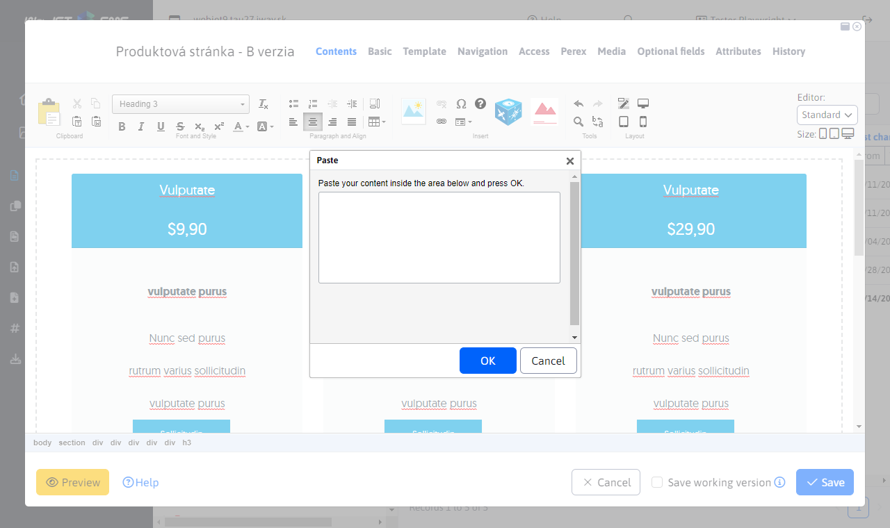

- Editor - improved cleaning of code pasted from Excel - cell width setting and CSS style class removed (#56189).
- Editor - modified inserting links to email addresses - incorrect display of http prefix when entering email address (#56189).

### Page Builder

- Page Builder redesigned to use new JavaScript files identical to those used when editing a web page (previously, the old ones from version 8 were used). The page code is inserted directly when displaying, no REST service call is required. Additional CSS and JavaScript files are inserted using `combine` in a single call. The number of HTTP requests when displaying a regular page has been reduced from 42 to 24 (#56017).
- Loading in the editor should be faster, the new version does not contain old parts of the code, some objects will be reused.
- In the future, only the Page Builder version will be available in the Web pages section, separate inline editing when viewing a web page will be canceled (due to script uniformity).
- Visibility settings adjusted to Mobile, Tablet, Desktop options in line with the ability to toggle editor width (#56017).
- Added [generate menu](frontend/page-builder/blocks.md#menu-support) option for `single page` page types. The menu is generated automatically according to the sections in the website (#56017).

### Spring applications

- Added application name to settings window instead of generic Edit name (#55997).
- Spring applications have an added [Display tab](custom-apps/appstore/README.md#display-tab) for configuring the display of the application on different devices and the ability to configure caching of HTML output for faster web page display. If no device is selected, the application will always be displayed.


### Restaurant menu

- Section (application) Restaurant Menu converted to data tables [Restaurant Menu](redactor/apps/restaurant-menu/README.md) (#55945).


### WebJET update

Improved [WebJET CMS update] process (sysadmin/update/README.md), transferred to new design, added diacritics to the change list, display of change list with highlighted texts and images.

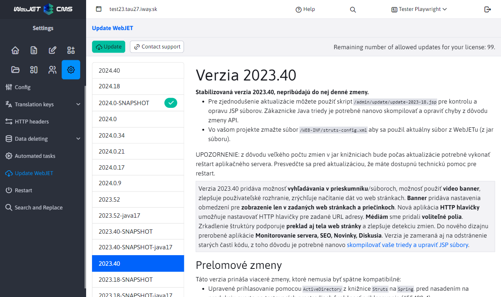

### Banner system

- Added support for [Display banner for specific device type](redactor/apps/banner/README.md#display-banner-for-specific-device-type), i.e. display only on e.g. mobile phone, or only on tablet. This way you can display different banners for different devices (#55921).


### Forms

- Added the Company field to the list of fields for the logged-in user when filling out the form (#55961).

### Gallery

- Optimized image editor initialization - after the first initialization, an existing instance will be used (#55853).
- Optimized data loading - reduced the number of REST service calls from 6 to 1 when displaying the gallery (#56093).

### HTTP headers

- Added option to set header `Content-Language`, [automatic setting](admin/settings/response-header/README.md#setting-for-files) header for files.
- Added support for [header settings](admin/settings/response-header/README.md) for exact URL matching using `^/path/subpath/- Added support for [header settings](admin/settings/response-header/README.md) for exact URL matching using  and the option to set for certain suffixes ` /path/subpath/*.pdf,*.jpg` (#56109).


### Event calendar

- Added the ability to create an event type with a space in the name (#56054).
- Added clearing of Cache after adding a new event (#56054).

### Cloning a structure

- [Cloning structure](redactor/apps/clone-structure/README.md) is integrated with [mirroring](redactor/apps/docmirroring/README.md) to allow translation and linking of pages when cloning a language mutation. The language is taken from the source and target folder settings (#55733).
- After creating a clone, mirroring of changes is automatically set, if necessary you can cancel it by editing the config variable `structureMirroringConfig`. Changes will be transferred between the clone and the original structure.

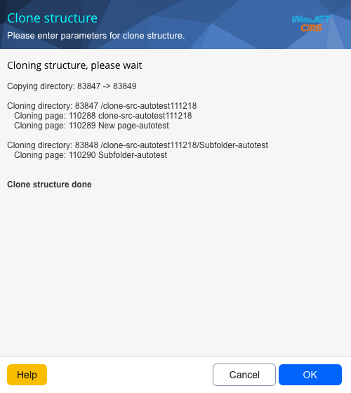

### News

- Added objects `$pagesAll` with the full pagination list (`$pages` contains a shortened list) and `$totalPages` with the total number of pages to the [news template](redactor/apps/news/README.md#template).

### Users

- User deletion - handled situation when currently logged in user tries to delete himself (#55917).
- [User List](admin/users/README.md) - added Directory and Page Rights and Approval columns to the table. Due to nested data in the columns, it is not possible to search and sort by value (#55897).
- User list - added Rights Groups view to display administrator rights groups in a table with the option to filter by selected group (#55601).

### Translation keys

- Added option to [import only new](admin/settings/translation-keys/README.md) (not yet existing) keys. The existence of the key is checked for each language (#56061).


### Redirections

- Path redirects - in a multi-domain installation, only records according to the currently selected domain and records that do not have a domain set are displayed (#55957).

### Proxies

- Added HTTP header setting `Content-Type` according to [proxy response](redactor/apps/proxy/README.md) (when using proxy for REST services/without embedding in web page) (#56054).

### Statistics

- The folder selection filter in the statistics view only shows folders that the user has rights to in the website list. On the first visit, statistics are displayed for the first allowed folder. This allows editors with limited rights to the website tree structure to view statistics (#55941).
- Added the Show statistics right for all folders, which allows viewing the entire tree structure regardless of website rights (#55941).

### Optional fields

- Added field type `UUID` for generating [unique identifier](frontend/webpages/customfields/README.md#unique-identifier).


### Brands

- Tags - the list of available tags is displayed according to the rights to the website sections. This way, you can make tag administration accessible only for a certain website tree section (or domain). So if a user is only allowed access to the website section /Newsletter, they will only see tags that have this section added, or tags without display restrictions (#55961).

### Mirroring the structure

- Added the option to later add the ID of another folder for mirroring, using [Clone structure](redactor/apps/clone-structure/README.md) it is possible to add the content of the new language (#55733).
- Added synchronization setting check - if you remove a folder ID from the config variable `structureMirroringConfig`, pages and folders in the removed structure will no longer be synchronized (#55733).
- Added the ability to create [pages and folders with display enabled] in mirrored folders (redactor/apps/docmirroring/README.md#mirroring-process) (e.g. during the page development phase), just set the config variable `structureMirroringDisabledOnCreate` to the value `false` (#55733).
- Translator - [for DeepL](admin/setup/translation.md) it is possible to set the URL address of the API service in the conf. variable `deepl_api_url`. The default value is for the free version, when using the `Pro` version, set it to `https://api.deepl.com/v2/translate`. Modified the method of authorization for the API for the new version using the HTTP header `Authorize` (#55733).

### Safety

- Updated library `logback` to version 1.3.14.
- Fixed vulnerability `CVE-2022-26960` in library `elfinder`.
- Users - Profile - added information about password quality when changing it (#56077).

### System changes

- Optimized JavaScript file size - `moment` library is loaded with only the necessary languages ​​instead of all available ones (used `MomentLocalesPlugin`). Size reduced by 300kB (#56093).
- Update - from 2023.40-SNAPSHOT, packages for updating WebJET running in JAR mode are also prepared on the update server, the update server will provide the update file according to the mode type.

**Moving from Struts to Spring**

- WebJET update - redesigned WebJET update [WebJET Update](sysadmin/update/README.md) (#55797)
- Discussion/Forum - redesigned adding a new post from Struts to Spring, redesigned approval (#55649).
- Page Rating - redesigned [Rating](redactor/apps/rating/README.md). Class `RatingDB` replaced with `RatingService` and `RatingBean` replaced with `RatingEntity` (#55729).
- XLS Import - URL for importing XLS files changed from `/admin/importxls.do` to `/admin/import/excel/`, use the example in `/admin/spec/import_xls.jsp` to update your files (#55905).
- Restaurant menu - refactored to Spring, classes `MenuDB,MealDB,MenuBean,MealBean` replaced with `RestaurantMenuService,RestaurantMenuEntity,RestaurantMenuMealsEntity` (#55945).
- Websites - redesigned option Clone structures from struts to Spring [Clone structure](redactor/apps/clone-structure/README.md) (#55733).
- Web pages - redesigned importing of pages from ZIP archive [Importing web pages from ZIP archive](redactor/webpages/import-export.md#importing-web-pages-from-zip-archive) (#55905).
- Web pages - redesigned importing pages from Excel file [Importing web pages from Excel file](redactor/webpages/import-export.md#import-structures-from-excel-file) (#55905).

### Bug fixes

- Dials - fixed paging in dials (#56013).
- Datatables - fixed the position of the window from the nested datatable so that it fits entirely in the browser.
- Forms - fixed error displaying date in Last Sent in the list of forms on the Oracle database.
- Forms - fixed export of data from a form and duplicate generation of the export file (#56141).
- Gallery, File View, File Archive - fixed folder selection in application properties on page (#54953-27).
- Gallery - fixed double slash in gallery URL in some scenarios (#56017).
- Mass email - added case-insensitive email address duplicate check (#55961).
- Configuration - fixed duplicate display of config variable when adding an existing variable (#55733).
- Configuration - fixed import of special characters like `'&#<` and searching in such a value (#55993).
- Json editor - fixed setting and changing image in applications using Json editor (e.g. Recommendations, Impressive Presentation, etc.) (#55293).
- Users - fixed display of user rights in editing - rights by group were also displayed checked, not just those set (#55797).
- Users - Profile - fixed password change bug (#56077).
- Restart - fixed the Restart function in the Settings menu (#54953-30).
- Scripts - fixed inserting scripts into the page - search was incorrectly used as a substring for the position name and the script was inserted even if the position name did not match exactly (#54953-30).
- `Slider` - ​​fixed jQuery library compatibility (#55293).
- Templates - fixed display of templates that are set to display only for a specific folder and this folder has an empty domain name (#55993).
- Websites - added support for approving websites in no action mode (#55897).
- Websites - remove approval records that remained after deleting a folder from the trash (#55897).
- Web pages - added automatic setting of lowercase letters when entering the domain (the domain is entered with lowercase letters only by default) (#55993).
- Web pages - fixed switching to the Basic tab after adding new media in a new web page (#54953-29).
- Web pages - fixed preview display if Spring is set to JSON responses by default (#56054).
- Websites - domain renaming fixed - Folder system domain not changed (#54953-30).
- Web pages - blocks - improved window size setting when inserting a Block (#55293).
- File display - fixed file display (domain detection) (#54953-27).
- Fixed an error sending parameters for external filters, the date to value is set to 23:59:59 (#56021).

### For the programmer

- Applications - added option to display application in page [by device type](custom-apps/appstore/README.md#conditional-display-application) (mobile, tablet, pc) by adding parameter `!INCLUDE(/components..., device=mobil)!`. For [Banner system](redactor/apps/banner/README.md) setting is also added to application settings interface.
- Datatables - added support for `LocalDate/LocalDateTime` for data fields, added attribute `alwaysCopyProperties` to `DatatableColumn` for the ability to copy when editing from [existing record](developer/datatables-editor/datatable-columns.md).
- Users - added documentation on the use of `afterSaveInterceptor` during [user registration](custom-apps/apps/user/README.md) and the option to not send the standard welcome email by overriding the `shouldSendUserWelcomeEmail` method (#54953-28).


## 2023.40

> Version 2023.40 adds the option of **searching in explorer** /files, the option to use **video banner**, improves the user interface, speeds up data loading on websites. **Banner** adds restriction settings for **display only in specified websites and folders**. The new **HTTP Headers** application allows you to set HTTP headers for specified URL addresses. We have added **optional fields** to **Media**. Structure mirroring supports **translation of the web page body** and improves change detection. The **Server Monitoring, SEO, News, Discussion** applications have been redesigned. The version is also focused on removing old parts of the code, therefore it is necessary to [recompile your classes and edit JSP files](install/README.md#zmeni-pri-aktualizácii-na-202318).

<div class="video-container">
    <iframe width="560" height="315" src="https://www.youtube.com/embed/5hlbQYoOF6U" title="YouTube video player" frameborder="0" allow="accelerometer; autoplay; clipboard-write; encrypted-media; gyroscope; picture-in-picture" allowfullscreen></iframe>
</div>

### Groundbreaking changes

This version introduces several changes that may not be backward compatible:

- Modified login using `ActiveDirectory` from library `Struts` to `Spring`, verify login functionality on test environments before deploying to production (#55489-4).
- Modified visitor login to password protected zone from library `Struts` to `Spring`. If you are using your own login JSP, you need to modify its code (use of struts html tags - replace with standard HTML tags). Standard changes will be automatically modified by calling `/admin/update/update-2023-18.jsp`, which we recommend running again to check the compilation of JSP files (#55489-4).
- Updated version of the `Thymeleaf` library to version 3.1. Contains [several changes](https://www.thymeleaf.org/doc/articles/thymeleaf31whatsnew.html) compared to version 3.0, mainly removal of `#request, #response, #session, #servletContext` objects. WebJET automatically adds `request,session` objects to the model for applications, but it is necessary to modify the HTML code of applications to use the `${request` object and not `${#request`. This can be automatically modified by calling `/admin/update/update-2023-18.jsp`, which is also extended to fix `.html` Thymeleaf template files.

After deploying this version, check at least:

- Logging in using `ActiveDirectory` to both the administration and password-protected sections (if you are using integration with `ActiveDirectory`).
- Login and registration of visitors to the password-protected section (if you have a password-protected section on your website).
- Applications and templates using the `Thymeleaf` library.
- Website approval process (if you use one).

### User interface improvements

- Applications - **enlarged application settings window**, e.g. photo list in the gallery application. Both the height and width of the window adapt to the current browser resolution. On large monitors, the application settings window appears significantly larger than in the previous version (#54953-15).

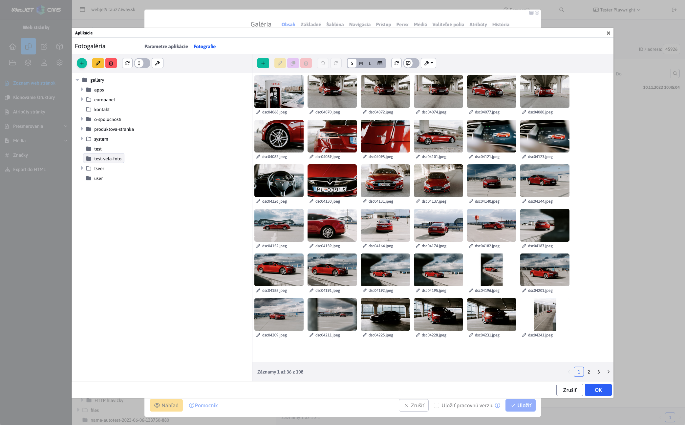

- Applications - adjusted the number of columns in the list of all applications to 4 to display a higher number of applications at once (#54953-15).
- Datatables - fixed window position in cell edit mode for type ```quill``` (e.g. perex/annotation in gallery). The window was too high and could not be moved, in the new version the bubble is wider for more comfortable work (#54953-15).
- Datatables - **accelerated record search by ID** in the URL address, accelerated page switching if the record is not on the first page (#54273).
- Datatables - **added option to filter list by ID**, so you can easily find a record even with a high number of pages. Unlike the ID field in the toolbar, it only filters records, it does not automatically open the editor. Entering the ID in the toolbar pages up to 5 pages and then uses filtering by ID to open the editor. Modified option to mark/unmark all records on one icon. If no records are marked, all are marked, if any are marked, they are unmarked (#55581).
- Datatables - modified export file name to `názov-YYYYMMDD-HHmmss.xlsx` format for better alphabetical sorting of exported files in standard computer explorer (#55581).
- Datatables - if the editor contains a value that is not in the selection field as an option, it will be added with at least an ID value and a warning will be displayed. This situation occurs if, for example, you move a page to another folder and the associated template should not be used in the new folder due to restrictions (#54953-16).

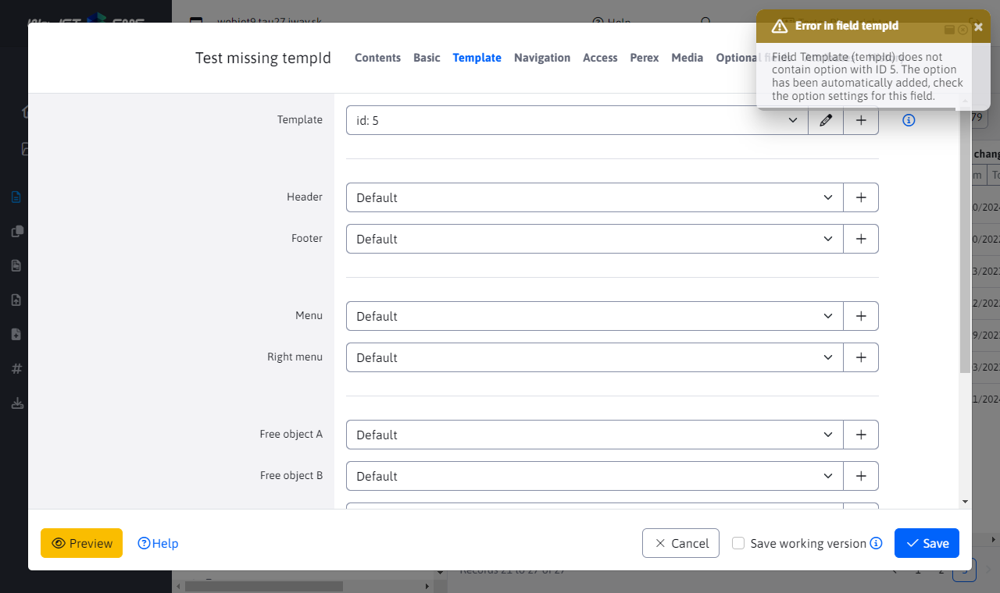

- Gallery - added remembering of displayed columns and their order in table view (#54953-15).
- Gallery - added icon to display selected image in new browser tab (#54953-15).
- Website - editor - **Editor mode preference (Standard/PageBuilder) is saved in the user's settings** on the server and is persistent between user logins. (#54953-15).
- Web pages - editor - table - when inserting a new table into a page, the default width is `100%` instead of the original value `500px` (#54273).
- Web pages - **optimized data** when loading the page list and tree structure when entering a page/folder ID in the URL. The necessary data is sent directly from the server during page loading. It speeds up e.g. displaying the header page from the template editor and the like (nested editor from the header/footer/navigation selection menu) (#54273).
- Website - history - versions with rejected approval are displayed in red (#55493).
- Web pages - **adjusted icon display at smaller ratio** between tree structure column and web page list. Conflict with ID input field, nicer display of icons in 2 rows at low resolution. Height calculation converted from CSS to JavaScript calculation (#54953-22).
- External filter - now also supports filtering using Web pages and Search Engine (#55537).
- Explorer - added option **search for file/image/web page**. The function is also available in the page editor when inserting an image or a link to a file/page. You can search in the current folder or in subfolders (#54953-25).

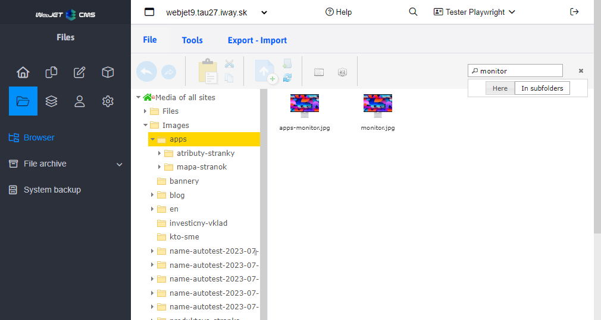

### Community/Open Source version

- Added support for running WebJET without **license number in community/Open Source version** (#55789).
- [Source code](https://github.com/webjetcms/webjetcms) published (#55789).
- Some paid applications can be purchased in addition to the version.
- The list of available applications can be found on the website [www.webjetcms.sk](https://www.webjetcms.sk/) (#55773).

### Website

- Reworked **approval process** from the original version to Spring DATA repository and REST service. Optimized code, deleted duplicate parts (#55493,#54953-21).
- Redesigned **website deletion and deletion approval process** to Spring DATA and REST services (#55493).
- Added the ability to enter the character `/` into the name of a folder or web page. Internally it will be saved as the HTML entity `&#47;` but in the editor and tree structure it will be displayed as a slash (#55517).
- Optimized initial data loading for users with limited rights to only view a specific web page (#54953-17).
- Modified **pasting from Word documents** - styles (colors, font size...) are removed, tables are set to a CSS class according to the standard table, HTML tags `b,i` have been modified to `strong,em`, `span` elements have been removed (#55681).
- When saving a web page to multiple folders, the display mode of other pages changes from redirection to standard display (the pages are as if separate). The redirection mode to the main page can be enabled with the config variable `multigroupRedirectSlavesToMaster=true` (#54953-23).
- Added the ability to open a web page with a version from history in the editor by entering the URL parameter `&historyid=XXX`. It is used, for example, in inline editing in the change history view after clicking on the name of the user who last changed the page. (#54953-25).
- Explorer - in the Website List section, **list filtered by the currently selected domain** is displayed (#54953-25).

### Banner system

- Added information about the number of views and clicks on the banner to the editor window (#55285).
- Added banner image display and option to click to open link to data table (#55285).
- Added the option to **set banner display restrictions** only in specified [websites and folders](redactor/apps/banner/README.md). This allows you to set **banner display in the website tree** (#55285).


- Added support for [Video type banners](redactor/apps/banner/README.md#video-type-banner) in `mp4` and `YouTube` formats and support for **adding video** to the background of a Content banner (#55817).


### Discussion

- Section [discussion](redactor/apps/forum/forum-list.md) redesigned (#55501).

### Data export

- Added option to **create custom data export type** with [custom JSP file](redactor/apps/export/README.md#custom-export-format) (#54953-19).
- Added data export in JSON format for `Úradní desku` in [OpenData ČR](https://ofn.gov.cz/úřední-desky/2021-07-20/).

### Forms

- Modified reading of the form list - control lines are read according to the ```NULL``` value in the ```create_date``` column, originally according to the ```html``` column (#54273-43).

### Gallery

- Added remembering of displayed columns and their order in table view (#54953-15).
- Added icon to **show selected image** in new browser tab (#54953-15).
- Added **protection of system folders**, e.g. `/images/DOMAIN-ALIAS` and folders to which the user **does not have rights**. The folder is displayed as non-editable and it is not possible to upload a photo to it (#54953-26).

### HTTP headers

The new [HTTP Headers](admin/settings/response-header/README.md) application in the Settings section allows you to define HTTP response headers (`HTTP Response Header`) based on the URLs of the displayed page. The headers are set according to the longest URL match and it is possible to use a macro variable in both the name and value.


### Media

- The Manage all media section is **filtered by the currently selected domain**. This means that only media for pages in the current domain will be displayed, similar to other applications (#55197).
- In the all media management, table filtering by group and name/path to the web page, column Image displayed with image preview, column **Link and Web page displayed with the option to click on the link** has been added (#55197).
- Added the option to use [optional fields](frontend/webpages/customfields/README.md) for media as well (#55685).
- Fixed editing media on a page in multiple folders (#54953-23).
- In the Manage all media section, the ```DOC ID``` field in the editor is replaced by selecting a website from the tree structure (#55197).

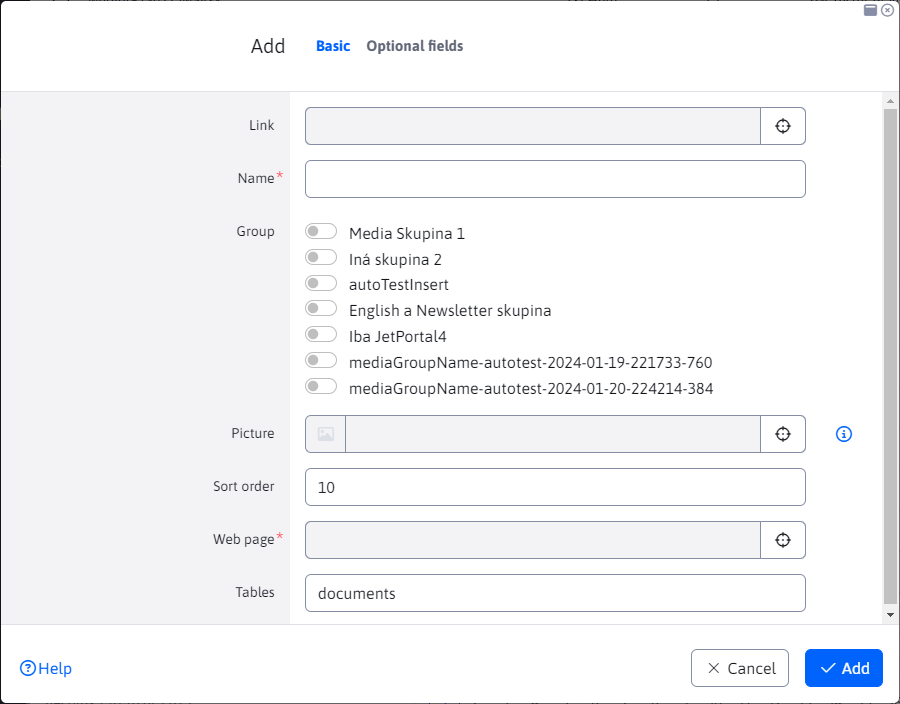

### Server monitoring

- Reworked CPU load acquisition directly from Java `OperatingSystemMXBean` without the need for an external library, graphs supplemented with the value CPU Load of the WebJET process, automatic writing to the recorded values/database (#55865).
- Sections Applications, WEB pages, SQL queries redesigned to a new design (#55497).
- Added documentation [Cluster node data exchange] (sysadmin/monitoring/nodes-logic.md).


### SEO

- Entire SEO section redesigned (#55537).
- Added documentation about [SEO section](redactor/apps/seo/README.md).

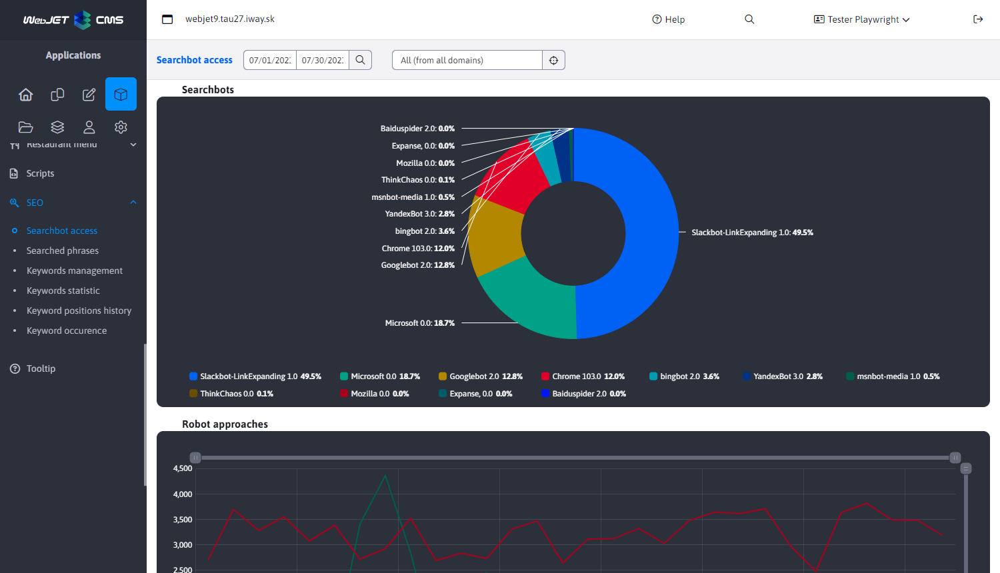

### News

- Redesigned the [News] application (redactor/apps/news/README.md) (in the Posts section) to a new design. It allows you to work with news in a similar way to working with websites. (#55441).
- **The list of possible folders is automatically generated** based on the use of the news application in websites (#55441).
- Modified design of application settings on the website (#55441).


- When setting up an application on a page, the list of tags/perex groups is filtered by the selected folders. This will allow you to select tags even if you are inserting a news list into a folder outside of the specified tag folders. The list is not updated dynamically, first set the folders, click OK to insert the application, and then reopen its settings to update the tag list (#54953-17).

### Users

- Modified **search by groups** - when setting the Equals option, users who have only this one group (no other groups specified) are searched for (#54953-20).
- User approval - added **user approval upon registration** to the password-protected zone. Added [documentation describing the entire process](redactor/zaheslovana-zona/README.md) (#55545).

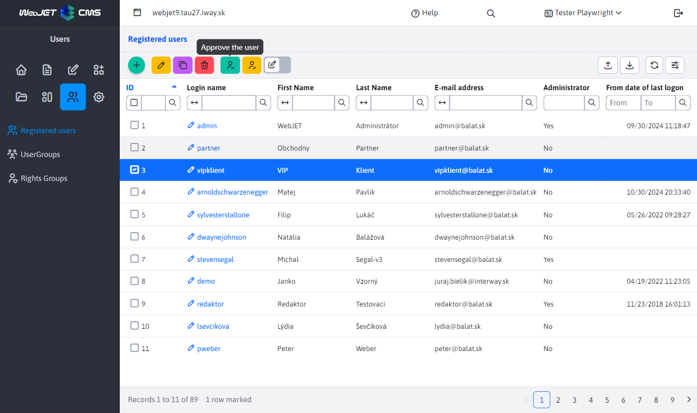

- Added the option to edit the profile to the menu displayed after clicking on the user name in the header. **The profile is only available in the new version** (e.g. on the Home page), the profile cannot be edited in old JSP files. (#54953-22).
- Import - improved **import error message** if a cell contains an incorrect JSON value (#54953-22).
- Import - improved import test - added check for cells that are preserved after import - not found as a column in the Excel file - by setting the value `preserveColumns` (#54953-22).

### Translation keys

**Missing keys** section redesigned. Added information about **last time and URL of missing key call**. Clicking on the key name will display an editor where you can easily add the missing translation.


- Modified import from Excel - **only languages ​​specified in the Excel file are imported** as a column. If you only need to import one language, delete the columns with translations in other languages ​​in Excel. This way, any changes in translations of other languages ​​will not be overwritten.

### Proxies

- Added the option to create a **proxy for REST service in the internal network**. To prevent the response from the REST service from being inserted into the page, enter an empty value in the Extensions inserted into the page field (#54953-21,#55689).
- Added the ability to enter [multiple URLs](redactor/apps/proxy/README.md#app-settings) in the Local URL field and the ability to use an exact match and end with in the URL (#55689).

### Templates

- List of files for the HTML Template field takes into account the value in the Installation Name field, the list is dynamically loaded when clicking in the field, not when opening the editor (#54953-17).
- The template list is **filtered by the currently displayed domain**. Filtering is based on the folders selected in the Show for field and domain name matches (if the template has no access restrictions it will be displayed in all domains). Filtering is only used when the conf. variable `enableStaticFilesExternalDir=true` (#54953-17) is set.

### Mirroring the structure

- Added check for folder/page existence after mirroring is set up, so that **folders/pages are not duplicated unnecessarily if they already exist in the given language** (and the translation matches) (#55193).
- Added translation cache to speed up translation retrieval and reduce API load (#55193).
- Added [website text translation](redactor/apps/docmirroring/README.md#automatic-translation) (#55709).
- Added better [automatic translation identification](redactor/apps/docmirroring/README.md#edit-existing-web-page) with the option of **continuously updating translated pages** until their revision. Automatically translated pages have the author set to `autotranslate` for unique identification (#55709)

### Safety

- Updated library ```xlsx``` for importing XLSX files to version 0.19.3. Library ```amcharts``` has not been updated yet, but there is no problem with it, since the ```xlsx``` library is only used there to generate XLSX files (#55193).
- Updated library ```tui-image-editor``` to use newer version ```fabricjs``` (#55193).
- Updated library ```bootstrap-select``` to version 1.13.14.
- Updated libraries `slf4j` and `logback`.
- Updated the `Thymeleaf` library version to version 3.1.
- Updated NPM modules to a newer version (#55193).
- Audit - improved auditing of background tasks - the server IP address is set in the audit log and the user under which the application server is running is recorded (#55441).
- Audit - improved auditing of entity records using `@MappedSuperclass`. Super class properties are also audited (#54953-22).
- Added automatic deployment to the penetration testing server to CI/CD, set up continuous penetration testing with the ```Acunetix OVS``` tool (#55193).
- Logging - fixed possible XSS in logging level settings (#54273).
- Removed old ```Flash/SWF``` files for banner system, YouTube and video player (#55285).
- Removed library `org.bouncycastle:bcprov-jdk15on:1.70`, it was only used for service `Pay24` and contained a possible vulnerability (#55193-4).
- When calling URLs containing ```/rest```, all HTTP methods are allowed (#54273-44).
- Login - enabled [login timeout extension](sysadmin/pentests/README.md#login-blocking) for 60 seconds after 5 failed password attempts (#55489-4).
- Two-step verification - if you are using authentication against the `ActiveDirectory/SSO` server, you can disable the menu item for setting up two-step verification by setting the config variable `2factorAuthEnabled` to the value `false`.

### WebJET update

- Improved **WebJET update process** directly through WebJET. Files that were deleted during the upgrade to version 2023.18 are deleted during the upgrade (#55293).
- Modified file combination on login screen to reload JS/CSS files after update (#55293).
- Added checking of the ```web.xml``` file after update, checking for the occurrence of ```web-app_2_4.xsd```, if found, it is updated according to the file ```web-v2023.xml```, which is ```web-app_3_0.xsd``` (#55293).

### System changes

- The `Amcharts` chart generation library has been updated to version 5. Support for v4 has been dropped and all chart functions in [chart-tools.js](../src/main/webapp/admin/v9/src/js/libs/chart/chart-tools.js) have been modified to work with v5 (#55405).


- WebJET update - improved file deletion control after update, those that fail to be deleted are written to the file `/WEB-INF/update/error-log.txt` (#55441).
- Cluster - added **possibility to use the last 16 characters** from `HOSTNAME` in `clusterNames=auto` mode by setting the conf. variable `clusterHostnameTrimFromEnd=true`. Necessary e.g. for `Kubernetes`, where there is a random value at the end of `HOSTNAME` (#54953-22).
- Datatables - added option to change **maximum row limit** for export using config variable `datatablesExportMaxRows`, default 50000. A high value may cause excessive load on both the server and the editor's computer (#54953-17).
- **JavaScript file size optimization** - modified embedding of the `amcharts` library for graph generation into the main JavaScript file. The library is inserted into the page asynchronously only when needed. The file size has been reduced by 1MB, which speeds up its initial loading and reduces memory usage (#55405).
- Oracle - added `trigger` to `autoupdate` after login, which sets `NLS_SORT=BINARY_AI NLS_COMP=LINGUISTIC` to support case-insensitive searching (#JTB1684).
- Removed library `backport-util-concurrent` and `org.mnode.ical4j` - they are not used in the standard WebJET CMS, if necessary for your project, you can add them to your `build.gradle` (#54953-19).
- Removed unused files `/admin/FCKeditor/editor/dialog/editor_check_file_exist.jsp,/admin/file_browser/dragdropupload.js.jsp` and folder `/admin/swfupload/*` (#55609).
- **Information about the minimum required Java version on the server** has been added to the home page. The minimum version is set in the config variable `javaMinimalVersion`, setting it to the value `0` disables the warning (#54953-17).

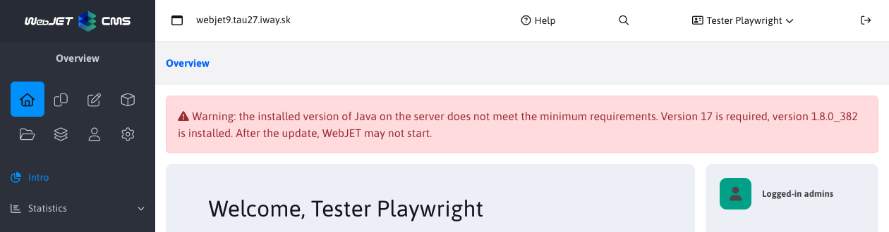

**Moving from Struts to Spring**

- We have started the transition from [Struts framework to Spring](developer/frameworks/struts/README.md). The `/admin/findex.do->/admin/fbrowser/fulltext-index/index/` calls have been reworked (#55389). The Struts call `/sync/getobject.do` is deprecated (used for online synchronization between WebJETs), synchronization using XML/zip files is supported (#55489-3).
- Poll - voting - converted from framework (call `/inquiry.answer.do`) (#55389).
- Modified login using `ActiveDirectory` (calling `/ntlm/logon.do`), verify login functionality on test environments before deploying to production. Removed library `jcifs` (#55489-4).
- Modified visitor login to password-protected zone (call `/usrlogon.do`) (#55489-4).
- Deleted unused Struts calls `/admin/newgroup.do,/admin/media.do` and classes `NewGroupAction/Form,MediaAction/Form` (#55489).
- Questions and Answers - redesigned call `/qa.add.do` to Spring (#55493).
- Websites - redesigned approval of changes in the page (`/admin/approve.do,/admin.approvedel.do`) to Spring (#55493).
- Web pages - reworked uploading of images that are `drag&drop` into the web page editor. Reworked old struts `/admin/uploadfile.do` logic to Spring `/admin/web-pages/upload/` (#55609).
- Explorer - redesigned window for Setting directory and file from struts `/admin/fbrowser.savedir.do,/admin/fbrowser.save.do` to Spring `/admin/fbrowser/dirprop/,/admin/fbrowser/fileprop/` (#55617).
- When using `jar-packaging`, the file `struts-config.xml` is read from the JAR file for the possibility of updating it with WebJET, the original one on the file system is deleted.
- Attachment download in forms - converted from struts `/admin/formatt.do` to Spring `/apps/forms/admin/attachment/` (#55613).
- Removed unused `/admin/FCKeditor/styles.do,/admin/dir.do,/admin/editornewdir.do,/admin/formsendnotify.do,/admin/dragdropupload.do` calls and corresponding Java classes (#55489).
- Removed call `/admin/savedoc.do`, modified `inline_page_toolbar.jsp` to use Spring form (#55489).
- Removed unused class `SearchForm` and forms `uploadFileForm,formNoteForm` (#55489).
- Reworked [WebJET initialization](install/setup/README.md) and [license key](install/license/README.md) setup (#55701)

### Documentation

- In the [Editor's Manual](redactor/README.md) and [Administrator's Manual](admin/README.md) sections, additional documents in `docx` format for download have been added, which contain basic information about working in WebJET CMS (#43144).
- Documentation created for [installation](install/setup/README.md) and [basic configuration](install/config/README.md) (#54953-23).

### Bug fixes

- Automated tasks - added missing Running on node field for node setup in cluster installation (#55193).
- Dialpads - fixed setting of dialpad ID for import, fixed importing of dialpad that does not yet have any entries (#55569).
- Dialpads - fixed filtering by selected dialpad type (#55541).
- Datatables - fixed record duplication for some cases (e.g. domain limits where a primitive int is used as the ID).
- Datatables - fixed display of column settings when moving them - incorrectly displayed list in the Column View window (#54953-15).
- Datatables - Import/Export - modified export format for values ​​of type `1,2,3` so that they are considered a string, not a number (#55569).
- Datasheets - improved search when you enter a value but click the magnifying glass icon in another column (or enter multiple filter criteria at once) (#54953-18).
- Datatables - fixed setting of column width after entering a date into the filter (#55497).
- Datatables - export - added use of external filter when exporting data (#55845).
- Discussion forum - corrected HTML code when creating a multi-topic discussion, added tools for setting up discussions in the administration (approval settings, deadlines).
- Email - fixed SMTP server port setting if login and password are not used (#55545).
- Forms - corrected decoding of HTML form code.
- Forms - fixed conflict between column names and system name (e.g. `note`) (#54273-47).
- Forms - fixed sending form as attachment (#55705).
- Easy form - added option to use `+` character in placeholder text field (#54953-21).
- Gallery - added to generate ```/thumb``` image when changing area of ​​interest - after saving the image, the current date and time are set, which triggers its generation (#54953-15).
- Gallery - fixed loading of image when user is logged in, `v` parameter is specified and it does not exist/redirected (#54953-17).
- Gallery - fixed uploading an image to the gallery if the image already exists (overwriting the `o_` image) (#54953-25).
- HTMLBox - added support for uploading files via the httpS protocol when using `/components/htmlbox/include.jsp`. The httpS protocol will be used if the connection to the website is secure (#55489-4).
- News - fixed error display in server logs when tag does not exist. Fixed unnecessary call of old JSP component for displaying news in editor (#54953-18).
- Oracle - fixed searching by name (e.g. in audit) (#JTB1684).
- Weather - modified appearance of application settings, added compatibility with running on Java 11 (#55293).
- Translator - fixed character encoding setting ```utf-8``` for correct transmission of diacritics (#55193).
- Translation keys - fixed the ability to search by multiple columns, added remembering of displayed columns (#54953-18).
- Domain redirects - fixed cache and cluster update when creating a new redirect of type `ALIAS` (#55489-4).
- Explorer - fixed file and folder settings, removed duplicate and unsupported options (create archive, convert to PDF, etc.) (#55489-1).
- Explorer - fixed Duplicate function and display of logged-in user menu (#54953-22).
- Users - fixed checking of the required Login field, fixed password quality check.
- Users - fixed rights setting when loading the editor with URL parameter `id` (#54953-22).
- Template groups - fixed import of template group list - empty value ```renderFormat``` (#55285).
- Templates - template groups - fixed the ability to set an empty value in metadata (#54273-47).
- Statistics - fixed display of Page Views in the TOP pages section (#55193).
- Search in administration - fixed link to edit translation key to new version and link to view website folder (#54953-22).
- Web pages - added text check for ```data not loaded``` when saving a page. This can occur if the web page data is loaded incorrectly before editing (#54273-43).
- Websites - modified website import - saving the list of banners (#55285).
- Web pages - PageBuilder - fixed CSS styles for setting zero margin for ```div.row div.row``` elements (#54953-15).
- Web pages - PageBuilder - fixed error in setting the template for a newly created page if the folder template and the folder's main page template do not match (#55441).
- Websites - fixed duplication of the root folder when editing it (if it is the main domain folder) (#55441).
- Web pages - fixed loading of a page from history if the page is stored in multiple folders (#54953-20).
- Web pages - fixed preview display of newly created (not yet saved) page (#54953-20).
- Web pages - fixed moving pages stored in multiple folders in the tree structure (#54953-21).
- Web pages - fixed filtering by tags if a selection field is used - more than 30 tags are defined (#54953-23).
- Web pages - fixed setting of page URL if a page with the same name/URL already exists (#54953-23).
- Web pages - fixed loading of list of pages for approval in Oracle DB with a high number of folders (#54953-24).
- Web pages - fixed error setting value 0 to attribute `viewsTotal` when saving web page (#54953-24).
- Web pages - fixed saving attributes for a web page in multiple folders (#54953-24).
- Web pages - fixed display of the Media list of this page when using a gallery and domain aliases (duplicate display of Images instead of Photo Gallery) (#54953-25).
- Web pages - fixed displaying the correct folder when changing an existing image (select the image and click the insert image icon) (#54953-25).
- Campaigns - fixed sorting in nested editor data tables. Created autotest to verify functionality (#55565).
- External filter - when presetting values ​​from an external filter, the value was also written to the data table (if the columns were called the same), and this value in the data table prevented filtering through the external filter. Fixed, these values ​​are no longer set to the data table + its filter above such a column becomes `disabled` to prevent such an error (#55537).
- Table width - fixed bug where the table width was not adjusted with the table parameter `autoHeight` if we filtered in the given table (#55537).
- Web pages - fixed loading of regular expression list when editing a page for users who do not have rights to the forms section (#55501).
- Web pages - added logic for deleting pages in [multiple folders](redactor/webpages/editor/README.md#arrangement-in-tree-structure). When deleting the main web page from the trash, all pages in other folders will also be deleted (#55813).

### For the programmer

- Datatable - added ```renderFormat = "dt-format-image"``` to display [small image preview](developer/datatables/README.md#column-settings) with a link to the full version and the image link text (#55285).
- Datatable - added option to add [notification](developer/datatables-editor/notify.md) also when calling `/all` (#55497).
- Modified constructors of ```Tools/DB/utility``` classes from ```private``` to ```protected``` to allow their extension in client projects (#54953-14).
- Removed ```com.googlecode.lambdaj:lambdaj``` library, expressions replaced with standard Java 8 Lambda functions (#54425).
- Added sample support for [container development](developer/install/devcontainers/README.md) using the ```devcontainers``` specification.


- Documentation created for [migration from Struts to Spring](developer/frameworks/struts/README.md)
- Modified file upload/`upload` handling. For URLs `path.contains("spring") || path.contains("rest") || path.startsWith("/admin/v9/") || queryString.contains("__sfu=0")`, the old `MultipartWrapper.getFileParameterValue(key)` is not used but the standard Spring `MultipartFile`.


## 2023.18

> Version 2023.18 is focused on integrating the original version 8 code. **The option to ** switch to the old version 8** has been removed**, parts of the code that have already been redesigned or are no longer supported have been removed. **The main API changes** are in the use of **generic objects** of type ```List/Map``` instead of specific implementations ```ArrayList/Hashtable```. Therefore **you need to recompile your classes and edit your JSP files**.

Significant changes in this version:

- Website
  - Updated the ```ckeditor``` library (page editor) to the latest version 4.21.
  - Added option to set the ratio of [tree structure column width and data table width](redactor/webpages/README.md#setting-tree-structure-display).
  - Added integration of [page attributes into the editor](redactor/webpages/doc-attributes/README.md).
- Applications
  - Banner system - redesigned **statistics of views and clicks** on the banner to a new look.
  - Forms - added option **archive form**.
  - [Enumerations](redactor/apps/enumeration/README.md) - redesigned to a new design.
  - Users - in a multi-domain installation, in editing users and rights groups, it is possible to select website folders and individual websites regardless of the currently selected domain.
  - Translation keys - display of **translation keys** adjusted to **table format**, where columns represent languages.
  - Templates - added option to **merge two templates** into one.
- Security
  - Performed **security tests** during client deployment and tests with automated tool ```Acunetix OVS```.
  - Updated several libraries.
- System
  - Improved **support** for **Oracle and Microsoft SQL** database servers.

Of course, several bugs that were identified while using WebJET on multiple projects have also been fixed.

<div class="video-container">
    <iframe width="560" height="315" src="https://www.youtube.com/embed/A5upeBuEMbg" title="YouTube video player" frameborder="0" allow="accelerometer; autoplay; clipboard-write; encrypted-media; gyroscope; picture-in-picture" allowfullscreen></iframe>
</div>

### Removing dependency on version 8

For better integration and future development, the dependency on WebJET CMS version 8, which was available until now, has been removed, including the option to switch the administration user interface to version 8. It is unsustainable in the long term to support both versions and use new technologies at the same time. Version 8 files have been moved directly to version 2023, which will allow us to directly modify them to the new interface. The parts that have not yet been redesigned remain in the old interface, the redesigned ones are only available in the new interface. The option to switch the user interface to version 8 has been removed.

To simplify the upgrade, you can use the ```/admin/update/update-2023-18.jsp``` script to check and fix JSP files. Custom Java classes need to be recompiled and errors fixed due to API changes.

The code needs to be deleted from the ```build.gradle``` file:

```
implementation("sk.iway:webjet:${webjetVersion}:struts")
implementation("sk.iway:webjet:${webjetVersion}:daisydiff")
implementation("sk.iway:webjet:${webjetVersion}:jtidy")
```

Cleaned/deleted several Java classes and packages and corresponding JSP files. To support the deleted parts in projects, it is necessary to use either the corresponding WebJET NET product or transfer them to the project from version 8:

- Sending SMS messages ```SendSMS```, converting Sk to Eur ```SkkEuroLoader```, Importing SAX ```XmlSaxImporter```, Inserting JS/CSS directly into the page (Packager), compiling ```sass```, ```SassFileMonitor```, ```Skriptovanie v editore```, importing users from ```TXT/CSV``` file in old ```Outlook``` format (use import from xlsx format).
- ```iwcm:vue``` and ```vue.tld``` tags for inserting VUE components, today we recommend inserting them directly as JS files.
- Integration on ```Alfresco``` and ```Sharepoint``` (will be available later as part of the NET product).
- Applications: Bazaar, ```AppCache```, ```Chat```, ```Clipboard```, ```Docman```, ```emailAttachmentsPublisher```, ```Events```, Graph, Property, Advertisement, ```PageUpdateInfo```, Advice, SITA, Tip of the day, Storage, ```Wiki```, Contracts (some applications are replaced in the WebJET NET product).
- Social login, a library without ```socialauth``` support was used. ```OAuth``` integration is planned, or Spring Social is used.
- Conversion from Doc to PDF (the service is no longer available).
- Removed config variables: ```editorEnableScripting,enableToPdfConversion,doc2pdfConvertUrl,packagerMode,packager*,```.

### Website

- When duplicating a web page, the window will switch to the Basics tab when opened for easier name changes, the URL address and Menu item name fields will be cleared to automatically set to the new page name. Similarly, empty values ​​will be set when duplicating a folder (#54953-6).
- Added media duplication when duplicating a website (#54953-6).
- Added option to set the ratio of [tree structure column width to data table width](redactor/webpages/README.md#setting-tree-structure-display). Suitable if you have a wide or narrow monitor and need to see more/less in the tree structure (#54953-7).


- Adjusted the order of URLs when searching by page ID. The list now lists pages with the shortest URL at the top (sorted alphabetically by URL length) (#55001).
- In [page history](redactor/webpages/history.md) added column Will be disabled with possible date when the web page display will be disabled (#54953-10).
- Updated the ```ckeditor``` library (page editor) to the latest version 4.21.1, created [GIT repository](https://github.com/webjetcms/libs-ckeditor4/pull/1/files) with the version for WebJET CMS (#55093).
- Fixed Block Settings function (#55093).
- Image editor (clicking on the pencil after selecting an image on the page) replaced with a new version as used in the gallery, disabled option to use ```Pixlr``` editor (switched to commercial version and API access does not work) (#54993).

### Page attributes

Added integration of [page attributes into the editor](redactor/webpages/doc-attributes/README.md). Allows you to define fields that are then set on the web page. Attributes are divided into groups (e.g. Monitors, Mobile Phones, etc.) from which you can select (#55145).

The advantage over optional fields is the theoretically infinite number of fields and the ability to organize fields into groups. In the database, values ​​are stored in the correct data types, which allows for sorting using database queries (optional fields also store the number type as a string).

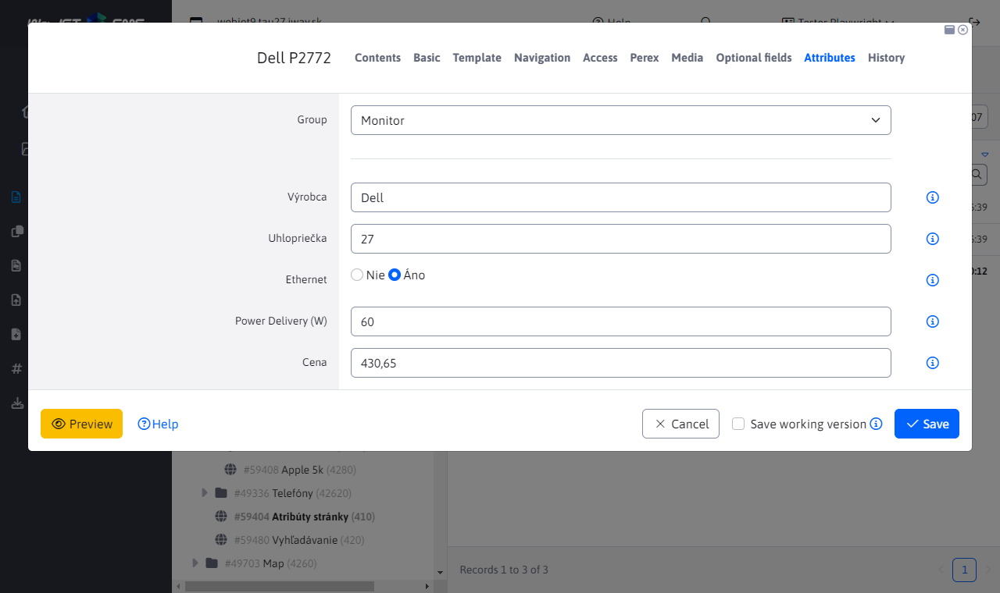

Once set up, the attributes can be displayed in a comparison table:

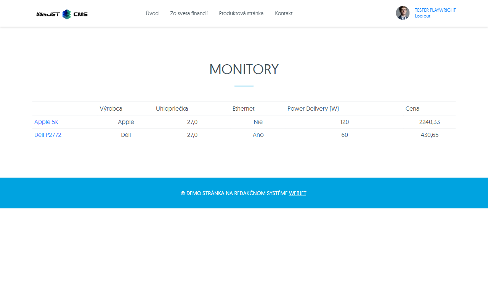

Or, the specified attributes can be displayed as an application on a web page, e.g. as a list of product properties:


Added features:

- The definition of attributes is tied to the current domain, you can have independent attributes defined in each domain.

### Data tables

- Custom fields - added option to set field type [text area and non-editable text](frontend/webpages/customfields/README.md#text-area) (#55001).
- Added option to [set table](developer/datatables/README.md#configuration-options) height according to its content (number of rows) so that it does not fill the entire window height (e.g. if there are multiple tables in a row or a chart is also added) by setting the option ```autoHeight: false``` (#54989).

### Banner system

- Redesigned statistics of banner views and clicks to a new form (data tables, graphs) (#54989).

### Forms

- Added option to archive form, converted Form Archive section into data table. Removed old form list display code (#54993).

### Dials

- Dialer app redesigned to a new design (#55009).

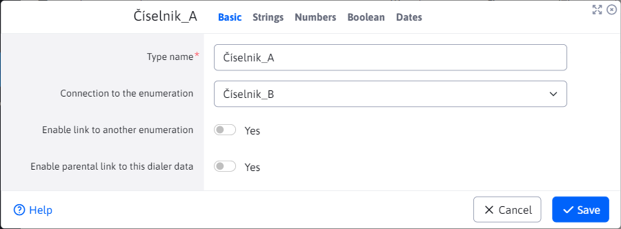

### Gallery

- Added the ability to set the ratio of the width of the tree structure column and the data table. Suitable if you have a wide or narrow monitor and need to see more/less in the tree structure (#54953-7).
- Added the option to display the gallery from a specified folder in the URL parameter ```dir```. When editing the gallery application settings on the page, the set folder will be displayed directly (#54953-8).
- When creating a new folder, the dimensions (including the resizing method) and watermark values ​​are preset according to the parent folder (#54953-11).
- Added support for displaying folders when using domain aliases. By default, the ```/images/ALIAS/gallery``` folder is displayed/opened, but for backward compatibility, other gallery folders are also displayed (if they do not contain a domain alias of another domain in their name) (#54953-12).

### Users

- In a multi-domain installation, in the user and rights group editing, it is possible to select website folders and individual websites regardless of the currently selected domain. Domains are displayed as root folders. The display of the selected item contains a prefix with the domain name to distinguish individual folders (they are often called the same in different domains, e.g. Slovak) (#54953-11).


- User interface - removed the option to edit the user profile by clicking on the name in the header, user data can now only be modified by an administrator with rights to the Users section.

### Proxies

- [Proxy](redactor/apps/proxy/README.md) application reworked to new design/datasheet. Documentation and automated tests added (#55025).

### Translation keys

- Translation keys display adjusted to a table format, where columns represent languages. This means translations in all languages ​​are displayed at once (compared to the original version where you only saw the translation of the selected language) (#55001).
- The displayed languages ​​are defined in [config. variable languages](admin/setup/languages.md).
- In the displayed columns settings, it is also possible to enable the display of the original values ​​before changing the translation key.

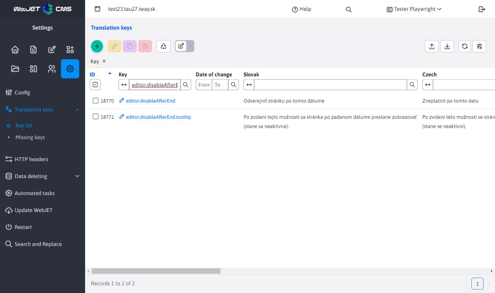

- Old method of exporting/importing keys in ```properties/json``` format has been discontinued, import and export via Excel is now supported. (#54953-8).
- Optimized speed of import from Excel file - only information about the import is audited, not individual records, empty values ​​are skipped (typically empty columns of unused languages), records are compared against the cache table (during import, it is not necessary to test for each record whether it exists in the database) (#MR342).

### Templates

- Added the ability to merge two templates into one. When merging, the merged template in folders and websites will be replaced by the newly selected template (#55021).
- Modified import - if there are no corresponding pages for the header/footer/menu, then empty pages will be created to avoid an import error. Similarly for template groups and folders (Show for) (#MR348).

### Configuration

- Added the ability to import and export configuration variables using Excel format (#54513-11,MR360).

### Usability

- Modified usability of ```autocomplete``` fields (typically group selection in the Banner system, Survey, Questions and Answers, Scripts). Clicking the cursor into the field immediately displays a selection field with a list of options, but it is possible to write the beginning of the text in the field to search in the list and also enter a new value.

### Safety

- Audit - added a separate right for Logging Levels, as they also allow viewing server logs. The right is disabled by default, set it to the appropriate user after the update (#54953-5).
- Fixed setting of URL address with parameter and password memory when logging in - attribute ```autocomplete="off"```, attribute automatically set for all fields of type password in the datatable editor (#JTB-1587).
- Added returning a 404 error for urls of type ```/admin.tgz``` (#JTB-1587).
- Improved access control to administration/rights control based on penetration test findings (#JTB-1606).
- Modified SQL error messages when saving a record in a data table - a shortened version of the error is displayed to the user, the complete version is recorded in the audit (#JTB-1606).
- Updated library ```Spring Security``` to version 5.8 (#54993).
- Websites - fixed possible XSS in page/folder name (#55181).
- Websites - fixed possible XSS in the application preview on the page (#55181).
- Search and replace - fixed possible XSS in app preview in page (#55193).
- Logout - the ```forward``` parameter allows you to enter only a local URL address, external ones must be entered using redirection via ```forwardDocId``` (#55193).
- Updated Datatables library to version 1.13.4 for version 8 sites and library in ```/components/_common/datatables``` folder (#55193).
- Fixed possible vulnerabilities when creating ZIP archive (added path validation) (#55193).
- Added configuration variables `DocTools.removeCharsDir` and `FileBrowserTools.forbiddenSymbols` for the ability to define prohibited characters in file/directory names (#MR445).

### System

- Improved support for Oracle database server (#54953-6, #54953-7).
- In a multi-domain installation using domain aliases, when generating the ```/thumb``` image, it is verified whether the variant exists in the folder with the added domain alias (```/images/ALIAS/cesta/obrazok.jpg```). If it does not exist, the originally requested path is used (#54993).
- Added config variable `languages`, [setting available language mutations](admin/setup/languages.md)
- Adjusted pause when writing statistics - originally a random pause (0-10 seconds) was performed before each SQL statement is written, now it is performed only before the first record. The pause is random so that the cluster does not experience excessive database load at 0 seconds when the background task for writing statistics is performed by default.

### Bug fixes

- Banner system - fixed bug in recording the number of views and clicks on the banner (#54273-40).
- Datatable - fixed editing of a cell in a nested table (editing a cell did not have the display above set correctly) (#54953-5).
- Forms - fixed the ability to decrypt form data (#54993).
- Gallery - fixed zoom setting in the Area of ​​Interest tab in Firefox and scrolling of large image (#54953-5.6).
- Gallery - fixed display for table type - incorrect table height (#54953-7).
- Bulk email - fixed the possibility of entering multiple email addresses for unsubscribe (#54953-6).
- Data table - corrected percentage calculation when importing from Excel, added information about the row and total number of rows to the import window (#MR341).
- Datatable - fixed searching for a record by ID in the URL parameter when sorting on the client side (when the table is sorted other than by ID) (#55021).
- Datatable - fixed searching by ID if primary key is different than ```id``` (e.g. ```tempId```) (#55021).
- Datatable - fixed nesting of editing and opening of additional windows (e.g. from a web page editing template, there editing of the header page). Added darkening of the header and footer of the parent window and slight reduction of the nested dialog (#54273-41).
- Datatable - in duplicate mode, nested datatables will be displayed with a black overlay unavailable for editing (dimmed). Typically, nested datatables display linked data and in duplicate mode, the data of the original record would be changed. Typically, when editing a web page, edit in the Media tab (#54273-37).
- Gallery - fixed zoom setting in the Area of ​​Interest tab in Firefox and scrolling of large image (#54953-5.6).
- Gallery - fixed display for table type - incorrect table height (#54953-7).
- Gallery - fixed loading of images in multidomain version with external files (#MR341).
- Bulk email - fixed displaying an invalid email address error in a group when adding it (#54953-12).
- Data deletion - modified display of menu items, several items merged into Database records (#54953-7).
- Questions and Answers - modified default ordering so that the newest questions are at the top of the list (#54993).
- PageBuilder - adjusted how page button styles are affected by administration styles (#54953-6).
- Users - fixed display of inactive selection fields in the rights tree structure (#54953-9).
- Users - email address validation error fixed (#54953-12).
- Translation keys - fixed error inserting key with tab character at the beginning/end (#MR-364).
- Web pages - fixed initial loading of the page list if the folder contains more than 10 entries (#54953-6).
- Websites - fixed folder duplication if multi-domain configuration is not set (#54953-6).
- Web pages - fixed reloading of the list of web pages in a folder after changing the folder's main page (#54953-7).
- Website - fixed cosmetic defect displaying filter by status and displaying table in dialog box (#54953-8).
- Web pages - fixed disabling of page publishing after a specified date - option Publish page after this date (#54953-10).
- Web pages - fixed setting of current date in Start date field when config variable ```editorAutoFillPublishStart=true``` is set (#54953-11).
- Web pages - fixed setting the editor text value when editing a cell (#55057).
- Web pages - fixed duplicate URL detection for addresses without .html at the end and without a slash (#55161).
- Website - fixed icons in news template editing (#54953-13).
- Web pages - modified display of dialogs (e.g. application properties) when using PageBuilder (the window is in a layer higher than the editor toolbar), fixed the ability to move the window for Spring applications.

### Testing

- Added option ```afterCreateSteps(I, options, requiredFields, DT, DTE)``` to [Datatable testing](developer/testing/datatable.md#options-settings), ```DataTables.baseTest``` for setting e.g. mandatory fields after saving a record (if the table does not contain any mandatory fields, it is possible to set a field for searching for a record in the next steps).
- Added test ```webpages.webpage-virtual-path ``` of setting page URL addresses - checking for duplication, checking addresses with an asterisk (#55161).

### Documentation

- Added documentation for setting [page attributes in the editor](redactor/webpages/doc-attributes/README.md) (#55145).

### For the programmer

- Added API method [DatatableRestControllerV2.afterDuplicate(T entity, Long originalId)](developer/datatables/restcontroller.md) called after duplicating a record. This way, you can also duplicate attached data such as web page media (#54953-6).
- Added JavaScript function ```WJ.selectMenuItem(href)``` for [highlighting specified menu item](custom-apps/admin-menu-item/README.md#frontend) in ```master-detail``` pages (#54953-9).
- Added support for fields of type ```DataTableColumnType.JSON``` in [application parameters](custom-apps/appstore/README.md#application-parameters) and directly in the Spring class. The field settings for the editor (application settings in the editor) and when displaying the application on the page are aligned. (#55169).
- Created documentation for [extending existing Spring DATA repositories](custom-apps/spring/repository-extend.md) in your project (#UCMWS-14).
- Added [dialog extension] option (developer/datatables/export-import.md#special-export-type) for special import and export of data from a datatable (#54513-11,MR360).


## 2023.0

<div class="video-container">
    <iframe width="560" height="315" src="https://www.youtube.com/embed/_Rt-GJk-E1Y" title="YouTube video player" frameborder="0" allow="accelerometer; autoplay; clipboard-write; encrypted-media; gyroscope; picture-in-picture" allowfullscreen></iframe>
</div>

Version 2023.0 is identical to [version 2022.52](CHANGELOG-2022.md).
