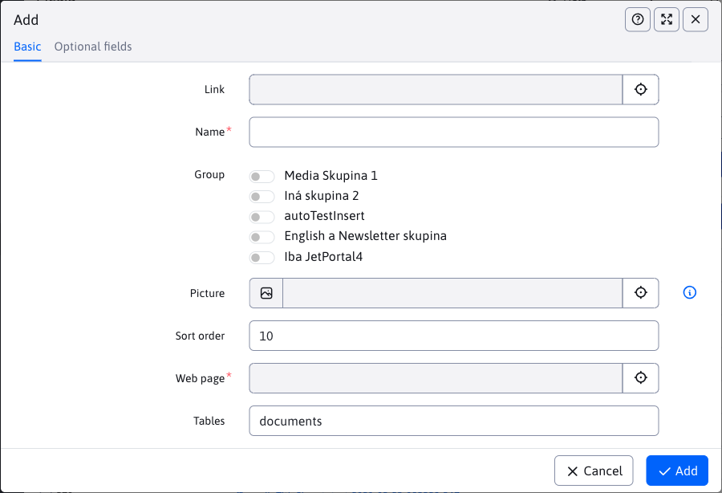

# Changelog version 2023

## 2023.52/2024.0

> Version 2023.52/2024.0 includes a new version **updates describing the changes**, **cloning structure** integrated with the mirroring function (including the possibility of interlacing), adds the possibility of **Retrieved from** web page, or **the entire folder from the bin**, adds **HTML editor** and the ability to set the editor type directly for the template, **applications** it is possible **enable display only for selected device types** mobile, tablet, PC and of course improves the safety and comfort of work.

### Groundbreaking changes

This version introduces several changes that may not be backwards compatible:
- Discussion/Forum - add new post and approval modified from Struts to Spring, use call `/admin/update/update-2023-18.jsp` For [basic treatment](install/README.md#zmeny-pri-aktualizácii-na-202318). User profile editing cancelled, we recommend using the standard editing component [registered user](redactor/zaheslovana-zona/README.md) (#55649).
- Import from Excel - if you have a special version of import from Excel in your project that calls the URL `/admin/importxls.do` edit the form and URL according to `/admin/spec/import_xls.jsp`. The update script should solve the basics for you `/admin/update/update-2023-18.jsp` (#55905).
- Restoration menu - rebuilt from Struts to Spring, use the update script and verify the menu is displayed on the web page (#55945).

### User interface improvements

- Web pages - Blocks - increased size of the window for inserting blocks, added the ability to directly edit a web page when it is inserted by Dynamic link (#56017).
- Web Page Editor - Increased height of text/header styles selection menu for better overview/selection options (#56017).
- Applications - once again improved window size for applications - both height and width including windows when using PageBuilder. Optimized size of nested datatables. Adjustments in `top.jsp,datatables-wjfunctions.js` (#56013).
- Apps - updated photos of apps and their descriptions in the list of apps in the page editor. Fixed various minor visual bugs in app settings (#55293).
- Datatables - during a long-lasting operation, the connection to the server may be interrupted, in which case the message "An error occurred while communicating with the server. It is possible that the operation is taking too long and will be executed later. Wait and check after a while to see if the operation is executed." to distinguish it from a standard record save error.
- Datatables - added option [import only new records](redactor/datatables/export-import.md#import-dát)if the record by the selected column already exists is left unchanged (#56061).


### Website

- Import/Export - added setting of local folder IDs when creating a template. Addresses an issue when editing a page after importing, where the template is created but does not have the correct folder access set. Non-existing folders are filtered out. We recommend checking the template settings after import (#55993).
- When you create a new web page and upload an image/file/media, the Media folder for that page is already created before saving. It will be created according to the value entered in the Item Name field in the menu (#54953-29).
- When editing one web page, the insert image/link window remembers the last folder even after it is closed and does not switch back to the Media section of that page when it is reopened. This is more practical if you are inserting multiple images from a different folder. You can still switch to the Media section of this page by clicking in the tree structure (#54953-29).
- Added support for , [Recovering web pages and folders from the Recycle Bin](redactor/webpages/recover.md) (#55937).
- Folder `/files` with a full text file index is moved to the System tab (#54953-30).
- Templates - added the ability to set the Page Editor Type (formerly Inline Structure Editor) for a template, the default is By Template Group, where the Page Editor Type is set by the assigned template group (#56129).


- Editor - added HTML page editor type, where the page editor is displayed directly in HTML mode (HTML code). Allows to edit special page types that may not switch to visual mode due to e.g. special code (#56129).


- Editor - added the ability to set the size/width of the editor also in Standard mode. So you can view the page in width mode for mobile, tablet and computer (#56129).
- Editor - unified Standard/Page Builder mode switching (#56129).
- Ninja - added support for additional browsers to define the minimum supported version in `config.properties` type `minBrowserVersion.crazy\u0020browser=10` (#56129).
- For pages with display disabled, also adjusted page title color to red (#55997).
- Editor - modified Paste as plain text and Paste from Word to open a dialog box to paste text from the clipboard (#56189).


- Editor - improved cleanup of code embedded from Excel - removed cell width and CSS stylesheet class settings (#56189).
- Editor - edited inserting links to email address - incorrect display of http prefix when entering email address (#56189).

### Page Builder

- Page Builder redesigned to use new JavaScript files identical to the ones used when editing a web page (until now, the old ones from version 8 were used). The page code is embedded directly when the page is displayed, no need to make a REST service call. Additional CSS and JavaScript files are embedded using `combine` with one call. The number of HTTP requests was reduced from 42 to 24 (#56017) when displaying a normal page.
- Loading in the editor should be faster, the new version doesn't contain old parts of the code, some objects will be reused.
- In the future, only the Page Builder version will be available in the Web page section, the separate inline editing when displaying a web page will be removed (for script consistency reasons).
- Visibility settings adjusted to Mobile, Tablet, Desktop options in concert with editor width toggle (#56017).
- Added option [generate menu](frontend/page-builder/blocks.md#podpora-menu) For `single page` types of pages. The menu is generated automatically according to the sections in the web page (#56017).

### Spring applications

- Added application name to the settings window instead of the generic name Edit (#55997).
- Spring applications have the added [View tab](custom-apps/appstore/README.md#karta-zobrazenie) for setting the application to display on different devices and the ability to set the HTML output to be cached for faster web page display. If no device is selected the application will always be displayed.


### Restaurant menu

- Restaurant menu section (application) converted into date tables [Restaurant menu](redactor/apps/restaurant-menu/README.md) (#55945).


### WebJET update

Improved process [WebJET CMS updates](sysadmin/update/README.md), transferred to the new design, added accents to the changelog, display the changelog with highlighted text and images.


### Banner system

- Added support for [Display banner for specific device type](redactor/apps/banner/README.md#zobrazenie-banneru-pre-špecificky-typ-zariadenia), i.e. displaying only on a mobile phone, or only on a tablet, for example. So you can display different banners for different devices (#55921).


### Forms

- Added the Company field to the list of fields of the logged in user when completing the form (#55961).

### Gallery

- Optimized initialization of the image editor - after the first initialization, the existing instance (#55853) is used.
- Optimized data retrieval - reduced the number of REST service calls from 6 to 1 when displaying the gallery (#56093).

### HTTP headers

- Added header setting option `Content-Language`, [automatic adjustment](admin/settings/response-header/README.md#nastavenie-pre-súbory) headers for files.
- Added support [header settings](admin/settings/response-header/README.md) for an exact URL match using `^/path/subpath/$` and the option to set it for certain suffixes `/path/subpath/*.pdf,*.jpg` (#56109).


### Calendar of events

- Added option to create an event type with a space in the name (#56054).
- Added Cache deletion after adding a new event (#56054).

### Cloning structure

- [Cloning structure](redactor/apps/clone-structure/README.md) is integrated with [by mirroring](redactor/apps/docmirroring/README.md) for the possibility of creating translation and linking pages when cloning a language mutation. The language is taken from the source and destination folder settings (#55733).
- After the clone is created, the mirroring of changes is automatically set, if necessary you can cancel it by editing the conf. variable `structureMirroringConfig`. Changes will be transferred between the clone and the original structure.


### News

- To [news templates](redactor/apps/news/README.md#šablóna) added objects `$pagesAll` with the whole pagination list (`$pages` contains an abbreviated list) and `$totalPages` with the total number of pages.

### Users of

- User deletion - fixed situation when currently logged in user tries to delete himself (#55917).
- [List of users](admin/users/README.md) - added columns Directory and Site Permissions and Approvals to the table. Due to the nested data in the columns, it is not possible to search and sort by value (#55897).
- User List - added Rights Group view to display admin rights groups in a table with the ability to filter by the selected group (#55601).

### Translation keys

- Added option [import only new](admin/settings/translation-keys/README.md) (not yet existing) keys. Key existence is checked for each language (#56061).


### Redirections

- Path redirects - in a multi-domain installation, only records according to the currently selected domain and records that do not have a domain set (#55957) are displayed.

### Proxy

- Added HTTP header settings `Content-Type` By [answers from proxy](redactor/apps/proxy/README.md) (when using a proxy on a REST service/without embedding it in a web page) (#56054).

### Statistics

- The folder selection filter in the statistics view displays only the folders that the user has permissions to in the list of web pages. On the first visit, the statistics are displayed for the first allowed folder. This allows even editors with limited rights to the tree structure of web pages (#55941) to view the statistics.
- Added the Show Statistics for All Folders permission to allow display of the entire tree structure regardless of the site permissions (#55941).

### Optional fields

- Added field type `UUID` for generating [a unique identifier](frontend/webpages/customfields/README.md#unikátny-identifikátor).


### Tags

- Tags - the list of available tags is displayed according to the rights to the website sections. Thus you can make tag administration available only for a specific tree section of a web site (or domain). Thus, if a user is only allowed access to the /Newsletter section of the website, only tags that have that section added or tags without display restrictions (#55961) will be displayed.

### Mirroring the structure

- Added the ability to add another folder ID for mirroring later, using [Cloning structure](redactor/apps/clone-structure/README.md) it is possible to add the content of the new language (#55733).
- Added synchronization settings check - if you remove the folder ID from the conf. variable `structureMirroringConfig` pages and folders in the removed structure will no longer be synchronized (#55733).
- Added ability to create in mirrored folders [pages and folders with display turned on](redactor/apps/docmirroring/README.md#priebeh-zrkadlenia) (e.g. during the page development phase), just set the conf. variable `structureMirroringDisabledOnCreate` to the value of `false` (#55733).
- Translator - [For DeepL](admin/setup/translation.md) is possible in the conf. variable `deepl_api_url` set the service API URL. The default value is for the free version, when using `Pro` versions set to `https://api.deepl.com/v2/translate`. Modified the way of authorization against the API to the new version using the HTTP header `Authorize` (#55733).

### Security

- Updated library `logback` to version 1.3.14.
- Vulnerability fixed `CVE-2022-26960` in the library `elfinder`.
- Users - Profile - added information about the quality of the password when changing it (#56077).

### System changes

- Optimized JavaScript file size - library `moment` is loaded with only the necessary languages instead of all available languages (used `MomentLocalesPlugin`). Size reduced by 300kB (#56093).
- Update - from 2023.40-SNAPSHOT onwards, the update server also has packages ready for updating WebJET running in JAR mode, the update server will provide the update file according to the mode type.

**Switching from Struts to Spring**

- WebJET update - redesigned WebJET update [WebJET update](sysadmin/update/README.md) (#55797)
- Discussion/Forum - reworked adding a new post from Struts to Spring, reworked approving (#55649).
- Site rating - redesigned [Rating/Rating](redactor/apps/rating/README.md). Class `RatingDB` substituted for `RatingService` a `RatingBean` For `RatingEntity` (#55729).
- Import XLS - URL for importing XLS files changed from `/admin/importxls.do` at `/admin/import/excel/`, use the example in `/admin/spec/import_xls.jsp` to update your files (#55905).
- Restaurant menu - redesigned at Spring, classes `MenuDB,MealDB,MenuBean,MealBean` substituted for `RestaurantMenuService,RestaurantMenuEntity,RestaurantMenuMealsEntity` (#55945).
- Web pages - redesigned cloning option from struts to Spring [Cloning structure](redactor/apps/clone-structure/README.md) (#55733).
- Web pages - redesigned importing pages from ZIP archive [Importing web pages from a ZIP archive](redactor/webpages/import-export.md#importovanie-web-stránok-zo-zip-archívu) (#55905).
- Web pages - redesigned import of pages from Excel file [Importing web pages from an Excel file](redactor/webpages/import-export.md#import-štruktúry-z-excel-súboru) (#55905).

### Error correction

- Dials - corrected pagination in dials (#56013).
- Datatables - corrected the position of the window from the nested datatable to make it fit entirely in the browser.
- Forms - fixed error displaying the date in Last Submitted in the list of forms on the Oracle database.
- Forms - fixed export of form data and duplicate export file generation (#56141).
- Gallery, File View, File Archive - fixed folder selection in application properties in page (#54953-27).
- Gallery - fixed double slash in gallery URL in some scenarios (#56017).
- Bulk email - added duplicate checking of email addresses regardless of case (#55961).
- Configuration - fixed duplicate display of conf. variable when adding an existing variable (#55733).
- Configuration - fixed import of special characters like `'&#<` and search in such value (#55993).
- Json editor - fixed setting and changing the image in applications using Json editor (e.g. Recommendations, Impressive Presentation, etc.) (#55293).
- Users - corrected display of user rights in editing - also rights by group were displayed checked, not only set ones (#55797).
- Users - Profile - fixed password change error (#56077).
- Restart - fixed Restart function in Settings menu (#54953-30).
- Scripts - fixed inserting scripts into the page - the search for the position name was incorrectly used as a sub-string and the script was inserted even if the position name didn't match exactly (#54953-30).
- `Slider` - jQuery library compatibility fixed (#55293).
- Templates - fixed display of templates that are set to display only for a certain folder and at the same time this folder has an empty domain name (#55993).
- Web pages - added support for approving web pages in no action mode (#55897).
- Web pages - remove approval records left after deleting a folder from the trash (#55897).
- Web pages - added automatic lowercase setting when entering domain (domain is entered with lowercase letters by default) (#55993).
- Web pages - fixed switching to Basic tab after adding new media in new web page (#54953-29).
- Web pages - fixed preview display if Spring is set to JSON responses by default (#56054).
- Web site - domain renaming corrected - The folder system has not changed the domain (#54953-30).
- Web pages - blocks - improved window size setting when inserting Block (#55293).
- File display - fixed file display (domain detection) (#54953-27).
- Fixed bug in sending parameters for external filters, date to value is set to 23:59:59 (#56021).

### For the programmer

- Applications - added option to show application in page [by type of device](custom-apps/appstore/README.md#podmienené-zobrazenie-aplikácie) (mobile, tablet, pc) by adding a parameter `!INCLUDE(/components..., device=mobil)!`. For [Banner system](redactor/apps/banner/README.md) setting is also added to the application settings interface.
- Datatables - added support `LocalDate/LocalDateTime` for data fields, added attribute `alwaysCopyProperties` to `DatatableColumn` for the copy option when editing from [of an existing record](developer/datatables-editor/datatable-columns.md).
- Users - supplemented usage documentation `afterSaveInterceptor` At [user registration](custom-apps/apps/user/README.md) and the option to not send a standard welcome email by overriding the method `shouldSendUserWelcomeEmail` (#54953-28).


## 2023.40

> Version 2023.40 adds the option **explorer searches**/files, the ability to use **video banner**, improves user interface, speeds up data loading in web pages. **Banner** adds restriction settings for **display only in specified web pages and folders**. New application **HTTP headers** allows you to set HTTP headers for specified URLs. **To the media** we have added **optional fields**. Mirroring of the structure supports **translation of the body of the website** and improves change detection. Redesigned applications **Server monitoring, SEO, News, Discussion**. The version is also aimed at removing old parts of the code, hence the need to re [compile your classes and edit JSP files](install/README.md#zmeny-pri-aktualizácii-na-202318).

<div class="video-container">
  <iframe width="560" height="315" src="https://www.youtube.com/embed/5hlbQYoOF6U" title="YouTube video player" frameborder="0" allow="accelerometer; autoplay; clipboard-write; encrypted-media; gyroscope; picture-in-picture" allowfullscreen></iframe>
</div>

### Groundbreaking changes

This version introduces several changes that may not be backwards compatible:
- Modified login using `ActiveDirectory` from the library `Struts` at `Spring`, verify login functionality (#55489-4) on test environments before deploying to production.
- Modified visitor login to password protected zone from library `Struts` at `Spring`. If you use your own login JSP you need to modify its code (use struts html tags - replace with standard HTML tags). The standard changes will be modified automatically by the call `/admin/update/update-2023-18.jsp`, which we recommend running again to check the compilation of JSP files (#55489-4).
- Updated version of the library `Thymeleaf` to version 3.1. [several changes](https://www.thymeleaf.org/doc/articles/thymeleaf31whatsnew.html) compared to version 3.0, especially the removal of objects `#request, #response, #session, #servletContext`. WebJET automatically adds objects to the model for applications `request,session` but it is necessary to modify the HTML code of applications to use the object `${request` rather than `${#request`. It can automatically adjust the call `/admin/update/update-2023-18.jsp`, which is also extended to include a repair `.html` Thymeleaf template files.

After deploying this version, check the minimum:
- Login using `ActiveDirectory` to the administration and password-protected section (if you use the integration on `ActiveDirectory`).
- Login and registration of visitors to the password-protected section (if you have a password-protected section on your website).
- Applications and templates using the library `Thymeleaf`.
- Website approval process (if you use one).

### User interface improvements

- Applications - **enlarged application setup window**, such as a list of photos in the gallery app. The height and width of the window are adjusted to the current browser resolution. On large monitors, the application settings window appears significantly larger than in the previous version (#54953-15).


- Applications - adjusted the number of columns in the list of all applications to 4 to display a higher number of applications at once (#54953-15).
- Datatables - corrected window position in cell edit mode for type `quill` (e.g. perex/annotation in the gallery). The window was too tall and could not be scrolled, in the new version the bubble is wider for more comfortable work (#54953-15).
- Datatables - **accelerated record search by ID** in URL, accelerated page switching if there is no entry on the first page (#54273).
- Datatables - **added option to filter list by ID**so you can easily find a record even with a high page count. Unlike the ID field in the toolbar, it only filters the records, it doesn't automatically open the editor as well. Entering an ID in the toolbar paginates up to 5 pages and then uses ID filtering to open the editor. Modified ability to tag/untag all records to one icon. If no records are tagged all records are tagged, if any are tagged they are untagged (#55581).
- Datatables - modified file name with export to format `názov-YYYYMMDD-HHmmss.xlsx` for better alphabetization of exported files in the standard computer explorer (#55581).
- Datatables - if the editor contains a value that is not in the selection field as an option, it will be added with at least the ID value and a warning will be displayed. The situation occurs if, for example, you move the page to another folder and the assigned template should not be used in the new folder due to restrictions (#54953-16).


- Gallery - added remembering of displayed columns and their order in tabular view (#54953-15).
- Gallery - added an icon to display the selected image in a new browser tab (#54953-15).
- Website - editor - **the editor mode preference (Standard/PageBuilder) is saved in the settings** of the user on the server and is persistent between user logins. (#54953-15).
- Web pages - editor - table - when inserting a new table into the page, the width is preset `100%` instead of the original value `500px` (#54273).
- Website - **optimized data** when loading the page list and tree structure when you enter the page/folder ID in the URL. The necessary data is sent directly from the server during page load. It speeds up e.g. header page display from template editor, etc (nested editor from header/footer/navigation selection menu) (#54273).
- Web pages - history - versions with rejected approval are shown in red (#55493).
- Website - **adjusted icon display for smaller ratio** between the tree structure column and the list of web pages. Conflict with ID input field, nicer display of icons in 2 rows at low resolution. Height recalculation converted from CSS to JavaScript calculation (#54953-22).
- External filter - now also supports filtering with Web pages and Search Engine (#55537).
- Explorer - added option **file/image/website searches**. The function is also available in the page editor when inserting an image or a link to a file/page. You can search in the current folder or in subfolders (#54953-25).


### Community/Open Source version

- Added support for running WebJET without **license number in the Community/Open Source version** (#55789).
- Published by [source code](https://github.com/webjetcms/webjetcms) (#55789).
- Some paid applications can be purchased with the version.
- For a list of available applications, see [www.webjetcms.sk](https://www.webjetcms.sk/) (#55773).

### Website

- Republished from **approval process** from the original version to Spring DATA repositories and REST services. Optimized code, deleted duplicate parts (#55493,#54953-21).
- Republished from **process for deleting web pages and approving deletions** on Spring DATA and REST services (#55493).
- Added the ability to enter a character `/` in the name of the folder or web page. Internally, it is stored as an HTML entity `&#47;` but in the editor and the tree structure it appears as a slash (#55517).
- Optimized initial data retrieval for users with limited privileges to view only a specific web page (#54953-17).
- Modified **pasting from Word documents** - styles are removed (colors, font size...), tables are set to CSS class according to standard table, HTML tags are modified `b,i` at `strong,em`, removed `span` Elements (#55681).
- When you save a web page to multiple folders, the display mode of the other pages changes from redirection to standard display (the pages are as if separate). The redirection mode to the main page can be switched on with the conf. variable `multigroupRedirectSlavesToMaster=true` (#54953-23).
- Added option to open web page with version from history in editor by entering URL parameter `&historyid=XXX`. It is used e.g. in inline editing to display the history of changes after clicking on the name of the user who last changed the page. (#54953-25).
- Explorer - in the List of websites section, the following is displayed **list filtered by the currently selected domain** (#54953-25).

### Banner system

- Added information about the number of views and clicks on the banner also to the editor window (#55285).
- Added banner image display and option to click to open link to datatable (#55285).
- Added option **settings for banner display restrictions** only in the specified [web pages and folders](redactor/apps/banner/README.md). This allows you to set **banner display in the tree structure of web pages** (#55285).


- Added support for [Video banners](redactor/apps/banner/README.md#banner-typu-video) in format `mp4` a `YouTube` and support for **adding a video** in the background of the Content banner (#55817).


### Discussion

- Sections of [Discussion](redactor/apps/forum/forum-list.md) redesigned (#55501).

### Export of data

- Added option **create a custom data export type** s [custom JSP file](redactor/apps/export/README.md#vlastný-formát-exportu) (#54953-19).
- Added data export format for `Úradní desku` v [OpenData Czech Republic](https://ofn.gov.cz/úřední-desky/2021-07-20/) JSON (#54953-19).

### Forms

- Modified reading of the list of forms - control lines are read according to `NULL` the values in the column `create_date`, originally by column `html` (#54273-43).

### Gallery

- Added remembering of displayed columns and their order in tabular view (#54953-15).
- Added icon on **display the selected image** in the new browser tab (#54953-15).
- Supplemented by **protection of system folders**, e.g. `/images/DOMAIN-ALIAS` and folders to which the user **has no rights**. The folder is shown as non-editable and you cannot upload a photo to it (#54953-26).

### HTTP headers

New application [HTTP headers](admin/settings/response-header/README.md) in the Settings section allows you to define HTTP response headers (`HTTP Response Header`) based on the URLs of the displayed page. The headers are set according to the longest matching URL, and it is possible to use a macro variable in both the title and the value.


### Media

- The Manage All Media section is **filtered by the currently selected domain**. So only media for pages in the current domain will be displayed, similar to other applications (#55197).
- In all media report added table filtering by group and title/path to web page, Image column displayed with image preview, column **Link and Web page displayed with clickable link** (#55197).
- Added option to use [optional fields](frontend/webpages/customfields/README.md) also to the media (#55685).
- Fixed media editing in a multi-folder page (#54953-23).
- In the Manage All Media section of the editor, there is a field `DOC ID` replaced by selecting a web page from the tree structure (#55197).



### Server monitoring

- Remastered getting CPU load directly from Java `OperatingSystemMXBean` without the need for an external library, charts supplemented with the CPU Load value of the WebJET process, automatic writing to the recorded values/database (#55865).
- Applications, WEB pages, SQL queries section redesigned (#55497).
- Supplemented documentation [Exchange cluster node data](sysadmin/monitoring/nodes-logic.md).


### SEO

- Whole SEO section redesigned (#55537).
- Supplemented documentation on [SEO section](redactor/apps/seo/README.md).


### News

- Redesigned application [News](redactor/apps/news/README.md) (in the Contributions section) to the new design. It allows you to work with news like you work with web pages. (#55441).
- **The list of possible folders is automatically generated** by using the news app in the website (#55441).
- Modified design of application settings in web page (#55441).


- When setting up the application in a page, the list of tags/perfect groups is filtered by the selected folders. This allows you to select tags even when you are inserting a news list into a folder outside of the specified folders for tags. The list does not update dynamically, first set the folders, click OK to insert the app, then re-open the app settings to update the tag list (#54953-17).

### Users of

- Modified **search by group** - when set to Equal, users who have only this one group (no other groups entered) are found (#54953-20).
- User approval - added **user approval for registration** into the password-protected zone. Added [documentation describing the whole process](redactor/zaheslovana-zona/README.md) (#55545).


- Added the ability to edit the profile to the menu displayed after clicking on the user name in the header. **Profile is only available in the new version** (e.g. on the Home page), you cannot edit the profile in old JSP files. (#54953-22).
- Import - improved **error message during import**if the cell contains an incorrect JSON value (#54953-22).
- Import - improved import test - added check for cells that are retained after import - not found as a column in the Excel file - by setting the value `preserveColumns` (#54953-22).

### Translation keys

Section **Missing keys** redesigned. Added information about **the last time and URL of the missing key call**. Clicking on the key name will bring up an editor where you can easily fill in the missing translation.


- Modified import from Excel - **only languages entered in the Excel file are imported** as a column. If you only need to import one language, delete the columns with translations in the other languages in Excel. This will not overwrite any changes in the translations of other languages.

### Proxy

- Added option to create **proxy for the REST service on the internal network**. To prevent the response from the REST service from being inserted into the page, enter an empty value (#54953-21,#55689) in the Extensions inserted into page field.
- Added option to enter [multiple URLs](redactor/apps/proxy/README.md#nastavenie-aplikácie) in the Local URL field and the option to use exact match and end at the URL (#55689).

### Templates

- The file list for the HTML Template field takes into account the value in the Installation Name field, the list is dynamically loaded when the field is clicked, not when the editor is opened (#54953-17).
- The list of templates is **filtered by the currently displayed domain**. Filtering is based on the selected folders in the View for field and the matching domain names (if the template has no access restriction it will be displayed in all domains). Filtering is applied only when the conf. variable is set `enableStaticFilesExternalDir=true` (#54953-17).

### Mirroring the structure

- Added folder/page existence check after mirroring is set to **folders/pages are not unnecessarily duplicated if they already exist in the language** (and the translation matches) (#55193).
- Added translation cache to speed up translation retrieval and reduce API load (#55193).
- Supplemented by [translating website text](redactor/apps/docmirroring/README.md#automatický-preklad) (#55709).
- Supplemented by a better [identification of automatic translation](redactor/apps/docmirroring/README.md#úprava-existujúcej-web-stránky) with the possibility **continuous updating of translated pages** pending their revision. Automatically translated pages have a set author `autotranslate` for unique identification (#55709)

### Security

- Updated library `xlsx` for importing XLSX files to version 0.19.3. `amcharts` does not have an update yet, but there is no problem, since `xlsx` the library is only used there to generate XLSX files (#55193).
- Updated library `tui-image-editor` to use a newer version `fabricjs` (#55193).
- Updated library `bootstrap-select` to version 1.13.14.
- Updated libraries `slf4j` a `logback`.
- Updated version of the library `Thymeleaf` to version 3.1.
- Updated NPM modules to a newer version (#55193).
- Audit - improved auditing of background tasks - the audit log is set to the IP address of the server and the user under which the application server is running is logged (#55441).
- Audit - improved auditing of records of entities using `@MappedSuperclass`. Properties from the super class (#54953-22) are also audited.
- Added automatic deployment to the CI/CD server for penetration testing, set up continuous penetration testing with the tool `Acunetix OVS` (#55193).
- Logging - fixed possible XSS in logging level settings (#54273).
- Removed old `Flash/SWF` files for banner system, YouTube and video player (#55285).
- Library removed `org.bouncycastle:bcprov-jdk15on:1.70`, it was used only for the service `Pay24` and contained a possible vulnerability (#55193-4).
- When calling URLs containing `/rest` All HTTP methods are enabled (#54273-44).
- Login - on [extension of the period of inability to log in](sysadmin/pentests/README.md#blokovanie-prihlásenia) for 60 seconds after 5 unsuccessful attempts to enter the password (#55489-4).
- Two-factor authentication - if you use authentication against `ActiveDirectory/SSO` server, you can disable the menu item for setting two-factor authentication by setting the conf. variable `2factorAuthEnabled` to the value of `false`.

### WebJET update

- Enhanced **WebJET update process** directly via WebJET. During the upgrade, files that were deleted during the upgrade to version 2023.18 (#55293) are deleted.
- Modified file combination on login screen to reload JS/CSS files after update (#55293).
- Added control `web.xml` of the file after the update, checking for the occurrence of `web-app_2_4.xsd`, if found is updated according to the file `web-v2023.xml`which is `web-app_3_0.xsd` (#55293).

### System changes

- Library `Amcharts` for generating graphs updated to version 5. Support for v4 has been dropped and all functions for working with graphs in [chart-tools.js](../src/main/webapp/admin/v9/src/js/libs/chart/chart-tools.js) have been modified to work with v5 (#55405).


- WebJET update - improved check for deletion of files after update, those that fail to be deleted are written to the file `/WEB-INF/update/error-log.txt` (#55441).
- Cluster - supplemented **option to use the last 16 characters** z `HOSTNAME` in mode `clusterNames=auto` by setting the conf. variable `clusterHostnameTrimFromEnd=true`. Needed e.g. for `Kubernetes`, where is the random value at the end `HOSTNAME` (#54953-22).
- Datatables - added option to change **limit of the maximum number of lines** for export using conf. variable `datatablesExportMaxRows`, default 50000. A high value may cause excessive load on the server and the editor's computer (#54953-17).
- **JavaScript file size optimization** - modified library insertion `amcharts` to generate charts in the main JavaScript file. The library is inserted into the page asynchronously only when needed. The file size has been reduced by 1MB, which speeds up initial loading and reduces memory footprint (#55405).
- Oracle - to `autoupdate` Added `trigger` after logging in, which sets `NLS_SORT=BINARY_AI NLS_COMP=LINGUISTIC` to support case-insensitive searches (#JTB1684).
- Library removed `backport-util-concurrent` a `org.mnode.ical4j` - are not used in the standard WebJET CMS, if you need them for your project you can add them to your `build.gradle` (#54953-19).
- Deleted unused files `/admin/FCKeditor/editor/dialog/editor_check_file_exist.jsp,/admin/file_browser/dragdropupload.js.jsp` and folder `/admin/swfupload/*` (#55609).
- The homepage added **information about the minimum required version of Java on the server**. The minimum version is set in the conf. variable `javaMinimalVersion`, by setting it to `0` the alert is turned off (#54953-17).


**Switching from Struts to Spring**

- We have begun the transition from [Struts framework on Spring](developer/frameworks/struts/README.md). Calls are redesigned `/admin/findex.do->/admin/fbrowser/fulltext-index/index/` (#55389). Struts call `/sync/getobject.do` is deprecated (it was used for online synchronization between WebJETs), synchronization using XML/zip files is supported (#55489-3).
- Poll - voting - rebuilt from the framework (call `/inquiry.answer.do`) (#55389).
- Modified login using `ActiveDirectory` (calling `/ntlm/logon.do`), verify login functionality on test environments before deploying to production. Library removed `jcifs` (#55489-4).
- Modified visitor login to password protected zone (calling `/usrlogon.do`) (#55489-4).
- Deleted Struts calls no longer in use `/admin/newgroup.do,/admin/media.do` and classes `NewGroupAction/Form,MediaAction/Form` (#55489).
- Questions and Answers - redesigned call `/qa.add.do` on Spring (#55493).
- Web site - redesigned approval of changes to the site (`/admin/approve.do,/admin.approvedel.do`) on Spring (#55493).
- Web pages - redesigned upload images that are `drag&drop` to the web page editor. Redesigned old struts `/admin/uploadfile.do` Logic on Spring `/admin/web-pages/upload/` (#55609).
- Explorer - redesigned window for Directory and file settings from struts `/admin/fbrowser.savedir.do,/admin/fbrowser.save.do` on Spring `/admin/fbrowser/dirprop/,/admin/fbrowser/fileprop/` (#55617).
- When using `jar-packaging` is a set of `struts-config.xml` read from the JAR file for the possibility of updating it with WebJET, the original one on the file system is deleted.
- Download attachment in forms - converted from struts `/admin/formatt.do` on Spring `/apps/forms/admin/attachment/` (#55613).
- Removed unused calls `/admin/FCKeditor/styles.do,/admin/dir.do,/admin/editornewdir.do,/admin/formsendnotify.do,/admin/dragdropupload.do` and the corresponding Java classes (#55489).
- Removed call `/admin/savedoc.do`, modified `inline_page_toolbar.jsp` on the use of Spring form (#55489).
- Removed unused class `SearchForm` and forms `uploadFileForm,formNoteForm` (#55489).
- Redesigned [WebJET initialization](install/setup/README.md) and setting [license key](install/license/README.md) (#55701)

### Documentation

- In the section [Manual for the editor](redactor/README.md) a [Manual for the administrator](admin/README.md) supplemented documents in format `docx` downloads containing basic information about working in WebJET CMS (#43144).
- Documentation created for [install](install/setup/README.md) a [basic configuration](install/config/README.md) (#54953-23).

### Error correction

- Automated Tasks - added the missing Running on Node field for setting up a node in a cluster installation (#55193).
- Dictionaries - corrected setting of dial ID for import, corrected import of a dial that has no record yet (#55569).
- Dials - fixed filtering by selected dial type (#55541).
- Datatables - fixed record duplication for some cases (e.g. domain limits where primitive int is used as ID).
- Datatables - corrected display of column settings when moving them - badly displayed list in Column View window (#54953-15).
- Datatables - Import/Export - modified export format for values of type `1,2,3` to be treated as a string, not a number (#55569).
- Datatables - modified search when you enter a value but click the magnifying glass icon in another column (or enter multiple filter criteria at once) (#54953-18).
- Datatables - fixed column width setting after entering date into filter (#55497).
- Datatables - export - added use of external filter when exporting data (#55845).
- Discussion forum - corrected HTML code when creating a multi-topic discussion, added tools for setting up discussion in the administration (approval settings, deadlines).
- Email - fixed SMTP server port setting if login name and password is not used (#55545).
- Forms - corrected HTML decryption of form code.
- Forms - fixed column name and system name conflict (e.g. `note`) (#54273-47).
- Forms - corrected sending the form as an attachment (#55705).
- Form easily - added option to use a character `+` in the placeholder text field (#54953-21).
- Gallery - added for generation `/thumb` of the image when changing the area of interest - after saving, the image is set to the current date and time, which triggers its re-generation (#54953-15).
- Gallery - corrected loading of image when user is logged in, specified `v` parameter and its absence/redirection (#54953-17).
- Gallery - corrected uploading image to gallery if image already exists (overwriting `o_` image) (#54953-25).
- HTMLBox - added support for embedding files via httpS protocol when using `/components/htmlbox/include.jsp`. The httpS protocol is used if the connection to the website is secure (#55489-4).
- News - fixed server logs displaying an error for a non-existent tag. Fixed unnecessary call to old JSP component to display news in editor (#54953-18).
- Oracle - fixed search by name (e.g. in audit) (#JTB1684).
- Weather - modified appearance of application settings, added compatibility with running on Java 11 (#55293).
- Translator - corrected character encoding settings `utf-8` for correct transmission of diacritics (#55193).
- Translation keys - fixed multiple column search option, added remembering of displayed columns (#54953-18).
- Domain redirects - fixed cache and cluster update when creating a new redirect type `ALIAS` (#55489-4).
- Explorer - fixed file and folder settings, deleted duplicate and unsupported options (create archive, convert to PDF, etc) (#55489-1).
- Explorer - fixed Duplicate function and display of logged in user menu (#54953-22).
- Users - corrected checking of mandatory field Login name, corrected checking of password quality.
- Users - fixed rights setting when loading editor with URL parameter `id` (#54953-22).
- Template groups - corrected import of template group list - empty value `renderFormat` (#55285).
- Templates - Template Groups - Fixed the ability to set a blank value in metadata (#54273-47).
- Statistics - corrected display of Page Views in the TOP pages section (#55193).
- Administration search - fixed link to edit translation key to new version and link to view web pages folder (#54953-22).
- Web pages - added text control `data not loaded` when saving the page. This can occur when the web page data is incorrectly loaded before editing (#54273-43).
- Web pages - modified import web pages - save banner list (#55285).
- Web pages - PageBuilder - fixed CSS styles for setting zero border for elements `div.row div.row` (#54953-15).
- Web Pages - PageBuilder - Fixed template setting error for newly created page if folder template and folder master page template do not match (#55441).
- Web pages - fixed duplication of the root folder when editing it (if it is the main domain folder) (#55441).
- Web pages - fixed loading a page from history if the page is stored in multiple folders (#54953-20).
- Web pages - fixed preview of newly created (not yet saved) page (#54953-20).
- Web pages - fixed moving pages stored in multiple folders in a tree structure (#54953-21).
- Web pages - fixed filtering by tags when a selection field is used - more than 30 tags are defined (#54953-23).
- Web pages - corrected URL setting if a page with the same name/URL already exists (#54953-23).
- Web pages - fixed loading of the list of pages for approval in Oracle DB with a high number of folders (#54953-24).
- Web pages - corrected error setting value 0 to attribute `viewsTotal` when saving a web page (#54953-24).
- Web pages - fixed saving attributes for a web page in multiple folders (#54953-24).
- Web pages - corrected display of this page's Media list when using gallery and domain aliases (duplicate display of Images instead of Photo Gallery) (#54953-25).
- Web pages - fixed displaying the correct folder when changing an existing image (select the image and click on the insert image icon) (#54953-25).
- Campaigns - fixed sorting in nested datatables editor. Created self-test to verify functionality (#55565).
- External filter - when presetting the values from the external filter, the value was also written into the datatable (if the columns were named the same), and this value in the datatable prevented filtering through the external filter. Fix, these values are no longer set into the datatable + its filter over such column becomes `disabled` to avoid such an error (#55537).
- Table width - fixed bug where table width was not being adjusted with table parameter `autoHeight` if we filtered in the given table (#55537).
- Web pages - Fixed loading a list of regular expressions when editing a page for users who do not have rights to the forms section (#55501).
- Web pages - added logic for deleting pages in [multiple folders](redactor/webpages/editor.md#zaradenie-v-stromovej-štruktúre). When you delete the main web page from the trash, all pages in the other folders (#55813) are also deleted.

### For the programmer

- Datatable - added `renderFormat = "dt-format-image"` to view [small preview image](developer/datatables/README.md#nastavenie-stĺpcov) with a link to the full version and the text of the link to the image (#55285).
- Datatable - added option to add [notification](developer/datatables-editor/notify.md) also when calling `/all` (#55497).
- Modified constructors `Tools/DB/utility` classes from `private` at `protected` for extensibility in client projects (#54953-14).
- Library removed `com.googlecode.lambdaj:lambdaj`, expressions replaced by standard Lambda functions in Java 8 (#54425).
- Added sample support [developments in containers](developer/install/devcontainers/README.md) using the specification `devcontainers`.


- Documentation created for [transition from Struts to Spring](developer/frameworks/struts/README.md)
- Modified upload processing/`upload` file. For URLs `path.contains("spring") || path.contains("rest") || path.startsWith("/admin/v9/") || queryString.contains("__sfu=0")` the old `MultipartWrapper.getFileParameterValue(key)` but the standard Spring `MultipartFile`.


## 2023.18

> Version 2023.18 is aimed at integrating the code of the original version 8. **Cancelled** is the possibility **switching to the old version 8**, parts of the code that have been redesigned or are no longer supported are removed. **Main API changes** are in use **generic objects** type `List/Map` instead of specific implementations `ArrayList/Hashtable`. Therefore **you need to recompile your classes and modify JSP files**.

Significant changes in this version:
- Website
	- Updated library `ckeditor` (page editor) to the latest version 4.21.
	- Added option to set the ratio [column widths of the tree structure and datatable](redactor/webpages/README.md#nastavenie-zobrazenia-stromovej-štruktúry).
	- Added integration [page attributes to the editor](redactor/webpages/doc-attributes/README.md).
- Applications
	- Banner system - redesigned **statistics of views and clicks** on the banner to the new form.
	- Forms - added option **archive form**.
	- [Dialers](redactor/apps/enumeration/README.md) - redesigned.
	- Users - In a multi-domain installation, the user and rights group editing allows you to select web page folders and individual web pages regardless of the currently selected domain.
	- Translation keys - view **translation keys** modified to **spreadsheet format**where the columns represent languages.
	- Templates - added option **merge two templates** to one.
- Security
	- Retrieved from **safety tests** at client deployment and tests by automated tool `Acunetix OVS`.
	- Updated multiple libraries.
- System
	- Enhanced **Support** database server **Oracle and Microsoft SQL**.
Of course, a number of bugs that have been identified while using WebJET on several projects have also been fixed.

<div class="video-container">
  <iframe width="560" height="315" src="https://www.youtube.com/embed/A5upeBuEMbg" title="YouTube video player" frameborder="0" allow="accelerometer; autoplay; clipboard-write; encrypted-media; gyroscope; picture-in-picture" allowfullscreen></iframe>
</div>

### Removing dependency on version 8

For the sake of better integration and future development, the dependency on WebJET CMS version 8, which was available until now, is removed, including the possibility to switch the administration UI to version 8. It is unsustainable in the long term to support both versions and use new technologies at the same time. The version 8 files have been moved directly to version 2023, which will allow us to adapt them directly to the new interface. The not yet redesigned parts remain in the old interface, the redesigned parts are only available in the new interface. Removed the option to switch the UI to version 8.

To simplify the update, you can use the script `/admin/update/update-2023-18.jsp` for checking and repairing JSP files. Customer Java classes need to be recompiled and bugs need to be fixed due to API changes.

Z `build.gradle` the file needs to delete the code:

```
implementation("sk.iway:webjet:${webjetVersion}:struts")
implementation("sk.iway:webjet:${webjetVersion}:daisydiff")
implementation("sk.iway:webjet:${webjetVersion}:jtidy")
```

Cleaned/deleted multiple Java classes and packages and the corresponding JSP file. To support the deleted parts in projects, you need to either use the appropriate WebJET NET product or port them to the project from version 8:
- Sending SMS messages `SendSMS`, conversion Sk to Euro `SkkEuroLoader`, Import SAX `XmlSaxImporter`, Embedding JS/CSS directly into the page (Packager), compilation `sass`, `SassFileMonitor`, `Skriptovanie v editore`, importing users from `TXT/CSV` file in the old `Outlook` format (use import from xlsx format).
- Tags `iwcm:vue` a `vue.tld` for embedding VUE components, today we recommend to embed them directly as JS files.
- Integration on `Alfresco` a `Sharepoint` (will be available later as part of the NET product).
- Applications, `AppCache`, `Chat`, `Clipboard`, `Docman`, `emailAttachmentsPublisher`, `Events`, Chart, Property, Advertising, `PageUpdateInfo`, Advisory, SITA, Tip of the Day, Luggage, `Wiki`, Contracts (part of the application is replaced in the WebJET NET product).
- Login via social networks, unsupported library was used `socialauth`. Integration is planned `OAuth`, or use Spring Social.
- Doc to PDF conversion (service was no longer available).
- Conf. variables removed: `editorEnableScripting,enableToPdfConversion,doc2pdfConvertUrl,packagerMode,packager*,`.

### Website

- When duplicating a web page, when the window opens, it switches to the Basic tab for easier name changes, deleting the value of the URL and Menu Item Name fields to automatically set them to the new page name. Similarly, blank values are set when duplicating a folder (#54953-6).
- Added duplication of media when duplicating a web page (#54953-6).
- Added option to set the ratio [column widths of the tree structure and datatable](redactor/webpages/README.md#nastavenie-zobrazenia-stromovej-štruktúry). Suitable if you have a wide or narrow monitor and need to see more/less in a tree structure (#54953-7).


- Adjusted URL ordering when searching by entering a page ID. In the list, the pages whose URL is the shortest are at the top (alphabetical order with respect to URL length) (#55001).
- V [page history](redactor/webpages/history.md) added a column Will be disabled with a possible date when the web page display will be disabled (#54953-10).
- Updated library `ckeditor` (page editor) to the latest version 4.21.1, created [GIT repository](https://github.com/webjetcms/libs-ckeditor4/pull/1/files) with version for WebJET CMS (#55093).
- Fixed the Block Setup feature (#55093).
- Image editor (click on pencil after selecting image in page) replaced with new version as used in gallery, disabled option to use `Pixlr` editor (switched to commercial version and API access doesn't work) (#54993).

### Page attributes

Added integration [page attributes to the editor](redactor/webpages/doc-attributes/README.md). Allows you to define fields that are then set on the web page. Attributes are divided into groups (e.g. Monitors, Mobile phones etc) from which it is possible to select (#55145).

The advantage over optional fields is the theoretically infinite number of fields and the possibility to organize fields into groups. In the database, the values are stored in correct data types, which makes it possible to perform ordering using database queries (both the optional fields and the number data type are stored as a string).


Once set, the attributes can be displayed in a comparison table:


Or you can display the entered attributes as an application in a web page, e.g. as a list of product properties:


Added features:
- The attribute definition is tied to the current domain; you can have independent attributes defined in each domain.

### Datatables

- Optional fields - added option to set field type [text area and non-editable text](frontend/webpages/customfields/README.md#textová-oblasť) (#55001).
- Added option [set table](developer/datatables/README.md#možnosti-konfigurácie) the height according to its content (number of rows) so that it does not fill the whole height of the window (e.g. if there are several tables in a row or a chart is added) by setting the option `autoHeight: false` (#54989).

### Banner system

- Reworked banner views and clicks statistics to new form (datatables, graphs) (#54989).

### Forms

- Added the ability to archive a form, redesigned the Forms Archive section into a datatable. Removed old form list view code (#54993).

### Dialers

- Dial application redesigned (#55009).


### Gallery

- Added the ability to set the column width ratio of the tree structure and datatable. Useful if you have a wide or narrow monitor and need to see more/less in the tree structure (#54953-7).
- Added option to display gallery from specified folder in URL parameter `dir`. So when you edit the gallery application settings in the page, the set folder (#54953-8) will be displayed directly.
- When a new folder is created, the dimension (including resizing method) and watermark values are preset according to the parent folder (#54953-11).
- Added support for displaying folders when using domain aliases. By default a folder is displayed/opened `/images/ALIAS/gallery`, but for backwards compatibility other gallery folders will also be displayed (unless they contain the domain alias of another domain in the name) (#54953-12).

### Users of

- In a multi-domain installation, the user and rights group editing allows you to select Web page folders and individual Web pages regardless of the currently selected domain. The domains are displayed as root folders. The display of the selected item includes a prefix with the domain name to distinguish between folders (often they are called the same in different domains, e.g. Slovak) (#54953-11).


- User interface - removed the ability to edit the user profile by clicking on the name in the header, user data can only be modified by an administrator with rights to the Users section.

### Proxy

- Application [Proxy](redactor/apps/proxy/README.md) redesigned into a new design/dateplate. Added documentation and automated tests (#55025).

### Translation keys

- Display of translation keys modified into a tabular format, where the columns represent languages. Thus, translations in all languages are displayed at once (compared to the original version where you only saw the translation of the selected language) (#55001).
- The displayed languages are defined in [conf. variable languages](admin/setup/languages.md).
- In the settings of the displayed columns, it is also possible to enable the display of the original values before the translation key is changed.


- Old way of exporting/importing keys in `properties/json` format, import and export via Excel is supported. (#54953-8).
- Optimized import speed from Excel file - only import information is audited and not individual records, blank values are skipped (typically blank columns of unused languages), record comparison is against cache table (when importing, it is not necessary to test for each record whether it exists in the database) (#MR342).

### Templates

- Added option to merge two templates into one. When merging, the merged template will be changed in folders and web pages for the newly selected template (#55021).
- Modified import - if there are no corresponding pages for the header/footer/menu then blank pages are created so that no import error occurs. Similar for template group and folders (show for) (#MR348).

### Configuration

- Added ability to import and export configuration variables using Excel format (#54513-11,MR360).

### Usability

- Modified usability `autocomplete` fields (typically group selection in Banner, Poll, Questions and Answers, Scripts). Clicking the cursor in a field immediately displays a selection box with a list of options, but you can type the beginning of the text in the field to search the list and also enter a new value.

### Security

- Audit - added a separate right for Logging Levels, as these also allow you to view server logs. The right is disabled by default, please set it to the appropriate user after the update (#54953-5).
- Fixed URL setting with parameter and remember password on login - attribute `autocomplete="off"`, an attribute automatically set for all password type fields in the datatable editor (#JTB-1587).
- Added 404 error return for url type `/admin.tgz` (#JTB-1587).
- Improved administrative access/rights control based on penetration test findings (#JTB-1606).
- Modified SQL type error messages when saving a record in a datatable - a shortened version of the error is displayed for the user, the full version is logged in the audit (#JTB-1606).
- Updated library `Spring Security` to version 5.8 (#54993).
- Web site - fixed possible XSS in page/folder name (#55181).
- Web pages - fixed possible XSS in application preview in page (#55181).
- Search and replace - fixed possible XSS in application preview in page (#55193).
- Logout - parameter `forward` only allows you to enter a local URL, external URLs must be entered using redirection via `forwardDocId` (#55193).
- Updated Datatables library to version 1.13.4 for version 8 pages and library in `/components/_common/datatables` folder (#55193).
- Fixed possible vulnerabilities when creating a ZIP archive (path validation added) (#55193).
- Added configuration variables `DocTools.removeCharsDir` a `FileBrowserTools.forbiddenSymbols` for the ability to define forbidden characters in the file/directory name (#MR445).

### System

- Improved Oracle database server support (#54953-6, #54953-7).
- In a multi-domain installation using domain aliases, when generating `/thumb` image verified that there is a variant in the folder with the added domain alias (`/images/ALIAS/cesta/obrazok.jpg`). If it does not exist, the originally requested path (#54993) is used.
- Added conf. variable `languages`, [setting the available language mutations](admin/setup/languages.md)
- Modified pause when writing statistics - originally a random pause (0-10 seconds) was executed before each SQL expression write, now it is executed only before the first record. The pause is random to prevent the cluster from overloading the database at 0 second when the background job for writing statistics is executed by default.

### Error correction

- Banner system - fixed bug in recording the number of views and clicks on a banner (#54273-40).
- Datatable - fixed cell editing in nested table (cell editing was not set to display above correctly) (#54953-5).
- Forms - fixed the ability to decrypt form data (#54993).
- Gallery - fixed magnifying glass setting in the Area of Interest tab in Firefox and large image shift (#54953-5,6).
- Gallery - corrected display for table type - incorrect table height (#54953-7).
- Bulk email - fixed ability to enter multiple email addresses for unsubscribe (#54953-6).
- Datatable - corrected calculation of percentages when importing from Excel, also added information about row and total number of rows to the import window (#MR341).
- Datatable - Fixed record search by ID in URL parameter when arranging on client side (when table is arranged differently than by ID) (#55021).
- Datatable - corrected search by ID if primary key is different than `id` (e.g. `tempId`) (#55021).
- Datatable - fixed nesting of editing and opening other windows (e.g. from web page editing template, there editing header page). Fixed darkening of the header and footer of the parent window, and slight shrinking of the nested dialog (#54273-41).
- Datatable - in duplicate mode, nested datatables displayed with a black overlay will be unavailable for editing (darkened). Typically, nested datatables display linked data and in duplicate mode, the data of the original record would be altered. Typically when editing a web page edit in the Media tab (#54273-37).
- Gallery - fixed magnifying glass setting in the Area of Interest tab in Firefox and large image shift (#54953-5,6).
- Gallery - corrected display for table type - incorrect table height (#54953-7).
- Gallery - fixed loading images in multidomain version with external files (#MR341).
- Bulk email - fixed displaying an invalid email address error in the group when adding it (#54953-12).
- Data deletion - modified menu item display, multiple items merged into Database Records (#54953-7).
- Questions and Answers - modified the default layout so that the most recent questions are at the top of the list (#54993).
- PageBuilder - modified how page button styles are affected by administration styles (#54953-6).
- Users - fixed display of inactive selection fields in the rights tree (#54953-9).
- Users - fixed email address validation error (#54953-12).
- Translation keys - corrected error inserting key with tab character at the beginning/end (#MR-364).
- Web pages - fixed initial loading of the list of pages if the folder contains more than 10 entries (#54953-6).
- Web pages - fixed folder duplication if multi-domain configuration is not set (#54953-6).
- Web pages - fixed reloading the list of web pages in a folder after changing the main page of the folder (#54953-7).
- Web pages - fixed cosmetic defect in displaying filter by state and displaying table in dialog (#54953-8).
- Web pages - Fixed disabling publishing a page after a specified date - option Publish page after this date (#54953-10).
- Web pages - corrected setting the current date in the Start date field when conf. variable is set `editorAutoFillPublishStart=true` (#54953-11).
- Web page - fixed text editor value setting when editing a cell (#55057).
- Web pages - fixed duplicate URL detection for addresses without .html at the end and without slash (#55161).
- Web site - corrected icons in news template edit (#54953-13).
- Web pages - adjusted display of dialogs (e.g. application properties) when using PageBuilder (window is in a layer higher than the editor toolbar), fixed window moving option for Spring applications.

### Testing

- To [Testing Datatables](developer/testing/datatable.md#možnosti-nastavenia), `DataTables.baseTest` option added `afterCreateSteps(I, options, requiredFields, DT, DTE)` for setting e.g. mandatory fields after saving the record (if the table does not contain any mandatory fields it is possible to set the field for record search in the next steps).
- Completed test `webpages.webpage-virtual-path `setting URLs - duplicity check, checking URLs with asterisk (#55161).

### Documentation

- Added documentation for setup [page attributes in the editor](redactor/webpages/doc-attributes/README.md) (#55145).

### For the programmer

- API method added [DatatableRestControllerV2.afterDuplicate(T entity, Long originalId)](developer/datatables/restcontroller.md) called after duplicating a record. For example, you can also duplicate attached data such as web page media (#54953-6).
- Added JavaScript function `WJ.selectMenuItem(href)` For [highlighting the specified menu item](custom-apps/admin-menu-item/README.md#frontend) v `master-detail` Pages (#54953-9).
- Added support for fields of type `DataTableColumnType.JSON` v [application parameters](custom-apps/appstore/README.md#parametre-aplikácie) and directly in Spring class. Field settings for the editor (application settings in the editor) and when displaying the application on the page are aligned. (#55169).
- Documentation created for [extending existing Spring DATA repositories](custom-apps/spring/repository-extend.md) in your project (#UCMWS-14).
- Added option [](developer/datatables/export-import.md#špeciálny-typ-exportu)


##

<div class="video-container">
  <iframe width="560" height="315" src="https://www.youtube.com/embed/_Rt-GJk-E1Y" title="YouTube video player" frameborder="0" allow="accelerometer; autoplay; clipboard-write; encrypted-media; gyroscope; picture-in-picture" allowfullscreen></iframe>
</div>

[](CHANGELOG-2022.md).
