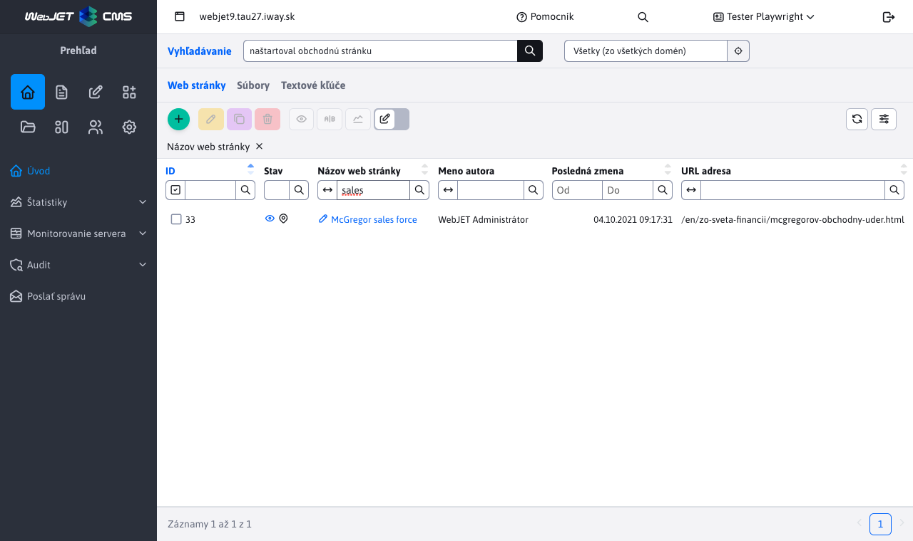
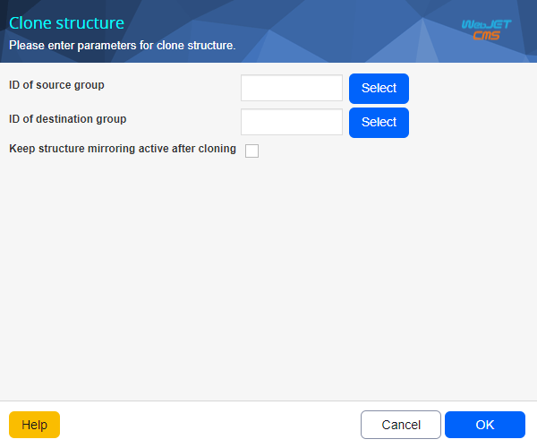
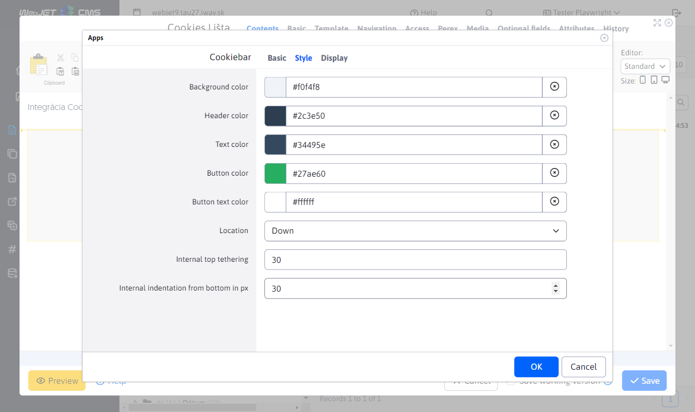
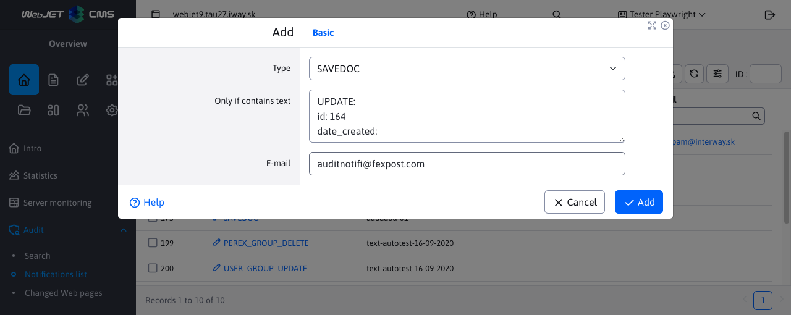
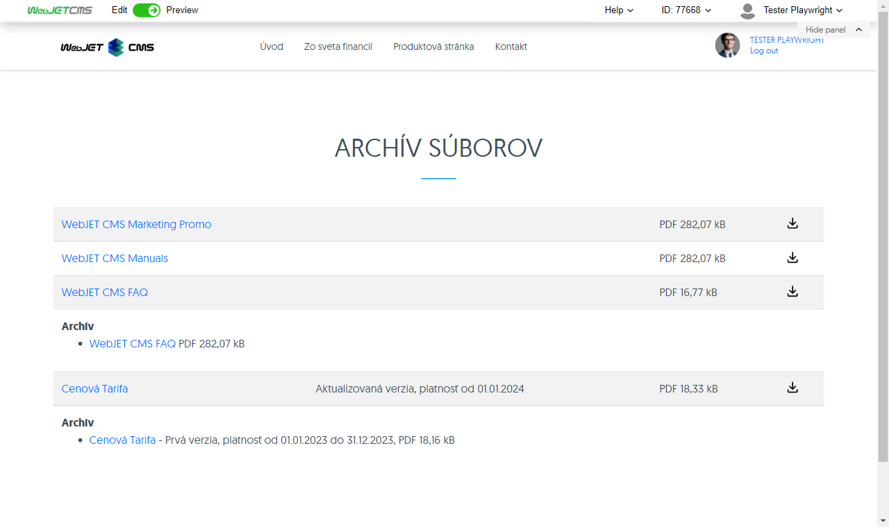
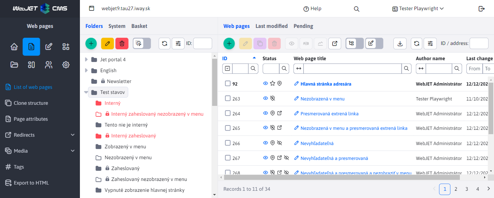
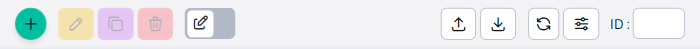
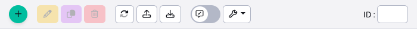
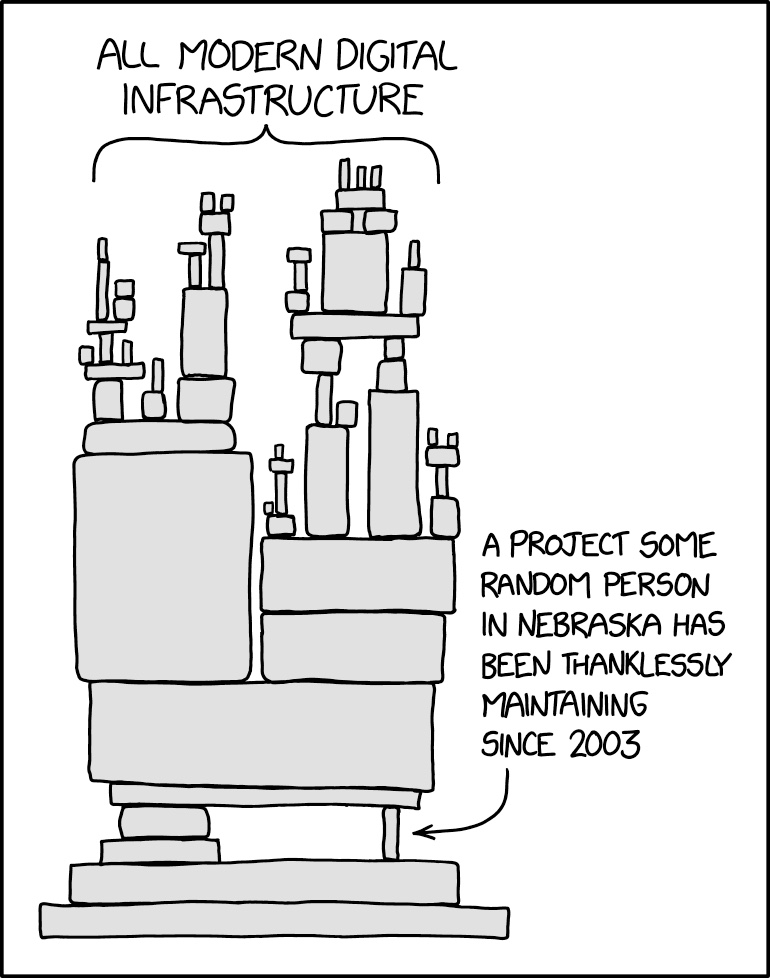

# List of changes version 2024

## 2024.52

> In version 2024.52, Web pages add the ability to set **arrangement method** and **search in tree structure**, ZIP import allows you to set the method of comparing the existing version of the page. **E-commerce** has received a new design for the list of orders and products. **Survey statistics** added, a better image editor in the explorer and improved search in the administration. **Bulk emails** have added the option **set unsubscribe confirmation**. The gallery includes a new field for **Image source URL**, which is filled in automatically when using a photo bank, **Tags** add **language mutations** and optional fields.

### Groundbreaking changes

- Updated Java and JavaScript libraries to newer versions, check the changes in the programmer section below. You can use the update script `/admin/update/update-2023-18.jsp`.
- Increased security of [public REST services](custom-apps/spring/public-services.md), if you use them, you need to add permissions. REST service `/admin/rest/property/set` has been removed (#57202).
- FontAwesome - fixed inserting [FontAwesome icons](frontend/webpages/fontawesome/README.md) in the editor (#57461).
- E-commerce - methods in `DocDetails` for getting price changed from return value `double` to `BigDecimal`. You can use script `/admin/update/update-2023-18.jsp` for basic update of your JSP files. If necessary, you can temporarily use methods `getPriceDouble/getVatDouble/getLocalPriceDouble/getLocalPriceDouble` (#56385).

### Website

- Added the option to select the method and direction for arranging the [tree structure](redactor/webpages/README.md#setting-the-tree-structure-display) (#57257).


- Tree structure - adding the option to [search in the tree structure](redactor/webpages/README.md#search-in-the-tree-structure) of web page folders in depth (#57265).


- Tags - added option [language mutation settings](redactor/webpages/perexgroups.md#karta-prekladu) of the perex group name to display the tag name according to the language of the website (#57273).


- FontAwesome - fixed inserting [FontAwesome icons](frontend/webpages/fontawesome/README.md) in the editor (#57461).

- Importing web pages from ZIP archive - adding the option to select the parameter [for comparison of existence](redactor/webpages/import-export.md#importovanie-web-stránok-zo-zip-arhívu) of the web page, modified visual, added options for about/from/marking all pages/files, opening/closing folders and added information about the import progress. Comparison by optional field allows pages to set a Unique identifier for unambiguous identification of the web page via the type of optional field (#57441).


- Importing websites from ZIP archive - added data separation at `multi-domain`, where data from another domain is ignored when searching for an existing version of imported data (#57493).
- Improved transfer of installation name from template to `CombineTag`. The value is saved in `session` and also used in file retrieval during `combine` execution (#56325).
- Template JSP file search takes into account the installation name set in the template (#56325).
- Tags - added tab with [optional fields](redactor/webpages/perexgroups.md#tab-optional-fields) for the possibility of adding custom data to tags. For example, setting the tag color, its design, etc. (#57449).
- Structure cloning - during cloning, website and folder name synchronization is disabled to preserve the names according to the original folder. The configuration variable `syncGroupAndWebpageTitle` is set to the value `false` and is set to the original value after cloning is complete (#57489).
- Adjusted numbering if a web page with the same name/URL address exists - the newly created page starts from number 2 instead of number 1, resulting in URLs of the type `/en/page.html,/en/page-2.html,/en/page-3.html` instead of `/en/page.html,/en/page-1.html,/en/page-2.html` where `-1.html` was not semantically optimal (#54273-50).
- Added the ability to change the behavior of the last `/` when [generating page URLs](frontend/setup/config.md). By default, for the main page of a folder, the URL ends with the character `/`, for example `/en/products/`, after setting the configuration variable `virtualPathLastSlash` to the value `false`, the URL will be generated without the last `/`, i.e. as `/en/products` (#54273-50).

### Poll

- Added [response statistics](redactor/apps/inquiry/inquiry-stat.md) polls (#57337).


### E-commerce

- [Order List](redactor/apps/eshop/invoice/README.md) and [Product List](redactor/apps/eshop/product-list/README.md) modified to new design in data tables (#56325).


- Methods in `DocDetails` for getting price modified from return value `double` to `BigDecimal` (#56385).

### Gallery

- The default gallery visual style type can be set via the config variable `galleryDefaultStyle`, defaults to `photoSwipe` (#56393-18).
- Added the option to select the method and direction for arranging the [tree structure](redactor/webpages/README.md#setting-the-tree-structure-display) (#57257).
- Added the URL field for the image source with the option to enter the address from which you obtained the image. The field is automatically set when using [photo bank](redactor/webpages/working-in-editor/README.md#karta-fotobanka) in the list of websites (#57313).
- Added the option to **search in the tree structure** by name, similar to what is available on websites (#57437).


### Bulk email

- Sending - the website's SSL certificate is ignored when sending, as a temporary SSL certificate is often used in the internal environment (#57525).
- Logout - created a new application for setting up logout. Added the ability to enter a custom text before logging out and the option to display a confirmation instead of immediately logging out by clicking on the link in the email (#57525).
- Unsubscribe - modified form for unsubscribing from mass email - added option to display unsubscribe confirmation and option to resubmit email after unsubscribing (#57525).


### Explorer

- Complete replacement of the image editor in the [edit files] action (redactor/files/fbrowser/file-edit/README.md) in the explorer section with an editor in the form of `DataTable` according to the photo gallery (#57313).
- Improved display on mobile phones for better usability - adjusted height, sizes (#55645).

### Other

- Redesigned search in administration for data tables (#57333).



- Renamed the Edit Cell option to Edit in Grid View, following the nomenclature used in `Microsoft SharePoint`.
- Search - modified search form on the website to allow defining a placeholder text (`placeholder`) instead of the standard Search. You can enter your own text that will be displayed in the form, such as Search on the website (#54273-53).

### Safety

- Modified log at startup - sensitive information such as passwords, tokens, certificates from configuration variables are replaced with the expression `********` (#MR643).
- [For public REST services](custom-apps/spring/public-services.md) added the ability to set allowed IP addresses for each service separately (#57202).
- Translation keys - added the ability to filter keys in the REST service [/rest/properties/](custom-apps/spring/public-services.md) by the conf. variable `propertiesRestControllerAllowedKeysPrefixes`, so that it is not possible to publicly obtain all keys from WebJET CMS (#57202).
- Added HTTP header `Referer` to audit (#57565).

### Bug fixes

- Fixed URL generation for AB Testing if the original URL contains the character `*` (#54273-50).
- Image editor - fixed renaming of image in image editor opened from explorer (#57269).
- Domain redirects - fixed the option to specify a protocol for the redirect domain. Added redirection logic to the `https` version when selecting the `http` option of the original protocol - redirection to the `https` version is assumed (#56393-20).
- Web pages - Page Builder - fixed inserting applications and blocks at the correct cursor location (#57613).
- Web pages - Blocks - fixed deleting empty space in Firefox when inserting a block (#57613).

### Documentation

- Created documentation for [server performance improvements](sysadmin/performance/README.md) (#57357).
- Created PDF documentation for [editor](_media/manuals/webjetcms-redactor.pdf), [administrator](_media/manuals/webjetcms-admin.pdf), [operation](_media/manuals/webjetcms-sysadmin.pdf) and [installation](_media/manuals/webjetcms-install.pdf). The PDF documentation is automatically generated from the current documentation in MarkDown format and also includes the WebJET CMS version date (#57269).

### For the programmer

- Changed API for datatable `table.ajax.url(newUrl); -> table.setAjaxUrl(newUrl);`, `table.ajax.url() -> table.getAjaxUrl()` (#57365).
- Updated `Swagger-UI` at `/admin/swagger-ui/` to version `org.webjars:swagger-ui:5.17.14` (#57365).
- Updated library `Bootstrap` from 4.6.1 to 5.3.3 and `jQuery` from 3.5.1 to 3.7.1 for old v8 administration (#57365).
- In version 8, libraries `bootstrap-modal,bootstrap-switch,bootstrap-toastr,uniform,simple-line-icons` were removed (#57365).
- You need to adjust the tab switching in your JSP files, search for `data-toggle="tab"` and replace with `data-bs-toggle="tab"`, set the `LI` element to `class="nav-item"` and set the first `A` element to `class="active"`:

```html
<ul class="nav nav-tabs">
    <li class="nav-item">
        <a class="active" href="#tabMenu1" data-bs-toggle="tab">
            <iwcm:text key="components.filter"/>
        </a>
    </li>
    <li class="nav-item">
        <a href="#tabMenu2" data-bs-toggle="tab" onclick="loadComponentIframe();">
            <iwcm:text key="components.file_archiv.waiting_files"/>
        </a>
    </li>
</ul>
```

- Removed methods `DocDB.searchTextAll,searchTextUrl`, use class `sk.iway.iwcm.search.SearchService` (#57333).
- Applications via `!INCLUDE` can also be inserted from folders `/apps` and `/templates` (#56325).
- [Custom fields](frontend/webpages/customfields/README.md#color) - added field type `color` for color selection (#57449).
- For [application in the editor](custom-apps/appstore/README.md#annotation-usage) it is possible to define multiple JSP files for which it will be used, for example `@WebjetAppStore(...componentPath = "/components/search/search.jsp,/components/search/lucene_search.jsp")`. When inserting a new application, the first JSP file in the list will be used (#54273-53).


## 2024.40

> In version 2024.40, **Explorer** brings new features and improvements. When moving files using **drag&drop**, a confirmation message is now displayed, which prevents errors in file management. In the image editor, the option to set **size and crop according to templates** has been added, which makes it easier to edit images directly in the interface.
>
> Another improvement is the redesign of the settings of several **applications into a new, clearer design**. The author of the page now receives **notifications when the page is published at a specific time**, as well as when a **post is added to the discussion forum**, which improves control over the content. The new application for reservations by time allows for simple and clear **reservation of objects such as tennis courts or meeting rooms**. This application also offers statistics by user and object, which makes it easier to manage reservations.
>
> We have also improved the functionality of the PageBuilder tool and fixed errors in publishing to the File Archive, ensuring better stability and performance when working with content.

### Groundbreaking changes

- AB Testing - prevented calling URLs of version B (containing the expression `abtestvariant`) if the administrator is not logged in. It is possible to allow direct calling of such URLs by setting the config variable `ABTestingAllowVariantUrl` to the value `true` (#56677).
- Database connection - changed library for database connection management from `Apache DBCP` to [HikariCP](https://github.com/brettwooldridge/HikariCP) (#56821).
- Initialization - modified WebJET initialization by using `Spring.onStartup` instead of `InitServlet`. Correct order of loading configuration variables and their use in `SpringBean` objects is ensured (#56913).
- Character encoding - due to the change in initialization, the character encoding is read from the conf. variable `defaultEncoding` with the default value `utf-8`. If you have historically used the `windows-1250` encoding, you need to adjust the value in the configuration. The value in `web.xml` for `SetCharacterEncodingFilter` is no longer used, but the value in the WebJET configuration. You can delete the filter from `web.xml`. Support for setting an error message when a database connection fails by setting the `dbErrorMessageText` parameter has been removed, it is necessary to create a `/wjerrorpages/dberror.html` file if you want to display a specific HTML page when a database connection error occurs (#56913, #56393-12).
- Optimized getting redirect in `404.jsp`, in your gradle projects we recommend updating the `404.jsp` file according to the [basecms](https://github.com/webjetcms/basecms/blob/master/src/main/webapp/404.jsp) project (#53469).
- File archive - changed the default value of the config variable `fileArchivIndexOnlyMainFiles` to the value `true`. This means that only the main files are written to the search/full-text index, not the archive versions. The reason is that we do not want to direct users from search to older (archive) versions of files by default (#57037).
- File archive - fixed the arrangement of files in the archive by time, added the option to arrange by priority (this was how it was arranged when originally selected by time) (#57037).
- Password-protected zone - modified login and forgotten password function, if you have modified the `/components/user/logon.jsp` or `/components/user/change_password.jsp` file, verify correct behavior and possibly modify according to the standard version (#57185).

### Website

- Structure cloning - added option [keep URLs when cloning] (redactor/apps/clone-structure/README.md). The prefix according to the source folder is removed from URLs and the prefix according to the target folder is added. So if you clone e.g. a new language mutation, only e.g. `/en/` prefix is ​​added, but other URLs remain unchanged (#56673).



- Image editor - added ability to set Point of Interest to any image (#57037).
- Image editor - adjusted image size settings for better use of the resize feature (if the image is smaller than the current window, it will be resized) (#56969).
- Audit - modified writing of audit log when saving a web page to a standard data table record with a list of all changed properties (#57037).
- Page comparison - fixed "Show only page text" display when comparing page versions from history (#57037).
- Images - when changing an image that has the expression `placeholder` or `stock` in its name, the folder with this image will not be displayed in the explorer window, but the Media of this page/Images will be displayed for easy uploading of a new image instead of the placeholder image (#57037).
- Perex image - adjusted opening of the window so that it displays the Media of this page first and then selects all media (the list of all files and links to web pages will not be displayed) (#57037).
- Page Builder - fixed setting the folder according to the title of the new page when inserting an image (#57037).
- Page Builder - fixed block duplication for `accordion` - ​​correct editor ID setting to avoid overwriting text when saving (#57037).
- Page Builder - fixed [column width] setting (frontend/page-builder/blocks.md#column-width-setting) - window width is taken into account, not element width (#57037).
- The list of promo applications when inserting a new application is set via the conf. variable `appstorePromo`, in addition to the folder name, it is possible to directly enter the `itemKey` value there, e.g. `cmp_news` for Spring application support. The default value is `cmp_news,menuGallery,menuBanner,cmp_video` (#57157).
- Export to HTML - created [documentation](redactor/webpages/export-to-html/README.md), tests, disabled SSL certificate checking for the possibility of using `SelfSigned` certificates during development or testing (#57141).
- Publishing a website - added auditing of successful time publishing of a website and added option to [send notification to author](redactor/webpages/editor/README.md#publikovanie-web-stránky) of a website upon successful publishing (#57173).


- Tags - added variable `perexGroupsRenderAsSelect` to determine from what [number of tags](redactor/webpages/perexgroups.md) they will start to be generated as a multiple selection field, originally this value was set to 30 in the code (#57185).
- Tags - even with a high number of defined tags, filtering will always be displayed as a text field in the table (#57185).
- Optional fields - added setting of column names [optional fields](frontend/webpages/customfields/README.md) in the list of web pages including the prefix of text keys (e.g. `temp-3.editor.field_a`) according to the folder template (#57185).

### Applications

Redesigned application properties settings in the editor from the old code in `JSP` to `Spring` applications. Applications automatically also gain the ability to set [display on devices](custom-apps/appstore/README.md#conditional-display-applications). The design is consistent with the rest of the WebJET CMS and data tables.

- [Cookie bar] (redactor/apps/app-cookiebar/README.md)
- [Content Block](redactor/apps/content-block/README.md)
- [Disqus comments](redactor/apps/app-disqus/README.md)
- [Facebook Like button](redactor/apps/app-facebook_like/README.md)
- [Facebook Like Box](redactor/apps/app-facebook_like_box/README.md)
- [GDPR Cookies consent](redactor/apps/gdpr/README.md)
- [Google search](redactor/apps/app-vyhladavanie/README.md)
- [Live chat (SmartsUpp)](redactor/apps/app-smartsupp/README.md)
- [Navigation menu](redactor/apps/menu/README.md)
- [Weather](redactor/apps/app-weather/README.md)
- [Send page by email](redactor/apps/send_link/README.md)
- [Statistics - click map](redactor/apps/stat/README.md)
- [Document Embed](redactor/apps/app-docsembed/README.md)
- [Embed HTML code](redactor/apps/app-htmlembed/README.md)
- [Search](redactor/apps/search/README.md)
- [View files](redactor/apps/site-browser/README.md)




### Audit

- Improved entity change logging, added field support, getting value for date (`Date` object or variable with `date` in name), added tag support (listing name instead of ID) (#57037).
- Redesigned the **Logging Levels** section into the Audit->[Logging Levels](sysadmin/audit/audit-log-levels.md) and Audit->[Log Files](sysadmin/audit/audit-log-files.md) sections to the new design (#56833).


- Adjusted rights for the Audit-Changed Pages and Audit-Awaiting Publish sections to hide them correctly in the menu - they require the right to audit and list web pages (#57145).
- Fixed bad role for Audit-Log files section (#57145).
- Improved auditing of background task records - added list of changes when editing/creating a task, added task ID (#56845).
- [Notifications](sysadmin/audit/audit-notifications.md) - modified the "Only if contains text" field to a multi-line field for the possibility of sending a notification with multi-line expression checking (#57229).



### AB Testing

- For search bots (e.g. Google), the A variant is always displayed to ensure that the text of the pages is consistent. The bot is detected in the same way as for statistics according to the `User-Agent` headers set in the config variable `statDisableUserAgent` (#56677).
- Added [displayed variant identification](frontend/ninja-starter-kit/ninja-bp/README.md) to Ninja class using `data-ab-variant="${ninja.abVariant}` (#56677).
- Prevented calling of version B URLs (containing the expression `abtestvariant`) if the administrator is not logged in. Direct calling of such URLs can be enabled by setting the config variable `ABTestingAllowVariantUrl` to the value `true` (#56677).

### File archive

- Modified file name generation during updates so that the original file name is always preserved and older versions are saved as `_v1,_v2` etc (#57037).
- Fixed publishing a file set to Upload file later (#57037).
- Fixed creating a full-text index for searching files (#57037).
- Changed the default value of the config variable `fileArchivIndexOnlyMainFiles` to `true`. This means that only the main files are written to the search/full-text index, not the archive versions. The reason is that we don't want to direct users from search to older (archive) versions of files by default (#57037).
- Fixed the arrangement of files in the archive by time, added the option to arrange by priority (this was how it was arranged when originally choosing by time) (#57037)
- Added display of notes and date validity range for archived versions of files (#57037).



### Dials

- Modified record ID check when importing codebook data - it is checked whether the given ID is not found in another type of codebook, if so, the value `ID` is set to `-1` for importing a new record. This protects against overwriting data in a codebook other than the selected one if a record with the same ID exists (#57149).

### Discussion

- Added option [Send notification to page author when adding a post to discussion](redactor/apps/forum/README.md#karta---parametere-aplikácie) when inserting the Discussion application into a page. By setting the conf. variable `forumAlwaysNotifyPageAuthor` to the value `true`, you can automatically enable the notification for all discussions/forums (#57013).


### Forms

- After submitting the form via AJAX, an event `WJ.formSubmit` is published, which can be listened to when connected to `DataLayer`, e.g. like:

```javascript
    window.addEventListener("WJ.formSubmit", function(e) { console.log("DataLayer, submitEvent: ", e); dataLayer.push({"formSubmit": e.detail.formDiv, "formSuccess": e.detail.success}); });
```

- For forms that [require confirmation of email address](redactor/apps/form/README.md#setting-up-email-confirmation) by clicking on a link in the email, modified the message about successful submission to the text "The form has been submitted, we have sent a message to your email in which you need to confirm submission by clicking on a link." so that the visitor receives information about the need to confirm submission in the email message (#57125).
- Forms that require you to confirm the validity of your email address by clicking on a link in the email and have not yet been confirmed are displayed in red in the form list (#57125).


### Gallery

- Adjusted the display of images in the administration so that the set point of interest was not taken into account, but the entire image was displayed in the image list (#56969).
- Added option to set [templates for image resizing and cropping](redactor/image-editor/README.md) (#57201).
- Fixed text insertion in the standalone image editor and translation of missing text (#57201).
- Moved the toolbar in the image editor to the left to make better use of the monitor space (#57201).


- Increased the size of the author field from 255 characters to a text field with a range of 64000 characters (#57185).
- Modified HTML code formatting in Perex fields - disabled line wrapping/code formatting to prevent spaces from being filled in (#57185).
- Added cleaning of HTML code from formatting when pasting text via clipboard (#57185).

### News

- Added folder rights check - the folder selection field for displaying news is filtered by website folder rights (#56661).

### Users

- Added the ability to set a [user group](admin/users/user-groups.md) discount on the price in %, which will be used, for example, when making a reservation, but will also be used in other applications in the future (#57049).
- Modified logic when changing [forgotten password](redactor/admin/password-recovery/README.md). If the entered email belongs to multiple users, when changing the password, it is possible to use the selection field to specify which user with the given email will have their password changed (#57185).


### Explorer

- New version of the [elfinder](https://github.com/webjetcms/libs-elFinder/tree/feature/webjetcms-integration) library for [file management](redactor/files/fbrowser/README.md). Modified design according to the appearance of data tables for a nicer integration.


- The default file encoding for the editor is set according to the config variable `defaultEncoding`. For JSP files, the encoding `utf-8/windows-1250` is detected according to the attribute `pageEncoding`, if the file contains the expression `#encoding=` at the beginning, it is used according to this value (#55849).
- After setting the config variable `iwfs_useVersioning` to `true`, the history of changes in files will start to be recorded (each file is archived to the folder `/WEB-INF/libfilehistory` after uploading and before overwriting). The list is available in the explorer in the File settings context menu with the option to compare, view historical versions and revert changes (#57037).
- Fixed renaming files in `/images,/files` folders to automatically remove diacritics (#57053).
- File indexing - added the date of the last file change to Perex-Start of publication (#57177).
- Added [file/folder move confirmation] option (redactor/files/fbrowser/README.md#configuration). You can disable confirmation by setting the configuration variable `elfinderMoveConfirm` to the value `false` (#57297).


### Reservations

- Added support for automatically calculating the price of a reservation when creating it (#56841).
- Added new MVC [Time Reservation Application](redactor/apps/reservation/time-book-app/README.md), for booking selected objects in hourly intervals (#56841).
- Added support for getting a discount on the [reservation price](redactor/apps/reservation/reservations/README.md#basic) from the reservation price according to the set user group (#57049).
- Added [Reservation Statistics] section (redactor/apps/reservation/reservations-stat/README.md) for time and all-day reservations (#57049).


- Added the ability to set a [user group](admin/users/user-groups.md) discount on the price in %, which will be applied when creating a reservation (#57049).
- Added [reservation statistics](redactor/apps/reservation/reservations-stat/README.md) where you can see the number and prices of reservations by user (#57049).


### Safety

- Modified dialogs for passwords, their change and multi-factor authorization to support passwords of 64 characters, added password change tests (#56657).
- Modified logic for [password recovery](redactor/admin/password-recovery/README.md), where the email used for recovery belonged to multiple accounts, and added the option to choose which user's password will be changed (#57185).
- Users - when duplicating a user, if no password is entered, a random password is set for the new user (#57185).

### Documentation

- Added documentation for missing applications to the [For the editor] section (redactor/README.md) (#56649).
- Added documentation for the [scripts] application (redactor/apps/insert-script/README.md) (#56965).
- Added English version of documentation (#56773).
- Added documentation for [image editor](redactor/image-editor/README.md) (#56969).
- Added documentation for generating [thumbnail images](frontend/thumb-servlet/README.md) and setting [point of interest](frontend/thumb-servlet/interest-point.md) (#56969).
- Documentation for [working in the editor](redactor/webpages/working-in-editor/README.md) created (#56981).
- Added documentation for [file archive](redactor/files/file-archive/README.md) (#56891).
- Added documentation for [pre-prepared block](redactor/apps/htmlbox/README.md) (#56981).
- Added [Czech version](https://docs.webjetcms.sk/latest/cs/) documentation (#57033).
- Modified the generation of source code links to point to the [GitHub version](https://github.com/webjetcms/webjetcms/tree/main/src) of the source code (#57033).
- Created documentation for operations - [Data deletion](sysadmin/data-deleting/README.md), [System backup](sysadmin/files/backup/README.md) and [Restart](sysadmin/restart.md) (#57141).
- Created documentation for the administrator - [Automated tasks](admin/settings/cronjob/README.md) (#57141).
- Created documentation for the editor - [Send message](redactor/admin/send-message.md), [Export to HTML](redactor/webpages/export-to-html/README.md), [Redirects](redactor/webpages/redirects/README.md) (#57141).
- Documentation for using the [forgotten password] function has been created (redactor/admin/password-recovery/README.md) (#57185).
- Created documentation for setting up [Spam protection](install/config/spam-protection.md) (#57185).

### Testing

- Created object `TempMail` for easier work with the email box [tempmail.plus](https://tempmail.plus) for testing sent emails (#56929).
- All basic tests (using `DataTables.baseTest`) supplemented with testing of the Duplicate function (#56849).
- Added accented characters to Data Tables automatic tests for testing accented storage and filtering (#56393-12).

### System changes

- Initialization - added option to [initialize values](install/external-configuration.md) for cluster (e.g. `clusterMyNodeName,clusterMyNodeType,useSMTPServer,pkeyGenOffset`) also by setting environmental variables with prefix `webjet_` or system variables with prefix `webjet.` (#56877).
- Initialization - modified WebJET initialization by using `Spring.onStartup` instead of `InitServlet`. Correct order of loading configuration variables and their use in `SpringBean` objects is ensured (#56913).
- Character encoding - due to the change in initialization, the character encoding is read from the conf. variable `defaultEncoding` with the default value `utf-8`. If you have historically used the `windows-1250` encoding, you need to adjust the value in the configuration. The value in `web.xml` for `SetCharacterEncodingFilter` is no longer used, but the value in the WebJET configuration. You can delete the filter from `web.xml`. Support for setting an error message when a database connection fails by setting the `dbErrorMessageText` parameter has been removed, it is necessary to create a `/wjerrorpages/dberror.html` file if you want to display a specific HTML page when a database connection error occurs (#56913, #56393-12).
- Modified the retrieval of redirects from the new URL (String) to directly retrieve the database entity. This also directly retrieves the redirect code (301,302...) without the need for an additional database call. This increases the performance of the 404 page (#53469).
- PostgreSQL - fixed saving change history in a folder and deleting approvals when deleting a folder (#57061).
- Added information about the approaching end of the license validity, it will be displayed 2 months before its expiration on the start screen (#57169).


- Modified the call of methods `before*/after*` in `DatatableRestControllerV2` so that they are called for all `REST` services and are also called when overloading `insertItem,editItem,deleteItem` (#57186).
- For public cluster nodes that do not have [enabled during monitoring](sysadmin/monitoring/README.md) writing to the `_conf_/webjet_conf` table, it is possible to set the config variable `monitoringEnableCountUsersOnAllNodes` to the value `false`. This disables writing the `sessions` count on individual nodes to the configuration (#43144-3).
- Spam protection - when deleting all cache objects in the [Data deletion] section (sysadmin/data-deleting/README.md), the Spam protection content is also deleted. This allows you to easily reset the spam protection if necessary (#57185).

### For the programmer

- Datatables - added option to set buttons in the editor window (by default it contains the Create button) also for [creating a new record](developer/datatables-editor/README.md#special-buttons) by setting `createButtons` (#55849).
- Dialog window - added function `WJ.openIframeModalDatatable` to open [modal window](developer/frameworks/webjetjs.md#iframe-dialog) containing datatable editor (record editing). Automatically sets options for saving and closing the window after saving a datatable record (#55849).
- Removed support for `Apache Commons DBCP, Commons Pool a Oracle UCP` libraries. Database connections are managed using [HikariCP](https://github.com/brettwooldridge/HikariCP). Removed API `ConfigurableDataSource.printStackTraces` (#56821).
- Database connection - added auditing of unclosed database connections (connections that are open for more than 5 minutes). They are recorded in the audit as type `SQLERROR` with text `Connection leak detection triggered` and a stack trace to find the place where the connection is not closing (#56821).
- Removed support for `Apache Commons DBCP, Commons Pool, Oracle UCP` libraries. Database connections are managed using [HikariCP](https://github.com/brettwooldridge/HikariCP). Removed API `ConfigurableDataSource.printStackTraces` (#56821).
- Database connection - added auditing of unclosed database connections (connections that are open for more than 5 minutes). They are recorded in the audit as type `SQLERROR` with text `Connection leak detection triggered` and a stack trace to find the place where the connection is not closing (#56821).
- The annotation [@WebjetAppStore](custom-apps/appstore/README.md) allows you to set the attribute `custom` to specify a custom application that is listed at the beginning before standard applications (#56841).
- Initialization - modified WebJET initialization by using `Spring.onStartup` instead of `InitServlet`. Correct order of loading configuration variables and their use in `SpringBean` objects is ensured (#56913).
- `SpringSecurity` - ​​annotation `@EnableGlobalMethodSecurity(securedEnabled = true, prePostEnabled=true)` replaced by `@EnableMethodSecurity(securedEnabled = true, prePostEnabled=true)` (#56913)
- Added method `addAuditValue(String key, String value)` to `RequestBean` which allows adding additional parameters that will be recorded in the audit before writing to the Audit, e.g. `RequestBean.addAuditValue("historyId", String.valueOf(historyId));` (#57037).
- Added [field type](developer/datatables-editor/standard-fields.md#boolean_text) to Datatable, `DataTableColumnType.BOOLEAN_TEXT` which displays the title on the right instead of the left and Yes options for the checkbox (#57157).
- Added [field type](developer/datatables-editor/standard-fields.md#color) to Datatable, `DataTableColumnType.COLOR` for color selection in `HEX` format, e.g. `#FF0000` (#57157).
- Added [field type](developer/datatables-editor/standard-fields.md#iframe) to Datatable, `DataTableColumnType.IFRAME` for inserting another page via `iframe` element (#57157).
- Added [field type](developer/datatables-editor/standard-fields.md#base64) to Datatable, `DataTableColumnType.BASE64` for encoding and decoding value via `base64` algorithm (#57161).
- Added [field type](developer/datatables-editor/standard-fields.md#static_text) to Datatable, `DataTableColumnType.STATIC_TEXT` to display static text in the right part of the editor window (#57161).
- Datatables - for [field type](developer/datatables-editor/standard-fields.md#json), `JSON dt-tree-dir-simple` added option to set root folder via `@DataTableColumnEditorAttr(key = "data-dt-field-root", value = "/images/gallery")`. The field does not have attribute `disabled` set, so the value can also be entered directly (#57157).
- Datatables - added setting option `editorLocking` to disable control of record editing by multiple users (#57161).
- For Spring applications, the [data initialization](custom-apps/appstore/README.md#data-initialization) option has been added in the editor by implementing the `initAppEditor` method and the [select-field settings](custom-apps/appstore/README.md#select-field-settings) option has been added by implementing the `getAppOptions` method (#57157).
- Amcharts - added support for a new chart type [DoublePie](developer/frameworks/charts/frontend/statjs.md#double_pie-type-chart) for statistics purposes (#57049).
- `Base64` - ​​added functions `WJ.base64encode(text),WJ.base64decode(encodedText)` for encoding and decoding text using the `base64` algorithm with support for `utf-8` characters (#57161).
- Added `Adminlog.getChangelog(Long id, Object newObj, Object originalObj),Adminlog.getChangelogDelete(Long id, Object obj)` methods for getting a list of changes when creating/modifying/deleting a simple Java object (not a JPA entity) (#56845).


## 2024.18

> Version 2024.18 includes **new icon set**, Form easily supplemented with **advanced settings** (recipients, redirects...), AB Testing, Audit (waiting for publication, changed pages), Blog, Questionnaires, Event Calendar (approval) applications are redesigned to the new design. Adds **MultiWeb installation support** (domain data separation) in Templates, Mass Email and other applications. New library for **browser detection**, there will be minor differences in Statistics-Browsers, but we record browser data anonymously even without Cookies consent.

!>**Note:** To run version 2024, you must have Java version 17 installed on your server.

### Groundbreaking changes

This version introduces several changes that may not be backward compatible:

- Bulk email - modified support for sending emails via the `Amazon SES` service from using a special API to [standard SMTP protocol](install/config/README.md#nastavne-amazon-ses).
- [Removed libraries](install/versions.md#changes-when-upgrading-to-20240-snapshot), `bsf,c3p0,cryptix,datetime,jericho-html,jsass,opencloud,spring-messaging,uadetector,joda-time,aws-java-sdk-core,aws-java-sdk-ses,jackson-dataformat-cbor,jmespath-java` (#56265).
- Removed tag `iwcm:forEach`, needs to be replaced with `c:forEach`. The difference is that the Java object is not directly accessible, needs to be obtained using `pageContext.getAttribute("name")`. Use the `/admin/update/update-2023-18.jsp` call to update your JSP files (#56265).
- Bulk email - separate campaigns, recipients and unsubscribed emails by domain, older records are assigned to domains according to the URL address of the website for sending. The advantage of separating unsubscribed emails is in the case of operating multiple websites and different recipient lists, when unsubscribed is done separately for each domain. **Warning:** current unsubscribed emails are set for the domain with ID 1, if you primarily use bulk email on a domain other than the first, update the column `domain_id` in the database table `emails_unsubscribe` (#56425).
- Bulk email - deleted unused methods from Java class `sk.iway.iwcm.dmail.EmailDB`, if you use them in your project, move them from the [original source code](https://github.com/webjetcms/webjetcms/blob/ef495c96da14e09617b4dc642b173dd029856092/src/main/java/sk/iway/iwcm/dmail/EmailDB.java) to your own class (#56425).
- Icons - due to the transition to Open Source solutions, we changed the icon set from the original FontAwesome to the new set [Tabler Icons](https://tabler.io/icons). If you use icons from the FontAwesome set in your own applications, you need to edit the code and replace them with icons from the `Tabler Icons` set. You can use the ```/admin/update/update-2023-18.jsp``` script to edit the most frequently used icons in the administration (it will only edit files that require login).

### Transition to Java 17

WebJET CMS version 2024 has been upgraded to Java version 17. It includes the following changes:

- Updated several libraries, e.g. `AspectJ 1.9.19, lombok 1.18.28`.
- Updated Eclipselink library to standard version, WebJET CMS usage `PkeyGenerator` set using `JpaSessionCustomizer` and `WJGenSequence` classes.
- Updated `gradle` to version 8.1.
- Removed old library ```ch.lambdaj```, use standard Java Lambda expressions (#54425).
- Removed `<iwcm:forEach` tag, usage replaced with standard `<c:forEach` (#56265).
- To simplify the upgrade, you can use the ```/admin/update/update-2023-18.jsp``` script to check and fix JSP files. Custom Java classes need to be recompiled and errors fixed due to API changes.

### New icon set

Due to the transition to Open Source solutions, we changed the icon set from the original FontAwesome to the new set [Tabler Icons](https://tabler.io/icons). Some icons have been modified to better reflect the function of the button.



For data tables, the icons for table setup, data reload, import, and export have been moved to the right to better separate standard functions from settings and advanced operations. The images show a comparison of the new (top) and old version (bottom).





### User interface improvements

- Menu - menu items/section icons (Overview, Websites, Posts...) are only displayed if the user has access to an item in that section (#56169).
- News - modified adding news - switching to the Basic tab for easier setting of the news title and setting of the classification in the tree structure according to the selected section in the page header (#56169).
- Home - the Logged in admins, My recent pages, Changed pages and Audit sections are only displayed if the user has the necessary rights (#56169).
- Introduction - added information about the folder in the list of recent pages, added option to open the audit log (#56397).
- Websites - improved editing on mobile devices - editor toolbar is scrollable, all icons are available (#56249-5).
- Datatables - improved layout of the editor toolbar at low resolutions - icons are correctly moved to the second line, the option to enter the ID remains at the top right (#56249-5)
- Datatables - the icon for selecting/unselecting all records changes state depending on whether rows are selected or not (#56397).
- Data tables - reduced spacing between columns, reduced height of page title, toolbar and footer to display more pages on the screen/condense information. At least one extra row should be displayed in the table on the same screen. (#56397).

### Website

- The default [title synchronization](redactor/webpages/group.md#synchronization-of-folder-and-web-page-name) of a folder and the main website is not used if one website is set as the main one by multiple folders, or when the main page is from a different folder (#56477).

### MultiWeb

Added support for [MultiWeb operation](install/multiweb/README.md) - multi-tenant management of multiple separate domains in one WebJET. The domains are externally separate and each appears as a separate WebJET CMS installation.

- List of users - separated by domain ID (#56421).
- Home - logged in admins - separated by domains (#56421).
- Rights to Domain Limits, HTTP Headers, Logging Levels, Last Logs, User Groups, Rights Groups are only available in the first/administrator domain (#56421).
- Websites - added ability to create multiple root folders (#56421).
- Statistics - Error pages - added column `domain_id` to the database to separate error URLs by domain (#56421).
- Media - media groups - list divided by the current view domain and rights of the website tree structure (#56421).

### AB testing

- List of pages in AB test redesigned to [new design](redactor/apps/abtesting/abtesting.md), added section for setting AB testing configuration (#56177).


### Audit

- Added support for filtering users by specified email address.
- Redesigned the Audit->[Awaiting Publish] section (sysadmin/audit/audit-awaiting-publish-webpages.md) to a new design. It clearly displays a list of pages that will be changed in the future (#56165).
- Redesigned the Audit->[Changed pages] section (sysadmin/audit/audit-changed-webpages.md) to a new design. It displays a complete list of changed pages for the selected period (#56165).


### Blog

- Blog converted to new administration. Article list section uses standard options as used in website/news list (#56169, #56173).
- The original list of discussion posts is moved directly to the Discussion section, users/bloggers gain access to this section as well (#56169).
- The standard news application is used to display the list of articles.
- Blogger management (user administration) converted to a data table, allowing you to easily create a blogger and correctly set their rights.


### Questionnaires

The [questionnaires] application (redactor/apps/quiz/README.md) has been redesigned. It allows you to create questionnaires with evaluation of the correct answer. The questionnaire can have one correct answer or with scored answers. The application also includes statistical evaluation (#55949).


### Form easily

- Added advanced tab with advanced form processing settings similar to standard HTML forms. Added options to set recipients, redirects, page ID with version to email, etc. Modified form item list for better space usage (#56481).


- Added the Formatted Text Field field type for entering text with formatting such as bold, bullets, numbered lists, and the like (#56481).


### GDPR Cookies

- Integration with [Google Tag Manager](redactor/apps/gdpr/gtm.md) supplemented with new consent types `ad_user_data` and `ad_personalization`, which are linked to consent with marketing cookies. Modified JSON object generation from `true/false` values ​​to correct `granted/denied` values ​​(#56629).

### Bulk email

- Modified support for sending emails via the `Amazon SES` service from using a special API to [standard SMTP protocol](install/config/README.md#nastavne-amazon-ses) (#56265).
- Domain limit settings added as a separate right, disabled by default, needs to be added to appropriate users (#56421).
- Separate campaigns, recipients and unsubscribed emails by domain, older records are assigned to domains according to the URL address of the website for sending. The advantage of separating unsubscribed emails is in the case of operating multiple websites and different recipient lists, when unsubscribed is done separately for each domain. **Note:** current unsubscribed emails are set for the domain with ID 1, if you primarily use bulk email on a domain other than the first, update the column `domain_id` in the database table `emails_unsubscribe`, (#56425).
- Added the option to directly [unsubscribe from bulk email](redactor/apps/dmail/form/README.md#unsubscribe) by clicking on the link displayed in the email client/Gmail by setting the email headers `List-Unsubscribe` and `List-Unsubscribe=One-Click` (#56409).

### Event calendar

- Unapproved and suggested events - the process of [approving new events](redactor/apps/calendar/non-approved-events/README.md) and [suggesting events](redactor/apps/calendar/suggest-events/README.md) has been redesigned (#56181).

### News

- Added option Exclude main pages of folders in [news list](redactor/apps/news/README.md#app-settings-on-web-page) to exclude main pages from subfolders in the news list. It is assumed that subfolders contain a main page with a news list in this folder, such pages will be excluded and not used in the news list (#56169).

### Questions and answers

- Added separate saving of the response to email and to the database for later verification of the response (#56533).
- Fixed display of the Question already answered column (#56533).
- When selecting the Show on web page option, the email reply will be copied to the web page reply (if already entered) (#56533).

### Templates

- Separate list of templates by domain - only templates that do not have display restrictions by folder or contain a restriction to the folder of the currently displayed domain are displayed (#56509).

### Statistics

- Modified obtaining of week number according to ISO 8601, values ​​in statistics by week may be different from the previous version (#56305).
- Error pages - added column `domain_id` to database to separate error URLs by domain. Historical data is not separated (will be displayed in all domains), but from the moment of update error URLs will be displayed separated by domain (#56421).
- Modified [browser detection](redactor/apps/stat/README.md#browsers) using the [UAP-java](https://github.com/ua-parser/uap-java) library. Some data is detected differently than originally - Safari and Mobile Safari on iOS are distinguished, the operating system for Android phones is set to Android instead of Unix, for some cases Linux is detected instead of Unix, macOS as Mac OS X. Added support for Instagram and Facebook internal browser detection. After updating to this version, there may be differences in the display of the period before and after the update. It is possible to update the browser definition file by setting the path to the [YAML](https://github.com/ua-parser/uap-core/blob/master/regexes.yaml) file in the conf. variable `uaParserYamlPath` (#56221).
- Browser type and operating system are recorded in statistics even without consent to the storage of cookies, as this data does not use cookies. The data is anonymized and recorded with a rounded time to 15 minutes (#56221).

### Safety

- 404 - added option to disable protection for calling 404 pages (number of requests) similarly to other spam protections by setting the IP address to the config variable `spamProtectionDisabledIPs`. Other SPAM protections (for repeated calls) will also be disabled for the given IP address.
- Added license check for used libraries in `deployment` new version (#56265).
- Updated several libraries to newer versions, major versions changed for `mariadb-java-client` from 2 to 3, `pdfbox` from 2 to 3 (#56265).

### Testing

- We added/modified automated testing of the front-end part (not the admin part) of the Map, `Carousel`, File Archive, `Content Block`, Date, Google Search, Social Links, Recommendations, Email Page, Weather, Related Pages, Impressive Presentation, `Slider`, `Slit Slider`, Video, `Carousel Slider`, HTML Code Embedding, Document Embedding, Search, Conditional Views, Blocks (#56413).
- Added support for automatic testing/checking of cross-domain record separation to [DataTables.baseTest](developer/testing/datatable.md#options-settings) (#56509).

### For the programmer

- Bulk email - deleted unused methods from Java class `sk.iway.iwcm.dmail.EmailDB`, if you use them in your project, move them from the [original source code](https://github.com/webjetcms/webjetcms/blob/ef495c96da14e09617b4dc642b173dd029856092/src/main/java/sk/iway/iwcm/dmail/EmailDB.java) to your own class (#56425).
- `MailHelper` - ​​added the ability to set email headers by calling `addHeader(String name, String value)`, API `SendMail` modified to use `MailHelper`, which we recommend primarily using for sending emails (#56409).
- Added the ability to display a list of config variables in your application by [specified prefix](./custom-apps/config/README.md), (#56177).
- Added the ability to check rights when creating, editing, deleting, performing an action, but also when retrieving a record by implementing the `public boolean checkItemPerms(T entity, Long id)` method, (#56421).
- Added class `DatatableRestControllerAvailableGroups` for easy implementation of user rights control also based on rights to the tree structure of web pages (#56421).

### System changes

- WebJET CMS is available directly in the [maven central repository](https://repo1.maven.org/maven2/com/webjetcms/webjetcms/), GitHub projects [basecms](https://github.com/webjetcms/basecms) and [democms](https://github.com/webjetcms/democms) modified to use this repository directly. The build is slightly different from the original build, the `wj*.jar` libraries are linked into `webjet-VERZIA-libs.jar`. The used library [pd4ml](https://pd4ml.com/support-topics/maven/) is in version 4, for generating PDF files it requires entering a license in the file `pd4ml.lic` in the [working folder](https://pd4ml.com/support-topics/pd4ml-v4-programmers-manual/) of the server or the folder where `pd4ml.jar` is located. The option to enter the license number via a configuration variable (#43144) will be added later.
- Removed support for full-text indexing of `rar` archives (#43144).
- NTLM - added conf. variable `ntlmLogonAction.charsetEncoding` with the name of the character encoding for LDAP login. If empty, it will not be used and the characters will be left in the encoding as returned by the LDAP server.
- PostgreSQL - added support for [PostgreSQL database](install/setup/README.md#creating-db-schema) (#56305).

We removed several unused libraries, replacing rarely used ones with alternatives:

- Removed `<iwcm:forEach` tag, replaced by standard `<c:forEach` usage. Change from `<iwcm:forEach items="${iii}" var="vvv" type="sk.iway.ttt">` to `<c:forEach items="${iii}" var="vvv"><%sk.iway.ttt vvv = (sk.iway.ttt)pageContext.getAttribute("vvv");%>`.
- Removed JSP library `datetime`, if you use JSP tags `<datetime:xxx>` you can add it to `build.gradle` as `implementation("taglibs:datetime:1.0.1")`.
- Removed library `c3p0` and support for using this database `pool`.
- Removed old JS functions `saveEditor` and `historyPageClick` including old REST service `/admin/rest/document/`.
- Bulk email - modified support for sending emails via the `Amazon SES` service from using a special API/library to [standard SMTP protocol](install/config/README.md#amazon-ses-configuration).

If you need any of the listed libraries in your project, add them to your `build.gradle`:

```gradle
dependencies {
    implementation("com.amazonaws:aws-java-sdk-core:1.12.+")
    implementation("com.amazonaws:aws-java-sdk-ses:1.12.+")
    implementation("bsf:bsf:2.4.0")
    implementation("commons-validator:commons-validator:1.3.1")
    implementation("taglibs:datetime:1.0.1")
    implementation("net.htmlparser.jericho:jericho-html:3.1")
    implementation("joda-time:joda-time:2.10.13")
    implementation("io.bit3:jsass:5.1.1")
    implementation("org.jsoup:jsoup:1.15.3")
    implementation("org.mcavallo:opencloud:0.3")
    implementation("org.springframework:spring-messaging:${springVersion}")
    implementation("net.sf.uadetector:uadetector-core:0.9.22")
    implementation("net.sf.uadetector:uadetector-resources:2014.10")
    implementation("cryptix:cryptix:3.2.0")
    implementation("org.springframework:spring-messaging:${springVersion}")
    implementation("com.google.protobuf:protobuf-java:3.21.7")
    implementation("com.google.code.findbugs:jsr305:3.0.2")
    implementation("org.apache.taglibs:taglibs-standard-spec:1.2.5")
    implementation("org.apache.taglibs:taglibs-standard-impl:1.2.5")
    implementation('com.mchange:c3p0:0.9.5.5')
}
```

### Bug fixes

2024.0.x

- Web pages - fixed setting of web page sorting order when using `Drag&Drop` in the tree structure (#57657-1).
- Web pages - when duplicating a web page/folder, the value `-1` is set in the Sort order field to place it at the bottom of the list. You can also enter the value `-1` manually to get a new sort order value (#57657-1).
- Web pages - import web pages - fixed media group settings when importing pages containing media. All media groups (even unused ones) are automatically created during import because the media group set for the media application `/components/media/media.jsp` in the page is also translated when importing pages (it may also contain the media group ID outside the imported pages) (#57657-1).

2024.0.52

- Web pages - fixed tag setting when configuration variable `perexGroupUseJoin=true` is set (#57453).
- Statistics - bad pages - increased the maximum record limit from 1000 to the value according to the configuration variable `datatablesExportMaxRows`, default `50000`. Table modified for paging and searching on the server (#57453).
- `Stripes` - ​​fixed date and time formatting using `Tools.formatDate/Time` for consistent date and time formats (#57405).
- Security - fixed the option to redirect to an external domain when a user logs out (#57521).
- Security - added option to disable `basic` and `api-token` authorization [for REST services](sysadmin/pentests/README.md#configuration) by setting configuration variable `springSecurityAllowedAuths` (#57521).
- Security - added option to protect user logout with [CSRF token](custom-apps/spring/rest-url.md) by setting configuration variable `logoffRequireCsrfToken` to value `true` (#57521).
- Security - added option [require CSRF token](custom-apps/spring/rest-url.md#csrf-token) for specified URLs by setting configuration variable `csrfRequiredUrls` (#57521).
- Administration - adjusted highlighting of menu items for support `#hash-tag` in URL address for applications in `Angular/Vue` in administration (#57557)
- Search - fixed searching for pages from domains other than the current domain (#57573).
- Users - fixed domain folder selection option - the folder with the domain name is not a real folder in the database (#54273-54).
- Users - added registration date and last login date to export, fields will also be displayed (non-editable) in user editing in the Basic tab (#56393-19).
- Users - fixed displaying the user list if a user has approval for a deleted folder (#56393-21).
- Configuration - fixed import from XML if variable name contains special characters `[].` (#54273-54).
- Configuration - modified import from Excel - added option to update record by name, import only new records, removed unnecessary columns from export (#54273-54).
- Web pages - when editing a link that contains URL parameters of the type `/odhlasenie-z-odberu-noviniek.html?email=!RECIPIENT_EMAIL!`, the URL parameters are preserved when editing or changing the link. This way you can easily change the link to another web page while preserving the necessary parameters (#57529).
- Security - updated library `logback`.
- Introduction - fixed reading of illustration image from external domain, modified loading of WebJET news list to delayed for faster display of the entire page.
- `Multi Domain` - ​​modified obtaining of domain name if it also contains port in HTTP header (sometimes inserted there by proxy server).
- Web pages - fixed inserting a link to a page that contains the character `:` in the URL address/parameter so that the protocol remains displayed (#56393-19).

2024.0.47

- Datatables - fixed the displayed column name when setting the column display if their order is modified (#56393-14).
- Export to HTML - fixed rights check, fixed display of generated files in the `/html` folder (#57141).
- Persistent cache objects - fixed record saving - setting correct type (#56393-15).
- Background tasks - fixed restarting background tasks after deleting a task (#56393-14).
- Web pages - fixed saving of web pages whose name is a single letter `N,B,S,P` (#56393-15).
- Web pages - Page Builder - improved keyboard shortcut `CTRL/CMD+S` for saving a page without closing the editor, it is active even outside the green parts with the editor.
- System backup - fixed rights check (#57141).
- Tags - modified folder display and selection so that it is possible to select a tag from all domains (#56393-15).
- `DatatableRestControllerV2` moved call `afterDelete` outside method `deleteItem` so that when this method is overloaded, `afterDelete` is called correctly.
- Forms - fixed language setting when redirecting a form to a page containing the `Spring` application (#56393-15).
- Web pages - Editor - fixed language setting in preview of embedded `Spring` application (#56393-15).
- Audit - Notifications - fixed saving a new notification when using the MicroSoft SQL database, added clearing of the notification list cache when editing a record (#57225).
- Gallery - fixed displaying the option to add a folder if the user has limited folder rights (#56393-17).
- Gallery - added option to set watermark recursively also on subdirectories and to generate images after changing watermark (#MR181).
- Gallery - created documentation for [watermark settings](redactor/apps/gallery/watermark.md) in the gallery (#MR181).
- Gallery - fixed permission check for moving a folder using Drag&Drop (#MR11).
- Gallery - fixed image display error when moving a folder using Drag&Drop (#MR11).
- Monitoring - added monitoring of `Spring` applications (#67357).
- Automated tasks - fixed pagination and display of more than 25 tasks (#56393-18).
- Applications - for Spring applications using folder selection `dt-tree-dir-simple` added the ability to directly enter a value from the keyboard (#56393-18).
- Web pages - fixed inserting a link to a page that contains the character `:` in the URL address/parameter (#56393-18).
- Web pages - fixed inserting `FontAwesome` icons. If your template uses `FontAwesome`, set the configuration variable `editorEnableFontAwesome` to `true` to display the option to insert icons in the editor (#56393-18).
- Forms - fixed regular expression for checking email addresses of type `email@domena,com` (#56393-18).
- Video - fixed `referrerpolicy` setting for YouTube videos which was causing some videos to not play (#56393-18).
- Updated Java libraries, added exceptions for `DependencyCheck` (#56393-18).

2024.0.34

- Audit - fixed display of audit description in Firefox browser.
- Security - if a file upload error occurs, a generic error message will not be displayed, but rather a server error message (#56277-13).
- Dials - optimized data loading, adjusted dial parent setting to `autocomplete` for more optimal data reading (#57017).
- Datatables - fixed search by record ID - type is equal to, not contains for tables without server paging (#56993).
- Gallery - fixed search - searches only in the currently displayed folder, not all folders (#56945).
- GDPR/Cookies - fixed cookie settings in single-domain WebJET (duplication of set cookies).
- Datatables - disabled the option to filter by ID in tables where ID is not the primary key, e.g. Configuration, Data Deletion, Translation Keys (#56277-12).
- Forms - corrected display of the Consent Confirmation Date column for forms with [email address confirmation] set (redactor/apps/form/README.md#email-address-confirmation-settings) (#56393-7).
- Forms - fixed display of "empty" text in table (#56277-10).
- Forms - modified number export - numbers with comma-separated decimal places are converted to a dot separator and to a numeric representation for the correct format in Excel. Does not apply to numbers starting with + or 0 (#56277-10).
- Forms - fixed duplicate export when switching between multiple forms without refreshing the page (#56277-10).
- Forms - when spam protection is disabled `spamProtection=false`, the CSRF token will no longer be checked when submitting a form (#56277-13).
- Gallery - fixed deletion of gallery folder created via web page when inserting an image (#56393-8).
- Gallery - fixed setting of gallery folder parameters if parent folder has no saved settings (is white). Saved folder settings are searched towards the root (#56393-10).
- Gallery/Image Editor - added missing image resize function.
- Mass email - fixed error inserting a recipient from a user group that does not have login permission (is deactivated or does not have valid login dates from-to) (#56701).
- Structure cloning - fixed folder linking settings when cloning (incomplete folder cloning could occur) (#56277-7).
- Sitemap - fixed generation of the `/sitemap.xml` file according to the set website display attributes in the Sitemap (Website Navigation tab) (#56993).
- Translation keys - modified display to display the possible HTML code of the key value in the table (#56993).
- Scripts, Banner system, Rights groups - fixed duplicate record function (#56849).
- Statistics - added option [set license number](install/config/README.md#licences) for amcharts library for displaying charts (#56277-7).
- Statistics - modified recording of invalid URL addresses - removed session identifier `jsessionid`, which some bots can add to the URL address (#56277-11).
- Background tasks - fixed restarting background tasks after saving a task.
- Logging levels - fixed setting levels to `Logger` object (#56277-12).
- Video - added support for inserting links to `YouTube Shorts` pages (#56993).
- Web pages - fixed opening a folder by entering its ID if the folder is located in a different domain (#56277-7).
- Web pages - PageBuilder - fixed inserting a link (duplicating the file window), inserting form fields and adjusted the visual according to the current version (#56277-9).
- Web pages - added support for displaying the path in a tree structure to an existing image with the prefix `/thumb` (#56277-9) in the image insertion window.
- Web pages - fixed display of translation keys based on template ID prefix (#56393-7).
- Web pages - fixed deletion of a page that also has future publishing/notification set (and was displayed in the page editor before deletion) (#56393-8).
- Websites - Page Builder - fixed inserting video files (links to YouTube videos) (#56993).
- Web pages - when inserting a link to a web page, folders `images,files` with a full-text index are filtered even if it is not the root folder (#56981).

2024.0.21

!>**Warning:** modified reading and storing of user passwords, after deployment verify work with user account, especially password change, forgotten password, etc. Use script `/admin/update/update-2023-18.jsp` for basic file editing.

- Security - fixed access control to files in folder `/files/protected/` when using external files - set conf. variable `cloudStaticFilesDir` (#56277-6).
- Security - fixed file type checking when uploading in forms and using `/XhrFileUpload` (#56633).
- E-commerce - fixed price list import
- Mass email - returned class `EMailAction` for use in background tasks for sending mass email.
- Installation - fixed detection of `JarPackaging` at startup if file `poolman.xml` does not exist.
- Cloning structure - fixed cloning in a single domain installation.
- Structure cloning - when cloning a folder, copying of all attributes of the original folder (html code in the header, installation name, access rights, display in the site map and navigation bar) has been added (#56633).
- Full-text search - added checking for the Index files for search checkbox setting in folder settings. If the box is not checked, files in the folder will not be indexed. The original version only checked for the existence of the `/files` folder in the System tab in web pages (#56277-6).
- PostgreSQL - fixed errors in retrieving data from the database (boolean value) - Event Calendar, Reservations, Unused Files, Messaging, Administrator List (#56277-6).
- Users - fixed saving password without encryption when using API `UsersDB.getUser/UsersDB.saveUser` when going through GUI. It was assumed that passwords would be encrypted in advance when making API calls, which did not happen. Code supplemented with detection `hash`, when reading from the database, passwords, `salt` and API key are not read and the value "Password unchanged" is set. Changing the password will log out other sessions of the same user. (#56277-6).
- Search - excluded indexing of files from a folder starting with `/files/protected/`, for `Lucene` search, added check for this path, the link will not be included in the search (standard database search already included the condition) (#56277-6).
- Structure Mirroring/Cloning - added copying of free folder fields (#56637).
- Web pages - modified loading of pages from subdirectories - the list of pages for full text search is filtered if it is located in the main folder of the domain (#56277-6).

2024.0.17

- Security - fixed vulnerabilities from penetration tests (#55193-5).
- Security - modified object insertion using `!REQUEST` notation so that [special HTML characters are filtered](frontend/thymeleaf/text-replaces.md#parameters-and-attributes) (#55193-6).
- Security - class `BrowserDetector` returns values ​​with filtered HTML special characters (#55193-6).
- Security - fixed QR code generation for two-factor authorization, fixed saving of authorization token when forced two-factor authorization after login (when config variable `isGoogleAuthRequiredForAdmin` is set to true) (#56593).
- Data tables - added option to skip erroneous records when importing from xlsx, error messages are cumulated into one common notification (#56465).
- Datatables - fixed importing only new records (#56393-4).
- Forms - fixed switching tabs by clicking on the keyboard arrows when entering text in the Advanced Settings or File Limits tabs (#56393-3).
- Forms - added option to print a form in the forms list (#56393-3).
- Forms - fixed displaying a preview of a form sent as an email without formatting (#55193-6).
- HTTP header `Strict-Transport-Security` is set to value `max-age=31536000` by default (#55193-5).
- Mass email - fixed getting web page from URL (#56393-3).
- Mass email - fixed recipient settings for newly created email (#56409).
- Bulk email - added the ability to manually enter multiple email recipients separated by a space character (comma, semicolon, space, or newline separator is supported) and skip incorrect emails (#56465).
- Mass email - when re-saving/restarting the campaign and stopping sending, currently unsubscribed recipients are deleted from the campaign (to prevent the email from being sent again after unsubscribed), improved duplicate checking when manually adding and importing from xlsx (#56465).
- Mass email - modified email address check, single letter domains and email addresses are also allowed (#56465).
- Deleting data - cache objects - adjusted availability of the delete all buttons only in case no row is selected.
- Media - selection of media for a group that has limited rights.
- Notifications - added the ability to scroll the notification list - in case a long notification or a large number of notifications are displayed (#56465).
- PDF - fixed generation of PDF files with embedded images via httpS protocol - library `pd4ml` incorrectly detects Java version from second number according to original numbering `1.8`, while `17.0` is currently used. Fixed by temporarily changing second number to value 8 (#56393-2).
- Users - improved user import - automatic generation of login name, password and added line number for incorrect entry (#56465).
- Statistics - corrected language and date format in statistics graphs according to the selected login language (#56381).
- Questions and Answers - corrected display of the column Question has already been answered, when saving the answer, the answer in the email is copied to the answer on the web page as it was in version 8 (#56533).
- Document insertion - added repeated retrieval of document preview if it fails to load on the first attempt (#56393-3).
- Web pages - removed keyboard shortcut `ctrl+shift+v` for pasting as plain text, as this option is already provided by the browser directly by default (#56393-3).

2024.0.9

- Datatables - fixed data export in statistics (for table with `serverSide=false`) (#56277-3).
- Gallery - fixed loading of photo list when viewing gallery from specified folder (e.g. on web page) (#56277-1).
- Users - display of rights to websites and folders modified to display each entry on a new line for better overview (#56269).
- Users - modified export and import to support domain names when setting rights to websites and folders (#56269).
- Web pages - fixed setting of folder according to page title when web page is not yet saved and image is dragged directly into editor (#56277-1)
- Web pages - added the option to enter a phone number in the link in the form `tel:0903xxxyyy` (#56277-4)
- SEO - fix for recording robot access without GDPR consent (robot statistics are recorded regardless of consent) (#56277-5).

### Testing

- Datatables - basic test - for mandatory fields that have a preset value, the field requirement test is skipped (#56265).



## 2024.0

> Version 2024.0 includes a new version of **updates with a description of changes**, **structure cloning** integrated with the mirroring function (including the possibility of translations), adds the option to **restore** a web page, or **an entire folder from the trash**, adds an **HTML editor** and the option to set the editor type directly for the template, **applications** can **enable display only for selected device types** mobile, tablet, PC and of course improves security and work comfort.

<div class="video-container">
    <iframe width="560" height="315" src="https://www.youtube.com/embed/YGvWne70czo" title="YouTube video player" frameborder="0" allow="accelerometer; autoplay; clipboard-write; encrypted-media; gyroscope; picture-in-picture" allowfullscreen></iframe>
</div>

The changelog is consistent with version [2023.53-java17](CHANGELOG-2023.md).
