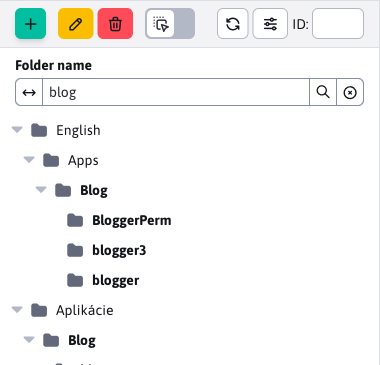
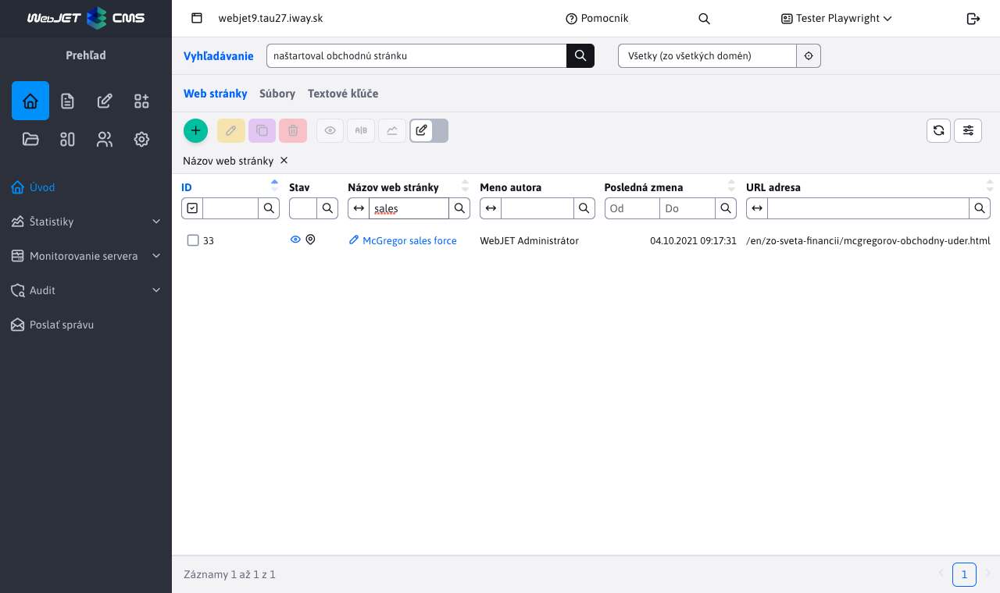
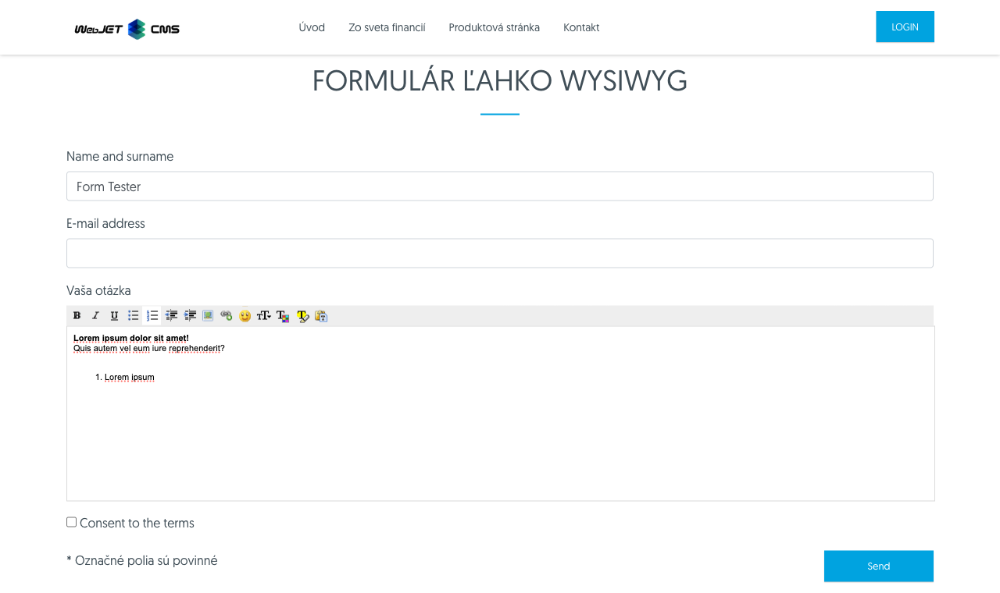

# Changelog version 2024

## 2024.52

> In version 2024.52, the Web site adds the ability to set **method of arrangement** a **search in tree structure**, ZIP import allows you to set the way to compare the existing version of the page. **Ecommerce** received a new design of the order list and products. Added **survey statistics**, a better image editor in the explorer and improved search in the administration. V **bulk emails** option added **set the logout confirmation**. The gallery contains a new field for **the URL of the image source**, which is filled in automatically when you use the photo bank, **Tags** They add **language mutations** and optional fields.

### Groundbreaking changes

- Updated Java and JavaScript libraries to newer versions, check the changes in the programmer section below. You can use the update script `/admin/update/update-2023-18.jsp`.
- Increased security [public REST services](custom-apps/spring/public-services.md) if you use them, you need to complete the permits. Cancelled REST service `/admin/rest/property/set` (#57202).
- FontAwesome - modified embedding [FontAwesome Icons](frontend/webpages/fontawesome/README.md) in the editor (#57461).
- E-commerce - methods in `DocDetails` to obtain the price adjusted from the return value `double` at `BigDecimal`. You can use the script `/admin/update/update-2023-18.jsp` for basic updating of your JSP files. If necessary, you can temporarily use the methods `getPriceDouble/getVatDouble/getLocalPriceDouble/getLocalPriceDouble` (#56385).

### Web pages

- Added option to select the method and direction for the arrangement [tree structures](redactor/webpages/README.md#setting-the-tree-structure-view) (#57257).


- Tree structure - adding options [searches in tree structure](redactor/webpages/README.md#search-in-tree-structure) web site folders in depth (#57265).



- Tags - added option [language settings](redactor/webpages/perexgroups.md#card-translations) name of the perex group to display the title tag according to the language of the web page (#57273).


- FontAwesome - modified embedding [FontAwesome Icons](frontend/webpages/fontawesome/README.md) in the editor (#57461).
- Importing web pages from a ZIP archive - adding the option to select a parameter [to compare the existence](redactor/webpages/import-export.md#importing-web-pages-from-zip-archive) web pages, modified visuals, added options about/from/label all pages/files, open/close folders and added information about import progress. Optional Field Comparison allows pages to set a Unique Identifier to uniquely identify the web page (#57441) via the Optional Field Type.


- Importing web pages from the ZIP archive - added data separation at `multi-domain` where the data of another domain is ignored when looking for an existing version of the imported data (#57493).
- Improved transfer of installation name from template to `CombineTag`. The value is stored in the `session` and will also be used in the retrieval of files during the execution of `combine` (#56325).
- The JSP template file search takes into account the installation name set in the template (#56325).
- Tags - added tab with [optional fields](redactor/webpages/perexgroups.md#tab-optional-fields) for the ability to add custom data to tags. For example, setting the tag color, tag design, etc (#57449).
- Cloning structure - during cloning, the synchronization of the web page and folder name is disabled to preserve the names according to the original folder. Configuration variable `syncGroupAndWebpageTitle` is set to `false` and set to the original value (#57489) after the cloning is finished.
- Modified numbering if there is a web page with the same name/URL address - the newly created page starts from number 2 instead of number 1, this creates URLs of the type `/en/page.html,/en/page-2.html,/en/page-3.html` instead of `/en/page.html,/en/page-1.html,/en/page-2.html` Where `-1.html` was not semantically optimal (#54273-50).
- Added option to change the behaviour of the last `/` At [generating URLs for pages](frontend/setup/config.md). By default for the main page of a folder, the URL ends with the `/`, so for example `/en/products/`, after setting the configuration variable `virtualPathLastSlash` to the value of `false` the URL will be generated without the last `/` thus as `/en/products` (#54273-50).

### Survey

- Added [response statistics](redactor/apps/inquiry/inquiry-stat.md) polls (#57337).


### Ecommerce

- [List of orders](redactor/apps/eshop/invoice/README.md) a [List of products](redactor/apps/eshop/product-list/README.md) modified to new design for datatables (#56325).


- Methods in `DocDetails` to obtain the price adjusted from the return value `double` at `BigDecimal` (#56385).

### Gallery

- The default visual style type of the gallery can be set via the conf. variable `galleryDefaultStyle`, by default `photoSwipe` (#56393-18).
- Added option to select the method and direction for the arrangement [tree structures](redactor/webpages/README.md#setting-the-tree-structure-view) (#57257).
- Added an image source URL field with an option to specify the address from which you got the image. The field is automatically set when using [photo banks](redactor/webpages/working-in-editor/README.md#photobank-card) in the list of websites (#57313).
- Added option **search in tree structure** by name, similar to the website (#57437).


### Bulk e-mail
- Sending - when sending, the SSL certificate of the web page is ignored, as often a temporary SSL certificate (#57525) is used in the internal environment.
- Logout - created a new application for logout settings. Added the ability to enter custom text before unsubscribing and the ability to display a confirmation instead of immediately unsubscribing by clicking a link in the email (#57525).
- Unsubscribe - modified bulk email unsubscribe form - added option to show confirmation of unsubscribe and option to return email again after unsubscribing (#57525).


### Explorer

- Complete image editor replacement in action [file editing](redactor/files/fbrowser/file-edit/README.md) in the explorer section after the editor in the form `DataTable` according to the photo gallery (#57313).
- Improved display on mobile phones for better usability - adjusted height, size (#55645).

### Other

- Redesigned search in administration to data tables (#57333).



- Renamed the Edit Cell option to Edit in the grid view according to the nomenclature used in `Microsoft SharePoint`.
- Search - modified the search form on the web page for the possibility of defining placeholder text (`placeholder`) instead of the standard Search. You can then enter custom text to be displayed in the form, such as Search Web Page (#54273-53).

### Security

- Modified startup log - sensitive information like passwords, token, certificates from configuration variables are replaced with expression `********` (#MR643).
- [For public REST services](custom-apps/spring/public-services.md) added option to set allowed IP addresses for each service separately (#57202).
- Translation keys - added the ability to filter keys in the REST service [/rest/properties/](custom-apps/spring/public-services.md) by conf. variable `propertiesRestControllerAllowedKeysPrefixes` to make it impossible to publicly retrieve all keys from the WebJET CMS (#57202).
- HTTP header added to audit `Referer` (#57565).

### Error correction

- Fixed URL generation for AB Testing if the original URL contains a character `*` (#54273-50).
- Image editor - fixed renaming of image in image editor opened from explorer (#57269).
- Domain redirects - fixed the ability to specify a protocol for the redirect domain. Added redirection logic to `https` version when selecting the option `http` of the original protocol - assumed redirection to `https` Version (#56393-20).
- Web pages - Page Builder - fixed inserting applications and blocks at the correct cursor location (#57613).
- Web Pages - Blocks - Fixed deleting blank space in Firefox when inserting a block (#57613).

### Documentation

- Documentation created for [improve server performance](sysadmin/performance/README.md) (#57357).
- Created documentation in PDF for [of the editor](_media/manuals/webjetcms-redactor.pdf), [Administrator](_media/manuals/webjetcms-admin.pdf), [traffic](_media/manuals/webjetcms-sysadmin.pdf) a [install](_media/manuals/webjetcms-install.pdf). The PDF documentation is generated automatically from the current MarkDown documentation and includes the WebJET CMS version date (#57269).

### For the programmer

- Changed API for datatable `table.ajax.url(newUrl); -> table.setAjaxUrl(newUrl);`, `table.ajax.url() -> table.getAjaxUrl()` (#57365).
- Updated `Swagger-UI` at `/admin/swagger-ui/` to version `org.webjars:swagger-ui:5.17.14` (#57365).
- Updated library `Bootstrap` from 4.6.1 to 5.3.3 and `jQuery` from 3.5.1 to 3.7.1 for old v8 administration (#57365).
- Libraries removed in version 8 `bootstrap-modal,bootstrap-switch,bootstrap-toastr,uniform,simple-line-icons` (#57365).
- Need to edit the tab switching in your JSP files, search for `data-toggle="tab"` and replace with `data-bs-toggle="tab"`, `LI` set the element `class="nav-item"` and to the first `A` set the element `class="active"`:

```html
<ul class="nav nav-tabs">
    <li class="nav-item">
        <a class="active" href="#tabMenu1" data-bs-toggle="tab">
            <iwcm:text key="components.filter"/>
        </a>
    </li>
    <li class="nav-item">
        <a href="#tabMenu2" data-bs-toggle="tab" onclick="loadComponentIframe();">
            <iwcm:text key="components.file_archiv.waiting_files"/>
        </a>
    </li>
</ul>
```
- Removed methods `DocDB.searchTextAll,searchTextUrl`, use the class `sk.iway.iwcm.search.SearchService` (#57333).
- Applications via `!INCLUDE` can also be inserted from folders `/apps` a `/templates` (#56325).
- [Optional fields](frontend/webpages/customfields/README.md#paint) - added field type `color` for color selection (#57449).
- For [application in the editor](custom-apps/appstore/README.md#use-of-annotation) it is possible to define multiple JSP files for which it will be used, for example `@WebjetAppStore(...componentPath = "/components/search/search.jsp,/components/search/lucene_search.jsp")`. The first JSP file in the list (#54273-53) is used when inserting a new application.


## 2024.40

> In version 2024.40 it brings **Explorer** new features and improvements. When moving files using **drag\&drop will now show confirmation** to avoid errors when managing files. In the image editor, an option has been added to set **sizing and trimming according to templates** which makes it easy to edit images directly in the interface.
>
> Another improvement is the reworking of the settings of several **applications in a new, clearer design**. The author of the page now receives **notifications when a page is published on time** as well as when adding **post to the discussion forum** which improves control over content. The new time-based booking app makes it easy and clear **booking facilities such as tennis courts or meeting rooms**. This app also offers statistics by user and object, making it easier to manage bookings.
>
> We've also improved PageBuilder and fixed publishing bugs in the File Archive, providing better stability and performance when working with content.

### Groundbreaking changes

- AB Testing - prevented from calling URLs of B version (containing the expression `abtestvariant`) if no administrator is logged in. You can enable direct calls to such URLs by setting the conf. variable `ABTestingAllowVariantUrl` to the value of `true` (#56677).
- Database connection - changed library for database connection management from `Apache DBCP` at [HikariCP](https://github.com/brettwooldridge/HikariCP) (#56821).
- Initialization - modified initialization of WebJET using `Spring.onStartup` instead of `InitServlet`. The correct order of loading configuration variables and their use in `SpringBean` objects (#56913).
- Character encoding - due to a change in initialization, the character encoding is read from the conf. variable `defaultEncoding` with default value `utf-8`. If you have historically used encoding `windows-1250` it is necessary to modify the value in the configuration. The value in `web.xml` For `SetCharacterEncodingFilter` but the value in the WebJET configuration. You can filter from `web.xml` delete. Support for setting an error message in case of a broken database connection by setting the parameter `dbErrorMessageText`, you need to create a file `/wjerrorpages/dberror.html` to display a specific HTML page on a database connection error (#56913, #56393-12).
- Optimized redirect acquisition in `404.jsp`, in your gradle projects we recommend to update the file `404.jsp` By [basecms](https://github.com/webjetcms/basecms/blob/master/src/main/webapp/404.jsp) project (#53469).
- File archive - modified default value of conf. variable `fileArchivIndexOnlyMainFiles` to the value of `true`. So only the main files are written to the search/full text index, not the archive versions. The reason is that we don't want to direct users from the search to older (archive) versions of files by default (#57037).
- Archive files - corrected ordering of files in the archive by time, added option to order by priority (this is how it was ordered when the original option was by time) (#57037).
- Locked zone - modified login and forgot password function if you have a file modified by you `/components/user/logon.jsp` or `/components/user/change_password.jsp` verify correct behavior and possibly modify according to the standard version (#57185).

### Web pages

- Cloning structure - added option [keep URLs when cloning](redactor/apps/clone-structure/README.md). The URLs are stripped of the source folder prefix and the destination prefix is added. So if you are cloning a new language mutation, for example, it will only add e.g. `/en/` prefix, but the other URLs remain unchanged (#56673).


- Image Editor - added the ability to set the Point of Interest to any image (#57037).
- Image Editor - adjusted image size settings to better use the resize feature (if the image is smaller than the current window it will shrink) (#56969).
- Audit - modified audit logging when saving a web page to a standard data spreadsheet with a list of all changed properties (#57037).
- Page Comparison - fixed "Show page text only" display when comparing versions of a page from history (#57037).
- Images - when changing an image that has the expression in the title `placeholder` or `stock` the explorer window will not show the folder with this image, but will show Media of this page/Pictures for easy upload of a new image instead of the placeholder image (#57037).
- Perex image - modified window opening to show Media of this page first and then selecting all media (not showing a list of all files and links to web pages) (#57037).
- Page Builder - fixed setting folder by new page title when inserting an image (#57037).
- Page Builder - fixed duplication of block for `accordion` - Correct editor ID setting to avoid overwriting the text when saving (#57037).
- Page Builder - corrected settings [column widths](frontend/page-builder/blocks.md#setting-the-width-of-the-columns) - the width of the window is taken into account, not the width of the element (#57037).
- The list of promo applications when inserting a new application is set via the conf. variable `appstorePromo`, it is possible to enter directly the name of the folder in addition to `itemKey` value, e.g. `cmp_news` to support Spring applications. The default value is `cmp_news,menuGallery,menuBanner,cmp_video` (#57157).
- Export to HTML - created [Documentation](redactor/webpages/export-to-html/README.md), tests, disabled SSL certificate checking for use `SelfSigned` certificates during development or testing (#57141).
- Web page publishing - added auditing of successful web page publishing time and added option [send notification to author](redactor/webpages/editor.md#publishing-a-website) web site on successful publication (#57173).


- Tags - added variable `perexGroupsRenderAsSelect` to determine from what [the number of brands](redactor/webpages/perexgroups.md) will start to be generated as a multiple selection field, originally this value was set to 30 in the code (#57185).
- Tags - even with a high number of defined tags, filtering will always appear as a text field in the table (#57185).
- Optional fields - added column name settings [optional fields](frontend/webpages/customfields/README.md) in the list of web pages, including the prefix of text keys (e.g. `temp-3.editor.field_a`) according to the folder template (#57185).

### Applications

Redesigned application properties settings in the editor from the old code in `JSP` at `Spring` Application. Apps also automatically get the ability to set [display on devices](custom-apps/appstore/README.md#conditional-application-view). The design is consistent with the rest of the WebJET CMS and data tables.
- [Cookie bar](redactor/apps/app-cookiebar/README.md)
- [Content Block](redactor/apps/content-block/README.md)
- [Disqus comments](redactor/apps/app-disqus/README.md)
- [Facebook Like button](redactor/apps/app-facebook_like/README.md)
- [Facebook Like Box](redactor/apps/app-facebook_like_box/README.md)
- [GDPR Cookies consent](redactor/apps/gdpr/README.md)
- [Google search](redactor/apps/app-vyhladavanie/README.md)
- [Live chat (SmartsUpp)](redactor/apps/app-smartsupp/README.md)
- [Navigation menu](redactor/apps/menu/README.md)
- [Weather](redactor/apps/app-weather/README.md)
- [Send page by email](redactor/apps/send_link/README.md)
- [Statistics - click map](redactor/apps/stat/README.md)
- [Inserting a document](redactor/apps/app-docsembed/README.md)
- [Insert HTML code](redactor/apps/app-htmlembed/README.md)
- [Search](redactor/apps/search/README.md)
- [View files](redactor/apps/site-browser/README.md)


### Audit

- Improved entity change notation, added support for fields, getting a value for the date (`Date` object or variable with `date` in title), added tag support (listing title instead of ID) (#57037).
- Redesigned section **Logging levels** on the Audit-> section[Logging levels](sysadmin/audit/audit-log-levels.md) and Audit->[Log files](sysadmin/audit/audit-log-files.md) to the new design (#56833).


- Modified permissions for Audit-Modified Pages and Audit-Pending Publishing sections to hide properly in the menu - require permission to both audit and list web pages (#57145).
- Modified a bad role for the Audit-Log Files section (#57145).
- Improved background auditing of job records - added list of changes when editing/creating a job, added job ID (#56845).
- [Notifications](sysadmin/audit/audit-notifications.md) - modified the "Only if contains text" field to a multi-line field for the possibility to send a notification with multi-line expression control (#57229).


### AB Testing

- For search bots (e.g. Google), the A variant is always displayed to keep the page text consistent. The bot is detected in the same way as for statistics by `User-Agent` headers set in the conf. variable `statDisableUserAgent` (#56677).
- Ninja class added [identification of the displayed variant](frontend/ninja-starter-kit/ninja-bp/README.md) via `data-ab-variant="${ninja.abVariant}` (#56677).
- Prevented calling URLs of version B (containing the expression `abtestvariant`) if no administrator is logged in. You can enable direct calls to such URLs by setting the conf. variable `ABTestingAllowVariantUrl` to the value of `true` (#56677).

### Archive files

- Modified file name generation when updating so that the original file name is always preserved and older versions are saved as `_v1,_v2` etc (#57037).
- Fixed publishing a file set as Upload file later (#57037).
- Fixed creation of a full text index for file search (#57037).
- Modified default value of conf. variable `fileArchivIndexOnlyMainFiles` to the value of `true`. So only the main files are written to the search/full text index, not the archive versions. The reason is that we don't want to direct users from the search to older (archive) versions of files by default (#57037).
- Fixed ordering of files in the archive by time, added option to order by priority (this is how it was ordered when the original option was by time) (#57037)
- Added note display and date range validity also for archive versions of files (#57037).


### Dialers

- Modified record ID check when importing dialer data - it checks if the ID is not in another type of dialer, if so the value is set `ID` at `-1` to import a new record. This protects overwriting of data in other than the selected dial if by chance there is a record with the same ID (#57149).

### Discussion

- Added option [Send a notification to the author of the page when a post is added to the discussion](redactor/apps/forum/README.md#tab---application-parameters) when loading the Discussion app into the page. Setting the conf. variable `forumAlwaysNotifyPageAuthor` to the value of `true` you can turn the notification on automatically for all discussions/forums (#57013).


### Forms

- After submitting the form via AJAX published event `WJ.formSubmit`, which can be listened to when connected to `DataLayer`, e.g. as:

```javascript
    window.addEventListener("WJ.formSubmit", function(e) { console.log("DataLayer, submitEvent: ", e); dataLayer.push({"formSubmit": e.detail.formDiv, "formSuccess": e.detail.success}); });
```
- For forms that [require you to confirm the validity of your email address](redactor/apps/form/README.md#setting-the-email-address-confirmation) click on the link in the email, edit the submission success message to read "The form has been submitted, we have sent a message to your email asking you to confirm the submission by clicking on the link." so that the visitor receives information about the need to confirm the submission in the email message (#57125).
- Forms that require you to confirm the validity of the email address by clicking on the link in the email and are not yet confirmed are shown in red (#57125) in the list of forms.


### Gallery

- Modified the display of images in the administration so that the set point of interest is not taken into account, but the entire image (#56969) is displayed in the image list.
- Added option to set [templates for image resizing and cropping](redactor/image-editor/README.md) (#57201).
- Fixed text insertion in standalone image editor and translation of missing text (#57201).
- Moved the toolbar in the image editor to the left to make better use of the monitor area (#57201).


- Increased author field size from 255 characters to a text field with a range of 64000 characters (#57185).
- Modified HTML code formatting in Perex fields - disabled line wrapping/code formatting to avoid padding (#57185).
- Added cleaning HTML code from formatting when inserting text via clipboard (#57185).

### News

- Added folder rights check - folder selection field for news display is filtered by folder rights of web pages (#56661).

### Users

- Added option to set [user group](admin/users/user-groups.md) a % discount on the price, which will be used e.g. when making a reservation but will also be used in other applications in the future (#57049).
- Modified change logic [forgotten password](redactor/admin/password-recovery/README.md). If the specified email belongs to multiple users, when changing the password, you can use the selection field to specify which user with the specified email will have their password changed (#57185).


### Explorer

- New version of the library [elfinder](https://github.com/webjetcms/libs-elFinder/tree/feature/webjetcms-integration) For [file management](redactor/files/fbrowser/README.md). Modified design according to the look of the datatables for a nicer integration.


- The default file encoding for the editor is set according to the conf. variable `defaultEncoding`. For JSP files the encoding is `utf-8/windows-1250` detected by attribute `pageEncoding` if the file contains an expression at the beginning `#encoding=` is used according to this value (#55849).
- After setting the conf. variable `iwfs_useVersioning` at `true` the history of changes in the files starts to be written (each file is archived in a folder after uploading and before being overwritten `/WEB-INF/libfilehistory`). The list is available in the explorer in the File Settings context menu with the option to compare, view the historical version, and undo the change (#57037).
- Fixed renaming of files in folders `/images,/files` to automatically remove the diacritics (#57053).
- File indexing - date of last file change (#57177) added to Perex-Start of publication.
- Added option [file/folder move confirmations](redactor/files/fbrowser/README.md#Configuration). You can disable validation by setting the configuration variable `elfinderMoveConfirm` to the value of `false` (#57297).


### Reservations

- Added support for automatically calculating the price of a reservation when it is created (#56841).
- Added new MVC [Time Reservation app](redactor/apps/reservation/time-book-app/README.md), for booking selected objects in hourly intervals (#56841).
- Added support for getting discounts on [the price of the reservation](redactor/apps/reservation/reservations/README.md#Basic) of the booking price according to the set user group (#57049).
- Added section [Reservation statistics](redactor/apps/reservation/reservations-stat/README.md) for both time and day bookings (#57049).


- Added option to set [user group](admin/users/user-groups.md) a % discount on the price to be applied when the booking is made (#57049).
- Added [reservation statistics](redactor/apps/reservation/reservations-stat/README.md) where you can see the number and price of reservations by user (#57049).


### Security

- Modified password, password change and multi-factor authorization dialogs to support 64-character passwords, added password change tests (#56657).
- Modified logic for [password reset](redactor/admin/password-recovery/README.md) where the recovery email used belonged to multiple accounts and the option to choose which user's password is changed was added (#57185).
- Users - When duplicating a user, if no password is entered, a random password (#57185) is set for the new user.

### Documentation

- Documentation for missing applications added to the section [For the editor](redactor/README.md) (#56649).
- Updated documentation for the application [Scripts](redactor/apps/insert-script/README.md) (#56965).
- Added English version of the documentation (#56773).
- Supplemented documentation for [image editor](redactor/image-editor/README.md) (#56969).
- Updated documentation for generation [preview images](frontend/thumb-servlet/README.md) and setting [point of interest](frontend/thumb-servlet/interest-point.md) (#56969).
- Documentation created for [work in the page editor](redactor/webpages/working-in-editor/README.md) (#56981).
<!-- - Supplemented documentation for [file archive](redactor/apps/file_archiv/README.md) (#56891). REMOVE ?? -->
- Supplemented documentation for [in front of the prepared block](redactor/apps/htmlbox/README.md) (#56981).
- Added [Czech version](https://docs.webjetcms.sk/latest/cs/) Documentation (#57033).
- Modified the generation of links to source code to point to [GitHub version](https://github.com/webjetcms/webjetcms/tree/main/src) source code (#57033).
- Created documentation for operation - [Data deletion](sysadmin/data-deleting/README.md), [System backup](sysadmin/files/backup/README.md) a [Restart](sysadmin/restart.md) (#57141).
- Documentation created for the administrator - [Automated tasks](admin/settings/cronjob/README.md) (#57141).
- Created documentation for the editor - [Send a message](redactor/admin/send-message.md), [Export to HTML](redactor/webpages/export-to-html/README.md), [Redirections](redactor/webpages/redirects/README.md) (#57141).
- Documentation created to use the feature [forgotten password](redactor/admin/password-recovery/README.md) (#57185).
- Documentation created for the setup [Spam protection](install/config/spam-protection.md) (#57185).

### Testing

- Created object `TempMail` for easier work with email inbox [tempmail.plus](https://tempmail.plus) for testing sent emails (#56929).
- All basic tests (using `DataTables.baseTest`) supplemented by testing the Duplicate function (#56849).
- Added diacritic characters in Data Tables automated tests to test saving and filtering with respect to diacritics (#56393-12).

### System changes

- Initialization - added option [initialize values](install/external-configuration.md) for the cluster (e.g. `clusterMyNodeName,clusterMyNodeType,useSMTPServer,pkeyGenOffset`) and by setting environmental variables with the prefix `webjet_` or system with prefix `webjet.` (#56877).
- Initialization - modified initialization of WebJET using `Spring.onStartup` instead of `InitServlet`. The correct order of loading configuration variables and their use in `SpringBean` objects (#56913).
- Character encoding - due to a change in initialization, the character encoding is read from the conf. variable `defaultEncoding` with default value `utf-8`. If you have historically used encoding `windows-1250` it is necessary to modify the value in the configuration. The value in `web.xml` For `SetCharacterEncodingFilter` but the value in the WebJET configuration. You can filter from `web.xml` delete. Support for setting an error message in case of a broken database connection by setting the parameter `dbErrorMessageText`, you need to create a file `/wjerrorpages/dberror.html` to display a specific HTML page on a database connection error (#56913, #56393-12).
- Modified getting a redirect from a new URL (String) to get the database entity directly. This also directly gets the redirect code (301,302...) without the need for an additional database call. This will improve the execution performance of the 404 page (#53469).
- PostgreSQL - fixed saving folder change history and deleting approval when deleting a folder (#57061).
- Added information about the upcoming expiration of the license, displayed 2 months before expiration on the splash screen (#57169).


- Modified method calls `before*/after*` v `DatatableRestControllerV2` so that they are called for all `REST` services and at the same time they were also called during congestion `insertItem,editItem,deleteItem` (#57186).
- For public cluster nodes that do not have [allowed during monitoring](sysadmin/monitoring/README.md) entry in the table `_conf_/webjet_conf` conf. variable can be set `monitoringEnableCountUsersOnAllNodes` to the value of `false`. This disables the number of `sessions` on individual nodes to the configuration (#43144-3).
- Spam protection - when deleting all cache objects in a section [Data deletion](sysadmin/data-deleting/README.md) the content of the Spam protection is also deleted. This makes it easy to reset the spam protection (#57185) if necessary.

### For the programmer

- Datatables - added option to set buttons in the editor window (by default includes Create button) also for [creating a new record](developer/datatables-editor/README.md#special-buttons) by setting `createButtons` (#55849).
- Dialog box - added function `WJ.openIframeModalDatatable` for opening [modal window](developer/frameworks/webjetjs.md#iframe-dialogue) containing the datatable editor (record editing). Automatically sets options for saving and closing the window after saving the datatable record (#55849).
- Support for libraries cancelled `Apache Commons DBCP, Commons Pool a Oracle UCP`. Database connections are managed using [HikariCP](https://github.com/brettwooldridge/HikariCP). Cancelled API `ConfigurableDataSource.printStackTraces` (#56821).
- Database connection - additional auditing of non-closed database connections (connections that are open for more than 5 minutes). They are recorded in the audit as type `SQLERROR` with text `Connection leak detection triggered` and a stack dump to trace where the connection is not closing (#56821).
- Support for libraries cancelled `Apache Commons DBCP, Commons Pool, Oracle UCP`. Database connections are managed using [HikariCP](https://github.com/brettwooldridge/HikariCP). Cancelled API `ConfigurableDataSource.printStackTraces` (#56821).
- Database connection - additional auditing of non-closed database connections (connections that are open for more than 5 minutes). They are recorded in the audit as type `SQLERROR` with text `Connection leak detection triggered` and a stack dump to trace where the connection is not closing (#56821).
- Annotation [@WebjetAppStore](custom-apps/appstore/README.md) allows you to set the attribute `custom` to specify a custom application that is listed at the top of the list before standard applications (#56841).
- Initialization - modified initialization of WebJET using `Spring.onStartup` instead of `InitServlet`. The correct order of loading configuration variables and their use in `SpringBean` objects (#56913).
- `SpringSecurity` - annotation `@EnableGlobalMethodSecurity(securedEnabled = true, prePostEnabled=true)` Replaced by `@EnableMethodSecurity(securedEnabled = true, prePostEnabled=true)` (#56913)
- To `RequestBean` added method `addAuditValue(String key, String value)` which allows you to add additional parameters to be recorded in the audit before writing to the Audit, e.g. `RequestBean.addAuditValue("historyId", String.valueOf(historyId));` (#57037).
- Added to Datatable [field type](developer/datatables-editor/standard-fields.md#boolean_text), `DataTableColumnType.BOOLEAN_TEXT` which displays the caption on the right instead of the left and the Yes option next to the checkbox (#57157).
- Added to Datatable [field type](developer/datatables-editor/standard-fields.md#color), `DataTableColumnType.COLOR` for colour selection in `HEX` format e.g. `#FF0000` (#57157).
- Added to Datatable [field type](developer/datatables-editor/standard-fields.md#iframe), `DataTableColumnType.IFRAME` to insert another page via `iframe` item (#57157).
- Added to Datatable [field type](developer/datatables-editor/standard-fields.md#base64), `DataTableColumnType.BASE64` for encoding and decoding values via `base64` Algorithm (#57161).
- Added to Datatable [field type](developer/datatables-editor/standard-fields.md#static_text), `DataTableColumnType.STATIC_TEXT` to display static text in the right part of the editor window (#57161).
- Datatables - for [field type](developer/datatables-editor/standard-fields.md#json), `JSON dt-tree-dir-simple` added the ability to set the root folder via `@DataTableColumnEditorAttr(key = "data-dt-field-root", value = "/images/gallery")`. The field has no attribute set `disabled`, so the value can also be entered directly (#57157).
- Datatables - added setting option `editorLocking` to disable multi-user edit control of a record (#57161).
- Added option for Spring applications in the editor [data initialization](custom-apps/appstore/README.md#data-initialization) by implementing the method `initAppEditor` and the possibility [settings of selection fields](custom-apps/appstore/README.md#setting-the-selection-fields) by implementing the method `getAppOptions` (#57157).
- Amcharts - added support for new chart type [DoublePie](developer/frameworks/charts/frontend/statjs.md#graph-of-type-double_pie) for statistical purposes (#57049).
- `Base64` - added features `WJ.base64encode(text),WJ.base64decode(encodedText)` for encoding and decoding text by algorithm `base64` with support `utf-8` Characters (#57161).
- Supplemented methods `Adminlog.getChangelog(Long id, Object newObj, Object originalObj),Adminlog.getChangelogDelete(Long id, Object obj)` to get a list of changes when creating/modifying/deleting a simple Java object (not a JPA entity) (#56845).


## 2024.18

> Version 2024.18 includes **a new set of icons**, Form easily completed by **advanced settings** (recipients, redirects...), AB Testing, Audit (awaiting publication, changed pages), Blog, Questionnaires, Event Calendar (approvals) have been redesigned. Added **MultiWeb installation support** (domain data separation) in Templates, Bulk Email and other applications. New library on **browser detection**, in Statistics-Browsers there will be minor differences, but we anonymously record browser data even without Cookies consent.

!>**Warning:** To run version 2024, you need to have Java version 17 installed on the server.

### Groundbreaking changes

This version introduces several changes that may not be backwards compatible:
- Bulk email - modified support for sending emails via the service `Amazon SES` from the use of a special API to [standard SMTP protocol](install/config/README.md#amazon-ses-settings).
- [Removed libraries](install/versions.md#changes-when-switching-to-20240-snapshot), `bsf,c3p0,cryptix,datetime,jericho-html,jsass,opencloud,spring-messaging,uadetector,joda-time,aws-java-sdk-core,aws-java-sdk-ses,jackson-dataformat-cbor,jmespath-java` (#56265).
- Mark removed `iwcm:forEach`, it should be replaced by `c:forEach`. The difference is that the Java object is not directly accessible, it has to be retrieved using `pageContext.getAttribute("name")`. Use the call `/admin/update/update-2023-18.jsp` to update your JSP files (#56265).
- Bulk email - separate campaigns, recipients and unsubscribe emails by domain, older records are assigned to domains by the URL of the sending website. The advantage in separating unsubscribed emails is in the case of running multiple websites and different recipient lists, when unsubscribing is done separately for each domain. **Warning:** current unsubscribed emails are set to domain ID 1, if you are primarily using bulk email on a domain other than the first domain update the column `domain_id` in the database table `emails_unsubscribe` (#56425).
- Bulk email - deleted unused methods from Java class `sk.iway.iwcm.dmail.EmailDB`, if you use them in your project move them from [the original source code](https://github.com/webjetcms/webjetcms/blob/ef495c96da14e09617b4dc642b173dd029856092/src/webjet8/java/sk/iway/iwcm/dmail/EmailDB.java) to your own class (#56425).
- Icons - due to the transition to Open Source solutions we changed the icon set from the original FontAwesome to the new set [Tabler Icons](https://tabler.io/icons). If you use FontAwesome icons in your own applications, you need to modify the code and replace them with FontAwesome icons. `Tabler Icons`. You can use the script `/admin/update/update-2023-18.jsp` for editing the most frequently used icons in the administration (edits only files that require a login).

### Switching to Java 17

WebJET CMS version 2024 switched to Java version 17. It contains the following changes:
- Updated several libraries, e.g. `AspectJ 1.9.19, lombok 1.18.28`.
- Updated Eclipselink library to standard version, using WebJET CMS `PkeyGenerator` set by class `JpaSessionCustomizer` a `WJGenSequence`.
- Updated `gradle` to version 8.1.
- Old library removed `ch.lambdaj`, use standard Java Lambda expressions (#54425).
- Mark removed `<iwcm:forEach`, use replaced by standard `<c:forEach` (#56265).
- To simplify the update, you can use the script `/admin/update/update-2023-18.jsp` for checking and repairing JSP files. Customer Java classes need to be recompiled and bugs need to be fixed due to API changes.

### New set of icons

Due to the transition to Open Source solutions, we have changed the icon set from the original FontAwesome to a new set [Tabler Icons](https://tabler.io/icons). Some of the icons have been modified to better reflect the function of the button.


For datatables, the icons for table setup, data reload, import and export are moved to the right to better separate standard functions from setup and advanced operations. The figures show a comparison of the new (top) and old versions (bottom).


### User interface improvements

- Menu - menu items/section icons (Overview, Websites, Posts...) will only be displayed if the user has access to an item in that section (#56169).
- News - modified adding news - switch to Basic tab for easier setting of news headline and setting of the classification in the tree structure according to the selected section in the page header (#56169).
- Home - the Login Admins, My Recent Pages, Changed Pages and Audit sections are only displayed if the user has the necessary permissions (#56169).
- Introduction - added information about folder in the list of last pages, added option to open audit record (#56397).
- Web pages - improved editing on mobile devices - editor toolbar is scrollable, all icons are available (#56249-5).
- Datatables - improved layout of editor toolbar at low resolutions - icons are correctly moved to the second row, option to enter ID remains on the top right (#56249-5)
- Datatables - icon for marking/unmarking all records changes state according to whether rows are marked or not (#56397).
- Datatables - reduced spacing between columns, reduced page title height, toolbar and footer for displaying multiple columns on screen/ condensing information. At least one extra row should appear in the table on the same screen. (#56397).

### Web pages

- Standard [subtitle synchronisation](redactor/webpages/group.md#synchronisation-of-folder-name-and-web-page) folder and the main web page is not used when one web page is set as the main page of multiple folders, or when the main page is from a different folder (#56477).

### MultiWeb

Added support [operation in MultiWeb mode](install/multiweb/README.md) - multi tenant management of multiple separate domains in one WebJET. The domains are externally separate and each pretends to be a separate WebJET CMS installation.
- List of users - separated by domain ID (#56421).
- Home - logged in admins - separated by domains (#56421).
- Rights to Domain Limits, HTTP Headers, Logging Levels, Last Logs, User Groups, Rights Groups are only available in the first/manager domain (#56421).
- Web pages - added option to create multiple root folders (#56421).
- Statistics - Error pages - column added `domain_id` to the database to separate bad URLs by domain (#56421).
- Media - media groups - list divided by the currently displayed domain and rights of the tree structure of web pages (#56421).

### AB testing

- List of pages in AB test converted into [new design](redactor/apps/abtesting/abtesting.md), added section for setting AB testing configuration (#56177).


### Audit

- Added support for user filtering also by the entered email address.
- Redesigned section Audit->[Awaiting publication](sysadmin/audit/audit-awaiting-publish-webpages.md) to the new design. Clearly displays a list of pages that will be changed in the future (#56165).
- Redesigned section Audit->[Changed pages](sysadmin/audit/audit-changed-webpages.md) to the new design. Displays a complete list of changed pages for the selected period (#56165).


### Blog

- Blog redesigned in the new administration. The article list section uses the standard options as used in the website/news list (#56169, #56173).
- The original list of discussion posts has been moved directly to the Discussion section, users/bloggers gain the right to that section as well (#56169).
- The standard news app is used to display the list of articles.
- Blogger management (user administration) converted into a datatable, allows you to create a blogger and set his rights correctly.


### Questionnaires

Application [questionnaires](redactor/apps/quiz/README.md) redesigned. Allows you to create questionnaires with evaluation of the correct answer. The questionnaire can be with one correct answer or with scored answers. The application also includes statistical evaluation (#55949).


### Form easily

- Added an advanced tab with advanced options to set up form processing similar to standard HTML forms. Added options to set recipients, redirects, page ID with version to email, etc. Modified the list of form items for better use of space (#56481).


- Added Formatted text field type for entering text with formatting such as bold, bullets, numbered list, etc (#56481).



### GDPR Cookies

- Integration with [Google Tag Manager](redactor/apps/gdpr/gtm.md) supplemented by new types of consents `ad_user_data` a `ad_personalization` that are linked to consent to marketing cookies. Modified JSON object generation from values `true/false` to the correct values `granted/denied` (#56629).

### Bulk e-mail
- Modified support for sending emails via the service `Amazon SES` from the use of a special API to [standard SMTP protocol](install/config/README.md#amazon-ses-settings) (#56265).
- Domain limits setting added as a separate right, it is not enabled by default, needs to be added by the appropriate user (#56421).
- Separate campaigns, recipients and unsubscribe emails by domain, older records are categorized into domains by the URL of the sending website. The advantage in separating unsubscribed emails is in the case of running multiple websites and different recipient lists, when unsubscribing is done separately for each domain. **Warning:** current unsubscribed emails are set to domain ID 1, if you are primarily using bulk email on a domain other than the first domain update the column `domain_id` in the database table `emails_unsubscribe`, (#56425).
- Added option for direct [unsubscribing from bulk email](redactor/apps/dmail/form/README.md#logout) click on the link displayed in the email client/Gmail by setting the email header `List-Unsubscribe` a `List-Unsubscribe=One-Click` (#56409).

### Calendar of events

- Unapproved and recommended events - process [approval of new events](redactor/apps/calendar/non-approved-events/README.md) a [recommended events](redactor/apps/calendar/suggest-events/README.md) redesigned (#56181).

### News

- Added option Exclude main folder pages in [news list](redactor/apps/news/README.md#application-settings-in-the-web-page) to exclude the main pages from the subfolders in the news list. Assuming that the subfolders contain a main page with the news list in that folder, such pages are excluded and not used in the news list (#56169).

### Questions and answers

- Added separate saving of the reply to both the email and the database for later verification of the reply (#56533).
- Fixed display of the Question already answered column (#56533).
- Selecting Show on web page will copy the email reply to the web page reply (if already entered) (#56533).

### Templates

- Separate list of templates by domain - only templates that do not have folder display restrictions or contain a restriction to the folder of the currently displayed domain (#56509) are displayed.

### Statistics

- Modified getting the week number according to ISO 8601, values in the statistics by week may be different from the previous version (#56305).
- Error pages - column added `domain_id` to the database to separate the bad URLs by domain. Historical data is not separated (it will be displayed in all domains), but from the moment of the update it will display already incorrect URLs separated by domains (#56421).
- Modified [browser detection](redactor/apps/stat/README.md#browsers) using the library [UAP-java](https://github.com/ua-parser/uap-java). Some data is detected differently than originally - Safari and Mobile Safari on iOS are distinguished, the operating system for Android phones is set to Android instead of Unix, Linux is detected instead of Unix for some cases, macOS is detected as Mac OS X. Added support for Instagram and Facebook internal browser detection. Thus, after updating to this version, there may be differences in displaying the period before and after the update. It is possible to update the browser definition file by setting the path to [YAML](https://github.com/ua-parser/uap-core/blob/master/regexes.yaml) file in conf. variable `uaParserYamlPath` (#56221).
- The browser type and operating system is entered in the statistics even without consent to the storage of cookies, as this data does not use cookies. The data is anonymised and entered with the time rounded to 15 minutes (#56221).

### Security

- 404 - added option to disable 404 page call protection (number of requests) like other spam protection by setting IP address to conf. variable `spamProtectionDisabledIPs`. Other SPAM protections (for repeated calls) are also disabled for the IP address.
- Added license checking for used libraries when `deployment` new version (#56265).
- Updated several libraries to newer versions, major versions changed for `mariadb-java-client` from 2 to 3, `pdfbox` from 2 to 3 (#56265).

### Testing

- We have added/modified automated testing of the front-end (not the admin part) of Map applications, `Carousel`, File Archive, `Content Block`, Date, Google Search, Social Links, Recommendations, Send Page via Email, Weather, Related Sites, Impressive Slideshow, `Slider`, `Slit Slider`, Video, `Carousel Slider`, Insert HTML code, Insert document, Search, Conditional views, Blocks (#56413).
- Added support for automatic testing/checking of inter-domain separation of records to [DataTables.baseTest](developer/testing/datatable.md#setting-options) (#56509).

### For the programmer

- Bulk email - deleted unused methods from Java class `sk.iway.iwcm.dmail.EmailDB`, if you use them in your project move them from [the original source code](https://github.com/webjetcms/webjetcms/blob/ef495c96da14e09617b4dc642b173dd029856092/src/webjet8/java/sk/iway/iwcm/dmail/EmailDB.java) to your own class (#56425).
- `MailHelper` - added option to set email headers by calling `addHeader(String name, String value)`, API `SendMail` adapted for use `MailHelper` which we recommend to use primarily for sending emails (#56409).
- Added option to display list of conf. variables in your application by [the specified prefix](./custom-apps/config/README.md), (#56177).
- Added the ability to control rights when creating, editing, deleting, performing an action and also when retrieving a record by implementing a method `public boolean checkItemPerms(T entity, Long id)`, (#56421).
- Added class `DatatableRestControllerAvailableGroups` for easy implementation of user rights checking also based on rights to the tree structure of web pages (#56421).

### System changes

- WebJET CMS is available directly in [maven central repository](https://repo1.maven.org/maven2/com/webjetcms/webjetcms/), GitHub projects [basecms](https://github.com/webjetcms/basecms) a [demos](https://github.com/webjetcms/democms) adapted to use this repository directly. The build is slightly different from the original build, the libraries `wj*.jar` are combined into `webjet-VERZIA-libs.jar`. Library used [pd4ml](https://pd4ml.com/support-topics/maven/) is in version 4, for generating PDF files it requires entering the license in the file `pd4ml.lic` v [work folder](https://pd4ml.com/support-topics/pd4ml-v4-programmers-manual/) the server or folder where it is located `pd4ml.jar`. Later the option to enter the license number via the configuration variable (#43144) will be added.
- Full text indexing support removed `rar` archives (#43144).
- NTLM - added conf. variable `ntlmLogonAction.charsetEncoding` with the name of the character encoding for the LDAP login. If empty, it is not used and the characters are left in the encoding as returned by the LDAP server.
- PostgreSQL - added support [PostgreSQL databases](install/setup/README.md#creating-a-db-schema) (#56305).

We have removed several unused libraries, and replaced little-used libraries with alternatives:
- Mark removed `<iwcm:forEach`, use replaced by standard `<c:forEach`. Make the change from `<iwcm:forEach items="${iii}" var="vvv" type="sk.iway.ttt">` at `<c:forEach items="${iii}" var="vvv"><%sk.iway.ttt vvv = (sk.iway.ttt)pageContext.getAttribute("vvv");%>`.
- Removed JSP library `datetime` if you use JSP tags `<datetime:xxx>` you can add it to `build.gradle` Like `implementation("taglibs:datetime:1.0.1")`.
- Library removed `c3p0` and support the use of this database `pool`.
- Removed old JS functions `saveEditor` a `historyPageClick` including the old REST service `/admin/rest/document/`.
- Bulk email - modified support for sending emails via the service `Amazon SES` from using a special API/library to [standard SMTP protocol](install/config/README.md#amazon-ses-settings).

If you need one of these libraries in your project, add it to your `build.gradle`:

```gradle
dependencies {
    implementation("com.amazonaws:aws-java-sdk-core:1.12.+")
    implementation("com.amazonaws:aws-java-sdk-ses:1.12.+")
    implementation("bsf:bsf:2.4.0")
    implementation("commons-validator:commons-validator:1.3.1")
    implementation("taglibs:datetime:1.0.1")
    implementation("net.htmlparser.jericho:jericho-html:3.1")
    implementation("joda-time:joda-time:2.10.13")
    implementation("io.bit3:jsass:5.1.1")
    implementation("org.jsoup:jsoup:1.15.3")
    implementation("org.mcavallo:opencloud:0.3")
    implementation("org.springframework:spring-messaging:${springVersion}")
    implementation("net.sf.uadetector:uadetector-core:0.9.22")
    implementation("net.sf.uadetector:uadetector-resources:2014.10")
    implementation("cryptix:cryptix:3.2.0")
    implementation("org.springframework:spring-messaging:${springVersion}")
    implementation("com.google.protobuf:protobuf-java:3.21.7")
    implementation("com.google.code.findbugs:jsr305:3.0.2")
    implementation("org.apache.taglibs:taglibs-standard-spec:1.2.5")
    implementation("org.apache.taglibs:taglibs-standard-impl:1.2.5")
    implementation('com.mchange:c3p0:0.9.5.5')
}
```

### Error correction

2024.0.x

- Web pages - corrected setting of tags for set configuration variable `perexGroupUseJoin=true` (#57453).
- Statistics - erroneous pages - increased limit of maximum number of records from 1000 to the value according to the configuration variable `datatablesExportMaxRows`, by default `50000`. Table modified for paging and searching on the server (#57453).
- `Stripes` - corrected date and time formatting using `Tools.formatDate/Time` for consistent date and time formats (#57405).
- Security - fixed ability to redirect to external domain when user logs out (#57521).
- Security - added option to disable `basic` a `api-token` authorization [for REST services](sysadmin/pentests/README.md#Configuration) by setting the configuration variable `springSecurityAllowedAuths` (#57521).
- Security - added option to protect user logout [CSRF token](custom-apps/spring/rest-url.md) by setting the configuration variable `logoffRequireCsrfToken` to the value of `true` (#57521).
- Security - added option [require a CSRF token](custom-apps/spring/rest-url.md#csrf-token) for the specified URLs by setting the configuration variable `csrfRequiredUrls` (#57521).
- Administration - modified highlighting of menu items for support `#hash-tag` in the URL for the application in `Angular/Vue` in administration (#57557)
- Search - fixed search for pages from other than the current domain (#57573).
- Users - fixed domain folder selection - the domain name folder is not the actual folder in the database (#54273-54).
- Users - date of registration and date of last login to export added, fields will be displayed (non-editable) also in user edit in Basic tab (#56393-19).
- Users - Fixed displaying the list of users if any user includes approval of a deleted folder (#56393-21).
- Configuration - fixed import from XML if variable name contains special characters `[].` (#54273-54).
- Configuration - modified import from Excel - added ability to update record by name, import only new records, deleted unnecessary columns from export (#54273-54).
- Web pages - when editing a link that contains URL parameters of type `/odhlasenie-z-odberu-noviniek.html?email=!RECIPIENT_EMAIL!` URL parameters are preserved when the link is modified or changed. So you can easily change the link to another web page while keeping the necessary parameters (#57529).
- Security - updated library `logback`.
- Introduction - fixed reading of illustration image from external domain, adjusted loading of WebJET news list to delayed for faster display of full page.
- `Multi Domain` - Modified getting the domain name if the HTTP header includes the port (sometimes inserted by the proxy server).
- Web pages - fixed inserting a link to a page that contains a character in the URL address/parameter `:` so that the log also remains displayed (#56393-19).

2024.0.47

- Datatables - corrected column name displayed when setting the display of columns if their order is modified (#56393-14).
- Export to HTML - corrected rights check, corrected display of generated files in folder `/html` (#57141).
- Persistent cache objects - corrected record storage - set the correct type (#56393-15).
- Background tasks - fixed restarting background tasks after deleting a task (#56393-14).
- Web pages - corrected saving of web pages whose name is one letter `N,B,S,P` (#56393-15).
- Web pages - Page Builder - improved keyboard shortcut `CTRL/CMD+S` to save the page without closing the editor, it is active even outside the green parts with the editor.
- System Backup - rights check corrected (#57141).
- Tags - modified folder display and selection to allow selecting a tag from all domains (#56393-15).
- `DatatableRestControllerV2` transferred call `afterDelete` outside methods `deleteItem` so that when this method is overloaded `afterDelete` correctly called.
- Forms - fixed language setting when redirecting a form to a page that contains `Spring` application (#56393-15).
- Web page - Editor - corrected language setting in embedded preview `Spring` Application (#56393-15).
- Audit - Notifications - corrected saving of new notification when using MicroSoft SQL database, added deletion of notification list cache when editing a record (#57225).
- Gallery - Fixed displaying the option to add a folder if the user has limited folder permissions (#56393-17).
- Gallery - added option to set watermark recursively also on subdirectories and to generate images after watermark change (#MR181).
- Gallery - documentation created for [watermark setting](redactor/apps/gallery/watermark.md) in the gallery (#MR181).
- Gallery - fixed checking folder move rights using Drag&Drop (#MR11).
- Gallery - fixed bug with displaying images when moving a folder using Drag&Drop (#MR11).
- Monitoring - supplemented monitoring `Spring` applications (#67357).
- Automated tasks - corrected paging and display of more than 25 tasks (#56393-18).
- Applications - for Spring applications using folder selection `dt-tree-dir-simple` Added option to directly enter a value from the keyboard (#56393-18).
- Web pages - fixed inserting a link to a page that contains a character in the URL address/parameter `:` (#56393-18).
- Web pages - corrected embedding `FontAwesome` Icons. If your template uses `FontAwesome` set the configuration variable `editorEnableFontAwesome` at `true` to show the option to insert icons in the editor (#56393-18).
- Forms - corrected regular expression for checking email address type `email@domena,com` (#56393-18).
- Video - adjusted settings `referrerpolicy` for YouTube videos that caused some videos to not play (#56393-18).
- Updated Java libraries, added exceptions for `DependencyCheck` (#56393-18).

2024.0.34

- Audit - corrected the display of the audit description in Firefox.
- Security - when a file upload error occurs, you will not get an error from the server but a generic error message (#56277-13).
- Dialers - optimized data loading, modified setting of dialer parent to `autocomplete` for more optimal data reading (#57017).
- Datatables - fixed search by record ID - search type is equal to, not contains for tables without server pagination (#56993).
- Gallery - fixed search - only searches in the currently displayed folder not all folders (#56945).
- GDPR/Cookies - corrected cookies settings in single domain WebJET (duplication of cookies settings).
- Datatables - disabled filtering by ID in tables where the ID is not the primary key, e.g. Configuration, Data Deletion, Translation Keys (#56277-12).
- Forms - corrected the display of the Date of consent confirmation column for forms with set [by confirming your email address](redactor/apps/form/README.md#setting-the-email-address-confirmation) (#56393-7).
- Forms - corrected display of "blank" text in table (#56277-10).
- Forms - modified export of numbers - numbers with decimal separated by comma are converted to dot separator and to numeric representation for correct format in Excel. Not applicable to numbers starting with a + or 0 (#56277-10).
- Forms - fixed duplicate export when navigating between multiple forms without refreshing the page (#56277-10).
- Forms - with spam protection turned off `spamProtection=false` will no longer check the CSRF token when submitting the form (#56277-13).
- Gallery - fixed deletion of gallery folder created via web page when inserting an image (#56393-8).
- Gallery - fixed setting of gallery folder parameters if the parent folder does not have saved settings (it is white). Looking for saved folder settings towards the root (#56393-10).
- Gallery/Image Editor - added missing function to resize the image.
- Bulk email - fixed error inserting recipient from a user group that is not allowed to log in (is deactivated or does not have valid from-to dates) (#56701).
- Cloning Structure - fixed folder linking settings when cloning (incomplete cloning of folders could occur) (#56277-7).
- Sitemap - corrected file generation `/sitemap.xml` according to the set attributes of the web page display in the Site Map (Navigation tab of the web page) (#56993).
- Translation keys - modified display to show the possible HTML code of the key value (#56993) in the table.
- Scripts, Banner System, Rights Groups - fixed duplicate record function (#56849).
- Statistics - added option [set license number](install/config/README.md#licenses) for amcharts library to display graphs (#56277-7).
- Statistics - modified recording of incorrect URLs - removed session identifier `jsessionid` which can be added to URLs by some bots (#56277-11).
- Background tasks - fixed restarting background tasks after saving a task.
- Logging levels - corrected setting of levels to `Logger` object (#56277-12).
- Video - added support for embedding links to `YouTube Shorts` page (#56993).
- Web pages - fixed opening a folder by entering its ID if the folder is in a different domain (#56277-7).
- Web pages - PageBuilder - corrected link insertion (duplicating file window), form field insertion and modified visual according to current version (#56277-9).
- Web pages - added support for displaying the path in a tree structure to an existing image with a prefix in the insert image window `/thumb` (#56277-9).
- Web pages - fixed display of translation keys based on template ID prefix (#56393-7).
- Web pages - fixed deletion of a page that also has future publishing/notification set (and was displayed in the page editor before deletion) (#56393-8).
- Web pages - Page Builder - fixed embedding of video files (links to YouTube videos) (#56993).
- Web pages - folders are filtered when inserting a link to a web page `images,files` with a full text index even if it is not the root folder (#56981).

2024.0.21

!>**Warning:** Modified reading and saving of user passwords, after deployment, verify user account handling, especially password change, forgotten password, etc. Use a script `/admin/update/update-2023-18.jsp` for basic file editing.
- Security - fixed access control to files in a folder `/files/protected/` when using external files - conf. variable set `cloudStaticFilesDir` (#56277-6).
- Security - fixed file type checking for uploading in forms and usage `/XhrFileUpload` (#56633).
- Ecommerce - corrected price list import
- Bulk email - returned class `EMailAction` for use in background tasks for sending bulk email.
- Installation - modified detection `JarPackaging` at startup if no file exists `poolman.xml`.
- Cloning structure - fixed cloning in single domain installation.
- Cloning structure - when cloning a folder, added copying of all attributes of the original folder (html code in the header, installation name, access rights, display in the sitemap and navigation bar) (#56633).
- Full text search - added checking the Index files for search checkbox setting in the folder settings. If the box is not checked, the files in the folder will not be indexed. The original version only checked for the existence of the folder `/files` in the System tab in the web site (#56277-6).
- PostgreSQL - Fixed database retrieval errors (boolean value) - Event Calendar, Reservations, Unused Files, Messaging, Admin List (#56277-6).
- Users - fixed password storage without encryption when using API `UsersDB.getUser/UsersDB.saveUser` when going through the GUI. It was assumed that passwords would be pre-encrypted during API calls, which was not the case. Code supplemented with detection `hash`, when reading from the database the passwords, `salt` and the API key is not read and the value "Password unchanged" is set. When the password is changed, other sessions of the same user will be logged out. (#56277-6).
- Search - excluded indexing of files from a folder starting with `/files/protected/` for `Lucene` search added a check for this path, the link will not be included in the search (the standard database search already contained the condition) (#56277-6).
- Structure Mirroring/Cloning - added copying of folder free fields (#56637).
- Web pages - modified retrieval of pages from subdirectories - filtered list of full text search pages if located in the main domain folder (#56277-6).

2024.0.17

- Security - fixed vulnerabilities from penetration tests (#55193-5).
- Security - modified object insertion using enrollment `!REQUEST` so that they are [filtered special HTML characters](frontend/thymeleaf/text-replaces.md#parameters-and-attributes) (#55193-6).
- Safety - class `BrowserDetector` returns values with filtered special HTML characters (#55193-6).
- Security - fixed QR code generation for two-factor authorization, fixed saving of authorization token when two-factor authorization is forced after login (when conf. variable is set `isGoogleAuthRequiredForAdmin` to true) (#56593).
- Datatables - added ability to skip error records when importing from xlsx, error messages are accumulated into one common notification (#56465).
- Datatables - corrected import of new records only (#56393-4).
- Forms - Fixed tab switching by clicking the arrows on the keyboard when entering text in the Advanced Settings or File Limits tabs (#56393-3).
- Forms - added the ability to print a form in the list of forms (#56393-3).
- Forms - fixed preview of form sent as email without formatting (#55193-6).
- HTTP header `Strict-Transport-Security` is set to the value by default `max-age=31536000` (#55193-5).
- Bulk email - fixed getting web page from URL (#56393-3).
- Bulk email - corrected recipient settings for newly created email (#56409).
- Bulk email - added the ability to manually specify multiple email recipients separated by a space character (comma, semicolon, space, or newline separation is supported) and skip erroneous emails (#56465).
- Bulk email - when resaving a campaign/starting and stopping sending, currently unsubscribed recipients are deleted from the campaign (to avoid resending the email after unsubscribing), improved duplicate checking when manually adding and importing from xlsx (#56465).
- Bulk email - modified email address checking, also allowed single letter domains and email addresses (#56465).
- Data deletion - cache objects - modified availability of delete all buttons only for the case when not even one row is selected.
- Media - media selection of a group that has limited rights.
- Notifications - added the ability to scroll through the list of notifications - in case you see a long notification or a large number of notifications (#56465).
- PDF - fixed generation of PDF files with embedded image via httpS protocol - library `pd4ml` incorrectly detects the Java version from the second number according to the original numbering `1.8`, with the current use of `17.0`. Modified by temporarily changing the second number to 8 (#56393-2).
- Users - improved import of users - automatic generation of login name, password and added line number in case of incorrect entry (#56465).
- Statistics - corrected language and date format in statistics charts according to the selected login language (#56381).
- Questions and Answers - corrected display of the Question already answered column, when saving the answer it will copy the answer to the answer email on the web page as it was in version 8 (#56533).
- Document insertion - supplemented by retrieving the document preview if it fails to load on the first attempt (#56393-3).
- Web pages - keyboard shortcut deleted `ctrl+shift+v` for pasting as plain text, as this option is already provided by default directly by the browser (#56393-3).

2024.0.9

- Datatables - corrected export of data in statistics (for table with `serverSide=false`) (#56277-3).
- Gallery - fixed loading of photo list when displaying gallery from specified folder (e.g. in web page) (#56277-1).
- Users - display rights to web pages and folders modified to show each record on a new line for better overview (#56269).
- Users - modified export and import to support domain names when setting rights to web pages and folders (#56269).
- Web pages - fixed folder setting by page title when web page is not saved yet and dragging image directly to editor (#56277-1)
- Web pages - added the possibility to enter a phone number in the link in the form `tel:0903xxxyyy` (#56277-4)
- SEO - fix recording of robot access without GDPR consent (robot statistics are recorded regardless of consent) (#56277-5).

### Testing

- Datatables - basic test - for mandatory fields that have a preset value, the field obligation test (#56265) is skipped.


## 2024.0

> Version 2024.0 includes a new version **updates describing the changes**, **cloning structure** integrated with the mirroring function (including the possibility of interlacing), adds the possibility of **Retrieved from** web page, or **the entire folder from the bin**, adds **HTML editor** and the ability to set the editor type directly for the template, **applications** it is possible **enable display only for selected device types** mobile, tablet, PC and of course improves the safety and comfort of work.

<div class="video-container">
  <iframe width="560" height="315" src="https://www.youtube.com/embed/YGvWne70czo" title="YouTube video player" frameborder="0" allow="accelerometer; autoplay; clipboard-write; encrypted-media; gyroscope; picture-in-picture" allowfullscreen></iframe>
</div>

The list of changes is identical to the version [2023.53-java17](CHANGELOG-2023.md).
