# List of changes version 2025

## 2025.52/SNAPSHOT

> **WebJET CMS 2025.52/SNAPSHOT** brings an improved version of the **Page Builder** tool for creating **complex websites**. Blocks can be **searched and filtered** based on tags, so you can easily find the right block to insert into your page. New features have been added such as **column splitting**, **inserting multiple sections at once** and **always-on button to add a new section** for quickly expanding page content.
>
> Support for the **PICTURE element** allows you to display **different images based on the visitor's screen resolution**, improving the visual experience on different devices. Additionally, it is possible to insert **custom icons** defined in a common SVG file, which brings greater design flexibility.
>
> The new **form creation** tool allows you to easily create **multi-step forms** with the option of programmatic validation of individual steps and the option of **confirming the validity of the email address** using the sent code. This way you avoid filling out forms with various bots.

!> Warning: version `2025.52` is technically identical to version `2026.0` and can be fully replaced.

### Groundbreaking changes

- Updated libraries `commons-lang,displaytag`, more in [programmer section](#programmer section) (#58153).
- Changed behavior of Blocks icon in Page Builder mode - [text blocks integrated](frontend/page-builder/blocks.md) to folder `content` similar to blocks for `section, container, column` (#58165).
- Modified **file upload** processing `multipart/form-data`, more in [programmer section](#programmer section) (#57793-3).
- We recommend **checking the functionality of all forms** due to adjustments to their processing, more information in the [for programmers](#for-programmers) section (#58161).

### Websites

- Added the ability to insert a `PICTURE` element that displays [image based on screen resolution](frontend/setup/ckeditor.md#picture-element) of the visitor. So you can display different images on a mobile phone, tablet or computer (#58141).


- Added the ability to insert [custom icons](frontend/setup/ckeditor.md#svg-icons) defined in a shared SVG file (#58181).


- Added transfer of current HTML code when switching editor mode Standard/HTML/Page Builder. This allows you to easily edit a Page Builder page in HTML code and view the edits again in Page Builder mode (#58145).
- Added context menu Delete Element, with which you can easily delete a button, link, paragraph, form, section, etc. Just right-click on the element to display the context menu (#osk233).
- Page Builder - modified generation of styles when using the pencil tool. Only changed values ​​are generated in the CSS style, they are highlighted in the dialog box by a blue border around the input field (#58145).
- Page Builder - added ability to call [custom JavaScript file](frontend/page-builder/blocks.md#support-javascript-code) with support functions for editing code. Added ability to edit settings like selectors for elements, colors, etc. (#58141).
- Page Builder - modified anchor generation for tabs so that the anchor name is generated according to the tab name - it was originally generated non-semantically as `autotabs-x-y` (#112).
- Page Builder - added option to set column width to `auto` for automatic content adjustment (#114).
- Page Builder - added option to prepare [text blocks](frontend/page-builder/blocks.md) directly into the `content` folder, they are inserted instead of the original blocks read from web pages from the Templates folder. The web designer prepares them together with other types of Page Builder blocks. Allows for quick insertion of frequently used text parts, buttons, etc. (#58165).
- Page Builder - when inserting a new block, the default is the Library tab instead of Basic to make it easier to select a block from the prepared list (#58165).
- Page Builder - added the ability to split a column into two parts using the new Split Column function. You can access it by clicking on the + in the yellow bar, selecting the Block option, and then selecting the Split Column option in the Basic tab. The function allows you to quickly split a column without having to insert a new column and move the content (#58165).
- Page Builder - added option to insert a block that contains multiple sections or other elements - all sections will be selected after insertion (#58173).
- Page Builder - added [Block ID](frontend/page-builder/blocks.md#block-id) to the `data-pb-id` attribute to enable searching for block usage on websites via search in the administration (#58193).
- Page Builder - the list of favorite blocks is saved separately for each user, so everyone can manage their own list of favorite blocks (#58193).
- Page Builder - added a persistent icon for adding a new section at the bottom of the page, making it easier to add new sections to a page (#58173).


- Page Builder - modified toolbar design for better visibility on different backgrounds (#58165).


- Page Builder - added option to [filter blocks](frontend/page-builder/blocks.md#block-name-and-tags) by name and tags (#58173).


- Added [content change detection](redactor/webpages/working-in-editor/README.md#content-change-detection-page) and notification of unsaved changes when closing the browser window. Changes will start to be detected 5 seconds after opening the web page. (#112).
- Added the ability to set default values ​​for tables in CKEditor via configuration variables, more in [CKEditor settings section](frontend/setup/ckeditor.md#configuration-variables) (#58189).
- Added the option to insert [button](frontend/setup/ckeditor.md#button) - element `button`. You can easily insert various action `call to action` buttons (#58201).
- Style - [style selection](frontend/examples/template-bare/README.md#style-list-for-editor) defined for an element e.g. `p.paragraph-green,p.paragraph-red-border,p.paragraph-yellow-background` or `section.test-section,section.test-section-green` allows you to set multiple styles at the same time. Selecting an already set style again will remove this style (#OSK140).
- Changed the text for publishing a page in the future to **Schedule page change after this date**, when this option is selected, the save button will also change to the text **Schedule** for clearer information for the user (#58253).
- Added a list of changed fields to the website approval request (#58077).


### Applications

Redesigned application properties settings in the editor from the old code in `JSP` to `Spring` applications. Applications automatically also gain the ability to set [display on devices](custom-apps/appstore/README.md#conditional-display-applications). The design is consistent with the rest of the WebJET CMS and data tables (#58073).

- [News] (redactor/apps/news/README.md)


- [Form Simple](redactor/apps/formsimple/README.md)


### Forms

- A new way to create forms that can contain [multi-steps](redactor/apps/multistep-form/README.md) with advanced features. In the forms list, you can create a new form, to which you can then add individual items and possibly multiple steps. The form item tab is visible in the form details of the Multi-Step Form type (#58161).


- List of forms - the entire section has been converted from `Vue.js` technology to standard `Html + JavaScript` for better integration into WebJET CMS and easier editing (#58161).
- List of forms - enabled creation of a form that is automatically of type [multistep form](redactor/apps/multistep-form/README.md) (#58161).
- List of forms - enabled setting of parameters/attributes of all form types directly in the form editor (#58161).
- List of forms - the note field allows you to insert formatted text, so you can better record additional information about the form (#58161).
- Form detail - added option to display all data of the logged-in user, data is also exported to Excel (#58161).
- Verification code - added option to submit form only after entering [verification code](redactor/apps/form/README.md#setting-up-confirmation-by-sent-code) sent to email address. This way you can better protect forms from SPAM (#58161).


### Redirections

- Added the ability to expire a redirect at a specified time and the ability to enter a note with information about what the redirect is for. Redirects that are no longer valid will be displayed in red (#58105).


### E-commerce

- The new section [Delivery Methods] (redactor/apps/eshop/delivery-methods/README.md), as a separate table, replaces the original configuration of available delivery methods, which was located directly in the settings of the **e-commerce** application. For each delivery method, it is also possible to set a price, which will be automatically added to the order when the option is selected. The set delivery methods will also be automatically reflected in the options when creating an order by the customer. Delivery by mail and personal pickup are ready, in the future we plan to add integration with delivery companies (#58061).


### Safety

- Added support for allowing only **one active login** per user. To enable the mode, set the configuration variable `sessionSingleLogon` to the value `true`. Upon a new login, the previous active `session` will be canceled (#58121).
- Removed unsupported library [commons-lang](https://mvnrepository.com/artifact/commons-lang/commons-lang), replaced with new library [commons-lang3](https://mvnrepository.com/artifact/org.apache.commons/commons-lang3), in `update-2023-18.jsp` there is an update script for editing source codes (#58153).
- Added [My active logins] list (redactor/admin/welcome.md#moje-aktivne-prihlaženia) on the administration home screen, which displays all active logins to the administration under your user account and the option to end them. Also added the option to send an email to the logged in administrator (#58125).


- Captcha - by setting the configuration variable `captchaType` to the value `none`, Captcha can be completely disabled. It will not be displayed even if the template of the displayed web page has SPAM protection disabled. In such a case, however, it is necessary to correctly check the disabling of SPAM protection of the template also in the possible code for processing/verifying the Captcha response, this check is provided for forms. You can use the call `Captcha.isRequired(component, request)` to verify the mode and disable spam protection (#54273-78).
- Updated the [sending emails] library (install/config/README.md#sending-emails) from `com.sun.mail:javax.mail:1.6.2` to `com.sun.mail:jakarta.mail:1.6.8` to support new SMTP server authentication mechanisms such as `NTLMv2` and added a configuration variable `smtpAuthMechanism` to force the use of an authorization mechanism - set it to `NTLM` for example to force `NTLM` authorization instead of `BASIC` authorization (#58153).
- Modified logging of exceptions when HTTP connection is interrupted (e.g. when closing the browser, going to another web page, etc.). Such exceptions are not written to the log to avoid a space allocation error. This applies to exceptions of type `IOExceptio` and exception names defined via the configuration variable `clientAbortMessages`, by default `response already,connection reset by peer,broken pipe,socket write error` (#58153).

### Other minor changes

- Search - modified loading of the template list when searching for web pages. All templates are loaded regardless of their availability in folders, so that a template is not available when editing a web page (#58073).
- HTTP headers - added option to set header longer than 255 characters, for example for setting `Content-Security-Policy` ([#82](https://github.com/webjetcms/webjetcms/issues/82))


- Configuration - modified way to delete a configuration variable. After deletion, the original value from `Constants` is automatically set to the same value as it will be after a server restart. In the original solution, the variable was only deleted, but its value remained internally set until the server restart (#57849).
- Configuration - added option to set [HTTP header name](sysadmin/pentests/README.md#configuration) to get visitor's IP address via configuration variable `xForwardedForHeader` (#58237).
- Security - added the ability to configure blocked file/directory paths via the `pathFilterBlockedPaths` variable. By default, URLs that contain the term `.DS_Store,debug.,config.properties,Thumbs.db,.git,.svn` in the name are blocked. It is possible to add more as needed (#PR103).
- Tags - modified displayed tags, in case of duplicate values. Comparison is without the influence of diacritics and upper/lower case [#115](https://github.com/webjetcms/webjetcms/issues/115).


- Mirroring - added option to display flag image instead of text in [page language switcher](redactor/apps/docmirroring/README.md#creating-a-link-to-language-mutations-in-the-page-header) (#54273-79).
- Password change - added option to set the name and email address from which the email with a link to change the password is sent via configuration variables `passwordResetDefaultSenderEmail` and `passwordResetDefaultSenderName` (#58125).
- Statistics - added summary numbers of views and visits to TOP pages (#PR136).
- News - renamed value sort by priority to sort by Sort order (priority) to align with value in editor (#57667-16).
- Easy form - added option to set the value `useFormDocId` for inserting the form, e.g. in the footer of the page (#57667-16).
- News / News Templates - moved field `contextClasses` from News application to News Template so that the property is set directly in the news template. The original value `contextClasses` from News will still work, but it can no longer be set in the user interface (#58245).
- Document Manager - added option [edit historical document version metadata](redactor/files/file-archive/README.md#edit-historical-document-version-in-manager) in the document manager (#58241).
- Bulk email - adjusted auditing of changes in the campaign. If a group is added, the entire list of recipients is not audited (there were unnecessarily many records in the audit), only the list of changed groups is written. When manually adding emails, both the name and email address are still audited (#58249).
- Users - when importing, if the column in Excel does not contain a password field, a random password will be generated for new users. If the Approved User status is not specified in Excel, it will be set to the value `true` (#58253).
- MultiWeb - added domain display in the sidebar (#58317-0).
- MultiWeb - added option to set redirection domain to allow entering `https://` prefix (#58317-0).
- MultiWeb - added rights control for media groups and brands (#58317-0).
- List of forms - setting up [form handler](custom-apps/apps/multistep-forms/README.md), using the autocomplete field provided by classes implementing `FormProcessorInterface` (#58313).
- Codebooks - added removal of spaces at the beginning and end of string fields in codebook data (#OSK233).

### Bug fixes

- Tags - fixed folder duplication in Show for when saving a tag, removed folder selection from other domains as tags are already separated by domain (#58121).
- Web pages - fixed inserting a hard space after hyphens so that it only applies to the page text and not to attributes or HTML tags (#OSK235).
- Datatables - fixed handling of the `Enter` event for selected input fields of table filters (#58313).
- Datatables - fixed filtering where multiple `serverSide:false` tables on a page were affecting each other when filtering (#58313).
- E-commerce - fixed sending email notifications when changing order status (#58313).
- E-commerce - fixed automatic setting of order status after changing payments (#58313).

### Documentation

- Updated all screenshots in the Czech version of the documentation (#58113).

### For the programmer

- Free fields - added the ability to specify custom columns for label and value when [linking to a codebook](frontend/webpages/customfields/README.md#codebook). Allows for more flexible settings of which property from the codebook will be used as the displayed text and which as the stored value (#PR108).
- Deleted unused files `/admin/spec/gallery_editor_perex_group.jsp,/admin/spec/perex_group.jsp`, if you use them in your project, take them from [older version](https://github.com/webjetcms/webjetcms/tree/release/2025.40/src/main/webapp/admin/spec) WebJET CMS (#58073).
- Slightly modified API in [NewsActionBean](../../src/main/java/sk/iway/iwcm/components/news/NewsActionBean.java), mainly `groupIds` settings which are now of type `List<GroupDetails>`. You can use `setGroupIds(int[] groupIds)` for settings with an ID field of values ​​(#58073).
- Fixed the ability to insert quotes into application parameters (#58117).
- Ready-made containers for all supported database servers in WebJET CMS for easy launch in VS Code. They are located in the `.devcontainer/db` folder (#58137).
- E-commerce - due to changes in the implementation process of **delivery methods**, it is necessary to edit the file using the update script `update-2023-18.jsp` above the section `basket` (#58061).
- E-commerce - renamed annotation `@PaymentMethod` to `@FieldsConfig` and `@PaymentFieldMapAttr` to `@FieldMapAttr` to unify annotations between payments and delivery methods (#58061).
- E-commerce - During the **delivery methods** implementation process, several changes were added to the `order_form.jsp` file that you must implement manually. These changes are too complex to be implemented using the `update-2023-18.jsp` update script (#58061).
- Navigation bar - added the ability to use your own implementation of the [navigation bar] generator (redactor/apps/navbar/README.md). The name of the class implementing `navbarDefaultType` can be set via the configuration variable `NavbarInterface` (#PR101).
- Removed unsupported library [commons-lang](https://mvnrepository.com/artifact/commons-lang/commons-lang), replaced with new library [commons-lang3](https://mvnrepository.com/artifact/org.apache.commons/commons-lang3), in `update-2023-18.jsp` there is an update script for editing source codes (#58153).
- Updated the [displaytag](https://mvnrepository.com/artifact/com.github.hazendaz/displaytag) library to version `2.9.0` (#58153).
- Fixed handling of `multipart/form-data` file uploads. In Spring applications, instead of `org.apache.commons.fileupload.FileItem`, use `org.springframework.web.multipart.MultipartFile` directly for the file field, which will be set automatically. It is no longer necessary to use a call like `entity.setDocument(MultipartWrapper.getFileStoredInRequest("document", request))` to get the file. **Warning:** you need to replace all occurrences of `CommonsMultipartFile` with `MultipartFile` in your code, and also remove URL parameters in the Spring application for forced processing. Replace the expression `data-th-action="@{${request.getAttribute('ninja').page.urlPath}(\_\_forceParse=1,\_\_setf=1)}"` with `data-th-action="${request.getAttribute('ninja').page.urlPath}"`. You can use `/admin/update/update-2023-18.jsp` to update files (#57793-3).
- Added the ability to create [project copies of files](frontend/customize-apps/README.md) for Spring applications. Just create your own version of the file in the `/apps/INSTALL_NAME/` folder, similar to what is used for JSP files. WebJET CMS first looks for the file in the project folder and if it is not found, it uses the standard file from the `/apps/` folder (#58073).
- Added the option to set [CSS style name](frontend/examples/template-bare/README.md) in the CSS file via the `/* editor title: Style Name */` comment. The name will be displayed in the style list in the editor (#58209).
- Editor - modified dialog for settings `a.btn` - ​​canceled color and size settings, [only CSS classes are used now](frontend/setup/ckeditor.md#button) same as `button` (#57657-16).
- Data tables - option to display only the icon without a sequence for `rowReorder` if we add the class `icon-only` to the given column (#58161).
- Data tables - new options for selecting rows in the `toggleSelector` and `toggleStyle` tables, more in the [data tables section](developer/datatables/README.md#configuration-options) (#58161).
- Datatables - new custom [render](developer/datatables-editor/datatable-columns.md) function option using the `@DataTableColumn(...renderFunction = "renderStepName")` annotation. This will allow you to display composite values ​​from multiple fields in a column, etc. (#58161).
- Data tables - added option to [redirect user](developer/datatables/restcontroller.md#redirect-after-save) to another page after saving a record by calling the `setRedirect(String redirect)` method (#58161).
- Forms - Modified form list display, class `FormAttributesDB` removed, replaced with class `FormService`. Form settings changed from table `form_attributes` to table `form_settings`. We recommend verifying the functionality of all forms on the website after the update (#58161).
- Forms - creating a new table `form_settings` to replace the table `form_attributes`, where form properties are stored. Individual attributes (settings) are now stored in separate columns as one record per row. The data was converted to the new table using `UpdateDatabase.java` (#58161).
- Switch to a new table `form_settings` for form properties in `.jsp` files. You need to run the update script `update-2025-0.jsp`, which will edit the necessary `.jsp` (#58161).
- List of forms - setting parameters/attributes of all form types redirected from table `form_attributes` to new table `form_settings` (#58161).
- Data tables - added BE support for `row-reorder`, where it is possible to change the order of records directly in the data table using drag&drop (#58161).
- Events - added event [Update codes in text](developer/backend/events.md#update-codes-in-text) for the ability to edit codes in the text of the page like `!CUSTOM_CODE!` and the like (#54273-63).
- Data tables - added [Spring events](developer/backend/events-datatable.md) for data editing in customer installations (#54273-63).

### Testing

- Added script [rm-same-images.sh](../../src/test/webapp/rm-same-images.sh) to remove identical images when creating new screenshots (#58113).


## 2025.40

> **WebJET CMS 2025.40** brings an integrated **AI Assistant** that makes working with content much easier. It allows you to automatically **correct grammar**, **translate** texts, suggest headlines, summarize articles, and generate **illustration images** directly in the editor. This makes content creation **faster, more accurate, and more creative** than ever before.
>
> Significant changes also concern **tags** and **news templates**, which have been reworked into **separate database tables** with support for separation by domain. This brings greater **transparency, easier management** and the ability to effectively adapt content for multiple websites. The user interface has been **optimized for smaller screens** – the system automatically adjusts the display of windows and maximizes usable space.
>
> On a technical level, the outdated Struts Framework has been removed. This makes WebJET CMS more powerful, stable, **more secure** and ready for further development of modern web solutions.

### Groundbreaking changes

- Removed `Struts Framework`, it is necessary to update `JSP` files, Java classes and edit file `web.xml`, more in [programmer section](#programmer section) (#57789).
- If you are using the Tomcat application server version 9.0.104 and higher, you need to [update the settings](install/versions.md#changes-when-upgrading-to-tomcat-90104) the `maxPartCount` parameter to the `<Connector` element (#54273-70).
- Tags - split by domain - at startup a copy of tags is created for each domain (if data split by domain is used - configuration variable `enableStaticFilesExternalDir=true` is set). Tag IDs for web pages and gallery are updated. It is necessary to manually check tag IDs for all news applications and other applications that contain tag IDs - the update will try to fix them, but we recommend checking the IDs. More information in the programmer section. (#57837).
- News - [news templates](frontend/templates/news/README.md) converted from definition via translation keys to own database table. When WebJET starts, records from original format are converted. They are separated by domains, if they contain domain alias they are created only in the respective domain (#57937).
- Security - stricter control of administration URL addresses - it is necessary that the URL address in the administration has the character `/` at the end, the incorrect address is `/admin/v9/webpages/web-pages-list` or `/apps/quiz/admin`, the correct one is `/admin/v9/webpages/web-pages-list/` or `/apps/quiz/admin/`. It is necessary for the programmer to check the URL address definitions in the `modinfo.properties` files (#57793).

### AI Assistant

In today's world, artificial intelligence is all around us, and of course, WebJET, as a modern content management system, does not want to be left behind. That is why we are proud to present a new version of WebJET CMS, where we have integrated [advanced AI tools](redactor/ai/README.md).


These features will make it easier for you to create and edit content - from grammar correction, text translations, subtitle suggestions, to generating illustrative images.

<div class="video-container">
    <iframe width="560" height="315" src="https://www.youtube.com/embed/LhXo7zx7bEc" title="YouTube video player" frameborder="0" allow="accelerometer; autoplay; clipboard-write; encrypted-media; gyroscope; picture-in-picture" allowfullscreen></iframe>
</div>

### Website

- AB Testing - added option [show AB version](redactor/apps/abtesting/README.md) according to the logged-in user status - A version will be displayed to a non-logged-in user and B version to a logged-in user. You activate the mode by setting the configuration variable `ABTestingForLoggedUser` to the value `true` (#57893).
- [Page Builder](redactor/webpages/pagebuilder.md) - modified visuals to better fit the current WebJET CMS design (#57893).

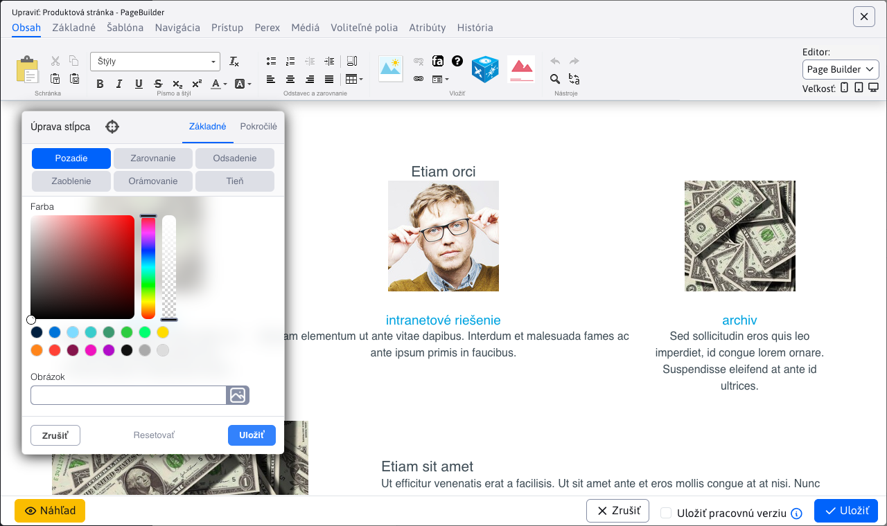

- Allowed to display pages containing `404.html` in the URL address from system folders so that such a technical page does not interfere with your standard web pages (#57657-8).
- Tags - split display of tags by currently selected domain, so you can have tags separately for each domain in WebJET (#57837).
- Structure cloning - added information about the configured translator and how many free characters remain for translation (#57881).
- Structure mirroring - added option to delete `sync_id` values ​​for selected folder (recursively). To easily cancel/reset page mirroring (#57881).


- Mirroring - added a new section [mirroring](redactor/webpages/mirroring/README.md) to track and manage linked folders and pages after mirroring actions (#57941).


- When selecting an image or video file in the page editor, only suitable file types are displayed in the explorer, the others are filtered (#57921).

### Templates

- Added a new section [News Templates](frontend/templates/news/README.md) for managing and administering news templates (#57937).

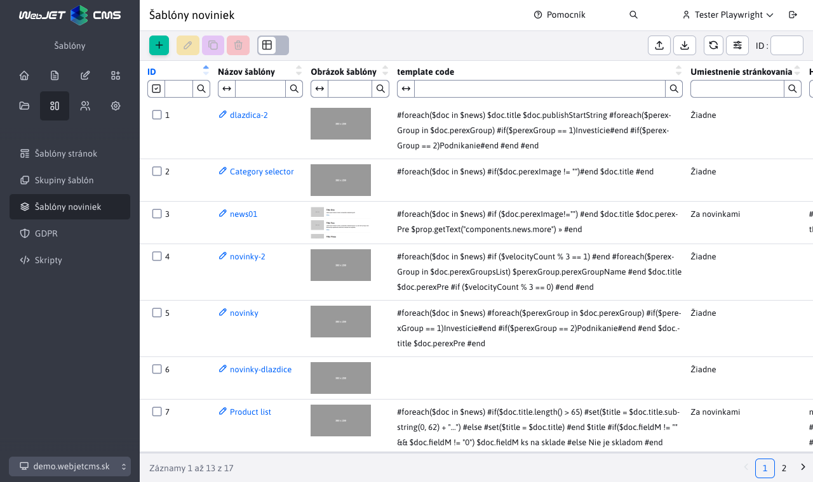

### User interface

- When using a small monitor (window height less than 760 points), the window will automatically be displayed to the entire screen and the header and footer will be reduced (the window title is in a smaller font). This will increase the amount of information displayed, which is especially necessary in the web page section. It is used for windows using the CSS class `modal-xl`, which are the current web pages, photo gallery, image editor and users (#57893).


- Added the option to click on the image icon at the beginning of the field in the editor to display it in a new tab.


### Applications

- Added option to display the application only to logged in/not logged in users. The mode is set in the [Application Display Settings] tab (redactor/webpages/working-in-editor/README.md#display-tab) in the page editor (#57893).


Redesigned application properties settings in the editor from the old code in `JSP` to `Spring` applications. Applications automatically also get the ability to set [display on devices](custom-apps/appstore/README.md#conditional-display-applications). The design is consistent with the rest of the WebJET CMS and data tables (#57409).

- [Carousel Slider](redactor/apps/carousel_slider/README.md)
- [Emoticons](redactor/apps/emoticon/README.md)
- [Forum/Discussion](redactor/apps/forum/README.md)
- [Questions and Answers](redactor/apps/qa/README.md)
- [Users](redactor/apps/user/README.md)
- [Impressive Slideshow](redactor/apps/app-impress_slideshow/README.md)
- [Restaurant Menu](redactor/apps/restaurant-menu/README.md)
- [Slider](redactor/apps/slider/README.md)
- [Slit slider](redactor/apps/app-slit_slider/README.md)
- [Social Icons](redactor/apps/app-social_icon/README.md)
- [Video] (redactor/apps/video/README.md)


### Menu

- If [website menu](redactor/apps/menu/README.md) does not have a root folder specified (the value is set to 0), the root folder for the currently displayed web page will be automatically used. This is useful if the menu is displayed in multiple language mutations where each is a root folder - you don't need to have separate menus/headers for each language, just one common one (#57893).

### Statistics

- In the [visitors] section (redactor/apps/stat/README.md#visitors) added the total number of Views, Visits and Number of different users for an easy overview of the total visitor traffic for the selected period (#57929).

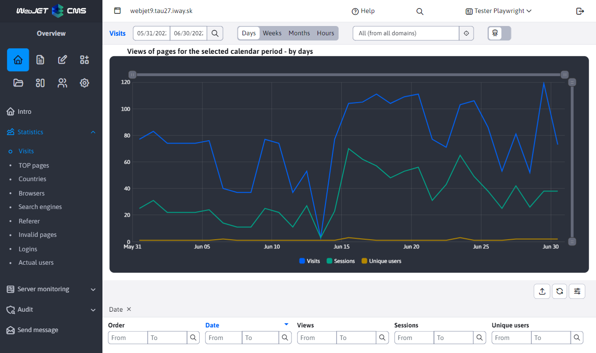

- In the [error pages] section (redactor/apps/stat/README.md#error-pages) added filtering by bots (applies only to newly recorded data) and a total count in the footer. You need to edit the page `404.jsp` in your project by adding the object `request` to the call to `StatDB.addError(statPath, referer, request);` (#58053).

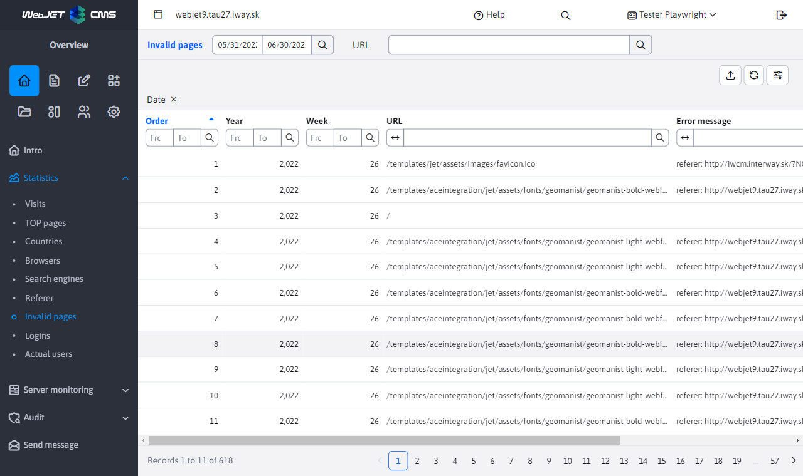

### Optional fields

- Added support for new types of [optional fields](frontend/webpages/customfields/README.md):
  - [Selecting a website folder](frontend/webpages/customfields/README.md#selecting-a-webpages-folder) (#57941).
  - [Website Selection](frontend/webpages/customfields/README.md#website-selection) (#57941).


### Safety

- Fixed a possible vulnerability in Safari when a special URL pointing to a file archive is combined with a nice 404 page (#57657-8).

### Other minor changes

- Change Audit - Search - Type field is sorted alphabetically (#58093).
- E-commerce - added option to set [root folder](redactor/apps/eshop/product-list/README.md) with product list using configuration variable `basketAdminGroupIds`, if automatic search by embedded application product list is not suitable (#58057).
- E-commerce - payment method setup application moved from the `/apps/eshop/admin/payment-methods/` folder to the standard `/apps/basket/admin/payment-methods/` (#58057).
- E-commerce - after deleting an order, its items and payments are also deleted from the database (#58070).
- Server monitoring - current values ​​- added database server type (MariaDB, Microsoft SQL, Oracle, PostgreSQL) (#58101).
- Compiler - the processing of returned error messages has been improved for the `DeepL` compiler, for more accurate problem identification (#57881).
- Compiler - added support for implementing multiple compilers and their automatic processing/use (#57881).
- Translator - added automatic [auditing of the number of consumed characters](admin/setup/translation.md) for each translation. The amount of credits consumed during the translation is written to the audit record of type `TRANSLATION` in the column `EntityID`. The number of available characters is also audited, the result is cached and updated again in 5 minutes (#57965).
- Explorer - optimized loading, fixed duplicate reading of library `jQuery UI` (#57997).

### Bug fixes

- Data tables - fixed setting options in the external filter selection menu (#57657-8).
- Structure cloning - fixed validation of entered folder ids and added error message output (#57941).
- Gallery - added support for selecting a gallery folder, in the Gallery application on the website, when using domain aliases and editing a gallery entry with a domain alias (#57657-11).
- Websites - fixed page list display when viewing folders as a table (#57657-12).
- Charts - fixed display of a large number of legends in charts, scrolling in legends is automatically used (#58093).

### Documentation

- Added documentation for setting up and using [two-step verification/authorization](redactor/admin/logon.md#two-step-verification) (#57889).

### For the programmer

- Removed class `ImportXLSForm`, which was used in imports from `XLS` format in [spec/import_xls.jsp](../../src/main/webapp/admin/spec/import_xls.jsp). Technically the class is not needed, just delete the reference in the JSP and modify the form to a standard HTML form (#57789).
- Improved update script `/admin/update/update-2023-18.jsp` for File Archive - can update standard changes and add necessary changes to your version `FileArchivatorBean` and helper classes (#57789).
- Class `org.apache.struts.action.ActionMessage` replaced by object `String`, class `ActionMessages` replaced by `List<String>` (#57789).
- Framework `Struts` removed, tags `<logic:present/iterate/...` replaced with corresponding `<iwcm:present/iterate/...`, beware `<bean:write` for `<iwcm:beanWrite`.
- The following changes have been made to the Java code due to the removal of `Struts`:
  - `ActionMessage` replaced by `String`
  - `ActionMessages` replaced by `List<String>`
  - `BasicLdapLogon.logon` returns `List<String>` instead of `ActionMessages`
  - `org.apache.struts.util.ResponseUtils.filter` replaced by `sk.iway.iwcm.tags.support.ResponseUtils.filter`
- Amcharts - added support for specifying a function to transform text in category labels for a chart of type `PIE` (#58093).
- Amcharts - added support for specifying a function to transform text in the chart legend of type `LINE` (#58093).
- Amcharts - added option to hide tooltip when value is `null` or `0` in chart type `LINE` (#58093).

You can use the `/admin/update/update-2023-18.jsp` script to convert both JSP and Java files. If you specify the path value `java`, the replacement will also be performed in the `../java/*.java` files. The problem is running the project if it contains errors. However, you can rename the `src/main/java` folder to `src/main/java-update` so that it can run pure WebJET. Then you can use the update script. It scans and updates the `../java/*.java` and `../java-update/*.java` folders.

In file `WEB-INF/web.xml`, initialization of `Apache Struts` is no longer needed, delete the entire `<servlet>` section containing `<servlet-class>org.apache.struts.action.ActionServlet</servlet-class>` and `<servlet-mapping>` containing `<servlet-name>action</servlet-name>`.

- Split tags by domains (if the configuration variable `enableStaticFilesExternalDir=true` is set), so that it is easy to have separate tags for each domain. When WebJET is started, it copies existing tags for all defined domains. It skips tags that are set to display only in a specific folder, where it sets the domain for the tag according to the first folder. It updates tags for News, i.e. for the application `/components/news/news-velocity.jsp` where it searches for the expression `perexGroup` and `perexGroupNot` and tries to update the tag IDs according to the domain of the given website. The information is written to the history and a record is created in the Audit with details of how `INCLUDE` was replaced, example:

```txt
UPDATE:
id: 76897

news-velocity.jsp - update perexGroups+perexGroupsNot for domainId, old code::
INCLUDE(/components/news/news-velocity.jsp, groupIds="24", alsoSubGroups="false", publishType="new", order="date", ascending="false", paging="false", pageSize="1", offset="0", perexNotRequired="false", loadData="false", checkDuplicity="true", contextClasses="", cacheMinutes="0", template="news.template.dlazdica-3", perexGroup="625", perexGroupNot="626")
new code:
INCLUDE(/components/news/news-velocity.jsp, groupIds="24", alsoSubGroups="false", publishType="new", order="date", ascending="false", paging="false", pageSize="1", offset="0", perexNotRequired="false", loadData="false", checkDuplicity="true", contextClasses="", cacheMinutes="0", template="news.template.dlazdica-3", perexGroup="", perexGroupNot="")

INCLUDE(/components/news/news-velocity.jsp, groupIds="24", alsoSubGroups="false", publishType="new", order="date", ascending="false", paging="false", pageSize="1", offset="0", perexNotRequired="false", loadData="false", checkDuplicity="true", contextClasses="", cacheMinutes="0", template="news.template.dlazdica-3", perexGroup="3+645", perexGroupNot="794")
new code:
INCLUDE(/components/news/news-velocity.jsp, groupIds="24", alsoSubGroups="false", publishType="new", order="date", ascending="false", paging="false", pageSize="1", offset="0", perexNotRequired="false", loadData="false", checkDuplicity="true", contextClasses="", cacheMinutes="0", template="news.template.dlazdica-3", perexGroup="1438+1439", perexGroupNot="1440")
```

For the first `INCLUDE`, tags with IDs 625 and 626 were removed, because they are not displayed in the given folder/domain - they were set to be displayed only for a certain folder. In the second `INCLUDE`, tags `3+645` were changed to the newly created `1438+1439` and `794` to `1440`.

| perex_group_id | perex_group_name      | domain_id | available_groups |
|----------------|-----------------------|-----------|------------------|
| 3              | another perex group  | 1         | NULL             |
| 645            | deletedPerexGroup     | 1         | NULL             |
| 794            | event-calendar     | 1         | NULL             |
| 1438           | another perex group  | 83        | NULL             |
| 1439           | deletedPerexGroup     | 83        | NULL             |
| 1440           | event-calendar     | 83        | NULL             |

Before the update was run, only `3, 645 a 794` records existed in the database, which set `domain_id=1`. The `1438, 1439 a 1440` records were created during the update for `domain_id=83`.

- Data tables - added support for editing [local JSON data](developer/datatables-editor/field-datatable.md#local-json-data) (#57409).
- Data tables - added [Row Reorder](https://datatables.net/extensions/rowreorder/) extension to allow list ordering using the `Drag&Drop` function (#57409).
- Datatables - Added option to set [Footnotes for sum of values](developer/datatables/README.md#footnotes-for-sum-of-values) (#57929).
- Applications - added the ability to use local JSON data to set application items, for example items for [impress slideshow](redactor/apps/app-impress_slideshow/README.md) (#57409).

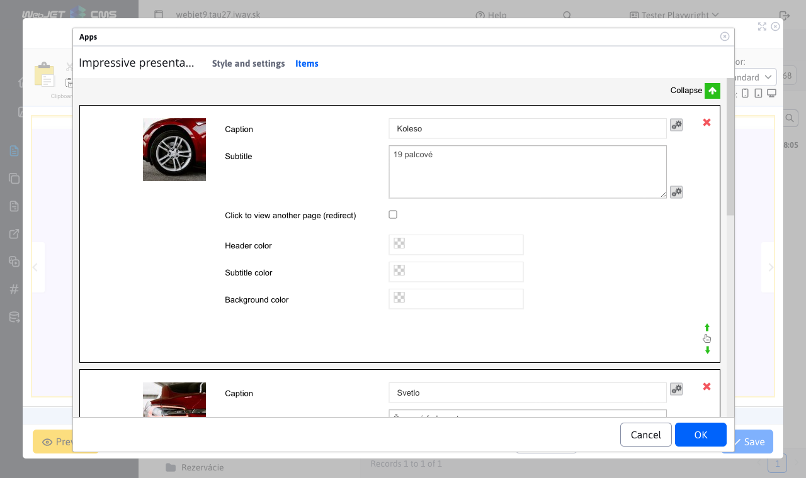

## 2025.18

> Version **2025.18** brings a completely redesigned **E-commerce** module with support for **GoPay payment gateway** and an improved order list. The **News Calendar** application has been separated as a **standalone application** and we have also redesigned the settings of several applications in the page editor to a new design. The **Document Manager** (originally File Archive) has undergone a **visual and functional reboot**, including new tools for managing, exporting and importing documents.
>
> The **Bulk Email** system has also been improved with new options for the sender and more convenient selection of recipients. **Reservations** have gained new options such as **overbooking**, creating reservations retroactively, and sending notifications to specific emails for each reservation object.
>
> We've optimized the number of files in **Explorer**, leading to **faster loading**, and added new information to **Server Monitoring**.

### Groundbreaking changes

- News Calendar application separated into a separate application, if you use the news calendar you need to edit the path `/components/calendar/news_calendar.jsp` to `/components/news-calendar/news_calendar.jsp` (#57409).
- Modified Spring and JPA initialization, more information in the programmer section (#43144).
- Redesigned backend part of the e-commerce application, more in the programmer section (#57685).

### Data tables

- When setting a numeric value filter from-to, the field will be enlarged to better display the entered value, similar to what a date field does (#57685).
- The File Archive application has been converted to a Spring application. For more information, see the developer section (#57317).
- The E-commerce application has been reworked in part. For more information, see the developer section (#56609).

### Document Manager (File Archive)

- **File list** redesigned with new logic compared to the old version. Read more in the [File archive](redactor/files/file-archive/README.md) (#57317).


- **Category Manager** fixed and redesigned. Read more in the [Category Manager](redactor/files/file-archive/category-manager.md) (#57317).
- **Product Manager** has been added as a new section. Read more in the [Product Manager](redactor/files/file-archive/product-manager.md) section (#57317).
- **Main file export** has been modified to offer broader file export options and improve the clarity of the listings. For more information, see [Main file export](redactor/files/file-archive/export-files.md) (#57317).

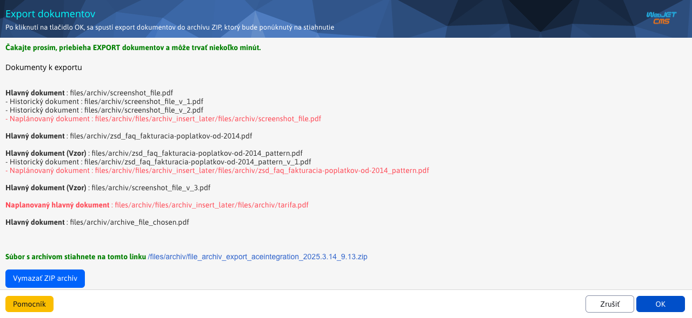

- **Import of main files** has been fixed and modified to work with advanced export options. For more information, see [Import of main files](redactor/files/file-archive/import-files.md) (#57317).
- **Indexing** documents in search engines of type `Google` has been modified to not index old/historical versions of documents and documents outside the validity date (HTTP header `X-Robots-Tag=noindex, nofollow` set). Indexing of these documents can be enabled in the editor in the document manager (#57805).

### Applications

Redesigned application properties settings in the editor from the old code in `JSP` to `Spring` applications. Applications automatically also get the ability to set [display on devices](custom-apps/appstore/README.md#conditional-display-applications). The design is consistent with the rest of the WebJET CMS and data tables (#57409).

- [Survey](redactor/apps/inquiry/README.md)
- [Banner system](redactor/apps/banner/README.md)
- [Date and time, Date and name days](redactor/apps/app-date/README.md) - merged into one common application
- [Questionnaires](redactor/apps/quiz/README.md)
- [Bulk email](redactor/apps/dmail/form/README.md)
- [Event Calendar](redactor/apps/calendar/README.md)
- [News Calendar](redactor/apps/news-calendar/README.md)
- [Sitemap](redactor/apps/sitemap/README.md)
- [Media] (redactor/webpages/media.md)
- [Related pages](redactor/apps/related-pages/README.md)
- [Rating] (redactor/apps/rating/README.md)
- [Reservations](redactor/apps/reservation/reservation-app/README.md)

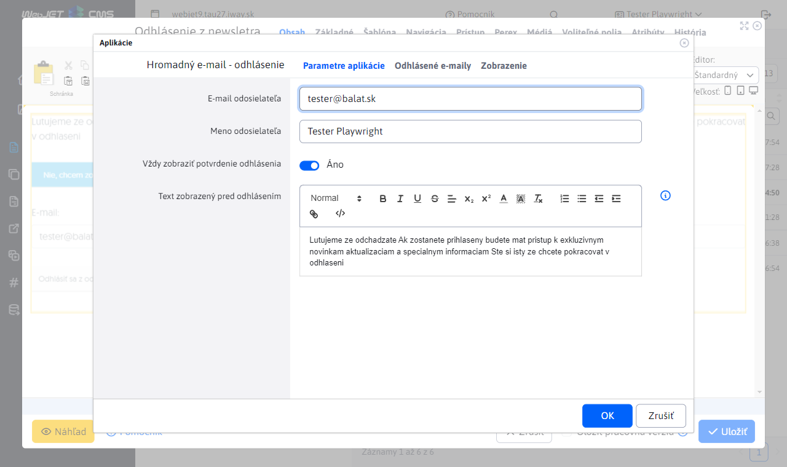

- Accelerated loading of application data in the editor - data is inserted directly from the server, no need to make a REST service call (#57673).
- Modified visual - the application name when inserting into a page has been moved to the main window (instead of the original Applications title) to increase the size of the application settings area (#57673).

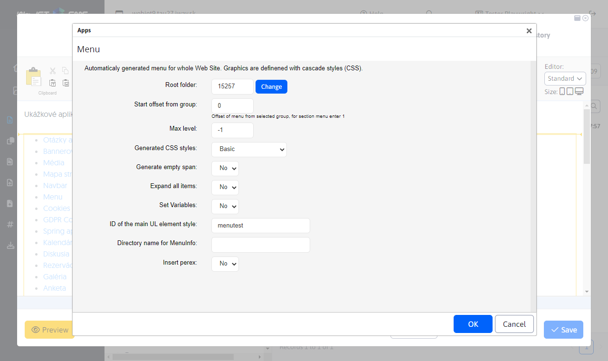

- Added screenshots of applications in the Czech language version for most applications (#57785).

### Bulk email

- **Moved Web Page field** – now located before the **Subject** field so that after selecting a page, the subject is automatically filled in based on the name of the selected web page (#57541).
- **Adjust order in Groups tab** - email groups are now displayed before user groups (#57541).
- **New options for sender name and email** - if the `dmailDefaultSenderName` and `dmailDefaultSenderEmail` configuration variables are set, these values ​​will be used. If empty, the system will automatically fill in the name and email of the currently logged in user. (#57541)
  - Using these variables, it is possible to set **fixed values** (e.g. company name) for all [campaigns](redactor/apps/dmail/campaings/README.md), regardless of who is logged in.

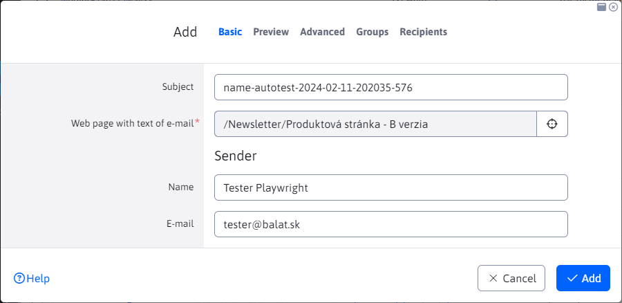

- Bulk email - optimization of recipient list creation - [groups] tab (redactor/apps/dmail/campaings/README.md#add-from-groups) moved to dialog box. After selecting a recipient group, you can immediately see them in the Recipients tab and easily edit them, it is no longer necessary to save the email first to view recipients (#57537).


- Unsubscribe - when you directly enter an email to unsubscribe (not click on the link in the email), a confirmation email is sent to the entered email address. In it, you need to click on the link to unsubscribe. The original version did not check the validity/ownership of the email address in any way and it was also possible to unsubscribe from someone else's email (#57665).

### News calendar

- News calendar separated as a separate application, originally it was an option in the Calendar application (#57409).
- Displays a calendar linked to the news list with the option to filter news by a selected date in the calendar.


### Server monitoring

- Added table with information about database connections and occupied memory (#54273-61).
- Added information about the `Spring (Core, Data, Security)` library version to the Server Monitoring-Current Values ​​section (#57793).

### Reservations

- **Overbooking Support** – allows administrators to create multiple `overbooking` reservations for the same date (#57405).
- **Improved validation during import** – it is now possible to import [reservations](redactor/apps/reservation/reservations/README.md) into the past, or create `overbooking` reservations when importing data (#57405).
- **Support for adding reservations to the past** – allows administrators to create reservations in the past (#57389).
- A column **Emails for notifications** has been added to [reservation objects](redactor/apps/reservation/reservation-objects/README.md), which for each valid email entered (separated by a comma) will send an email if the reservation has been added and approved (#57389).
- For reservation confirmation notifications and other system notifications, it is possible to set the sender's name and email using the configuration variables `reservationDefaultSenderName,reservationDefaultSenderEmail` (#57389).
- Added new application [Day Reservation](redactor/apps/reservation/day-book-app/README.md), for booking all-day objects for a certain interval using the integrated calendar (#57389).


### Gallery

- Added support for **changing the folder** of an image, which allows you to [move the image](redactor/apps/gallery/README.md#) when editing or duplicating to another folder. This is especially useful when duplicating, when you can immediately set a new folder where you want to duplicate the image. If you specify the folder manually and it does not exist, it will be automatically created and its properties will be set according to the nearest existing parent folder (#57885).

### E-commerce

!> **Warning:** Due to database updates, the first server start may take longer - values ​​for the number of items and price are calculated into the database for faster loading of the order list.

- Added **Personal Information** tab to the order list - contains detailed information about **delivery address** as well as **contact information** all in one place (#57685).
- Added **Optional Fields** tab to the order list - [optional fields](frontend/webpages/customfields/README.md) as needed for implementation (#57685).
- Export of order list - added columns total price including VAT and number of items (#57685).
- Order form - added option to define available list of countries via configuration variable `basketInvoiceSupportedCountries` (#57685).
- Modified display of data from the **Personal data** tab in the order list, logically dividing it into sections for better overview (#57685).
- The columns **Number of items**, **Price excluding VAT** and **Price including VAT** have been added to the order list. The values ​​are automatically recalculated when changing order items (#57685).
- Added the option to view the product's website by clicking on the icon to the item list, the product will also be displayed in the Preview tab when opening the item editor (#57685).
- In the order list, the country selection via the selection field has been redesigned, which only offers countries defined by the constant `basketInvoiceSupportedCountries` (#57685).


- New version of [payment method configuration](redactor/apps/eshop/payment-methods/README.md) and integration with payment gateways. Data is separated by domain. We have added support for [GoPay payment gateway](https://www.gopay.com), which also means acceptance of payment cards, support for `Apple/Google Pay`, payments via internet banking, `PayPal`, `Premium SMS` etc. In addition, payments by transfer and cash on delivery are supported. For each payment type, it is also possible to set a price, which will be automatically added to the order when the option is selected. The set payment methods will also be automatically reflected in the options when the customer creates an order.

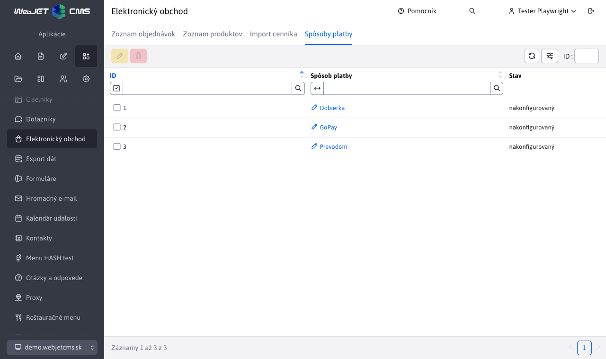

- New Order List application with a list of orders of the currently logged in user. By clicking on an order, you can view the order details and download it in PDF format (#56609).

### Other minor changes

- Search in administration - modified interface to custom `RestController` and `Service` (#57561).
- Explorer - faster loading and lower server load by reducing the number of files/requests to the server (#56953).
- `dt-tree-dir-simple` - ​​added support for [hiding parent folders](developer/datatables-editor/field-json.md#classname-options) in the displayed tree structure with the `data-dt-field-hideRootParents` attribute (#57885).

### Bug fixes

- Mass email - when duplicating a campaign, duplication of the recipient list has been added (#57533).
- Data tables - import - modified logic **Skip bad records** during import so that this option also handles generic errors `Runtime` and ensures that the import completes without interruption. These errors are then displayed to the user via a notification during the import (#57405).
- Files - fixed calculation of file/folder sizes in the explorer footer and when viewing folder details (#57669).
- Navigation - fixed tabbed navigation in mobile view (#57673).
- Autocomplete - fixed bug with field type `Autocomplete`, where the first value obtained in case of `jstree` was not correct (#57317).

### For the programmer

!> **Warning:** Spring and JPA initialization modified, follow [instructions in the installation section](install/versions.md#changes-when-upgrading-to-20250-snapshot).

Other changes:

- Added the ability to execute [additional HTML/JavaScript code](custom-apps/appstore/README.md#additional-html-code) in a Spring application with the `@WebjetAppStore` annotation by setting the `customHtml = "/apps/calendar/admin/editor-component.html"` attribute (#57409).
- Added field type [IMAGE_RADIO](developer/datatables-editor/standard-fields.md#image_radio) in datatable editor for selecting one of the options using an image (#57409).
- Added field type `UPLOAD` for [file upload](developer/datatables-editor/field-file-upload.md) in the datatable editor (#57317).
- When initializing a [nested datatable](developer/datatables-editor/field-datatable.md) added the ability to edit the `columns` object by specifying a JavaScript function in the `data-dt-field-dt-columns-customize` attribute of the annotation (#57317).
- Added support for getting the sender's name and email for various email notifications using `SendMail.getDefaultSenderName(String module, String fallbackName), getDefaultSenderEmail(String module, String fallbackEmail)` (#57389).
- Added the ability to set the root folder for [JSON type field](developer/datatables-editor/field-json.md) in both ID and path format: `@DataTableColumnEditorAttr(key = "data-dt-field-root", value = "/Aplikácie/Atribúty stránky")` or `@DataTableColumnEditorAttr(key = "data-dt-field-root", value = "26")`.
- Background tasks will only be started after complete initialization including `Spring` (#43144).
- Added option to set [all HikariCP properties](install/setup/README.md#creating-db-schema) (#54273-61).
- Added check whether the database driver supports setting sequences (#54273-61).
- Modified function `WJ.headerTabs`, if you are listening for a card change, we recommend using an event of type `$('#pills-tabsFilter a[data-wj-toggle="tab"]').on('click', function (e) {`, where in `e` you will get the card that was clicked (#56845-20250325).
- Redesigned Document Manager (File Archive) application to Spring application. If you are using the original version and want to keep it, you need to add back the `/components/file_archiv/file_archiv.jsp` and `components/file_archiv/editor_component.jsp` files and the necessary classes from [older version of WebJET CMS](https://github.com/webjetcms/webjetcms/tree/release/2025.0/src/main/java/sk/iway/iwcm/components/file_archiv).
- Document Manager (File Archive) - modified API `FileArchivatorBean.getId()/getReferenceId()/saveAndReturnId()` returns `Long`, you can use `getFileArchiveId()` to return `int` value. Deleted unused methods, if needed, transfer them to your classes. We do not recommend modifying WebJET classes, create new classes of type `FileArchivatorProjectDB` in your project where you will add the methods. If we deleted the entire class that you are using (e.g. `FileArchivatorAction`), you can directly add it to your project (#57317).
- Added automatic setting of column filtering to the value `false`, in case the value is `null` (not set) and it is a column that is nested, such as `editorFields` columns (#57685).
- Added [special ordering](developer/datatables/restcontroller.md#ordering) option by overriding the `DatatableRestControllerV2.addSpecSort(Map<String, String> params, Pageable pageable)` method (#57685).
- Added option in annotation `@DataTableColumn` to set attribute `orderProperty` which specifies [columns for arrangement](developer/datatables/restcontroller.md#arrangement), e.g. `orderProperty = "contactLastName,deliverySurName"`. Useful for `EditorFields` classes that can aggregate data from multiple columns (#57685).
- For a field of type `dt-tree-dir-simple` with `data-dt-field-root` set, the tree structure of parent folders has been supplemented for better [display of the tree structure](developer/datatables-editor/field-json.md) (previously, folders were displayed starting from the specified root folder). Added the ability to define a list of folders that will not be displayed in the tree structure using a configuration variable set to `data-dt-field-skipFolders`.
- [Editable field](developer/datatables-editor/field-select-editable.md) modified so that after adding a new record, this record is automatically selected in the field (#57757).
- Redesigned the E-commerce application to the `BE` part. Since new classes are already used, for proper functioning you must:
  - use the update script `/admin/update/update-2023-18.jsp` for a basic update of your JSP files
  - since the type `BigDecimnal` is now used instead of `float`, you also need to adjust all comparisons of these values. The type `BigDecimal` is not compared classically with `<, =, >` but with `BigDecimal.compareTo( BigDecimal )`
  - you must remove file calls, or add back all files that were removed because they were not used

### Testing

- Media - added test for inserting media in a web page if the user does not have rights to all media (#57625).
- Websites - added test for creating a new website with future publishing (#57625).
- Gallery - added watermark test with image comparison, added rights check test (#57625).
- Websites - added test for optional fields when creating a website (#57625).
- Allure - added jUnit test results to the common Allure report (#57801).

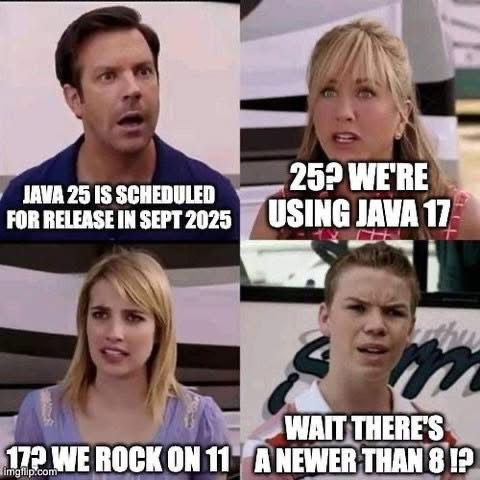

## 2025.0.52

> A patch version of the original version 2025.0.

- Security - prohibited redirection to external URLs after logging in via the login form.
- Data tables - fixed error in displaying selection fields when enabling Edit mode in grid view (#57657-16).
- Data tables - fixed saving a new record via the keyboard shortcut `CTRL+S` - ​​after saving, the returned values ​​are set back to the editor to correctly set the record ID for further editing (#57657-16).
- Forms - modified field name generation so that it does not contain a dot (#57657-16).
- Mass email - modified buttons for starting/stopping mass email sending to better understandable `play` and `stop` (#54273-81).
- Mass email - fixed saving in Oracle database, subject field set as mandatory (#54273-81).
- Mass email - Domain limits - fixed loading of limits for domains from the database (#54273-81).
- Mass email - fixed setting user ID when adding a group if there are multiple users with the same email (#58217).
- Spam protection - fixed bug in checking the time interval between form/search submissions (#57657-16).
- Websites - fixed tree structure arrangement when moving items over `Drag&Drop` in case of descending arrangement setting (#MF-1199).
- Websites - fixed folder search in Trash tab (#58081).
- Websites - fixed sending notification about page approval/disapproval if there is no approver with notification, added list of changes in various website fields (#58007).

## 2025.0.50

> A patch version of the original version 2025.0.

- Security - fixed login option if password contains diacritics.
- Security - fixed a possible vulnerability in page synchronization (#55193-7).
- Security - added the ability to configure blocked file/directory paths via the `pathFilterBlockedPaths` variable. By default, URLs that contain the term `.DS_Store,debug.,config.properties,Thumbs.db,.git,.svn,/WEB-INF/,./` in the name are blocked. It is possible to add more as needed (#PR103).
- Banner system - fixed YouTube video banner display (#55193-7).
- Data tables - fixed display of advanced export options (#58113).
- Event Calendar - fixed saving of the description field where saving HTML code was not allowed (#58113).
- News - fixed exclusion of main pages for specified root folder (#57657-15).
- Websites - PageBuilder - fixed user interface language to the language of the logged in user (not the language of the website) (#58133).
- Websites - modified option to insert HTML code into folder and website names. Inserting safe HTML code (`AllowSafeHtmlAttributeConverter`) into website names without editing is allowed, it works in the navigation bar, news, etc. For the `${ninja.page.seoTitle}` call, a value with removed HTML code is returned, since it is assumed to be inserted into the `title` tag. If you need to get the title with HTML code as well, you can use the `${ninja.page.seoTitleHtml}` call. For folders, the `/` character is replaced with the `&#47;` entity, since the `/` character is used to separate individual folders (#54273-75).
- Websites - fixed display of PageBuilder mode set directly in the page template (#57657-15).
- PDF - fixed duplication of absolute path to `fonts` font folder when specified URL in variable `pdfBaseUrl` (#58185).
- Oracle/Microsoft SQL - fixed SQL errors and data types in basic tests/tables, used clean databases with [basic data](developer/testing/README.md#delete-databases) (#58185).

## 2025.0.40

> A patch version of the original version 2025.0.

!> **Warning:** possible change in behavior of fields of type `quill` for bulleted list in data tables (#54273-72).

- PDF - fixed setting of path to `fonts` font folder. Full path on server disk must be specified (#57657).
- Updated library `Apache Commons BeanUtils` to version 1.11.0.
- Initialization - added check for the existence of the file `autoupdate.xml` to prevent an error when starting WebJET on public cluster nodes (#54273-68).
- Security - added checking of the expression `onwebkit` in URL parameters to prevent XSS attacks (#54273-68).
- Field type `QUILL` (small HTML editor used in Banners, Gallery...) - fixed duplication of `P` element if it contains a CSS class or other attribute (#54273-69).
- Security - in the annotation `@AllowSafeHtmlAttributeConverter` allowed insertion of attributes `alt,title` for `img` and `class` for elements `a,img,div,span,p,h1,h2,h3,h4,h5,h6,i,b,strong,em` (#54273-69).
- Security - updated library `hibernate-validator` to version `6.2.5.Final` (#54273-69).
- Security - fixed a possible vulnerability in AB testing.
- Security - fixed unnecessary reading of `dataAsc` in JSON object `DocBasic`.
- Security - reduced the amount of text when logging the `Session has already been invalidated` error when the web server is overwhelmed/attacked (#BVSSLA-34).
- Administration - added the ability to insert [additional CSS/JavaScript](custom-apps/apps/customize-admin.md) file into the administration section, e.g. for custom CSS styles for [Quill type fields](developer/datatables-editor/standard-fields.md#quill) (#54273-69).
- Data tables - for Oracle and Microsoft SQL, the ability to sort by columns containing long text is disabled (`ntext/clob`) - these database systems do not support sorting when using this data type. The attribute must have the annotation `Entite`, which disables the sorting option for the given column for the listed databases. For MariaDB and PostgreSQL, sorting is still supported (#54273-70).
- Data tables - fixed searching if you select the "Starts with" option in one field and "Ends with" in another field, for example (#54273-70).
- Data tables / administration search - special characters (e.g. quotes) allowed for searching in data tables (#54273-70).
- Forms - hidden unnecessary button to create a new record in the list of completed forms (#54273-70).
- Easy form - fixed setting of required fields in form items (#57657-12).
- Websites - added the ability to insert HTML code into folder names such as `WebJET<sup>TM</sup>` - ​​in the list of websites, the HTML code will not be executed for security reasons, but in applications such as the Menu and navigation bar, the HTML code will be displayed correctly and executed. An important condition is that the code contains the closing tag `</...>`. The HTML code is also removed from the automatically generated URL address. Only safe HTML code allowed in the class `AllowSafeHtmlAttributeConverter` (#54273-70) is allowed.
- Websites - fixed displaying the media tab for old users who did not have the right to manage media (#57657-10).
- Data tables - for fields of type small HTML editor (`quill`) **modified behavior for bulleted list** (HTML tag `ul`). The original editor set the `data-list="bullet"` attribute on the `li` element for this case and could not directly use the `ul` element instead of the `ol` element. The new behavior uses the correct HTML tag `ul` and removes the unnecessary attribute `data-list="bullet"` (#54273-72).
- Gallery - fixed displaying perex groups if there are more than 30 in the gallery and image editor - displayed as a selection field. Fixed loading and saving groups in the image editor (#57657-9).
- Explorer - fixed uploading of entire folder with subfolders to `/images/gallery` via Explorer - correct creation of `o_` and `s_` images (#57657-11).
- Gallery - fixed display of the share icon in the gallery of type `PrettyPhoto` (#57657-11).
- Gallery - fixed display of folder list when using domain aliases (displaying only folders from the currently selected domain) (#57657-11).
- Gallery - fixed watermark retrieval for galleries using domain alias (#57657-11).
- File upload - modified processing of files uploaded via `/XhrFileUpload`. The modified version will allow restarting the server and then processing the file correctly after restoring `session`. Added warning display if the file is of an unauthorized type (#PR75).
- Gallery - removed URL address setting when displaying photos in the gallery type `PrettyPhoto` for easier use of the browser's back button (#57657-12).
- News - fixed setting for displaying main pages from folders (#57657-12).
- PDF - fixed user logout error when generating PDF if PDF contains images inserted via `/thumb` prefix (#57657-13).

## 2025.0.23

> A patch version of the original version 2025.0.

### Bug fixes

- Data tables - fixed incorrect display of cards that should not be displayed when creating a new record (e.g. in templates) (#57533).
- Data tables - added limit on the number of records when displaying all. The value is the same as the maximum number of rows for export, set in the configuration variable `datatablesExportMaxRows` (#57657-2).
- Data tables - fixed number of records per page when page contains navigation tabs (#57725-1).
- Data tables - fixed title Duplicate instead of Edit when duplicating a record, modified icon of the duplicate button (#57725-3).
- Data tables - unified name of `ID` column from original `ID, Id, id` to unified `ID`. For `DataTableColumnType.ID` it is not necessary to set `title` attribute, key `datatables.id.js` will be used automatically. Some translation keys deleted as they are not needed (#49144)
- Image editor - when editing an image from a remote server, a notification about the need to download the image to the local server has been added (#57657-2).
- Web pages - fixed insertion of a block containing an application (#57657-2).
- Web pages - added `ninja` object when inserting an application into a new web page (#57389).
- Web pages - pages in the trash will no longer appear in the Unapproved tab, if the approver clicks on the link in the email, the error Page is in the trash will be displayed, to avoid accidentally approving a page that has been deleted in the meantime (#54273-62).
- Web pages - approval - fixed loading of the list in the Unapproved tab when using the `Oracle` database server (#54273-62).
- Websites - fixed cluster node update when changing tags (#57717).
- Web pages - fixed display of page list if user has rights only to selected web pages (#57725-4).
- Web pages - added domain switcher even if the configuration variable `enableStaticFilesExternalDir` is not set but only `multiDomainEnabled` (#57833).
- Applications - fixed display of translation keys tab when using the `editor_component_universal.jsp` component (#54273-57).
- Applications - added support for inserting a new line via the keyboard shortcut `SHIFT+ENTER` to the simple text editor used e.g. in Questions and Answers (#57725-1).
- Dialpads - moved dialpad selection directly to the data table toolbar (#49144).
- News - moved section selection directly to the data table toolbar (#49144).
- Login - fixed login error when password expires (#54273-57).
- Login - fixed login in multiweb installation (#54273-57).
- GDPR - fixed display of the Database Cleanup tab when using the `Oracle/PostgreSQL` database (#54273-57).
- File archive - fixed display of icons in date and time dialog (#54273-57).
- Security - updated library `Swagger UI` to version `5.20.0`, added exceptions in `dependency-check-suppressions.xml`.
- Update - added deletion of unnecessary files when updating the unpacked version (#57657-4).
- Multiweb - added check for `ID` domain when registering a website visitor (#57657-4).
- Users - added option to also select Root folder in user rights in the Upload files to directories section (54273-60).
- Users - modified rights settings - simplified rights settings for administrators and registered users (it is no longer necessary to select the Users right), corrected duplicate items, modified grouping in the Templates section (#57725-4).
- Explorer - added better reporting when creating a ZIP archive (#56058).
- Statistics - fixed creation of table for click statistics in heatmap.
- Compiler - implementation of intelligent delay for the `DeepL` compiler as protection against the `HTTP 429: too many requests` bug that caused translations to fail (#57833).
- Structure cloning - fixed unwanted translation of application implementation `!INCLUDE(...)!`, when automatically translating the page body (#57833).
- Structure cloning - added translation of perex annotations to automatic page translation (#57833).
- Explorer - fixed folder and file properties setting rights (#57833).
- Server Monitoring - fixed message about setting configuration variable for Applications, WEB pages and SQL queries (#57833).
- Introduction - fixed display of two-step verification requirement when integrating via `IIS` (#57833).
- Cloning/mirroring structure - fixed setting of folder URL (removal of diacritics and spaces) (#57657-7).
- Gallery - added missing tags (#57837).
- Tags - fixed folder setting of existing tag in Show for section (#57837).

### Safety

- Updated library `Apache POI` to version 5.4.1 to fix vulnerabilities `CVE-2025-31672`.

## 2025.0

> In version **2025.0** we have introduced a **new administration design** for even better clarity and user comfort.
>
> One of the main changes is moving the **second level menu** to **tabs in the page header**, making navigation easier. We've also **merged folder and website tabs** on websites to keep everything in one place. If the header doesn't have tabs, tables will automatically adjust to display an **extra row**.
>
> Please provide feedback via the **Feedback form** if you identify **any display issues** while using the new version. You can also include a **screenshot** with your comment, which will help us identify and resolve any issues more quickly.
>
> Thank you for your cooperation and help in improving WebJET CMS!

### Groundbreaking changes

- Web pages - inline editing removed. The ability to directly edit a page in view mode has been removed, as it used an older version of the editor, which is no longer supported. As an alternative, you can activate the [toolbar](redactor/webpages/editor/README.md#toolbar) displayed in the upper right corner of the web page. This panel allows quick access to the web page, folder or template editor. You can disable or enable it using the configuration variable `disableWebJETToolbar`. After activation, it will start to appear on the web page after entering the Web pages section in the administration (#57629).


- Login - [requirement for password change](sysadmin/pentests/README.md#password-rules) set for administrators once a year. The value can be adjusted in the configuration variable `passwordAdminExpiryDays`, setting it to 0 disables the check (#57629).
- Introduction - added a requirement to enable two-factor authentication to increase the security of login data. The prompt is not displayed if authentication is handled via `LDAP` or if the translation key `overview.2fa.warning` is set to an empty value (#57629).

### Design

In version **2025.0** we have introduced an improved **administration design** that is clearer and more efficient.

**Modified login dialog** – new background and moving the login dialog to the right side. **For login**, you can use not only your username but also **your email address**.


**Clearer header** – the name of the current page or section is now displayed directly in the header.

**New navigation in the left menu** - sub-items are no longer part of the left menu, but appear **as tabs at the top** of the page.


**Merged tabs in the Websites section** – switching between folder types and website types is now displayed in a common section, making navigation easier. **Domain selection** has been moved to the bottom of the left menu.
  

**Reorganized menu items**:

- **SEO** moved to the **Reports** section.
- **GDPR and Scripts** moved to the **Templates** section.
- **Gallery** is now in the **Files** section.
- Some item names have been adjusted to better reflect their function.

### Website

- Added the ability to set the sort order increment for folders in the `sortPriorityIncrementGroup` configuration variable and web pages in the `sortPriorityIncrementDoc` configuration variable. Default values ​​are 10 (#57667-0).

### Testing

- The default password for `e2e` tests is obtained from the `ENV` variable `CODECEPT_DEFAULT_PASSWORD` (#57629).

### Bug fixes

- Websites - inserting file links in PageBuilder (#57649).
- Websites - added link information (file type, size) to the Auxiliary caption attribute `alt` (#57649).
- Websites - fixed setting of website sorting order when using `Drag&Drop` in the tree structure (#57657-1).
- Web pages - when duplicating a web page/folder, the value `-1` is set in the Sort order field to be placed at the bottom of the list. You can also enter the value `-1` manually to get a new sort order value (#57657-1).
- Websites - import websites - fixed media group settings when importing pages containing media. All media groups (even unused ones) are automatically created during import because the media group set for the media application `/components/media/media.jsp` in the page is also translated when importing pages (it may also contain the media group ID outside the imported pages) (#57657-1).
- Firefox - downgraded `Tabler Icons` to `3.0.1`, as Firefox is significantly more CPU intensive when using newer versions. Optimized CSS reading of `vendor-inline.style.css` (#56393-19).

The remaining changelog is consistent with version [2024.52](CHANGELOG-2024.md).


