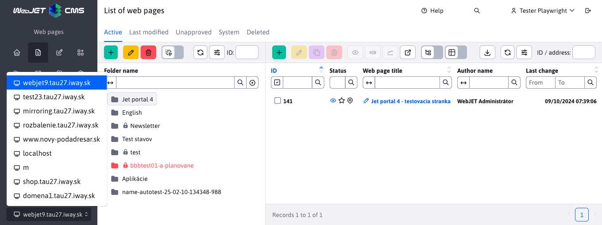

# Changelog version 2025

## 2025.40

> **WebJET CMS 2025.40** brings an integrated **AI Assistant** which makes working with content much easier. Allows you to automatically **correct grammar**, **translate** texts, design headlines, summarize articles and generate **illustrative pictures** directly in the editor. This makes content creation **faster, more accurate and more creative** than ever before.
>
> Significant changes also concern **brands** a **news templates** that have been reworked into **separate database tables** with support for separation by domain. This brings higher **clarity, easier administration** and the ability to efficiently customize content for multiple sites. The user environment was **optimised for smaller screens** - the system automatically adjusts the window display and maximises usable space.
>
> On a technical level, the obsolete Struts Framework has been removed. This makes WebJET CMS more powerful, more stable, **Safer** and ready for further development of modern web solutions.

### Groundbreaking changes

- Removed from `Struts Framework`, you need to make an update `JSP` files, Java classes and edit file `web.xml`, more in [section for the programmer](#for-the-programmer) (#57789).
- If you are using Tomcat application server version 9.0.104 and above, you need to [update settings](install/versions.md#changes-when-switching-to-tomcat-90104) parameter `maxPartCount` at `<Connector` element (#54273-70).
- Tags - split by domains - at startup, a copy of tags for each domain is created (if splitting data by domains is used - configuration variable set `enableStaticFilesExternalDir=true`). Tag IDs for the website and gallery are being updated. You need to manually check the tag IDs for all news apps and other apps that contain tag IDs - the update will try to fix them, but we recommend checking the IDs. See the section for the programmer for more information. (#57837).
- News - [news templates](frontend/templates/news/README.md) converted from a definition via translation keys to a custom database table. When WebJET starts, the records are converted from the original format. They are separated by domain, if they contain a domain alias they are created only in the corresponding domain (#57937).
- Security - stricter control of administration URLs - it is necessary that the URL in the administration has a character at the end `/`, the incorrect address is `/admin/v9/webpages/web-pages-list` or `/apps/quiz/admin`, correct `/admin/v9/webpages/web-pages-list/` or `/apps/quiz/admin/`. It is necessary for the programmer to check the URL definitions in the files `modinfo.properties` (#57793).

### AI Assistant

In today's world, artificial intelligence is all around us and of course, WebJET as a modern content management system does not want to be left behind. That's why we are proud to present the new version of WebJET CMS, where we have integrated [advanced AI tools](redactor/ai/README.md).


These features make it easy to create and edit content - from correcting grammar, to translating text, to designing captions, to generating illustrative images.

<div class="video-container">
  <iframe width="560" height="315" src="https://www.youtube.com/embed/LhXo7zx7bEc" title="YouTube video player" frameborder="0" allow="accelerometer; autoplay; clipboard-write; encrypted-media; gyroscope; picture-in-picture" allowfullscreen></iframe>
</div>

### Web pages

- AB Testing - added option [show AB version](redactor/apps/abtesting/README.md) according to the status of the logged-in user - the non-logged-in user will see the A version and the logged-in user will see the B version. You activate the mode by setting the configuration variable `ABTestingForLoggedUser` to the value of `true` (#57893).
- [Page Builder](redactor/webpages/pagebuilder.md) - modified visual to better fit the current WebJET CMS design (#57893).


- Allowed to display pages containing `404.html` in the URL from the system folders, so that such a technical page does not get in the way of your standard web pages (#57657-8).
- Tags - split tag display by the currently selected domain, so you can have tags separately for each domain in WebJET (#57837).
- Cloning structure - added information about the configured translator and how many free characters are left for translation (#57881).
- Structure mirroring - option to delete added `sync_id` values for the selected folder (recursive). Make it easy to undo/redo page mirroring (#57881).


- Mirroring - adding a new section [mirroring](redactor/webpages/mirroring/README.md) to track and manage linked folders and pages after mirroring actions (#57941).


- When selecting an image or video file in the page editor, only the appropriate file types are displayed in the explorer, the others are filtered (#57921).

### Templates

- New section added [News templates](frontend/templates/news/README.md) to manage and administer newsletter templates (#57937).


### User interface

- When using a small monitor (window height less than 760 pixels), the window is automatically displayed full screen and the header and footer are shrunk (the window title is in a smaller font). This will increase the amount of information displayed, which is especially needed in the web page section. This is used for windows using the CSS class `modal-xl`, which are the actual website, photo gallery, image editor and users (#57893).


- Added option in the editor to click on the image icon at the beginning of the field to display it in a new tab.


### Applications

- Added option to show the application only to logged in/not logged in user. Mode is set in the tab [View application settings](redactor/webpages/working-in-editor/README.md#tab-view) in the site editor (#57893).


Redesigned application properties settings in the editor from the old code in `JSP` at `Spring` Application. Apps also automatically get the ability to set [display on devices](custom-apps/appstore/README.md#conditional-application-view). The design is consistent with the rest of the WebJET CMS and data tables (#57409).
- [Carousel Slider](redactor/apps/carousel_slider/README.md)
- [Emoticons](redactor/apps/emoticon/README.md)
- [Forum/Discussion](redactor/apps/forum/README.md)
- [Questions and answers](redactor/apps/qa/README.md)
- [Users](redactor/apps/user/README.md)
- [Impressive presentation](redactor/apps/app-impress_slideshow/README.md)
- [Restaurant menu](redactor/apps/restaurant-menu/README.md)
- [Slider](redactor/apps/slider/README.md)
- [Slit slider](redactor/apps/app-slit_slider/README.md)
- [Social icons](redactor/apps/app-social_icon/README.md)
- [Video](redactor/apps/video/README.md)


### Menu

- If [website menu](redactor/apps/menu/README.md) does not have a root folder specified (the value is set to 0), the root folder for the currently displayed web page is automatically used. This is convenient if you are displaying menus in multiple languages where each is a root folder - you don't need to have menus/headers for each language separately, just one common one (#57893).

### Statistics

- In the sections [traffic](redactor/apps/stat/README.md#traffic) added summary number of Views, Visits and Number of different users for easy overview of total traffic for the selected period (#57929).


- In the sections [erroneous pages](redactor/apps/stat/README.md#erroneous-pages) added filtering by bots (applied only to newly recorded data) and sum count in footer. Need to edit the page `404.jsp` in your project by adding an object `request` to call `StatDB.addError(statPath, referer, request);` (#58053).


### Optional fields

- Added support for new types [optional fields](frontend/webpages/customfields/README.md):
  - [Choosing a website folder](frontend/webpages/customfields/README.md#selecting-a-website-folder) (#57941).
  - [Choosing a website](frontend/webpages/customfields/README.md#choice-of-website) (#57941).


Security

### Fixed a possible vulnerability in Safari with a special URL pointing to a file archive combined with a nice 404 page (#57657-8).
- Other minor changes

### Change Audit - Search - the Type field is alphabetized (#58093).
- Ecommerce - added option to set&#x20;
- root folder[ with the list of products using the configuration variable ](redactor/apps/eshop/product-list/README.md) if the automatic search by the inserted product list application (#58057) is not satisfied.`basketAdminGroupIds`Ecommerce - application for setting up payment methods moved from folder&#x20;
- &#x20;to standard `/apps/eshop/admin/payment-methods/` (#58057 `/apps/basket/admin/payment-methods/`Ecommerce - when an order is deleted, its items and payments are also deleted from the database (#58070).
- Server monitoring - current values - added database server type (MariaDB, Microsoft SQL, Oracle, PostgreSQL) (#58101).
- Translator - at the translator&#x20;
- &#x20;the handling of returned error messages has been improved, to identify the problem more accurately (#57881 `DeepL`Translator - added support for implementing multiple translators and their automatic processing/use (#57881).
- Translator - added automatic&#x20;
- auditing the number of characters consumed[ in every translation. In the audit record type ](admin/setup/translation.md) shall be entered in the column `TRANSLATION` records the amount of credits consumed during the translation. The number of available characters is also audited, the result is cached and updated again in 5 minutes at the earliest (#57965).`EntityID`Explorer - optimized loading, fixed duplicate library reading&#x20;
- &#x20;(#57997).`jQuery UI`Error correction

### Data Tables - corrected options setting in the external filter selection menu (#57657-8).
- Cloning structure - fixed validation of specified folder ids and added error message (#57941).
- Gallery - added support for selecting a gallery folder, in the Gallery application in a web page, when using domain aliases, and editing a gallery entry with a domain alias (#57657-11).
- Web pages - fixed displaying the list of pages when displaying folders as tables (#57657-12).
- Charts - fixed displaying a large number of legends in charts, automatically use scrolling in legends (#58093).
- Documentation

### Added documentation for setup and use&#x20;

- two-step verification/authorisation[ (#57889).](redactor/admin/logon.md#dvojstupňové-overovanie) For the programmer

### Cancelled class&#x20;

- which was used in imports from `ImportXLSForm` format in `XLS` spec/import\_xls.jsp[. Technically the class is not needed, just delete the reference in the JSP and modify the form to a standard HTML form (#57789).](../../src/main/webapp/admin/spec/import_xls.jsp) Improved update script&#x20;
- &#x20;for File Archive - can update standard changes and add necessary changes to your version `/admin/update/update-2023-18.jsp` and auxiliary classes (#57789).`FileArchivatorBean`Class&#x20;
- &#x20;replaced by an object `org.apache.struts.action.ActionMessage`, class `String` Replaced by `ActionMessages` (#57789).`List<String>`Cancelled framework&#x20;
- , tags `Struts` substituted for the corresponding `<logic:present/iterate/...`, beware `<iwcm:present/iterate/...` For `<bean:write`.`<iwcm:beanWrite`In the Java code, due to the removal of&#x20;
- &#x20;the following changes:`Struts` substituted for&#x20;
  - `ActionMessage` substituted for `String`
  - `ActionMessages` Returns `List<String>`
  - `BasicLdapLogon.logon` instead of `List<String>` Replaced by `ActionMessages`
  - `org.apache.struts.util.ResponseUtils.filter` Amcharts - added support for specifying a function to transform text in category labels for a chart type `sk.iway.iwcm.tags.support.ResponseUtils.filter`
- &#x20;(#58093).`PIE`Amcharts - added support for specifying a function to transform the text in the legend of a chart type&#x20;
- &#x20;(#58093).`LINE`Amcharts - added option to hide tooltip when value is&#x20;
- &#x20;or `null` in the chart type `0` (#58093).`LINE`You can use a script to convert both JSP and Java files&#x20;

. If you specify a value as the path `/admin/update/update-2023-18.jsp` replacement shall also be made in `java` files. The problem is running the project if it contains errors. But you can folder `../java/*.java` renamed to `src/main/java` to run a clean WebJET. You can then use the update script. This scans and updates the folder `src/main/java-update` Also `../java/*.java`.`../java-update/*.java`In the file&#x20;

&#x20;initialization is no longer required `WEB-INF/web.xml`, delete the entire `Apache Struts` a section containing `<servlet>` a `<servlet-class>org.apache.struts.action.ActionServlet</servlet-class>` Containing `<servlet-mapping>`.`<servlet-name>action</servlet-name>`Split tags by domain (if the configuration variable is set&#x20;
- ), so that you can easily have separate tags for each domain. When WebJET starts, it copies the existing tags for all defined domains. It will skip tags that are set to display only in a specific folder, where according to the first folder it will set the domain for the tag. Updates the tags for News, that is, for the application `enableStaticFilesExternalDir=true` where it searches for the expression `/components/news/news-velocity.jsp` a `perexGroup` where it tries to update the tag ID according to the domain of the web page. The information is written to the history and a record is created in Audit detailing how the `perexGroupNot` replaced, example:`INCLUDE`For the first&#x20;

```txt
UPDATE:
id: 76897

news-velocity.jsp - update perexGroups+perexGroupsNot for domainId, old code::
INCLUDE(/components/news/news-velocity.jsp, groupIds="24", alsoSubGroups="false", publishType="new", order="date", ascending="false", paging="false", pageSize="1", offset="0", perexNotRequired="false", loadData="false", checkDuplicity="true", contextClasses="", cacheMinutes="0", template="news.template.dlazdica-3", perexGroup="625", perexGroupNot="626")
new code:
INCLUDE(/components/news/news-velocity.jsp, groupIds="24", alsoSubGroups="false", publishType="new", order="date", ascending="false", paging="false", pageSize="1", offset="0", perexNotRequired="false", loadData="false", checkDuplicity="true", contextClasses="", cacheMinutes="0", template="news.template.dlazdica-3", perexGroup="", perexGroupNot="")

INCLUDE(/components/news/news-velocity.jsp, groupIds="24", alsoSubGroups="false", publishType="new", order="date", ascending="false", paging="false", pageSize="1", offset="0", perexNotRequired="false", loadData="false", checkDuplicity="true", contextClasses="", cacheMinutes="0", template="news.template.dlazdica-3", perexGroup="3+645", perexGroupNot="794")
new code:
INCLUDE(/components/news/news-velocity.jsp, groupIds="24", alsoSubGroups="false", publishType="new", order="date", ascending="false", paging="false", pageSize="1", offset="0", perexNotRequired="false", loadData="false", checkDuplicity="true", contextClasses="", cacheMinutes="0", template="news.template.dlazdica-3", perexGroup="1438+1439", perexGroupNot="1440")
```

&#x20;tags with ID 625 and 626 were removed because they do not show up in the folder/domain - they were set to show only for a specific folder. In the second `INCLUDE` the signs have been changed `INCLUDE` on the newly created `3+645` a `1438+1439` For `794`.`1440`| perex\_group\_id | perex\_group\_name | domain\_id | available\_groups |
| -------------- | -------------------- | --------- | ---------------- |
| 3 | next perex group | 1 | NULL |
| 645 | deletedPerexGroup | 1 | NULL |
| 794 | calendar-events | 1 | NULL |
| 1438 | next perex group | 83 | NULL |
| 1439 | deletedPerexGroup | 83 | NULL |
| 1440 | calendar-events | 83 | NULL |

Before the update was triggered, only records existed in the database&#x20;

which set `3, 645 a 794`. Records `domain_id=1` arose during the update for `1438, 1439 a 1440`.`domain_id=83`Data tables - added support for editing&#x20;
- local JSON data[ (#57409).](developer/datatables-editor/field-datatable.md#lokálne-json-dáta) Data tables - added extension&#x20;
- Row Reorder[ for the ability to arrange the list using the function ](https://datatables.net/extensions/rowreorder/) (#57409).`Drag&Drop`Datatables - Added setting option&#x20;
- Footers for sum of values[ (#57929).](developer/datatables/README.md#pätička-pre-súčet-hodnôt) Applications - added the ability to use local JSON data to set application items, for example items for&#x20;
- impressive presentation[ (#57409).](redactor/apps/app-impress_slideshow/README.md) 2025.18


## View Full Version&#x20;

> 2025.1&#x38;**&#x20;brings a completely redesigned module&#x20;**&#x45;-commerc&#x65;**&#x20;with support&#x20;**&#x70;ayment gateway GoPa&#x79;**&#x20;and an improved order list. Application&#x20;**&#x4E;ews calenda&#x72;**&#x20;has been separated as&#x20;**&#x73;tandalone applicatio&#x6E;**&#x20;and at the same time we have redesigned the settings of several applications in the page editor.&#x20;**&#x44;ocument Manage&#x72;**&#x20;(formerly File Archive) has passed&#x20;**&#x76;isual and functional reboo&#x74;**&#x20;including new tools for managing, exporting and importing documents.**&#x54;he system has also been improved&#x20;
>
> Bulk emai&#x6C;**&#x20;with new options for the sender and a more convenient choice of recipients.&#x20;**&#x52;eservation&#x73;**&#x20;have gained new opportunities as&#x20;**&#x6F;verbooking**creating bookings back in time and sending notifications to specific emails for each booking object.**&#x57;e have optimized the number of files in&#x20;
>
> Explore**leading to&#x20;**&#x66;aster loadin&#x67;**&#x20;and added new information to&#x20;**&#x53;erver monitorin&#x67;**.**&#x47;roundbreaking changes

### News Calendar app separated into a separate app, if you use News Calendar you need to edit the path&#x20;

- &#x20;at `/components/calendar/news_calendar.jsp` (#57409 `/components/news-calendar/news_calendar.jsp`Modified Spring and JPA initialization, see the programmer's section (#43144) for more information.
- Redesigned backend part of ecommerce application, more in the section for programmer (#57685).
- Data tables

### When the numeric value filter is set to from-to, the field is enlarged to better display the entered value, similar to what the date field does (#57685).
- The File Archive application has been converted into a Spring application. For more information, see the programmer's section (#57317).
- The E-Commerce application was on&#x20;
- &#x20;partly remodeled. For more information see the section for the programmer (#56609 `BE`Document Manager (File Archive)

### List of files

- **&#x20;redesigned with the addition of new logic compared to the old version. Read more in&#x20;** &#x41;rchive files[ (#57317).](redactor/files/file-archive/README.md) Category Manager


- **&#x20;repaired and redesigned. Read more in&#x20;** &#x43;ategory Manager[ (#57317).](redactor/files/file-archive/category-manager.md) Product Manager
- **&#x20;has been added as a new section. Read more in&#x20;** &#x50;roduct Manager[ (#57317).](redactor/files/file-archive/product-manager.md) Exporting master files
- **&#x20;has been modified to offer wider file export options and improve the clarity of the listings. Read more in&#x20;** &#x45;xporting master files[ (#57317).](redactor/files/file-archive/export-files.md) Importing master files


- **&#x20;has been corrected and modified to work with the extended export options. Read more in&#x20;** &#x49;mporting master files[ (#57317).](redactor/files/file-archive/import-files.md) Indexing
- **&#x20;documents in search engines like&#x20;** &#x20;modified to not index old/historical versions of documents and documents out of date (HTTP header set `Google`). Indexing of these documents can be enabled in the editor in the document manager (#57805).`X-Robots-Tag=noindex, nofollow`Applications

### Redesigned application properties settings in the editor from the old code in&#x20;

&#x20;at `JSP` Application. Apps also automatically get the ability to set `Spring` display on devices[. The design is consistent with the rest of the WebJET CMS and data tables (#57409).](custom-apps/appstore/README.md#podmienené-zobrazenie-aplikácie) Survey
- [Banner system](redactor/apps/inquiry/README.md)
- [Date and time, Date and name day](redactor/apps/banner/README.md)
- [ - merged into one common application](redactor/apps/app-date/README.md) Questionnaires
- [Bulk e-mail](redactor/apps/quiz/README.md)
- [Calendar of events](redactor/apps/dmail/form/README.md)
- [News calendar](redactor/apps/calendar/README.md)
- [Site Map](redactor/apps/news-calendar/README.md)
- [Media](redactor/apps/sitemap/README.md)
- [Related sites](redactor/webpages/media.md)
- [Rating](redactor/apps/related-pages/README.md)
- [Reservations](redactor/apps/rating/README.md)
- [Accelerated loading of application data in the editor - data is loaded directly from the server, no need to make a REST service call (#57673).](redactor/apps/reservation/reservation-app/README.md)


- Modified visual - application title moved to main window when inserted into the page (instead of the original Application title) to increase the size of the application setup area (#57673).
- Added application screenshots in Czech language for most applications (#57785).


- Bulk e-mail

### Moved Web page field

- **&#x20;- now located in front of the field&#x20;** &#x53;ubject**so that when you select a page, the subject is automatically filled in according to the name of the selected web page (#57541).**&#x4D;odifying the order in the Groups tab
- **&#x20;- email groups are now shown before user groups (#57541).** &#x4E;ew options for sender name and email
- **&#x20;- if the configuration variables are&#x20;** &#x20;a `dmailDefaultSenderName` set, the following values are used. If they are blank, the system will automatically fill in the name and email of the currently logged in user. (#57541)`dmailDefaultSenderEmail`With these variables it is possible to set&#x20;
  - fixed value&#x73;**&#x20;(e.g. company name) for all&#x20;**&#x43;ampaigns[, regardless of who is logged in.](redactor/apps/dmail/campaings/README.md) Bulk email - optimizing recipient list creation - tab&#x20;


- groups[ moved to the dialog box. After selecting a group of recipients, you can immediately see them in the Recipients tab and can easily edit them, no need to save the email first to view the recipients (#57537).](redactor/apps/dmail/campaings/README.md#pridanie-zo-skupiny) Unsubscribe - when you directly enter your email to unsubscribe (not by clicking on the link in the email), a confirmation email is sent to the email address you entered. In it you need to click on the unsubscribe link. The original version did not check the validity/ownership of the email address in any way, and it was possible to unsubscribe from someone else's email (#57665).


- News calendar

### News Calendar separated as a separate app, originally it was an option in the Calendar app (#57409).

- Displays a calendar linked to the news list with the option to filter news by the selected date in the calendar.
- Server monitoring


### Added table with information about database connections and memory occupied (#54273-61).
- Added information about the version of libraries&#x20;
- &#x20;in the Server Monitoring-Actual Values section (#57793).`Spring (Core, Data, Security)`Reservations

### Support for overbooking

- **&#x20;- allows administrators to create multiple reservations&#x20;** &#x20;on the same date (#57405).`overbooking`Improved import validation
- **&#x20;- it is now possible to import&#x20;** &#x62;ooking[ well into the past, or to create ](redactor/apps/reservation/reservations/README.md) data import reservations (#57405).`overbooking`Support for adding bookings to the past
- **&#x20;- allows administrators to create reservations in the past (#57389).** &#x54;o&#x20;
- reservation objects[ a column has been added ](redactor/apps/reservation/reservation-objects/README.md) Emails for notifications**which for each valid email entered (separated by a comma) will send an email if the reservation has been added and approved (#57389).**&#x42;ooking confirmation notifications and other system notifications can be set to the sender's name and email using configuration variables&#x20;
- &#x20;(#57389).`reservationDefaultSenderName,reservationDefaultSenderEmail`New application added&#x20;
- Reservation of days[, for booking all-day objects for a specific interval using the integrated calendar (#57389).](redactor/apps/reservation/day-book-app/README.md) Gallery


### Added support for&#x20;

- change folde&#x72;**&#x20;image, which allows&#x20;**&#x6D;ove image[ when editing or duplicating to another folder. This is useful when duplicating, when you can directly set a new folder where you want to duplicate the image. If you specify a folder manually and it doesn't exist, it will automatically be created and its properties will be set according to the nearest existing parent folder (#57885).](redactor/apps/gallery/README.md#) Ecommerce

### !>&#x20;

Warning:**&#x20;due to the database update, the first start of the server may take longer - values for the number of items and price are calculated in the database for faster loading of the order list.**&#x41;dded card&#x20;
- Personal informatio&#x6E;**&#x20;to the order list - contains detailed information about&#x20;**&#x64;elivery addres&#x73;**&#x20;as well as&#x20;**&#x63;ontact informatio&#x6E;**&#x20;all in one place (#57685).**&#x41;dded card&#x20;
- Optional field&#x73;**&#x20;to the order list -&#x20;**&#x6F;ptional fields[ as needed for implementation (#57685).](frontend/webpages/customfields/README.md) Export of order list - columns total price with VAT and number of items (#57685) added.
- Order form - added option to define available list of countries via configuration variable&#x20;
- &#x20;(#57685).`basketInvoiceSupportedCountries`Modified card data display&#x20;
- Personal dat&#x61;**&#x20;in the list of orders, their logical division into parts for better overview (#57685).**&#x43;olumns have been added to the order list&#x20;
- Number of item&#x73;**,&#x20;**&#x50;rice without VA&#x54;**&#x20;a&#x20;**&#x50;rice with VA&#x54;**. Values are automatically recalculated when order items are changed (#57685).**&#x41;dded the ability to view the product web page by clicking on the icon in the item list, the product will also be displayed in the Preview tab when opening the item editor (#57685).
- In the order list, redesigned country selection via the selection field, which offers only countries defined by a constant&#x20;
- &#x20;(#57685).`basketInvoiceSupportedCountries`New version&#x20;


- configurations of payment methods[ and integration to payment gateways. Data is separated by domain. We have added support for ](redactor/apps/eshop/payment-methods/README.md) payment gateway GoPay[, which also means accepting payment cards, supporting ](https://www.gopay.com), payments via internet banking, `Apple/Google Pay`, `PayPal` etc. In addition, payments by bank transfer and cash on delivery are supported. For each type of payment it is also possible to set a price, which will be automatically added to the order when the option is selected. The set payment methods are also automatically reflected in the options when the customer creates an order.`Premium SMS`New Order List application with a list of orders of the currently logged in user. By clicking on an order, you can view the order detail and download it in PDF format (#56609).


- Other minor changes

### Administration search - customized interface&#x20;
- &#x20;a `RestController` (#57561 `Service`Explorer - faster loading and lower server load by reducing the number of files/server requests (#56953).
- &#x20;\- added support for&#x20;
- `dt-tree-dir-simple` hiding parent folders[ in the displayed tree structure by attribute ](developer/datatables-editor/field-json.md#classname-options) (#57885).`data-dt-field-hideRootParents`Error correction

### Bulk email - added duplication of recipient list when duplicating a campaign (#57533).
- Data tables - import - modified logic&#x20;
- Skip erroneous entrie&#x73;**&#x20;when importing so that generic errors are also handled with this option&#x20;**&#x20;and ensured that the import was completed without interruption. These errors are then displayed to the user via a notification during import (#57405 `Runtime`Files - fixed file/folder size calculation in explorer footer and when showing folder detail (#57669).
- Navigation - fixed tab navigation in mobile view (#57673).
- Autocomplete - corrected error in type field&#x20;
- , where the first value obtained in the case of `Autocomplete` was not correct (#57317).`jstree`For the programmer

### !>&#x20;

Warning:**&#x20;modified Spring and JPA initialization, follow&#x20;**&#x69;nstructions in the installation section[.](install/versions.md#changes-in-the-transition-to-the-20250-snapshot) Other changes:

Added option to perform&#x20;

- additional HTML/JavaScript code[ in Spring application with annotation ](custom-apps/appstore/README.md#additional-html-code) by setting the attribute `@WebjetAppStore` (#57409).`customHtml = "/apps/calendar/admin/editor-component.html"`Added field type in datatable editor&#x20;
- IMAGE\_RADIO[ to select one of the options using the image (#57409).](developer/datatables-editor/standard-fields.md#image_radio) Added field type&#x20;
- &#x20;For `UPLOAD` file upload[ in the datatable editor (#57317).](developer/datatables-editor/field-file-upload.md) When initializing&#x20;
- nested datatables[ added option to edit ](developer/datatables-editor/field-datatable.md) object by specifying a JavaScript function in the attribute `columns` Annotation (#57317).`data-dt-field-dt-columns-customize`Added support for getting sender name and email for various email notifications using&#x20;
- &#x20;(#57389).`SendMail.getDefaultSenderName(String module, String fallbackName), getDefaultSenderEmail(String module, String fallbackEmail)`Added option to set root folder for&#x20;
- field of type JSON[ in both ID and path format: ](developer/datatables-editor/field-json.md) or `@DataTableColumnEditorAttr(key = "data-dt-field-root", value = "/Aplikácie/Atribúty stránky")`.`@DataTableColumnEditorAttr(key = "data-dt-field-root", value = "26")`Running background tasks is only done after complete initialization, including&#x20;
- &#x20;(#43144).`Spring`Added option to set&#x20;
- all HikariCP properties[ (#54273-61).](install/setup/README.md#vytvorenie-db-schémy) Added check to see if the database driver supports sequence setup (#54273-61).
- Modified function&#x20;
- if you are listening to change the card we recommend to use event type `WJ.headerTabs` where in `$('#pills-tabsFilter a[data-wj-toggle="tab"]').on('click', function (e) {` you get the card that was clicked (#56845-20250325 `e`Converted Document Manager (File Archive) to Spring application. If you are using the original version and want to keep it, you need to add back the files&#x20;
- &#x20;a `/components/file_archiv/file_archiv.jsp` and the necessary classes from `components/file_archiv/editor_component.jsp` older version of WebJET CMS[.](https://github.com/webjetcms/webjetcms/tree/release/2025.0/src/webjet8/java/sk/iway/iwcm/components/file_archiv) Document Manager (File Archive) - modified API&#x20;
- &#x20;Returns `FileArchivatorBean.getId()/getReferenceId()/saveAndReturnId()`, you can use `Long` for including `getFileArchiveId()` Values. Delete unused methods, transfer them to your classes if needed. We do not recommend modifying WebJET classes, create new classes of type `int` in your project where you add methods. If we have deleted the whole class you are using (e.g. `FileArchivatorProjectDB`), you can add it directly to your project (#57317).`FileArchivatorAction`Added automatic setting of column filtering to value&#x20;
- , if the value is `false` (unset) and it is a column that is nested, such as `null` Columns (#57685).`editorFields`Added option&#x20;
- of special arrangement[ by overwriting the method ](developer/datatables/restcontroller.md#Arrangement) (#57685).`DatatableRestControllerV2.addSpecSort(Map<String, String> params, Pageable pageable)`Added option in annotation&#x20;
- &#x20;set attribute `@DataTableColumn` which will determine `orderProperty` columns for arrangement[, e.g. ](developer/datatables/restcontroller.md#Arrangement). Convenient for `orderProperty = "contactLastName,deliverySurName"` classes that can aggregate data from multiple columns (#57685).`EditorFields`For an array type&#x20;
- &#x20;with set `dt-tree-dir-simple` added tree structure of parent folders for better `data-dt-field-root` tree structure display[ (before, folders were displayed only from the specified root folder). Added the ability to define a list of folders that will not appear in the tree structure using a configuration variable set to ](developer/datatables-editor/field-json.md).`data-dt-field-skipFolders`Selection&#x20;
- editable field[ modified so that when a new record is added, that record is automatically selected in the field (#57757).](developer/datatables-editor/field-select-editable.md) Redesigned e-commerce application on&#x20;
- &#x20;parts. Since new classes are already being used, you must:`BE`make use of the update script&#x20;
  - &#x20;for basic updating of your JSP files`/admin/update/update-2023-18.jsp`as the type is now used&#x20;
  - &#x20;instead of `BigDecimnal`, you must additionally adjust all comparisons of these values. Type `float` is not compared classically using `BigDecimal` but by means of `<, =, >` you need to remove file calls or add back any files that were removed because they were not used`BigDecimal.compareTo( BigDecimal )`
  - Testing

### Media - added test for embedding media in a web page if the user does not have the right to all media (#57625).
- Web pages - added test for creating a new page with publishing in the future (#57625).
- Gallery - added watermark test with image comparison, added rights check test (#57625).
- Web pages - added test for optional fields when creating a web page (#57625).
- Allure - jUnit test results added to the common Allure report (#57801).
- 2025.0.40


## Corrected version of the original version 2025.0.

> !>&#x20;

Warning:**&#x20;possible change in the behaviour of fields of type&#x20;**&#x20;for bulleted list in data tables (#54273-72).`quill`PDF - corrected path settings to&#x20;
- &#x20;fonts folder. You need to specify the full path on the server disk (#57657).`fonts`Updated library&#x20;
- &#x20;to version 1.11.0.`Apache Commons BeanUtils`Initialization - added file existence check&#x20;
- to not write an error on the public nodes of the cluster when starting WebJET (#54273-68).`autoupdate.xml`Security - added expression control&#x20;
- &#x20;for URL parameters to prevent an XSS attack (#54273-68).`onwebkit`Field type&#x20;
- &#x20;(small HTML editor used in Banners, Gallery...) - fixed duplication `QUILL` element if it contains a CSS class or other attribute (#54273-69).`P`Security - in the annotation&#x20;
- &#x20;allowed attribute insertion `@AllowSafeHtmlAttributeConverter` For `alt,title` a `img` for elements `class` (#54273-69).`a,img,div,span,p,h1,h2,h3,h4,h5,h6,i,b,strong,em`Security - updated library&#x20;
- &#x20;to version `hibernate-validator` (#54273-69).`6.2.5.Final`Security - fixed possible vulnerability in AB testing.
- Security - corrected unnecessary reading&#x20;
- &#x20;in JSON object `dataAsc`.`DocBasic`Security - reduced amount of text when logging an error&#x20;
- &#x20;when the web server is overwhelmed/attacked (#BVSSLA-34).`Session has already been invalidated`Administration - added the ability to insert&#x20;
- additional CSS/JavaScript[ file to the administration part, e.g. for custom CSS styles for ](custom-apps/apps/customize-admin.md)Quill field[ (#54273-69).](developer/datatables-editor/standard-fields.md#quill) Data tables - for Oracle and Microsoft SQL disabled the option to sort by columns containing long text (
- ) - these database systems do not support ordering when using this data type. The attribute must in `ntext/clob` have an annotation `Entite`, which disables the ordering option for the specified column for the specified database. For MariaDB and PostgreSQL, ordering is still supported (#54273-70 `@Lob`Data Tables - corrected search if you select "Starts at" in one field and "Ends at" in another field, for example (#54273-70).
- Data Tables / Administration Lookups - special characters (e.g. quotes) allowed for lookups in data tables (#54273-70).
- Forms - hid unnecessary button to create a new record in the list of completed forms (#54273-70).
- Form easy - corrected setting of required fields in form items (#57657-12).
- Web pages - added the ability to insert HTML code into folder names such as&#x20;
- &#x20;\- in the list of web pages, the HTML code is not executed for security reasons, but in applications such as the Menu and Navigation Bar, the HTML code is displayed correctly and executed. An important condition is that the code must contain a closing tag `WebJET<sup>TM</sup>`. The HTML code is also removed from the automatically generated URL. Only safe HTML code allowed in the class `</...>` (#54273-70 `AllowSafeHtmlAttributeConverter`Website - fixed media tab display for old users who did not have media management rights (#57657-10).
- Data tables - for fields of type small HTML editor (
- ) `quill` modified behaviour for bulleted lis&#x74;**&#x20;(HTML tag&#x20;**). The original editor set for this case to `ul` element attribute `li` and failed to use directly `data-list="bullet"` element instead of `ul` element. The new behaviour uses the correct HTML tag `ol` and removes an unnecessary attribute `ul` (#54273-72 `data-list="bullet"`Gallery - fixed display of perex groups if there are more than 30 in gallery and image editor - displayed as selection box. Fixed loading and saving of groups in image editor (#57657-9).
- Explorer - fixed uploading the whole folder with subfolders to&#x20;
- &#x20;via Explorer - correct creation `/images/gallery` a `o_` Figures (#57657-11).`s_`Gallery - fixed sharing icon display in gallery type&#x20;
- &#x20;(#57657-11 `PrettyPhoto`Gallery - fixed display of folder list when using domain aliases (displaying only folders from currently selected domain) (#57657-11).
- Gallery - fixed watermark retrieval for galleries using the domain alias (#57657-11).
- File Upload - modified processing of files uploaded via&#x20;
- . The modified version will allow you to restart the server and then after restoring `/XhrFileUpload` process the file correctly. Added warning display if the file is of an unauthorized type (#PR75).`session`Gallery - cancelled URL setting when displaying photos in gallery type&#x20;
- &#x20;for easier use of the back button in the browser (#57657-12 `PrettyPhoto`News - Fixed display settings for main pages from folders (#57657-12).
- PDF - fixed user logout error when generating PDF if PDF contains images embedded via&#x20;
- &#x20;prefix (#57657-13).`/thumb`2025.0.23

## Corrected version of the original version 2025.0.

> Error correction

### Data Tables - fixed incorrect display of tabs that should not be displayed when creating a new record (e.g. in templates) (#57533).
- Data tables - added limit of number of records when displaying all. The value is the same as the maximum number of rows for export, it is set in the configuration variable&#x20;
- &#x20;(#57657-2 `datatablesExportMaxRows`Data tables - corrected number of records on page when page contains navigation tabs (#57725-1).
- Data Tables - corrected Duplicate heading instead of Edit when duplicating a record, modified duplicate button icon (#57725-3).
- Data tables - unified name&#x20;
- &#x20;columns from the original `ID` to a unified `ID, Id, id`. For `ID` no need to set `DataTableColumnType.ID` attribute, the key is automatically used `title`. Some translation keys deleted as not needed (#49144)`datatables.id.js`Image editor - when editing an image from a remote server, added notification about the need to download the image to the local server (#57657-2).
- Web pages - corrected the insertion of the block containing the application (#57657-2).
- Website - supplemented&#x20;
- &#x20;object when inserting an application into a new web page (#57389 `ninja`Web pages - pages in the trash will no longer appear in the Unapproved tab, if the approver clicks on the link in the email an error Page is in trash will appear so that a page that has been deleted in the meantime is not accidentally approved (#54273-62).
- Web pages - approvals - corrected list loading in the Unapproved tab when using the database server&#x20;
- &#x20;(#54273-62 `Oracle`Web site - fixed cluster nodes updating when tags change (#57717).
- Web pages - fixed displaying the list of pages if the user has the right to only selected web pages (#57725-4).
- Web pages - domain switcher added even if no configuration variable is set&#x20;
- &#x20;but only `enableStaticFilesExternalDir` (#57833).`multiDomainEnabled`Applications - corrected display of the translation keys tab when using the component&#x20;
- &#x20;(#54273-57).`editor_component_universal.jsp`Applications - added support for inserting a new line via keyboard shortcut&#x20;
- &#x20;into a simple text editor such as the one used in Questions and Answers (#57725-1 `SHIFT+ENTER`Dialers - moved dialer selection directly to the data table toolbar (#49144).
- New - moved section selection directly to the data table toolbar (#49144).
- Login - fixed login error when password expires (#54273-57).
- Login - fixed login in multiweb installation (#54273-57).
- GDPR - corrected display of the Database Cleanup tab on use&#x20;
- &#x20;Database (#54273-57 `Oracle/PostgreSQL`File archive - corrected display of icons in date and time dialog (#54273-57).
- Security - updated library&#x20;
- &#x20;to version `Swagger UI`, supplemented by exceptions in `5.20.0`.`dependency-check-suppressions.xml`Update - added deletion of unnecessary files when updating an unpacked version (#57657-4).
- Multiweb - supplemented control&#x20;
- &#x20;domain when a visitor registers for a web site (#57657-4 `ID`Users - added the ability to also select the Root Folder in the User Rights in the Upload Files to Directories section (54273-60).
- Users - modified rights settings - simplified rights settings for administrators and registered users (no longer necessary to select the Users right as well), corrected duplicate entries, modified grouping in the Templates section (#57725-4).
- Explorer - added better reporting on ZIP archive creation error (#56058).
- Statistics - fixed creation of table for click statistics in the temperature map.
- Translator - implementation of intelligent delay for translator&#x20;
- &#x20;as protection against error `DeepL` which caused a translation outage (#57833).`HTTP 429: too many requests`Cloning structure - fixed unwanted interleaving of application implementations&#x20;
- , when automatically translating the page body (#57833 `!INCLUDE(...)!`Cloning structure - added translation of perex annotation to automatic page translation (#57833).
- Explorer - fixed folder and file property settings rights (#57833).
- Server monitoring - fixed report about configuration variable settings for Applications, WEB pages and SQL queries (#57833).
- Introduction - corrected display of the requirement for two-step verification when integrating via&#x20;
- &#x20;(#57833 `IIS`Cloning/mirroring structure - fixed folder URL settings (removing diacritics and spaces) (#57657-7).
- Gallery - missing tags added (#57837).
- Tags - corrected the folder settings of an existing tag in the View For section (#57837).
- Security

### Updated library&#x20;

- &#x20;to version 5.4.1 to fix vulnerabilities `Apache POI`.`CVE-2025-31672`2025.0

## In the version&#x20;

> 2025.&#x30;**&#x20;we brought&#x20;**&#x6E;ew administration desig&#x6E;**&#x20;for even better clarity and user experience.**&#x4F;ne of the main changes is the transfer of&#x20;
>
> second level men&#x75;**&#x20;to&#x20;**&#x74;abs in the page heade&#x72;**, which simplifies navigation. In the website we also&#x20;**&#x6D;erged folder and website tabs**to keep everything in one place. If the header does not contain tabs, the tables are automatically adjusted and displayed&#x20;**&#x65;xtra lin&#x65;**.**&#x50;lease provide feedback via&#x20;
>
> Feedback form**if you identify when using the new version&#x20;**&#x61;ny display proble&#x6D;**. You can also add a reminder&#x20;**&#x73;creenshot**to help us identify and resolve any deficiencies more quickly.**&#x54;hank you for your cooperation and help in improving WebJET CMS!
>
> Groundbreaking changes

### Web pages - inline editing cancelled. The ability to edit the page directly in view mode has been removed as it used an older version of the editor that is no longer supported. As an alternative it is possible to activate&#x20;
- toolbar[ displayed in the top right corner of the website. This panel provides quick access to the web page editor, folder or template. You can turn it off or on using the configuration variable ](redactor/webpages/editor.md#toolbar). Once activated, it will start to appear on the web page after entering the Web Pages section in the administration (#57629).`disableWebJETToolbar`Login - set for administrators&#x20;


- password change request[ once a year. The value can be modified in the configuration variable ](sysadmin/pentests/README.md#password-rules), setting it to 0 disables the check (#57629).`passwordAdminExpiryDays`Introduction - added requirement to activate two-factor authentication to increase login security. Prompt is not displayed if authentication is handled via&#x20;
- &#x20;or if the translation key is `LDAP` set to empty (#57629).`overview.2fa.warning`Design

### In the version&#x20;

2025. &#x30;**&#x20;we brought an improved&#x20;**&#x61;dministration design**which is clearer and more efficient.**&#x4D;odified login dialogue

**&#x20;- new background and moving the login dialog to the right side. At&#x20;**&#x4C;ogi&#x6E;**&#x20;it is possible to use not only the login name but&#x20;**&#x61;lready have an email addres&#x73;**.&#x20;**&#x43;learer header

**&#x20;- the name of the current page or section is now displayed directly in the header.**&#x4E;ew navigation in the left menu

**&#x20;- under items are no longer part of the left menu, but are displayed&#x20;**&#x61;s cards at the to&#x70;**&#x20;Pages.&#x20;**&#x4D;erged tabs in the Websites section

**&#x20;- Switching folder types and web page types are now displayed in a common section, simplifying navigation.&#x20;**&#x43;hoosing a domai&#x6E;**&#x20;has been moved to the bottom of the left menu.&#x20;**&#x52;eorganised menu items

**:**&#x53;EO

- **&#x20;moved to section&#x20;** &#x56;iew&#x73;**.**&#x47;DPR and Scripts
- **&#x20;moved to section&#x20;** &#x54;emplate&#x73;**.**&#x47;allery
- **&#x20;is now in the section&#x20;** &#x46;ile&#x73;**.**&#x53;ome item names have been modified to better describe their function.
- Web pages

### Added the ability to set increment order for folders in a configuration variable&#x20;

- &#x20;and web pages in the configuration variable `sortPriorityIncrementGroup`. The default values are 10 (#57667-0).`sortPriorityIncrementDoc`Testing

### Standard password for&#x20;

- &#x20;tests are obtained from `e2e` variable `ENV` (#57629).`CODECEPT_DEFAULT_PASSWORD`Error correction

### Web pages - inserting links to a file in PageBuilder (#57649).
- Web pages - added link information (file type, size) to the Auxiliary caption attribute&#x20;
- &#x20;(#57649).`alt`Web pages - corrected order of web pages when used&#x20;
- &#x20;in tree structure (#57657-1).`Drag&Drop`Web pages - when duplicating a web page/folder, the value is set&#x20;
- &#x20;in the Order of Arrangement field for inclusion at the end of the list. The value `-1` can also be entered manually to obtain a new value for the order of the arrangement (#57657-1 `-1`Websites - importing web pages - fixed media group settings when importing pages containing media. When importing, all Media Groups (even unused ones) are automatically created due to the fact that the media group set for the media application is also translated when importing pages&#x20;
- &#x20;in the page (which may also contain the media ID of a group outside the imported pages) (#57657-1).`/components/media/media.jsp`Firefox - reduced version of the set&#x20;
- &#x20;at `Tabler Icons` because Firefox puts a significant load on the processor when using newer versions. Optimised CSS style reading `3.0.1` (#56393-19).`vendor-inline.style.css`The rest of the list of changes to the changes is identical to the version&#x20;

2024. 52[.](CHANGELOG-2024.md)


