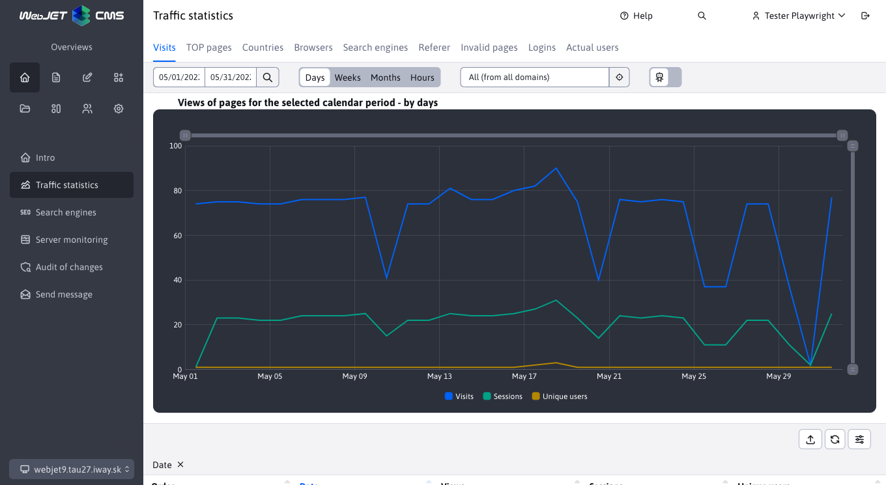

# Changelog version 2025

## 2025-SNAPSHOT

> Development version

## 2025.18

> View Full Version **2025.18** brings a completely redesigned module **E-commerce** with support **payment gateway GoPay** and an improved order list. Application **News calendar** has been separated as **standalone application** and at the same time we have redesigned the settings of several applications in the page editor. **Document Manager** (formerly File Archive) has passed **visual and functional reboot** including new tools for managing, exporting and importing documents.
>
> The system has also been improved **Bulk email** with new options for the sender and a more convenient choice of recipients. **Reservations** have gained new opportunities as **overbooking** creating bookings back in time and sending notifications to specific emails for each booking object.
>
> We have optimized the number of files in **Explore** leading to **faster loading** and added new information to **Server monitoring**.

### Groundbreaking changes

- News Calendar app separated into a separate app, if you use News Calendar you need to edit the path `/components/calendar/news_calendar.jsp` at `/components/news-calendar/news_calendar.jsp` (#57409).
- Modified Spring and JPA initialization, see the programmer's section (#43144) for more information.
- Redesigned backend part of ecommerce application, more in the section for programmer (#57685).

### Data tables

- When the numeric value filter is set to from-to, the field is enlarged to better display the entered value, similar to what the date field does (#57685).
- The File Archive application has been converted into a Spring application. For more information, see the programmer's section (#57317).
- The E-Commerce application was on `BE` partly remodeled. For more information see the section for the programmer (#56609).

### Document Manager (File Archive)

- **List of files** redesigned with the addition of new logic compared to the old version. Read more in [Archive files](redactor/files/file-archive/README.md) (#57317).

- **Category Manager** repaired and redesigned. Read more in [Category Manager](redactor/files/file-archive/category-manager.md) (#57317).
- **Product Manager** has been added as a new section. Read more in [Product Manager](redactor/files/file-archive/product-manager.md) (#57317).
- **Exporting master files** has been modified to offer wider file export options and improve the clarity of the listings. Read more in [Exporting master files](redactor/files/file-archive/export-files.md) (#57317).

- **Importing master files** has been corrected and modified to work with the extended export options. Read more in [Importing master files](redactor/files/file-archive/import-files.md) (#57317).
- **Indexing** documents in search engines like `Google` modified to not index old/historical versions of documents and documents out of date (HTTP header set `X-Robots-Tag=noindex, nofollow`). Indexing of these documents can be enabled in the editor in the document manager (#57805).

### Applications

Redesigned application properties settings in the editor from the old code in `JSP` at `Spring` Application. Apps also automatically get the ability to set [display on devices](custom-apps/appstore/README.md#conditional-application-view). The design is consistent with the rest of the WebJET CMS and data tables (#57409).
- [Survey](redactor/apps/inquiry/README.md)
- [Banner system](redactor/apps/banner/README.md)
- [Date and time, Date and name day](redactor/apps/app-date/README.md) - merged into one common application
- [Questionnaires](redactor/apps/quiz/README.md)
- [Bulk e-mail](redactor/apps/dmail/form/README.md)
- [Calendar of events](redactor/apps/calendar/README.md)
- [News calendar](redactor/apps/news-calendar/README.md)
- [Site Map](redactor/apps/sitemap/README.md)
- [Media](redactor/webpages/media.md)
- [Related sites](redactor/apps/related-pages/README.md)
- [Rating](redactor/apps/rating/README.md)
- [Reservations](redactor/apps/reservation/reservation-app/README.md)

- Accelerated loading of application data in the editor - data is loaded directly from the server, no need to make a REST service call (#57673).
- Modified visual - application title moved to main window when inserted into the page (instead of the original Application title) to increase the size of the application setup area (#57673).

- Added application screenshots in Czech language for most applications (#57785).

### Bulk e-mail
- **Moved Web page field** - now located in front of the field **Subject** so that when you select a page, the subject is automatically filled in according to the name of the selected web page (#57541).
- **Modifying the order in the Groups tab** - email groups are now shown before user groups (#57541).
- **New options for sender name and email** - if the configuration variables are `dmailDefaultSenderName` a `dmailDefaultSenderEmail` set, the following values are used. If they are blank, the system will automatically fill in the name and email of the currently logged in user. (#57541)
  - With these variables it is possible to set **fixed values** (e.g. company name) for all [Campaigns](redactor/apps/dmail/campaings/README.md), regardless of who is logged in.

- Bulk email - optimizing recipient list creation - tab [groups](redactor/apps/dmail/campaings/README.md#adding-from-a-group) moved to the dialog box. After selecting a group of recipients, you can immediately see them in the Recipients tab and can easily edit them, no need to save the email first to view the recipients (#57537).

- Unsubscribe - when you directly enter your email to unsubscribe (not by clicking on the link in the email), a confirmation email is sent to the email address you entered. In it you need to click on the unsubscribe link. The original version did not check the validity/ownership of the email address in any way, and it was possible to unsubscribe from someone else's email (#57665).

### News calendar

- News Calendar separated as a separate app, originally it was an option in the Calendar app (#57409).
- Displays a calendar linked to the news list with the option to filter news by the selected date in the calendar.

### Server monitoring

- Added table with information about database connections and memory occupied (#54273-61).
- Added information about the version of libraries `Spring (Core, Data, Security)` in the Server Monitoring-Actual Values section (#57793).

### Reservations

- **Support for overbooking** - allows administrators to create multiple reservations `overbooking` on the same date (#57405).
- **Improved import validation** - it is now possible to import [booking](redactor/apps/reservation/reservations/README.md) well into the past, or to create `overbooking` data import reservations (#57405).
- **Support for adding bookings to the past** - allows administrators to create reservations in the past (#57389).
- To [reservation objects](redactor/apps/reservation/reservation-objects/README.md) a column has been added **Emails for notifications** which for each valid email entered (separated by a comma) will send an email if the reservation has been added and approved (#57389).
- Booking confirmation notifications and other system notifications can be set to the sender's name and email using configuration variables `reservationDefaultSenderName,reservationDefaultSenderEmail` (#57389).
- New application added [Reservation of days](redactor/apps/reservation/day-book-app/README.md), for booking all-day objects for a specific interval using the integrated calendar (#57389).

### Ecommerce

!> **Warning:** due to the database update, the first start of the server may take longer - values for the number of items and price are calculated in the database for faster loading of the order list.
- Added card **Personal information** to the order list - contains detailed information about **delivery address** as well as **contact information** all in one place (#57685).
- Added card **Optional fields** to the order list - [optional fields](frontend/webpages/customfields/README.md) as needed for implementation (#57685).
- Export of order list - columns total price with VAT and number of items (#57685) added.
- Order form - added option to define available list of countries via configuration variable `basketInvoiceSupportedCountries` (#57685).
- Modified card data display **Personal data** in the list of orders, their logical division into parts for better overview (#57685).
- Columns have been added to the order list **Number of items**, **Price without VAT** a **Price with VAT**. Values are automatically recalculated when order items are changed (#57685).
- Added the ability to view the product web page by clicking on the icon in the item list, the product will also be displayed in the Preview tab when opening the item editor (#57685).
- In the order list, redesigned country selection via the selection field, which offers only countries defined by a constant `basketInvoiceSupportedCountries` (#57685).

- New version [configurations of payment methods](redactor/apps/eshop/payment-methods/README.md) and integration to payment gateways. Data is separated by domain. We have added support for [payment gateway GoPay](https://www.gopay.com), which also means accepting payment cards, supporting `Apple/Google Pay`, payments via internet banking, `PayPal`, `Premium SMS` etc. In addition, payments by bank transfer and cash on delivery are supported. For each type of payment it is also possible to set a price, which will be automatically added to the order when the option is selected. The set payment methods are also automatically reflected in the options when the customer creates an order.

- New Order List application with a list of orders of the currently logged in user. By clicking on an order, you can view the order detail and download it in PDF format (#56609).

### Other minor changes

- Administration search - customized interface `RestController` a `Service` (#57561).
- Explorer - faster loading and lower server load by reducing the number of files/server requests (#56953).

### Error correction

- Bulk email - added duplication of recipient list when duplicating a campaign (#57533).
- Data tables - import - modified logic **Skip erroneous entries** when importing so that generic errors are also handled with this option `Runtime` and ensured that the import was completed without interruption. These errors are then displayed to the user via a notification during import (#57405).
- Files - fixed file/folder size calculation in explorer footer and when showing folder detail (#57669).
- Navigation - fixed tab navigation in mobile view (#57673).
- Autocomplete - corrected error in type field `Autocomplete`, where the first value obtained in the case of `jstree` was not correct (#57317).

### For the programmer

!> **Warning:** modified Spring and JPA initialization, follow [instructions in the installation section](install/versions.md#changes-in-the-transition-to-the-20250-snapshot).

Other changes:
- Added option to perform [additional HTML/JavaScript code](custom-apps/appstore/README.md#additional-html-code) in Spring application with annotation `@WebjetAppStore` by setting the attribute `customHtml = "/apps/calendar/admin/editor-component.html"` (#57409).
- Added field type in datatable editor [IMAGE\_RADIO](developer/datatables-editor/standard-fields.md#image_radio) to select one of the options using the image (#57409).
- Added field type `UPLOAD` For [file upload](developer/datatables-editor/field-file-upload.md) in the datatable editor (#57317).
- When initializing [nested datatables](developer/datatables-editor/field-datatable.md) added option to edit `columns` object by specifying a JavaScript function in the attribute `data-dt-field-dt-columns-customize` Annotation (#57317).
- Added support for getting sender name and email for various email notifications using `SendMail.getDefaultSenderName(String module, String fallbackName), getDefaultSenderEmail(String module, String fallbackEmail)` (#57389).
- Added option to set root folder for [field of type JSON](developer/datatables-editor/field-json.md) in both ID and path format: `@DataTableColumnEditorAttr(key = "data-dt-field-root", value = "/Aplikácie/Atribúty stránky")` or `@DataTableColumnEditorAttr(key = "data-dt-field-root", value = "26")`.
- Running background tasks is only done after complete initialization, including `Spring` (#43144).
- Added option to set [all HikariCP properties](install/setup/README.md#creating-a-db-schema) (#54273-61).
- Added check to see if the database driver supports sequence setup (#54273-61).
- Modified function `WJ.headerTabs` if you are listening to change the card we recommend to use event type `$('#pills-tabsFilter a[data-wj-toggle="tab"]').on('click', function (e) {` where in `e` you get the card that was clicked (#56845-20250325).
- Converted Document Manager (File Archive) to Spring application. If you are using the original version and want to keep it, you need to add back the files `/components/file_archiv/file_archiv.jsp` a `components/file_archiv/editor_component.jsp` and the necessary classes from [older version of WebJET CMS](https://github.com/webjetcms/webjetcms/tree/release/2025.0/src/webjet8/java/sk/iway/iwcm/components/file_archiv).
- Document Manager (File Archive) - modified API `FileArchivatorBean.getId()/getReferenceId()/saveAndReturnId()` Returns `Long`, you can use `getFileArchiveId()` for including `int` Values. Delete unused methods, transfer them to your classes if needed. We do not recommend modifying WebJET classes, create new classes of type `FileArchivatorProjectDB` in your project where you add methods. If we have deleted the whole class you are using (e.g. `FileArchivatorAction`), you can add it directly to your project (#57317).
- Added automatic setting of column filtering to value `false`, if the value is `null` (unset) and it is a column that is nested, such as `editorFields` Columns (#57685).
- Added option [of special arrangement](developer/datatables/restcontroller.md#Arrangement) by overwriting the method `DatatableRestControllerV2.addSpecSort(Map<String, String> params, Pageable pageable)` (#57685).
- Added option in annotation `@DataTableColumn` set attribute `orderProperty` which will determine [columns for arrangement](developer/datatables/restcontroller.md#Arrangement), e.g. `orderProperty = "contactLastName,deliverySurName"`. Convenient for `EditorFields` classes that can aggregate data from multiple columns (#57685).
- For an array type `dt-tree-dir-simple` with set `data-dt-field-root` added tree structure of parent folders for better [tree structure display](developer/datatables-editor/field-json.md) (before, folders were displayed only from the specified root folder). Added the ability to define a list of folders that will not appear in the tree structure using a configuration variable set to `data-dt-field-skipFolders`.
- Selection [editable field](developer/datatables-editor/field-select-editable.md) modified so that when a new record is added, that record is automatically selected in the field (#57757).
- Redesigned e-commerce application on `BE` parts. Since new classes are already being used, you must:
  - make use of the update script `/admin/update/update-2023-18.jsp` for basic updating of your JSP files
  - as the type is now used `BigDecimnal` instead of `float`, you must additionally adjust all comparisons of these values. Type `BigDecimal` is not compared classically using `<, =, >` but by means of `BigDecimal.compareTo( BigDecimal )`
  - you need to remove file calls or add back any files that were removed because they were not used

### Testing

- Media - added test for embedding media in a web page if the user does not have the right to all media (#57625).
- Web pages - added test for creating a new page with publishing in the future (#57625).
- Gallery - added watermark test with image comparison, added rights check test (#57625).
- Web pages - added test for optional fields when creating a web page (#57625).
- Allure - jUnit test results added to the common Allure report (#57801).

## 2025.0.x

> Corrected version of the original version 2025.0.

### Error correction

- Data Tables - fixed incorrect display of tabs that should not be displayed when creating a new record (e.g. in templates) (#57533).
- Data tables - added limit of number of records when displaying all. The value is the same as the maximum number of rows for export, it is set in the configuration variable `datatablesExportMaxRows` (#57657-2).
- Data tables - corrected number of records on page when page contains navigation tabs (#57725-1).
- Data Tables - corrected Duplicate heading instead of Edit when duplicating a record, modified duplicate button icon (#57725-3).
- Data tables - unified name `ID` columns from the original `ID, Id, id` to a unified `ID`. For `DataTableColumnType.ID` no need to set `title` attribute, the key is automatically used `datatables.id.js`. Some translation keys deleted as not needed (#49144)
- Image editor - when editing an image from a remote server, added notification about the need to download the image to the local server (#57657-2).
- Web pages - corrected the insertion of the block containing the application (#57657-2).
- Website - supplemented `ninja` object when inserting an application into a new web page (#57389).
- Web pages - pages in the trash will no longer appear in the Unapproved tab, if the approver clicks on the link in the email an error Page is in trash will appear so that a page that has been deleted in the meantime is not accidentally approved (#54273-62).
- Web pages - approvals - corrected list loading in the Unapproved tab when using the database server `Oracle` (#54273-62).
- Web site - fixed cluster nodes updating when tags change (#57717).
- Web pages - fixed displaying the list of pages if the user has the right to only selected web pages (#57725-4).
- Web pages - domain switcher added even if no configuration variable is set `enableStaticFilesExternalDir` but only `multiDomainEnabled` (#57833).
- Applications - corrected display of the translation keys tab when using the component `editor_component_universal.jsp` (#54273-57).
- Applications - added support for inserting a new line via keyboard shortcut `SHIFT+ENTER` into a simple text editor such as the one used in Questions and Answers (#57725-1).
- Dialers - moved dialer selection directly to the data table toolbar (#49144).
- New - moved section selection directly to the data table toolbar (#49144).
- Login - fixed login error when password expires (#54273-57).
- Login - fixed login in multiweb installation (#54273-57).
- GDPR - corrected display of the Database Cleanup tab on use `Oracle/PostgreSQL` Database (#54273-57).
- File archive - corrected display of icons in date and time dialog (#54273-57).
- Security - updated library `Swagger UI` to version `5.20.0`, supplemented by exceptions in `dependency-check-suppressions.xml`.
- Update - added deletion of unnecessary files when updating an unpacked version (#57657-4).
- Multiweb - supplemented control `ID` domain when a visitor registers for a web site (#57657-4).
- Users - added the ability to also select the Root Folder in the User Rights in the Upload Files to Directories section (54273-60).
- Users - modified rights settings - simplified rights settings for administrators and registered users (no longer necessary to select the Users right as well), corrected duplicate entries, modified grouping in the Templates section (#57725-4).
- Explorer - added better reporting on ZIP archive creation error (#56058).
- Statistics - fixed creation of table for click statistics in the temperature map.
- Translator - implementation of intelligent delay for translator `DeepL` as protection against error `HTTP 429: too many requests` which caused a translation outage (#57833).
- Cloning structure - fixed unwanted interleaving of application implementations `!INCLUDE(...)!`, when automatically translating the page body (#57833).
- Cloning structure - added translation of perex annotation to automatic page translation (#57833).
- Explorer - fixed folder and file property settings rights (#57833).
- Server monitoring - fixed report about configuration variable settings for Applications, WEB pages and SQL queries (#57833).
- Introduction - corrected display of the requirement for two-step verification when integrating via `IIS` (#57833).
- Cloning/mirroring structure - fixed folder URL settings (removing diacritics and spaces) (#57657-7).
- Gallery - missing tags added (#57837).
- Tags - corrected the folder settings of an existing tag in the View For section (#57837).

### Security

- Updated library `Apache POI` to version 5.4.1 to fix vulnerabilities `CVE-2025-31672`.

## 2025.0

> In the version **2025.0** we brought **new administration design** for even better clarity and user experience.
>
> One of the main changes is the transfer of **second level menu** to **tabs in the page header**, which simplifies navigation. In the website we also **merged folder and website tabs** to keep everything in one place. If the header does not contain tabs, the tables are automatically adjusted and displayed **extra line**.
>
> Please provide feedback via **Feedback form** if you identify when using the new version **any display problem**. You can also add a reminder **screenshot** to help us identify and resolve any deficiencies more quickly.
>
> Thank you for your cooperation and help in improving WebJET CMS!

### Groundbreaking changes

- Web pages - inline editing cancelled. The ability to edit the page directly in view mode has been removed as it used an older version of the editor that is no longer supported. As an alternative it is possible to activate [toolbar](redactor/webpages/editor.md#toolbar) displayed in the top right corner of the website. This panel provides quick access to the web page editor, folder or template. You can turn it off or on using the configuration variable `disableWebJETToolbar`. Once activated, it will start to appear on the web page after entering the Web Pages section in the administration (#57629).

- Login - set for administrators [password change request](sysadmin/pentests/README.md#password-rules) once a year. The value can be modified in the configuration variable `passwordAdminExpiryDays`, setting it to 0 disables the check (#57629).
- Introduction - added requirement to activate two-factor authentication to increase login security. Prompt is not displayed if authentication is handled via `LDAP` or if the translation key is `overview.2fa.warning` set to empty (#57629).

### Design

In the version **2025.0** we brought an improved **administration design** which is clearer and more efficient.

**Modified login dialogue** - new background and moving the login dialog to the right side. At **Login** it is possible to use not only the login name but **already have an email address**. 

**Clearer header** - the name of the current page or section is now displayed directly in the header.

**New navigation in the left menu** - under items are no longer part of the left menu, but are displayed **as cards at the top** Pages. 

**Merged tabs in the Websites section** - Switching folder types and web page types are now displayed in a common section, simplifying navigation. **Choosing a domain** has been moved to the bottom of the left menu. 

**Reorganised menu items**:
- **SEO** moved to section **Views**.
- **GDPR and Scripts** moved to section **Templates**.
- **Gallery** is now in the section **Files**.
- Some item names have been modified to better describe their function.

### Web pages

- Added the ability to set increment order for folders in a configuration variable `sortPriorityIncrementGroup` and web pages in the configuration variable `sortPriorityIncrementDoc`. The default values are 10 (#57667-0).

### Testing

- Standard password for `e2e` tests are obtained from `ENV` variable `CODECEPT_DEFAULT_PASSWORD` (#57629).

### Error correction

- Web pages - inserting links to a file in PageBuilder (#57649).
- Web pages - added link information (file type, size) to the Auxiliary caption attribute `alt` (#57649).
- Web pages - corrected order of web pages when used `Drag&Drop` in tree structure (#57657-1).
- Web pages - when duplicating a web page/folder, the value is set `-1` in the Order of Arrangement field for inclusion at the end of the list. The value `-1` can also be entered manually to obtain a new value for the order of the arrangement (#57657-1).
- Websites - importing web pages - fixed media group settings when importing pages containing media. When importing, all Media Groups (even unused ones) are automatically created due to the fact that the media group set for the media application is also translated when importing pages `/components/media/media.jsp` in the page (which may also contain the media ID of a group outside the imported pages) (#57657-1).
- Firefox - reduced version of the set `Tabler Icons` at `3.0.1` because Firefox puts a significant load on the processor when using newer versions. Optimised CSS style reading `vendor-inline.style.css` (#56393-19).

The rest of the list of changes to the changes is identical to the version [2024.52](CHANGELOG-2024.md).

