# List of changes version 2026

## 2026.0-SNAPSHOT

> Development version updated from the main repository.

### Websites

- Templates - added option to set the movement of `<style>` and `<link rel="stylesheet">` tags from the page body to `<head>` via [template option](frontend/templates/templates.md) with support for global configuration variable `showDocMoveStyleToHead`. Blocks in IE conditions, `noscript` and `script` remain in place (#231).

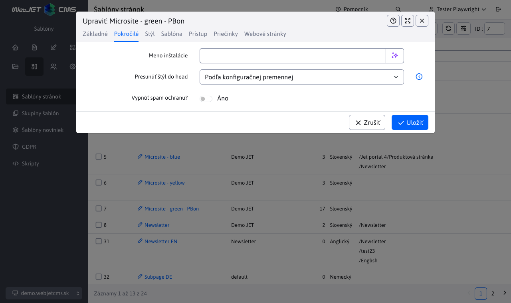

- Added **Thumbnail** tab in the image insertion dialog for setting parameters for [generating thumbnail images](redactor/webpages/working-in-editor/README.md#thumbnail-tab) `thumbnail` (#58317).

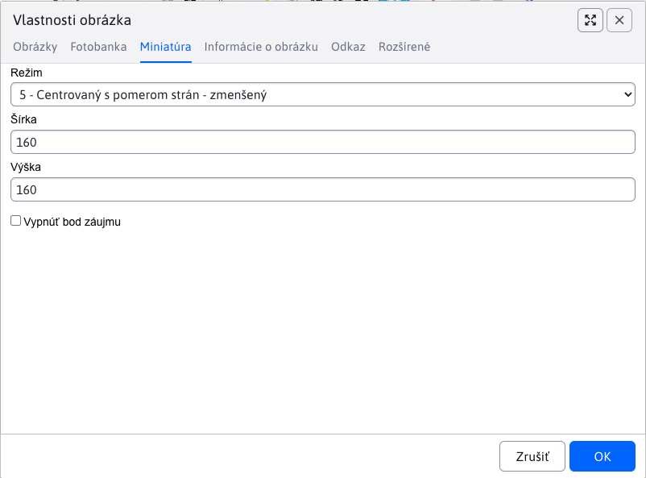

### Forms

- [Multistep form statistics](redactor/apps/multistep-form/stat.md) has been extended with a date filter and advanced metrics for views/attempts/languages ​​etc. (#58509).

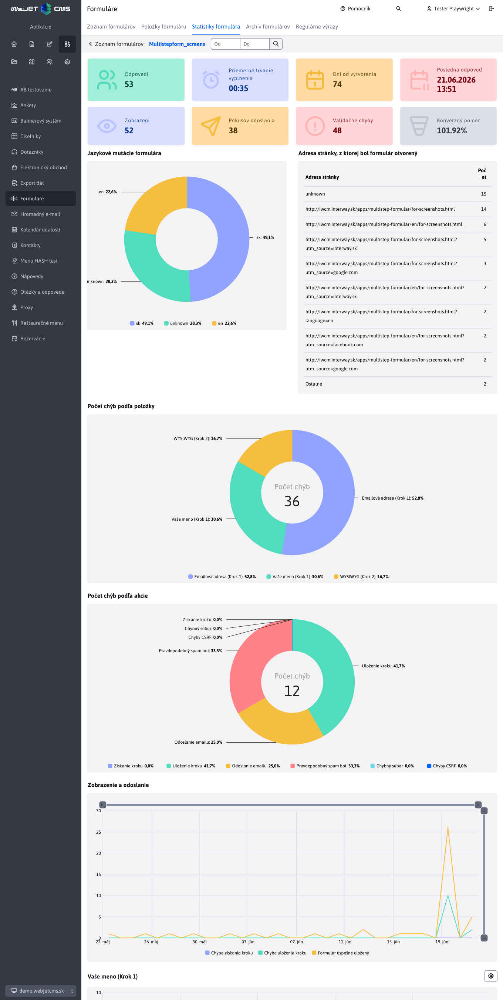

- Added the ability to easily set up checkboxes and groups of checkboxes/select fields in multi-step forms (#58517).

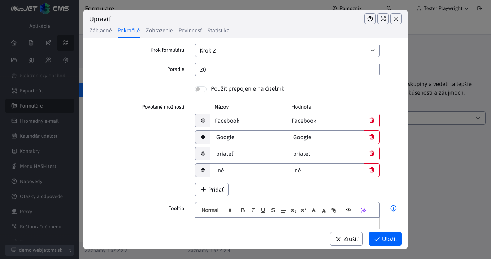

- Added the ability to link a selection field and a group of checkboxes/selection fields to a dial pad in multi-step forms (#58517).

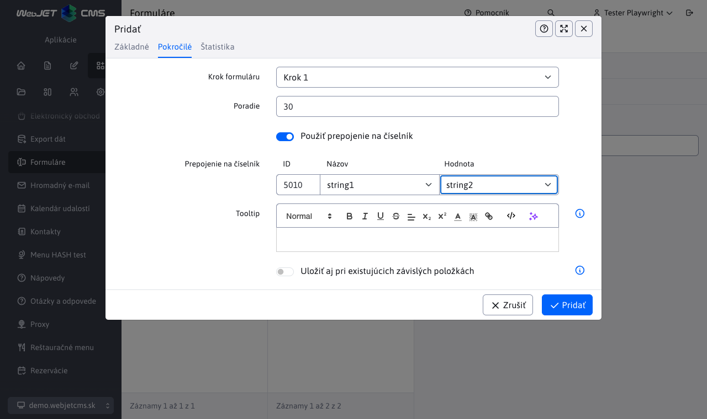

- Added the option to set the maximum combined file size in the form, previously only the size for a file could be set, if the form contains multiple files, it is possible to set the maximum size for all files together (#58517).

### Semantic search

- Added support for [semantic search](redactor/apps/semantic-search/README.md) built on the `pgvector` and `OpenAI embeddings` vector database technology. It allows visitors to find relevant pages based on **the meaning of the query**, not just keyword matching (#211).

- Added hybrid semantic search mode and optional RAG response from indexed content. The **Search** app has new settings for search type, hybrid behavior, AI assistant selection, and response context limits (#58521).

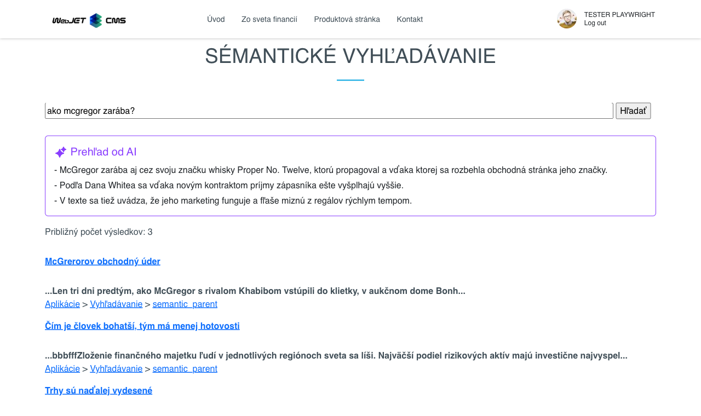

### Applications

- Added new application [Language Redirect](redactor/apps/language-redirect/README.md) to automatically redirect visitors to the language version of the page based on language detection from the HTTP header `Accept-Language`. It supports up to 8 language assignments per URL, respecting the language cookie, and the option to redirect only to the root URL (#58497).


- Reservations - the **Time Reservation** and **Day Reservation** applications have a unified visual style according to the `Vanilla Calendar` calendar, adjusted contrasting cell colors according to `WCAG`, separated visual CSS styles into separate files, and **Time Reservation** displays the actual price in the hourly cells according to the price list of the reservation object (#58565).

- Reservations - a new application [My Reservations] (redactor/apps/reservation/my-reservations-app/README.md) has been added, which will show the logged-in user an overview of their reservations, reservation status, and the option to delete allowed future reservations (#58565).


### Multiweb

- Added option [create new domain](install/multiweb/config.md) from the control domain, it will also create user, template group, template and system pages (#58525).
- Added template group list view (#58525).
- All domain redirects can be edited in the control domain.
- Added option to view all files in the management domain.

### Safety

- Added support for generating `nonce` for the [Content-Security-Policy](sysadmin/pentests/README.md#content-security-policy-csp) header (#58533).
- AI assistants - added protection against `prompt injection` attacks with separation of system instructions from user content and detection of coded inputs (#58549).

### Documentation

- A new section [Overview of new features] (sales/README.md) has been created, which contains descriptions of new features and **functionalities of WebJET CMS in understandable language**, without unnecessarily technical formulations (#58505).
- Created a [Troubleshooting] section (sysadmin/troubleshooting/README.md) in the operation manual.

### For the programmer

- Datatables - added a new field type `OPTIONS` for [dynamic list of values](developer/datatables-editor/standard-fields.md#options) in the editor. Each row contains two text fields (key and value), supports adding, removing and reordering using `drag & drop` (#58517).


- Data tables - added a new field type `ENUMERATION` for [connection to enumeration tables](developer/datatables-editor/standard-fields.md#enumeration) in the editor. The field stores the configuration in `enumeration-options|ID_CISELNIKA|MENO_STLPCA_TEXTU|MENO_STLPCA_HODNOTY` format and allows you to set the source of values ​​(#58517).


- Logging - added attribute `sessionId` and user login name `userLogin` (#OSK526) to [Logback MDC](https://logback.qos.ch/manual/mdc.html).

- Optional fields - added the ability to centrally set the properties of [optional fields](frontend/webpages/customfields/custom-fields-settings.md) in a new table in the Settings section (#58413).

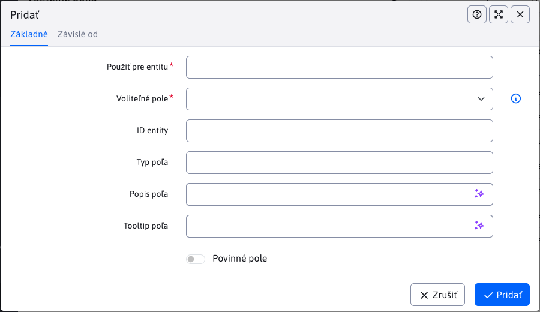

- Updated [Tabler Icons](https://tabler.io/icons) library to version 3.44.0, fixed issue with simultaneous use of `Outline` and `Filled` sets (#58509).
- Web pages - if you need to have an empty first line in the configuration variable `imageMagickCustomParams*` for [custom parameter settings](redactor/apps/gallery/README.md#custom-parameters-imagemagick) `ImageMagick` enter the value `---`.

## 2026.18

> WebJET CMS 2026.18 brings **folder change approval** with support for multi-level approval and **accessibility testing** integrated directly into automated tests.
>
> In the page editor, you can now **maximize dialogs** when setting up applications, inserting images, or links. Application settings also gain new options for accessibility attributes (aria) and **custom CSS styles** for display.
>
> In the area of ​​security, **support for login via OAuth2/Keycloak/Google/Facebook** and **Access Keys** (PassKey/WebAuthn) have been added, along with improvements for more stable operation in a cluster environment.

!>**Warning:** Version intended for `jakarta namespace`, requires Tomcat 11 application server, uses Spring version 7. Before upgrading [check requirements](install/versions.md#changes-when-upgrading-to-jakarta-version).

### Groundbreaking changes

- Tomcat 11 application server is required, version 10 is no longer supported (#58385).
- Removed legacy applications `/components/adresar/editor_component.jsp` and `/components/sharing_icons/editor_component.jsp` which were no longer used. If you want to continue using them, please download them from [GitHub](https://github.com/webjetcms/webjetcms/tree/hotfix/2026.0-main/src/main/webapp/components) (#57409).

### Websites

- Approval - added [approving folder changes](redactor/webpages/approve/README.md) including approving folder creation, editing and deletion. The approver will receive an email with an overview of the changes and the option to approve or reject the change. Multi-level approval is also supported (#58405).


- Folder approval - in the `Na schválenie` tab, sub-tabs `Dokumenty` and `Priečinky` were added for separate display of pages and folders awaiting approval (#58405).
- Folder approval - added display of a column with approval/rejection date and approver name in folder change history (#58405).
- Applications - added option to set [application display styles](redactor/webpages/working-in-editor/README.md#karta-zobrazenie). You can set, for example, the application's indentation on the page, width or different display styles, as well as information for the reader for visually impaired visitors (#osk418).

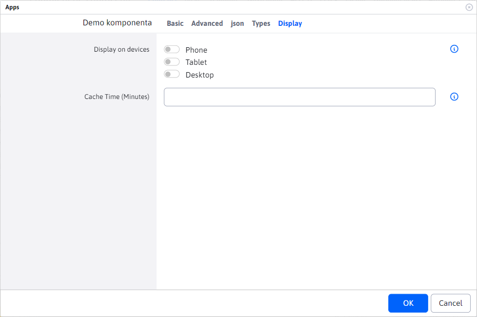

- Page editor - a tab with advanced settings such as ID, title, description for readers (aria-label), and the like has been added to the [Link and Button] dialog box (redactor/webpages/working-in-editor/README.md#buttons) (#osk115).
- Ninja - added field `canonical` as [optional Q field](frontend/ninja-starter-kit/ninja-jv/page/README.md#page-information) to set the canonical URL of the page. If the field is empty, the page URL will be used. You will get the value in the template as `${ninja.page.canonical}`. Adds the parameter `page` to the URL, if it exists, to display the correct page in the news list (#OSK149, #54273-88).
- Page Builder - fixed moving the window for inserting blocks, fixed overlapping of editor mode selection, incorporated UX comments (#58353).
- Unified use of the `ImageMagick` tool for changing image sizes between the gallery and `/thumb servlet` (#osk396).
- Added support for inserting images in `webp` format, including resizing using the native library `libwebp` via `ImageIO` (#osk396).
- Added configuration variables `imageMagickCustomParams*` for [setting custom parameters](redactor/apps/gallery/README.md#custom-parameters-imagemagick) `ImageMagick` operations by operation type and image format (#osk396).
- Applications - added option to **maximize and minimize** window for **inserting applications, images, links** etc. into the page (#57409).
- Added support for automatically restoring all linked (mirrored) pages and folders from the trash when one of them has been restored (#osk423).
- Folder - added the ability to set the HTML code of a new page from the local System/Templates folder, originally the list of pages was read according to the configuration variable `tempGroupId` (#57409).
- Modified [optional fields] nomenclature (frontend/ninja-starter-kit/ninja-jv/page/README.md) for SEO values ​​(#228).
- Added an icon to move the [cursor to a hard-to-reach place](redactor/webpages/working-in-editor/README.md#inserting-text-in-hard-to-reach-places), such as behind the last SVG icon in a line and the like (#osk105).


### Applications

Redesigned application properties settings in the editor from the old code in `JSP` to `Spring` applications. Applications automatically also get the ability to set [display on devices](custom-apps/appstore/README.md#conditional-display-applications). The design is consistent with the rest of the WebJET CMS and data tables (#57409).

- [Inquiry made easy](redactor/apps/inquiry/inquiry-simple.md)

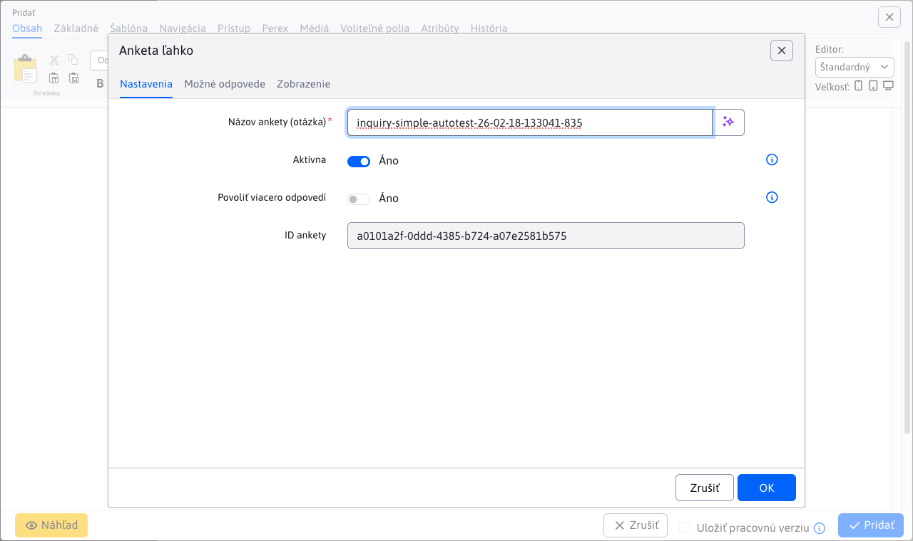

- [Map](redactor/apps/map/README.md)

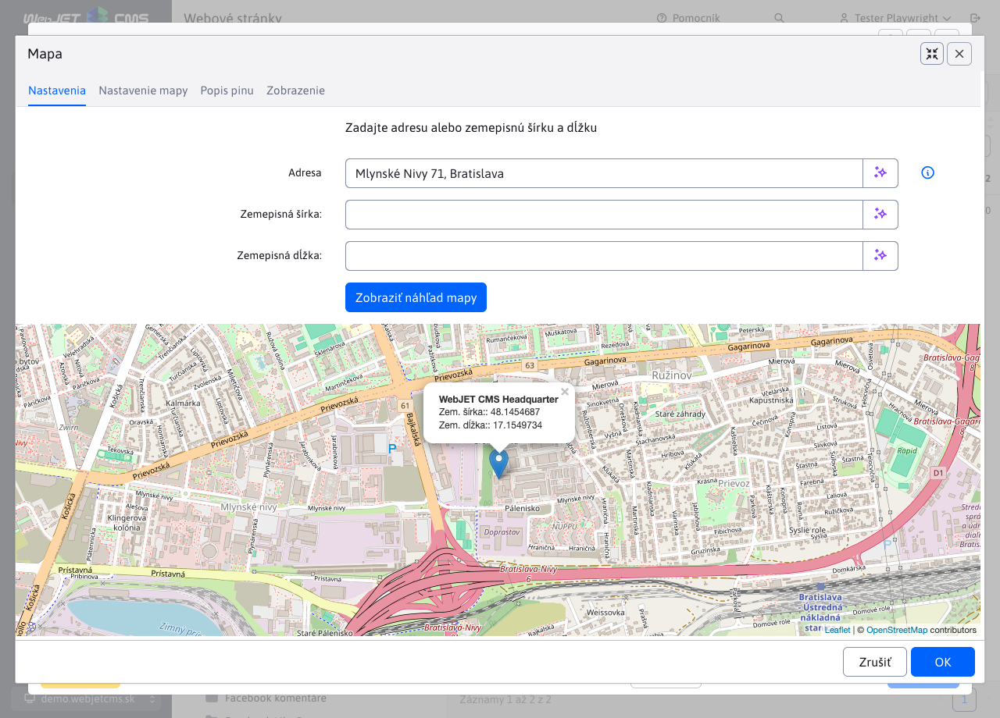

- [Testimonials](redactor/apps/app-testimonials/README.md)

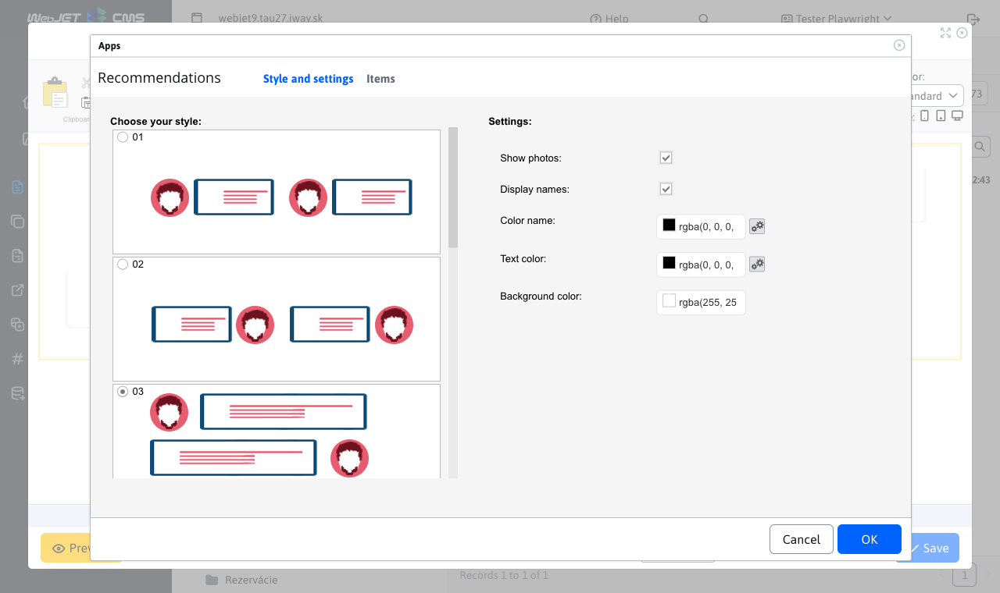

- [Pre-made blocks (HTMLBox)](redactor/apps/htmlbox/README.md)


- Video - added option to set [CSS classes for video aspect ratio](redactor/apps/video/README.md#configuration), options displayed in the application are set via configuration variables `videoClasses`, `videoWrapperClass` and `videoItemClass` (#osk496).

### Forms

- Added [Statistics] tab (redactor/apps/multistep-form/stat.md) to display form responses in the form of graphs (#58333).

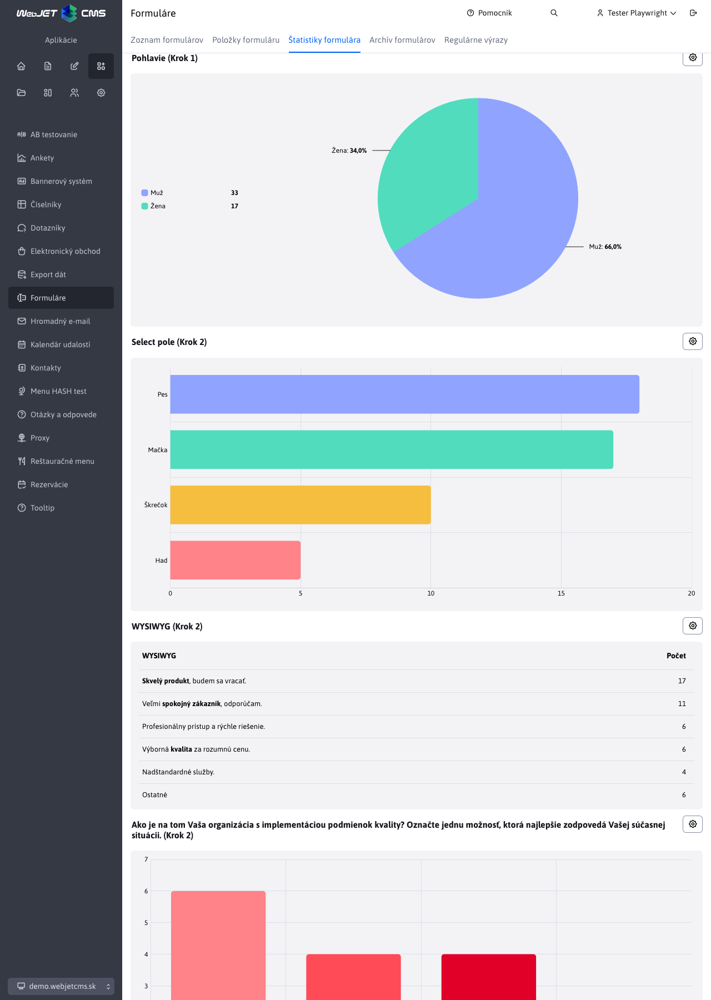

- Added **Completion Duration** column for multi-step forms, which shows how long it took the user to complete the form (time from viewing to submission) (#58333).
- Multi-step forms - added support for conditional display/validation of form items based on created conditions. More in the [Conditional display/validation of items] section (redactor/apps/multistep-form/README.md#conditional-displayvalidation-of-items) (#58477).

### Gallery

- Added the ability to move gallery folders directly in the editor by changing the parent folder. For details, see [structure management](redactor/apps/gallery/structure.md) (#58433).
- Improved handling of moving gallery folders to prevent invalid links. For more information, see [moving a Gallery folder](redactor/apps/gallery/structure.md#moving-gallery-folder) (#58433).
- Added support for filtering gallery folders by current and original/filename of the gallery folder in the tree structure (#58445).
- Added support for [displaying the original/file name of the folder](redactor/apps/gallery/structure.md#setting-up-the-tree-structure-display) of galleries in the tree structure. The folder name on disk may be different from the nice name specified in the gallery properties (#58445).


### Document manager

- Added display of **Global Id** value for documents (#58357).
- Added the ability to select documents to display in the application using their `globalId` value in the nested table, more in the [Tab - Selected documents] section (redactor/files/file-archive/file-archive-app.md#tab---selected-documents) (#58357).

### Accessibility

- Added [automated accessibility testing](developer/testing/a11y.md) (a11y / WCAG) using `axe-core` integrated into CodeceptJS. Tests cover WCAG 2.0/2.1/2.2 AA levels (#58389).
- Improved accessibility / fixed WCAG errors on the pages:
  - Login to administration (#58389-2).
  - Introduction / item menu / header (#58389-3).
  - Improved color contrast in error messages and notifications (#58389-4).
  - Data tables, editor (#58389-4).
- Extended a11y tests with new scenarios for file manager, monitoring, statistics, file upload, user management and website. The `a11y.check()` method supports the `context` parameter to limit the inspection to a specific part of the page, including nested `iframe` elements (#58389-5).

### Other minor changes

- Gallery - added support for transparency in `png/webp/gif` images when resizing them, if [ImageMagick](redactor/apps/gallery/README.md#possible-configuration-variables) (#osk396).
- GitHub pipeline - after `merge pull request`, a social media post is automatically generated using LLM (GitHub Copilot / Google Gemini) and added as a comment to the given `pull request` along with any screenshots from the documentation (#177).
- Scripts - added option to set whether a script should be inserted in the page editor in PageBuilder mode (#58349).
- Scripts - added attribute [Insert Order](redactor/apps/insert-script/README.md) to set the order of inserting scripts within the same position. The default value for existing scripts is 10, for a new script it is automatically set to the highest value + 10 (#osk387).
- Page editor - fixed specifying the folder for uploading images/files for a new/not yet saved web page with a duplicate name: the folder now corresponds to the actual URL address of the page including the extension `-2`, `-3` etc (#58361).
- Structure mirroring - added option to generate [links to language mutations](redactor/apps/docmirroring/README.md#hreflang-attribute-setting) in the page header using the `hreflang.jsp` application, links contain the `hreflang` attribute for better SEO optimization of language versions (#58357).
- Tree structure - added automatic scrolling to the currently selected element in the tree structure (#58433).
- Applications - added the ability to hide fields/tabs in the application editor using the `appHideFields` configuration variable. For more information, see [Hiding fields/tabs](custom-apps/appstore/README.md#hiding-fields-tabs) (#58433).
- `imageradio` - ​​added option to set field type `imageradio` as `disabled` (#58333).
- The design of all charts throughout the project has been redesigned from dark to light mode for better design consistency (#58333).

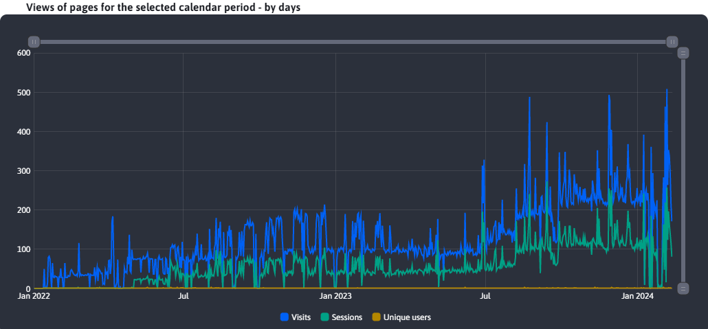

- Application `Tooltip` renamed to Help (#205).
- Traffic statistics - modified filtering by folder. The user can select any folder even from other domains if they do not have limited folder rights or if they have the right **Show statistics for all folders** (#58453).
- Users - modified the ability to see all folders in the **Directory and Page Rights** setting if the administrator has the **Manage Administrators** right. Folders are displayed even if the administrator himself has limited folder rights (#58453).

### Bug fixes

- `imageradio` - ​​fixed display of field type `imageradio` in datasheet editor (#58333).
- Websites - fixed restoring a page that was created via mirroring and did not have a historical record that could be used for restoration (#208).
- Web pages - when restoring a page from the trash, the historical version is used to preserve its original state before deletion (#208).
- Button - fixed the ability to set button properties which is disabled (attribute `disabled=disabled`) (#209).
- Photo gallery - fixed folder search (#58433).
- Files - added preservation of `.min.js` and `.min.css` in the file name when uploading to `/files,/images` folders (#213).

### Performance

- Modified `PkeyGenerator` for cluster mode `auto`. Method `allocate` wrapped in transaction (`setAutoCommit(false)`) with retry at `deadlock`. Improved block acquisition also in cluster mode `auto`, reducing the number of database accesses and the risk of `deadlock`. Incrementing and reading the value of `pkey_generator` is done in a single atomic SQL query, which prevents the allocation of the same block to multiple cluster nodes. Database-specific SQL statements are used (#213):

| Database | SQL command | Minimum version |
| --- | --- | --- |
| MySQL | `LAST_INSERT_ID(expr)` | 3.23+ |
| MariaDB | `LAST_INSERT_ID(expr)` | 5.1+ (all GAs) |
| Microsoft SQL Server | `UPDATE ... OUTPUT inserted` | 2005+ |
| PostgreSQL | `UPDATE ... RETURNING` | 8.2+ |
| Oracle | `RETURNING value INTO` | 10g+ |

- `SeoManager` and `ClusterRefresher` tolerate database `deadlock` during `UPDATE/DELETE` operations without error log (#213).
- Cluster mode `auto` - ​​added configuration variable `clusterAutoRandomDelay` for [random start delay](install/config/README.md#auto-mode) of some tasks to reduce the risk of concurrent database conflicts between cluster nodes (#213).

### Safety

- Added file `.github/SECURITY.md` with [responsible vulnerability disclosure](sysadmin/responsible-disclosure/README.md) (#187).
- Updated libraries `AspectJ, Eclipselink, slf4j, GoPay` (#57793).
- Version `SpringSecurity` upgraded to version 7 (#56665).
- Added the option to log in via [OAuth2/Keycloak/Google/Facebook...](install/oauth2/oauth2.md) (#56665).

<div class="video-container">
    <iframe width="560" height="315" src="https://www.youtube.com/embed/q8xs3qDq-G4" title="YouTube video player" frameborder="0" allow="accelerometer; autoplay; clipboard-write; encrypted-media; gyroscope; picture-in-picture" allowfullscreen></iframe>
</div>

- Removed unused libraries `lodash,pdfmake`, updated list `dependency-check-suppressions`, fixed initial installation (#204).
- Fixed invalid password handling during API/BASIC authentication after transitioning to `Spring Security 7` so that the `password encoder` error does not turn into an internal exception and the request is correctly rejected (#58369).
- Added support for logging into the administration via [Access keys](redactor/admin/logon.md#use-access-key) `PassKey/WebAuthn` (#58369).


- Users - if you enter the character `*` in the password field when creating or editing a new user, a new secure password will be generated and displayed in a notification (#58369).
- [Permission Groups](admin/users/perm-groups.md) - added the option to set the flag **Access to all web directory** and **Access to all file system folders**, which will overwrite the accumulated rights from other groups upon login and provide the user with unlimited access to web pages or files (#osk422).
- Updated library `Datatables.net/Editor` from version `2.2.2/2.3.2` to `2.3.7/2.5.2` (#206).

### Documentation

- Modified automatic translator to use Google Translator API v3 (#58301).
- English version of documentation re-translated (#58301).

### For the programmer

- AI - new `AI skill` to fix A11Y/WCAG errors, just use the `/wj-accessibility` tool.
- Updated dependencies to minimum requirements for Tomcat 11 (Tomcat 10 is no longer supported). `Stripes` validations - modified execution of EL expressions from removed `jakarta.servlet.jsp.el` to `jakarta.el` for compatibility with `jakarta.servlet.jsp-api:4.0.0` (#58385).
- Updated the way API documentation is displayed to the [OpenAPI 3.0](https://www.openapis.org/) standard. The documentation is available at `/admin/swagger-ui/index.html` for users with administrator editing rights (#57793).
- Administration - changed `build` administration files from `webpack` to `rspack`, which is significantly faster (#206).
- Administration - unified generation of `PUG` templates for `watch` and `prod`, removed unused `npm` build dependencies and historical `webpack` scripts (#206).
- Administration - added automatic refresh of the open page at `npm run watch` after changing `JS/CSS/PUG` files (#206).
- Administration - added script `npm run analyze` with HTML report of the size of used libraries (#206).
- Datatables - added a new event type `DatatableColumnsEvent`, which can be listened to and dynamically modified before table initialization. Learn more in the [DatatableColumnsEvent event](developer/backend/events-datatable.md#datatableColumnsEvent event) (#58433).
- Added `Jackson v3` library, some JSON objects may not serialize correctly unless they have the correct `Java Bean` name (e.g. `setcookieId` without the capital `C`, or `set__rowNum__`). The best solution is to set the variable name correctly, or use the `@JsonProperty("__rowNum__")` type annotation on `getter/setter` too (#58369).
- Gallery - modified ImageMagick library call, changed API for its call to `ImageTools.executeImageMagick(...)` (#osk396).
- Charts - the tool/library [chart-tool.js](../../src/main/webapp/admin/v9/src/js/libs/chart/chart-tools.js) for working with `amcharts` charts has been updated, new functionalities, new charts and improved logic (#58333).
- Charts - added new class/library [stats-by-charts.js](../../src/main/webapp/apps/_common/charts/stats-by-charts.js) for quickly creating entire sections of statistics using [chart-tool.js](../../src/main/webapp/admin/v9/src/js/libs/chart/chart-tools.js) for creating charts (#58333).
- Header tabs - added sub-tab support via `WJ.headerSubTabs()` function for nested tabs in the Disapproved list in websites (#58405).
- Removed `@Temporal` annotation on date columns in database entities, recommended solution is to use `java.time.*` types for new entities. Eclipselink/JPA seems to correctly detect `Date` type as date and time and the annotation is not needed. We recommend checking the behavior of date fields after the update (#57793).
- The `PageListHolder/MutableSortDefinition` class is `Deprecated` in Spring 7, as a direct replacement you can use our `PagedListHolder/SortDefinition` implementation from package `sk.iway.iwcm.system.datatable` (#57793).
- Websites - restore from trash - added [event publishing](developer/backend/events.md) `ON_RECOVER` and `AFTER_RECOVER` for restoring pages and folders from trash (#161).
- Websites - added the ability to edit the tabs in the [Style when using PageBuilder](frontend/page-builder/blocks.md#support-javascript-code) window by calling the `window.pbBuildTabMenu` function. This allows you to display only relevant tabs and block settings for the customer (#58345).
- Websites - added option to call [custom function for cleaning HTML code](frontend/page-builder/blocks.md#supporting-javascript-code) after inserting from `Microsoft Office` or when retrieving HTML code (#OSK49).
- `WebjetEvent` – added the ability to set a user of type `Identity` directly into the event. Suitable for processing events where a user is needed, but `context` or `request` is not available (#OSK423).
- `WJ.openIframeModal` - ​​added the ability to move the dialog box by grabbing the header (drag & drop), maximize/minimize the window and define custom buttons in the footer via the `buttons` parameter (#58405).

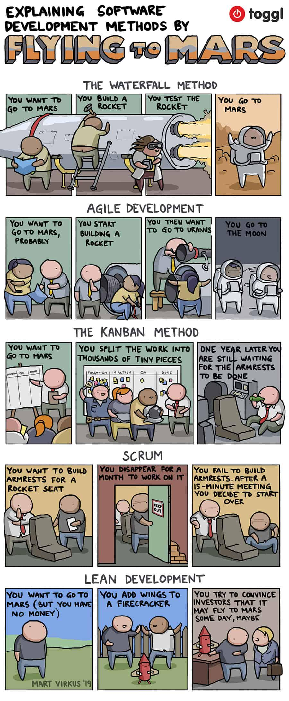

## 2026.0.x

> A patch version of the original version 2026.0.

- Web pages - cancelled [planned versions](redactor/webpages/history.md) are displayed in history with strikethrough and cannot be deleted (#58573).
- File Archive - modified background task for publishing files - due to rights it is not executed on public node (#246).
- Background jobs - added option to run [background job](admin/settings/cronjob/README.md) only on nodes in full configuration or on public nodes (#246).
- Primary Key Generator - added automatic correction of table names and primary value column names (#246).
- Security - fixed Local File Inclusion, upload file checking, and RCE bugs. Thanks to Josef Korbel (Citadelo) for reporting these vulnerabilities (#252).
- JPA - fixed multiple database transaction terminations during import redirection (#256).

## 2026.0.25

> A patch version of the original version 2026.0.

!> Warning: after the update, check the functionality of all forms. If any cannot be submitted, save its settings again.

- AI assistant - modified getting an answer when using `reasoning` in OpenAI (#244).
- AI assistant - added promotion of cache deletion to cluster nodes when editing the assistant.
- Apache Tomcat - in version `9.0.118/11.0.22` the behavior of obtaining a list of Java classes was changed, which results in a malfunction of `Stripes Framework`. The modified version filters out incorrect file versions so that the start is correct. You can directly transfer the [VFS.java](https://github.com/webjetcms/webjetcms/blob/main/src/main/java/net/sourceforge/stripes/vfs/VFS.java) class to an older project, compile it in your project and use it without the need for an update.
- Security - fixed the ability to set [HTTP header name for obtaining IP address](sysadmin/pentests/README.md#configuration) via the `xForwardedForHeader` variable.
- Security - fixed Local File Inclusion, upload file checking and RCE bugs. Thanks to Josef Korbel (Citadelo) for reporting these vulnerabilities (#252). A possible temporary solution without updating the entire WebJET CMS is:
  - delete or [update](https://github.com/webjetcms/webjetcms/blob/main/src/main/webapp/components/grideditor/phantom/phantom_sablona_ajax.jsp) file `/components/grideditor/phantom/phantom_sablona_ajax.jsp`
  - if you have WebJET CMS newer than `2025.52`, add the value `,/components/grideditor/phantom/` to the configuration variable `pathFilterBlockedPaths`
  - if you have WebJET CMS newer than `2025.52` you can [globally for the entire server](install/external-configuration.md) add the system variable to `JAVA_OPTS`:

```txt
-Dwebjet.pathFilterBlockedPaths=.DS_Store,debug.,config.properties,Thumbs.db,.git,.svn,/WEB-INF/,./,/components/grideditor/phantom/
```

- Security - added CSRF token for form when SPAM protection is disabled (#245).
- Security - each form submission checks the form settings in the database, if the form is not found, it cannot be submitted. The original version checked this only on public cluster nodes, now it is checked regardless of the cluster. If necessary, disable the functionality by setting the configuration variable `formAllowOnlyExistingFormsOnPublicNode` to the value `false` (#245).
- Security - fixed the possibility of obtaining an administrator account when generating an offline version (#245).
- Easy form - modified fields for entering field name and tooltip in a single-line WYSIWYG editor so that the result does not contain the `P` element (#244).
- Gallery - fixed database record creation when copying files in explorer. Record is not created for `o_` and `s_` images (#58317-9).
- Document Manager - added filtering of files by validity dates (if the date range is not valid, they will not be displayed) and files that do not have the display attribute set (#233).
- Video - updated library `videojs` for playing local audio/video files from version 6.2.0 to version 8.23.6 (#233).
- Video - fixed setting of link to local audio/video file when editing an already inserted application (#233).
- Performance - added index on table `emails` by `click_hash` for better performance in Oracle database (#244).
- Web pages - added display of `mp3` files in the Media of all pages/Videos selection (#233).
- Web pages - allowed to insert files of type `svg,webp,mp3` if the user does not have the Full menu right in the editor, the value set in the configuration variable `FCKConfig.UploadFileTypes[Basic][image]` (#233).

## 2026.0.18

> A patch version of the original version 2026.0.

- Administration - added redirection after login if the original path starts with `/components` and contains `/admin` (#58317-4).
- WebJET update - corrected links to documentation.
- Banner System - fixed loading of group list in Microsoft SQL.
- Security - added option [deactivate application](sysadmin/pentests/README.md#deactivation-applications) to make it unavailable. This allows you to disable applications such as System Backup, Restart, etc. if you are deploying a service via `CI-CD` and the applications are not used or are not desired for security reasons.
- Security - updated `Swagger UI` and exceptions for `dependencyCheckAnalyze` (#58317-6).
- Security - updated libraries `log4j,pdfbox,thymeleaf,postgresql` (#58317-6,#226).
- Security - added protection against brute force attacks on 2FA tokens. In case of unsuccessful attempts, the IP address will be temporarily blocked - the same as when logging in with a password (#222).
- Security - generated PDF files no longer contain information about the generator `PD4ML` in the `Creator/Producer` metadata. The value is taken from the `pdfAuthorName` configuration variable. Metadata cleaning is controlled by the `metadataCleanFiles` variable (default value `pdf-gen`) (#222).
- Security - fixed handling of empty password error (#222).
- Data tables - fixed the possibility of closing the editor in a nested modal window (#OSK303).
- Questionnaires - fixed saving of questionnaire when using Oracle or Microsoft SQL database (#217).
- Gallery - fixed saving gallery settings for a folder on disk (without a database entry) in Oracle DB.
- Gallery - added configuration variable `metadataRemoveMinFileSize` to set the minimum file size in bytes below which metadata removal will be skipped (#osk378).
- GDPR - data deletion - fixed deletion of forms in Oracle/PostgreSQL database (#224).
- Mass email - fixed recipient transfer when duplicating a campaign in Oracle DB (#54273-82).
- Mass email - fixed replacement of external links that contain multiple URL parameters in an email (#54273-83).
- Media - fixed permission check when adding media to an unsaved web page by a user without rights to all media (#58317-6).
- Document Manager - fixed deleting file index on save if file is no longer valid. Fixed initial SQL for setting file indexing if file should not be displayed (#227).
- Multiweb - fixed domain setting after login (#58317-03).
- Multiweb - fixed use of domain aliases when using external folders - set configuration variable `cloudStaticFilesDir` (#58317-4).
- Translation keys - fixed setting empty values ​​when creating a new record and indenting fields with the original value (#56845).
- Explorer - fixed uploading multiple files via drag & drop (#58317-2).
- Selectable fields - fixed display of values ​​(instead of ID) and filter (select field instead of text field) for select fields, dialers and website selection (#58421-0).
- Websites - fixed removal of diacritics when uploading an image to the editor via drag&drop (#58361).
- Websites - Page Builder - when creating a new page, the value set in the HTML code of the new folder page field will be used. So the page does not have to be empty, but can contain prepared blocks (#osk378).
- Websites - Block Settings - fixed background and advanced settings (#TB2456).
- Websites - fixed deleting folder from trash during multiweb installation (#58317-03).
- Websites - aligned getting template list between websites and folders (#58317-03).
- Websites - fixed transfer of publication dates in the website preview and redirection in block properties (#osk412).
- Websites - fixed error in obtaining [templates for mobile devices](frontend/templates/templates.md#display-for-specific-device) in MultiWEB installation when template names match in different domains (#58317-5).
- Web pages - fixed saving a page that has copies in multiple folders and page mirroring is used (#58317-7).
- Websites - Ninja - added attribute `${ninja.temp.lngIsoUnderscore}` with language mutation code in format `sk_SK` instead of `sk-SK` (#217).
- Websites - fixed closing tag `</link>`, correctly replaced with `/>`, since `link` is an empty element (#osk498).
- Websites - fixed bug with removing time component when setting event date (#54273-89).
- Websites - added option [set JavaScript function](frontend/setup/config.md) for `target="_blank"` links, defaulted to `return openTargetBlank(this, event)`. The value is set in the configuration variable `editorTargetBlankFunction`, if set to empty value `onclick` the function is not set (#225).

Jakarta version:

- Updated library `Spring Security` from version 6 to version 7 (#43144).

## 2026.0

> **WebJET CMS 2026.0** brings an improved version of the **Page Builder** tool for creating **complex websites**. Blocks can be **searched and filtered** based on tags, so you can easily find the right block to insert into your page. New features have been added such as **column splitting**, **inserting multiple sections at once** and **always-on button to add a new section** for quickly expanding your page content.
>
> Support for the **PICTURE element** allows you to display **different images based on the visitor's screen resolution**, improving the visual experience on different devices. Additionally, it is possible to insert **custom icons** defined in a common SVG file, which brings greater design flexibility.
>
> The new **form creation** tool allows you to easily create **multi-step forms** with the option of programmatic validation of individual steps and the option of **confirming the validity of the email address** using the sent code. This way you avoid filling out forms with various bots.

!> Warning: version **2026.0** is the last version for the Tomcat 9 application server using `javax namespace`. All newer versions from `2026.18` will be intended **only for** the **Tomcat 10/11** application server using `Jakarta namespace`. The change from `javax` to `jakarta namespace` is a consequence of the transfer of `Java EE` specifications from Oracle to `Open Source/Eclipse Foundation`, where the project continues under the name `Jakarta EE`. This change requires an update of the application server, since Tomcat 10 and later versions already use exclusively `jakarta namespace` for all `Java EE` APIs. The current list of available versions can be found in the [installation section](install/versions.md).

### Groundbreaking changes

- Updated libraries `commons-lang,displaytag`, more in [programmer section](#programmer section) (#58153).
- Changed behavior of Blocks icon in Page Builder mode - [text blocks integrated](frontend/page-builder/blocks.md) to folder `content` similar to blocks for `section, container, column` (#58165).
- Modified **file upload** processing `multipart/form-data`, more in [programmer section](#programmer section) (#57793-3).
- We recommend **checking the functionality of all forms** due to adjustments to their processing, more information in the [for programmers](#for-programmers) section (#58161).

### Websites

- Added the ability to insert a `PICTURE` element that displays [image based on screen resolution](frontend/setup/ckeditor.md#picture-element) of the visitor. So you can display different images on a mobile phone, tablet or computer (#58141).


- Added the ability to insert [custom icons](frontend/setup/ckeditor.md#svg-icons) defined in a shared SVG file (#58181).


- Added transfer of current HTML code when switching editor mode Standard/HTML/Page Builder. This allows you to easily edit a Page Builder page in HTML code and view the edits again in Page Builder mode (#58145).
- Added context menu Delete Element, with which you can easily delete a button, link, paragraph, form, section, etc. Just right-click on the element to display the context menu (#osk233).
- Page Builder - modified generation of styles when using the pencil tool. Only changed values ​​are generated in the CSS style, they are highlighted in the dialog box by a blue border around the input field (#58145).
- Page Builder - added ability to call [custom JavaScript file](frontend/page-builder/blocks.md#support-javascript-code) with support functions for editing code. Added ability to edit settings like selectors for elements, colors, etc. (#58141).
- Page Builder - modified anchor generation for tabs so that the anchor name is generated according to the tab name - it was originally not generated semantically as `autotabs-x-y` (#112).
- Page Builder - added option to set column width to `auto` for automatic content adjustment (#114).
- Page Builder - added option to prepare [text blocks](frontend/page-builder/blocks.md) directly into the `content` folder, they are inserted instead of the original blocks read from web pages from the Templates folder. The web designer prepares them together with other types of Page Builder blocks. Allows for quick insertion of frequently used text parts, buttons, etc. (#58165).
- Page Builder - when inserting a new block, the default is the Library tab instead of Basic to make it easier to select a block from the prepared list (#58165).
- Page Builder - added the ability to split a column into two parts using the new Split Column function. You can access it by clicking on the + in the yellow bar, selecting the Block option, and then selecting the Split Column option in the Basic tab. The function allows you to quickly split a column without having to insert a new column and move the content (#58165).
- Page Builder - added option to insert a block that contains multiple sections or other elements - all sections will be selected after insertion (#58173).
- Page Builder - added [Block ID](frontend/page-builder/blocks.md#block-id) to the `data-pb-id` attribute to enable searching for block usage on websites via search in the administration (#58193).
- Page Builder - the list of favorite blocks is saved separately for each user, so everyone can manage their own list of favorite blocks (#58193).
- Page Builder - added a persistent icon for adding a new section at the bottom of the page, making it easier to add new sections to a page (#58173).

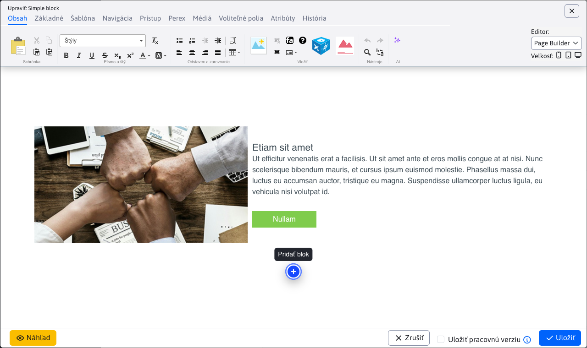

- Page Builder - modified toolbar design for better visibility on different backgrounds (#58165).


- Page Builder - added option to [filter blocks](frontend/page-builder/blocks.md#block-name-and-tags) by name and tags (#58173).

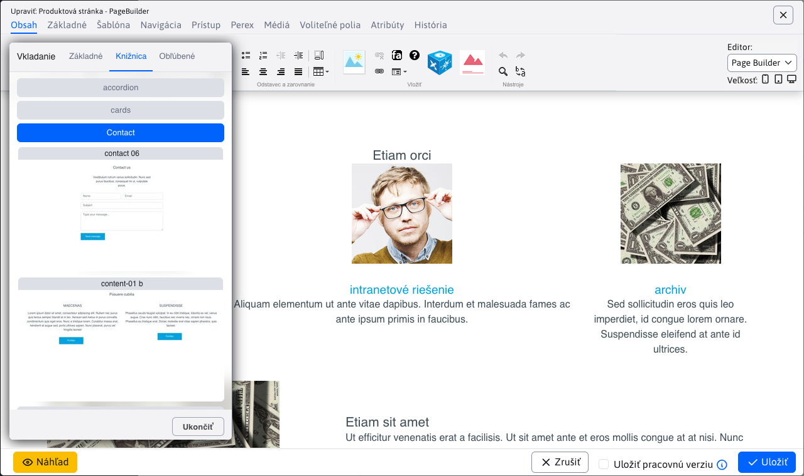

- Added [content change detection](redactor/webpages/working-in-editor/README.md#content-change-detection-page) and notification of unsaved changes when closing the browser window. Changes will start to be detected 5 seconds after opening the web page. (#112).
- Added the ability to set default values ​​for tables in CKEditor via configuration variables, more in [CKEditor settings section](frontend/setup/ckeditor.md#configuration-variables) (#58189).
- Added the option to insert [button](frontend/setup/ckeditor.md#button) - element `button`. You can easily insert various action `call to action` buttons (#58201).
- Style - [style selection](frontend/examples/template-bare/README.md#style-list-for-editor) defined for an element e.g. `p.paragraph-green,p.paragraph-red-border,p.paragraph-yellow-background` or `section.test-section,section.test-section-green` allows you to set multiple styles at the same time. Selecting an already set style again will remove this style (#OSK140).
- Changed the text for publishing a page in the future to **Schedule page change after this date**, when this option is selected, the save button will also change to the text **Schedule** for clearer information for the user (#58253).
- Added a list of changed fields to the website approval request (#58077).

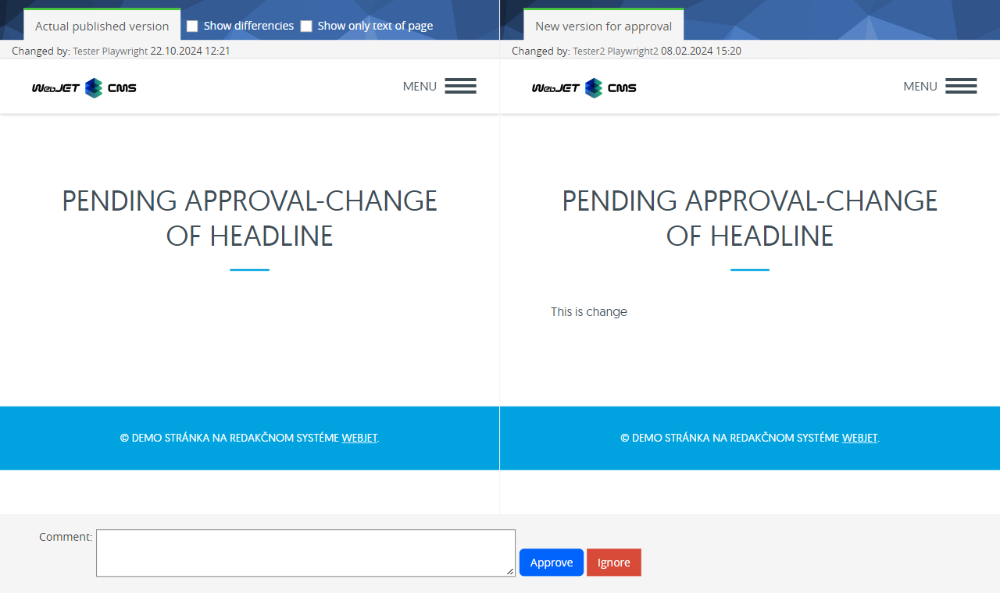

### Applications

Redesigned application properties settings in the editor from the old code in `JSP` to `Spring` applications. Applications automatically also gain the ability to set [display on devices](custom-apps/appstore/README.md#conditional-display-applications). The design is consistent with the rest of the WebJET CMS and data tables (#58073).

- [News] (redactor/apps/news/README.md)

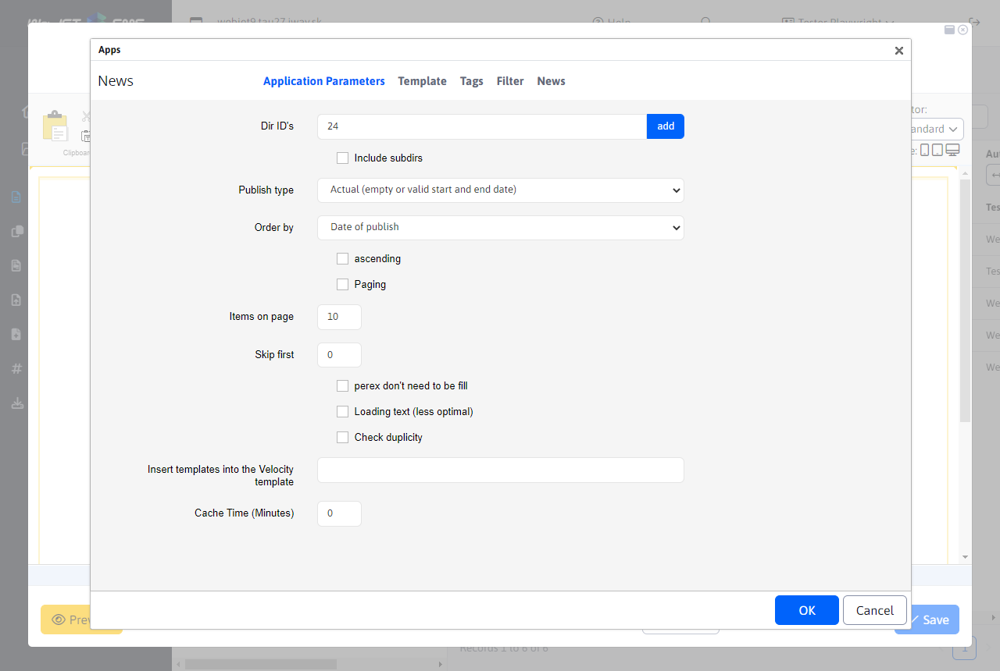

- [Form Simple](redactor/apps/formsimple/README.md)

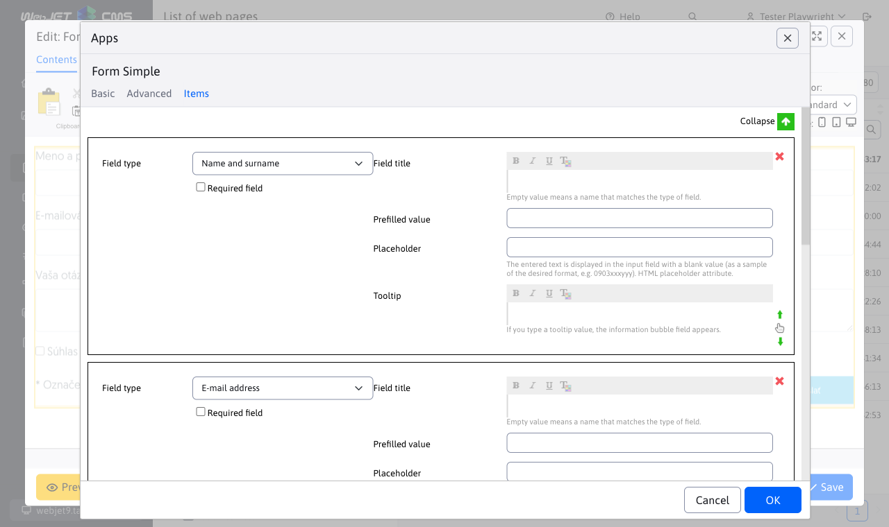

### Forms

- A new way to create forms that can contain [multi-steps](redactor/apps/multistep-form/README.md) with advanced features. In the forms list, you can create a new form, to which you can then add individual items and possibly multiple steps. The form item tab is visible in the form details of the Multi-Step Form type (#58161).

<div class="video-container">
    <iframe width="560" height="315" src="https://www.youtube.com/embed/XRnwipQ-mH4" title="YouTube video player" frameborder="0" allow="accelerometer; autoplay; clipboard-write; encrypted-media; gyroscope; picture-in-picture" allowfullscreen></iframe>
</div>

- List of forms - the entire section has been converted from `Vue.js` technology to standard `Html + JavaScript` for better integration into WebJET CMS and easier editing (#58161).
- List of forms - enabled creation of a form that is automatically of type [multistep form](redactor/apps/multistep-form/README.md) (#58161).
- List of forms - enabled setting of parameters/attributes of all form types directly in the form editor (#58161).
- List of forms - the note field allows you to insert formatted text, so you can better record additional information about the form (#58161).
- Form detail - added option to display all data of the logged-in user, data is also exported to Excel (#58161).
- Verification code - added option to submit form only after entering [verification code](redactor/apps/form/README.md#setting-up-confirmation-by-sent-code) sent to email address. This way you can better protect forms from SPAM (#58161).

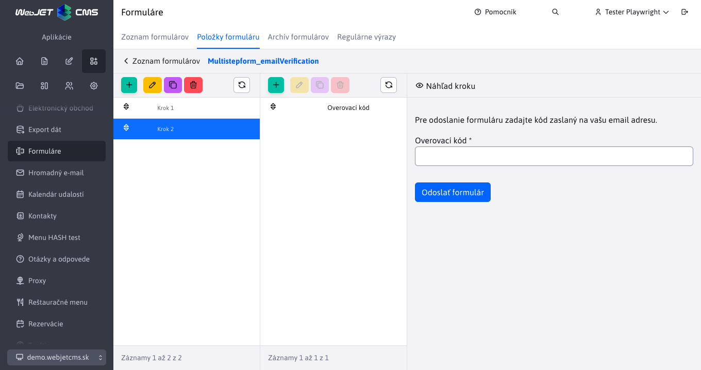

### Redirections

- Added the ability to expire a redirect at a specified time and the ability to enter a note with information about what the redirect is for. Redirects that are no longer valid will be displayed in red (#58105).

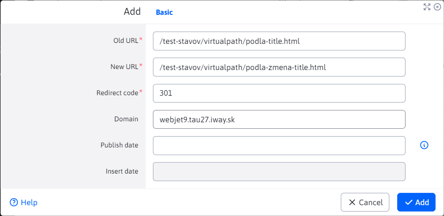

### E-commerce

- The new section [Delivery Methods] (redactor/apps/eshop/delivery-methods/README.md), as a separate table, replaces the original configuration of available delivery methods, which was located directly in the settings of the **e-commerce** application. For each delivery method, it is also possible to set a price, which will be automatically added to the order when the option is selected. The set delivery methods will also be automatically reflected in the options when creating an order by the customer. Delivery by mail and personal pickup are ready, in the future we plan to add integration with delivery companies (#58061).


### Safety

- Added support for allowing only **one active login** per user. To enable the mode, set the configuration variable `sessionSingleLogon` to the value `true`. Upon a new login, the previous active `session` will be canceled (#58121).
- Removed unsupported library [commons-lang](https://mvnrepository.com/artifact/commons-lang/commons-lang), replaced with new library [commons-lang3](https://mvnrepository.com/artifact/org.apache.commons/commons-lang3), in `update-2023-18.jsp` there is an update script for editing source codes (#58153).
- Added [My active logins] list (redactor/admin/welcome.md#moje-aktivne-prihlaženia) on the administration home screen, which displays all active logins to the administration under your user account and the option to end them. Also added the option to send an email to the logged in administrator (#58125).


- Captcha - by setting the configuration variable `captchaType` to the value `none`, Captcha can be completely disabled. It will not be displayed even if the template of the displayed web page has SPAM protection disabled. In such a case, however, it is necessary to correctly check the disabling of SPAM protection of the template also in the possible code for processing/verifying the Captcha response, this check is provided for forms. You can use the call `Captcha.isRequired(component, request)` to verify the mode and disable spam protection (#54273-78).
- Updated the [sending emails] library (install/config/README.md#sending-emails) from `com.sun.mail:javax.mail:1.6.2` to `com.sun.mail:jakarta.mail:1.6.8` to support new SMTP server authentication mechanisms such as `NTLMv2` and added a configuration variable `smtpAuthMechanism` to force the use of an authorization mechanism - set it to `NTLM` for example to force `NTLM` authorization instead of `BASIC` authorization (#58153).
- Modified logging of exceptions when HTTP connection is interrupted (e.g. when closing the browser, going to another web page, etc.). Such exceptions are not written to the log to avoid a space allocation error. This applies to exceptions of type `IOExceptio` and exception names defined via the configuration variable `clientAbortMessages`, by default `response already,connection reset by peer,broken pipe,socket write error` (#58153).

### Other minor changes

- Search - modified loading of the template list when searching for web pages. All templates are loaded regardless of their availability in folders, so that a template is not available when editing a web page (#58073).
- HTTP headers - added option to set header longer than 255 characters, for example for setting `Content-Security-Policy` ([#82](https://github.com/webjetcms/webjetcms/issues/82))

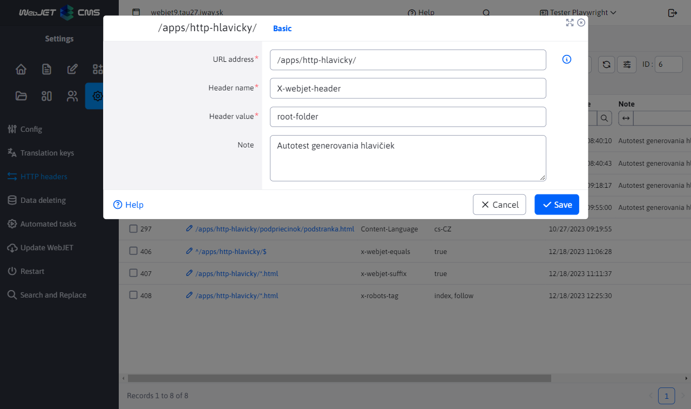

- Configuration - modified way to delete a configuration variable. After deletion, the original value from `Constants` is automatically set to the same value as it will be after a server restart. In the original solution, the variable was only deleted, but its value remained internally set until the server restart (#57849).
- Configuration - added option to set [HTTP header name](sysadmin/pentests/README.md#configuration) to get visitor's IP address via configuration variable `xForwardedForHeader` (#58237).
- Security - added the ability to configure blocked file/directory paths via the `pathFilterBlockedPaths` variable. By default, URLs that contain the term `.DS_Store,debug.,config.properties,Thumbs.db,.git,.svn` in the name are blocked. It is possible to add more as needed (#PR103).
- Tags - modified displayed tags, in case of duplicate values. Comparison is without the influence of diacritics and upper/lower case [#115](https://github.com/webjetcms/webjetcms/issues/115).


- Mirroring - added option to display flag image instead of text in [page language switcher](redactor/apps/docmirroring/README.md#creating-a-link-to-language-mutations-in-the-page-header) (#54273-79).
- Password change - added option to set the name and email address from which the email with a link to change the password is sent via configuration variables `passwordResetDefaultSenderEmail` and `passwordResetDefaultSenderName` (#58125).
- Statistics - added summary numbers of views and visits to TOP pages (#PR136).
- News - renamed value sort by priority to sort by Sort order (priority) to align with value in editor (#57667-16).
- Easy form - added option to set the value `useFormDocId` for inserting the form, e.g. in the footer of the page (#57667-16).
- News / News Templates - moved field `contextClasses` from News application to News Template so that the property is set directly in the news template. The original value `contextClasses` from News will still work, but it can no longer be set in the user interface (#58245).
- Document Manager - added option [edit historical document version metadata](redactor/files/file-archive/README.md#edit-historical-document-version-in-manager) in the document manager (#58241).
- Bulk email - adjusted auditing of changes in the campaign. If a group is added, the entire list of recipients is not audited (there were unnecessarily many records in the audit), only the list of changed groups is written. When manually adding emails, both the name and email address are still audited (#58249).
- Users - when importing, if the column in Excel does not contain a password field, a random password will be generated for new users. If the Approved User status is not specified in Excel, it will be set to the value `true` (#58253).
- MultiWeb - added domain display in the sidebar (#58317-0).
- MultiWeb - added option to set redirection domain to allow entering `https://` prefix (#58317-0).
- MultiWeb - added rights control for media groups and brands (#58317-0).
- List of forms - setting up [form handler](custom-apps/apps/multistep-forms/README.md), using the autocomplete field provided by classes implementing `FormProcessorInterface` (#58313).
- Codebooks - added removal of spaces at the beginning and end of string fields in codebook data (#OSK233).

### Bug fixes

- Tags - fixed folder duplication in Show for when saving a tag, removed folder selection from other domains as tags are already separated by domain (#58121).
- Web pages - fixed inserting a hard space after hyphens so that it only applies to the page text and not to attributes or HTML tags (#OSK235).
- Datatables - fixed handling of the `Enter` event for selected input fields of table filters (#58313).
- Datatables - fixed filtering where multiple `serverSide:false` tables on a page were affecting each other when filtering (#58313).
- E-commerce - fixed sending email notifications when changing order status (#58313).
- E-commerce - fixed automatic setting of order status after changing payments (#58313).

### Documentation

- Updated all screenshots in the Czech version of the documentation (#58113).

### For the programmer

- Free fields - added the ability to specify custom columns for label and value when [linking to a codebook](frontend/webpages/customfields/README.md#codebook). Allows for more flexible settings of which property from the codebook will be used as the displayed text and which as the stored value (#PR108).
- Deleted unused files `/admin/spec/gallery_editor_perex_group.jsp,/admin/spec/perex_group.jsp`, if you use them in your project, take them from [older version](https://github.com/webjetcms/webjetcms/tree/release/2025.40/src/main/webapp/admin/spec) WebJET CMS (#58073).
- Slightly modified API in [NewsActionBean](../../src/main/java/sk/iway/iwcm/components/news/NewsActionBean.java), mainly `groupIds` settings which are now of type `List<GroupDetails>`. You can use `setGroupIds(int[] groupIds)` for settings with an ID field of values ​​(#58073).
- Fixed the ability to insert quotes into application parameters (#58117).
- Ready-made containers for all supported database servers in WebJET CMS for easy launch in VS Code. They are located in the `.devcontainer/db` folder (#58137).
- E-commerce - due to changes in the implementation process of **delivery methods**, it is necessary to edit the file using the update script `update-2023-18.jsp` above the section `basket` (#58061).
- E-commerce - renamed annotation `@PaymentMethod` to `@FieldsConfig` and `@PaymentFieldMapAttr` to `@FieldMapAttr` to unify annotations between payments and delivery methods (#58061).
- E-commerce - During the **delivery methods** implementation process, several changes were added to the `order_form.jsp` file that you must implement manually. These changes are too complex to be implemented using the `update-2023-18.jsp` update script (#58061).
- Navigation bar - added the ability to use your own implementation of the [navigation bar] generator (redactor/apps/navbar/README.md). The name of the class implementing `navbarDefaultType` can be set via the configuration variable `NavbarInterface` (#PR101).
- Removed unsupported library [commons-lang](https://mvnrepository.com/artifact/commons-lang/commons-lang), replaced with new library [commons-lang3](https://mvnrepository.com/artifact/org.apache.commons/commons-lang3), in `update-2023-18.jsp` there is an update script for editing source codes (#58153).
- Updated the [displaytag](https://mvnrepository.com/artifact/com.github.hazendaz/displaytag) library to version `2.9.0` (#58153).
- Fixed handling of `multipart/form-data` file uploads. In Spring applications, instead of `org.apache.commons.fileupload.FileItem`, use `org.springframework.web.multipart.MultipartFile` directly for the file field, which will be set automatically. It is no longer necessary to use a call like `entity.setDocument(MultipartWrapper.getFileStoredInRequest("document", request))` to get the file. **Warning:** you need to replace all occurrences of `CommonsMultipartFile` with `MultipartFile` in your code, and also remove URL parameters in the Spring application for forced processing. Replace the expression `data-th-action="@{${request.getAttribute('ninja').page.urlPath}(\_\_forceParse=1,\_\_setf=1)}"` with `data-th-action="${request.getAttribute('ninja').page.urlPath}"`. You can use `/admin/update/update-2023-18.jsp` to update files (#57793-3).
- Added the ability to create [project copies of files](frontend/customize-apps/README.md) for Spring applications. Just create your own version of the file in the `/apps/INSTALL_NAME/` folder, similar to what is used for JSP files. WebJET CMS first looks for the file in the project folder and if it is not found, it uses the standard file from the `/apps/` folder (#58073).
- Added the option to set [CSS style name](frontend/examples/template-bare/README.md) in the CSS file via the `/* editor title: Style Name */` comment. The name will be displayed in the style list in the editor (#58209).
- Editor - modified dialog for `a.btn` settings - canceled color and size settings, [only CSS classes are used](frontend/setup/ckeditor.md#button) same as for `button` (#57657-16).
- Data tables - option to display only the icon without a sequence for `rowReorder` if we add the class `icon-only` to the given column (#58161).
- Data tables - new options for selecting rows in the `toggleSelector` and `toggleStyle` tables, more in the [data tables section](developer/datatables/README.md#configuration-options) (#58161).
- Datatables - new custom [render](developer/datatables-editor/datatable-columns.md) function option using the `@DataTableColumn(...renderFunction = "renderStepName")` annotation. This will allow you to display composite values ​​from multiple fields in a column, etc. (#58161).
- Data tables - added option to [redirect user](developer/datatables/restcontroller.md#redirect-after-save) to another page after saving a record by calling the `setRedirect(String redirect)` method (#58161).
- Forms - Modified form list display, class `FormAttributesDB` removed, replaced with class `FormService`. Form settings changed from table `form_attributes` to table `form_settings`. We recommend verifying the functionality of all forms on the website after the update (#58161).
- Forms - creating a new table `form_settings` to replace the table `form_attributes`, where form properties are stored. Individual attributes (settings) are now stored in separate columns as one record per row. The data was converted to the new table using `UpdateDatabase.java` (#58161).
- Switch to a new table `form_settings` for form properties in `.jsp` files. You need to run the update script `update-2025-0.jsp`, which will edit the necessary `.jsp` (#58161).
- List of forms - setting parameters/attributes of all form types redirected from table `form_attributes` to new table `form_settings` (#58161).
- Data tables - added BE support for `row-reorder`, where it is possible to change the order of records directly in the data table using drag&drop (#58161).
- Events - added event [Update codes in text](developer/backend/events.md#update-codes-in-text) for the ability to edit codes in the text of the page like `!CUSTOM_CODE!` and the like (#54273-63).
- Data tables - added [Spring events](developer/backend/events-datatable.md) for data editing in customer installations (#54273-63).

### Testing

- Added script [rm-same-images.sh](../../src/test/webapp/rm-same-images.sh) to remove identical images when creating new screenshots (#58113).


