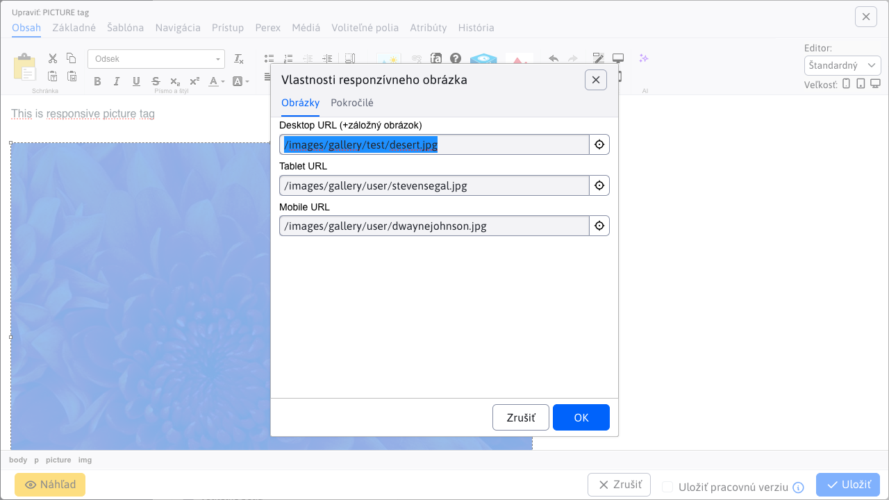
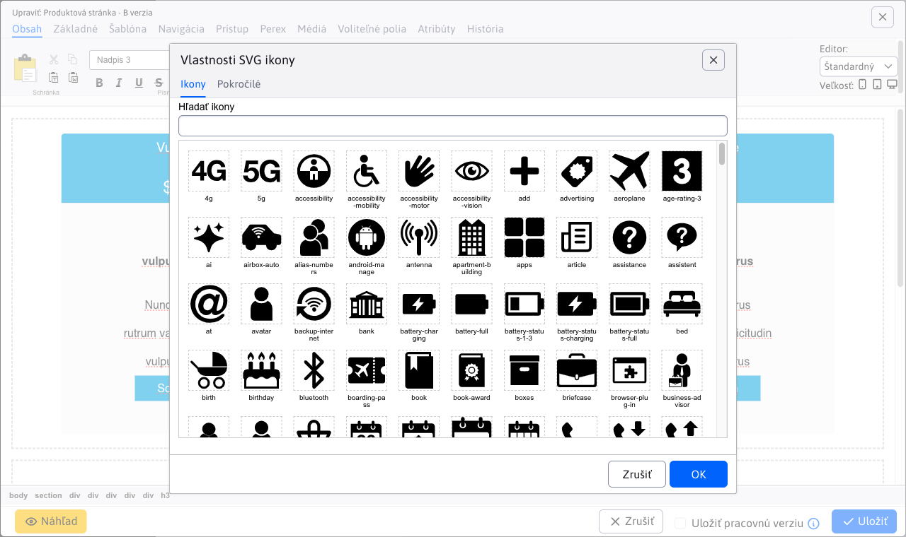
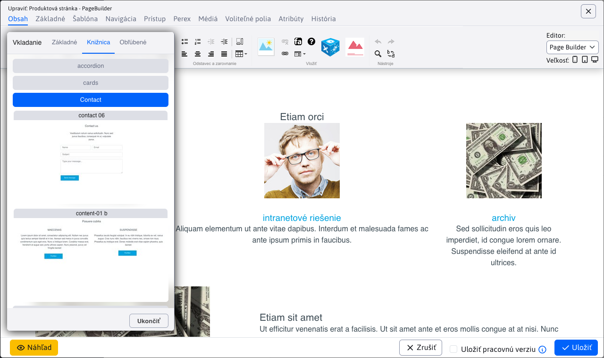
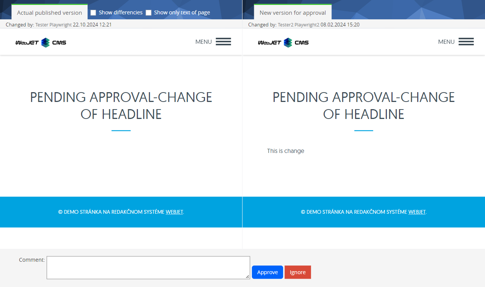
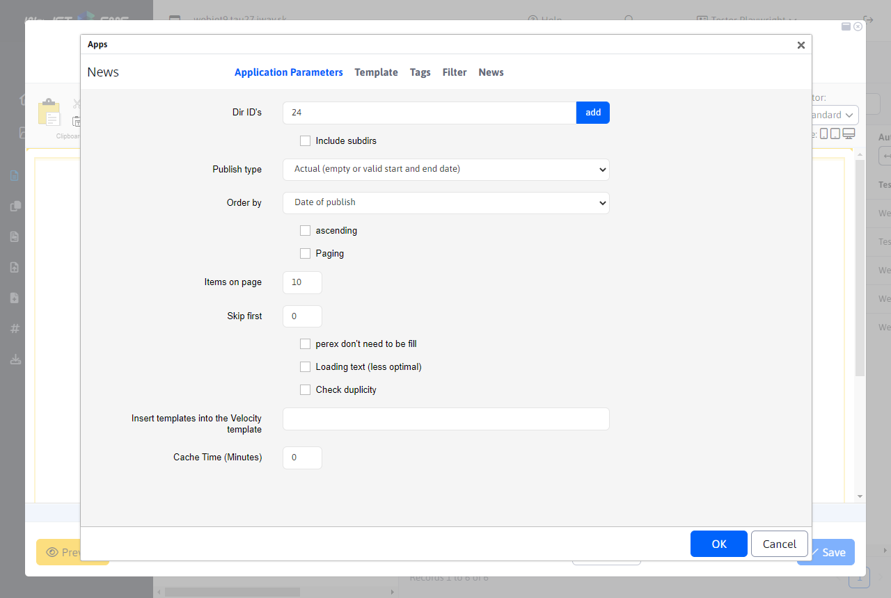
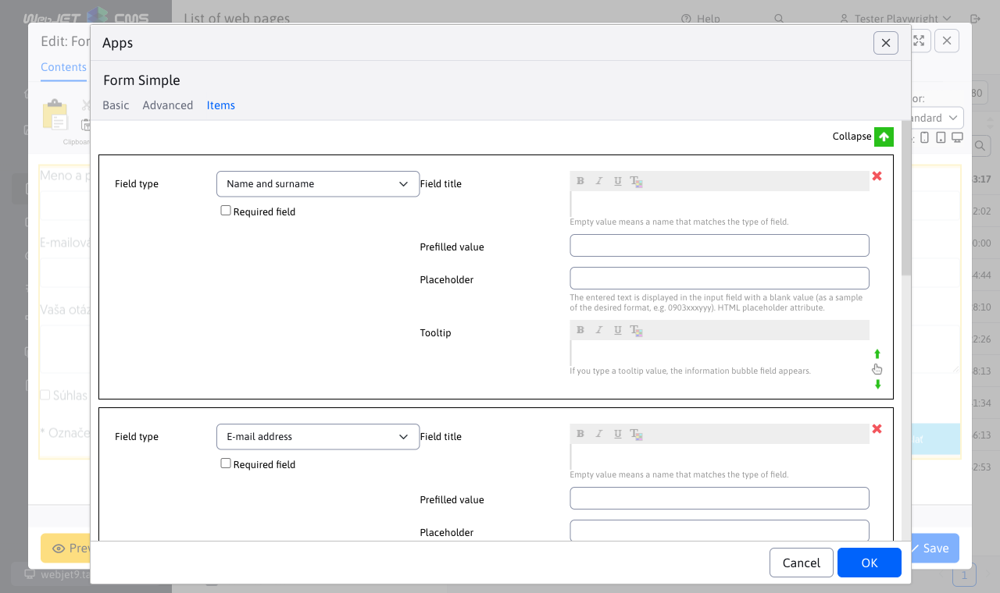
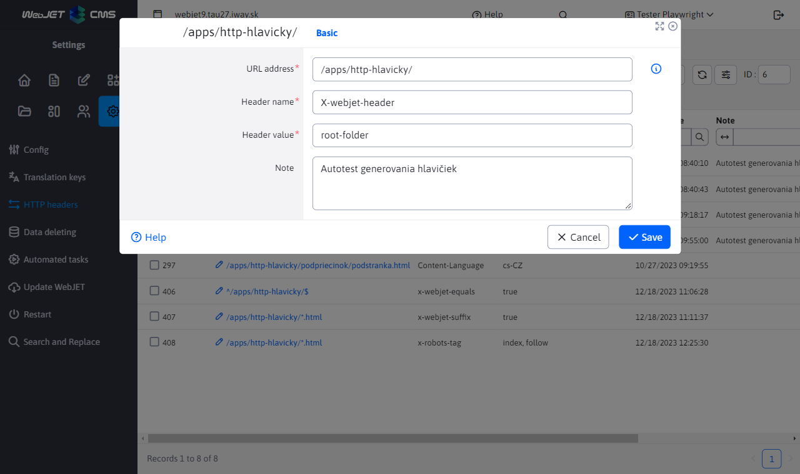

# WebJET CMS 2025

Welcome to the documentation for WebJET CMS version 2025. We recommend to read [list of changes](CHANGELOG-2025.md) a [roadmap](ROADMAP.md).

## List of changes in version 2025.52/SNAPSHOT

> **WebJET CMS 2025.52/SNAPSHOT** brings an improved version of the tool **Page Builder** for the creation of **complex web pages**. In blocks it is possible **search and filter** based on tags, so you can easily find the appropriate block to insert into the page. New features have been added such as **column division**, **inserting multiple sections at once** a **button to add a new section still displayed** to quickly expand the page content.
>
> Support **PICTURE element** allows you to display **different images according to screen resolution** visitor, thus improving the visual experience on different devices. In addition, it is possible to embed **custom icons** defined in a common SVG file, which brings more flexibility in design.
>
> A new tool for **creation of forms** makes it easy to create **multi-step forms** with the possibility of programmatic validation of individual steps and the possibility of **confirmation of the validity of the email address** using the code sent. This avoids the forms being filled in by various robots.

### Groundbreaking changes

- Updated libraries `commons-lang,displaytag`, more in [section for the programmer](#for-the-programmer) (#58153).
- Changed behaviour of the Blocks icon in Page Builder mode - [text blocks integrated](frontend/page-builder/blocks.md) to the folder `content` similar to the blocks for `section, container, column` (#58165).
- Modified processing **uploading files**, more in `multipart/form-data` section for the programmer[ (#57793-3).](#pre-programátora) Recommended&#x20;
- check the functionality of all form&#x73;**&#x20;due to modifications in their processing, for more information see&#x20;**&#x66;or the programmer[ (#58161).](#pre-programátora) Website

### Added the ability to insert&#x20;

- &#x20;element that displays `PICTURE` image by screen resolution[ visitor. So you can view different images on your mobile phone, tablet or computer (#58141).](frontend/setup/ckeditor.md#picture-element) Added the ability to insert&#x20;

- custom icons[ defined in the common SVG file (#58181).](frontend/setup/ckeditor.md#svg-ikony) Added transfer of actual HTML code when switching the editor mode to Standard/HTML/Page Builder. So you can easily edit a Page Builder page in HTML code and view the edits again in Page Builder mode (#58145).

- Added Delete Element context menu to easily delete a button, link, paragraph, form, section, etc. Just right click on the element to see the context menu (#osk233).
- Page Builder - modified stylesheet generation when using the pencil tool. Only changed values are generated to the CSS style, they are highlighted in the dialog by blue border of the input field (#58145).
- Page Builder - added calling option&#x20;
- custom JavaScript file[ with support functions for code editing. Added ability to edit settings like selectors for elements, colors, etc (#58141).](frontend/page-builder/blocks.md#podporný-javascript-kód) Page Builder - modified anchor generation for tabs so that the anchor name is generated according to the tab name - originally it was generated non-semantically as&#x20;
- &#x20;(#112).`autotabs-x-y`Page Builder - added option to set column width to&#x20;
- &#x20;for automatic content customization (#114).`auto`Page Builder - added option to prepare&#x20;
- text blocks[ directly to the folder ](frontend/page-builder/blocks.md), they are inserted instead of the original blocks read from web pages from the Templates folder. The web designer prepares them together with other types of Page Builder blocks. Allows quick insertion of frequently used text sections, buttons, etc (#58165 `content`Page Builder - when inserting a new block, the Library tab is defaulted instead of Basic to make it easier to select a block from the prepared list (#58165).
- Page Builder - added the ability to split a column into two parts using the new Split Column function. You invoke it by clicking the + in the yellow bar, selecting Block, and then selecting Split Column in the Basic tab. The function allows you to quickly split a column without having to insert a new column and move the contents (#58165).
- Page Builder - added the ability to insert a block that contains multiple sections or other elements - all sections are marked after inserting (#58173).
- Page Builder - supplemented&#x20;
- Block ID[ to the attribute ](frontend/page-builder/blocks.md#block-id) for the ability to search for block usage in web pages via the administration search (#58193 `data-pb-id`Page Builder - the list of favorite blocks is stored separately for each user, so that everyone can manage their own list of favorite blocks (#58193).
- Page Builder - added a permanently displayed icon to add a new section at the bottom of the page, making it easier to add new sections to the page (#58173).
- Page Builder - modified toolbar design for better visibility on different backgrounds (#58165).

- Page Builder - added option&#x20;

- filter blocks[ by name and tags (#58173).](frontend/page-builder/blocks.md#názov-a-značky-bloku) Supplemented by&#x20;

- content change detection[ and notification of unsaved changes when you close the browser window. Changes are detected 5 seconds after the web page is opened. (#112).](redactor/webpages/working-in-editor/README.md#detekcia-zmeny-obsahu-stránky) Added option to set default values for tables in CKEditor via configuration variables, more in&#x20;
- CKEditor settings section[ (#58189).](frontend/setup/ckeditor.md#konfiguračné-premenné) Added the ability to insert&#x20;
- button[ - element ](frontend/setup/ckeditor.md#button). You can so easily insert different action `button` buttons (#58201).`call to action`Style -&#x20;
- choice of style[ defined for the element e.g. ](frontend/examples/template-bare/README.md#list-of-styles-for-editor) or `p.paragraph-green,p.paragraph-red-border,p.paragraph-yellow-background` allows you to set multiple styles at the same time. Repeatedly selecting an already set style will remove that style (#OSK140).`section.test-section,section.test-section-green`Edited text for future publication of the page on&#x20;
- Schedule a page change after this dat&#x65;**, selecting this option will also change the save button to text&#x20;**&#x53;chedul&#x65;**&#x20;for clarity for the user (#58253).**&#x41;dded list of changed fields (#58077) to the web site approval application.
- Applications

### Redesigned application properties settings in the editor from the old code in&#x20;

&#x20;at `JSP` Application. Apps also automatically get the ability to set `Spring` display on devices[. The design is consistent with the rest of the WebJET CMS and data tables (#58073).](custom-apps/appstore/README.md#podmienené-zobrazenie-aplikácie) News
- [Form easily](redactor/apps/news/README.md)

- [Forms](redactor/apps/formsimple/README.md)

### A new way to create forms that can include&#x20;

- more steps[ with advanced features. In the list of forms you can create a new form, to which you can then add individual items and possibly multiple steps. The form item tab is visible in the form detail of the Multistep form type (#58161).](redactor/apps/multistep-form/README.md) List of forms - the whole section has been redesigned from technology&#x20;

- &#x20;to standard `Vue.js` for better integration into WebJET CMS and simplified editing (#58161).`Html + JavaScript`List of forms - enables the creation of a form that is automatically of type&#x20;
- multi-step form[ (#58161).](redactor/apps/multistep-form/README.md) List of forms - allows setting parameters/attributes of all form types directly in the form editor (#58161).
- List of forms - the note field allows you to insert formatted text, so you can better record additional information to the form (#58161).
- Form Detail - added option to display all logged in user data, data is also exported to Excel (#58161).
- Authentication code - added option to submit form after entry&#x20;
- authentication code[ sent to the email address. This way you can better protect your forms from SPAM (#58161).](redactor/apps/form/README.md#nastavenie-potvrdenia-zaslaným-kódom) Redirections

### Added the ability to end the redirection at a specified time and the ability to enter a note with information about what the redirection is for. Redirects that are no longer temporarily valid are displayed in red (#58105).

- Ecommerce

### New section&#x20;

- Methods of delivery[, as a separate table, replaces the original configuration of available delivery methods, which was located directly in the application settings ](redactor/apps/eshop/delivery-methods/README.md) e-commerc&#x65;**. It is also possible to set a price for each delivery method, which will be automatically added to the order when the option is selected. Set delivery methods are also automatically reflected in the options when the customer creates an order. Delivery by mail and personal pickup are ready, we plan to add integration to delivery companies in the future (#58061).**&#x53;ecurity

### Added support for enabling only&#x20;

- one active logi&#x6E;**&#x20;per user. You enable the mode by setting the configuration variable&#x20;**&#x20;to the value of `sessionSingleLogon`. A new login will cancel the previously active `true` (#58121).`session`Unsupported library removed&#x20;
- commons-lang[, replaced by a new library ](https://mvnrepository.com/artifact/commons-lang/commons-lang) commons-lang3[, v ](https://mvnrepository.com/artifact/org.apache.commons/commons-lang3) is an update script for editing source code (#58153).`update-2023-18.jsp`Added list&#x20;
- My active logins[ on the administration splash screen, which shows all active logins to administration under your user account and the option to exit them. Also added the ability to send an email to a logged in administrator (#58125).](redactor/admin/welcome.md#moje-aktívne-prihlásenia) Captcha - by setting a configuration variable&#x20;

- &#x20;to the value of `captchaType` Captcha can be turned off completely. It will not be displayed even if the template of the displayed web page has SPAM protection disabled. In this case, however, it is necessary to correctly check that the SPAM protection of the template is turned off in the eventual processing/verification code of the Captcha response, for forms this check is ensured. You can use the call `none` to verify the mode and disable spam protection (#54273-78).`Captcha.isRequired(component, request)`Updated library for&#x20;
- sending emails[ z ](install/config/README.md#sending-emails) at `com.sun.mail:javax.mail:1.6.2` due to support for new SMTP server authentication mechanisms such as `com.sun.mail:jakarta.mail:1.6.8` and added configuration variable `NTLMv2` to force the use of the authorization mechanism - e.g. set to `smtpAuthMechanism` for enforcement `NTLM` authorisation instead of using `NTLM` Authorization (#58153 `BASIC`Modified exception logging when HTTP connection is interrupted (e.g. when closing the browser, going to another web page, etc.). Such exceptions will not be logged to avoid space occupation errors. This applies to exceptions of the type&#x20;
- &#x20;and exception names defined via the configuration variable `IOExceptio`, by default `clientAbortMessages` (#58153).`response already,connection reset by peer,broken pipe,socket write error`Other minor changes

### Search - modified loading of template list when searching for web pages. All templates are loaded regardless of their availability in folders, so that when editing a web page, the template is not available (#58073).
- HTTP headers - added the ability to set a header longer than 255 characters, for example to set&#x20;
- &#x20;(`Content-Security-Policy`#82[)](https://github.com/webjetcms/webjetcms/issues/82) Configuration - modified method of deleting a configuration variable. After deleting, the original value is automatically set from&#x20;

- to be the same as it will be after the server restart. In the original solution, the variable was just deleted, but its value remained set internally until the server restart (#57849).`Constants`Configuration - added option to set&#x20;
- HTTP header name[ to get the IP address of the visitor via the configuration variable ](sysadmin/pentests/README.md#Configuration) (#58237).`xForwardedForHeader`Security - added the ability to configure blocked file/directory paths via a variable&#x20;
- . By default, URLs that contain the phrase in the name are blocked `pathFilterBlockedPaths`. More can be added as needed (#PR103).`.DS_Store,debug.,config.properties,Thumbs.db,.git,.svn`Tags - modified tags displayed, in case of duplication of values. Comparison is without the influence of diacritics and upper/lower case letters&#x20;
- #115[.](https://github.com/webjetcms/webjetcms/issues/115) Mirroring - added option to display flag image instead of text in&#x20;

- page language switcher[ (#54273-79).](redactor/apps/docmirroring/README.md#vytvorenie-odkazu-na-jazykové-mutácie-v-hlavičke-stránky) Change password - added option to set name and email address from which email is sent with link to change password via configuration variables&#x20;
- &#x20;a `passwordResetDefaultSenderEmail` (#58125 `passwordResetDefaultSenderName`Statistics - added summary numbers of views and visits in TOP pages (#PR136).
- News - renamed the Arrange by Priority value to Arrange by Order of Order (Priority) to align with the value in the editor (#57667-16).
- Form easily - added option to set value&#x20;
- &#x20;to insert the form e.g. in the footer of the page (#57667-16).`useFormDocId`News / News templates - moved field&#x20;
- &#x20;from the News app to the News Template to set the property directly in the news template. Original value `contextClasses` from News will still work, but it can no longer be set in the UI (#58245).`contextClasses`Document Manager - added option&#x20;
- edit the metadata of the historical version of the document[ in the document manager (#58241).](redactor/files/file-archive/README.md#úprava-historickej-verzie-dokumentu-v-manažéri) Bulk email - modified auditing of campaign changes. If a group is added it doesn't audit the entire recipient list (it was wasting a lot of records in the audit), only the list of changed groups is written. When manually adding emails, both name and email address (#58249) are still audited.
- Users - when importing, if a column in Excel does not contain a password field, a random password will be generated for new users. If the status Approved user is not specified in Excel, it is set to&#x20;
- &#x20;(#58253 `true`MultiWeb - added domain display in sidebar (#58317-0).
- MultiWeb - added the ability to set the redirect domain to be able to specify&#x20;
- &#x20;prefix (#58317-0 `https://`MultiWeb - added rights control for media groups and tags (#58317-0).
- List of forms - settings&#x20;
- the processor of the forms[, using an autocomplete field that offers a class implementing ](custom-apps/apps/multistep-forms/README.md) (#58313 `FormProcessorInterface`Dialers - added removal of spaces at the beginning and end of the string type field in the dialer data (#OSK233).
- Error correction

### Tags - fixed folder duplication in View for when saving tags, removed folder selection from other domains since tags are already separated by domain (#58121).
- Web pages - fixed hard space insertion after hyphens to apply only to page text and not to attributes or HTML tags (#OSK235).
- Datatables - corrected event processing&#x20;
- &#x20;for selected filter table input fields (#58313).`Enter`Datatables - fixed filtering when multiple&#x20;
- &#x20;tables on the page interacted with each other when filtering (#58313 `serverSide:false`Ecommerce - corrected sending email notification when order status changes (#58313).
- Ecommerce - corrected automatic order status setting after payment change (#58313).
- Documentation

### Updated all screenshots in the Czech version of the documentation (#58113).

- For the programmer

### Free fields - added the ability to specify custom columns for label and value at&#x20;
- links to the dial[. Allows more flexible setting of which property from the code list is used as displayed text and which is used as a stored value (#PR108).](frontend/webpages/customfields/README.md#číselník) Deleted unused files&#x20;
- , if you use them in your project take them from `/admin/spec/gallery_editor_perex_group.jsp,/admin/spec/perex_group.jsp` older versions[ WebJET CMS (#58073).](https://github.com/webjetcms/webjetcms/tree/release/2025.40/src/main/webapp/admin/spec) Slightly modified API in&#x20;
- NewsActionBean[, especially the setting ](../../src/webjet8/java/sk/iway/iwcm/components/news/NewsActionBean.java) which are now of the type `groupIds`. You can use `List<GroupDetails>` for the setting with the value ID field (#58073 `setGroupIds(int[] groupIds)`Fixed ability to insert quotes in application parameters (#58117).
- Prepared containers for all supported database servers in WebJET CMS for easy running in VS Code. They are located in the folder&#x20;
- &#x20;(#58137).`.devcontainer/db`E-commerce - due to changes in the implementation process&#x20;
- delivery method&#x73;**&#x20;the file needs to be modified using an update script&#x20;**&#x20;above the section `update-2023-18.jsp` (#58061).`basket`E-commerce - renamed annotation&#x20;
- &#x20;at `@PaymentMethod` a `@FieldsConfig` at `@PaymentFieldMapAttr` to unify annotations between payments and delivery methods (#58061).`@FieldMapAttr`E-commerce - in the process of implementation&#x20;
- delivery method&#x73;**&#x20;to the file&#x20;**&#x20;There are a few changes that you have to implement manually. These changes are too complex to be added using the update script `order_form.jsp` (#58061).`update-2023-18.jsp`Navigation bar - added option to use custom generator implementation&#x20;
- navigation bar[. Via the configuration variable ](redactor/apps/navbar/README.md) it is possible to set the name of the class implementing `navbarDefaultType` (#PR101).`NavbarInterface`Unsupported library removed&#x20;
- commons-lang[, replaced by a new library ](https://mvnrepository.com/artifact/commons-lang/commons-lang) commons-lang3[, v ](https://mvnrepository.com/artifact/org.apache.commons/commons-lang3) is an update script for editing source code (#58153).`update-2023-18.jsp`Updated library&#x20;
- displaytag[ to version ](https://mvnrepository.com/artifact/com.github.hazendaz/displaytag) (#58153).`2.9.0`Modified file upload processing&#x20;
- . In Spring applications, for the file array, use instead of `multipart/form-data` directly `org.apache.commons.fileupload.FileItem`, which will be set automatically. It is no longer necessary to use a call type `org.springframework.web.multipart.MultipartFile` to retrieve the file. `entity.setDocument(MultipartWrapper.getFileStoredInRequest("document", request))` Warning:**&#x20;all occurrences need to be replaced&#x20;**&#x20;For `CommonsMultipartFile` in your code, also invalidate URL parameters in the Spring application for forced processing. The expression `MultipartFile` replace with `data-th-action="@{${request.getAttribute('ninja').page.urlPath}(\_\_forceParse=1,\_\_setf=1)}"`. You can use `data-th-action="${request.getAttribute('ninja').page.urlPath}"` to update files (#57793-3).`/admin/update/update-2023-18.jsp`Added option to create&#x20;
- project file copies[ Spring application. Just create your own version of the file in the folder ](frontend/customize-apps/README.md) similar to what is used for JSP files. WebJET CMS first looks for the file in the project folder and if it is not found it uses the standard file from `/apps/INSTALL_NAME/` Folder (#58073).`/apps/`Added option to set&#x20;
- name for CSS style[ in CSS file via comment ](frontend/examples/template-bare/README.md). The name appears in the list of styles in the editor (#58209).`/* editor title: Style Name */`Editor - modified dialog for settings&#x20;
- &#x20;\- cancelled color and size settings, `a.btn` only CSS classes are used[ as well as pr ](frontend/setup/ckeditor.md#button) (#57657-16).`button`Data tables - option to display only icons without order for&#x20;
- &#x20;if we add a class to the column `rowReorder` (#58161).`icon-only`Data tables - new options for selecting rows in the table&#x20;
- &#x20;a `toggleSelector`, more in `toggleStyle` data tables section[ (#58161).](developer/datatables/README.md#možnosti-konfigurácie) Data tables - new custom option&#x20;
- render[ functions using annotation ](developer/datatables-editor/datatable-columns.md). Allows you to display composite values from multiple fields in a column and so on (#58161).`@DataTableColumn(...renderFunction = "renderStepName")`Data tables - added option&#x20;
- redirect the user[ to another page after saving the record by calling the method ](developer/datatables/restcontroller.md#redirection-after-saving) (#58161).`setRedirect(String redirect)`Forms - Modified display of the list of forms, deleted class&#x20;
- , replaced by the class `FormAttributesDB`. Forms settings changed from table `FormService` to the table `form_attributes`. We recommend that you check the functionality of all forms on the website (#58161) after the update.`form_settings`Forms - create new table&#x20;
- &#x20;as a replacement for the table `form_settings` where the form properties are stored. Individual attributes (settings) are now stored in separate columns as one record per row. The data has been converted to the new table using `form_attributes` (#58161).`UpdateDatabase.java`Switching to a new table&#x20;
- &#x20;for form properties in `form_settings` files. You need to run the update script `.jsp`, which will adjust the necessary `update-2025-0.jsp` (#58161).`.jsp`List of forms - setting parameters/attributes of all form types redirected from the table&#x20;
- &#x20;to the new table `form_attributes` (#58161).`form_settings`Data tables - added BE support for&#x20;
- where it is possible to change the order of records directly in the data table using drag&drop (#58161).`row-reorder`Events - added event&#x20;
- Updating codes in text[ for the possibility of editing codes in the text of the page type ](developer/backend/events.md#updating-codes-in-the-text) et al (#54273-63).`!CUSTOM_CODE!`Data tables - added&#x20;
- Spring events[ for the ability to edit data in customer installations (#54273-63).](developer/backend/events-datatable.md) Testing

### Supplemented script&#x20;

- rm-same-images.sh[ to remove the same images when creating new screenshots (#58113).](../../src/test/webapp/rm-same-images.sh)

